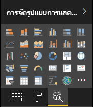

# <a name="the-analytics-pane-in-power-bi-visuals"></a><span data-ttu-id="ec8b6-104">บานหน้าต่างการวิเคราะห์ในวิชวล Power BI</span><span class="sxs-lookup"><span data-stu-id="ec8b6-104">The Analytics pane in Power BI visuals</span></span>

<span data-ttu-id="ec8b6-105">บานหน้าต่าง **การวิเคราะห์** ถูกนำมาใช้สำหรับ [วิชวลแบบเนทีฟ](../../transform-model/desktop-analytics-pane.md) ในเดือนพฤศจิกายน 2018</span><span class="sxs-lookup"><span data-stu-id="ec8b6-105">The **Analytics** pane was introduced for [native visuals](../../transform-model/desktop-analytics-pane.md) in November 2018.</span></span>
<span data-ttu-id="ec8b6-106">บทความนี้อธิบายถึงวิธีการที่วิชวล Power BI ที่มี API v2.5.0 สามารถแสดงและจัดการคุณสมบัติได้ในบานหน้าต่าง **การวิเคราะห์**</span><span class="sxs-lookup"><span data-stu-id="ec8b6-106">This article discusses how Power BI visuals with API v2.5.0 can present and manage their properties in the **Analytics** pane.</span></span>



## <a name="manage-the-analytics-pane"></a><span data-ttu-id="ec8b6-108">จัดการบานหน้าต่างการวิเคราะห์</span><span class="sxs-lookup"><span data-stu-id="ec8b6-108">Manage the Analytics pane</span></span>

<span data-ttu-id="ec8b6-109">เช่นเดียวกับที่คุณจัดการคุณสมบัติในบานหน้าต่าง [**รูปแบบ**](./custom-visual-develop-tutorial-format-options.md) คุณสามารถจัดการบานหน้าต่าง **การวิเคราะห์** โดยกำหนดวัตถุในไฟล์ *capabilities.json* ของวิชวลได้</span><span class="sxs-lookup"><span data-stu-id="ec8b6-109">Just as you'd manage properties in the [**Format** pane](./custom-visual-develop-tutorial-format-options.md), you manage the **Analytics** pane by defining an object in the visual's *capabilities.json* file.</span></span>

<span data-ttu-id="ec8b6-110">สำหรับบานหน้าต่าง **การวิเคราะห์** ความแตกต่างมีดังนี้:</span><span class="sxs-lookup"><span data-stu-id="ec8b6-110">For the **Analytics** pane, the differences are as follows:</span></span>

* <span data-ttu-id="ec8b6-111">ภายใต้คำจำกัดความของวัตถุ คุณเพิ่มเขตข้อมูล **objectCategory** ที่มีค่าเป็น 2</span><span class="sxs-lookup"><span data-stu-id="ec8b6-111">Under the object's definition, you add an **objectCategory** field with a value of 2.</span></span>

    > [!NOTE]
    > <span data-ttu-id="ec8b6-112">มีการนำเขตข้อมูล `objectCategory` แบบทางเลือกมาใช้ใน API 2.5.0</span><span class="sxs-lookup"><span data-stu-id="ec8b6-112">The optional `objectCategory` field was introduced in API 2.5.0.</span></span> <span data-ttu-id="ec8b6-113">ซึ่งจะกำหนดลักษณะของวิชวลที่ตัวควบคุมวัตถุ (1 = การจัดรูปแบบ 2 = การวิเคราะห์)</span><span class="sxs-lookup"><span data-stu-id="ec8b6-113">It defines the aspect of the visual that the object controls (1 = Formatting, 2 = Analytics).</span></span> <span data-ttu-id="ec8b6-114">`Formatting` ใช้สำหรับองค์ประกอบเช่น รูปลักษณ์และความรู้สึก สี แกน และป้ายกำกับ</span><span class="sxs-lookup"><span data-stu-id="ec8b6-114">`Formatting` is used for such elements as look and feel, colors, axes, and labels.</span></span> <span data-ttu-id="ec8b6-115">`Analytics` ใช้สำหรับองค์ประกอบเช่น การคาดการณ์ เส้นแนวโน้ม เส้นอ้างอิง และรูปร่าง</span><span class="sxs-lookup"><span data-stu-id="ec8b6-115">`Analytics` is used for such elements as forecasts, trendlines, reference lines, and shapes.</span></span>
    >
    > <span data-ttu-id="ec8b6-116">หากไม่ได้ระบุค่าไว้ `objectCategory` จะใช้ค่าเริ่มต้นเป็น "การจัดรูปแบบ"</span><span class="sxs-lookup"><span data-stu-id="ec8b6-116">If the value isn't specified, `objectCategory` defaults to "Formatting."</span></span>

* <span data-ttu-id="ec8b6-117">วัตถุจะต้องมีคุณสมบัติสองประการต่อไปนี้:</span><span class="sxs-lookup"><span data-stu-id="ec8b6-117">The object must have the following two properties:</span></span>
    * <span data-ttu-id="ec8b6-118">`show` ของชนิด `bool` โดยมีค่าเริ่มต้นคือ `false`</span><span class="sxs-lookup"><span data-stu-id="ec8b6-118">`show` of type `bool`, with a default value of `false`.</span></span>
    * <span data-ttu-id="ec8b6-119">`displayName` ของชนิด `text`</span><span class="sxs-lookup"><span data-stu-id="ec8b6-119">`displayName` of type `text`.</span></span> <span data-ttu-id="ec8b6-120">ค่าเริ่มต้นที่คุณเลือกจะกลายเป็นชื่อที่แสดงเริ่มต้นของอินสแตนซ์</span><span class="sxs-lookup"><span data-stu-id="ec8b6-120">The default value that you choose becomes the instance's initial display name.</span></span>

```json
{
  "objects": {
    "YourAnalyticsPropertiesCard": {
      "displayName": "Your analytics properties card's name",
      "objectCategory": 2,
      "properties": {
        "show": {
          "type": {
            "bool": true
          }
        },
        "displayName": {
          "type": {
            "text": true
          }
        },
      ... //any other properties for your Analytics card
      }
    }
  ...
  }
}
```

<span data-ttu-id="ec8b6-121">คุณสามารถกำหนดคุณสมบัติอื่น ๆ ในลักษณะเดียวกับที่คุณทำกับอ็อบเจ็กต์ **รูปแบบ**</span><span class="sxs-lookup"><span data-stu-id="ec8b6-121">You can define other properties in the same way that you do for **Format** objects.</span></span> <span data-ttu-id="ec8b6-122">และคุณสามารถแจกแจงอ็อบเจ็กต์ได้เช่นเดียวกับที่คุณทำในบานหน้าต่าง **รูปแบบ**</span><span class="sxs-lookup"><span data-stu-id="ec8b6-122">And you can enumerate objects just as you do in the **Format** pane.</span></span>

## <a name="known-limitations-and-issues-of-the-analytics-pane"></a><span data-ttu-id="ec8b6-123">ข้อจำกัดและปัญหาที่ทราบของบานหน้าต่าง การวิเคราะห์</span><span class="sxs-lookup"><span data-stu-id="ec8b6-123">Known limitations and issues of the Analytics pane</span></span>

* <span data-ttu-id="ec8b6-124">บานหน้าต่าง **การวิเคราะห์** ยังไม่มีการสนับสนุนหลายอินสแตนซ์</span><span class="sxs-lookup"><span data-stu-id="ec8b6-124">The **Analytics** pane has no multi-instance support yet.</span></span> <span data-ttu-id="ec8b6-125">อ็อบเจ็กต์ไม่สามารถมี [ตัวเลือก](https://microsoft.github.io/PowerBI-visuals/docs/concepts/objects-and-properties/#selector) นอกเหนือจากสแตติก (นั่นคือ "ตัวเลือก": เป็น null) และวิชวล Power BI ไม่สามารถมีอินสแตนซ์ของการ์ดที่ผู้ใช้กำหนดหลายรายการได้</span><span class="sxs-lookup"><span data-stu-id="ec8b6-125">Objects can't have a [selector](https://microsoft.github.io/PowerBI-visuals/docs/concepts/objects-and-properties/#selector) other than static (that is, "selector": null), and Power BI visuals can't have user-defined multiple instances of a card.</span></span>
* <span data-ttu-id="ec8b6-126">คุณสมบัติของชนิด `integer` แสดงอย่างไม่ถูกต้อง</span><span class="sxs-lookup"><span data-stu-id="ec8b6-126">Properties of type `integer` aren't displayed correctly.</span></span> <span data-ttu-id="ec8b6-127">เพื่อหลีกเลี่ยงปัญหา ให้ใช้ชนิด `numeric` แทน</span><span class="sxs-lookup"><span data-stu-id="ec8b6-127">As a workaround, use type `numeric` instead.</span></span>

> [!NOTE]
> * <span data-ttu-id="ec8b6-128">ใช้บานหน้าต่าง **การวิเคราะห์** เฉพาะสำหรับอ็อบเจ็กต์ที่เพิ่มข้อมูลใหม่หรือฉายแสงใหม่ในข้อมูลที่นำเสนอ (ตัวอย่างเช่น เส้นอ้างอิงแบบไดนามิกที่แสดงแนวโน้มที่สำคัญ)</span><span class="sxs-lookup"><span data-stu-id="ec8b6-128">Use the **Analytics** pane only for objects that add new information or shed new light on the presented information (for example, dynamic reference lines that illustrate important trends).</span></span>
> * <span data-ttu-id="ec8b6-129">ตัวเลือกใดก็ตามที่ควบคุมรูปลักษณ์และความรู้สึกของวิชวล (นั่นคือ การจัดรูปแบบ) ควรถูกจำกัดไว้ที่บานหน้าต่าง **การจัดรูปแบบ**</span><span class="sxs-lookup"><span data-stu-id="ec8b6-129">Any options that control the look and feel of the visual (that is, formatting) should be limited to the **Formatting** pane.</span></span>