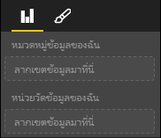

# <a name="capabilities-and-properties-of-power-bi-visuals"></a><span data-ttu-id="34ffb-104">ความสามารถและคุณสมบัติของวิชวล Power BI</span><span class="sxs-lookup"><span data-stu-id="34ffb-104">Capabilities and properties of Power BI visuals</span></span> 

<span data-ttu-id="34ffb-105">คุณใช้ความสามารถในการให้ข้อมูลกับโฮสต์เกี่ยวกับวิชวลของคุณ</span><span class="sxs-lookup"><span data-stu-id="34ffb-105">You use capabilities to provide information to the host about your visual.</span></span> <span data-ttu-id="34ffb-106">คุณสมบัติทั้งหมดบนแบบจำลองความสามารถเป็น `optional`</span><span class="sxs-lookup"><span data-stu-id="34ffb-106">All properties on the capabilities model are `optional`.</span></span>

<span data-ttu-id="34ffb-107">ออบเจ็กต์รูทของความสามารถของวิชวลคือ `dataRoles`, `dataViewMappings` และอื่น ๆ</span><span class="sxs-lookup"><span data-stu-id="34ffb-107">The root objects of a visual's capabilities are `dataRoles`, `dataViewMappings`, and so on.</span></span>

```json
{
    "dataRoles": [ ... ],
    "dataViewMappings": [ ... ],
    "objects":  { ... },
    "supportsHighlight": true|false,
    "advancedEditModeSupport": 0|1|2,
    "sorting": { ... }
}

```

## <a name="define-the-data-fields-that-your-visual-expects-dataroles"></a><span data-ttu-id="34ffb-108">กำหนดเขตข้อมูลที่วิชวลของคุณคาดหวัง: dataRoles</span><span class="sxs-lookup"><span data-stu-id="34ffb-108">Define the data fields that your visual expects: dataRoles</span></span>

<span data-ttu-id="34ffb-109">เพื่อกำหนดเขตข้อมูลที่สามารถผูกกับข้อมูล ให้คุณใช้ `dataRoles`</span><span class="sxs-lookup"><span data-stu-id="34ffb-109">To define fields that can be bound to data, you use `dataRoles`.</span></span> <span data-ttu-id="34ffb-110">`dataRoles` รับอาร์เรย์ของออบเจ็กต์ `DataViewRole` ซึ่งกำหนดคุณสมบัติที่จำเป็นทั้งหมด</span><span class="sxs-lookup"><span data-stu-id="34ffb-110">`dataRoles` takes an array of `DataViewRole` objects, which defines all the required properties.</span></span>

### <a name="properties"></a><span data-ttu-id="34ffb-111">คุณสมบัติ</span><span class="sxs-lookup"><span data-stu-id="34ffb-111">Properties</span></span>

* <span data-ttu-id="34ffb-112">**ชื่อ**: ชื่อภายในของเขตข้อมูลนี้ (ต้องไม่ซ้ำกัน)</span><span class="sxs-lookup"><span data-stu-id="34ffb-112">**name**: The internal name of this data field (must be unique).</span></span>
* <span data-ttu-id="34ffb-113">**ชนิด**: ชนิดของเขตข้อมูล:</span><span class="sxs-lookup"><span data-stu-id="34ffb-113">**kind**: The kind of field:</span></span>
    * <span data-ttu-id="34ffb-114">`Grouping`: ค่าไม่ต่อเนื่องที่ใช้ในการจัดกลุ่มเขตข้อมูลหน่วยวัด</span><span class="sxs-lookup"><span data-stu-id="34ffb-114">`Grouping`: Discrete values that are used to group measure fields.</span></span>
    * <span data-ttu-id="34ffb-115">`Measure`: ค่าข้อมูลตัวเลข</span><span class="sxs-lookup"><span data-stu-id="34ffb-115">`Measure`: Numeric data values.</span></span>
    * <span data-ttu-id="34ffb-116">`GroupingOrMeasure`: ค่าที่สามารถใช้เป็นการจัดกลุ่มหรือหน่วยวัด</span><span class="sxs-lookup"><span data-stu-id="34ffb-116">`GroupingOrMeasure`: Values that can be used as either a grouping or a measure.</span></span>
* <span data-ttu-id="34ffb-117">**displayName**: ชื่อที่แสดงให้กับผู้ใช้ในบานหน้าต่าง **คุณสมบัติ**</span><span class="sxs-lookup"><span data-stu-id="34ffb-117">**displayName**: The name displayed to the user in the **Properties** pane.</span></span>
* <span data-ttu-id="34ffb-118">**คำอธิบาย**: คำอธิบายแบบสั้นของเขตข้อมูล (เป็นทางเลือก)</span><span class="sxs-lookup"><span data-stu-id="34ffb-118">**description**: A short description of the field (optional).</span></span>
* <span data-ttu-id="34ffb-119">**requiredTypes**: ชนิดของข้อมูลที่จำเป็นสำหรับบทบาทข้อมูลนี้</span><span class="sxs-lookup"><span data-stu-id="34ffb-119">**requiredTypes**: The required type of data for this data role.</span></span> <span data-ttu-id="34ffb-120">ค่าที่ไม่ตรงกันถูกตั้งค่าเป็น null (เป็นทางเลือก)</span><span class="sxs-lookup"><span data-stu-id="34ffb-120">Values that don't match are set to null (optional).</span></span>
* <span data-ttu-id="34ffb-121">**preferredTypes**: ชนิดของข้อมูลที่ต้องการสำหรับบทบาทข้อมูลนี้ (เป็นทางเลือก)</span><span class="sxs-lookup"><span data-stu-id="34ffb-121">**preferredTypes**: The preferred type of data for this data role (optional).</span></span>

### <a name="valid-data-types-in-requiredtypes-and-preferredtypes"></a><span data-ttu-id="34ffb-122">ชนิดข้อมูลที่ถูกต้องใน requiredTypes และ preferredTypes</span><span class="sxs-lookup"><span data-stu-id="34ffb-122">Valid data types in requiredTypes and preferredTypes</span></span>

* <span data-ttu-id="34ffb-123">**bool**: ค่าบูลีน</span><span class="sxs-lookup"><span data-stu-id="34ffb-123">**bool**: A boolean value</span></span>
* <span data-ttu-id="34ffb-124">**integer**: ค่าจำนวนเต็ม (จำนวนเต็ม)</span><span class="sxs-lookup"><span data-stu-id="34ffb-124">**integer**: An integer (whole number) value</span></span>
* <span data-ttu-id="34ffb-125">**numeric**: ค่าตัวเลข</span><span class="sxs-lookup"><span data-stu-id="34ffb-125">**numeric**: A numeric value</span></span>
* <span data-ttu-id="34ffb-126">**text**: ค่าข้อความ</span><span class="sxs-lookup"><span data-stu-id="34ffb-126">**text**: A text value</span></span>
* <span data-ttu-id="34ffb-127">**geography**: ข้อมูลทางภูมิศาสตร์</span><span class="sxs-lookup"><span data-stu-id="34ffb-127">**geography**: A geographic data</span></span>

### <a name="example"></a><span data-ttu-id="34ffb-128">ตัวอย่าง</span><span class="sxs-lookup"><span data-stu-id="34ffb-128">Example</span></span>

```json
"dataRoles": [
    {
        "displayName": "My Category Data",
        "name": "myCategory",
        "kind": "Grouping",
        "requiredTypes": [
            {
                "text": true
            },
            {
                "numeric": true
            },
            {
                "integer": true
            }
        ],
        "preferredTypes": [
            {
                "text": true
            }
        ]
    },
    {
        "displayName": "My Measure Data",
        "name": "myMeasure",
        "kind": "Measure",
        "requiredTypes": [
            {
                "integer": true
            },
            {
                "numeric": true
            }
        ],
        "preferredTypes": [
            {
                "integer": true
            }
        ]
    },
    {
        "displayNameKey": "Visual_Location",
        "name": "Locations",
        "kind": "Measure",
        "displayName": "Locations",
        "requiredTypes": [
            {
                "geography": {
                    "address": true
                }
            },
            {
                "geography": {
                    "city": true
                }
            },
            {
                "geography": {
                    "continent": true
                }
            },
            {
                "geography": {
                    "country": true
                }
            },
            {
                "geography": {
                    "county": true
                }
            },
            {
                "geography": {
                    "place": true
                }
            },
            {
                "geography": {
                    "postalCode": true
                }
            },
            {
                "geography": {
                    "region": true
                }
            },
            {
                "geography": {
                    "stateOrProvince": true
                }
            }
        ]
    }
]
```

<span data-ttu-id="34ffb-129">บทบาทข้อมูลก่อนหน้านี้จะสร้างเขตข้อมูลที่แสดงในรูปภาพต่อไปนี้:</span><span class="sxs-lookup"><span data-stu-id="34ffb-129">The preceding data roles would create the fields that are displayed in the following image:</span></span>



## <a name="define-how-you-want-the-data-mapped-dataviewmappings"></a><span data-ttu-id="34ffb-131">กำหนดวิธีที่คุณต้องการแมปข้อมูล - dataViewMappings</span><span class="sxs-lookup"><span data-stu-id="34ffb-131">Define how you want the data mapped: dataViewMappings</span></span>

<span data-ttu-id="34ffb-132">คุณสมบัติ DataViewMapping จะอธิบายว่าบทบาทข้อมูลเกี่ยวข้องกันอย่างไรและอนุญาตให้คุณระบุข้อกำหนดเงื่อนไขสำหรับบทบาทดังกล่าวได้</span><span class="sxs-lookup"><span data-stu-id="34ffb-132">A DataViewMappings property describes how the data roles relate to each other and allows you to specify conditional requirements for the them.</span></span>

<span data-ttu-id="34ffb-133">การแสดงภาพส่วนใหญ่ให้การแมปเดียวแต่คุณสามารถใส่หลาย dataViewMappings ได้</span><span class="sxs-lookup"><span data-stu-id="34ffb-133">Most visuals provide a single mapping, but you can provide multiple dataViewMappings.</span></span> <span data-ttu-id="34ffb-134">การแมปที่ถูกต้องแต่ละครั้งจะสร้างมุมมองข้อมูล</span><span class="sxs-lookup"><span data-stu-id="34ffb-134">Each valid mapping produces a data view.</span></span> 

```json
"dataViewMappings": [
    {
        "conditions": [ ... ],
        "categorical": { ... },
        "table": { ... },
        "single": { ... },
        "matrix": { ... }
    }
]
```

<span data-ttu-id="34ffb-135">สำหรับข้อมูลเพิ่มเติม โปรดดูที่ [ทำความเข้าใจเกี่ยวกับการแมปมุมมองข้อมูลในวิชวล Power BI](dataview-mappings.md)</span><span class="sxs-lookup"><span data-stu-id="34ffb-135">For more information, see [Understand data view mapping in Power BI visuals](dataview-mappings.md).</span></span>

## <a name="define-property-pane-options-objects"></a><span data-ttu-id="34ffb-136">กำหนดตัวเลือกบานหน้าต่างคุณสมบัติ: ออบเจ็กต์</span><span class="sxs-lookup"><span data-stu-id="34ffb-136">Define property pane options: objects</span></span>

<span data-ttu-id="34ffb-137">ออบเจ็กต์อธิบายคุณสมบัติแบบปรับแต่งได้ที่เกี่ยวข้องกับวิชวล</span><span class="sxs-lookup"><span data-stu-id="34ffb-137">Objects describe customizable properties that are associated with the visual.</span></span> <span data-ttu-id="34ffb-138">ออบเจ็กต์แต่ละชนิดสามารถมีคุณสมบัติได้หลายรายการและแต่ละคุณสมบัติมีชนิดที่สัมพันธ์กัน</span><span class="sxs-lookup"><span data-stu-id="34ffb-138">Each object can have multiple properties, and each property has a type that's associated with it.</span></span> <span data-ttu-id="34ffb-139">ชนิดอ้างอิงถึงสิ่งที่คุณสมบัติจะเป็น</span><span class="sxs-lookup"><span data-stu-id="34ffb-139">Types refer to what the property will be.</span></span> 

```json
"objects": {
    "myCustomObject": {
        "displayName": "My Object Name",
        "properties": { ... }
    }
}
```

<span data-ttu-id="34ffb-140">สำหรับข้อมูลเพิ่มเติม โปรดดูที่ [ออบเจ็กต์และคุณสมบัติของวิชวล Power BI](objects-properties.md)</span><span class="sxs-lookup"><span data-stu-id="34ffb-140">For more information, see [Objects and properties of Power BI visuals](objects-properties.md).</span></span>

## <a name="handle-partial-highlighting-supportshighlight"></a><span data-ttu-id="34ffb-141">จัดการการเน้นบางส่วน: supportsHighlight</span><span class="sxs-lookup"><span data-stu-id="34ffb-141">Handle partial highlighting: supportsHighlight</span></span>

<span data-ttu-id="34ffb-142">ตามค่าเริ่มต้น ค่านี้จะถูกตั้งค่าเป็น `false` ซึ่งหมายความว่าค่าของคุณจะถูกกรองโดยอัตโนมัติเมื่อมีการเลือกบางสิ่งในหน้า</span><span class="sxs-lookup"><span data-stu-id="34ffb-142">By default, this value is set to `false`, which means that your values are automatically filtered when something on the page is selected.</span></span> <span data-ttu-id="34ffb-143">การกรองอัตโนมัตินี้จะอัปเดตวิชวลของคุณให้แสดงเฉพาะค่าที่เลือกเท่านั้น</span><span class="sxs-lookup"><span data-stu-id="34ffb-143">This automatic filtering in turn updates your visual to display only the selected value.</span></span> <span data-ttu-id="34ffb-144">หากคุณต้องการแสดงข้อมูลทั้งหมด แต่เน้นเฉพาะรายการที่คุณเลือกเท่านั้น คุณต้องตั้งค่า `supportsHighlight` เป็น `true` ในไฟล์ *capabilities.json* ของคุณ</span><span class="sxs-lookup"><span data-stu-id="34ffb-144">If you want to display the full data but highlight only the selected items, you need to set `supportsHighlight` to `true` in your *capabilities.json* file.</span></span>

<span data-ttu-id="34ffb-145">สำหรับข้อมูลเพิ่มเติม โปรดดูหัวข้อ [การเน้นจุดข้อมูลในวิชวล Power BI](highlight.md)</span><span class="sxs-lookup"><span data-stu-id="34ffb-145">For more information, see [Highlight data points in Power BI visuals](highlight.md).</span></span>

## <a name="handle-advanced-edit-mode-advancededitmodesupport"></a><span data-ttu-id="34ffb-146">จัดการโหมดแก้ไขขั้นสูง: advancedEditModeSupport</span><span class="sxs-lookup"><span data-stu-id="34ffb-146">Handle advanced edit mode: advancedEditModeSupport</span></span>

<span data-ttu-id="34ffb-147">วิชวลสามารถประกาศการสนับสนุนของโหมดแก้ไขขั้นสูงได้</span><span class="sxs-lookup"><span data-stu-id="34ffb-147">A visual can declare its support of advanced edit mode.</span></span> <span data-ttu-id="34ffb-148">ตามค่าเริ่มต้น วิชวลไม่สนับสนุนโหมดแก้ไขขั้นสูง เว้นแต่ว่าจะมีการระบุไว้เป็นอย่างอื่นในไฟล์ *capabilities.json*</span><span class="sxs-lookup"><span data-stu-id="34ffb-148">By default, a visual doesn't support advanced edit mode, unless stated otherwise in the *capabilities.json* file.</span></span>

<span data-ttu-id="34ffb-149">สำหรับข้อมูลเพิ่มเติม โปรดดูหัวข้อ [โหมดแก้ไขขั้นสูงในวิชวล Power BI](advanced-edit-mode.md)</span><span class="sxs-lookup"><span data-stu-id="34ffb-149">For more information, see [Advanced edit mode in Power BI visuals](advanced-edit-mode.md).</span></span>

## <a name="data-sorting-options-for-visual-sorting"></a><span data-ttu-id="34ffb-150">ตัวเลือกการเรียงลำดับข้อมูลสำหรับวิชวล: การเรียงลำดับ</span><span class="sxs-lookup"><span data-stu-id="34ffb-150">Data sorting options for visual: sorting</span></span>

<span data-ttu-id="34ffb-151">การแสดงผลด้วยภาพสามารถกำหนดพฤติกรรมการเรียงลำดับผ่านความสามารถ</span><span class="sxs-lookup"><span data-stu-id="34ffb-151">A visual can define its sorting behavior via its capabilities.</span></span> <span data-ttu-id="34ffb-152">ตามค่าเริ่มต้น วิชวลไม่รองรับการแก้ไขคำสั่งการเรียงลำดับเว้นแต่จะระบุไว้เป็นอย่างอื่นในไฟล์ *capabilities.json*</span><span class="sxs-lookup"><span data-stu-id="34ffb-152">By default, a visual doesn't support modifying its sorting order, unless stated otherwise in the *capabilities.json* file.</span></span>

<span data-ttu-id="34ffb-153">สำหรับข้อมูลเพิ่มเติม โปรดดูหัวข้อ [ตัวเลือกการเรียงลำดับสำหรับวิชวล Power BI](sort-options.md)</span><span class="sxs-lookup"><span data-stu-id="34ffb-153">For more information, see [Sorting options for Power BI visuals](sort-options.md).</span></span>
