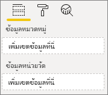
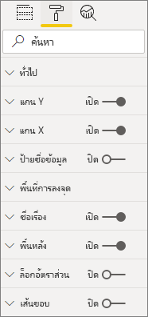
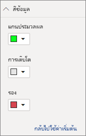

# <a name="build-a-bar-chart"></a><span data-ttu-id="911b2-104">สร้างแผนภูมิแท่ง</span><span class="sxs-lookup"><span data-stu-id="911b2-104">Build a bar chart</span></span>

<span data-ttu-id="911b2-105">บทความนี้เป็นคำแนะนำทีละขั้นตอนสำหรับการสร้างวิชวลแผนภูมิแท่ง Power BI ของตัวอย่างที่มีรหัส</span><span class="sxs-lookup"><span data-stu-id="911b2-105">This article is a step-by-step guide for building a sample Power BI bar chart visual with code.</span></span> <span data-ttu-id="911b2-106">คุณสามารถรับตัวอย่างรหัสที่เสร็จสมบูรณ์ได้ที่ [https://github.com/Microsoft/PowerBI-visuals-sampleBarChart](https://github.com/Microsoft/PowerBI-visuals-sampleBarChart)</span><span class="sxs-lookup"><span data-stu-id="911b2-106">You can get the complete code example at [https://github.com/Microsoft/PowerBI-visuals-sampleBarChart](https://github.com/Microsoft/PowerBI-visuals-sampleBarChart).</span></span>

## <a name="view-model"></a><span data-ttu-id="911b2-107">ดูแบบจำลอง</span><span class="sxs-lookup"><span data-stu-id="911b2-107">View model</span></span>
<span data-ttu-id="911b2-108">สิ่งสำคัญคือการกำหนดแบบจำลองมุมมองแผนภูมิแท่งก่อนและทำซ้ำกับการแสดงผลด้วยภาพของคุณในขณะที่คุณสร้าง</span><span class="sxs-lookup"><span data-stu-id="911b2-108">It's important to define the bar chart view model first, and iterate on what's exposed to your visual as you build it.</span></span>

```typescript
/**
 * Interface for BarCharts viewmodel.
 *
 * @interface
 * @property {BarChartDataPoint[]} dataPoints - Set of data points the visual will render.
 * @property {number} dataMax                 - Maximum data value in the set of data points.
 */
interface BarChartViewModel {
    dataPoints: BarChartDataPoint[];
    dataMax: number;
};

/**
 * Interface for BarChart data points.
 *
 * @interface
 * @property {number} value    - Data value for the point.
 * @property {string} category - Corresponding category of the data value.
 */
interface BarChartDataPoint {
    value: number;
    category: string;
};
```

### <a name="use-static-data"></a><span data-ttu-id="911b2-109">ใช้ข้อมูลแบบคงที่</span><span class="sxs-lookup"><span data-stu-id="911b2-109">Use static data</span></span>

<span data-ttu-id="911b2-110">การใช้ข้อมูลแบบคงที่เป็นวิธีที่ยอดเยี่ยมในการทดสอบวิชวลของคุณโดยไม่มีการผูกข้อมูล</span><span class="sxs-lookup"><span data-stu-id="911b2-110">Using static data is a great way to test your visual without data binding.</span></span> <span data-ttu-id="911b2-111">แบบจำลองมุมมองของคุณจะไม่เปลี่ยนแปลงแม้หลังจากที่คุณเพิ่มการผูกข้อมูลในขั้นตอนถัดไป</span><span class="sxs-lookup"><span data-stu-id="911b2-111">Your view model won't change, even after you add data binding in a later step.</span></span>

```typescript
let testData: BarChartDataPoint[] = [
    {
        value: 10,
        category: 'a'
    },
    {
        value: 20,
        category: 'b'
    },
    {
        value: 1,
        category: 'c'
    },
    {
        value: 100,
        category: 'd'
    },
    {
        value: 500,
        category: 'e'
    }];

let viewModel: BarChartViewModel = {
    dataPoints: testData,
    dataMax: d3.max(testData.map((dataPoint) => dataPoint.value))
};
```

## <a name="data-binding"></a><span data-ttu-id="911b2-112">การผูกข้อมูล</span><span class="sxs-lookup"><span data-stu-id="911b2-112">Data binding</span></span> 
<span data-ttu-id="911b2-113">คุณเพิ่มการผูกข้อมูลโดยการกำหนดความสามารถในการแสดงผลด้วยภาพของคุณใน *capabilities.json*</span><span class="sxs-lookup"><span data-stu-id="911b2-113">You add data binding by defining your visual capabilities in *capabilities.json*.</span></span> <span data-ttu-id="911b2-114">โค้ดตัวอย่างมี schema ให้คุณใช้อยู่แล้ว</span><span class="sxs-lookup"><span data-stu-id="911b2-114">The sample code already has a schema for you to use.</span></span>

<span data-ttu-id="911b2-115">การผูกข้อมูลทำงานบน **เขตข้อมูล** ได้ดีใน Power BI</span><span class="sxs-lookup"><span data-stu-id="911b2-115">Data binding acts on a **Field** well in Power BI.</span></span>



### <a name="add-data-roles"></a><span data-ttu-id="911b2-117">เพิ่มบทบาทข้อมูล</span><span class="sxs-lookup"><span data-stu-id="911b2-117">Add data roles</span></span>
<span data-ttu-id="911b2-118">โค้ดตัวอย่างมีบทบาทข้อมูลอยู่แล้วแต่คุณสามารถกำหนดค่าได้</span><span class="sxs-lookup"><span data-stu-id="911b2-118">The sample code already has data roles, but you can customize them.</span></span>

- <span data-ttu-id="911b2-119">`displayName` ชื่อที่แสดงใน **เขตข้อมูล** ได้เป็นอย่างดี</span><span class="sxs-lookup"><span data-stu-id="911b2-119">`displayName` is the name shown in the **Field** well.</span></span>
- <span data-ttu-id="911b2-120">`name` ชื่อภายในใช้เพื่ออ้างอิงถึงบทบาทข้อมูล</span><span class="sxs-lookup"><span data-stu-id="911b2-120">`name` is the internal name used to refer to the data role.</span></span>
- <span data-ttu-id="911b2-121">`kind` คือสำหรับชนิดของเขตข้อมูล</span><span class="sxs-lookup"><span data-stu-id="911b2-121">`kind` is for the kind of field.</span></span> <span data-ttu-id="911b2-122">*การจัดกลุ่ม* เขตข้อมูล (0) มีค่าที่ไม่ต่อเนื่อง</span><span class="sxs-lookup"><span data-stu-id="911b2-122">*Grouping* fields (0) have discrete values.</span></span> <span data-ttu-id="911b2-123">*หน่วยวัด* เขตข้อมูล (1) มีค่าข้อมูลตัวเลข</span><span class="sxs-lookup"><span data-stu-id="911b2-123">*Measure* fields (1) have numeric data values.</span></span>

```json
"dataRoles": [
    {
        "displayName": "Category Data",
        "name": "category",
        "kind": 0
    },
    {
        "displayName": "Measure Data",
        "name": "measure",
        "kind": 1
    }
],
```

<span data-ttu-id="911b2-124">สำหรับข้อมูลเพิ่มเติมให้ดู [บทบาทข้อมูล](./capabilities.md#define-the-data-fields-that-your-visual-expects-dataroles)</span><span class="sxs-lookup"><span data-stu-id="911b2-124">For more information, see [Data roles](./capabilities.md#define-the-data-fields-that-your-visual-expects-dataroles).</span></span>

### <a name="add-conditions-to-dataviewmapping"></a><span data-ttu-id="911b2-125">เพิ่มเงื่อนไขลงใน DataViewMapping</span><span class="sxs-lookup"><span data-stu-id="911b2-125">Add conditions to DataViewMapping</span></span>
<span data-ttu-id="911b2-126">กำหนดเงื่อนไขภายใน `dataViewMappings` ของคุณ   เพื่อตั้งค่าจำนวนเขตข้อมูลแต่ละเขตข้อมูลอย่างดีสามารถผูกได้</span><span class="sxs-lookup"><span data-stu-id="911b2-126">Define conditions within your `dataViewMappings` to set how many fields each field well can bind.</span></span> <span data-ttu-id="911b2-127">ใช้ `name` ภายในของบทบาทข้อมูลเพื่ออ้างอิงถึงแต่ละเขตข้อมูล</span><span class="sxs-lookup"><span data-stu-id="911b2-127">Use the data role's internal `name` to refer to each field.</span></span>

```json
    "dataViewMappings": [
        {
            "conditions": [
                {
                    "category": {
                        "max": 1
                    },
                    "measure": {
                        "max": 1
                    }
                }
            ],
        }
    ]
```

<span data-ttu-id="911b2-128">สำหรับข้อมูลเพิ่มเติมดู [การแมปมุมมองข้อมูล](./dataview-mappings.md)</span><span class="sxs-lookup"><span data-stu-id="911b2-128">For more information, see [Data view mapping](./dataview-mappings.md).</span></span>

### <a name="define-and-use-visualtransform"></a><span data-ttu-id="911b2-129">กำหนดและใช้ visualTransform</span><span class="sxs-lookup"><span data-stu-id="911b2-129">Define and use visualTransform</span></span>
<span data-ttu-id="911b2-130">`DataView` คือโครงสร้างที่ Power BI ให้ไปยังวิชวลของคุณซึ่งมีข้อมูลคิวรีที่จะแสดงภาพ</span><span class="sxs-lookup"><span data-stu-id="911b2-130">The `DataView` is the structure that Power BI provides to your visual, which contains the queried data to be visualized.</span></span> <span data-ttu-id="911b2-131">อย่างไรก็ตาม `DataView` สามารถให้ข้อมูลในฟอร์มที่แตกต่างกันเช่นประเภทและตาราง</span><span class="sxs-lookup"><span data-stu-id="911b2-131">However, `DataView` can provide data in different forms, such as categorical and tabular.</span></span> <span data-ttu-id="911b2-132">หากต้องการสร้างวิชวลประเภทเช่นแผนภูมิแท่งคุณจะต้องใช้คุณสมบัติประเภทบน `DataView`เท่านั้น</span><span class="sxs-lookup"><span data-stu-id="911b2-132">To build a categorical visual like a bar chart, you only need to use the categorical property on the `DataView`.</span></span> <span data-ttu-id="911b2-133">การกำหนด `visualTransform` ช่วยให้คุณสามารถแปลง `DataView` ลงในแบบจำลองมุมมองวิชวลของคุณจะใช้</span><span class="sxs-lookup"><span data-stu-id="911b2-133">Defining `visualTransform` lets you convert `DataView` into a view model your visual will use.</span></span>

<span data-ttu-id="911b2-134">เพื่อกำหนดสีและเลือกเมื่อกำหนดแต่ละจุดข้อมูล คุณใช้ `IVisualHost`</span><span class="sxs-lookup"><span data-stu-id="911b2-134">To assign colors and select them when defining individual data points, you use `IVisualHost`.</span></span> 

```typescript
/**
 * Function that converts queried data into a view model that will be used by the visual
 *
 * @function
 * @param {VisualUpdateOptions} options - Contains references to the size of the container
 *                                        and the dataView which contains all the data
 *                                        the visual had queried.
 * @param {IVisualHost} host            - Contains references to the host which contains services
 */
function visualTransform(options: VisualUpdateOptions, host: IVisualHost): BarChartViewModel {
    /*Convert dataView to your viewModel*/
}

```

## <a name="color"></a><span data-ttu-id="911b2-135">สี</span><span class="sxs-lookup"><span data-stu-id="911b2-135">Color</span></span> 
<span data-ttu-id="911b2-136">การแสดงสีเป็นหนึ่งในบริการที่พร้อมใช้งานบน `IVisualHost`</span><span class="sxs-lookup"><span data-stu-id="911b2-136">Color is exposed as one of the services available on `IVisualHost`.</span></span>

### <a name="add-color-to-data-points"></a><span data-ttu-id="911b2-137">เพิ่มสีไปยังจุดข้อมูล</span><span class="sxs-lookup"><span data-stu-id="911b2-137">Add color to data points</span></span>
<span data-ttu-id="911b2-138">สีที่แตกต่างกันแสดงแทนแต่ละจุดข้อมูล</span><span class="sxs-lookup"><span data-stu-id="911b2-138">Each data point is represented by a different color.</span></span> <span data-ttu-id="911b2-139">คุณเพิ่มสีไปยังอินเทอร์เฟซ `BarChartDataPoint`</span><span class="sxs-lookup"><span data-stu-id="911b2-139">You add color to the `BarChartDataPoint` interface.</span></span>

```typescript
/**
 * Interface for BarChart data points.
 *
 * @interface
 * @property {number} value    - Data value for the point.
 * @property {string} category - Corresponding category of the data value.
 * @property {string} color    - Color corresponding to the data point.
 */
interface BarChartDataPoint {
    value: number;
    category: string;
    color: string;
};
```

### <a name="the-colorpalette-service"></a><span data-ttu-id="911b2-140">บริการ colorPalette</span><span class="sxs-lookup"><span data-stu-id="911b2-140">The colorPalette service</span></span>
<span data-ttu-id="911b2-141">บริการ `colorPalette` จะจัดการสีที่ใช้ในวิชวลของคุณ</span><span class="sxs-lookup"><span data-stu-id="911b2-141">The `colorPalette` service manages the colors used in your visual.</span></span> <span data-ttu-id="911b2-142">อินสแตนซ์พร้อมใช้งานบน `IVisualHost`</span><span class="sxs-lookup"><span data-stu-id="911b2-142">Its instance is available on `IVisualHost`.</span></span>

### <a name="assign-color-to-data-points"></a><span data-ttu-id="911b2-143">เพิ่มสีไปยังจุดข้อมูล</span><span class="sxs-lookup"><span data-stu-id="911b2-143">Assign color to data points</span></span>
<span data-ttu-id="911b2-144">คุณได้กำหนด `visualTransform` เป็นตัวสร้างเพื่อแปลง `dataView` เป็นแบบจำลองมุมมองที่แผนภูมิแท่งสามารถใช้ได้</span><span class="sxs-lookup"><span data-stu-id="911b2-144">You defined `visualTransform` as a construct to convert `dataView` to a view model that a bar chart can use.</span></span> <span data-ttu-id="911b2-145">เนื่องจากคุณทำซ้ำจุดข้อมูลใน `visualTransform`ซึ่งเป็นสถานที่ที่เหมาะสำหรับการกำหนดสี</span><span class="sxs-lookup"><span data-stu-id="911b2-145">Because you iterate through the data points in `visualTransform`, it's also the ideal place to assign colors.</span></span>

```typescript
let colorPalette: IColorPalette = host.colorPalette; // host: IVisualHost
for (let i = 0, len = Math.max(category.values.length, dataValue.values.length); i < len; i++) {
    barChartDataPoints.push({
        category: category.values[i],
        value: dataValue.values[i],
        color: colorPalette.getColor(category.values[i]).value,
    });
}
```

## <a name="selection-and-interactions"></a><span data-ttu-id="911b2-146">การเลือกและการโต้ตอบ</span><span class="sxs-lookup"><span data-stu-id="911b2-146">Selection and interactions</span></span>
<span data-ttu-id="911b2-147">การเลือกช่วยให้ผู้ใช้สามารถโต้ตอบกับวิชวลของคุณและวิชวลอื่นๆได้</span><span class="sxs-lookup"><span data-stu-id="911b2-147">Selection lets the user interact both with your visual and other visuals.</span></span> 

### <a name="add-selection-to-each-data-point"></a><span data-ttu-id="911b2-148">เพิ่มการเลือกไปยังแต่ละจุดข้อมูล</span><span class="sxs-lookup"><span data-stu-id="911b2-148">Add selection to each data point</span></span>
<span data-ttu-id="911b2-149">เนื่องจากแต่ละจุดข้อมูลไม่ซ้ำกันให้เพิ่มการเลือกลงในแต่ละจุดข้อมูล</span><span class="sxs-lookup"><span data-stu-id="911b2-149">Since each data point is unique, add selection to each data point.</span></span> <span data-ttu-id="911b2-150">คุณเพิ่มคุณสมบัติการเลือกบนอินเทอร์เฟซ `BarChartDataPoint`</span><span class="sxs-lookup"><span data-stu-id="911b2-150">You add the selection property on the `BarChartDataPoint` interface.</span></span>

```typescript
/**
 * Interface for BarChart data points.
 *
 * @interface
 * @property {number} value             - Data value for the point.
 * @property {string} category          - Corresponding category of data value.
 * @property {string} color             - Color corresponding to data point.
 * @property {ISelectionId} selectionId - Id assigned to data point for cross filtering
 *                                        and visual interaction.
 */
interface BarChartDataPoint {
    value: number;
    category: string;
    color: string;
    selectionId: ISelectionId;
};
```

### <a name="assign-selection-ids-to-each-data-point"></a><span data-ttu-id="911b2-151">กำหนด ID การเลือกให้กับแต่ละจุดข้อมูล</span><span class="sxs-lookup"><span data-stu-id="911b2-151">Assign selection IDs to each data point</span></span>
<span data-ttu-id="911b2-152">เนื่องจากคุณทำซ้ำจุดข้อมูลใน `visualTransform`ซึ่งเป็นสถานที่ที่เหมาะในการสร้าง ID การเลือก</span><span class="sxs-lookup"><span data-stu-id="911b2-152">Since you iterate through the data points in `visualTransform`, it's also the ideal place to create selection IDs.</span></span> <span data-ttu-id="911b2-153">ตัวแปรโฮสต์คือ `IVisualHost`ซึ่งประกอบด้วยบริการที่วิชวลอาจใช้เช่นตัวสร้างสีและการเลือก</span><span class="sxs-lookup"><span data-stu-id="911b2-153">The host variable is an `IVisualHost`, which contains services that the visual may use, such as color and selection builder.</span></span> 

<span data-ttu-id="911b2-154">ใช้วิธีการ `createSelectionIdBuilder` โรงงานบน `IVisualHost` เพื่อสร้างรหัสการเลือกใหม่</span><span class="sxs-lookup"><span data-stu-id="911b2-154">Use the `createSelectionIdBuilder` factory method on `IVisualHost` to create a new selection ID.</span></span> <span data-ttu-id="911b2-155">สร้างตัวสร้างการเลือกใหม่สำหรับแต่ละจุดข้อมูล</span><span class="sxs-lookup"><span data-stu-id="911b2-155">Create a new selection builder for each data point.</span></span>

<span data-ttu-id="911b2-156">เนื่องจากคุณกำลังทำการเลือกตามหมวดหมู่เท่านั้นคุณจำเป็นต้องกำหนด `withCategory`การเลือกเท่านั้น</span><span class="sxs-lookup"><span data-stu-id="911b2-156">Since you're making selections based only on the category, you only need to define selections `withCategory`.</span></span>

```typescript
for (let i = 0, len = Math.max(category.values.length, dataValue.values.length); i < len; i++) {
    barChartDataPoints.push({
        category: category.values[i],
        value: dataValue.values[i],
        color: colorPalette.getColor(category.values[i]).value,
        selectionId: host.createSelectionIdBuilder()
            .withCategory(category, i)
            .createSelectionId()
    });
}
```

<span data-ttu-id="911b2-157">สำหรับข้อมูลเพิ่มเติม ดู [สร้างอินสแตนซ์ของตัวสร้างการเลือก](./selection-api.md#create-an-instance-of-the-selection-builder)</span><span class="sxs-lookup"><span data-stu-id="911b2-157">For more information, see [Create an instance of the selection builder](./selection-api.md#create-an-instance-of-the-selection-builder).</span></span>

### <a name="interact-with-data-points"></a><span data-ttu-id="911b2-158">โต้ตอบกับจุดข้อมูล</span><span class="sxs-lookup"><span data-stu-id="911b2-158">Interact with data points</span></span>
<span data-ttu-id="911b2-159">คุณสามารถโต้ตอบกับแผนภูมิแท่งแต่ละแท่งเมื่อมีการกำหนดรหัสการเลือกให้กับจุดข้อมูล</span><span class="sxs-lookup"><span data-stu-id="911b2-159">You can interact with each bar of the bar chart once a selection ID is assigned to the data point.</span></span> <span data-ttu-id="911b2-160">แผนภูมิแท่งจะฟังเหตุการณ์ `click`</span><span class="sxs-lookup"><span data-stu-id="911b2-160">The bar chart listens to `click` events.</span></span>

<span data-ttu-id="911b2-161">ใช้วิธีการ `selectionManager` โรงงานบน `IVisualHost` เพื่อสร้างตัวจัดการการเลือกสำหรับการกรองข้ามและการเลือกการล้างข้อมูล</span><span class="sxs-lookup"><span data-stu-id="911b2-161">Use the `selectionManager` factory method on `IVisualHost` to create a selection manager for cross filtering and clearing selections.</span></span>

```typescript
let selectionManager = this.selectionManager;

//This must be an anonymous function instead of a lambda because
//d3 uses 'this' as the reference to the element that was clicked.
bars.on('click', function(d) {
    selectionManager.select(d.selectionId).then((ids: ISelectionId[]) => {
        bars.attr({
            'fill-opacity': ids.length > 0 ? BarChart.Config.transparentOpacity : BarChart.Config.solidOpacity
        });

        d3.select(this).attr({
            'fill-opacity': BarChart.Config.solidOpacity
        });
    });

    (<Event>d3.event).stopPropagation();
});
```

<span data-ttu-id="911b2-162">สำหรับข้อมูลเพิ่มเติมให้ดู [วิธีการใช้ SelectionManager](./selection-api.md#how-to-use-selectionmanager-to-select-data-points)</span><span class="sxs-lookup"><span data-stu-id="911b2-162">For more information, see [How to use SelectionManager](./selection-api.md#how-to-use-selectionmanager-to-select-data-points).</span></span>

## <a name="static-objects"></a><span data-ttu-id="911b2-163">วัตถุคงที่</span><span class="sxs-lookup"><span data-stu-id="911b2-163">Static objects</span></span>

<span data-ttu-id="911b2-164">คุณสามารถเพิ่มวัตถุลงในบานหน้าต่าง **คุณสมบัติ** เพื่อปรับแต่งวิชวลได้</span><span class="sxs-lookup"><span data-stu-id="911b2-164">You can add objects to the **Property** pane to further customize the visual.</span></span> <span data-ttu-id="911b2-165">การกำหนดเองเหล่านี้อาจเป็นการเปลี่ยนแปลงส่วนติดต่อผู้ใช้หรือการเปลี่ยนแปลงที่เกี่ยวข้องกับข้อมูลที่มีคิวรี</span><span class="sxs-lookup"><span data-stu-id="911b2-165">These customizations can be user interface changes, or changes related to the data that was queried.</span></span> <span data-ttu-id="911b2-166">ตัวอย่างใช้วัตถุแบบคงที่เพื่อแสดงแกน X สำหรับแผนภูมิแท่ง</span><span class="sxs-lookup"><span data-stu-id="911b2-166">The sample uses static objects to render the X-axis for the bar chart.</span></span>

<span data-ttu-id="911b2-167">คุณสามารถสลับเปิดวัตถุหรือปิดในบานหน้าต่าง **คุณสมบัติ**</span><span class="sxs-lookup"><span data-stu-id="911b2-167">You can toggle objects on or off in the **Property** pane.</span></span>



### <a name="define-objects-in-capabilities"></a><span data-ttu-id="911b2-169">กำหนดวัตถุในความสามารถ</span><span class="sxs-lookup"><span data-stu-id="911b2-169">Define objects in capabilities</span></span>
<span data-ttu-id="911b2-170">กำหนดคุณสมบัติ `objects` ภายในไฟล์ capabilities.json *ของคุณ*  สำหรับวัตถุที่จะแสดงในบานหน้าต่าง **คุณสมบัติ**</span><span class="sxs-lookup"><span data-stu-id="911b2-170">Define an `objects` property inside your *capabilities.json* file for objects to display in the **Property** pane.</span></span>
- <span data-ttu-id="911b2-171">`enableAxis` คือชื่อภายในที่ `dataView` การอ้างอิง</span><span class="sxs-lookup"><span data-stu-id="911b2-171">`enableAxis` is the internal name that the `dataView` references.</span></span> 
- <span data-ttu-id="911b2-172">`displayName` ชื่อที่แสดงในบานหน้าต่าง **คุณสมบัติ**</span><span class="sxs-lookup"><span data-stu-id="911b2-172">`displayName` is the name shown on the **Property** pane.</span></span>
- <span data-ttu-id="911b2-173">`bool` เป็นค่าดั้งเดิมที่ใช้โดยทั่วไปกับวัตถุคงที่เช่นกล่องข้อความหรือสลับ</span><span class="sxs-lookup"><span data-stu-id="911b2-173">`bool` is a primitive value that is typically used with static objects, such as text boxes or switches.</span></span>
- <span data-ttu-id="911b2-174">`show` เป็นคุณสมบัติพิเศษบน `properties` ที่เปิดใช้งาน `show` สลับไปยังวัตถุ</span><span class="sxs-lookup"><span data-stu-id="911b2-174">`show` is a special property on `properties` that enables the `show` switch on the object.</span></span> <span data-ttu-id="911b2-175">เนื่องจาก `show` คือสวิตช์จะถูกพิมพ์เป็น `bool`</span><span class="sxs-lookup"><span data-stu-id="911b2-175">Since `show` is a switch, it is typed as a `bool`.</span></span>


```typescript
"objects": {
    "enableAxis": {
        "displayName": "Enable Axis",
        "properties": {
            "show": {
                "displayName": "Enable Axis",
                "type": { "bool": true }
            }
        }
    }
}
```

<span data-ttu-id="911b2-177">สำหรับข้อมูลเพิ่มเติม ดู [วัตถุ](./objects-properties.md)</span><span class="sxs-lookup"><span data-stu-id="911b2-177">For more information, see [Objects](./objects-properties.md).</span></span>

### <a name="define-property-settings"></a><span data-ttu-id="911b2-178">กำหนดการตั้งค่าคุณสมบัติ</span><span class="sxs-lookup"><span data-stu-id="911b2-178">Define property settings</span></span>

<span data-ttu-id="911b2-179">ส่วนต่อไปนี้อธิบายหลักการพื้นฐานของการกำหนดการตั้งค่าคุณสมบัติ</span><span class="sxs-lookup"><span data-stu-id="911b2-179">The following sections describe the basic principles of defining property settings.</span></span> <span data-ttu-id="911b2-180">คุณยังสามารถใช้คลาสที่ยูทิลิตี้ที่กำหนดไว้ในแพคเกจ `powerbi-visuals-utils-dataviewutils` สำหรับกำหนดการตั้งค่าคุณสมบัติได้</span><span class="sxs-lookup"><span data-stu-id="911b2-180">You can also use the utility classes defined in the `powerbi-visuals-utils-dataviewutils` package for defining property settings.</span></span> <span data-ttu-id="911b2-181">สำหรับข้อมูลเพิ่มเติมให้ดูคู่มือและตัวอย่างสำหรับคลาส [DataViewObjectsParser](https://github.com/Microsoft/powerbi-visuals-utils-dataviewutils/blob/master/docs/api/data-view-objects-parser.md)</span><span class="sxs-lookup"><span data-stu-id="911b2-181">For more information, see the documentation and samples for the [DataViewObjectsParser](https://github.com/Microsoft/powerbi-visuals-utils-dataviewutils/blob/master/docs/api/data-view-objects-parser.md) class.</span></span>


<span data-ttu-id="911b2-182">แม้ว่าจะเป็นตัวเลือก แต่ก็เป็นการดีที่สุดที่จะจำกัด การตั้งค่าส่วนใหญ่ลงในวัตถุเดียวเพื่อการอ้างอิงได้ง่าย</span><span class="sxs-lookup"><span data-stu-id="911b2-182">Although optional, it's best to localize most settings onto a single object for easy reference.</span></span>

```typescript
/**
 * Interface for BarCharts viewmodel.
 *
 * @interface
 * @property {BarChartDataPoint[]} dataPoints - Set of data points the visual will render.
 * @property {number} dataMax                 - Maximum data value in the set of data points.
 * @property {BarChartSettings} settings      - Object property settings
 */
interface BarChartViewModel {
    dataPoints: BarChartDataPoint[];
    dataMax: number;
    settings: BarChartSettings;
};

/**
 * Interface for BarChart settings.
 *
 * @interface
 * @property "show" enableAxis - Object property that allows axis to be enabled.
 */
interface BarChartSettings {
    enableAxis: {
        show: boolean;
    };
}
```

### <a name="define-and-use-objectenumerationutility"></a><span data-ttu-id="911b2-183">กำหนดและใช้ ObjectEnumerationUtility</span><span class="sxs-lookup"><span data-stu-id="911b2-183">Define and use ObjectEnumerationUtility</span></span>
<span data-ttu-id="911b2-184">ค่าคุณสมบัติวัตถุจะพร้อมใช้งานในรูปแบบเมตาดาต้าบน `dataView`แต่ไม่มีบริการที่จะช่วยดึงข้อมูลคุณสมบัติเหล่านี้</span><span class="sxs-lookup"><span data-stu-id="911b2-184">Object property values are available as metadata on the `dataView`, but there's no service to help retrieve these properties.</span></span> <span data-ttu-id="911b2-185">`ObjectEnumerationUtility` คือชุดของฟังก์ชันคงที่ที่คุณสามารถใช้เพื่อดึงค่าวัตถุจาก `dataView`และสำหรับโครงการวิชวลอื่นๆ</span><span class="sxs-lookup"><span data-stu-id="911b2-185">`ObjectEnumerationUtility` is a set of static functions you can use to retrieve object values from the `dataView`, and for other visual projects.</span></span> <span data-ttu-id="911b2-186">`ObjectEnumerationUtility` เป็นตัวเลือกแต่ยอดเยี่ยมสำหรับการวนผ่าน `dataView` เพื่อเรียกใช้คุณสมบัติของวัตถุ</span><span class="sxs-lookup"><span data-stu-id="911b2-186">The `ObjectEnumerationUtility` is optional, but is great for iterating through the `dataView` to retrieve object properties.</span></span>

```typescript
/**
 * Gets property value for a particular object.
 *
 * @function
 * @param {DataViewObjects} objects - Map of defined objects.
 * @param {string} objectName       - Name of desired object.
 * @param {string} propertyName     - Name of desired property.
 * @param {T} defaultValue          - Default value of desired property.
 */
export function getValue<T>(objects: DataViewObjects, objectName: string, propertyName: string, defaultValue: T ): T {
    if(objects) {
        let object = objects[objectName];
        if(object) {
            let property: T = object[propertyName];
            if(property !== undefined) {
                return property;
            }
        }
    }
    return defaultValue;
}
```

<span data-ttu-id="911b2-187">ดู [objectEnumerationUtility.ts](https://github.com/Microsoft/PowerBI-visuals-sampleBarChart/blob/master/src/objectEnumerationUtility.ts) สำหรับรหัสแหล่งข้อมูล</span><span class="sxs-lookup"><span data-stu-id="911b2-187">See [objectEnumerationUtility.ts](https://github.com/Microsoft/PowerBI-visuals-sampleBarChart/blob/master/src/objectEnumerationUtility.ts) for source code.</span></span>

### <a name="retrieve-property-values-from-dataview"></a><span data-ttu-id="911b2-188">เรียกใช้ค่าคุณสมบัติจาก dataView</span><span class="sxs-lookup"><span data-stu-id="911b2-188">Retrieve property values from dataView</span></span>
<span data-ttu-id="911b2-189">`visualTransform` เป็นสถานที่ที่เหมาะสำหรับการจัดการแบบจำลองมุมมองของวิชวล</span><span class="sxs-lookup"><span data-stu-id="911b2-189">The `visualTransform` is the ideal place to manipulate the visual's view model.</span></span> <span data-ttu-id="911b2-190">หากต้องการใช้รูปแบบนี้ต่อให้ดึงข้อมูลคุณสมบัติของวัตถุจาก `dataView`</span><span class="sxs-lookup"><span data-stu-id="911b2-190">To continue this pattern, retrieve the object properties from the `dataView`.</span></span>

<span data-ttu-id="911b2-191">กำหนดสถานะเริ่มต้นของคุณสมบัติและใช้ `getValue` เพื่อดึงข้อมูลคุณสมบัติจาก `dataView`</span><span class="sxs-lookup"><span data-stu-id="911b2-191">Define the default state of the property, and use `getValue` to retrieve the property from the `dataView`.</span></span>

```typescript
let defaultSettings: BarChartSettings = {
    enableAxis: {
        show: false,
    }
};

let barChartSettings: BarChartSettings = {
    enableAxis: {
        show: getValue<boolean>(objects, 'enableAxis', 'show', defaultSettings.enableAxis.show),
    }
}
```

### <a name="populate-property-pane-with-enumerateobjectinstances"></a><span data-ttu-id="911b2-192">เติมพื้นที่ให้กับบานหน้าต่างคุณสมบัติด้วย enumerateObjectInstances</span><span class="sxs-lookup"><span data-stu-id="911b2-192">Populate Property pane with enumerateObjectInstances</span></span>
<span data-ttu-id="911b2-193">`enumerateObjectInstances` วิธีการที่เลือกได้บน `IVisual` ที่ระบุผ่านวัตถุทั้งหมดและวางในบานหน้าต่าง **คุณสมบัติ**</span><span class="sxs-lookup"><span data-stu-id="911b2-193">The `enumerateObjectInstances` optional method on `IVisual` enumerates through all objects and places them within the **Property** pane.</span></span> <span data-ttu-id="911b2-194">มีการเรียกใช้แต่ละวัตถุด้วย `enumerateObjectInstances`</span><span class="sxs-lookup"><span data-stu-id="911b2-194">Each object is called with `enumerateObjectInstances`.</span></span> <span data-ttu-id="911b2-195">ชื่อวัตถุพร้อมใช้งานบน `EnumerateVisualObjectInstancesOptions`</span><span class="sxs-lookup"><span data-stu-id="911b2-195">The object's name is available on `EnumerateVisualObjectInstancesOptions`.</span></span>

<span data-ttu-id="911b2-196">สำหรับแต่ละวัตถุ ให้กำหนดคุณสมบัติด้วยสถานะปัจจุบัน</span><span class="sxs-lookup"><span data-stu-id="911b2-196">For each object, define the property with its current state.</span></span>

```typescript
/**
 * Enumerates through the objects defined in the capabilities and adds the properties to the format pane
 *
 * @function
 * @param {EnumerateVisualObjectInstancesOptions} options - Map of defined objects
 */
public enumerateObjectInstances(options: EnumerateVisualObjectInstancesOptions): VisualObjectInstanceEnumeration {
    let objectName = options.objectName;
    let objectEnumeration: VisualObjectInstance[] = [];

    switch(objectName) {
        case 'enableAxis':
            objectEnumeration.push({
                objectName: objectName,
                properties: {
                    show: this.barChartSettings.enableAxis.show,
                },
                selector: null
            });
    };

    return objectEnumeration;
}
```

### <a name="control-property-update-logic"></a><span data-ttu-id="911b2-197">ตรรกะการอัปเดตคุณสมบัติตัวควบคุม</span><span class="sxs-lookup"><span data-stu-id="911b2-197">Control property update logic</span></span>
<span data-ttu-id="911b2-198">เมื่อเพิ่มวัตถุในบานหน้าต่าง **คุณสมบัติ**  แล้วแต่ละสวิตช์จะทริกเกอร์การอัปเดต</span><span class="sxs-lookup"><span data-stu-id="911b2-198">Once an object is added to the **Property** pane, each toggle triggers an update.</span></span> <span data-ttu-id="911b2-199">เพิ่มตรรกะวัตถุเฉพาะในบล็อก `if`:</span><span class="sxs-lookup"><span data-stu-id="911b2-199">Add specific object logic in `if` blocks:</span></span>

```typescript
if(settings.enableAxis.show) {
    let margins = BarChart.Config.margins;
    height -= margins.bottom;
}
```

## <a name="databound-objects"></a><span data-ttu-id="911b2-200">วัตถุ Databound</span><span class="sxs-lookup"><span data-stu-id="911b2-200">Databound objects</span></span>
<span data-ttu-id="911b2-201">วัตถุ Databound จะคล้ายกับวัตถุคงที่แต่โดยทั่วไปแล้วจะจัดการกับการเลือกข้อมูล</span><span class="sxs-lookup"><span data-stu-id="911b2-201">Databound objects are similar to static objects, but typically deal with data selection.</span></span> <span data-ttu-id="911b2-202">ตัวอย่างเช่นคุณสามารถเปลี่ยนสีที่เชื่อมโยงกับจุดข้อมูล</span><span class="sxs-lookup"><span data-stu-id="911b2-202">For example, you can change the color associated with the data point.</span></span>



### <a name="define-object-in-capabilities"></a><span data-ttu-id="911b2-204">กำหนดวัตถุในความสามารถ</span><span class="sxs-lookup"><span data-stu-id="911b2-204">Define object in capabilities</span></span>
<span data-ttu-id="911b2-205">คล้ายกับวัตถุคงที่ ให้กำหนดวัตถุอื่นใน *capabilities.json*</span><span class="sxs-lookup"><span data-stu-id="911b2-205">Similar to static objects, define another object in the *capabilities.json*.</span></span> 
- <span data-ttu-id="911b2-206">`colorSelector` คือชื่อภายในที่ `dataView` การอ้างอิง</span><span class="sxs-lookup"><span data-stu-id="911b2-206">`colorSelector` is the internal name that the `dataView` references.</span></span>
- <span data-ttu-id="911b2-207">`displayName` ชื่อที่แสดงในบานหน้าต่าง **คุณสมบัติ**</span><span class="sxs-lookup"><span data-stu-id="911b2-207">`displayName` is the name shown on the **Property** pane.</span></span>
- <span data-ttu-id="911b2-208">`fill` ไม่มีการเชื่อมโยงค่าวัตถุโครงสร้างกับชนิดดั้งเดิม</span><span class="sxs-lookup"><span data-stu-id="911b2-208">`fill` is a structural object value not associated with a primitive type.</span></span>

```typescript
"colorSelector": {
    "displayName": "Data Colors",
    "properties": {
        "fill": {
            "displayName": "Color",
            "type": {
                "fill": {
                    "solid": {
                        "color": true
                    }
                }
            }
        }
    }
}
```

<span data-ttu-id="911b2-209">สำหรับข้อมูลเพิ่มเติม ดู [วัตถุ](./objects-properties.md)</span><span class="sxs-lookup"><span data-stu-id="911b2-209">For more information, see [Objects](./objects-properties.md).</span></span>

### <a name="use-objectenumerationutility"></a><span data-ttu-id="911b2-210">ใช้ ObjectEnumerationUtility</span><span class="sxs-lookup"><span data-stu-id="911b2-210">Use ObjectEnumerationUtility</span></span>
<span data-ttu-id="911b2-211">เช่นเดียวกับวัตถุคงที่ คุณจำเป็นต้องเรียกรายละเอียดวัตถุจาก `dataView`</span><span class="sxs-lookup"><span data-stu-id="911b2-211">As with static objects, you need to retrieve object details from the `dataView`.</span></span> <span data-ttu-id="911b2-212">อย่างไรก็ตาม แทนที่ค่าวัตถุที่อยู่ภายในเมตาดาต้า ค่าวัตถุจะเชื่อมโยงกับแต่ละประเภท</span><span class="sxs-lookup"><span data-stu-id="911b2-212">However, instead of the object values being within metadata, the object values are associated with each category.</span></span>

```typescript
/**
 * Gets property value for a particular object in a category.
 *
 * @function
 * @param {DataViewCategoryColumn} category - List of category objects.
 * @param {number} index                    - Index of category object.
 * @param {string} objectName               - Name of desired object.
 * @param {string} propertyName             - Name of desired property.
 * @param {T} defaultValue                  - Default value of desired property.
 */
export function getCategoricalObjectValue<T>(category: DataViewCategoryColumn, index: number, objectName: string, propertyName: string, defaultValue: T): T {
    let categoryObjects = category.objects;

    if(categoryObjects) {
        let categoryObject: DataViewObject = categoryObjects[index];
        if(categoryObject) {
            let object = categoryObject[objectName];
            if(object) {
                let property: T = object[propertyName];
                if(property !== undefined) {
                    return property;
                }
            }
        }
    }
    return defaultValue;
}
```

<span data-ttu-id="911b2-213">ดู [objectEnumerationUtility.ts](https://github.com/Microsoft/PowerBI-visuals-sampleBarChart/blob/master/src/objectEnumerationUtility.ts) สำหรับรหัสแหล่งข้อมูล</span><span class="sxs-lookup"><span data-stu-id="911b2-213">See [objectEnumerationUtility.ts](https://github.com/Microsoft/PowerBI-visuals-sampleBarChart/blob/master/src/objectEnumerationUtility.ts) for source code.</span></span>

### <a name="define-default-color-and-retrieve-categorical-object-from-dataview"></a><span data-ttu-id="911b2-214">กำหนดสีเริ่มต้นและดึงวัตถุประเภทจาก dataView</span><span class="sxs-lookup"><span data-stu-id="911b2-214">Define default color and retrieve categorical object from dataView</span></span>
<span data-ttu-id="911b2-215">ในตอนนี้แต่ละสีจะเชื่อมโยงกับแต่ละประเภทภายใน `dataView`</span><span class="sxs-lookup"><span data-stu-id="911b2-215">Each color is now associated with each category inside `dataView`.</span></span> <span data-ttu-id="911b2-216">คุณสามารถตั้งค่าแต่ละจุดข้อมูลเป็นสีที่สอดคล้องกันได้</span><span class="sxs-lookup"><span data-stu-id="911b2-216">You can set each data point to its corresponding color.</span></span>

```typescript
for (let i = 0, len = Math.max(category.values.length, dataValue.values.length); i < len; i++) {
    let defaultColor: Fill = {
        solid: {
            color: colorPalette.getColor(category.values[i]).value
        }
    }

    barChartDataPoints.push({
        category: category.values[i],
        value: dataValue.values[i],
        color: getCategoricalObjectValue<Fill>(category, i, 'colorSelector', 'fill', defaultColor).solid.color,
        selectionId: host.createSelectionIdBuilder()
            .withCategory(category, i)
            .createSelectionId()
    });
}
```

### <a name="populate-property-pane-with-enumerateobjectinstances"></a><span data-ttu-id="911b2-217">เติมพื้นที่ให้กับบานหน้าต่างคุณสมบัติด้วย enumerateObjectInstances</span><span class="sxs-lookup"><span data-stu-id="911b2-217">Populate Property pane with enumerateObjectInstances</span></span>
<span data-ttu-id="911b2-218">ใช้ `enumerateObjectInstances` เพื่อเติมข้อมูลในบานหน้าต่าง **คุณสมบัติ** กับวัตถุ</span><span class="sxs-lookup"><span data-stu-id="911b2-218">Use `enumerateObjectInstances` to populate the **Property** pane with objects.</span></span> 

<span data-ttu-id="911b2-219">สำหรับอินสแตนซ์นี้ให้เพิ่มตัวเลือกสีเพื่อแสดงแต่ละประเภทในบานหน้าต่าง **คุณสมบัติ**</span><span class="sxs-lookup"><span data-stu-id="911b2-219">For this instance, add a color picker to render each category on the **Property** pane.</span></span> <span data-ttu-id="911b2-220">เมื่อต้องการทำเช่นนี้ให้เพิ่มกรณีเพิ่มเติมไปยังคำสั่ง `switch` สำหรับ `colorSelector`และทำซ้ำผ่านแต่ละจุดข้อมูลด้วยสีที่สัมพันธ์กัน</span><span class="sxs-lookup"><span data-stu-id="911b2-220">To do this, add an additional case to the `switch` statement for `colorSelector`, and iterate through each data point with the associated color.</span></span> 

<span data-ttu-id="911b2-221">จำเป็นต้องมีการเลือกเพื่อเชื่อมโยงสีกับจุดข้อมูล</span><span class="sxs-lookup"><span data-stu-id="911b2-221">Selection is required to associate the color with the data point.</span></span>

```typescript
/**
 * Enumerates through the objects defined in the capabilities and adds the properties to the format pane
 *
 * @function
 * @param {EnumerateVisualObjectInstancesOptions} options - Map of defined objects
 */
public enumerateObjectInstances(options: EnumerateVisualObjectInstancesOptions): VisualObjectInstanceEnumeration {
    let objectName = options.objectName;
    let objectEnumeration: VisualObjectInstance[] = [];

    switch(objectName) {
        case 'enableAxis':
            objectEnumeration.push({
                objectName: objectName,
                properties: {
                    show: this.barChartSettings.enableAxis.show,
                },
                selector: null
            });
            break;
        case 'colorSelector':
            for(let barDataPoint of this.barDataPoints) {
                objectEnumeration.push({
                    objectName: objectName,
                    displayName: barDataPoint.category,
                    properties: {
                        fill: {
                            solid: {
                                color: barDataPoint.color
                            }
                        }
                    },
                    selector: barDataPoint.selectionId.getSelector()
                });
            }
            break;
    };

    return objectEnumeration;
}
```

<span data-ttu-id="911b2-222">หลังจากให้ตัวเลือกสำหรับแต่ละคุณสมบัติคุณจะได้รับอาร์เรย์วัตถุ `dataView` ต่อไปนี้:</span><span class="sxs-lookup"><span data-stu-id="911b2-222">After providing a selector for each property, you get the following `dataView` object array:</span></span>


<span data-ttu-id="911b2-224">แต่ละรายการในอาร์เรย์ `dataViews[0].categorical.categories[0].objects` สอดคล้องกับประเภทที่เป็นรูปธรรมของชุดข้อมูล</span><span class="sxs-lookup"><span data-stu-id="911b2-224">Each item in the array `dataViews[0].categorical.categories[0].objects` corresponds to the concrete category of the dataset.</span></span>

<span data-ttu-id="911b2-225">ฟังก์ชัน `getCategoricalObjectValue` ให้วิธีที่สะดวกในการเข้าถึงคุณสมบัติตามดัชนีประเภท</span><span class="sxs-lookup"><span data-stu-id="911b2-225">The function `getCategoricalObjectValue` just provides a convenient way of accessing properties by their category index.</span></span> <span data-ttu-id="911b2-226">คุณต้องระบุ `objectName` และ `propertyName` ที่ตรงกับวัตถุและคุณสมบัติใน *capabilities.json*</span><span class="sxs-lookup"><span data-stu-id="911b2-226">You must provide an `objectName` and `propertyName` that match the object and property in *capabilities.json*.</span></span>

## <a name="other-features"></a><span data-ttu-id="911b2-227">คุณลักษณะอื่น ๆ</span><span class="sxs-lookup"><span data-stu-id="911b2-227">Other features</span></span> 
<span data-ttu-id="911b2-228">คุณสามารถเพิ่มตัวควบคุมแถบเลื่อนหรือคำแนะนำเครื่องมือไปยังแผนภูมิแท่ง</span><span class="sxs-lookup"><span data-stu-id="911b2-228">You can add a slider control or tooltips to the bar chart.</span></span> <span data-ttu-id="911b2-229">สำหรับรหัสที่จะเพิ่มดูการยอมรับที่ [เพิ่มแถบเลื่อนบานหน้าต่างคุณสมบัติเพื่อควบคุมความทึบ](https://github.com/Microsoft/PowerBI-visuals-sampleBarChart/commit/e2e0bc5888d9a3ca305a7a7af5046068645c8b30) และ [เพิ่มการรองรับสำหรับคำแนะนำเครื่องมือ](https://github.com/Microsoft/PowerBI-visuals-sampleBarChart/commit/981b021612d7b333adffe9f723ab27783c76fb14)</span><span class="sxs-lookup"><span data-stu-id="911b2-229">For the code to add, see the commits at [Add a property pane slider to control opacity](https://github.com/Microsoft/PowerBI-visuals-sampleBarChart/commit/e2e0bc5888d9a3ca305a7a7af5046068645c8b30) and [Add support for tooltips](https://github.com/Microsoft/PowerBI-visuals-sampleBarChart/commit/981b021612d7b333adffe9f723ab27783c76fb14).</span></span> <span data-ttu-id="911b2-230">สำหรับข้อมูลเพิ่มเติมเกี่ยวกับคำแนะนำเครื่องมือ ดู [คำแนะนำเครื่องมือในวิชวล Power BI](./add-tooltips.md)</span><span class="sxs-lookup"><span data-stu-id="911b2-230">For more information about tooltips, see [Tooltips in Power BI visuals](./add-tooltips.md).</span></span>

## <a name="packaging"></a><span data-ttu-id="911b2-231">การบรรจุ</span><span class="sxs-lookup"><span data-stu-id="911b2-231">Packaging</span></span>

<span data-ttu-id="911b2-232">ก่อนที่คุณสามารถโหลดวิชวลของคุณลงใน [Power BI Desktop](https://powerbi.microsoft.com/desktop/) หรือแชร์กับชุมชนใน [แกลเลอรีวิชวลของ Power BI](https://visuals.powerbi.com/) คุณต้องแพคเกจ</span><span class="sxs-lookup"><span data-stu-id="911b2-232">Before you can load your visual into [Power BI Desktop](https://powerbi.microsoft.com/desktop/) or share it with the community in the [Power BI Visual Gallery](https://visuals.powerbi.com/), you must package it.</span></span> <span data-ttu-id="911b2-233">นำทางไปยังโฟลเดอร์รากของโครงการวิชวลของคุณซึ่งประกอบด้วยไฟล์ *pbiviz.json* และใช้คำสั่งต่อไปนี้เพื่อสร้าง *ไฟล์* pbiviz:</span><span class="sxs-lookup"><span data-stu-id="911b2-233">Navigate to the root folder of your visual project, which contains the file *pbiviz.json*, and use the following command to generate a *pbiviz* file:</span></span>

```bash
pbiviz package
```
<span data-ttu-id="911b2-234">คำสั่งนี้สร้างไฟล์ *pbiviz* ในไดเรกทอรี *dist/* ของโครงการวิชวลของคุณและเขียนทับไฟล์ *pbiviz* ใดๆจากการดำเนินการของแพคเกจก่อนหน้านี้</span><span class="sxs-lookup"><span data-stu-id="911b2-234">This command creates a *pbiviz* file in the *dist/* directory of your visual project, and overwrites any *pbiviz* file from previous package operations.</span></span>

## <a name="next-steps"></a><span data-ttu-id="911b2-235">ขั้นตอนถัดไป</span><span class="sxs-lookup"><span data-stu-id="911b2-235">Next steps</span></span>
<span data-ttu-id="911b2-236">คุณสามารถเพิ่มความสามารถดังต่อไปนี้ลงในวิชวลของคุณ:</span><span class="sxs-lookup"><span data-stu-id="911b2-236">You can add the following abilities to your visual:</span></span>
* [<span data-ttu-id="911b2-237">เพิ่มเมนูบริบทลงในวิชวล</span><span class="sxs-lookup"><span data-stu-id="911b2-237">Add a context menu to a visual</span></span>](./context-menu.md)
* [<span data-ttu-id="911b2-238">หน้าเริ่มต้น</span><span class="sxs-lookup"><span data-stu-id="911b2-238">Landing page</span></span>](./landing-page.md)
* [<span data-ttu-id="911b2-239">เปิดใช้ URL</span><span class="sxs-lookup"><span data-stu-id="911b2-239">Launch URL</span></span>](./launch-url.md)
* [<span data-ttu-id="911b2-240">การสนับสนุนตำแหน่งที่ตั้ง</span><span class="sxs-lookup"><span data-stu-id="911b2-240">Locale support</span></span>](./localization.md)