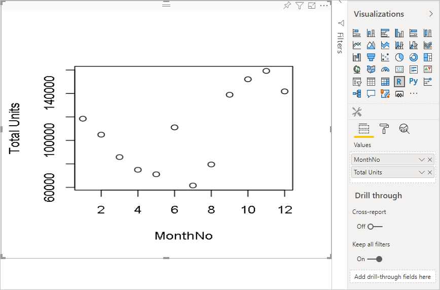
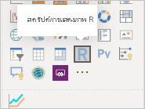
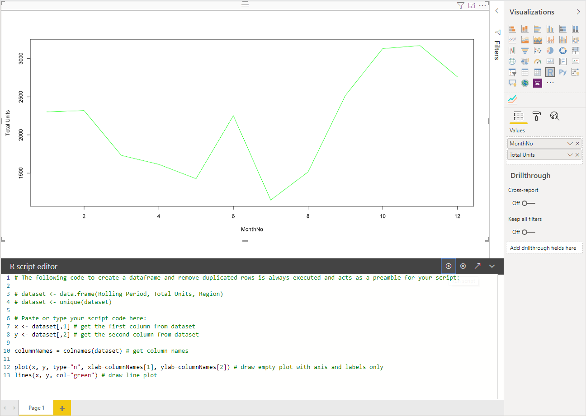
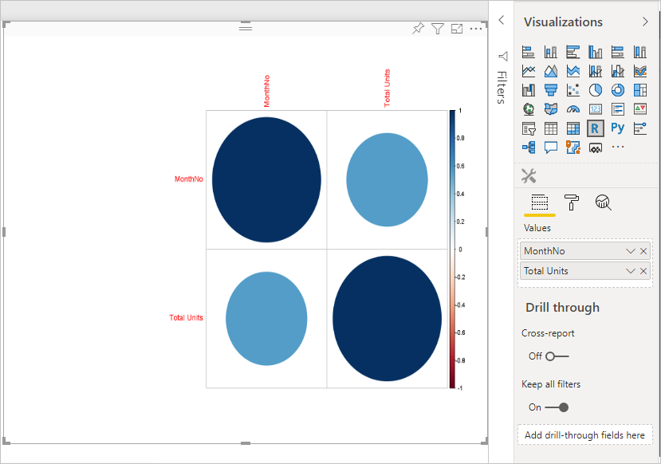
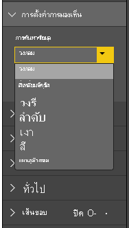
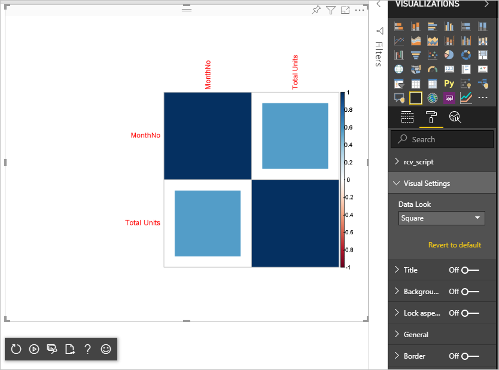

# <a name="tutorial-create-an-r-powered-power-bi-visual"></a><span data-ttu-id="0e6ba-104">บทช่วยสอน: สร้าง วิชวล Power BI แบบ R</span><span class="sxs-lookup"><span data-stu-id="0e6ba-104">Tutorial: Create an R-powered Power BI visual</span></span>

<span data-ttu-id="0e6ba-105">บทช่วยสอนนี้อธิบายถึงวิธีการสร้างวิชวลแบบ R สำหรับ Power BI</span><span class="sxs-lookup"><span data-stu-id="0e6ba-105">This tutorial describes how to create an R-powered visual for Power BI.</span></span>

<span data-ttu-id="0e6ba-106">ในบทช่วยสอนนี้ คุณจะเรียนรู้วิธีการ:</span><span class="sxs-lookup"><span data-stu-id="0e6ba-106">In this tutorial, you learn how to:</span></span>

> [!div class="checklist"]
>
> * <span data-ttu-id="0e6ba-107">สร้างวิชวลแบบ R</span><span class="sxs-lookup"><span data-stu-id="0e6ba-107">Create an R-powered visual</span></span>
> * <span data-ttu-id="0e6ba-108">แก้ไขวิชวลแบบ R ใน Power BI Desktop</span><span class="sxs-lookup"><span data-stu-id="0e6ba-108">Edit the R script in Power BI Desktop</span></span>
> * <span data-ttu-id="0e6ba-109">เพิ่มไลบรารีไปยังวิชวล</span><span class="sxs-lookup"><span data-stu-id="0e6ba-109">Add libraries to the visual</span></span>
> * <span data-ttu-id="0e6ba-110">เพิ่มคุณสมบัติแบบคงที่</span><span class="sxs-lookup"><span data-stu-id="0e6ba-110">Add a static property</span></span>

## <a name="prerequisites"></a><span data-ttu-id="0e6ba-111">ข้อกำหนดเบื้องต้น</span><span class="sxs-lookup"><span data-stu-id="0e6ba-111">Prerequisites</span></span>

* <span data-ttu-id="0e6ba-112">บัญชี **Power BI Pro**</span><span class="sxs-lookup"><span data-stu-id="0e6ba-112">A **Power BI Pro** account.</span></span> <span data-ttu-id="0e6ba-113">[ลงทะเบียนทดลองใช้ฟรี](https://powerbi.microsoft.com/pricing/) ก่อนที่คุณจะเริ่มต้น</span><span class="sxs-lookup"><span data-stu-id="0e6ba-113">[Sign up for a free trial](https://powerbi.microsoft.com/pricing/) before you begin.</span></span>
* <span data-ttu-id="0e6ba-114">โปรแกรม R</span><span class="sxs-lookup"><span data-stu-id="0e6ba-114">The R engine.</span></span> <span data-ttu-id="0e6ba-115">คุณสามารถดาวน์โหลดและติดตั้งได้ฟรีจากตำแหน่งที่ตั้งต่างๆ ซึ่งรวมถึง [หน้าดาวน์โหลด Revolution Open](https://mran.revolutionanalytics.com/download/) และ [CRAN Repository](https://cran.r-project.org/bin/windows/base/)</span><span class="sxs-lookup"><span data-stu-id="0e6ba-115">You can download it free from many locations, including the [Revolution Open download page](https://mran.revolutionanalytics.com/download/) and the [CRAN Repository](https://cran.r-project.org/bin/windows/base/).</span></span> <span data-ttu-id="0e6ba-116">สำหรับข้อมูลเพิ่มเติมดู [สร้างวิชวล Power BI โดยใช้ภาษา R](../../create-reports/desktop-r-visuals.md)</span><span class="sxs-lookup"><span data-stu-id="0e6ba-116">For more information, see [Create Power BI visuals using R](../../create-reports/desktop-r-visuals.md).</span></span>
* <span data-ttu-id="0e6ba-117">[Power BI Desktop](../../fundamentals/desktop-get-the-desktop.md).</span><span class="sxs-lookup"><span data-stu-id="0e6ba-117">[Power BI Desktop](../../fundamentals/desktop-get-the-desktop.md).</span></span>
* <span data-ttu-id="0e6ba-118">[Windows PowerShell](/powershell/scripting/install/installing-windows-powershell) เวอร์ชัน 4 หรือใหม่กว่าสำหรับผู้ใช้ Windows หรือ [Terminal](https://macpaw.com/how-to/use-terminal-on-mac) สำหรับผู้ใช้ OSX</span><span class="sxs-lookup"><span data-stu-id="0e6ba-118">[Windows PowerShell](/powershell/scripting/install/installing-windows-powershell) version 4 or later for Windows users OR the [Terminal](https://macpaw.com/how-to/use-terminal-on-mac) for OSX users.</span></span>

## <a name="getting-started"></a><span data-ttu-id="0e6ba-119">เริ่มต้นใช้งาน</span><span class="sxs-lookup"><span data-stu-id="0e6ba-119">Getting started</span></span>

1. <span data-ttu-id="0e6ba-120">เตรียมข้อมูลตัวอย่างสำหรับวิชวล</span><span class="sxs-lookup"><span data-stu-id="0e6ba-120">Prepare sample data for the visual.</span></span> <span data-ttu-id="0e6ba-121">คุณสามารถบันทึกค่าเหล่านี้ลงในฐานข้อมูล Excel หรือไฟล์ *.csv* และนำเข้าไปยัง Power BI Desktop ได้</span><span class="sxs-lookup"><span data-stu-id="0e6ba-121">You can save these values to an Excel database or *.csv* file and import it into Power BI Desktop.</span></span>

    | <span data-ttu-id="0e6ba-122">MonthNo</span><span class="sxs-lookup"><span data-stu-id="0e6ba-122">MonthNo</span></span> | <span data-ttu-id="0e6ba-123">ผลรวมหน่วย</span><span class="sxs-lookup"><span data-stu-id="0e6ba-123">Total Units</span></span> |
    |-----|-----|
    | <span data-ttu-id="0e6ba-124">1</span><span class="sxs-lookup"><span data-stu-id="0e6ba-124">1</span></span> | <span data-ttu-id="0e6ba-125">2303</span><span class="sxs-lookup"><span data-stu-id="0e6ba-125">2303</span></span> |
    | <span data-ttu-id="0e6ba-126">2</span><span class="sxs-lookup"><span data-stu-id="0e6ba-126">2</span></span> | <span data-ttu-id="0e6ba-127">2319</span><span class="sxs-lookup"><span data-stu-id="0e6ba-127">2319</span></span> |
    | <span data-ttu-id="0e6ba-128">3</span><span class="sxs-lookup"><span data-stu-id="0e6ba-128">3</span></span> | <span data-ttu-id="0e6ba-129">1732</span><span class="sxs-lookup"><span data-stu-id="0e6ba-129">1732</span></span> |
    | <span data-ttu-id="0e6ba-130">4</span><span class="sxs-lookup"><span data-stu-id="0e6ba-130">4</span></span> | <span data-ttu-id="0e6ba-131">1615</span><span class="sxs-lookup"><span data-stu-id="0e6ba-131">1615</span></span> |
    | <span data-ttu-id="0e6ba-132">5</span><span class="sxs-lookup"><span data-stu-id="0e6ba-132">5</span></span> | <span data-ttu-id="0e6ba-133">1427</span><span class="sxs-lookup"><span data-stu-id="0e6ba-133">1427</span></span> |
    | <span data-ttu-id="0e6ba-134">6</span><span class="sxs-lookup"><span data-stu-id="0e6ba-134">6</span></span> | <span data-ttu-id="0e6ba-135">2253</span><span class="sxs-lookup"><span data-stu-id="0e6ba-135">2253</span></span> |
    | <span data-ttu-id="0e6ba-136">7</span><span class="sxs-lookup"><span data-stu-id="0e6ba-136">7</span></span> | <span data-ttu-id="0e6ba-137">1147</span><span class="sxs-lookup"><span data-stu-id="0e6ba-137">1147</span></span> |
    | <span data-ttu-id="0e6ba-138">8</span><span class="sxs-lookup"><span data-stu-id="0e6ba-138">8</span></span> | <span data-ttu-id="0e6ba-139">1515</span><span class="sxs-lookup"><span data-stu-id="0e6ba-139">1515</span></span> |
    | <span data-ttu-id="0e6ba-140">9</span><span class="sxs-lookup"><span data-stu-id="0e6ba-140">9</span></span> | <span data-ttu-id="0e6ba-141">2516</span><span class="sxs-lookup"><span data-stu-id="0e6ba-141">2516</span></span> |
    | <span data-ttu-id="0e6ba-142">10</span><span class="sxs-lookup"><span data-stu-id="0e6ba-142">10</span></span> | <span data-ttu-id="0e6ba-143">3131</span><span class="sxs-lookup"><span data-stu-id="0e6ba-143">3131</span></span> |
    | <span data-ttu-id="0e6ba-144">11</span><span class="sxs-lookup"><span data-stu-id="0e6ba-144">11</span></span> | <span data-ttu-id="0e6ba-145">3170</span><span class="sxs-lookup"><span data-stu-id="0e6ba-145">3170</span></span> |
    | <span data-ttu-id="0e6ba-146">12</span><span class="sxs-lookup"><span data-stu-id="0e6ba-146">12</span></span> | <span data-ttu-id="0e6ba-147">2762</span><span class="sxs-lookup"><span data-stu-id="0e6ba-147">2762</span></span> |

1. <span data-ttu-id="0e6ba-148">หากต้องการสร้างวิชวล เปิด PowerShell หรือ Terminal และเรียกใช้คำสั่งต่อไปนี้:</span><span class="sxs-lookup"><span data-stu-id="0e6ba-148">To create a visual, open PowerShell or Terminal, and run the following command:</span></span>

   ```cmd
   pbiviz new rVisualSample -t rvisual
   ```

   <span data-ttu-id="0e6ba-149">คำสั่งนี้สร้างโครงสร้างโฟลเดอร์ใหม่โดยยึดตามเทมเพลต `rvisual`</span><span class="sxs-lookup"><span data-stu-id="0e6ba-149">This command creates a new folder structure based on the `rvisual` template.</span></span> <span data-ttu-id="0e6ba-150">เทมเพลตนี้มีวิชวลแบบ R ในแบบพื้นฐานที่พร้อมใช้งาน ซึ่งเรียกใช้สคริปต์ R ต่อไปนี้:</span><span class="sxs-lookup"><span data-stu-id="0e6ba-150">This template includes a basic, ready-to-run R-powered visual that runs the following R script:</span></span>

   ```r
   plot(Values)
   ```

   <span data-ttu-id="0e6ba-151">เฟรมข้อมูล `Values` จะประกอบด้วยคอลัมน์ในบทบาทข้อมูล `Values`</span><span class="sxs-lookup"><span data-stu-id="0e6ba-151">The `Values` data frame will contain columns in `Values` data role.</span></span>

1. <span data-ttu-id="0e6ba-152">กำหนดข้อมูลไปยังวิชวลของนักพัฒนาโดยการเพิ่ม **MonthNo** และ **หน่วยทั้งหมด** ไปยัง **ค่า** สำหรับวิชวล</span><span class="sxs-lookup"><span data-stu-id="0e6ba-152">Assign data to the developer visual by adding **MonthNo** and **Total units** to **Values** for the visual.</span></span>

   

## <a name="editing-the-r-script"></a><span data-ttu-id="0e6ba-154">การแก้ไขสคริปต์ R</span><span class="sxs-lookup"><span data-stu-id="0e6ba-154">Editing the R Script</span></span>

<span data-ttu-id="0e6ba-155">เมื่อคุณใช้ `pbiviz` เพื่อสร้างวิชวลแบบ R ที่ยึดตามเทมเพลต `rvisual` จะมีการสร้างไฟล์ชื่อว่า *script.r* ในโฟลเดอร์รากของวิชวล</span><span class="sxs-lookup"><span data-stu-id="0e6ba-155">When you use `pbiviz` to create the R-powered visual based on the `rvisual` template, it creates a file called *script.r* in the root folder of the visual.</span></span> <span data-ttu-id="0e6ba-156">ไฟล์นี้มีสคริปต์ R ที่ใช้งานเพื่อสร้างรูปภาพสำหรับผู้ใช้</span><span class="sxs-lookup"><span data-stu-id="0e6ba-156">This file holds the R script that runs to generate the image for a user.</span></span> <span data-ttu-id="0e6ba-157">คุณสามารถสร้างสคริปต์ R ได้ใน Power BI Desktop</span><span class="sxs-lookup"><span data-stu-id="0e6ba-157">You can create your R script in Power BI Desktop.</span></span>

1. <span data-ttu-id="0e6ba-158">ใน Power BI Desktop เลือก **วิชวลสคริปต์ R**:</span><span class="sxs-lookup"><span data-stu-id="0e6ba-158">In Power BI Desktop, select **R script visual**:</span></span>

   

1. <span data-ttu-id="0e6ba-160">วางโค้ด R นี้ลงใน **ตัวแก้ไขสคริปต์ R**:</span><span class="sxs-lookup"><span data-stu-id="0e6ba-160">Paste this R code into the **R script editor**:</span></span>

    ```r
    x <- dataset[,1] # get the first column from dataset
    y <- dataset[,2] # get the second column from dataset

    columnNames = colnames(dataset) # get column names

    plot(x, y, type="n", xlab=columnNames[1], ylab=columnNames[2]) # draw empty plot with axis and labels only
    lines(x, y, col="green") # draw line plot
    ```

1. <span data-ttu-id="0e6ba-161">เลือกไอคอน **เรียกใช้สคริปต์** เพื่อดูผลลัพธ์</span><span class="sxs-lookup"><span data-stu-id="0e6ba-161">Select the **Run script** icon to see the result.</span></span>

    

1. <span data-ttu-id="0e6ba-163">เมื่อสคริปต์ R ของคุณพร้อมแล้ว ให้คัดลอกไปยังไฟล์ `script.r` ในโครงการวิชวลของคุณที่สร้างขึ้นในหนึ่งในขั้นตอนก่อนหน้านี้</span><span class="sxs-lookup"><span data-stu-id="0e6ba-163">When your R script is ready, copy it to the `script.r` file in your visual project created at one of the previous steps.</span></span>

1. <span data-ttu-id="0e6ba-164">เปลี่ยน `name` ของ `dataRoles` ใน *capabilities.json* เป็น `dataRoles`</span><span class="sxs-lookup"><span data-stu-id="0e6ba-164">Change the `name` of `dataRoles` in *capabilities.json* to `dataRoles`.</span></span> <span data-ttu-id="0e6ba-165">Power BI ส่งผ่านข้อมูลเป็นวัตถุเฟรมข้อมูล `dataset` สำหรับวิชวลสคริปต์ R แต่วิชวล R ได้รับชื่อเฟรมข้อมูลตามชื่อ `dataRoles`</span><span class="sxs-lookup"><span data-stu-id="0e6ba-165">Power BI passes data as the `dataset` data frame object for the R script visual, but the R visual gets the data frame name according to `dataRoles` names.</span></span>

    ```json
    {
      "dataRoles": [
        {
          "displayName": "Values",
          "kind": "GroupingOrMeasure",
          "name": "dataRoles"
        }
      ],
      "dataViewMappings": [
        {
          "scriptResult": {
            "dataInput": {
              "table": {
                "rows": {
                  "select": [
                    {
                      "for": {
                        "in": "dataset"
                      }
                    }
                  ],
                  "dataReductionAlgorithm": {
                    "top": {}
                  }
                }
              }
            },
            ...
          }
        }
      ],
    }
    ```

1. <span data-ttu-id="0e6ba-166">เพิ่มโค้ดต่อไปนี้เพื่อรองรับการปรับขนาดรูปภาพในไฟล์ *src/visual.ts*</span><span class="sxs-lookup"><span data-stu-id="0e6ba-166">Add the following code to support resizing the image in the *src/visual.ts* file.</span></span>

    ```typescript
      public onResizing(finalViewport: IViewport): void {
          this.imageDiv.style.height = finalViewport.height + "px";
          this.imageDiv.style.width = finalViewport.width + "px";
          this.imageElement.style.height = finalViewport.height + "px";
          this.imageElement.style.width = finalViewport.width + "px";
      }
    ```

## <a name="add-libraries-to-visual-package"></a><span data-ttu-id="0e6ba-167">เพิ่มไลบรารีไปยังแพคเกจวิชวล</span><span class="sxs-lookup"><span data-stu-id="0e6ba-167">Add libraries to visual package</span></span>

<span data-ttu-id="0e6ba-168">ขั้นตอนนี้อนุญาตให้วิชวลของคุณใช้แพคเกจ `corrplot`</span><span class="sxs-lookup"><span data-stu-id="0e6ba-168">This procedure allows your visual to use the `corrplot` package.</span></span>

1. <span data-ttu-id="0e6ba-169">เพิ่มการขึ้นต่อกันของไลบรารีสำหรับวิชวลของคุณไปยัง `dependencies.json`</span><span class="sxs-lookup"><span data-stu-id="0e6ba-169">Add the library dependency for your visual to `dependencies.json`.</span></span> <span data-ttu-id="0e6ba-170">ต่อไปนี้เป็นตัวอย่างของเนื้อหาไฟล์:</span><span class="sxs-lookup"><span data-stu-id="0e6ba-170">Here is an example of the file content:</span></span>

    ```json
    {
      "cranPackages": [
        {
          "name": "corrplot",
          "displayName": "corrplot",
          "url": "https://cran.r-project.org/web/packages/corrplot/"
        }
      ]
    }
    ```

    <span data-ttu-id="0e6ba-171">แพคเกจ `corrplot` คือการแสดงผลกราฟของเมทริกซ์ความสัมพันธ์</span><span class="sxs-lookup"><span data-stu-id="0e6ba-171">The `corrplot` package is a graphical display of a correlation matrix.</span></span> <span data-ttu-id="0e6ba-172">สำหรับข้อมูลเพิ่มเติมเกี่ยวกับ `corrplot` ดู [แนะนำแพคเกจ corrplot](https://cran.r-project.org/web/packages/corrplot/vignettes/corrplot-intro.html)</span><span class="sxs-lookup"><span data-stu-id="0e6ba-172">For more information about `corrplot`, see [An Introduction to corrplot Package](https://cran.r-project.org/web/packages/corrplot/vignettes/corrplot-intro.html).</span></span>

1. <span data-ttu-id="0e6ba-173">หลังจากที่คุณทำการเปลี่ยนแปลงเหล่านี้แล้ว ให้เริ่มต้นใช้แพคเกจในไฟล์ `script.r` ของคุณ</span><span class="sxs-lookup"><span data-stu-id="0e6ba-173">After you make these changes, start using the package in your `script.r` file.</span></span>

    ```r
    library(corrplot)
    corr <- cor(dataset)
    corrplot(corr, method="circle", order = "hclust")
    ```

<span data-ttu-id="0e6ba-174">ผลลัพธ์ของการใช้แพคเกจ `corrplot` มีลักษณะดังตัวอย่างนี้:</span><span class="sxs-lookup"><span data-stu-id="0e6ba-174">The result of using `corrplot` package looks like this example:</span></span>



## <a name="adding-a-static-property-to-the-property-pane"></a><span data-ttu-id="0e6ba-176">การเพิ่มคุณสมบัติแบบคงที่ลงในบานหน้าต่างคุณสมบัติ</span><span class="sxs-lookup"><span data-stu-id="0e6ba-176">Adding a static property to the property pane</span></span>

<span data-ttu-id="0e6ba-177">อนุญาตให้ผู้ใช้เปลี่ยนการตั้งค่า UI</span><span class="sxs-lookup"><span data-stu-id="0e6ba-177">Enable users to change UI settings.</span></span> <span data-ttu-id="0e6ba-178">เมื่อต้องการทำเช่นนี้ ให้เพิ่มคุณสมบัติไปยังบานหน้าต่างคุณสมบัติที่เปลี่ยนลักษณะการทำงานตามการป้อนข้อมูลผู้ใช้ของสคริปต์ R</span><span class="sxs-lookup"><span data-stu-id="0e6ba-178">To do this, add properties to the property pane that change the user-input based behavior of the R script.</span></span>

<span data-ttu-id="0e6ba-179">คุณสามารถกำหนดค่า `corrplot` ได้โดยใช้อาร์กิวเมนต์ `method` สำหรับฟังก์ชัน `corrplot`</span><span class="sxs-lookup"><span data-stu-id="0e6ba-179">You can configure `corrplot` by using the `method` argument for the `corrplot` function.</span></span> <span data-ttu-id="0e6ba-180">สคริปต์เริ่มต้นใช้วงกลม</span><span class="sxs-lookup"><span data-stu-id="0e6ba-180">The default script uses a circle.</span></span> <span data-ttu-id="0e6ba-181">ปรับเปลี่ยนวิชวลของคุณเพื่อให้ผู้ใช้สามารถเลือกระหว่างตัวเลือกต่างๆ</span><span class="sxs-lookup"><span data-stu-id="0e6ba-181">Modify your visual to let the user choose between several options.</span></span>

1. <span data-ttu-id="0e6ba-182">กำหนดวัตถุและคุณสมบัติในไฟล์ *capabilities.json*</span><span class="sxs-lookup"><span data-stu-id="0e6ba-182">Define the object and property in the *capabilities.json* file.</span></span> <span data-ttu-id="0e6ba-183">จากนั้นใช้ชื่อวัตถุนี้ในวิธีการแจงนับเพื่อรับค่าเหล่านั้นจากบานหน้าต่างคุณสมบัติ</span><span class="sxs-lookup"><span data-stu-id="0e6ba-183">Then use this object name in the enumeration method to get those values from the property pane.</span></span>

    ```json
    {
      "settings": {
      "displayName": "Visual Settings",
      "description": "Settings to control the look and feel of the visual",
      "properties": {
        "method": {
          "displayName": "Data Look",
          "description": "Control the look and feel of the data points in the visual",
          "type": {
            "enumeration": [
              {
                "displayName": "Circle",
                "value": "circle"
              },
              {
                "displayName": "Square",
                "value": "square"
              },
              {
                "displayName": "Ellipse",
                "value": "ellipse"
              },
              {
                "displayName": "Number",
                "value": "number"
              },
              {
                "displayName": "Shade",
                "value": "shade"
              },
              {
                "displayName": "Color",
                "value": "color"
              },
              {
                "displayName": "Pie",
                "value": "pie"
              }
            ]
          }
        }
      }
    }
    ```

1. <span data-ttu-id="0e6ba-184">เปิดไฟล์ *src/settings.ts*</span><span class="sxs-lookup"><span data-stu-id="0e6ba-184">Open the *src/settings.ts* file.</span></span> <span data-ttu-id="0e6ba-185">สร้างคลาส `CorrPlotSettings` ด้วยคุณสมบัติสาธารณะ `method`</span><span class="sxs-lookup"><span data-stu-id="0e6ba-185">Create a `CorrPlotSettings` class with the public property `method`.</span></span> <span data-ttu-id="0e6ba-186">ชนิดคือ `string` และค่าเริ่มต้นคือ `circle`</span><span class="sxs-lookup"><span data-stu-id="0e6ba-186">The type is `string` and the default value is `circle`.</span></span> <span data-ttu-id="0e6ba-187">เพิ่มคุณสมบัติ `settings` ไปยังคลาส `VisualSettings` ด้วยค่าเริ่มต้น:</span><span class="sxs-lookup"><span data-stu-id="0e6ba-187">Add the `settings` property to the `VisualSettings` class with the default value:</span></span>

    ```typescript
    "use strict";

    import { dataViewObjectsParser } from "powerbi-visuals-utils-dataviewutils";
    import DataViewObjectsParser = dataViewObjectsParser.DataViewObjectsParser;

    export class VisualSettings extends DataViewObjectsParser {
      public rcv_script: rcv_scriptSettings = new rcv_scriptSettings();
      public settings: CorrPlotSettings = new CorrPlotSettings();
    }

    export class CorrPlotSettings {
      public method: string = "circle";
    }

    export class rcv_scriptSettings {
      public provider;
      public source;
    }
    ```

    <span data-ttu-id="0e6ba-188">หลังจากขั้นตอนเหล่านี้ คุณสามารถเปลี่ยนคุณสมบัติของวิชวลได้</span><span class="sxs-lookup"><span data-stu-id="0e6ba-188">After these steps, you can change the property of the visual.</span></span>

   

    <span data-ttu-id="0e6ba-190">สุดท้าย สคริปต์ R ต้องเริ่มต้นด้วยคุณสมบัติ</span><span class="sxs-lookup"><span data-stu-id="0e6ba-190">Finally, the R script must start with a property.</span></span> <span data-ttu-id="0e6ba-191">ถ้าผู้ใช้ไม่เปลี่ยนแปลงคุณสมบัติ วิชวลจะไม่ได้รับค่าใดๆ สำหรับคุณสมบัตินี้</span><span class="sxs-lookup"><span data-stu-id="0e6ba-191">If the user doesn't change the property, the visual doesn't get any value for this property.</span></span>

    <span data-ttu-id="0e6ba-192">สำหรับตัวแปรรันไทม์ R สำหรับคุณสมบัติ หลักการตั้งชื่อคือ `<objectname>_<propertyname>` ในกรณีนี้ `settings_method`</span><span class="sxs-lookup"><span data-stu-id="0e6ba-192">For R runtime variables for the properties, the naming convention is `<objectname>_<propertyname>`, in this case, `settings_method`.</span></span>

1. <span data-ttu-id="0e6ba-193">เปลี่ยนสคริปต์ R ในวิชวลของคุณเพื่อให้ตรงกับโค้ดต่อไปนี้:</span><span class="sxs-lookup"><span data-stu-id="0e6ba-193">Change the R script in your visual to match the following code:</span></span>

    ```r
    library(corrplot)
    corr <- cor(dataset)

    if (!exists("settings_method"))
    {
        settings_method = "circle";
    }

    corrplot(corr, method=settings_method, order = "hclust")
    ```

<span data-ttu-id="0e6ba-194">วิชวลสุดท้ายของคุณมีลักษณะดังต่อไปนี้:</span><span class="sxs-lookup"><span data-stu-id="0e6ba-194">Your final visual looks like the following example:</span></span>



## <a name="next-steps"></a><span data-ttu-id="0e6ba-196">ขั้นตอนถัดไป</span><span class="sxs-lookup"><span data-stu-id="0e6ba-196">Next steps</span></span>

<span data-ttu-id="0e6ba-197">หากต้องการเรียนรู้เพิ่มเติมเกี่ยวกับวิชวลแบบ R ดูที่ [ใช้วิชวล Power BI แบบ R ใน Power BI](../../create-reports/desktop-r-powered-custom-visuals.md)</span><span class="sxs-lookup"><span data-stu-id="0e6ba-197">To learn more about R-powered visuals, see [Use R-powered Power BI visuals in Power BI](../../create-reports/desktop-r-powered-custom-visuals.md).</span></span>

<span data-ttu-id="0e6ba-198">สำหรับข้อมูลเพิ่มเติมเกี่ยวกับวิชวลแบบ R ใน Power BI Desktop ดูที่ [สร้างวิชวล Power BI โดยใช้ R](../../create-reports/desktop-r-visuals.md)</span><span class="sxs-lookup"><span data-stu-id="0e6ba-198">For more information about R-powered visuals in Power BI Desktop, see [Create Power BI visuals using R](../../create-reports/desktop-r-visuals.md).</span></span>