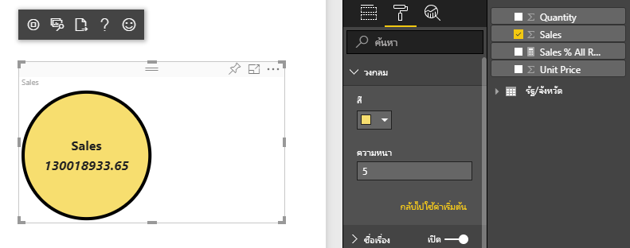
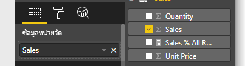

# <a name="tutorial-create-a-react-based-visual"></a><span data-ttu-id="39a92-106">บทช่วยสอน: สร้างวิชวลตาม React</span><span class="sxs-lookup"><span data-stu-id="39a92-106">Tutorial: Create a React-based visual</span></span>

<span data-ttu-id="39a92-107">บทช่วยสอนนี้อธิบายวิธีการสร้างวิชวล Power BI โดยใช้ [React](https://reactjs.org/)</span><span class="sxs-lookup"><span data-stu-id="39a92-107">This tutorial explains how to create a Power BI visual using [React](https://reactjs.org/).</span></span> <span data-ttu-id="39a92-108">วิชวลแสดงค่าในวงกลม</span><span class="sxs-lookup"><span data-stu-id="39a92-108">The visual displays a value in a circle.</span></span> <span data-ttu-id="39a92-109">วิชวลมีขนาดและการตั้งค่าที่สามารถปรับเปลี่ยนได้เพื่อให้สามารถกำหนดเองได้</span><span class="sxs-lookup"><span data-stu-id="39a92-109">The visual has adaptive size and settings to customize it.</span></span> <span data-ttu-id="39a92-110">ด้วยข้อมูลในบทความนี้ คุณสามารถสร้างวิชวล Power BI ของคุณเองได้ด้วย React</span><span class="sxs-lookup"><span data-stu-id="39a92-110">With the information in this article, you can create your own Power BI visuals with React.</span></span>



<span data-ttu-id="39a92-112">ในบทช่วยสอนนี้ คุณจะเรียนรู้วิธีการ:</span><span class="sxs-lookup"><span data-stu-id="39a92-112">In this tutorial, you learn how to:</span></span>

> [!div class="checklist"]
>
> * <span data-ttu-id="39a92-113">ตั้งค่าสภาพแวดล้อมการพัฒนาของคุณ</span><span class="sxs-lookup"><span data-stu-id="39a92-113">Set up your development environment</span></span>
> * <span data-ttu-id="39a92-114">สร้างวิชวล React</span><span class="sxs-lookup"><span data-stu-id="39a92-114">Create a React visual</span></span>
> * <span data-ttu-id="39a92-115">กำหนดค่าความสามารถสำหรับวิชวล</span><span class="sxs-lookup"><span data-stu-id="39a92-115">Configure capabilities for the visual</span></span>
> * <span data-ttu-id="39a92-116">แสดงข้อมูลจาก Power BI</span><span class="sxs-lookup"><span data-stu-id="39a92-116">Render data from Power BI</span></span>
> * <span data-ttu-id="39a92-117">ปรับขนาดวิชวล</span><span class="sxs-lookup"><span data-stu-id="39a92-117">Resize the visual</span></span>
> * <span data-ttu-id="39a92-118">ทำให้วิชวลสามารถปรับแต่งได้</span><span class="sxs-lookup"><span data-stu-id="39a92-118">Make the visual customizable</span></span>

## <a name="prerequisites"></a><span data-ttu-id="39a92-119">ข้อกำหนดเบื้องต้น</span><span class="sxs-lookup"><span data-stu-id="39a92-119">Prerequisites</span></span>

* <span data-ttu-id="39a92-120">บัญชี **Power BI Pro**</span><span class="sxs-lookup"><span data-stu-id="39a92-120">A **Power BI Pro** account.</span></span> <span data-ttu-id="39a92-121">[ลงทะเบียนทดลองใช้ฟรี](https://powerbi.microsoft.com/pricing/) ก่อนที่คุณจะเริ่มต้น</span><span class="sxs-lookup"><span data-stu-id="39a92-121">[Sign up for a free trial](https://powerbi.microsoft.com/pricing/) before you begin.</span></span>
* <span data-ttu-id="39a92-122">[Visual Studio Code](https://www.visualstudio.com/)</span><span class="sxs-lookup"><span data-stu-id="39a92-122">[Visual Studio Code](https://www.visualstudio.com/).</span></span>
* <span data-ttu-id="39a92-123">[Windows PowerShell](/powershell/scripting/install/installing-windows-powershell) เวอร์ชัน 4 หรือใหม่กว่าสำหรับผู้ใช้ windows หรือ [Terminal](https://macpaw.com/how-to/use-terminal-on-mac) สำหรับผู้ใช้ OSX</span><span class="sxs-lookup"><span data-stu-id="39a92-123">[Windows PowerShell](/powershell/scripting/install/installing-windows-powershell) version 4 or later for windows users OR the [Terminal](https://macpaw.com/how-to/use-terminal-on-mac) for OSX users.</span></span>
* <span data-ttu-id="39a92-124">สภาพแวดล้อมตามที่อธิบายไว้ใน [ตั้งค่าสภาพแวดล้อมของคุณสำหรับการพัฒนาวิชวล Power BI](environment-setup.md)</span><span class="sxs-lookup"><span data-stu-id="39a92-124">An environment as described in [Set up your environment for developing a Power BI visual](environment-setup.md).</span></span>

## <a name="getting-started"></a><span data-ttu-id="39a92-125">เริ่มต้นใช้งาน</span><span class="sxs-lookup"><span data-stu-id="39a92-125">Getting started</span></span>

<span data-ttu-id="39a92-126">เมื่อต้องการเริ่มต้น ให้สร้างวิชวล Power BI แบบมินิมอลโดยใช้ `pbiviz`</span><span class="sxs-lookup"><span data-stu-id="39a92-126">To begin, create a minimal Power BI visual by using `pbiviz`.</span></span> <span data-ttu-id="39a92-127">สำหรับข้อมูลเพิ่มเติมเกี่ยวกับโครงการและโครงสร้างของโครงการ โปรดดู [โครงสร้างโครงการวิชวล Power BI](visual-project-structure.md)</span><span class="sxs-lookup"><span data-stu-id="39a92-127">For more information about projects and project structure, see [Power BI visual project structure](visual-project-structure.md).</span></span> <span data-ttu-id="39a92-128">สำหรับโค้ดแหล่งที่มาแบบเต็มของวิชวลนี้ โปรดดู [Circle Card React Visual](https://github.com/Microsoft/powerbi-visuals-circlecard-react)</span><span class="sxs-lookup"><span data-stu-id="39a92-128">For the full source code of this visual, see [Circle Card React Visual](https://github.com/Microsoft/powerbi-visuals-circlecard-react).</span></span>

<span data-ttu-id="39a92-129">คุณสามารถลอกแบบหรือดาวน์โหลดแหล่งที่มาแบบเต็มของวิชวลจาก [GitHub](https://github.com/Microsoft/powerbi-visuals-circlecard-react)</span><span class="sxs-lookup"><span data-stu-id="39a92-129">You can clone or download the full source code of the visual from [GitHub](https://github.com/Microsoft/powerbi-visuals-circlecard-react).</span></span>

1. <span data-ttu-id="39a92-130">เปิด PowerShell และเรียกใช้คำสั่งต่อไปนี้:</span><span class="sxs-lookup"><span data-stu-id="39a92-130">Open PowerShell and run the following command:</span></span>

   ```powershell
   pbiviz new ReactCircleCard
   ```

   <span data-ttu-id="39a92-131">คำสั่งสร้างโฟลเดอร์ที่ชื่อว่า *ReactCircleCard*</span><span class="sxs-lookup"><span data-stu-id="39a92-131">The command creates a folder called *ReactCircleCard*.</span></span>

1. <span data-ttu-id="39a92-132">เปลี่ยนไดเรกทอรีไปยังโฟลเดอร์นั้นและเปิด Visual Studio Code</span><span class="sxs-lookup"><span data-stu-id="39a92-132">Change directories to that folder and open Visual Studio Code.</span></span>

   ```powershell
   cd ./ReactCircleCard
   code .
   ```

1. <span data-ttu-id="39a92-133">เริ่มต้นเซิร์ฟเวอร์สำหรับนักพัฒนาสำหรับวิชวลของคุณ</span><span class="sxs-lookup"><span data-stu-id="39a92-133">Start the developer server for your visual.</span></span>

   ```powershell
   pbiviz start
   ```

   

<span data-ttu-id="39a92-135">วิชวลพื้นฐานนี้แสดงถึงจำนวนการอัปเดต</span><span class="sxs-lookup"><span data-stu-id="39a92-135">This basic visual represents updates count.</span></span> <span data-ttu-id="39a92-136">ลองแปลงเป็นการ์ดวงกลมในขั้นตอนถัดไป</span><span class="sxs-lookup"><span data-stu-id="39a92-136">Let's transform it to a circle card at the next step.</span></span>

## <a name="change-the-visual-to-a-circle-card"></a><span data-ttu-id="39a92-137">เปลี่ยนวิชวลเป็นการ์ดวงกลม</span><span class="sxs-lookup"><span data-stu-id="39a92-137">Change the visual to a circle card</span></span>

<span data-ttu-id="39a92-138">วิชวลพื้นฐานนี้แสดงถึงจำนวนการอัปเดต</span><span class="sxs-lookup"><span data-stu-id="39a92-138">This basic visual represents an updates count.</span></span> <span data-ttu-id="39a92-139">ถัดไป แปลงเป็นการ์ดวงกลมซึ่งแสดงถึงหน่วยวัดและชื่อเรื่อง</span><span class="sxs-lookup"><span data-stu-id="39a92-139">Next, transform it to a circle card, which represents a measure and its title.</span></span>

1. <span data-ttu-id="39a92-140">เรียกใช้คำสั่งต่อไปนี้เพื่อติดตั้งการอ้างอิงที่จำเป็น:</span><span class="sxs-lookup"><span data-stu-id="39a92-140">Run the following command to install required dependencies:</span></span>

   ```powershell
   npm i react react-dom
   ```

1. <span data-ttu-id="39a92-141">เรียกใช้คำสั่งต่อไปนี้เพื่อติดตั้ง React 16 และเวอร์ชันที่เกี่ยวข้องของ `react-dom` และการพิมพ์:</span><span class="sxs-lookup"><span data-stu-id="39a92-141">Run the following command to install React 16 and corresponding versions of `react-dom` and typings:</span></span>

   ```powershell
   npm i @types/react @types/react-dom
   ```

1. <span data-ttu-id="39a92-142">สร้าง class ของคอมโพเนนต์ React</span><span class="sxs-lookup"><span data-stu-id="39a92-142">Create a React component class.</span></span> <span data-ttu-id="39a92-143">ใน Visual Studio Code เลือก **ไฟล์** > **ไฟล์ใหม่**</span><span class="sxs-lookup"><span data-stu-id="39a92-143">In Visual Studio Code, select **File** > **New File**.</span></span> <span data-ttu-id="39a92-144">คัดลอกโค้ดต่อไปนี้ลงในไฟล์</span><span class="sxs-lookup"><span data-stu-id="39a92-144">Copy the following code into the file.</span></span>

    ```typescript
    import * as React from "react";

    export class ReactCircleCard extends React.Component<{}>{
        render(){
            return (
                <div className="circleCard">
                    Hello, React!
                </div>
            )
        }
    }

    export default ReactCircleCard;
    ```

1. <span data-ttu-id="39a92-145">เลือก **บันทึกเป็น**</span><span class="sxs-lookup"><span data-stu-id="39a92-145">Select **Save As**.</span></span> <span data-ttu-id="39a92-146">ไปยังไดเรกทอรี *src*</span><span class="sxs-lookup"><span data-stu-id="39a92-146">Go to the *src* directory.</span></span> <span data-ttu-id="39a92-147">ใส่ชื่อ *คอมโพเนนต์*</span><span class="sxs-lookup"><span data-stu-id="39a92-147">Enter the name *component*.</span></span> <span data-ttu-id="39a92-148">สำหรับ **บันทึกเป็นชนิด** เลือก **TypeScript React**</span><span class="sxs-lookup"><span data-stu-id="39a92-148">For **Save as type**, select **TypeScript React**.</span></span>

1. <span data-ttu-id="39a92-149">เปิด *src/visual.ts*</span><span class="sxs-lookup"><span data-stu-id="39a92-149">Open *src/visual.ts*.</span></span> <span data-ttu-id="39a92-150">แทนที่โค้ดปัจจุบันด้วยโค้ดต่อไปนี้:</span><span class="sxs-lookup"><span data-stu-id="39a92-150">Replace the current code with the following code:</span></span>

    ```typescript
    "use strict";
    import powerbi from "powerbi-visuals-api";

    import DataView = powerbi.DataView;
    import VisualConstructorOptions = powerbi.extensibility.visual.VisualConstructorOptions;
    import VisualUpdateOptions = powerbi.extensibility.visual.VisualUpdateOptions;
    import IVisual = powerbi.extensibility.visual.IVisual;

    import "./../style/visual.less";

    export class Visual implements IVisual {

        constructor(options: VisualConstructorOptions) {

        }

        public update(options: VisualUpdateOptions) {

        }
    }
    ```

1. <span data-ttu-id="39a92-151">นำเข้าการอ้างอิง React และคอมโพเนนต์ที่คุณเพิ่งเพิ่ม</span><span class="sxs-lookup"><span data-stu-id="39a92-151">Import React dependencies and the component you just added.</span></span>

    ```typescript
    import * as React from "react";
    import * as ReactDOM from "react-dom";
    ...
    import ReactCircleCard from "./component";
    ```

   <span data-ttu-id="39a92-152">การตั้งค่าเริ่มต้นของ Power BI TypeScript ไม่รองรับไฟล์ *tsx* ของ React</span><span class="sxs-lookup"><span data-stu-id="39a92-152">Default Power BI TypeScript settings don't take React *tsx* files.</span></span> <span data-ttu-id="39a92-153">Visual Studio Code ไฮไลท์ `component` เป็นข้อผิดพลาด</span><span class="sxs-lookup"><span data-stu-id="39a92-153">Visual Studio Code highlights `component` as an error.</span></span>

1. <span data-ttu-id="39a92-154">เปิดไฟล์ *tsconfig.json* และเพิ่มสองบรรทัดไปยังจุดเริ่มต้นของรายการ `compilerOptions`</span><span class="sxs-lookup"><span data-stu-id="39a92-154">Open the file *tsconfig.json* and add two lines to the beginning of the `compilerOptions` item.</span></span>

    ```json
    {
      "compilerOptions": {
        "jsx": "react",
        "types": ["react", "react-dom"],
        //...
      }
    }
    ```

   <span data-ttu-id="39a92-155">ข้อผิดพลาดใน `component` ควรหายไป</span><span class="sxs-lookup"><span data-stu-id="39a92-155">The error on `component` should be gone.</span></span>

   <span data-ttu-id="39a92-156">เมื่อต้องการแสดงคอมโพเนนต์ ให้เพิ่มองค์ประกอบเป้าหมาย HTML</span><span class="sxs-lookup"><span data-stu-id="39a92-156">To render the component, add the target HTML element.</span></span> <span data-ttu-id="39a92-157">องค์ประกอบนี้คือ `HTMLElement` ใน `VisualConstructorOptions` ซึ่งจะถูกส่งผ่านไปยังคอนสตรักเตอร์</span><span class="sxs-lookup"><span data-stu-id="39a92-157">This element is `HTMLElement` in `VisualConstructorOptions`, which is passed into constructor.</span></span>

1. <span data-ttu-id="39a92-158">ปรับเปลี่ยน class `Visual` ดังในโค้ดต่อไปนี้:</span><span class="sxs-lookup"><span data-stu-id="39a92-158">Modify the `Visual` class, as in the following code:</span></span>

    ```typescript
      private target: HTMLElement;
      private reactRoot: React.ComponentElement<any, any>;

      constructor(options: VisualConstructorOptions) {
          this.reactRoot = React.createElement(ReactCircleCard, {});
          this.target = options.element;

          ReactDOM.render(this.reactRoot, this.target);
      }
    ```

1. <span data-ttu-id="39a92-159">บันทึกการเปลี่ยนแปลงและเรียกใช้โค้ดที่มีอยู่ด้วยคำสั่งนี้:</span><span class="sxs-lookup"><span data-stu-id="39a92-159">Save the changes and run the existing code by using this command:</span></span>

    ```bash
    pbiviz start
    ```

   > [!NOTE]
   > <span data-ttu-id="39a92-160">ถ้าคุณเรียกใช้ `pbiviz`ก่อนหน้านี้ คุณต้องเริ่มต้นใหม่เพื่อทำการเปลี่ยนแปลงใน *tsconfig.json*</span><span class="sxs-lookup"><span data-stu-id="39a92-160">If you previously ran `pbiviz`, you must restart it to apply changes in *tsconfig.json*.</span></span>

  

## <a name="configure-capabilities"></a><span data-ttu-id="39a92-162">กำหนดค่าความสามารถ</span><span class="sxs-lookup"><span data-stu-id="39a92-162">Configure capabilities</span></span>

<span data-ttu-id="39a92-163">คุณสามารถกำหนดค่าความสามารถของวิชวลได้</span><span class="sxs-lookup"><span data-stu-id="39a92-163">You can configure the capabilities of the visual.</span></span>

1. <span data-ttu-id="39a92-164">เปิด `capabilities.json`</span><span class="sxs-lookup"><span data-stu-id="39a92-164">Open `capabilities.json`.</span></span> <span data-ttu-id="39a92-165">ลบวัตถุ `Category Data` ออกจาก `dataRoles`</span><span class="sxs-lookup"><span data-stu-id="39a92-165">Remove the `Category Data` object from `dataRoles`.</span></span> <span data-ttu-id="39a92-166">`ReactCircleCard` จะแสดงเพียงค่าเดียว ดังนั้นเราจำเป็นต้องมี `Measure Data` เท่านั้น</span><span class="sxs-lookup"><span data-stu-id="39a92-166">The `ReactCircleCard` displays a single value, so we need only `Measure Data`.</span></span> <span data-ttu-id="39a92-167">ในตอนนี้คีย์ `dataRoles` มีลักษณะดังนี้:</span><span class="sxs-lookup"><span data-stu-id="39a92-167">The `dataRoles` key now looks like this:</span></span>

    ```json
    "dataRoles": [
        {
            "displayName": "Measure Data",
            "name": "measure",
            "kind": "Measure"
        }
    ],
    ```

1. <span data-ttu-id="39a92-168">ลบเนื้อหาทั้งหมดของคีย์ `objects` ออก</span><span class="sxs-lookup"><span data-stu-id="39a92-168">Remove all the content of `objects` key.</span></span> <span data-ttu-id="39a92-169">คุณจะใส่ข้อมูลลงในภายหลัง</span><span class="sxs-lookup"><span data-stu-id="39a92-169">You'll fill it in later.</span></span>

    ```json
        "objects": {},
    ```

1. <span data-ttu-id="39a92-170">คัดลอกโค้ดของคุณสมบัติ `dataViewMappings` ต่อไปนี้</span><span class="sxs-lookup"><span data-stu-id="39a92-170">Copy the following code of `dataViewMappings` property.</span></span> <span data-ttu-id="39a92-171">ค่าของ `max: 1` หมายความว่าสามารถส่งได้เพียงหนึ่งคอลัมน์หน่วยวัดเท่านั้น</span><span class="sxs-lookup"><span data-stu-id="39a92-171">The value of `max: 1` means that the only one measure column can be submitted.</span></span>

    ```json
        "dataViewMappings": [
            {
                "conditions": [
                    {
                        "measure": {
                            "max": 1
                        }
                    }
                ],
                "single": {
                    "role": "measure"
                }
            }
        ]
    ```

<span data-ttu-id="39a92-172">ในตอนนี้คุณสามารถนำข้อมูลจากบานหน้าต่าง `Fields` ลงในการตั้งค่าวิชวลได้</span><span class="sxs-lookup"><span data-stu-id="39a92-172">Now you can bring data from the `Fields` pane into the visual settings.</span></span>



## <a name="receive-properties-from-power-bi"></a><span data-ttu-id="39a92-174">รับคุณสมบัติจาก Power BI</span><span class="sxs-lookup"><span data-stu-id="39a92-174">Receive properties from Power BI</span></span>

<span data-ttu-id="39a92-175">คุณสามารถแสดงผลข้อมูลโดยใช้ React</span><span class="sxs-lookup"><span data-stu-id="39a92-175">You can render data using React.</span></span> <span data-ttu-id="39a92-176">คอมโพเนนต์สามารถแสดงข้อมูลจากสถานะของตนเอง</span><span class="sxs-lookup"><span data-stu-id="39a92-176">The component can display data from its own state.</span></span>

1. <span data-ttu-id="39a92-177">ปรับเปลี่ยน *src/component.tsx*</span><span class="sxs-lookup"><span data-stu-id="39a92-177">Modify *src/component.tsx*.</span></span>

    ```javascript
    export interface State {
        textLabel: string,
        textValue: string
    }

    export const initialState: State = {
        textLabel: "",
        textValue: ""
    }

    export class ReactCircleCard extends React.Component<{}, State>{
        constructor(props: any){
            super(props);
            this.state = initialState;
        }

        render(){
            const { textLabel, textValue } = this.state;

            return (
                <div className="circleCard">
                    <p>
                        {textLabel}
                        <br/>
                        <em>{textValue}</em>
                    </p>
                </div>
            )
        }
    }
    ```

1. <span data-ttu-id="39a92-178">เพิ่มสไตล์สำหรับมาร์กอัปใหม่โดยการแก้ไข *styles/visual.less*</span><span class="sxs-lookup"><span data-stu-id="39a92-178">Add styles for new markup by editing *styles/visual.less*.</span></span>

    ```css
    .circleCard {
        position: relative;
        box-sizing: border-box;
        border: 1px solid #000;
        border-radius: 50%;
        width: 200px;
        height: 200px;
    }

    p {
        text-align: center;
        line-height: 30px;
        font-size: 20px;
        font-weight: bold;

        position: relative;
        top: -30px;
        margin: 50% 0 0 0;
    }
    ```

1. <span data-ttu-id="39a92-179">วิชวลได้รับข้อมูลปัจจุบันเป็นอาร์กิวเมนต์ของวิธีการ `update`</span><span class="sxs-lookup"><span data-stu-id="39a92-179">Visuals receive current data as an argument of the `update` method.</span></span> <span data-ttu-id="39a92-180">เปิด *src/visual.ts* และเพิ่มโค้ดไปยัง `ReactCircleCard.update`</span><span class="sxs-lookup"><span data-stu-id="39a92-180">Open *src/visual.ts* and add code to `ReactCircleCard.update`.</span></span>

    ```typescript
    //...
    import { ReactCircleCard, initialState } from "./component";
    //...

    export class Visual implements IVisual {
        //...
        public update(options: VisualUpdateOptions) {

            if(options.dataViews && options.dataViews[0]){
                const dataView: DataView = options.dataViews[0];

                ReactCircleCard.update({
                    textLabel: dataView.metadata.columns[0].displayName,
                    textValue: dataView.single.value.toString()
                });
            } else {
                this.clear();
            }
        }

        private clear() {
            ReactCircleCard.update(initialState);
        }
    }
    ```

    <span data-ttu-id="39a92-181">โค้ดเลือก `textLabel` และ `textValue` จาก `DataView` และถ้ามีข้อมูลอยู่ ให้อัปเดตสถานะคอมโพเนนต์</span><span class="sxs-lookup"><span data-stu-id="39a92-181">The code selects `textLabel` and `textValue` from `DataView` and, if the data exists, updates the component state.</span></span>

1. <span data-ttu-id="39a92-182">หากต้องการส่งการอัปเดตไปยังอินสแตนซ์คอมโพเนนต์ ให้ใส่โค้ดต่อไปนี้ใน class `ReactCircleCard`:</span><span class="sxs-lookup"><span data-stu-id="39a92-182">To send updates to component instance, insert the following code in the `ReactCircleCard` class:</span></span>

    ```typescript
        private static updateCallback: (data: object) => void = null;

        public static update(newState: State) {
            if(typeof ReactCircleCard.updateCallback === 'function'){
                ReactCircleCard.updateCallback(newState);
            }
        }

        public state: State = initialState;

        public componentWillMount() {
            ReactCircleCard.updateCallback = (newState: State): void => { this.setState(newState); };
        }

        public componentWillUnmount() {
            ReactCircleCard.updateCallback = null;
        }
    ```

1. <span data-ttu-id="39a92-183">ทดสอบวิชวล</span><span class="sxs-lookup"><span data-stu-id="39a92-183">Test the visual.</span></span> <span data-ttu-id="39a92-184">ตรวจสอบให้แน่ใจว่ามีการเรียกใช้ `pbiviz start` และบันทึกไฟล์ทั้งหมด</span><span class="sxs-lookup"><span data-stu-id="39a92-184">Make sure that `pbiviz start` has been run, and save all files.</span></span> <span data-ttu-id="39a92-185">รีเฟรชวิชวล</span><span class="sxs-lookup"><span data-stu-id="39a92-185">Refresh the visual.</span></span>

   

## <a name="make-component-resizable"></a><span data-ttu-id="39a92-187">ทำให้คอมโพเนนต์สามารถปรับขนาดได้</span><span class="sxs-lookup"><span data-stu-id="39a92-187">Make component resizable</span></span>

<span data-ttu-id="39a92-188">ในส่วนนี้ คุณจะทำให้คอมโพเนนต์สามารถปรับขนาดได้</span><span class="sxs-lookup"><span data-stu-id="39a92-188">In this section, you make the component resizable.</span></span> <span data-ttu-id="39a92-189">ในขณะนี้ คอมโพเนนต์มีความกว้างและความสูงคงที่</span><span class="sxs-lookup"><span data-stu-id="39a92-189">Currently, the component has fixed width and height.</span></span>

<span data-ttu-id="39a92-190">รับขนาดปัจจุบันของวิวพอร์ตวิชวลจากวัตถุ `options`</span><span class="sxs-lookup"><span data-stu-id="39a92-190">Get the current size of the visual viewport from the `options` object.</span></span>

1. <span data-ttu-id="39a92-191">เปิด *src/visual.ts*</span><span class="sxs-lookup"><span data-stu-id="39a92-191">Open *src/visual.ts*.</span></span> <span data-ttu-id="39a92-192">นำเข้าอินเทอร์เฟซ `IViewport` และเพิ่มคุณสมบัติ `viewport` ไปยัง class `visual`</span><span class="sxs-lookup"><span data-stu-id="39a92-192">Import the `IViewport` interface and add the `viewport` property to the `visual` class.</span></span>

    ```typescript
    import IViewport = powerbi.IViewport;

    //...

    export class Visual implements IVisual {
        private viewport: IViewport;
        //...
    }
    ```

1. <span data-ttu-id="39a92-193">เพิ่มโค้ดต่อไปนี้ไปยังวิธี `update` ของ `visual`</span><span class="sxs-lookup"><span data-stu-id="39a92-193">Add the following code to the `update` method of `visual`.</span></span>

    ```typescript
      if (options.dataViews && options.dataViews[0]) {
          const dataView: DataView = options.dataViews[0];

          this.viewport = options.viewport;
          const { width, height } = this.viewport;
          const size = Math.min(width, height);

          ReactCircleCard.update({
              size,
              //...
          });
      }
    ```

1. <span data-ttu-id="39a92-194">เพิ่มคุณสมบัติไปยังอินเทอร์เฟซ `State` ใน *src/component.tsx*</span><span class="sxs-lookup"><span data-stu-id="39a92-194">Add properties to the `State` interface in *src/component.tsx*.</span></span>

    ```typescript
    export interface State {
        //...
        size: number
    }

    const initialState: State = {
        //...
        size: 200
    }
    ```

1. <span data-ttu-id="39a92-195">ทำการเปลี่ยนแปลงต่อไปนี้ในวิธีการ `render` ใน *src/component.tsx*:</span><span class="sxs-lookup"><span data-stu-id="39a92-195">Make the following changes in the `render` method in *src/component.tsx*:</span></span>

    ```typescript
        render() {
            const { textLabel, textValue, size } = this.state;

            const style: React.CSSProperties = { width: size, height: size };

            return (
                <div className="circleCard" style={style}>
                    {/* ... */}
                </div>
            )
        }
    ```

1. <span data-ttu-id="39a92-196">แทนที่ `width` และกฎ `height` ในรูปแบบ *style/visual.less* ด้วย `min-width` และ `min-height`</span><span class="sxs-lookup"><span data-stu-id="39a92-196">Replace `width` and `height` rules in *style/visual.less* with `min-width` and `min-height`.</span></span>

    ```css
        min-width: 200px;
        min-height: 200px;
    ```

<span data-ttu-id="39a92-197">ในตอนนี้คุณสามารถปรับขนาดวิวพอร์ตได้</span><span class="sxs-lookup"><span data-stu-id="39a92-197">Now you can resize the viewport.</span></span> <span data-ttu-id="39a92-198">เส้นผ่านศูนย์กลางของวงกลมสอดคล้องกับขนาดที่น้อยที่สุดตามความกว้างหรือความสูง</span><span class="sxs-lookup"><span data-stu-id="39a92-198">The circle diameter corresponds to minimal size as width or height.</span></span>

## <a name="make-your-power-bi-visual-customizable"></a><span data-ttu-id="39a92-199">ทำให้วิชวล Power BI ของคุณสามารถปรับแต่งได้</span><span class="sxs-lookup"><span data-stu-id="39a92-199">Make your Power BI visual customizable</span></span>

<span data-ttu-id="39a92-200">ในส่วนนี้ คุณจะทำให้วิชวลสามารถปรับแต่งได้</span><span class="sxs-lookup"><span data-stu-id="39a92-200">In this section, you make the visual customizable.</span></span>

1. <span data-ttu-id="39a92-201">เปิด *capabilities.json*</span><span class="sxs-lookup"><span data-stu-id="39a92-201">Open *capabilities.json*.</span></span> <span data-ttu-id="39a92-202">เพิ่มการตั้งค่าต่อไปนี้ลงในคุณสมบัติ `objects`</span><span class="sxs-lookup"><span data-stu-id="39a92-202">Add the following settings to the `objects` property.</span></span>

    ```json
    //...
        "objects": {
            "circle": {
                "displayName": "Circle",
                "properties": {
                    "circleColor": {
                        "displayName": "Color",
                        "description": "The fill color of the circle.",
                        "type": {
                            "fill": {
                                "solid": {
                                    "color": true
                                }
                            }
                        }
                    },
                    "circleThickness": {
                        "displayName": "Thickness",
                        "description": "The circle thickness.",
                        "type": {
                            "numeric": true
                        }
                    }
                }
            }
        },
    //...
    ```

1. <span data-ttu-id="39a92-203">แทนที่โค้ดที่มีอยู่ใน *src/settings.ts* ด้วยโค้ดนี้:</span><span class="sxs-lookup"><span data-stu-id="39a92-203">Replace existing code in *src/settings.ts* with this code:</span></span>

    ```typescript
    "use strict";

    import { dataViewObjectsParser } from "powerbi-visuals-utils-dataviewutils";
    import DataViewObjectsParser = dataViewObjectsParser.DataViewObjectsParser;

    export class CircleSettings {
        public circleColor: string = "white";
        public circleThickness: number = 2;
    }

    export class VisualSettings extends DataViewObjectsParser {
        public circle: CircleSettings = new CircleSettings();
    }
    ```

1. <span data-ttu-id="39a92-204">เพิ่มคำสั่ง `import` เหล่านี้ที่ด้านบนของ *src/visual.ts*:</span><span class="sxs-lookup"><span data-stu-id="39a92-204">Add these `import` statements at the top of *src/visual.ts*:</span></span>

    ```typescript
    import VisualObjectInstance = powerbi.VisualObjectInstance;
    import EnumerateVisualObjectInstancesOptions = powerbi.EnumerateVisualObjectInstancesOptions;
    import VisualObjectInstanceEnumerationObject = powerbi.VisualObjectInstanceEnumerationObject;

    import { VisualSettings } from "./settings";

    ```

1. <span data-ttu-id="39a92-205">เพิ่มวิธีการ `enumerateObjectInstances` ไปยัง *src/visual.ts*</span><span class="sxs-lookup"><span data-stu-id="39a92-205">Add the `enumerateObjectInstances` method to *src/visual.ts*.</span></span> <span data-ttu-id="39a92-206">วิธีการนี้ใช้เพื่อตั้งค่าวิชวล</span><span class="sxs-lookup"><span data-stu-id="39a92-206">This method is used to apply visual settings.</span></span>

    ```typescript
    export class Visual implements IVisual {
        private settings: VisualSettings;

        //...

        public enumerateObjectInstances(
            options: EnumerateVisualObjectInstancesOptions
        ): VisualObjectInstance[] | VisualObjectInstanceEnumerationObject {

            return VisualSettings.enumerateObjectInstances(this.settings || VisualSettings.getDefault(), options);
        }
    }
    ```

1. <span data-ttu-id="39a92-207">เพิ่มโค้ดเพื่อให้วัตถุ `dataView` สามารถรับการตั้งค่าได้ในขณะนี้</span><span class="sxs-lookup"><span data-stu-id="39a92-207">Add code so that the `dataView` object can now receive settings.</span></span>

    ```typescript
        public update(options: VisualUpdateOptions) {

            if(options.dataViews && options.dataViews[0]){
                //...
                this.settings = VisualSettings.parse(dataView) as VisualSettings;
                const object = this.settings.circle;

                ReactCircleCard.update({
                    borderWidth: object && object.circleThickness ? object.circleThickness : undefined,
                    background: object && object.circleColor ? object.circleColor : undefined,
                    //...
                });
            }
        }
    }
    ```

1. <span data-ttu-id="39a92-208">นำการเปลี่ยนแปลงที่เกี่ยวข้องมาใช้กับ *src/component.tsx* เริ่มต้นโดยการเพิ่มค่าเหล่านี้ไปยัง `State`:</span><span class="sxs-lookup"><span data-stu-id="39a92-208">Apply the corresponding changes to *src/component.tsx*, first by adding these values to `State`:</span></span>

    ```typescript
    export interface State {
        //...
        background?: string,
        borderWidth?: number
    }
    ```

1. <span data-ttu-id="39a92-209">จากนั้นจึงเพิ่มโค้ดต่อไปนี้ไปยังวิธีการ `render`:</span><span class="sxs-lookup"><span data-stu-id="39a92-209">Then add the following code to the `render` method:</span></span>

    ```typescript
        const { /*...*/ background, borderWidth } = this.state;

        const style: React.CSSProperties = { /*...*/ background, borderWidth };
    ```

    

## <a name="next-steps"></a><span data-ttu-id="39a92-211">ขั้นตอนถัดไป</span><span class="sxs-lookup"><span data-stu-id="39a92-211">Next steps</span></span>

<span data-ttu-id="39a92-212">สำหรับข้อมูลเพิ่มเติมเกี่ยวกับการพัฒนา Power BI ดู [คำแนะนำสำหรับวิชวล Power BI](guidelines-powerbi-visuals.md) และ [วิชวลใน Power BI](power-bi-visuals-concept.md)</span><span class="sxs-lookup"><span data-stu-id="39a92-212">For more about Power BI development, see [Guidelines for Power BI visuals](guidelines-powerbi-visuals.md) and [Visuals in Power BI](power-bi-visuals-concept.md).</span></span>