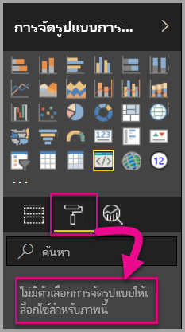
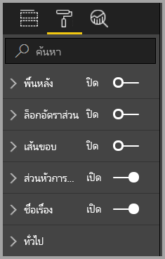
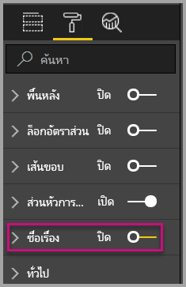
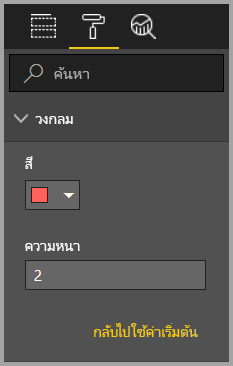
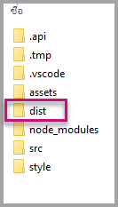
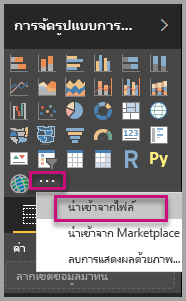
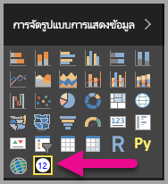

# <a name="tutorial-adding-formatting-options-to-a-power-bi-visual"></a><span data-ttu-id="bdbd9-104">บทช่วยสอน: การเพิ่มตัวเลือกการจัดรูปแบบให้กับวิชวลแบบกำหนดเองของ Power BI</span><span class="sxs-lookup"><span data-stu-id="bdbd9-104">Tutorial: Adding formatting options to a Power BI visual</span></span>

<span data-ttu-id="bdbd9-105">ในบทช่วยสอนนี้ เราจะได้ดูวิธีการเพิ่มคุณสมบัติทั่วไปให้กับวิชวล</span><span class="sxs-lookup"><span data-stu-id="bdbd9-105">In this tutorial, we go through how to add common properties to the visual.</span></span>

<span data-ttu-id="bdbd9-106">ในบทช่วยสอนนี้ คุณจะเรียนรู้วิธีการ:</span><span class="sxs-lookup"><span data-stu-id="bdbd9-106">In this tutorial, you learn how to:</span></span>
> [!div class="checklist"]
> * <span data-ttu-id="bdbd9-107">เพิ่มคุณสมบัติวิชวล</span><span class="sxs-lookup"><span data-stu-id="bdbd9-107">Add visual properties.</span></span>
> * <span data-ttu-id="bdbd9-108">แพคเกจวิชวล</span><span class="sxs-lookup"><span data-stu-id="bdbd9-108">Package the visual.</span></span>
> * <span data-ttu-id="bdbd9-109">นำเข้าวิชวลแบบกำหนดเองไปยังรายงาน Power BI Desktop</span><span class="sxs-lookup"><span data-stu-id="bdbd9-109">Import the custom visual to a Power BI Desktop report.</span></span>

## <a name="adding-formatting-options"></a><span data-ttu-id="bdbd9-110">เพิ่มตัวเลือกการจัดรูปแบบ</span><span class="sxs-lookup"><span data-stu-id="bdbd9-110">Adding formatting options</span></span>

1. <span data-ttu-id="bdbd9-111">เลือก **หน้าการจัดรูปแบบ** ใน **Power BI**</span><span class="sxs-lookup"><span data-stu-id="bdbd9-111">In **Power BI**, select the **Format page**.</span></span>

    <span data-ttu-id="bdbd9-112">คุณจะเห็นข้อความแสดงว่า -*ตัวเลือกการจัดรูปแบบสำหรับวิชวลนี้ไม่พร้อมใช้งาน*</span><span class="sxs-lookup"><span data-stu-id="bdbd9-112">You should see a message that reads - *Formatting options are unavailable for this visual.*</span></span>

    

2. <span data-ttu-id="bdbd9-114">เปิดไฟล์ *capabilities.json* ใน **รหัส Visual Studio**</span><span class="sxs-lookup"><span data-stu-id="bdbd9-114">In **Visual Studio Code**, open the *capabilities.json* file.</span></span>

3. <span data-ttu-id="bdbd9-115">เพิ่ม **วัตถุ**(หลังบรรทัดที่ 8) ก่อนอาร์เรย์ **dataViewMappings**</span><span class="sxs-lookup"><span data-stu-id="bdbd9-115">Before the **dataViewMappings** array, add **objects** (after line 8).</span></span>

    ```json
    "objects": {},
    ```

    

4. <span data-ttu-id="bdbd9-117">บันทึกไฟล์ **capabilities.json**</span><span class="sxs-lookup"><span data-stu-id="bdbd9-117">Save the **capabilities.json** file.</span></span>

5. <span data-ttu-id="bdbd9-118">ตรวจทานตัวเลือกการจัดรูปแบบอีกครั้งใน **Power BI**</span><span class="sxs-lookup"><span data-stu-id="bdbd9-118">In **Power BI**, review the formatting options again.</span></span>

    > [!Note]
    > <span data-ttu-id="bdbd9-119">ถ้าคุณไม่เห็นการเปลี่ยนแปลงในตัวเลือกการจัดรูปแบบ โปรดเลือก **โหลดวิชวลแบบกำหนดเองอีกครั้ง**</span><span class="sxs-lookup"><span data-stu-id="bdbd9-119">If you do not see the formatting options change then select **Reload Custom Visual**.</span></span>

    

6. <span data-ttu-id="bdbd9-121">ตั้งค่าตัวเลือก **ชื่อเรื่อง** เป็น *ปิด*</span><span class="sxs-lookup"><span data-stu-id="bdbd9-121">Set the **Title** option to *Off*.</span></span> <span data-ttu-id="bdbd9-122">โปรดสังเกตว่าวิชวลหยุดแสดงชื่อหน่วยวัดที่มุมบนซ้ายแล้ว</span><span class="sxs-lookup"><span data-stu-id="bdbd9-122">Notice that the visual no longer displays the measure name at the top-left corner.</span></span>

    

    

### <a name="adding-custom-formatting-options"></a><span data-ttu-id="bdbd9-125">การเพิ่มตัวเลือกการจัดรูปแบบแบบกำหนดเอง</span><span class="sxs-lookup"><span data-stu-id="bdbd9-125">Adding custom formatting options</span></span>

<span data-ttu-id="bdbd9-126">คุณอาจเพิ่มคุณสมบัติแบบกำหนดเองเพื่อเปิดใช้งานการกำหนดค่าสีของวงกลม และความกว้างเส้นขอบได้</span><span class="sxs-lookup"><span data-stu-id="bdbd9-126">You can add custom properties to enable configuring the color of the circle, and also the border width.</span></span>

1. <span data-ttu-id="bdbd9-127">หยุดวิชวลแบบกำหนดเอง ใน PowerShell</span><span class="sxs-lookup"><span data-stu-id="bdbd9-127">In PowerShell, stop the custom visual.</span></span>

2. <span data-ttu-id="bdbd9-128">แทรกส่วนย่อย JSON ลงในออบเจ็กต์ที่ระบุชื่อว่า **ออบเจ็กต์** ในแฟ้ม **capabilities.json** สำหรับ Visual Studio Code</span><span class="sxs-lookup"><span data-stu-id="bdbd9-128">In Visual Studio Code, in the **capabilities.json** file, insert the following JSON fragment into the object labeled **objects**.</span></span>

    ```json
        {
            "circle": {
                "displayName": "Circle",
                "properties": {
                    "circleColor": {
                        "displayName": "Color",
                        "description": "The fill color of the circle.",
                        "type": {
                            "fill": {
                                "solid": {
                                    "color": true
                                }
                            }
                        }
                    },
                    "circleThickness": {
                        "displayName": "Thickness",
                        "description": "The circle thickness.",
                        "type": {
                            "numeric": true
                        }
                    }
                }
            }
        }
    ```

    <span data-ttu-id="bdbd9-129">ส่วนย่อย JSON จะอธิบายเกี่ยวกับกลุ่มที่ชื่อวงกลม ซึ่งประกอบด้วยตัวเลือกสองตัวที่ชื่อว่า circleColor และ circleThickness</span><span class="sxs-lookup"><span data-stu-id="bdbd9-129">The JSON fragment describes a group named circle, which consists of two options named circleColor and circleThickness.</span></span>

   

3. <span data-ttu-id="bdbd9-131">บันทึกไฟล์ **capabilities.json**</span><span class="sxs-lookup"><span data-stu-id="bdbd9-131">Save the **capabilities.json** file.</span></span>

4. <span data-ttu-id="bdbd9-132">ใน **แผง Explorer** จากด้านในโฟลเดอร์ **src** และจากนั้นเลือก **settings.ts**</span><span class="sxs-lookup"><span data-stu-id="bdbd9-132">In the **Explorer pane**, from inside the **src** folder, and then select **settings.ts**.</span></span> <span data-ttu-id="bdbd9-133">*ไฟล์นี้แสดงการตั้งค่าสำหรับวิชวลเริ่มต้น*</span><span class="sxs-lookup"><span data-stu-id="bdbd9-133">*This file represents the settings for the starter visual*.</span></span>

5. <span data-ttu-id="bdbd9-134">ในไฟล์ **settings.ts** ให้แทนที่คลาสทั้งสองด้วยรหัสต่อไปนี้</span><span class="sxs-lookup"><span data-stu-id="bdbd9-134">In the **settings.ts** file, replace the two classes with the following code.</span></span>

    ```typescript
    export class CircleSettings {
        public circleColor: string = "white";
        public circleThickness: number = 2;
    }
    export class VisualSettings extends DataViewObjectsParser {
        public circle: CircleSettings = new CircleSettings();
    }
    ```

    

    <span data-ttu-id="bdbd9-136">โมดูลนี้จะกำหนดคลาสสองคลาส</span><span class="sxs-lookup"><span data-stu-id="bdbd9-136">This module defines the two classes.</span></span> <span data-ttu-id="bdbd9-137">คลาส **CircleSettings** จะกำหนดคุณสมบัติไว้สองอย่าง ด้วยชื่อที่ตรงกับวัตถุที่กำหนดไว้ในไฟล์ **capabilities.json** (**circleColor** และ **circleThickness**) และกำหนดค่าเริ่มต้นด้วย</span><span class="sxs-lookup"><span data-stu-id="bdbd9-137">The **CircleSettings** class defines two properties with names that match the objects defined in the **capabilities.json** file (**circleColor** and **circleThickness**) and also sets default values.</span></span> <span data-ttu-id="bdbd9-138">คลาส **VisualSettings** จะรับช่วงมาจากคลาส **DataViewObjectParser** และเพิ่มคุณสมบัติชื่อ **วงกลม** ซึ่งจะตรงกับวัตถุที่กำหนดไว้ในไฟล์ *capabilities.json* และส่งกลับอินสแตนซ์ของ **CircleSettings**</span><span class="sxs-lookup"><span data-stu-id="bdbd9-138">The **VisualSettings** class inherits the **DataViewObjectParser** class and adds a property named **circle**, which matches the object defined in the *capabilities.json* file, and returns an instance of **CircleSettings**.</span></span>

6. <span data-ttu-id="bdbd9-139">บันทึกไฟล์ **settings.ts**</span><span class="sxs-lookup"><span data-stu-id="bdbd9-139">Save the **settings.ts** file.</span></span>

7. <span data-ttu-id="bdbd9-140">เปิดไฟล์ **visual.ts**</span><span class="sxs-lookup"><span data-stu-id="bdbd9-140">Open the **visual.ts** file.</span></span>

8. <span data-ttu-id="bdbd9-141">ในไฟล์ **visual.ts**</span><span class="sxs-lookup"><span data-stu-id="bdbd9-141">In the **visual.ts** file,</span></span>

    <span data-ttu-id="bdbd9-142">นำเข้า `VisualSettings`, `VisualObjectInstanceEnumeration` และ `EnumerateVisualObjectInstancesOptions`:</span><span class="sxs-lookup"><span data-stu-id="bdbd9-142">import `VisualSettings`, `VisualObjectInstanceEnumeration` and `EnumerateVisualObjectInstancesOptions`:</span></span>

    ```typescript
    import { VisualSettings } from "./settings";
    import VisualObjectInstanceEnumeration = powerbi.VisualObjectInstanceEnumeration;
    import EnumerateVisualObjectInstancesOptions = powerbi.EnumerateVisualObjectInstancesOptions;
    ```

    <span data-ttu-id="bdbd9-143">และเพิ่มคุณสมบัติต่อไปนี้ในคลาส **วิชวล**:</span><span class="sxs-lookup"><span data-stu-id="bdbd9-143">and in the **Visual** class add the following property:</span></span>

    ```typescript
    private visualSettings: VisualSettings;
    ```

    <span data-ttu-id="bdbd9-144">คุณสมบัตินี้จะจัดเก็บค่าอ้างอิงไปยังวัตถุ **VisualSettings** ซึ่งอธิบายการตั้งค่าวิชวล</span><span class="sxs-lookup"><span data-stu-id="bdbd9-144">This property stores a reference to the **VisualSettings** object, describing the visual settings.</span></span>

    

9. <span data-ttu-id="bdbd9-146">เพิ่มวิธีการต่อไปนี้ก่อนวิธี **อัปเดต** ในคลาส **วิชวล**</span><span class="sxs-lookup"><span data-stu-id="bdbd9-146">In the **Visual** class, add the following method before the **update** method.</span></span> <span data-ttu-id="bdbd9-147">วิธีนี้ใช้เพื่อรวบรวมตัวเลือกการจัดรูปแบบ</span><span class="sxs-lookup"><span data-stu-id="bdbd9-147">This method is used to populate the formatting options.</span></span>

    ```typescript
    public enumerateObjectInstances(options: EnumerateVisualObjectInstancesOptions): VisualObjectInstanceEnumeration {
        const settings: VisualSettings = this.visualSettings || <VisualSettings>VisualSettings.getDefault();
        return VisualSettings.enumerateObjectInstances(settings, options);
    }
    ```

    <span data-ttu-id="bdbd9-148">วิธีนี้ใช้เพื่อรวบรวมตัวเลือกการจัดรูปแบบ</span><span class="sxs-lookup"><span data-stu-id="bdbd9-148">This method is used to populate the formatting options.</span></span>

    

10. <span data-ttu-id="bdbd9-150">ในวิธี **อัปเดต** หลังจากยืนยันตัวแปร **รัศมี** แล้ว ให้เพิ่มรหัสต่อไปนี้</span><span class="sxs-lookup"><span data-stu-id="bdbd9-150">In the **update** method, after the declaration of the **radius** variable, add the following code.</span></span>

    ```typescript
    this.visualSettings = VisualSettings.parse<VisualSettings>(dataView);

    this.visualSettings.circle.circleThickness = Math.max(0, this.visualSettings.circle.circleThickness);
    this.visualSettings.circle.circleThickness = Math.min(10, this.visualSettings.circle.circleThickness);
    ```

    <span data-ttu-id="bdbd9-151">รหัสนี้จะเรียกใช้ตัวเลือกการจัดรูปแบบ</span><span class="sxs-lookup"><span data-stu-id="bdbd9-151">This code retrieves the format options.</span></span> <span data-ttu-id="bdbd9-152">โดยจะปรับเปลี่ยนค่าใดๆ ที่ส่งผ่านไปยังคุณสมบัติ **circleThickness** โดยแปลงค่านั้นเป็น 0 ถ้าเป็นค่าลบ หรือแปลงเป็น 10 ถ้ามีค่ามากกว่า 10</span><span class="sxs-lookup"><span data-stu-id="bdbd9-152">It adjusts any value passed into the **circleThickness** property, converting it to 0 if negative, or 10 if it's a value greater than 10.</span></span>

    

11. <span data-ttu-id="bdbd9-154">สำหรับ **องค์ประกอบวงกลม** ให้ปรับเปลี่ยนค่าที่ส่งผ่านไปยัง **เติมสไตล์** ให้เป็นนิพจน์ต่อไปนี้</span><span class="sxs-lookup"><span data-stu-id="bdbd9-154">For the **circle element**, modify the value passed to the **fill style** to the following expression.</span></span>

    ```typescript
    this.visualSettings.circle.circleColor
    ```

    

12. <span data-ttu-id="bdbd9-156">สำหรับ **องค์ประกอบวงกลม** ให้ปรับเปลี่ยนค่าที่ส่งผ่านไปยัง **ลักษณะความกว้างเส้น** ให้เป็นนิพจน์ต่อไปนี้</span><span class="sxs-lookup"><span data-stu-id="bdbd9-156">For the **circle element**, modify the value passed to the **stroke-width style** to the following expression.</span></span>

    ```typescript
    this.visualSettings.circle.circleThickness
    ```

    

13. <span data-ttu-id="bdbd9-158">บันทึกไฟล์ visual.ts</span><span class="sxs-lookup"><span data-stu-id="bdbd9-158">Save the visual.ts file.</span></span>

14. <span data-ttu-id="bdbd9-159">เริ่มวิชวล ใน PowerShell</span><span class="sxs-lookup"><span data-stu-id="bdbd9-159">In PowerShell, start the visual.</span></span>

    ```powershell
    pbiviz start
    ```

15. <span data-ttu-id="bdbd9-160">เลือก **ปิดเปิดการรีโหลดอัตโนมัติ** ในแถบเครื่องมือที่ลอยอยู่เหนือวิชวล ใน **Power BI**</span><span class="sxs-lookup"><span data-stu-id="bdbd9-160">In **Power BI**, in the toolbar floating above the visual, select **Toggle Auto Reload**.</span></span>

16. <span data-ttu-id="bdbd9-161">ขยาย **วงกลม** ในตัวเลือก **การจัดรูปแบบวิชวล**</span><span class="sxs-lookup"><span data-stu-id="bdbd9-161">In the **visual format** options, expand **Circle**.</span></span>

    

    <span data-ttu-id="bdbd9-163">ปรับเปลี่ยนตัวเลือก **สี** และ **ความหนา**</span><span class="sxs-lookup"><span data-stu-id="bdbd9-163">Modify the **color** and **thickness** option.</span></span>

    <span data-ttu-id="bdbd9-164">ปรับเปลี่ยนตัวเลือก **ความหนา** ให้เป็นค่าที่น้อยกว่าศูนย์ และค่าที่สูงกว่า 10</span><span class="sxs-lookup"><span data-stu-id="bdbd9-164">Modify the **thickness** option to a value less than zero, and a value higher than 10.</span></span> <span data-ttu-id="bdbd9-165">จากนั้นโปรดสังเกตว่าวิชวลได้อัปเดตค่าให้เป็นค่าจำกัดต่ำสุดหรือสูงสุด</span><span class="sxs-lookup"><span data-stu-id="bdbd9-165">Then notice the visual updates the value to a tolerable minimum or maximum.</span></span>

## <a name="packaging-the-custom-visual"></a><span data-ttu-id="bdbd9-166">การแพคเกจวิชวลแบบกำหนดเอง</span><span class="sxs-lookup"><span data-stu-id="bdbd9-166">Packaging the custom visual</span></span>

<span data-ttu-id="bdbd9-167">ป้อนค่าคุณสมบัติให้โครงการของวิชวลแบบกำหนดเอง อัปเดตไฟล์ไอคอน และจากนั้นจึงแพคเกจวิชวลแบบกำหนดเอง</span><span class="sxs-lookup"><span data-stu-id="bdbd9-167">Enter property values for the custom visual project, update the icon file, and then package the custom visual.</span></span>

1. <span data-ttu-id="bdbd9-168">หยุดวิชวลแบบกำหนดเอง ใน **PowerShell**</span><span class="sxs-lookup"><span data-stu-id="bdbd9-168">In **PowerShell**, stop the custom visual.</span></span>

2. <span data-ttu-id="bdbd9-169">เปิดไฟล์ **pbiviz.json** ใน **รหัส Visual Studio**</span><span class="sxs-lookup"><span data-stu-id="bdbd9-169">Open the **pbiviz.json** file in **Visual Studio Code**.</span></span>

3. <span data-ttu-id="bdbd9-170">ในวัตถุ **วิชวล** ให้ปรับเปลี่ยนคุณสมบัติ **displayName** เป็น *การ์ดวงกลม*</span><span class="sxs-lookup"><span data-stu-id="bdbd9-170">In the **visual** object, modify the **displayName** property to *Circle Card*.</span></span>

    <span data-ttu-id="bdbd9-171">ในแผง **การแสดงภาพ** ที่ลอยอยู่เหนือไอคอน จะปรากฏชื่อที่แสดง</span><span class="sxs-lookup"><span data-stu-id="bdbd9-171">In the **Visualizations** pane, hovering over the icon reveals the display name.</span></span>

    

4. <span data-ttu-id="bdbd9-173">สำหรับคุณสมบัติ **คำอธิบาย** ให้ใส่ข้อความต่อไปนี้</span><span class="sxs-lookup"><span data-stu-id="bdbd9-173">For the **description** property, enter the following text.</span></span>

    <span data-ttu-id="bdbd9-174">*แสดงค่าการวัดที่จัดรูปแบบแล้วภายในวงกลม*</span><span class="sxs-lookup"><span data-stu-id="bdbd9-174">*Displays a formatted measure value inside a circle*</span></span>

5. <span data-ttu-id="bdbd9-175">กรอห **supportUrl** และ **gitHubUrl** สำหรับการแสดงผลด้วยภาพ</span><span class="sxs-lookup"><span data-stu-id="bdbd9-175">Fill **supportUrl** and **gitHubUrl** for the visual.</span></span>

    <span data-ttu-id="bdbd9-176">ตัวอย่าง:</span><span class="sxs-lookup"><span data-stu-id="bdbd9-176">Example:</span></span>

    ```json
    {
        "supportUrl": "https://community.powerbi.com",
        "gitHubUrl": "https://github.com/microsoft/PowerBI-visuals-circlecard"
    }
    ```

6. <span data-ttu-id="bdbd9-177">กรอกรายละเอียดของคุณในวัตถุ **ผู้เขียน**</span><span class="sxs-lookup"><span data-stu-id="bdbd9-177">Enter your details in the **author** object.</span></span>

7. <span data-ttu-id="bdbd9-178">บันทึกไฟล์ **pbiviz.json**</span><span class="sxs-lookup"><span data-stu-id="bdbd9-178">Save the **pbiviz.json** file.</span></span>

8. <span data-ttu-id="bdbd9-179">ในวัตถุ **แอสเซท** โปรดสังเกตว่า ส่วนเอกสารจะกำหนดเส้นทางให้กับไอคอน</span><span class="sxs-lookup"><span data-stu-id="bdbd9-179">In the **assets** object, notice that the document defines a path to an icon.</span></span> <span data-ttu-id="bdbd9-180">ไอคอนนั้นคือรูปภาพที่ปรากฏในแผง **_การแสดงภาพ_**</span><span class="sxs-lookup"><span data-stu-id="bdbd9-180">The icon is the image that appears in the **_Visualizations_** pane.</span></span> <span data-ttu-id="bdbd9-181">โดยต้องเป็นไฟล์ \**PNG\*\*\*20 พิกเซล คูณ 20 พิเซล*</span><span class="sxs-lookup"><span data-stu-id="bdbd9-181">It must be a **PNG** file, *20 pixels by 20 pixels*.</span></span>

9. <span data-ttu-id="bdbd9-182">ใน Windows Explorer ให้คัดลอกไฟล์ icon.png และวาง เพื่อแทนที่ไฟล์เริ่มต้นที่อยู่ในโฟลเดอร์แอสเซท</span><span class="sxs-lookup"><span data-stu-id="bdbd9-182">In Windows Explorer, copy the icon.png file, and then paste it to replace the default file located at assets folder.</span></span>

10. <span data-ttu-id="bdbd9-183">ในรหัส Visual Studio ในแผง Explorer ให้ขยายโฟลเดอร์แอสเซท จากนั้น เลือกไฟล์ icon.png</span><span class="sxs-lookup"><span data-stu-id="bdbd9-183">In Visual Studio Code, in the Explorer pane, expand the assets folder, and then select the icon.png file.</span></span>

11. <span data-ttu-id="bdbd9-184">ตรวจทานไอคอน</span><span class="sxs-lookup"><span data-stu-id="bdbd9-184">Review the icon.</span></span>

    

12. <span data-ttu-id="bdbd9-186">ในรหัส Visual Studio ให้ยืนยันว่าไฟล์ทั้งหมดได้รับการบันทึกแล้ว</span><span class="sxs-lookup"><span data-stu-id="bdbd9-186">In Visual Studio Code, ensure that all files are saved.</span></span>

13. <span data-ttu-id="bdbd9-187">เมื่อต้องการแพคเกจวิชวลแบบกำหนดเอง ใน PowerShell ให้ป้อนคำสั่งต่อไปนี้</span><span class="sxs-lookup"><span data-stu-id="bdbd9-187">To package the custom visual, in PowerShell, enter the following command.</span></span>

    ```powershell
    pbiviz package
    ```

    

<span data-ttu-id="bdbd9-189">ในตอนนี้แพคเกจก็ส่งออกไปยังโฟลเดอร์ **แจกจ่าย** ของโครงการแล้ว</span><span class="sxs-lookup"><span data-stu-id="bdbd9-189">Now the package is output to the **dist** folder of the project.</span></span> <span data-ttu-id="bdbd9-190">ตัวแพคเกจจะมีทุกอย่างที่จำเป็นต้องใช้ในการนำเข้าวิชวลแบบกำหนดเองไปยังบริการของ Power BI หรือรายงาน Power BI Desktop</span><span class="sxs-lookup"><span data-stu-id="bdbd9-190">The package contains everything required to import the custom visual into either the Power BI service or a Power BI Desktop report.</span></span> <span data-ttu-id="bdbd9-191">ตอนนี้คุณก็มีวิชวลแบบกำหนดเองที่ทำการแพคเกจแล้ว และพร้อมใช้งาน</span><span class="sxs-lookup"><span data-stu-id="bdbd9-191">You have now packaged the custom visual, and it is now ready for use.</span></span>

## <a name="importing-the-custom-visual"></a><span data-ttu-id="bdbd9-192">การนำเข้าวิชวลแบบกำหนดเอง</span><span class="sxs-lookup"><span data-stu-id="bdbd9-192">Importing the custom visual</span></span>

<span data-ttu-id="bdbd9-193">ในตอนนี้คุณสามารถเปิดรายงาน Power BI Desktop และนำเข้าวิชวลแบบกำหนดเองของการ์ดวงกลมได้แล้ว</span><span class="sxs-lookup"><span data-stu-id="bdbd9-193">Now you can open the Power BI Desktop report, and import the Circle Card custom visual.</span></span>

1. <span data-ttu-id="bdbd9-194">เปิด **Power BI Desktop** และสร้างรายงานใหม่ด้วย *ชุดข้อมูลตัวอย่าง*</span><span class="sxs-lookup"><span data-stu-id="bdbd9-194">Open **Power BI Desktop**, create a new report with any *sample dataset*</span></span>

2. <span data-ttu-id="bdbd9-195">ในแผง **_การแสดงภาพ_** ให้เลือกแบบ **จุดไข่ปลา** แล้ว เลือก **นำเข้า** จากไฟล์</span><span class="sxs-lookup"><span data-stu-id="bdbd9-195">In the **_Visualizations_** pane, select the **ellipsis**, and then select **Import** from File.</span></span>

    

3. <span data-ttu-id="bdbd9-197">ใน **หน้าต่างการนำเข้า** ให้เลือก **นำเข้า**</span><span class="sxs-lookup"><span data-stu-id="bdbd9-197">In the **import window**, select **Import**.</span></span>

4. <span data-ttu-id="bdbd9-198">ในหน้าต่างการเปิด ให้ไปยังโฟลเดอร์ **แจกจ่าย** ในไดเรกทอรีโครงการของคุณ</span><span class="sxs-lookup"><span data-stu-id="bdbd9-198">In the Open window, navigate to the **dist** folder in your project directory.</span></span>

5. <span data-ttu-id="bdbd9-199">เลือกไฟล์ **circleCard.pbiviz** แล้วเลือก **เปิด**</span><span class="sxs-lookup"><span data-stu-id="bdbd9-199">Select the **circleCard.pbiviz** file, and then select **Open**.</span></span>

6. <span data-ttu-id="bdbd9-200">เมื่อนำเข้าวิชวลสำเร็จเรียบร้อยแล้ว ให้เลือก **ตกลง**</span><span class="sxs-lookup"><span data-stu-id="bdbd9-200">When the visual has successfully imported, select **OK**.</span></span>

7. <span data-ttu-id="bdbd9-201">ตรวจสอบว่ามีการเพิ่มวิชวลไปยังแผง **_การแสดงภาพ_**</span><span class="sxs-lookup"><span data-stu-id="bdbd9-201">Verify that the visual has been added to the **_Visualizations_** pane.</span></span>

    

8. <span data-ttu-id="bdbd9-203">ไปที่เหนือไอคอน **การ์ดวงกลม** แล้วสังเกตที่คำแนะนำเครื่องมือที่ปรากฏขึ้น</span><span class="sxs-lookup"><span data-stu-id="bdbd9-203">Hover over the **Circle Card** icon, and notice the tooltip that appears.</span></span>

## <a name="debugging"></a><span data-ttu-id="bdbd9-204">การดีบัก</span><span class="sxs-lookup"><span data-stu-id="bdbd9-204">Debugging</span></span>

<span data-ttu-id="bdbd9-205">สำหรับเคล็ดลับเกี่ยวกับการดีบักวิชวลแบบกำหนดเองของคุณ ดู[คู่มือการแก้จุดบกพร่อง](./visuals-how-to-debug.md#how-to-debug-power-bi-visuals)</span><span class="sxs-lookup"><span data-stu-id="bdbd9-205">For tips about debugging your custom visual, see the [debugging guide](./visuals-how-to-debug.md#how-to-debug-power-bi-visuals).</span></span>

## <a name="next-steps"></a><span data-ttu-id="bdbd9-206">ขั้นตอนถัดไป</span><span class="sxs-lookup"><span data-stu-id="bdbd9-206">Next steps</span></span>

<span data-ttu-id="bdbd9-207">คุณสามารถแสดงวิชวลที่ปรับปรุงใหม่ของคุณเพื่อให้บุคคลอื่นได้ใช้งานโดยการส่งไป **AppSource**</span><span class="sxs-lookup"><span data-stu-id="bdbd9-207">You can list your newly developed visual for others to use by submitting it to the **AppSource**.</span></span> <span data-ttu-id="bdbd9-208">สำหรับข้อมูลเพิ่มเติมเกี่ยวกับกระบวนการนี้ กรุณาอ้างอิง [เผยแพร่วิชวลแบบกำหนดเองลงใน AppSource](office-store.md)</span><span class="sxs-lookup"><span data-stu-id="bdbd9-208">For more information on this process reference [Publish Power BI visuals to AppSource](office-store.md).</span></span>
