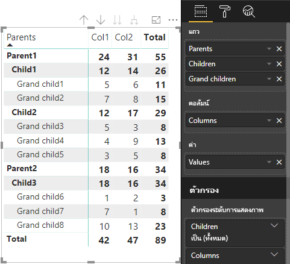

# <a name="understand-data-view-mapping-in-power-bi-visuals"></a><span data-ttu-id="073e9-104">ทำความเข้าใจเกี่ยวกับการแมปมุมมองข้อมูลในวิชวล Power BI</span><span class="sxs-lookup"><span data-stu-id="073e9-104">Understand data view mapping in Power BI visuals</span></span>

<span data-ttu-id="073e9-105">บทความนี้อธิบายการแมปมุมมองข้อมูลและอธิบายว่าบทบาทข้อมูลเกี่ยวข้องกันอย่างไร และอนุญาตให้คุณระบุข้อกำหนดตามเงื่อนไขสำหรับพวกเขา</span><span class="sxs-lookup"><span data-stu-id="073e9-105">This article discusses data view mapping and describes how data roles relate to each other and allow you to specify conditional requirements for them.</span></span> <span data-ttu-id="073e9-106">บทความนี้ยังอธิบายประเภท `dataMappings` แต่ละประเภท</span><span class="sxs-lookup"><span data-stu-id="073e9-106">The article also describes each `dataMappings` type.</span></span>

<span data-ttu-id="073e9-107">การแมปที่ถูกต้องแต่ละครั้งจะสร้างมุมมองข้อมูล แต่ขณะนี้เราสนับสนุนการดำเนินการคิวรัหนึ่งรายการต่อหนึ่งวิชวลเท่านั้น</span><span class="sxs-lookup"><span data-stu-id="073e9-107">Each valid mapping produces a data view, but we currently support performing only one query per visual.</span></span> <span data-ttu-id="073e9-108">โดยปกติคุณจะได้รับมุมมองข้อมูลเดียวเท่านั้น</span><span class="sxs-lookup"><span data-stu-id="073e9-108">You ordinarily get only one data view.</span></span> <span data-ttu-id="073e9-109">อย่างไรก็ตาม คุณสามารถทำการแมปข้อมูลหลายรายการโดยมีเงื่อนไขเฉพาะได้ ซึ่งช่วยให้:</span><span class="sxs-lookup"><span data-stu-id="073e9-109">However, you can provide multiple data mappings in certain conditions, which allow:</span></span>

```json
"dataViewMappings": [
    {
        "conditions": [ ... ],
        "categorical": { ... },
        "single": { ... },
        "table": { ... },
        "matrix": { ... }
    }
]
```

<span data-ttu-id="073e9-110">Power BI สร้างการแมปไปยังมุมมองข้อมูล หากว่าและเฉพาะในกรณีที่มีการกรอกข้อมูลการแมปที่ถูกต้องลงใน `dataViewMappings` เท่านั้น</span><span class="sxs-lookup"><span data-stu-id="073e9-110">Power BI creates a mapping to a data view if and only if the valid mapping is filled in `dataViewMappings`.</span></span>

<span data-ttu-id="073e9-111">กล่าวอีกนัยหนึ่งคือ `categorical` อาจกำหนดใน `dataViewMappings` แต่การแมปอื่น เช่น `table` หรือ `single` อาจไม่เป็นเช่นนั้น</span><span class="sxs-lookup"><span data-stu-id="073e9-111">In other words, `categorical` might be defined in `dataViewMappings` but other mappings, such as `table` or `single`, might not be.</span></span> <span data-ttu-id="073e9-112">ตัวอย่างเช่น:</span><span class="sxs-lookup"><span data-stu-id="073e9-112">For example:</span></span>

```json
"dataViewMappings": [
    {
        "categorical": { ... }
    }
]
```

<span data-ttu-id="073e9-113">Power BI สร้างมุมมองข้อมูลด้วยการแมป `categorical` เดียว และการแมป `table` และการแมปอื่น ๆ ไม่ได้ถูกกำหนด:</span><span class="sxs-lookup"><span data-stu-id="073e9-113">Power BI produces a data view with a single `categorical` mapping, and `table` and other mappings are undefined:</span></span>

```javascript
{
    "categorical": {
        "categories": [ ... ],
        "values": [ ... ]
    },
    "metadata": { ... }
}
```

## <a name="conditions"></a><span data-ttu-id="073e9-114">เงื่อนไข</span><span class="sxs-lookup"><span data-stu-id="073e9-114">Conditions</span></span>

<span data-ttu-id="073e9-115">ส่วนนี้อธิบายเงื่อนไขสำหรับการแมปข้อมูลที่เฉพาะเจาะจง</span><span class="sxs-lookup"><span data-stu-id="073e9-115">This section describes conditions for a particular data mapping.</span></span> <span data-ttu-id="073e9-116">คุณสามารถระบุเงื่อนไขได้หลายชุด และถ้าข้อมูลตรงกับชุดของเงื่อนไขที่อธิบาย วิชวลจะยอมรับข้อมูลได้อย่างถูกต้อง</span><span class="sxs-lookup"><span data-stu-id="073e9-116">You can provide multiple sets of conditions and, if the data matches one of the described sets of conditions, the visual accepts the data as valid.</span></span>

<span data-ttu-id="073e9-117">ในขณะนี้สำหรับแต่ละเขตข้อมูล คุณสามารถระบุค่าต่ำสุดและสูงสุดได้</span><span class="sxs-lookup"><span data-stu-id="073e9-117">Currently, for each field, you can specify a minimum and maximum value.</span></span> <span data-ttu-id="073e9-118">ซึ่งค่าแสดงถึงจำนวนของเขตข้อมูลที่สามารถผูกกับบทบาทข้อมูลนั้นได้</span><span class="sxs-lookup"><span data-stu-id="073e9-118">The value represents the number of fields that can be bound to that data role.</span></span> 

> [!NOTE]
> <span data-ttu-id="073e9-119">หากคุณละเว้นบทบาทข้อมูลในเงื่อนไข ตัวเลขในเขตข้อมูลจะเป็นเท่าใดก็ได้</span><span class="sxs-lookup"><span data-stu-id="073e9-119">If a data role is omitted in the condition, it can have any number of fields.</span></span>

### <a name="example-1"></a><span data-ttu-id="073e9-120">ตัวอย่าง 1</span><span class="sxs-lookup"><span data-stu-id="073e9-120">Example 1</span></span>

<span data-ttu-id="073e9-121">คุณสามารถลากเขตข้อมูลหลายรายการลงในแต่ละบทบาทข้อมูลได้</span><span class="sxs-lookup"><span data-stu-id="073e9-121">You can drag multiple fields into each data role.</span></span> <span data-ttu-id="073e9-122">ในตัวอย่างนี้ คุณจำกัดประเภทด้วยหนึ่งเขตข้อมูล และหน่วยวัดด้วยสองเขตข้อมูล</span><span class="sxs-lookup"><span data-stu-id="073e9-122">In this example, you limit the category to one data field and the measure to two data fields.</span></span>

```json
"conditions": [
    { "category": { "max": 1 }, "y": { "max": 2 } },
]
```

### <a name="example-2"></a><span data-ttu-id="073e9-123">ตัวอย่าง 2</span><span class="sxs-lookup"><span data-stu-id="073e9-123">Example 2</span></span>

<span data-ttu-id="073e9-124">ในตัวอย่างนี้จำเป็นต้องใช้ทั้งสองเงื่อนไข:</span><span class="sxs-lookup"><span data-stu-id="073e9-124">In this example, either of two conditions is required:</span></span>
* <span data-ttu-id="073e9-125">เขตข้อมูลประเภทหนึ่งรายการอย่างแน่นอนและหน่วยวัดสองรายการอย่างแน่นอน</span><span class="sxs-lookup"><span data-stu-id="073e9-125">Exactly one category data field and exactly two measures</span></span>
* <span data-ttu-id="073e9-126">สองประเภทอย่างแน่นอนและหนึ่งหน่วยวัดอย่างแน่นอน</span><span class="sxs-lookup"><span data-stu-id="073e9-126">Exactly two categories and exactly one measure.</span></span>

```json
"conditions": [
    { "category": { "min": 1, "max": 1 }, "measure": { "min": 2, "max": 2 } },
    { "category": { "min": 2, "max": 2 }, "measure": { "min": 1, "max": 1 } }
]
```

## <a name="single-data-mapping"></a><span data-ttu-id="073e9-127">การแมปข้อมูลเดียว</span><span class="sxs-lookup"><span data-stu-id="073e9-127">Single data mapping</span></span>

<span data-ttu-id="073e9-128">การแมปข้อมูลเดี่ยวเป็นรูปแบบที่ง่ายที่สุดของการแมปข้อมูล</span><span class="sxs-lookup"><span data-stu-id="073e9-128">Single data mapping is the simplest form of data mapping.</span></span> <span data-ttu-id="073e9-129">ซึ่งเป็นการยอมรับเขตข้อมูลหน่วยวัดเดียวและให้ผลรวมแก่คุณ</span><span class="sxs-lookup"><span data-stu-id="073e9-129">It accepts a single measure field and gives you the total.</span></span> <span data-ttu-id="073e9-130">ถ้าเขตข้อมูลเป็นตัวเลขจะให้ผลรวมแก่คุณ</span><span class="sxs-lookup"><span data-stu-id="073e9-130">If the field is numeric, it gives you the sum.</span></span> <span data-ttu-id="073e9-131">มิฉะนั้นจะให้จำนวนของค่าที่ไม่ซ้ำกัน</span><span class="sxs-lookup"><span data-stu-id="073e9-131">Otherwise, it gives you a count of unique values.</span></span>

<span data-ttu-id="073e9-132">หากต้องการใช้การแมปข้อมูลเดียว คุณจะต้องกำหนดชื่อของบทบาทข้อมูลที่คุณต้องการแมป</span><span class="sxs-lookup"><span data-stu-id="073e9-132">To use single data mapping, you need to define the name of the data role that you want to map.</span></span> <span data-ttu-id="073e9-133">การแมปนี้จะทำงานกับเขตข้อมูลหน่วยวัดเดียวเท่านั้น</span><span class="sxs-lookup"><span data-stu-id="073e9-133">This mapping works only with a single measure field.</span></span> <span data-ttu-id="073e9-134">หากมีการกำหนดเขตข้อมูลที่สอง จะไม่มีการสร้างมุมมองข้อมูล ดังนั้นจึงเป็นแนวทางปฏิบัติที่ดีที่จะรวมเงื่อนไขที่จำกัดข้อมูลไว้ในเขตข้อมูลเดียว</span><span class="sxs-lookup"><span data-stu-id="073e9-134">If a second field is assigned, no data view is generated, so it's also a good practice to include a condition that limits the data to a single field.</span></span>

> [!NOTE]
> <span data-ttu-id="073e9-135">การแมปข้อมูลนี้ไม่สามารถใช้ร่วมกับการแมปข้อมูลอื่น ๆ ได้</span><span class="sxs-lookup"><span data-stu-id="073e9-135">This data mapping can't be used in conjunction with any other data mapping.</span></span> <span data-ttu-id="073e9-136">ซึ่งหมายถึงการลดข้อมูลลงไปเป็นค่าตัวเลขเดียว</span><span class="sxs-lookup"><span data-stu-id="073e9-136">It's meant to reduce data into a single numeric value.</span></span>

### <a name="example-3"></a><span data-ttu-id="073e9-137">ตัวอย่างที่ 3</span><span class="sxs-lookup"><span data-stu-id="073e9-137">Example 3</span></span>

```json
{
    "dataRoles": [
        {
            "displayName": "Y",
            "name": "Y",
            "kind": "Measure"
        }
    ],
    "dataViewMappings": [
        {
            "conditions": [
                {
                    "Y": {
                        "max": 1
                    }
                }
            ],
            "single": {
                "role": "Y"
            }
        }
    ]
}
```

<span data-ttu-id="073e9-138">มุมมองข้อมูลที่เกิดขึ้นจะยังคงประกอบด้วยชนิดอื่นๆ (ตาราง จัดกลุ่ม ฯลฯ) แต่การแมปแต่ละครั้งจะมีเพียงค่าเดียวเท่านั้น</span><span class="sxs-lookup"><span data-stu-id="073e9-138">The resulting data view still contains the other types (table, categorical, and so on), but each mapping contains only the single value.</span></span> <span data-ttu-id="073e9-139">แนวทางปฏิบัติที่ดีที่สุดคือ เข้าถึงเพียงแค่ค่าเดียว</span><span class="sxs-lookup"><span data-stu-id="073e9-139">The best practice is to access the value only in single.</span></span>

```JSON
{
    "dataView": [
        {
            "metadata": null,
            "categorical": null,
            "matrix": null,
            "table": null,
            "tree": null,
            "single": {
                "value": 94163140.3560001
            }
        }
    ]
}
```

<span data-ttu-id="073e9-140">ตัวอย่างโค้ดเพื่อประมวลผลการแมปมุมมองข้อมูลเดียว</span><span class="sxs-lookup"><span data-stu-id="073e9-140">Code sample to process simple data view mapping</span></span>

```typescript
"use strict";
import powerbi from "powerbi-visuals-api";
import DataView = powerbi.DataView;
import DataViewSingle = powerbi.DataViewSingle;
// standart imports
// ...

export class Visual implements IVisual {
    private target: HTMLElement;
    private host: IVisualHost;
    private valueText: HTMLParagraphElement;

    constructor(options: VisualConstructorOptions) {
        // constructor body
        this.target = options.element;
        this.host = options.host;
        this.valueText = document.createElement("p");
        this.target.appendChild(this.valueText);
        // ...
    }

    public update(options: VisualUpdateOptions) {
        const dataView: DataView = options.dataViews[0];
        const singleDataView: DataViewSingle = dataView.single;

        if (!singleDataView ||
            !singleDataView.value ) {
            return
        }

        this.valueText.innerText = singleDataView.value.toString();
    }
}
```

<span data-ttu-id="073e9-141">ดังนั้นวิชวลจะแสดงค่าเดียวจาก Power BI:</span><span class="sxs-lookup"><span data-stu-id="073e9-141">As a result the visual displays a single value from Power BI:</span></span>


## <a name="categorical-data-mapping"></a><span data-ttu-id="073e9-143">การแมปข้อมูลจัดกลุ่ม</span><span class="sxs-lookup"><span data-stu-id="073e9-143">Categorical data mapping</span></span>

<span data-ttu-id="073e9-144">การแมปข้อมูลจัดกลุ่มถูกใช้เพื่อให้ได้มาซึ่งการจัดกลุ่มข้อมูลอิสระหนึ่งหรือสองรายการ</span><span class="sxs-lookup"><span data-stu-id="073e9-144">Categorical data mapping is used to get one or two independent groupings of data.</span></span>

### <a name="example-4"></a><span data-ttu-id="073e9-145">ตัวอย่างที่ 4</span><span class="sxs-lookup"><span data-stu-id="073e9-145">Example 4</span></span>

<span data-ttu-id="073e9-146">นี่คือคำนิยามจากตัวอย่างก่อนหน้าสำหรับบทบาทข้อมูล:</span><span class="sxs-lookup"><span data-stu-id="073e9-146">Here is the definition from the previous example for data roles:</span></span>

```json
"dataRole":[
    {
        "displayName": "Category",
        "name": "category",
        "kind": "Grouping"
    },
    {
        "displayName": "Y Axis",
        "name": "measure",
        "kind": "Measure"
    }
]
```

<span data-ttu-id="073e9-147">ในตอนนี้คือการแมป:</span><span class="sxs-lookup"><span data-stu-id="073e9-147">Here is the mapping:</span></span>

```json
"dataViewMappings": {
    "categorical": {
        "categories": {
            "for": { "in": "category" }
        },
        "values": {
            "select": [
                { "bind": { "to": "measure" } }
            ]
        }
    }
}
```

<span data-ttu-id="073e9-148">นี่เป็นตัวอย่างแบบง่าย</span><span class="sxs-lookup"><span data-stu-id="073e9-148">It's a simple example.</span></span> <span data-ttu-id="073e9-149">ซึ่งอ่าน "แมปบทบาทข้อมูล `category` ของฉันเพื่อให้ทุกเขตข้อมูลที่ฉันลากไปอยู่ใน `category` ดังนั้นข้อมูลจะถูกแมปไปยัง `categorical.categories`</span><span class="sxs-lookup"><span data-stu-id="073e9-149">It reads "Map my `category` data role so that for every field I drag into `category`, its data is mapped to `categorical.categories`.</span></span> <span data-ttu-id="073e9-150">นอกจากนี้ยังแมปบทบาทข้อมูล `measure` ของฉันไปยัง `categorical.values` อีกด้วย"</span><span class="sxs-lookup"><span data-stu-id="073e9-150">Also map my `measure` data role to `categorical.values`."</span></span>

* <span data-ttu-id="073e9-151">**for...in**: สำหรับรายการทั้งหมดในบทบาทข้อมูลนี้ ให้รวมไว้ในคิวรีข้อมูล</span><span class="sxs-lookup"><span data-stu-id="073e9-151">**for...in**: For all the items in this data role, include them in the data query.</span></span>
* <span data-ttu-id="073e9-152">**bind...to**: สร้างผลลัพธ์เดียวกับใน *for...in* แต่คาดว่าบทบาทข้อมูลจะมีเงื่อนไขที่ จำกัดให้อยู่ในเขตข้อมูลเดียว</span><span class="sxs-lookup"><span data-stu-id="073e9-152">**bind...to**: Produces the same result as in *for...in*, but expects that the data role will have a condition restricting it to a single field.</span></span>

### <a name="example-5"></a><span data-ttu-id="073e9-153">ตัวอย่างที่ 5</span><span class="sxs-lookup"><span data-stu-id="073e9-153">Example 5</span></span>

<span data-ttu-id="073e9-154">ตัวอย่างนี้ใช้บทบาทข้อมูลสองรายการแรกจากตัวอย่างก่อนหน้านี้และกำหนดเพิ่มเติม `grouping` และ `measure2`</span><span class="sxs-lookup"><span data-stu-id="073e9-154">This example uses the first two data roles from the previous example and additionally defines `grouping` and `measure2`.</span></span>

```json
"dataRole":[
    {
        "displayName": "Category",
        "name": "category",
        "kind": "Grouping"
    },
    {
        "displayName": "Y Axis",
        "name": "measure",
        "kind": "Measure"
    },
    {
        "displayName": "Grouping with",
        "name": "grouping",
        "kind": "Grouping"
    },
    {
        "displayName": "X Axis",
        "name": "measure2",
        "kind": "Grouping"
    }
]
```

<span data-ttu-id="073e9-155">ในตอนนี้คือการแมป:</span><span class="sxs-lookup"><span data-stu-id="073e9-155">Here is the mapping:</span></span>

```json
"dataViewMappings":{
    "categorical": {
        "categories": {
            "for": { "in": "category" }
        },
        "values": {
            "group": {
                "by": "grouping",
                "select":[
                    { "bind": { "to": "measure" } },
                    { "bind": { "to": "measure2" } }
                ]
            }
        }
    }
}
```

<span data-ttu-id="073e9-156">ที่นี่ความแตกต่างสำหรับวิธีที่เราทำการแมป categorical.values</span><span class="sxs-lookup"><span data-stu-id="073e9-156">Here the difference is in how we are mapping categorical.values.</span></span> <span data-ttu-id="073e9-157">เรากำลังพูดว่า "แมปบทบาทข้อมูล `measure` และ `measure2` ของฉันเพื่อจัดกลุ่มตามบทบาทข้อมูล `grouping`"</span><span class="sxs-lookup"><span data-stu-id="073e9-157">We are saying that "Map my `measure` and `measure2` data roles to be grouped by the data role `grouping`."</span></span>

### <a name="example-6"></a><span data-ttu-id="073e9-158">ตัวอย่างที่ 6</span><span class="sxs-lookup"><span data-stu-id="073e9-158">Example 6</span></span>

<span data-ttu-id="073e9-159">นี่คือบทบาทของข้อมูล:</span><span class="sxs-lookup"><span data-stu-id="073e9-159">Here are the data roles:</span></span>

```json
"dataRoles": [
    {
        "displayName": "Categories",
        "name": "category",
        "kind": "Grouping"
    },
    {
        "displayName": "Measures",
        "name": "measure",
        "kind": "Measure"
    },
    {
        "displayName": "Series",
        "name": "series",
        "kind": "Measure"
    }
]
```

<span data-ttu-id="073e9-160">นี่คือการแมปมุมมองข้อมูล:</span><span class="sxs-lookup"><span data-stu-id="073e9-160">Here is the data view mapping:</span></span>

```json
"dataViewMappings": [
    {
        "categorical": {
            "categories": {
                "for": {
                    "in": "category"
                }
            },
            "values": {
                "group": {
                    "by": "series",
                    "select": [{
                            "for": {
                                "in": "measure"
                            }
                        }
                    ]
                }
            }
        }
    }
]
```

<span data-ttu-id="073e9-161">มุมองข้อมูลแบบจัดกลุ่มอาจมีวิชวลเป็นแบบนี้:</span><span class="sxs-lookup"><span data-stu-id="073e9-161">The categorical data view could be visualized like this:</span></span>

| <span data-ttu-id="073e9-162">ประเทศ</span><span class="sxs-lookup"><span data-stu-id="073e9-162">Country</span></span> | <span data-ttu-id="073e9-163">2013</span><span class="sxs-lookup"><span data-stu-id="073e9-163">2013</span></span> | <span data-ttu-id="073e9-164">2014</span><span class="sxs-lookup"><span data-stu-id="073e9-164">2014</span></span> | <span data-ttu-id="073e9-165">2015</span><span class="sxs-lookup"><span data-stu-id="073e9-165">2015</span></span> | <span data-ttu-id="073e9-166">2016</span><span class="sxs-lookup"><span data-stu-id="073e9-166">2016</span></span> |
|---------|------|------|------|------|
| <span data-ttu-id="073e9-167">สหรัฐอเมริกา</span><span class="sxs-lookup"><span data-stu-id="073e9-167">USA</span></span> | <span data-ttu-id="073e9-168">x</span><span class="sxs-lookup"><span data-stu-id="073e9-168">x</span></span> | <span data-ttu-id="073e9-169">x</span><span class="sxs-lookup"><span data-stu-id="073e9-169">x</span></span> | <span data-ttu-id="073e9-170">650</span><span class="sxs-lookup"><span data-stu-id="073e9-170">650</span></span> | <span data-ttu-id="073e9-171">350</span><span class="sxs-lookup"><span data-stu-id="073e9-171">350</span></span> |
| <span data-ttu-id="073e9-172">แคนาดา</span><span class="sxs-lookup"><span data-stu-id="073e9-172">Canada</span></span> | <span data-ttu-id="073e9-173">x</span><span class="sxs-lookup"><span data-stu-id="073e9-173">x</span></span> | <span data-ttu-id="073e9-174">630</span><span class="sxs-lookup"><span data-stu-id="073e9-174">630</span></span> | <span data-ttu-id="073e9-175">490</span><span class="sxs-lookup"><span data-stu-id="073e9-175">490</span></span> | <span data-ttu-id="073e9-176">x</span><span class="sxs-lookup"><span data-stu-id="073e9-176">x</span></span> |
| <span data-ttu-id="073e9-177">เม็กซิโก</span><span class="sxs-lookup"><span data-stu-id="073e9-177">Mexico</span></span> | <span data-ttu-id="073e9-178">645</span><span class="sxs-lookup"><span data-stu-id="073e9-178">645</span></span> | <span data-ttu-id="073e9-179">x</span><span class="sxs-lookup"><span data-stu-id="073e9-179">x</span></span> | <span data-ttu-id="073e9-180">x</span><span class="sxs-lookup"><span data-stu-id="073e9-180">x</span></span> | <span data-ttu-id="073e9-181">x</span><span class="sxs-lookup"><span data-stu-id="073e9-181">x</span></span> |
| <span data-ttu-id="073e9-182">สหราชอาณาจักร</span><span class="sxs-lookup"><span data-stu-id="073e9-182">UK</span></span> | <span data-ttu-id="073e9-183">x</span><span class="sxs-lookup"><span data-stu-id="073e9-183">x</span></span> | <span data-ttu-id="073e9-184">x</span><span class="sxs-lookup"><span data-stu-id="073e9-184">x</span></span> | <span data-ttu-id="073e9-185">831</span><span class="sxs-lookup"><span data-stu-id="073e9-185">831</span></span> | <span data-ttu-id="073e9-186">x</span><span class="sxs-lookup"><span data-stu-id="073e9-186">x</span></span> |


<span data-ttu-id="073e9-187">Power BI สร้างเป็นมุมองข้อมูลแบบจัดกลุ่ม</span><span class="sxs-lookup"><span data-stu-id="073e9-187">Power BI produces it as the categorical data view.</span></span> <span data-ttu-id="073e9-188">ซึ่งเป็นชุดของหมวดหมู่</span><span class="sxs-lookup"><span data-stu-id="073e9-188">It's the set of categories.</span></span>

```JSON
{
    "categorical": {
        "categories": [
            {
                "source": {...},
                "values": [
                    "Canada",
                    "USA",
                    "UK",
                    "Mexico"
                ],
                "identity": [...],
                "identityFields": [...],
            }
        ]
    }
}
```

<span data-ttu-id="073e9-189">แต่ละหมวดหมู่จะถูกแมปไปยังชุดของค่าด้วย</span><span class="sxs-lookup"><span data-stu-id="073e9-189">Each category maps to a set of values as well.</span></span> <span data-ttu-id="073e9-190">ค่าเหล่านี้แต่ละค่าจัดกลุ่มตามลำดับ ซึ่งแสดงเป็นปี</span><span class="sxs-lookup"><span data-stu-id="073e9-190">Each of these values is grouped by series, which is expressed as years.</span></span>

<span data-ttu-id="073e9-191">ตัวอย่างเช่น อาร์เรย์ `values` แต่ละตัวแสดงถึงข้อมูลสำหรับแต่ละปี</span><span class="sxs-lookup"><span data-stu-id="073e9-191">For example, each `values` array represents data for each year.</span></span>
<span data-ttu-id="073e9-192">นอกจากนี้แต่ละอาร์เรย์ `values` ยังมี 4 ค่าสำหรับ Canada, USA, UK และ Mexico ตามลำดับ:</span><span class="sxs-lookup"><span data-stu-id="073e9-192">Also each `values` array has 4 values, for Canada, USA, UK and Mexico respectively:</span></span>

```JSON
{
    "values": [
        // Values for 2013 year
        {
            "source": {...},
            "values": [
                null, // Value for `Canada` category
                null, // Value for `USA` category
                null, // Value for `UK` category
                645 // Value for `Mexico` category
            ],
            "identity": [...],
        },
        // Values for 2014 year
        {
            "source": {...},
            "values": [
                630, // Value for `Canada` category
                null, // Value for `USA` category
                null, // Value for `UK` category
                null // Value for `Mexico` category
            ],
            "identity": [...],
        },
        // Values for 2015 year
        {
            "source": {...},
            "values": [
                490, // Value for `Canada` category
                650, // Value for `USA` category
                831, // Value for `UK` category
                null // Value for `Mexico` category
            ],
            "identity": [...],
        },
        // Values for 2016 year
        {
            "source": {...},
            "values": [
                null, // Value for `Canada` category
                350, // Value for `USA` category
                null, // Value for `UK` category
                null // Value for `Mexico` category
            ],
            "identity": [...],
        }
    ]
}
```

<span data-ttu-id="073e9-193">ตัวอย่างโค้ดสำหรับการประมวลผลการแมปมุมมองข้อมูลแบบจัดกลุ่มอธิบายไว้ด้านล่าง</span><span class="sxs-lookup"><span data-stu-id="073e9-193">Code sample for processing categorical data view mapping is described below.</span></span> <span data-ttu-id="073e9-194">ตัวอย่างจะสร้างโครงสร้างแบบลำดับชั้น `Country => Year => Value`</span><span class="sxs-lookup"><span data-stu-id="073e9-194">The sample creates Hierarchical structure `Country => Year => Value`</span></span>

```typescript
"use strict";
import powerbi from "powerbi-visuals-api";
import DataView = powerbi.DataView;
import DataViewDataViewCategoricalSingle = powerbi.DataViewCategorical;
import DataViewValueColumnGroup = powerbi.DataViewValueColumnGroup;
import PrimitiveValue = powerbi.PrimitiveValue;
// standart imports
// ...

export class Visual implements IVisual {
    private target: HTMLElement;
    private host: IVisualHost;
    private categories: HTMLElement;

    constructor(options: VisualConstructorOptions) {
        // constructor body
        this.target = options.element;
        this.host = options.host;
        this.categories = document.createElement("pre");
        this.target.appendChild(this.categories);
        // ...
    }

    public update(options: VisualUpdateOptions) {
        const dataView: DataView = options.dataViews[0];
        const categoricalDataView: DataViewCategorical = dataView.categorical;

        if (!categoricalDataView ||
            !categoricalDataView.categories ||
            !categoricalDataView.categories[0] ||
            !categoricalDataView.values) {
            return;
        }

        // Categories have only one column in data buckets
        // If you want to support several columns of categories data bucket, you should iterate categoricalDataView.categories array.
        const categoryFieldIndex = 0;
        // Measure has only one column in data buckets.
        // If you want to support several columns on data bucket, you should iterate years.values array in map function
        const measureFieldIndex = 0;
        let categories: PrimitiveValue[] = categoricalDataView.categories[categoryFieldIndex].values;
        let values: DataViewValueColumnGroup[] = categoricalDataView.values.grouped();

        let data = {};
        // iterate categories/countries
        categories.map((category: PrimitiveValue, categoryIndex: number) => {
            data[category.toString()] = {};
            // iterate series/years
            values.map((years: DataViewValueColumnGroup) => {
                if (!data[category.toString()][years.name] && years.values[measureFieldIndex].values[categoryIndex]) {
                    data[category.toString()][years.name] = []
                }
                if (years.values[0].values[categoryIndex]) {
                    data[category.toString()][years.name].push(years.values[measureFieldIndex].values[categoryIndex]);
                }
            });
        });

        this.categories.innerText = JSON.stringify(data, null, 6);
        console.log(data);
    }
}
```

<span data-ttu-id="073e9-195">ผลลัพธ์ของวิชวล:</span><span class="sxs-lookup"><span data-stu-id="073e9-195">The result of the visual:</span></span>


## <a name="table-data-mapping"></a><span data-ttu-id="073e9-197">การแมปข้อมูลตาราง</span><span class="sxs-lookup"><span data-stu-id="073e9-197">Table data mapping</span></span>

<span data-ttu-id="073e9-198">มุมมองข้อมูลตารางเป็นการแมปข้อมูลอย่างง่าย</span><span class="sxs-lookup"><span data-stu-id="073e9-198">The table data view is a simple data mapping.</span></span> <span data-ttu-id="073e9-199">โดยพื้นฐานแล้วเป็นรายการของจุดข้อมูลที่สามารถรวมจุดข้อมูลตัวเลขได้</span><span class="sxs-lookup"><span data-stu-id="073e9-199">Essentially, it's a list of data points, where numeric data points could be aggregated.</span></span>

### <a name="example-7"></a><span data-ttu-id="073e9-200">ตัวอย่างที่ 7</span><span class="sxs-lookup"><span data-stu-id="073e9-200">Example 7</span></span>

<span data-ttu-id="073e9-201">ด้วยความสามารถที่กำหนด:</span><span class="sxs-lookup"><span data-stu-id="073e9-201">With the given capabilities:</span></span>

```json
"dataRoles": [
    {
        "displayName": "Column",
        "name": "column",
        "kind": "Grouping"
    },
    {
        "displayName": "Value",
        "name": "value",
        "kind": "Measure"
    }
]
```

```json
"dataViewMappings": [
    {
        "table": {
            "rows": {
                "select": [
                    {
                        "for": {
                            "in": "column"
                        }
                    },
                    {
                        "for": {
                            "in": "value"
                        }
                    }
                ]
            }
        }
    }
]
```

<span data-ttu-id="073e9-202">คุณสามารถแสดงวิชวลข้อมูลตารางได้ดังต่อไปนี้:</span><span class="sxs-lookup"><span data-stu-id="073e9-202">You can visualize the table data view as the following:</span></span>  

<span data-ttu-id="073e9-203">ตัวอย่างข้อมูล:</span><span class="sxs-lookup"><span data-stu-id="073e9-203">Data example:</span></span>

| <span data-ttu-id="073e9-204">ประเทศ</span><span class="sxs-lookup"><span data-stu-id="073e9-204">Country</span></span>| <span data-ttu-id="073e9-205">Year</span><span class="sxs-lookup"><span data-stu-id="073e9-205">Year</span></span> | <span data-ttu-id="073e9-206">Sales</span><span class="sxs-lookup"><span data-stu-id="073e9-206">Sales</span></span> |
|-----|-----|------|
| <span data-ttu-id="073e9-207">สหรัฐอเมริกา</span><span class="sxs-lookup"><span data-stu-id="073e9-207">USA</span></span> | <span data-ttu-id="073e9-208">2016</span><span class="sxs-lookup"><span data-stu-id="073e9-208">2016</span></span> | <span data-ttu-id="073e9-209">100</span><span class="sxs-lookup"><span data-stu-id="073e9-209">100</span></span> |
| <span data-ttu-id="073e9-210">สหรัฐอเมริกา</span><span class="sxs-lookup"><span data-stu-id="073e9-210">USA</span></span> | <span data-ttu-id="073e9-211">2015</span><span class="sxs-lookup"><span data-stu-id="073e9-211">2015</span></span> | <span data-ttu-id="073e9-212">50</span><span class="sxs-lookup"><span data-stu-id="073e9-212">50</span></span> |
| <span data-ttu-id="073e9-213">แคนาดา</span><span class="sxs-lookup"><span data-stu-id="073e9-213">Canada</span></span> | <span data-ttu-id="073e9-214">2015</span><span class="sxs-lookup"><span data-stu-id="073e9-214">2015</span></span> | <span data-ttu-id="073e9-215">200</span><span class="sxs-lookup"><span data-stu-id="073e9-215">200</span></span> |
| <span data-ttu-id="073e9-216">แคนาดา</span><span class="sxs-lookup"><span data-stu-id="073e9-216">Canada</span></span> | <span data-ttu-id="073e9-217">2015</span><span class="sxs-lookup"><span data-stu-id="073e9-217">2015</span></span> | <span data-ttu-id="073e9-218">50</span><span class="sxs-lookup"><span data-stu-id="073e9-218">50</span></span> |
| <span data-ttu-id="073e9-219">เม็กซิโก</span><span class="sxs-lookup"><span data-stu-id="073e9-219">Mexico</span></span> | <span data-ttu-id="073e9-220">2013</span><span class="sxs-lookup"><span data-stu-id="073e9-220">2013</span></span> | <span data-ttu-id="073e9-221">300</span><span class="sxs-lookup"><span data-stu-id="073e9-221">300</span></span> |
| <span data-ttu-id="073e9-222">สหราชอาณาจักร</span><span class="sxs-lookup"><span data-stu-id="073e9-222">UK</span></span> | <span data-ttu-id="073e9-223">2014</span><span class="sxs-lookup"><span data-stu-id="073e9-223">2014</span></span> | <span data-ttu-id="073e9-224">150</span><span class="sxs-lookup"><span data-stu-id="073e9-224">150</span></span> |
| <span data-ttu-id="073e9-225">สหรัฐอเมริกา</span><span class="sxs-lookup"><span data-stu-id="073e9-225">USA</span></span> | <span data-ttu-id="073e9-226">2015</span><span class="sxs-lookup"><span data-stu-id="073e9-226">2015</span></span> | <span data-ttu-id="073e9-227">75</span><span class="sxs-lookup"><span data-stu-id="073e9-227">75</span></span> |

<span data-ttu-id="073e9-228">การผูกข้อมูล:</span><span class="sxs-lookup"><span data-stu-id="073e9-228">Data binding:</span></span>


<span data-ttu-id="073e9-230">Power BI จะแสดงข้อมูลของคุณเป็นมุมมองข้อมูลตาราง</span><span class="sxs-lookup"><span data-stu-id="073e9-230">Power BI displays your data as the table data view.</span></span> <span data-ttu-id="073e9-231">คุณไม่ควรสันนิษฐานว่ามีการจัดลำดับข้อมูลแล้ว</span><span class="sxs-lookup"><span data-stu-id="073e9-231">You shouldn't assume that the data is ordered.</span></span>

```JSON
{
    "table" : {
        "columns": [...],
        "rows": [
            [
                "Canada",
                2014,
                630
            ],
            [
                "Canada",
                2015,
                490
            ],
            [
                "Mexico",
                2013,
                645
            ],
            [
                "UK",
                2014,
                831
            ],
            [
                "USA",
                2015,
                650
            ],
            [
                "USA",
                2016,
                350
            ]
        ]
    }
}
```

<span data-ttu-id="073e9-232">คุณสามารถรวมข้อมูลโดยเลือกเขตข้อมูลที่ต้องการจากนั้นเลือกผลรวม</span><span class="sxs-lookup"><span data-stu-id="073e9-232">You can aggregate the data by selecting the desired field and then selecting sum.</span></span>  


<span data-ttu-id="073e9-234">ตัวอย่างโค้ดเพื่อประมวลผลการแมปมุมมองข้อมูลแบบตาราง</span><span class="sxs-lookup"><span data-stu-id="073e9-234">Code sample to process table data view mapping.</span></span>

```typescript
"use strict";
import "./../style/visual.less";
import powerbi from "powerbi-visuals-api";
// ...
import DataViewMetadataColumn = powerbi.DataViewMetadataColumn;
import DataViewTable = powerbi.DataViewTable;
import DataViewTableRow = powerbi.DataViewTableRow;
import PrimitiveValue = powerbi.PrimitiveValue;
// other imports
// ...

export class Visual implements IVisual {
    private target: HTMLElement;
    private host: IVisualHost;
    private table: HTMLParagraphElement;

    constructor(options: VisualConstructorOptions) {
        // constructor body
        this.target = options.element;
        this.host = options.host;
        this.table = document.createElement("table");
        this.target.appendChild(this.table);
        // ...
    }

    public update(options: VisualUpdateOptions) {
        const dataView: DataView = options.dataViews[0];
        const tableDataView: DataViewTable = dataView.table;

        if (!tableDataView) {
            return
        }
        while(this.table.firstChild) {
            this.table.removeChild(this.table.firstChild);
        }

        //draw header
        const tableHeader = document.createElement("th");
        tableDataView.columns.forEach((column: DataViewMetadataColumn) => {
            const tableHeaderColumn = document.createElement("td");
            tableHeaderColumn.innerText = column.displayName
            tableHeader.appendChild(tableHeaderColumn);
        });
        this.table.appendChild(tableHeader);

        //draw rows
        tableDataView.rows.forEach((row: DataViewTableRow) => {
            const tableRow = document.createElement("tr");
            row.forEach((columnValue: PrimitiveValue) => {
                const cell = document.createElement("td");
                cell.innerText = columnValue.toString();
                tableRow.appendChild(cell);
            })
            this.table.appendChild(tableRow);
        });
    }
}
```

<span data-ttu-id="073e9-235">ไฟล์สไตล์ของวิชวล `style/visual.less` ประกอบด้วยโครงร่างสำหรับตาราง:</span><span class="sxs-lookup"><span data-stu-id="073e9-235">The visual styles file `style/visual.less` contains layout for table:</span></span>

```less
table {
    display: flex;
    flex-direction: column;
}

tr, th {
    display: flex;
    flex: 1;
}

td {
    flex: 1;
    border: 1px solid black;
}
```


## <a name="matrix-data-mapping"></a><span data-ttu-id="073e9-237">การแมปข้อมูลเมทริกซ์</span><span class="sxs-lookup"><span data-stu-id="073e9-237">Matrix data mapping</span></span>

<span data-ttu-id="073e9-238">การแมปข้อมูลเมทริกซ์คล้ายกับการแมปข้อมูลตาราง แต่มีการแสดงแถวแบบลำดับชั้น</span><span class="sxs-lookup"><span data-stu-id="073e9-238">Matrix data mapping is similar to table data mapping, but the rows are presented hierarchically.</span></span> <span data-ttu-id="073e9-239">ค่าบทบาทข้อมูลใดก็ตามสามารถใช้เป็นค่าส่วนหัวคอลัมน์ได้</span><span class="sxs-lookup"><span data-stu-id="073e9-239">Any of the data role values can be used as a column header value.</span></span>

```json
{
    "dataRoles": [
        {
            "name": "Category",
            "displayName": "Category",
            "displayNameKey": "Visual_Category",
            "kind": "Grouping"
        },
        {
            "name": "Column",
            "displayName": "Column",
            "displayNameKey": "Visual_Column",
            "kind": "Grouping"
        },
        {
            "name": "Measure",
            "displayName": "Measure",
            "displayNameKey": "Visual_Values",
            "kind": "Measure"
        }
    ],
    "dataViewMappings": [
        {
            "matrix": {
                "rows": {
                    "for": {
                        "in": "Category"
                    }
                },
                "columns": {
                    "for": {
                        "in": "Column"
                    }
                },
                "values": {
                    "select": [
                        {
                            "for": {
                                "in": "Measure"
                            }
                        }
                    ]
                }
            }
        }
    ]
}
```

<span data-ttu-id="073e9-240">Power BI สร้างโครงสร้างข้อมูลแบบลำดับชั้น</span><span class="sxs-lookup"><span data-stu-id="073e9-240">Power BI creates a hierarchical data structure.</span></span> <span data-ttu-id="073e9-241">รากของลำดับชั้นต้นไม้รวมถึงข้อมูลจากคอลัมน์ **โหนดแม่** ของบทบาทข้อมูล `Category` โดยมีโหนดลูกจากคอลัมน์ **โหนดลูก** ของตารางบทบาทข้อมูล</span><span class="sxs-lookup"><span data-stu-id="073e9-241">The root of the tree hierarchy includes the data from the **Parents** column of the `Category` data role, with children from the **Children** column of the data role table.</span></span>

<span data-ttu-id="073e9-242">ชุดข้อมูล:</span><span class="sxs-lookup"><span data-stu-id="073e9-242">Dataset:</span></span>

| <span data-ttu-id="073e9-243">โหนดพ่อ</span><span class="sxs-lookup"><span data-stu-id="073e9-243">Parents</span></span> | <span data-ttu-id="073e9-244">โหนดลูก</span><span class="sxs-lookup"><span data-stu-id="073e9-244">Children</span></span> | <span data-ttu-id="073e9-245">โหนดหลาน</span><span class="sxs-lookup"><span data-stu-id="073e9-245">Grandchildren</span></span> | <span data-ttu-id="073e9-246">คอลัมน์</span><span class="sxs-lookup"><span data-stu-id="073e9-246">Columns</span></span> | <span data-ttu-id="073e9-247">ค่า</span><span class="sxs-lookup"><span data-stu-id="073e9-247">Values</span></span> |
|-----|-----|------|-------|-------|
| <span data-ttu-id="073e9-248">Parent1</span><span class="sxs-lookup"><span data-stu-id="073e9-248">Parent1</span></span> | <span data-ttu-id="073e9-249">Child1</span><span class="sxs-lookup"><span data-stu-id="073e9-249">Child1</span></span> | <span data-ttu-id="073e9-250">Grand child1</span><span class="sxs-lookup"><span data-stu-id="073e9-250">Grand child1</span></span> | <span data-ttu-id="073e9-251">Col1</span><span class="sxs-lookup"><span data-stu-id="073e9-251">Col1</span></span> | <span data-ttu-id="073e9-252">5</span><span class="sxs-lookup"><span data-stu-id="073e9-252">5</span></span> |
| <span data-ttu-id="073e9-253">Parent1</span><span class="sxs-lookup"><span data-stu-id="073e9-253">Parent1</span></span> | <span data-ttu-id="073e9-254">Child1</span><span class="sxs-lookup"><span data-stu-id="073e9-254">Child1</span></span> | <span data-ttu-id="073e9-255">Grand child1</span><span class="sxs-lookup"><span data-stu-id="073e9-255">Grand child1</span></span> | <span data-ttu-id="073e9-256">Col2</span><span class="sxs-lookup"><span data-stu-id="073e9-256">Col2</span></span> | <span data-ttu-id="073e9-257">6</span><span class="sxs-lookup"><span data-stu-id="073e9-257">6</span></span> |
| <span data-ttu-id="073e9-258">Parent1</span><span class="sxs-lookup"><span data-stu-id="073e9-258">Parent1</span></span> | <span data-ttu-id="073e9-259">Child1</span><span class="sxs-lookup"><span data-stu-id="073e9-259">Child1</span></span> | <span data-ttu-id="073e9-260">Grand child2</span><span class="sxs-lookup"><span data-stu-id="073e9-260">Grand child2</span></span> | <span data-ttu-id="073e9-261">Col1</span><span class="sxs-lookup"><span data-stu-id="073e9-261">Col1</span></span> | <span data-ttu-id="073e9-262">7</span><span class="sxs-lookup"><span data-stu-id="073e9-262">7</span></span> |
| <span data-ttu-id="073e9-263">Parent1</span><span class="sxs-lookup"><span data-stu-id="073e9-263">Parent1</span></span> | <span data-ttu-id="073e9-264">Child1</span><span class="sxs-lookup"><span data-stu-id="073e9-264">Child1</span></span> | <span data-ttu-id="073e9-265">Grand child2</span><span class="sxs-lookup"><span data-stu-id="073e9-265">Grand child2</span></span> | <span data-ttu-id="073e9-266">Col2</span><span class="sxs-lookup"><span data-stu-id="073e9-266">Col2</span></span> | <span data-ttu-id="073e9-267">8</span><span class="sxs-lookup"><span data-stu-id="073e9-267">8</span></span> |
| <span data-ttu-id="073e9-268">Parent1</span><span class="sxs-lookup"><span data-stu-id="073e9-268">Parent1</span></span> | <span data-ttu-id="073e9-269">Child2</span><span class="sxs-lookup"><span data-stu-id="073e9-269">Child2</span></span> | <span data-ttu-id="073e9-270">Grand child3</span><span class="sxs-lookup"><span data-stu-id="073e9-270">Grand child3</span></span> | <span data-ttu-id="073e9-271">Col1</span><span class="sxs-lookup"><span data-stu-id="073e9-271">Col1</span></span> | <span data-ttu-id="073e9-272">5</span><span class="sxs-lookup"><span data-stu-id="073e9-272">5</span></span> |
| <span data-ttu-id="073e9-273">Parent1</span><span class="sxs-lookup"><span data-stu-id="073e9-273">Parent1</span></span> | <span data-ttu-id="073e9-274">Child2</span><span class="sxs-lookup"><span data-stu-id="073e9-274">Child2</span></span> | <span data-ttu-id="073e9-275">Grand child3</span><span class="sxs-lookup"><span data-stu-id="073e9-275">Grand child3</span></span> | <span data-ttu-id="073e9-276">Col2</span><span class="sxs-lookup"><span data-stu-id="073e9-276">Col2</span></span> | <span data-ttu-id="073e9-277">3</span><span class="sxs-lookup"><span data-stu-id="073e9-277">3</span></span> |
| <span data-ttu-id="073e9-278">Parent1</span><span class="sxs-lookup"><span data-stu-id="073e9-278">Parent1</span></span> | <span data-ttu-id="073e9-279">Child2</span><span class="sxs-lookup"><span data-stu-id="073e9-279">Child2</span></span> | <span data-ttu-id="073e9-280">Grand child4</span><span class="sxs-lookup"><span data-stu-id="073e9-280">Grand child4</span></span> | <span data-ttu-id="073e9-281">Col1</span><span class="sxs-lookup"><span data-stu-id="073e9-281">Col1</span></span> | <span data-ttu-id="073e9-282">4</span><span class="sxs-lookup"><span data-stu-id="073e9-282">4</span></span> |
| <span data-ttu-id="073e9-283">Parent1</span><span class="sxs-lookup"><span data-stu-id="073e9-283">Parent1</span></span> | <span data-ttu-id="073e9-284">Child2</span><span class="sxs-lookup"><span data-stu-id="073e9-284">Child2</span></span> | <span data-ttu-id="073e9-285">Grand child4</span><span class="sxs-lookup"><span data-stu-id="073e9-285">Grand child4</span></span> | <span data-ttu-id="073e9-286">Col2</span><span class="sxs-lookup"><span data-stu-id="073e9-286">Col2</span></span> | <span data-ttu-id="073e9-287">9</span><span class="sxs-lookup"><span data-stu-id="073e9-287">9</span></span> |
| <span data-ttu-id="073e9-288">Parent1</span><span class="sxs-lookup"><span data-stu-id="073e9-288">Parent1</span></span> | <span data-ttu-id="073e9-289">Child2</span><span class="sxs-lookup"><span data-stu-id="073e9-289">Child2</span></span> | <span data-ttu-id="073e9-290">Grand child5</span><span class="sxs-lookup"><span data-stu-id="073e9-290">Grand child5</span></span> | <span data-ttu-id="073e9-291">Col1</span><span class="sxs-lookup"><span data-stu-id="073e9-291">Col1</span></span> | <span data-ttu-id="073e9-292">3</span><span class="sxs-lookup"><span data-stu-id="073e9-292">3</span></span> |
| <span data-ttu-id="073e9-293">Parent1</span><span class="sxs-lookup"><span data-stu-id="073e9-293">Parent1</span></span> | <span data-ttu-id="073e9-294">Child2</span><span class="sxs-lookup"><span data-stu-id="073e9-294">Child2</span></span> | <span data-ttu-id="073e9-295">Grand child5</span><span class="sxs-lookup"><span data-stu-id="073e9-295">Grand child5</span></span> | <span data-ttu-id="073e9-296">Col2</span><span class="sxs-lookup"><span data-stu-id="073e9-296">Col2</span></span> | <span data-ttu-id="073e9-297">5</span><span class="sxs-lookup"><span data-stu-id="073e9-297">5</span></span> |
| <span data-ttu-id="073e9-298">Parent2</span><span class="sxs-lookup"><span data-stu-id="073e9-298">Parent2</span></span> | <span data-ttu-id="073e9-299">Child3</span><span class="sxs-lookup"><span data-stu-id="073e9-299">Child3</span></span> | <span data-ttu-id="073e9-300">Grand child6</span><span class="sxs-lookup"><span data-stu-id="073e9-300">Grand child6</span></span> | <span data-ttu-id="073e9-301">Col1</span><span class="sxs-lookup"><span data-stu-id="073e9-301">Col1</span></span> | <span data-ttu-id="073e9-302">1</span><span class="sxs-lookup"><span data-stu-id="073e9-302">1</span></span> |
| <span data-ttu-id="073e9-303">Parent2</span><span class="sxs-lookup"><span data-stu-id="073e9-303">Parent2</span></span> | <span data-ttu-id="073e9-304">Child3</span><span class="sxs-lookup"><span data-stu-id="073e9-304">Child3</span></span> | <span data-ttu-id="073e9-305">Grand child6</span><span class="sxs-lookup"><span data-stu-id="073e9-305">Grand child6</span></span> | <span data-ttu-id="073e9-306">Col2</span><span class="sxs-lookup"><span data-stu-id="073e9-306">Col2</span></span> | <span data-ttu-id="073e9-307">2</span><span class="sxs-lookup"><span data-stu-id="073e9-307">2</span></span> |
| <span data-ttu-id="073e9-308">Parent2</span><span class="sxs-lookup"><span data-stu-id="073e9-308">Parent2</span></span> | <span data-ttu-id="073e9-309">Child3</span><span class="sxs-lookup"><span data-stu-id="073e9-309">Child3</span></span> | <span data-ttu-id="073e9-310">Grand child7</span><span class="sxs-lookup"><span data-stu-id="073e9-310">Grand child7</span></span> | <span data-ttu-id="073e9-311">Col1</span><span class="sxs-lookup"><span data-stu-id="073e9-311">Col1</span></span> | <span data-ttu-id="073e9-312">7</span><span class="sxs-lookup"><span data-stu-id="073e9-312">7</span></span> |
| <span data-ttu-id="073e9-313">Parent2</span><span class="sxs-lookup"><span data-stu-id="073e9-313">Parent2</span></span> | <span data-ttu-id="073e9-314">Child3</span><span class="sxs-lookup"><span data-stu-id="073e9-314">Child3</span></span> | <span data-ttu-id="073e9-315">Grand child7</span><span class="sxs-lookup"><span data-stu-id="073e9-315">Grand child7</span></span> | <span data-ttu-id="073e9-316">Col2</span><span class="sxs-lookup"><span data-stu-id="073e9-316">Col2</span></span> | <span data-ttu-id="073e9-317">1</span><span class="sxs-lookup"><span data-stu-id="073e9-317">1</span></span> |
| <span data-ttu-id="073e9-318">Parent2</span><span class="sxs-lookup"><span data-stu-id="073e9-318">Parent2</span></span> | <span data-ttu-id="073e9-319">Child3</span><span class="sxs-lookup"><span data-stu-id="073e9-319">Child3</span></span> | <span data-ttu-id="073e9-320">Grand child8</span><span class="sxs-lookup"><span data-stu-id="073e9-320">Grand child8</span></span> | <span data-ttu-id="073e9-321">Col1</span><span class="sxs-lookup"><span data-stu-id="073e9-321">Col1</span></span> | <span data-ttu-id="073e9-322">10</span><span class="sxs-lookup"><span data-stu-id="073e9-322">10</span></span> |
| <span data-ttu-id="073e9-323">Parent2</span><span class="sxs-lookup"><span data-stu-id="073e9-323">Parent2</span></span> | <span data-ttu-id="073e9-324">Child3</span><span class="sxs-lookup"><span data-stu-id="073e9-324">Child3</span></span> | <span data-ttu-id="073e9-325">Grand child8</span><span class="sxs-lookup"><span data-stu-id="073e9-325">Grand child8</span></span> | <span data-ttu-id="073e9-326">Col2</span><span class="sxs-lookup"><span data-stu-id="073e9-326">Col2</span></span> | <span data-ttu-id="073e9-327">13</span><span class="sxs-lookup"><span data-stu-id="073e9-327">13</span></span> |

<span data-ttu-id="073e9-328">วิชวลแบบเมทริกซ์หลักของ Power BI แสดงผลข้อมูลเป็นตาราง</span><span class="sxs-lookup"><span data-stu-id="073e9-328">The core matrix visual of Power BI renders the data as a table.</span></span>



<span data-ttu-id="073e9-330">วิชวลได้รับโครงสร้างข้อมูลตามที่อธิบายในโค้ดต่อไปนี้ (แสดงเฉพาะสองแถวแรกของตารางเท่านั้น):</span><span class="sxs-lookup"><span data-stu-id="073e9-330">The visual gets its data structure as described in the following code (only the first two table rows are shown here):</span></span>

```json
{
    "metadata": {...},
    "matrix": {
        "rows": {
            "levels": [...],
            "root": {
                "childIdentityFields": [...],
                "children": [
                    {
                        "level": 0,
                        "levelValues": [...],
                        "value": "Parent1",
                        "identity": {...},
                        "childIdentityFields": [...],
                        "children": [
                            {
                                "level": 1,
                                "levelValues": [...],
                                "value": "Child1",
                                "identity": {...},
                                "childIdentityFields": [...],
                                "children": [
                                    {
                                        "level": 2,
                                        "levelValues": [...],
                                        "value": "Grand child1",
                                        "identity": {...},
                                        "values": {
                                            "0": {
                                                "value": 5 // value for Col1
                                            },
                                            "1": {
                                                "value": 6 // value for Col2
                                            }
                                        }
                                    },
                                    ...
                                ]
                            },
                            ...
                        ]
                    },
                    ...
                ]
            }
        },
        "columns": {
            "levels": [...],
            "root": {
                "childIdentityFields": [...],
                "children": [
                    {
                        "level": 0,
                        "levelValues": [...],
                        "value": "Col1",
                        "identity": {...}
                    },
                    {
                        "level": 0,
                        "levelValues": [...],
                        "value": "Col2",
                        "identity": {...}
                    },
                    ...
                ]
            }
        },
        "valueSources": [...]
    }
}
```

## <a name="data-reduction-algorithm"></a><span data-ttu-id="073e9-331">อัลกอริธึมการลดมิติข้อมูล</span><span class="sxs-lookup"><span data-stu-id="073e9-331">Data reduction algorithm</span></span>

<span data-ttu-id="073e9-332">ในการควบคุมปริมาณข้อมูลที่จะรับในมุมมองข้อมูล คุณสามารถใช้อัลกอริธึมการลดมิติข้อมูลได้</span><span class="sxs-lookup"><span data-stu-id="073e9-332">To control the amount of data to receive in the data view, you can apply a data reduction algorithm.</span></span>

<span data-ttu-id="073e9-333">ตามค่าเริ่มต้น วิชวล Power BI ทั้งหมดจะมีอัลกอริทึมการลดข้อมูลสูงสุดที่นำไปใช้กับ *count* ตั้งค่าเป็น 1000 จุดข้อมูล</span><span class="sxs-lookup"><span data-stu-id="073e9-333">By default, all Power BI visuals have the top data reduction algorithm applied with the *count* set to 1000 data points.</span></span> <span data-ttu-id="073e9-334">ซึ่งเหมือนกับการตั้งค่าคุณสมบัติต่อไปนี้ในไฟล์ *capabilities.json*:</span><span class="sxs-lookup"><span data-stu-id="073e9-334">It's the same as setting the following properties in the *capabilities.json* file:</span></span>

```json
"dataReductionAlgorithm": {
    "top": {
        "count": 1000
    }
}
```

<span data-ttu-id="073e9-335">คุณสามารถแก้ไขค่า *count* เป็นค่าจำนวนเต็มใดก็ตามได้สูงถึง 30000</span><span class="sxs-lookup"><span data-stu-id="073e9-335">You can modify the *count* value to any integer value up to 30000.</span></span> <span data-ttu-id="073e9-336">วิชวล Power BI ที่ใช้ภาษา R สามารถรองรับได้ถึง 150000 แถว</span><span class="sxs-lookup"><span data-stu-id="073e9-336">R-based Power BI visuals can support up to 150000 rows.</span></span>

## <a name="data-reduction-algorithm-types"></a><span data-ttu-id="073e9-337">ประเภทของอัลกอริธึมการลดมิติข้อมูล</span><span class="sxs-lookup"><span data-stu-id="073e9-337">Data reduction algorithm types</span></span>

<span data-ttu-id="073e9-338">มีการตั้งค่าอัลกอริธึมการลดมิติข้อมูลสี่ประเภท:</span><span class="sxs-lookup"><span data-stu-id="073e9-338">There are four types of data reduction algorithm settings:</span></span>

* <span data-ttu-id="073e9-339">`top`: ถ้าคุณต้องการจำกัดข้อมูลให้เป็นค่าที่นำมาจากด้านบนของชุดข้อมูล</span><span class="sxs-lookup"><span data-stu-id="073e9-339">`top`: If you want to limit the data to values taken from the top of the dataset.</span></span> <span data-ttu-id="073e9-340">ค่า *count* อันดับบนสุดจะถูกนำมาจากชุดข้อมูล</span><span class="sxs-lookup"><span data-stu-id="073e9-340">The top first *count* values will be taken from the dataset.</span></span>
* <span data-ttu-id="073e9-341">`bottom`: หากคุณต้องการจำกัดข้อมูลให้เป็นค่าที่นำมาจากด้านล่างของชุดข้อมูล</span><span class="sxs-lookup"><span data-stu-id="073e9-341">`bottom`: If you want to limit the data to values taken from the bottom of the dataset.</span></span> <span data-ttu-id="073e9-342">ค่า "count" อันดับท้ายสุดจะถูกนำมาจากชุดข้อมูล</span><span class="sxs-lookup"><span data-stu-id="073e9-342">The last "count" values will be taken from the dataset.</span></span>
* <span data-ttu-id="073e9-343">`sample`: ลดมิติชุดข้อมูลโดยอัลกอริทึมการสุ่มตัวอย่างแบบง่าย ซึ่งจำกัดจำนวนรายการ *count*</span><span class="sxs-lookup"><span data-stu-id="073e9-343">`sample`: Reduce the dataset by a simple sampling algorithm, limited to a *count* number of items.</span></span> <span data-ttu-id="073e9-344">ซึ่งหมายความว่ามีการรวมรายการแรกและสุดท้าย และจำนวนของรายการ *count* มีช่วงเท่ากันระหว่างจำนวนดังกล่าว</span><span class="sxs-lookup"><span data-stu-id="073e9-344">It means that the first and last items are included, and a *count* number of items have equal intervals between them.</span></span>
<span data-ttu-id="073e9-345">ตัวอย่างเช่น ถ้าคุณมีชุดข้อมูล [0, 1, 2, ... 100] และ *count* เป็น 9 คุณจะได้รับค่า [0, 10, 20 ... 100]</span><span class="sxs-lookup"><span data-stu-id="073e9-345">For example, if you have a dataset [0, 1, 2, ... 100] and a *count* of 9,  you'll receive the values [0, 10, 20 ... 100].</span></span>
* <span data-ttu-id="073e9-346">`window`: โหลด *window* ของจุดข้อมูลหนึ่งรายการในช่วงเวลาที่มีองค์ประกอบ *count*</span><span class="sxs-lookup"><span data-stu-id="073e9-346">`window`: Loads one *window* of data points at a time containing *count* elements.</span></span> <span data-ttu-id="073e9-347">ในปัจจุบัน `top` และ `window` เทียบเท่ากัน</span><span class="sxs-lookup"><span data-stu-id="073e9-347">Currently, `top` and `window` are equivalent.</span></span> <span data-ttu-id="073e9-348">เรากำลังทำงานเพื่อสนับสนุนการตั้งค่าฟังก์ชัน window อย่างเต็มที่</span><span class="sxs-lookup"><span data-stu-id="073e9-348">We are working toward fully supporting a windowing setting.</span></span>

## <a name="data-reduction-algorithm-usage"></a><span data-ttu-id="073e9-349">การใช้งานอัลกอริธึมการลดมิติข้อมูล</span><span class="sxs-lookup"><span data-stu-id="073e9-349">Data reduction algorithm usage</span></span>

<span data-ttu-id="073e9-350">อัลกอริธึมการลดมิติข้อมูลสามารถใช้ในการแมปมุมมองตาราง จัดกลุ่ม หรือเมทริกซ์</span><span class="sxs-lookup"><span data-stu-id="073e9-350">The data reduction algorithm can be used in categorical, table, or matrix data view mapping.</span></span>

<span data-ttu-id="073e9-351">คุณสามารถตั้งอัลกอริทึมเป็น `categories` และ/หรือส่วนกลุ่มของ `values` สำหรับการแมปข้อมูลแบบจัดกลุ่มได้</span><span class="sxs-lookup"><span data-stu-id="073e9-351">You can set the algorithm into `categories` and/or group section of `values` for categorical data mapping.</span></span>

### <a name="example-8"></a><span data-ttu-id="073e9-352">ตัวอย่างที่ 8</span><span class="sxs-lookup"><span data-stu-id="073e9-352">Example 8</span></span>

```json
"dataViewMappings": {
    "categorical": {
        "categories": {
            "for": { "in": "category" },
            "dataReductionAlgorithm": {
                "window": {
                    "count": 300
                }
            }  
        },
        "values": {
            "group": {
                "by": "series",
                "select": [{
                        "for": {
                            "in": "measure"
                        }
                    }
                ],
                "dataReductionAlgorithm": {
                    "top": {
                        "count": 100
                    }
                }  
            }
        }
    }
}
```

<span data-ttu-id="073e9-353">คุณสามารถใช้อัลกอริธึมการลดมิติข้อมูลกับส่วน `rows` ของตารางการแมปมุมมองข้อมูล</span><span class="sxs-lookup"><span data-stu-id="073e9-353">You can apply the data reduction algorithm to the `rows` section of the Data View mapping table.</span></span>

### <a name="example-9"></a><span data-ttu-id="073e9-354">ตัวอย่างที่ 9</span><span class="sxs-lookup"><span data-stu-id="073e9-354">Example 9</span></span>

```json
"dataViewMappings": [
    {
        "table": {
            "rows": {
                "for": {
                    "in": "values"
                },
                "dataReductionAlgorithm": {
                    "top": {
                        "count": 2000
                    }
                }
            }
        }
    }
]
```

<span data-ttu-id="073e9-355">คุณสามารถใช้อัลกอริธึมการลดมิติข้อมูลกับส่วน `rows` และ `columns` ของเมทริกซ์การแมปมุมมองข้อมูล</span><span class="sxs-lookup"><span data-stu-id="073e9-355">You can apply the data reduction algorithm to the `rows` and `columns` sections of the Data View mapping matrix.</span></span>

## <a name="next-steps"></a><span data-ttu-id="073e9-356">ขั้นตอนถัดไป</span><span class="sxs-lookup"><span data-stu-id="073e9-356">Next steps</span></span>

<span data-ttu-id="073e9-357">อ่านวิธีการ [เพิ่มการสนับสนุนการดูรายละเอียดแนวลึกสำหรับการแมปมุมมองข้อมูลในวิชวล Power BI](drill-down-support.md)</span><span class="sxs-lookup"><span data-stu-id="073e9-357">Read how to [add Drill-Down support for data view mappings in Power BI visuals](drill-down-support.md).</span></span>
