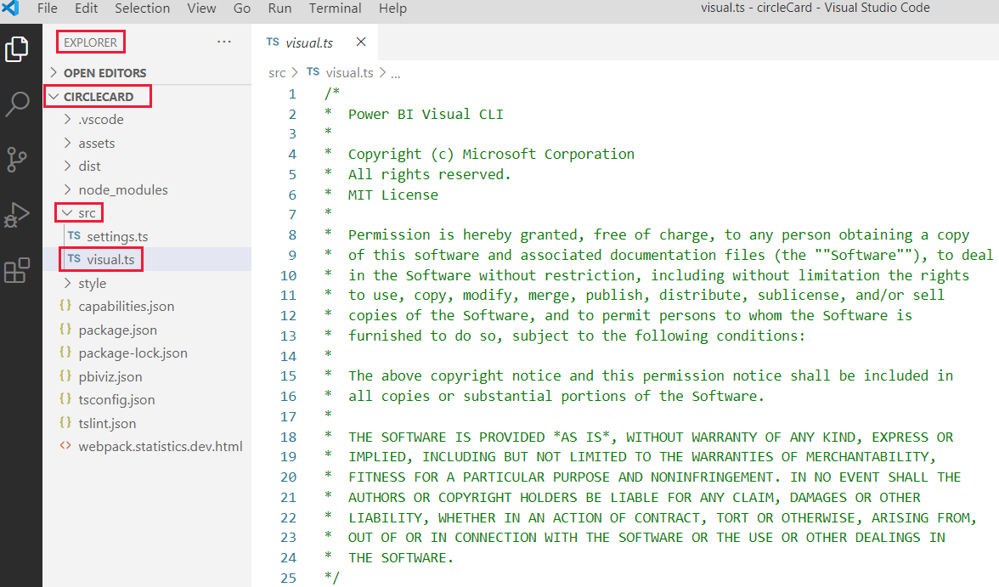
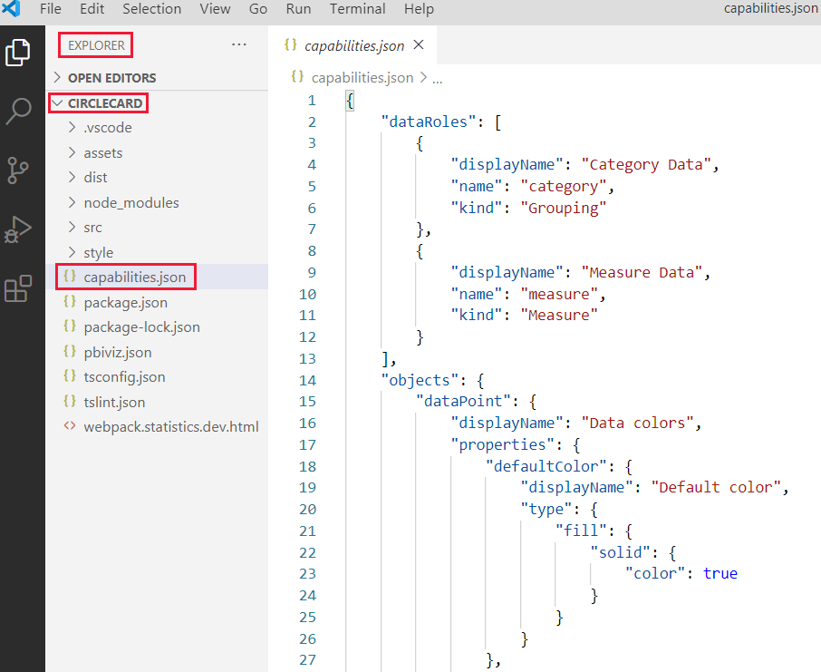

# <a name="tutorial-develop-a-power-bi-circle-card-visual"></a><span data-ttu-id="dfb6a-104">บทช่วยสอน: พัฒนาวิชวลการ์ดวงกลม Power BI</span><span class="sxs-lookup"><span data-stu-id="dfb6a-104">Tutorial: Develop a Power BI circle card visual</span></span>

<span data-ttu-id="dfb6a-105">ในฐานะนักพัฒนาคุณสามารถสร้างวิชวล Power BI ของคุณเองได้</span><span class="sxs-lookup"><span data-stu-id="dfb6a-105">As a developer you can create your own Power BI visuals.</span></span> <span data-ttu-id="dfb6a-106">ภาพเหล่านี้สามารถใช้โดยคุณองค์กรของคุณหรือบุคคลที่สามได้</span><span class="sxs-lookup"><span data-stu-id="dfb6a-106">These visuals can be used by you, your organization or by third parties.</span></span>

<span data-ttu-id="dfb6a-107">ในบทช่วยสอนนี้คุณจะพัฒนาการแสดงผลด้วยภาพของ Power BI ที่ชื่อว่าการ์ดวงกลมที่แสดงค่าหน่วยวัดที่จัดรูปแบบภายในวงกลม</span><span class="sxs-lookup"><span data-stu-id="dfb6a-107">In this tutorial, you'll develop a Power BI visual named circle card that displays a formatted measure value inside a circle.</span></span> <span data-ttu-id="dfb6a-108">วิชวลการ์ดวงกลมสนับสนุนการกำหนดเองของสีเติมและความหนาของเส้นขอบ</span><span class="sxs-lookup"><span data-stu-id="dfb6a-108">The circle card visual supports customization of fill color and outline thickness.</span></span>

<span data-ttu-id="dfb6a-109">ในบทช่วยสอนนี้ คุณจะเรียนรู้วิธีการ:</span><span class="sxs-lookup"><span data-stu-id="dfb6a-109">In this tutorial, you learn how to:</span></span>
> [!div class="checklist"]
> * <span data-ttu-id="dfb6a-110">สร้างโครงการการพัฒนาสำหรับวิชวลของคุณ</span><span class="sxs-lookup"><span data-stu-id="dfb6a-110">Create a development project for your visual.</span></span>
> * <span data-ttu-id="dfb6a-111">พัฒนาวิชวลของคุณด้วยองค์ประกอบภาพ D3</span><span class="sxs-lookup"><span data-stu-id="dfb6a-111">Develop your visual with D3 visual elements.</span></span>
> * <span data-ttu-id="dfb6a-112">กำหนดค่าวิชวลของคุณเพื่อประมวลผลข้อมูล</span><span class="sxs-lookup"><span data-stu-id="dfb6a-112">Configure your visual to process data.</span></span>

## <a name="prerequisites"></a><span data-ttu-id="dfb6a-113">สิ่งที่จำเป็นต้องมี</span><span class="sxs-lookup"><span data-stu-id="dfb6a-113">Prerequisites</span></span>

<span data-ttu-id="dfb6a-114">ก่อนที่คุณจะเริ่มพัฒนาวิชวล Power BI ของคุณให้ตรวจสอบว่าคุณมีทุกอย่างที่แสดงอยู่ในส่วนนี้</span><span class="sxs-lookup"><span data-stu-id="dfb6a-114">Before you start developing your Power BI visual, verify that you have everything listed in this section.</span></span>

* <span data-ttu-id="dfb6a-115">คุณจำเป็นต้องมีบัญชี **Power BI Pro**</span><span class="sxs-lookup"><span data-stu-id="dfb6a-115">You need a **Power BI Pro** account.</span></span> <span data-ttu-id="dfb6a-116">ถ้าคุณยังไม่มี [ลงทะเบียนสำหรับ](https://powerbi.microsoft.com/pricing/)รุ่นทดลองใช้ฟรี</span><span class="sxs-lookup"><span data-stu-id="dfb6a-116">If you don't have one, [sign up for a free trial](https://powerbi.microsoft.com/pricing/).</span></span>

* <span data-ttu-id="dfb6a-117">[ รหัส Visual Studio (VS Code)](https://www.visualstudio.com/)</span><span class="sxs-lookup"><span data-stu-id="dfb6a-117">[Visual Studio Code (VS Code)](https://www.visualstudio.com/).</span></span> <span data-ttu-id="dfb6a-118">VS Code คือสภาพแวดล้อมการพัฒนาแบบบูรณาการที่เหมาะสม (IDE) สำหรับการพัฒนาแอปพลิเคชัน JavaScript และ TypeScript</span><span class="sxs-lookup"><span data-stu-id="dfb6a-118">VS Code is an ideal Integrated Development Environment (IDE) for developing JavaScript and TypeScript applications.</span></span>

* <span data-ttu-id="dfb6a-119">[Windows PowerShell](/powershell/scripting/install/installing-windows-powershell) เวอร์ชัน4หรือใหม่กว่า (สำหรับ Windows)</span><span class="sxs-lookup"><span data-stu-id="dfb6a-119">[Windows PowerShell](/powershell/scripting/install/installing-windows-powershell) version 4 or later (for Windows).</span></span> <span data-ttu-id="dfb6a-120">[Terminal](https://macpaw.com/how-to/use-terminal-on-mac) (สำหรับ OSX)</span><span class="sxs-lookup"><span data-stu-id="dfb6a-120">Or [Terminal](https://macpaw.com/how-to/use-terminal-on-mac) (for OSX).</span></span>

* <span data-ttu-id="dfb6a-121">สภาพแวดล้อมที่พร้อมสำหรับการพัฒนาวิชวล Power BI</span><span class="sxs-lookup"><span data-stu-id="dfb6a-121">An environment ready for developing a Power BI visual.</span></span> <span data-ttu-id="dfb6a-122">[ตั้งค่าสภาพแวดล้อมของคุณสำหรับการพัฒนา](environment-setup.md)วิชวล Power BI</span><span class="sxs-lookup"><span data-stu-id="dfb6a-122">[Set up your environment for developing a Power BI visual](environment-setup.md).</span></span>

* <span data-ttu-id="dfb6a-123">บทช่วยสอนนี้ใช้รายงาน **การวิเคราะห์การขายของสหรัฐอเมริกา**</span><span class="sxs-lookup"><span data-stu-id="dfb6a-123">This tutorial uses the **US Sales Analysis** report.</span></span> <span data-ttu-id="dfb6a-124">คุณสามารถ [ดาวน์โหลด](https://microsoft.github.io/PowerBI-visuals/docs/step-by-step-lab/images/US_Sales_Analysis.pbix) รายงานนี้และอัปโหลดไปยังบริการของ Power BI หรือใช้รายงานของคุณเองได้</span><span class="sxs-lookup"><span data-stu-id="dfb6a-124">You can [download](https://microsoft.github.io/PowerBI-visuals/docs/step-by-step-lab/images/US_Sales_Analysis.pbix) this report and upload it to Power BI service, or use your own report.</span></span> <span data-ttu-id="dfb6a-125">หากคุณต้องการข้อมูลเพิ่มเติมเกี่ยวกับการบริการของ Power BI และการอัปโหลดไฟล์โปรดดูที่ [เริ่มต้นสร้างในบทช่วยสอน](../../fundamentals/service-get-started.md) บริการของ Power BI</span><span class="sxs-lookup"><span data-stu-id="dfb6a-125">If you need more information about Power BI service, and uploading files, refer to the [Get started creating in the Power BI service](../../fundamentals/service-get-started.md) tutorial.</span></span>

## <a name="create-a-development-project"></a><span data-ttu-id="dfb6a-126">สร้างโครงการการพัฒนา</span><span class="sxs-lookup"><span data-stu-id="dfb6a-126">Create a development project</span></span>

<span data-ttu-id="dfb6a-127">ในส่วนนี้คุณจะสร้างโครงการสำหรับการแสดงผลด้วยภาพของการ์ดวงกลม</span><span class="sxs-lookup"><span data-stu-id="dfb6a-127">In this section you'll create a project for the circle card visual.</span></span>

1. <span data-ttu-id="dfb6a-128">เปิด PowerShell และนำทางไปยังโฟลเดอร์ที่คุณต้องการสร้างโครงการของคุณ</span><span class="sxs-lookup"><span data-stu-id="dfb6a-128">Open PowerShell and navigate to the folder you want to create your project in.</span></span>

2. <span data-ttu-id="dfb6a-129">ป้อนคำสั่งต่อไปนี้:</span><span class="sxs-lookup"><span data-stu-id="dfb6a-129">Enter the following command:</span></span>

    ```PowerShell
    pbiviz new CircleCard
    ```

3. <span data-ttu-id="dfb6a-130">นำทางไปยังโฟลเดอร์ของโครงการ</span><span class="sxs-lookup"><span data-stu-id="dfb6a-130">Navigate to the project's folder.</span></span>

    ```powershell
    cd CircleCard
    ```

4. <span data-ttu-id="dfb6a-131">เริ่มการแสดงผลด้วยภาพของการ์ดวงกลม</span><span class="sxs-lookup"><span data-stu-id="dfb6a-131">Start the circle card visual.</span></span> <span data-ttu-id="dfb6a-132">ขณะนี้วิชวลของคุณกำลังทำงานอยู่ในขณะที่โฮสต์บนคอมพิวเตอร์ของคุณ</span><span class="sxs-lookup"><span data-stu-id="dfb6a-132">Your visual is now running while being hosted on your computer.</span></span>

    ```powershell
    pbiviz start
    ```
    >[!IMPORTANT]
    ><span data-ttu-id="dfb6a-133">อย่าปิดหน้าต่าง PowerSell จนกว่าจะถึงตอนท้ายของบทช่วยสอน</span><span class="sxs-lookup"><span data-stu-id="dfb6a-133">Do not close the PowerSell window until the end of the tutorial.</span></span> <span data-ttu-id="dfb6a-134">เมื่อต้องการหยุดการแสดงผลด้วยภาพให้ใส่ Ctrl + C และถ้าได้รับพร้อมท์ให้สิ้นสุดชุดงานให้ป้อน Y และกด *ใส่*</span><span class="sxs-lookup"><span data-stu-id="dfb6a-134">To stop the visual from running, enter Ctrl+C and if prompted to terminate the batch job, enter Y, and press *Enter*.</span></span>

## <a name="view-the-circle-card-in-power-bi-service"></a><span data-ttu-id="dfb6a-135">ดูการ์ดวงกลมในบริการของ Power BI</span><span class="sxs-lookup"><span data-stu-id="dfb6a-135">View the circle card in Power BI service</span></span>

<span data-ttu-id="dfb6a-136">ในการทดสอบการแสดงผลด้วยภาพของการ์ดวงกลมในบริการของ Power BI เราจะใช้รายงานการวิเคราะห์การขายของ **สหรัฐ**</span><span class="sxs-lookup"><span data-stu-id="dfb6a-136">To test the circle card visual in Power BI service, we'll use the **US Sales Analysis** report.</span></span> <span data-ttu-id="dfb6a-137">คุณสามารถ [ดาวน์โหลด](https://microsoft.github.io/PowerBI-visuals/docs/step-by-step-lab/images/US_Sales_Analysis.pbix) รายงานนี้และอัปโหลดไปยังบริการของ Power BI ได้</span><span class="sxs-lookup"><span data-stu-id="dfb6a-137">You can [download](https://microsoft.github.io/PowerBI-visuals/docs/step-by-step-lab/images/US_Sales_Analysis.pbix) this report and upload it to Power BI service.</span></span>

<span data-ttu-id="dfb6a-138">คุณยังสามารถใช้รายงานของคุณเองเพื่อทดสอบการแสดงผลด้วยภาพของการ์ดวงกลม</span><span class="sxs-lookup"><span data-stu-id="dfb6a-138">You can also use your own report to test the circle card visuals.</span></span>

>[!NOTE]
><span data-ttu-id="dfb6a-139">ก่อนที่คุณจะดำเนินการต่อให้ตรวจสอบว่าคุณ [เปิดใช้งานการตั้งค่านักพัฒนาวิชวล](environment-setup.md#set-up-power-bi-service-for-developing-a-visual)</span><span class="sxs-lookup"><span data-stu-id="dfb6a-139">Before you continue, verify that you [enabled the visuals developer settings](environment-setup.md#set-up-power-bi-service-for-developing-a-visual).</span></span>

1. <span data-ttu-id="dfb6a-140">ลงชื่อเข้าใช้ [PowerBI.com](https://powerbi.microsoft.com/) และเปิดรายงาน **การวิเคราะห์การขาย** สหรัฐ</span><span class="sxs-lookup"><span data-stu-id="dfb6a-140">Sign in to [PowerBI.com](https://powerbi.microsoft.com/) and open the **US Sales Analysis** report.</span></span>

2. <span data-ttu-id="dfb6a-141">เลือก **ตัวเลือกเพิ่มเติม** > **แก้ไข**</span><span class="sxs-lookup"><span data-stu-id="dfb6a-141">Select **More options** > **Edit**.</span></span>

    >[!div class="mx-imgBorder"]
    ><span data-ttu-id="dfb6a-142"></span><span class="sxs-lookup"><span data-stu-id="dfb6a-142"></span></span>

3. <span data-ttu-id="dfb6a-143">สร้างหน้าใหม่สำหรับการทดสอบโดยการคลิกที่ปุ่ม **หน้าใหม่** ที่ด้านล่างของส่วนติดต่อบริการของ Power BI</span><span class="sxs-lookup"><span data-stu-id="dfb6a-143">Create a new page for testing, by clicking on the **New page** button at the bottom of the Power BI service interface.</span></span>

    >[!div class="mx-imgBorder"]
    ><span data-ttu-id="dfb6a-144"></span><span class="sxs-lookup"><span data-stu-id="dfb6a-144"></span></span>

4. <span data-ttu-id="dfb6a-145">จากบานหน้าต่าง **การแสดงภาพ** ให้เลือก **วิชวลของนักพัฒนา**</span><span class="sxs-lookup"><span data-stu-id="dfb6a-145">From the **Visualizations** pane, select the **Developer Visual**.</span></span>

    >[!div class="mx-imgBorder"]
    ><span data-ttu-id="dfb6a-146"></span><span class="sxs-lookup"><span data-stu-id="dfb6a-146"></span></span>

    <span data-ttu-id="dfb6a-147">ภาพนี้แสดงการแสดงผลด้วยภาพแบบกำหนดเองที่คุณกำลังใช้งานบนคอมพิวเตอร์ของคุณ</span><span class="sxs-lookup"><span data-stu-id="dfb6a-147">This visual represents the custom visual that you're running on your computer.</span></span> <span data-ttu-id="dfb6a-148">พร้อมใช้งานเฉพาะเมื่อเปิดใช้งานการตั้งค่าการ [การตรวจแก้จุดบกพร่องของวิชวลแบบกำหนดเอง](environment-setup.md#set-up-power-bi-service-for-developing-a-visual)</span><span class="sxs-lookup"><span data-stu-id="dfb6a-148">It's only available when the [custom visual debugging](environment-setup.md#set-up-power-bi-service-for-developing-a-visual) setting is enabled.</span></span>

5. <span data-ttu-id="dfb6a-149">ตรวจสอบว่ามีการเพิ่มวิชวลลงในพื้นที่รายงาน</span><span class="sxs-lookup"><span data-stu-id="dfb6a-149">Verify that a visual was added to the report canvas.</span></span>

    >[!div class="mx-imgBorder"]
    ><span data-ttu-id="dfb6a-150"></span><span class="sxs-lookup"><span data-stu-id="dfb6a-150"></span></span>

    <span data-ttu-id="dfb6a-151">นี่เป็นวิชวลแบบง่าย ๆ ที่แสดงจำนวนครั้งที่มีการเรียกใช้วิธีการอัปเดต</span><span class="sxs-lookup"><span data-stu-id="dfb6a-151">This is a simple visual that displays the number of times its update method has been called.</span></span> <span data-ttu-id="dfb6a-152">ในขั้นตอนนี้ วิชวลยังไม่ได้เรียกข้อมูลใด</span><span class="sxs-lookup"><span data-stu-id="dfb6a-152">At this stage, the visual does not retrieve any data.</span></span>

    >[!NOTE]
    ><span data-ttu-id="dfb6a-153">หากภาพแสดงข้อความแสดงข้อผิดพลาดในการเชื่อมต่อให้เปิดแท็บใหม่ในเบราว์เซอร์ของคุณไปที่ `https://localhost:8080/assets/status` และอนุญาตให้เบราว์เซอร์ของคุณใช้ที่อยู่นี้</span><span class="sxs-lookup"><span data-stu-id="dfb6a-153">If the visual displays a connection error message, open a new tab in your browser, navigate to `https://localhost:8080/assets/status`, and authorize your browser to use this address.</span></span>
    >
    >

6. <span data-ttu-id="dfb6a-155">ในขณะที่เลือกภาพใหม่ให้ไปที่บานหน้าต่าง **เขตข้อมูล** ขยาย **ยอดขาย** และเลือก **ปริมาณ**</span><span class="sxs-lookup"><span data-stu-id="dfb6a-155">While the new visual is selected, go to the **Fields** pane, expand **Sales**, and select **Quantity**.</span></span>

    >[!div class="mx-imgBorder"]
    ><span data-ttu-id="dfb6a-156"></span><span class="sxs-lookup"><span data-stu-id="dfb6a-156"></span></span>

7. <span data-ttu-id="dfb6a-157">หากต้องการทดสอบการตอบสนองของภาพให้ปรับขนาดและสังเกตว่าค่า *อัปเดตจำนวน* จะเพิ่มขึ้นทุกครั้งที่คุณปรับขนาดวิชวล</span><span class="sxs-lookup"><span data-stu-id="dfb6a-157">To test how the visual is responding, resize it and notice that the *Update count* value increments every time you resize the visual.</span></span>

    >[!div class="mx-imgBorder"]
    ><span data-ttu-id="dfb6a-158"></span><span class="sxs-lookup"><span data-stu-id="dfb6a-158"></span></span>

## <a name="add-visual-elements-and-text"></a><span data-ttu-id="dfb6a-159">เพิ่มองค์ประกอบวิชวลและข้อความ</span><span class="sxs-lookup"><span data-stu-id="dfb6a-159">Add visual elements and text</span></span>

<span data-ttu-id="dfb6a-160">ในส่วนนี้ คุณจะได้เรียนรู้วิธีเปลี่ยนวิชวลของคุณให้เป็นวงกลมและทำให้แสดงข้อความ</span><span class="sxs-lookup"><span data-stu-id="dfb6a-160">In this section you'll learn how to turn your visual into a circle, and make it display text.</span></span>

>[!NOTE]
><span data-ttu-id="dfb6a-161">ในบทช่วยสอนนี้ [รหัส Visual Studio](https://code.visualstudio.com/) (VS Code) ใช้สำหรับการพัฒนาวิชวลของ Power BI</span><span class="sxs-lookup"><span data-stu-id="dfb6a-161">In this tutorial, [Visual Studio Code](https://code.visualstudio.com/) (VS Code) is used for developing the Power BI visual.</span></span>

### <a name="modify-the-visuals-file"></a><span data-ttu-id="dfb6a-162">ปรับเปลี่ยนไฟล์วิชวล</span><span class="sxs-lookup"><span data-stu-id="dfb6a-162">Modify the visuals file</span></span>

<span data-ttu-id="dfb6a-163">ตั้งค่าไฟล์ **visual.ts** โดยการลบและเพิ่มรหัสสองสามบรรทัด</span><span class="sxs-lookup"><span data-stu-id="dfb6a-163">Set up the **visual.ts** file by deleting and adding a few lines of code.</span></span>

1. <span data-ttu-id="dfb6a-164">เปิดโปรเจกต์ของคุณใน VS Code (**ไฟล์**  >  **เปิดโฟลเดอร์**)</span><span class="sxs-lookup"><span data-stu-id="dfb6a-164">Open your project in VS Code (**File** > **Open Folder**).</span></span>

2. <span data-ttu-id="dfb6a-165">ใน **บานหน้าต่าง Explorer** ขยายโฟลเดอร์ **src** และเลือกไฟล์ **visual.ts**</span><span class="sxs-lookup"><span data-stu-id="dfb6a-165">In the **Explorer pane**, expand the **src** folder, and select the file **visual.ts**.</span></span>

    >[!div class="mx-imgBorder"]
    ><span data-ttu-id="dfb6a-166"></span><span class="sxs-lookup"><span data-stu-id="dfb6a-166"></span></span>

    > [!IMPORTANT]
    > <span data-ttu-id="dfb6a-167">สังเกตดูข้อคิดเห็นที่ด้านบนของไฟล์ **visual.ts**</span><span class="sxs-lookup"><span data-stu-id="dfb6a-167">Notice the comments at the top of the **visual.ts** file.</span></span> <span data-ttu-id="dfb6a-168">การอนุญาตให้ใช้แพคเกจวิชวล Power BI จะได้รับโดยไม่เสียค่าใช้จ่ายภายใต้เงื่อนไขของสิทธิ์การใช้งานของสถาบันเทคโนโลยีแมสซาชูเซตส์ (MIT)</span><span class="sxs-lookup"><span data-stu-id="dfb6a-168">Permission to use the Power BI visual packages is granted free of charge under the terms of the Massachusetts Institute of Technology (MIT) License.</span></span> <span data-ttu-id="dfb6a-169">คุณต้องออกจากข้อคิดเห็นที่ด้านบนของไฟล์ ตามส่วนหนึ่งของข้อตกลง</span><span class="sxs-lookup"><span data-stu-id="dfb6a-169">As part of the agreement, you must leave the comments at the top of the file.</span></span>

3. <span data-ttu-id="dfb6a-170">ลบบรรทัดโค้ดต่อไปนี้ออกจากไฟล์ *visual.ts*</span><span class="sxs-lookup"><span data-stu-id="dfb6a-170">Remove the following code lines from the *visual.ts* file.</span></span>

    * <span data-ttu-id="dfb6a-171">การนำเข้า *VisualSettings*:</span><span class="sxs-lookup"><span data-stu-id="dfb6a-171">The *VisualSettings* import:</span></span>
        ```typescript
        import { VisualSettings } from "./settings";
        ```

    * <span data-ttu-id="dfb6a-172">การยืนยันตัวแปรส่วนตัวระดับคลาสทั้งสี่ครั้ง</span><span class="sxs-lookup"><span data-stu-id="dfb6a-172">The four class-level private variable declarations.</span></span>

    * <span data-ttu-id="dfb6a-173">ทุกบรรทัดของรหัสภายใน *คอนสตรักเตอร์*</span><span class="sxs-lookup"><span data-stu-id="dfb6a-173">All the lines of code inside the *constructor*.</span></span>

    * <span data-ttu-id="dfb6a-174">ทุกบรรทัดของรหัสภายในวิธี *การอัปเดต*</span><span class="sxs-lookup"><span data-stu-id="dfb6a-174">All the lines of code inside the *update* method.</span></span>

    * <span data-ttu-id="dfb6a-175">บรรทัดโค้ดที่เหลือทั้งหมดใต้วิธี *อัปเดต* รวมถึงวิธี *parseSettings* และ *enumerateObjectInstances*</span><span class="sxs-lookup"><span data-stu-id="dfb6a-175">All the remaining code lines below the *update* method, including the *parseSettings* and *enumerateObjectInstances* methods.</span></span>

4. <span data-ttu-id="dfb6a-176">เพิ่มบรรทัดรหัสต่อไปนี้ที่ส่วนท้ายของส่วนการนำเข้า:</span><span class="sxs-lookup"><span data-stu-id="dfb6a-176">Add the following lines of code at the end of the import section:</span></span>

    * <span data-ttu-id="dfb6a-177">*IVisualHost* - คอลเลกชันของคุณสมบัติและบริการที่ใช้ในการโต้ตอบกับโฮสต์ภาพ (Power BI)</span><span class="sxs-lookup"><span data-stu-id="dfb6a-177">*IVisualHost* -  A collection of properties and services used to interact with the visual host (Power BI).</span></span>

         ```typescript
        import IVisualHost = powerbi.extensibility.IVisualHost;
        ```

    * <span data-ttu-id="dfb6a-178">*ไลบรารี D3*</span><span class="sxs-lookup"><span data-stu-id="dfb6a-178">*D3 library*</span></span>

        ```typescript
        import * as d3 from "d3";
        type Selection<T extends d3.BaseType> = d3.Selection<T, any,any, any>;
        ```
    
        >[!NOTE]
        ><span data-ttu-id="dfb6a-179">หากคุณไม่ได้ติดตั้งไลบรารีนี้เป็นส่วนหนึ่งของการตั้งค่าของคุณให้ [ติดตั้งไลบรารี D3 JavaScript](environment-setup.md#d3-javascript-library)</span><span class="sxs-lookup"><span data-stu-id="dfb6a-179">If you didn't install this library as part of your setup, [install the D3 JavaScript library](environment-setup.md#d3-javascript-library).</span></span>

5. <span data-ttu-id="dfb6a-180">ภายใต้การประกาศคลาส *วิชวล* ให้แทรกคุณสมบัติระดับคลาสต่อไปนี้</span><span class="sxs-lookup"><span data-stu-id="dfb6a-180">Below the *Visual* class declaration, insert the following class level properties.</span></span> <span data-ttu-id="dfb6a-181">คุณต้องเพิ่มบรรทัดรหัสที่ขึ้นต้นด้วย `private`</span><span class="sxs-lookup"><span data-stu-id="dfb6a-181">You only need to add the code lines starting with `private`.</span></span>

    ```typescript
    export class Visual implements IVisual {
        // ...
        private host: IVisualHost;
        private svg: Selection<SVGElement>;
        private container: Selection<SVGElement>;
        private circle: Selection<SVGElement>;
        private textValue: Selection<SVGElement>;
        private textLabel: Selection<SVGElement>;
        // ...
    }
    ```

6. <span data-ttu-id="dfb6a-182">บันทึกไฟล์ **visual.ts**</span><span class="sxs-lookup"><span data-stu-id="dfb6a-182">Save the **visual.ts** file.</span></span>

### <a name="add-a-circle-and-text-elements"></a><span data-ttu-id="dfb6a-183">เพิ่มองค์ประกอบวงกลมและข้อความ</span><span class="sxs-lookup"><span data-stu-id="dfb6a-183">Add a circle and text elements</span></span>

<span data-ttu-id="dfb6a-184">เพิ่มกราฟิกเวกเตอร์ D3 ที่ปรับขนาดได้ (SVG)</span><span class="sxs-lookup"><span data-stu-id="dfb6a-184">Add D3 Scalable Vector Graphics (SVG).</span></span> <span data-ttu-id="dfb6a-185">ซึ่งเปิดใช้งานการสร้างรูปร่างสามแบบ: วงกลมและสององค์ประกอบข้อความ</span><span class="sxs-lookup"><span data-stu-id="dfb6a-185">This enables creating three shapes: a circle, and two text elements.</span></span>

1. <span data-ttu-id="dfb6a-186">เปิด **visual.ts** ในรหัส VS</span><span class="sxs-lookup"><span data-stu-id="dfb6a-186">Open **visual.ts** in VS code.</span></span>

2. <span data-ttu-id="dfb6a-187">เพิ่มรหัสต่อไปนี้ไปยัง *คอนสตรักเตอร์*</span><span class="sxs-lookup"><span data-stu-id="dfb6a-187">Add the following code to the *constructor*.</span></span>

    ```typescript
    this.svg = d3.select(options.element)
        .append('svg')
        .classed('circleCard', true);
    this.container = this.svg.append("g")
        .classed('container', true);
    this.circle = this.container.append("circle")
        .classed('circle', true);
    this.textValue = this.container.append("text")
        .classed("textValue", true);
    this.textLabel = this.container.append("text")
        .classed("textLabel", true);
    ```

    >[!TIP]
    ><span data-ttu-id="dfb6a-188">เพื่อปรับปรุงความสามารถในการอ่าน ขอแนะนำให้คุณจัดรูปแบบเอกสารทุกครั้งที่คุณคัดลอกข้อมูลโค้ดลงในโปรเจกต์ของคุณ</span><span class="sxs-lookup"><span data-stu-id="dfb6a-188">To improve readability, it's recommended that you format the document every time you copy code snippets into your project.</span></span> <span data-ttu-id="dfb6a-189">คลิกขวาที่ใดก็ได้ในรหัส VS แล้วเลือก *จัดรูปแบบเอกสาร* (Alt+Shift+F)</span><span class="sxs-lookup"><span data-stu-id="dfb6a-189">Right-click anywhere in VS code, and select *Format Document* (Alt+Shift+F).</span></span>

3. <span data-ttu-id="dfb6a-190">บันทึกไฟล์ **visual.ts**</span><span class="sxs-lookup"><span data-stu-id="dfb6a-190">Save the **visual.ts** file.</span></span>

### <a name="set-the-width-and-height"></a><span data-ttu-id="dfb6a-191">ตั้งค่าความกว้างและความสูง</span><span class="sxs-lookup"><span data-stu-id="dfb6a-191">Set the width and height</span></span>

<span data-ttu-id="dfb6a-192">ตั้งค่าความกว้างและความสูงของวิชวลและเริ่มต้นแอตทริบิวต์และสไตล์ขององค์ประกอบของวิชวล</span><span class="sxs-lookup"><span data-stu-id="dfb6a-192">Set the width and height of the visual, and initialize the attributes and styles of the visual's elements.</span></span>

1. <span data-ttu-id="dfb6a-193">เปิด **visual.ts** ในรหัส VS</span><span class="sxs-lookup"><span data-stu-id="dfb6a-193">Open **visual.ts** in VS Code.</span></span>

2. <span data-ttu-id="dfb6a-194">เพิ่มรหัสต่อไปนี้ไปยังวิธี *อัปเดต*</span><span class="sxs-lookup"><span data-stu-id="dfb6a-194">Add the following code to the *update* method.</span></span>

    ```typescript
    let width: number = options.viewport.width;
    let height: number = options.viewport.height;
    this.svg.attr("width", width);
    this.svg.attr("height", height);
    let radius: number = Math.min(width, height) / 2.2;
    this.circle
        .style("fill", "white")
        .style("fill-opacity", 0.5)
        .style("stroke", "black")
        .style("stroke-width", 2)
        .attr("r", radius)
        .attr("cx", width / 2)
        .attr("cy", height / 2);
    let fontSizeValue: number = Math.min(width, height) / 5;
    this.textValue
        .text("Value")
        .attr("x", "50%")
        .attr("y", "50%")
        .attr("dy", "0.35em")
        .attr("text-anchor", "middle")
        .style("font-size", fontSizeValue + "px");
    let fontSizeLabel: number = fontSizeValue / 4;
    this.textLabel
        .text("Label")
        .attr("x", "50%")
        .attr("y", height / 2)
        .attr("dy", fontSizeValue / 1.2)
        .attr("text-anchor", "middle")
        .style("font-size", fontSizeLabel + "px");
    ```

3. <span data-ttu-id="dfb6a-195">บันทึกไฟล์ **visual.ts**</span><span class="sxs-lookup"><span data-stu-id="dfb6a-195">Save the **visual.ts** file.</span></span>

### <a name="optional-review-the-code-in-the-visuals-file"></a><span data-ttu-id="dfb6a-196">(ไม่จำเป็น) รีวิวรหัสในไฟล์วิชวล</span><span class="sxs-lookup"><span data-stu-id="dfb6a-196">(Optional) Review the code in the visuals file</span></span>

<span data-ttu-id="dfb6a-197">ตรวจสอบว่าโค้ดในไฟล์ *visuals.ts* มีลักษณะดังนี้:</span><span class="sxs-lookup"><span data-stu-id="dfb6a-197">Verify that the code in the *visuals.ts* file looks like this:</span></span>

```typescript
/*
*  Power BI Visual CLI
*
*  Copyright (c) Microsoft Corporation
*  All rights reserved.
*  MIT License
*
*  Permission is hereby granted, free of charge, to any person obtaining a copy
*  of this software and associated documentation files (the ""Software""), to deal
*  in the Software without restriction, including without limitation the rights
*  to use, copy, modify, merge, publish, distribute, sublicense, and/or sell
*  copies of the Software, and to permit persons to whom the Software is
*  furnished to do so, subject to the following conditions:
*
*  The above copyright notice and this permission notice shall be included in
*  all copies or substantial portions of the Software.
*
*  THE SOFTWARE IS PROVIDED *AS IS*, WITHOUT WARRANTY OF ANY KIND, EXPRESS OR
*  IMPLIED, INCLUDING BUT NOT LIMITED TO THE WARRANTIES OF MERCHANTABILITY,
*  FITNESS FOR A PARTICULAR PURPOSE AND NONINFRINGEMENT. IN NO EVENT SHALL THE
*  AUTHORS OR COPYRIGHT HOLDERS BE LIABLE FOR ANY CLAIM, DAMAGES OR OTHER
*  LIABILITY, WHETHER IN AN ACTION OF CONTRACT, TORT OR OTHERWISE, ARISING FROM,
*  OUT OF OR IN CONNECTION WITH THE SOFTWARE OR THE USE OR OTHER DEALINGS IN
*  THE SOFTWARE.
*/
"use strict";

import "core-js/stable";
import "./../style/visual.less";
import powerbi from "powerbi-visuals-api";
import VisualConstructorOptions = powerbi.extensibility.visual.VisualConstructorOptions;
import VisualUpdateOptions = powerbi.extensibility.visual.VisualUpdateOptions;
import IVisual = powerbi.extensibility.visual.IVisual;
import EnumerateVisualObjectInstancesOptions = powerbi.EnumerateVisualObjectInstancesOptions;
import VisualObjectInstance = powerbi.VisualObjectInstance;
import DataView = powerbi.DataView;
import VisualObjectInstanceEnumerationObject = powerbi.VisualObjectInstanceEnumerationObject;
import IVisualHost = powerbi.extensibility.IVisualHost;
import * as d3 from "d3";
type Selection<T extends d3.BaseType> = d3.Selection<T, any, any, any>;

export class Visual implements IVisual {
    private host: IVisualHost;
    private svg: Selection<SVGElement>;
    private container: Selection<SVGElement>;
    private circle: Selection<SVGElement>;
    private textValue: Selection<SVGElement>;
    private textLabel: Selection<SVGElement>;

    constructor(options: VisualConstructorOptions) {
        this.svg = d3.select(options.element)
            .append('svg')
            .classed('circleCard', true);
        this.container = this.svg.append("g")
            .classed('container', true);
        this.circle = this.container.append("circle")
            .classed('circle', true);
        this.textValue = this.container.append("text")
            .classed("textValue", true);
        this.textLabel = this.container.append("text")
            .classed("textLabel", true);
    }

    public update(options: VisualUpdateOptions) {
        let width: number = options.viewport.width;
        let height: number = options.viewport.height;
        this.svg.attr("width", width);
        this.svg.attr("height", height);
        let radius: number = Math.min(width, height) / 2.2;
        this.circle
            .style("fill", "white")
            .style("fill-opacity", 0.5)
            .style("stroke", "black")
            .style("stroke-width", 2)
            .attr("r", radius)
            .attr("cx", width / 2)
            .attr("cy", height / 2);
        let fontSizeValue: number = Math.min(width, height) / 5;
        this.textValue
            .text("Value")
            .attr("x", "50%")
            .attr("y", "50%")
            .attr("dy", "0.35em")
            .attr("text-anchor", "middle")
            .style("font-size", fontSizeValue + "px");
        let fontSizeLabel: number = fontSizeValue / 4;
        this.textLabel
            .text("Label")
            .attr("x", "50%")
            .attr("y", height / 2)
            .attr("dy", fontSizeValue / 1.2)
            .attr("text-anchor", "middle")
            .style("font-size", fontSizeLabel + "px");
    }
}
```

### <a name="modify-the-capabilities-file"></a><span data-ttu-id="dfb6a-198">ปรับเปลี่ยนไฟล์ความสามารถ</span><span class="sxs-lookup"><span data-stu-id="dfb6a-198">Modify the capabilities file</span></span>

<span data-ttu-id="dfb6a-199">ลบบรรทัดรหัสที่ไม่จำเป็นออกจากไฟล์ความสามารถ</span><span class="sxs-lookup"><span data-stu-id="dfb6a-199">Delete unneeded lines of code from the capabilities file.</span></span>

1. <span data-ttu-id="dfb6a-200">เปิดโปรเจกต์ของคุณใน VS Code (**ไฟล์**  >  **เปิดโฟลเดอร์**)</span><span class="sxs-lookup"><span data-stu-id="dfb6a-200">Open your project in VS Code (**File** > **Open Folder**).</span></span>

2. <span data-ttu-id="dfb6a-201">บันทึกไฟล์ **capabilities.json**</span><span class="sxs-lookup"><span data-stu-id="dfb6a-201">Select the **capabilities.json** file.</span></span>

    >[!div class="mx-imgBorder"]
    ><span data-ttu-id="dfb6a-202"></span><span class="sxs-lookup"><span data-stu-id="dfb6a-202"></span></span>

3. <span data-ttu-id="dfb6a-203">ลบองค์ประกอบวัตถุทั้งหมด (บรรทัดที่ 14-60)</span><span class="sxs-lookup"><span data-stu-id="dfb6a-203">Remove all the objects elements (lines 14-60).</span></span>

4. <span data-ttu-id="dfb6a-204">บันทึกไฟล์ **capabilities.json**</span><span class="sxs-lookup"><span data-stu-id="dfb6a-204">Save the **capabilities.json** file.</span></span>

### <a name="restart-the-circle-card-visual"></a><span data-ttu-id="dfb6a-205">รีสตาร์ตวิชวลการ์ดวงกลม</span><span class="sxs-lookup"><span data-stu-id="dfb6a-205">Restart the circle card visual</span></span>

<span data-ttu-id="dfb6a-206">หยุดวิชวลจากการเรียกใช้และรีสตาร์ต</span><span class="sxs-lookup"><span data-stu-id="dfb6a-206">Stop the visual from running and restart it.</span></span>

1. <span data-ttu-id="dfb6a-207">ในหน้าต่าง PowerShell ที่เรียกใช้วิชวลให้ป้อน Ctrl + C และหากได้รับแจ้งให้ยุติงานแบตช์ให้ป้อน Y แล้วกด *Enter*</span><span class="sxs-lookup"><span data-stu-id="dfb6a-207">In the PowerShell window running the visual, enter Ctrl+C and if prompted to terminate the batch job, enter Y, and press *Enter*.</span></span>

2. <span data-ttu-id="dfb6a-208">เริ่มวิชวล ใน PowerShell</span><span class="sxs-lookup"><span data-stu-id="dfb6a-208">In PowerShell, start the visual.</span></span>

    ```powershell
    pbiviz start
    ```

### <a name="test-the-visual-with-the-added-elements"></a><span data-ttu-id="dfb6a-209">ทดสอบวิชวลด้วยองค์ประกอบที่เพิ่มเข้ามา</span><span class="sxs-lookup"><span data-stu-id="dfb6a-209">Test the visual with the added elements</span></span>

<span data-ttu-id="dfb6a-210">ตรวจสอบว่าวิชวลแสดงองค์ประกอบที่เพิ่มใหม่</span><span class="sxs-lookup"><span data-stu-id="dfb6a-210">Verify that the visual displays the newly added elements.</span></span>

1. <span data-ttu-id="dfb6a-211">ในบริการ Power BI เปิดรายงาน *การวิเคราะห์การขาย Power BI ของสหรัฐอเมริกา*</span><span class="sxs-lookup"><span data-stu-id="dfb6a-211">In Power BI service, open the *Power BI US Sales Analysis* report.</span></span> <span data-ttu-id="dfb6a-212">หากคุณใช้รายงานอื่นเพื่อพัฒนาวิชวลการ์ดวงกลมให้ไปที่รายงานนั้น</span><span class="sxs-lookup"><span data-stu-id="dfb6a-212">If you're using a different report to develop the circle card visual, navigate to that report.</span></span>

2. <span data-ttu-id="dfb6a-213">ตรวจสอบให้แน่ใจว่าวิชวลเป็นรูปวงกลม</span><span class="sxs-lookup"><span data-stu-id="dfb6a-213">Make sure that the visual is shaped as a circle.</span></span>

    >[!div class="mx-imgBorder"]
    ><span data-ttu-id="dfb6a-214"></span><span class="sxs-lookup"><span data-stu-id="dfb6a-214"></span></span>

    >[!NOTE]
    ><span data-ttu-id="dfb6a-215">หากวิชวลไม่แสดงอะไรเลยจากบานหน้าต่าง **เขตข้อมูล** ลากเขตข้อมูล **ปริมาณ** ลงในวิชวลของนักพัฒนา</span><span class="sxs-lookup"><span data-stu-id="dfb6a-215">If the visual isn't displaying anything, from the **Fields** pane, drag the **Quantity** field into the developer visual.</span></span>

3. <span data-ttu-id="dfb6a-216">ปรับขนาดวิชวล</span><span class="sxs-lookup"><span data-stu-id="dfb6a-216">Resize the visual.</span></span>

    <span data-ttu-id="dfb6a-217">สังเกตว่าวงกลมและขนาดข้อความจะพอดีกับขนาดของวิชวล</span><span class="sxs-lookup"><span data-stu-id="dfb6a-217">Notice that the circle and text scale to fit the dimensions of the visual.</span></span> <span data-ttu-id="dfb6a-218">วิธีการอัปเดตจะถูกเรียกเมื่อคุณปรับขนาดวิชวลและด้วยเหตุนี้องค์ประกอบวิชวลจึงถูกปรับขนาด</span><span class="sxs-lookup"><span data-stu-id="dfb6a-218">The update method is called when you resize the visual, and as a result the visual elements get rescaled.</span></span>

### <a name="enable-auto-reload"></a><span data-ttu-id="dfb6a-219">เปิดใช้งานการโหลดซ้ำอัตโนมัติ</span><span class="sxs-lookup"><span data-stu-id="dfb6a-219">Enable auto reload</span></span>

<span data-ttu-id="dfb6a-220">ใช้การตั้งค่านี้เพื่อให้แน่ใจว่าวิชวลถูกโหลดซ้ำโดยอัตโนมัติทุกครั้งที่คุณบันทึกการเปลี่ยนแปลงโปรเจกต์</span><span class="sxs-lookup"><span data-stu-id="dfb6a-220">Use this setting to ensure that the visual is automatically reloaded each time you save project changes.</span></span>

1. <span data-ttu-id="dfb6a-221">ไปที่รายงาน *การวิเคราะห์การขาย Power BI ของสหรัฐอเมริกา* (หรือไปยังโครงการที่มีวิชวลการ์ดวงกลมของคุณ)</span><span class="sxs-lookup"><span data-stu-id="dfb6a-221">Navigate to the *Power BI US Sales Analysis* report (or to the project that has your circle card visual).</span></span>

2. <span data-ttu-id="dfb6a-222">เลือกวิชวลการ์ดวงกลม</span><span class="sxs-lookup"><span data-stu-id="dfb6a-222">Select the circle card visual.</span></span>

3. <span data-ttu-id="dfb6a-223">ในแถบเครื่องมือแบบลอยให้เลือก **สลับการโหลดอัตโนมัติ**</span><span class="sxs-lookup"><span data-stu-id="dfb6a-223">In the floating toolbar, select **Toggle Auto Reload**.</span></span>

    >[!div class="mx-imgBorder"]
    ><span data-ttu-id="dfb6a-224"></span><span class="sxs-lookup"><span data-stu-id="dfb6a-224"></span></span>

## <a name="get-the-visual-to-process-data"></a><span data-ttu-id="dfb6a-225">รับวิชวลเพื่อประมวลผลข้อมูล</span><span class="sxs-lookup"><span data-stu-id="dfb6a-225">Get the visual to process data</span></span>

<span data-ttu-id="dfb6a-226">ในส่วนนี้ คุณจะกำหนดบทบาทข้อมูลและการแมปมุมมองข้อมูล</span><span class="sxs-lookup"><span data-stu-id="dfb6a-226">In this section, you'll define data roles and data view mappings.</span></span> <span data-ttu-id="dfb6a-227">นอกจากนี้คุณยังจะปรับเปลี่ยนวิชวลเพื่อแสดงชื่อของค่าที่แสดง</span><span class="sxs-lookup"><span data-stu-id="dfb6a-227">You'll also modify the visual to display the name of the value it's displaying.</span></span>

### <a name="configure-the-capabilities-file"></a><span data-ttu-id="dfb6a-228">กำหนดค่าไฟล์ความสามารถ</span><span class="sxs-lookup"><span data-stu-id="dfb6a-228">Configure the capabilities file</span></span>

<span data-ttu-id="dfb6a-229">ปรับเปลี่ยนไฟล์ **capabilities.json** เพื่อกำหนดบทบาทข้อมูลและการแมปมุมมองข้อมูล</span><span class="sxs-lookup"><span data-stu-id="dfb6a-229">Modify the **capabilities.json** file to define the data role and data view mappings.</span></span>

* <span data-ttu-id="dfb6a-230">**การกำหนดบทบาทข้อมูล**</span><span class="sxs-lookup"><span data-stu-id="dfb6a-230">**Defining the data role**</span></span>

    <span data-ttu-id="dfb6a-231">กำหนดอาร์เรย์ *dataRoles* ที่มีบทบาทข้อมูลเดียวของชนิด *หน่วยวัด*</span><span class="sxs-lookup"><span data-stu-id="dfb6a-231">Define the *dataRoles* array with a single data role of the type *measure*.</span></span> <span data-ttu-id="dfb6a-232">บทบาทข้อมูลนี้เรียกว่า *หน่วยวัด* และแสดงเป็น *หน่วยวัด*</span><span class="sxs-lookup"><span data-stu-id="dfb6a-232">This data role is called *measure*, and is displayed as *Measure*.</span></span> <span data-ttu-id="dfb6a-233">อนุญาตให้ส่งผ่านเขตข้อมูลการวัดหรือเขตข้อมูลที่สรุปได้</span><span class="sxs-lookup"><span data-stu-id="dfb6a-233">It allows passing either a measure field, or a field that's summed up.</span></span>

    1. <span data-ttu-id="dfb6a-234">เปิดไฟล์ **capabilities.json** ใน VS Code</span><span class="sxs-lookup"><span data-stu-id="dfb6a-234">Open the **capabilities.json** file in VS Code.</span></span>

    2. <span data-ttu-id="dfb6a-235">ลบเนื้อหาทั้งหมดภายในอาร์เรย์ **dataRoles** (บรรทัด 3-12)</span><span class="sxs-lookup"><span data-stu-id="dfb6a-235">Remove all the content inside the **dataRoles** array (lines 3-12).</span></span>

    3. <span data-ttu-id="dfb6a-236">แทรกรหัสต่อไปนี้ในอาร์เรย์ **dataRoles**</span><span class="sxs-lookup"><span data-stu-id="dfb6a-236">Insert the following code to the **dataRoles** array.</span></span>

        ```json
        {
            "displayName": "Measure",
            "name": "measure",
            "kind": "Measure"
        }
        ```

    4. <span data-ttu-id="dfb6a-237">บันทึกไฟล์ **capabilities.json**</span><span class="sxs-lookup"><span data-stu-id="dfb6a-237">Save the **capabilities.json** file.</span></span>

* <span data-ttu-id="dfb6a-238">**การกำหนดการแมปมุมมองข้อมูล**</span><span class="sxs-lookup"><span data-stu-id="dfb6a-238">**Defining the data view mapping**</span></span>

    <span data-ttu-id="dfb6a-239">กำหนดไฟล์ที่เรียกว่า *หน่วยวัด* ในอาร์เรย์ *dataViewMappings*</span><span class="sxs-lookup"><span data-stu-id="dfb6a-239">Define a filed called *measure* in the *dataViewMappings* array.</span></span> <span data-ttu-id="dfb6a-240">เขตข้อมูลนี้สามารถส่งผ่านไปยังบทบาทข้อมูล</span><span class="sxs-lookup"><span data-stu-id="dfb6a-240">This field can be passed to the data role.</span></span>

    1. <span data-ttu-id="dfb6a-241">เปิดไฟล์ **capabilities.json** ใน VS Code</span><span class="sxs-lookup"><span data-stu-id="dfb6a-241">Open the **capabilities.json** file in VS Code.</span></span>

    2. <span data-ttu-id="dfb6a-242">ลบเนื้อหาทั้งหมดภายในอาร์เรย์ **dataViewMappings** (บรรทัดที่ 10-30)</span><span class="sxs-lookup"><span data-stu-id="dfb6a-242">Remove all the content inside the **dataViewMappings** array (lines 10-30).</span></span>

    3. <span data-ttu-id="dfb6a-243">แทรกรหัสต่อไปนี้ในอาร์เรย์ **dataViewMappings**</span><span class="sxs-lookup"><span data-stu-id="dfb6a-243">Insert the following code to the **dataViewMappings** array.</span></span>

        ```json
        {
            "conditions": [
                { "measure": { "max": 1 } }
            ],
            "single": {
                "role": "measure"
            }
        }
        ```

    4. <span data-ttu-id="dfb6a-244">บันทึกไฟล์ **capabilities.json**</span><span class="sxs-lookup"><span data-stu-id="dfb6a-244">Save the **capabilities.json** file.</span></span>

### <a name="optional-review-the-capabilities-file-code-changes"></a><span data-ttu-id="dfb6a-245">(ไม่จำเป็น) ตรวจสอบการเปลี่ยนแปลงรหัสไฟล์ความสามารถ</span><span class="sxs-lookup"><span data-stu-id="dfb6a-245">(Optional) Review the capabilities file code changes</span></span>

<span data-ttu-id="dfb6a-246">ตรวจสอบว่าวิชวลของการ์ดวงกลมแสดงเขตข้อมูล *หน่วยวัด* และตรวจสอบการเปลี่ยนแปลงที่คุณทำโดยใช้ตัวเลือก *แสดง Dataview*</span><span class="sxs-lookup"><span data-stu-id="dfb6a-246">Verify that the circle card visual displays the *measure* field, and review the changes you made using the *Show Dataview* option.</span></span> 

1. <span data-ttu-id="dfb6a-247">ในบริการ Power BI เปิดรายงาน *การวิเคราะห์การขาย Power BI ของสหรัฐอเมริกา*</span><span class="sxs-lookup"><span data-stu-id="dfb6a-247">In Power BI service, open the *Power BI US Sales Analysis* report.</span></span> <span data-ttu-id="dfb6a-248">หากคุณใช้รายงานอื่นเพื่อพัฒนาวิชวลการ์ดวงกลมให้ไปที่รายงานนั้น</span><span class="sxs-lookup"><span data-stu-id="dfb6a-248">If you're using a different report to develop the circle card visual, navigate to that report.</span></span>

2. <span data-ttu-id="dfb6a-249">สังเกตว่าขณะนี้ภาพการ์ดวงกลมสามารถกำหนดค่าด้วยเขตข้อมูลที่ชื่อ *หน่วยวัด*</span><span class="sxs-lookup"><span data-stu-id="dfb6a-249">Notice that the circle card visual can now be configured with a field titled *Measure*.</span></span> <span data-ttu-id="dfb6a-250">คุณสามารถลากและวางองค์ประกอบจากบานหน้าต่าง **เขตข้อมูล** ลงในเขตข้อมูล *หน่วยวัด*</span><span class="sxs-lookup"><span data-stu-id="dfb6a-250">You can drag and drop elements from the **Fields** pane into the *Measure* field.</span></span>

    >[!div class="mx-imgBorder"]
    ><span data-ttu-id="dfb6a-251"></span><span class="sxs-lookup"><span data-stu-id="dfb6a-251"></span></span>

    > [!Note]
    > <span data-ttu-id="dfb6a-252">โครงการวิชวลยังไม่ได้รวมตรรกะการผูกข้อมูลเอาไว้</span><span class="sxs-lookup"><span data-stu-id="dfb6a-252">The visual project does not yet include data binding logic.</span></span>

3. <span data-ttu-id="dfb6a-253">ในแถบเครื่องมือลอยให้เลือก **แสดงมุมมองข้อมูล**</span><span class="sxs-lookup"><span data-stu-id="dfb6a-253">In the floating toolbar, select **Show Dataview**.</span></span> 

    >[!div class="mx-imgBorder"]
    ><span data-ttu-id="dfb6a-254"></span><span class="sxs-lookup"><span data-stu-id="dfb6a-254"></span></span>

4. <span data-ttu-id="dfb6a-255">เลือกจุดสามจุดเพื่อขยายการแสดงผลและเลือก **แบบเดี่ยว** เพื่อดูค่า</span><span class="sxs-lookup"><span data-stu-id="dfb6a-255">Select the three dots to expand the display, and select **single** to view the value.</span></span>

    >[!div class="mx-imgBorder"]
    ><span data-ttu-id="dfb6a-256"></span><span class="sxs-lookup"><span data-stu-id="dfb6a-256"></span></span>

5. <span data-ttu-id="dfb6a-257">ขยาย **เมตาดาต้า** ตามด้วยอาร์เรย์ **คอลัมน์** และตรวจสอบค่า **รูปแบบ** และ **displayName**</span><span class="sxs-lookup"><span data-stu-id="dfb6a-257">Expand **metadata**, then the **columns** array, and review the **format** and **displayName** values.</span></span>

    >[!div class="mx-imgBorder"]
    ><span data-ttu-id="dfb6a-258"></span><span class="sxs-lookup"><span data-stu-id="dfb6a-258"></span></span>

6. <span data-ttu-id="dfb6a-259">เมื่อต้องการสลับกลับไปที่วิชวล ในแถบเครื่องมือที่ลอยอยู่เหนือวิชวล ให้เลือก **แสดงมุมมองข้อมูล**</span><span class="sxs-lookup"><span data-stu-id="dfb6a-259">To toggle back to the visual, in the toolbar floating above the visual, select **Show Dataview**.</span></span>

### <a name="configure-the-visual-to-consume-data"></a><span data-ttu-id="dfb6a-260">กำหนดค่าวิชวลเพื่อใช้ข้อมูล</span><span class="sxs-lookup"><span data-stu-id="dfb6a-260">Configure the visual to consume data</span></span>

<span data-ttu-id="dfb6a-261">ทำการเปลี่ยนแปลงไฟล์ **visual.ts** เพื่อให้วิชวลการ์ดวงกลมสามารถใช้ข้อมูลได้</span><span class="sxs-lookup"><span data-stu-id="dfb6a-261">Make changes to the **visual.ts** file, so that the circle card visual will be able to consume data.</span></span>

1. <span data-ttu-id="dfb6a-262">เปิดไฟล์ **visual.ts** ใน VS Code</span><span class="sxs-lookup"><span data-stu-id="dfb6a-262">Open the **visual.ts** file in VS Code.</span></span>

2. <span data-ttu-id="dfb6a-263">เพิ่มบรรทัดต่อไปนี้เพื่อนำเข้า `DataView`อินเทอร์เฟซจาก`powerbi` โมดูล</span><span class="sxs-lookup"><span data-stu-id="dfb6a-263">Add the following line to import the `DataView` interface from the `powerbi` module.</span></span>

    ```typescript
    import DataView = powerbi.DataView;
    ```

3. <span data-ttu-id="dfb6a-264">ในวิธีการ *อัปเดต* ให้ดำเนินการดังต่อไปนี้:</span><span class="sxs-lookup"><span data-stu-id="dfb6a-264">In the *update* method, do the following:</span></span>

    * <span data-ttu-id="dfb6a-265">เพิ่มคำสั่งต่อไปนี้เป็นคำสั่งแรก</span><span class="sxs-lookup"><span data-stu-id="dfb6a-265">Add the following statement as the first statement.</span></span> <span data-ttu-id="dfb6a-266">คำสั่งกำหนด *มุมมองข้อมูล* ให้กับตัวแปรเพื่อให้เข้าถึงได้ง่ายและประกาศให้ตัวแปรอ้างอิงออบเจ็กต์ *มุมมองข้อมูล*</span><span class="sxs-lookup"><span data-stu-id="dfb6a-266">The statement assigns *dataView* to a variable for easy access, and declares the variable to reference the *dataView* object.</span></span>

        ```typescript
        let dataView: DataView = options.dataViews[0];
        ```

    * <span data-ttu-id="dfb6a-267">แทนที่ **.text ("Value")** ด้วยโค้ดบรรทัดนี้:</span><span class="sxs-lookup"><span data-stu-id="dfb6a-267">Replace **.text("Value")** with this line of code:</span></span>

        ```typescript
        .text(<string>dataView.single.value)
        ```

    * <span data-ttu-id="dfb6a-268">แทนที่ **.text("Label")** ด้วยโค้ดบรรทัดนี้:</span><span class="sxs-lookup"><span data-stu-id="dfb6a-268">Replace **.text("Label")** with this line of code:</span></span>

        ```typescript
        .text(dataView.metadata.columns[0].displayName)
        ```

4. <span data-ttu-id="dfb6a-269">บันทึกไฟล์ **visual.ts**</span><span class="sxs-lookup"><span data-stu-id="dfb6a-269">Save the **visual.ts** file.</span></span>

5. <span data-ttu-id="dfb6a-270">ตรวจสอบวิชวลในบริการ Power BI</span><span class="sxs-lookup"><span data-stu-id="dfb6a-270">Review the visual in Power BI service.</span></span> <span data-ttu-id="dfb6a-271">ขณะนี้วิชวลแสดงค่าและชื่อที่แสดง</span><span class="sxs-lookup"><span data-stu-id="dfb6a-271">The visual now displays the value and the display name.</span></span>

## <a name="next-steps"></a><span data-ttu-id="dfb6a-272">ขั้นตอนถัดไป</span><span class="sxs-lookup"><span data-stu-id="dfb6a-272">Next steps</span></span>

> [!div class="nextstepaction"]
> [<span data-ttu-id="dfb6a-273">เพิ่มตัวเลือกการจัดรูปแบบไปยังวิชวลการ์ดวงกลม</span><span class="sxs-lookup"><span data-stu-id="dfb6a-273">Add formatting options to the circle card visual</span></span>](custom-visual-develop-tutorial-format-options.md)

> [!div class="nextstepaction"]
> [<span data-ttu-id="dfb6a-274">สร้างวิชวลแผนภูมิแท่ง Power BI</span><span class="sxs-lookup"><span data-stu-id="dfb6a-274">Create a Power BI bar chart visual</span></span>](create-bar-chart.md)

> [!div class="nextstepaction"]
> [<span data-ttu-id="dfb6a-275">เรียนรู้วิธีการดีบักภาพ Power BI ที่คุณสร้างขึ้น</span><span class="sxs-lookup"><span data-stu-id="dfb6a-275">Learn how to debug a Power BI visual you created</span></span>](visuals-how-to-debug.md)

> [!div class="nextstepaction"]
> [<span data-ttu-id="dfb6a-276">โครงสร้างของโครงการวิชวล Power BI</span><span class="sxs-lookup"><span data-stu-id="dfb6a-276">Power BI visuals project structure</span></span>](visual-project-structure.md)
