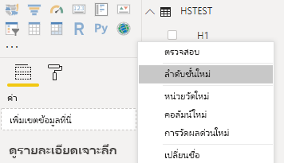
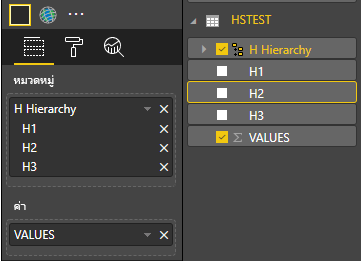
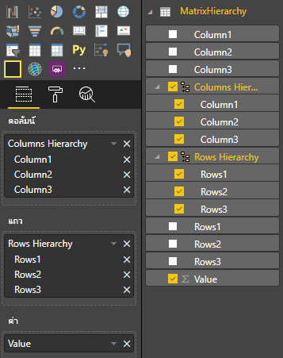

# <a name="add-drill-down-support"></a><span data-ttu-id="2515b-104">เพิ่มการสนับสนุนการดูรายละเอียดแนวลึก</span><span class="sxs-lookup"><span data-stu-id="2515b-104">Add Drill-Down support</span></span>

<span data-ttu-id="2515b-105">วิชวล Power BI สามารถใช้การดูรายละเอียดแนวลึกของ Power BI</span><span class="sxs-lookup"><span data-stu-id="2515b-105">Power BI visuals can use Power BI's drill-down.</span></span>

<span data-ttu-id="2515b-106">เรียนรู้เพิ่มเติมเกี่ยวกับการดูรายละเอียดแนวลึกของ Power BI ได้[ที่นี่](./../../consumer/end-user-drill.md)</span><span class="sxs-lookup"><span data-stu-id="2515b-106">Read more about Power BI drill-down [here](./../../consumer/end-user-drill.md)</span></span>

## <a name="enable-drill-down-support-in-the-visual"></a><span data-ttu-id="2515b-107">เปิดใช้งานการสนับสนุนการดูรายละเอียดแนวลึกในวิชวล</span><span class="sxs-lookup"><span data-stu-id="2515b-107">Enable drill-down support in the visual</span></span>

<span data-ttu-id="2515b-108">หากต้องการสนับสนุนการดูรายละเอียดแนวลึกในวิชวลของคุณ ให้เพิ่มเขตข้อมูลใหม่ลงใน `capabilities.json` ที่ชื่อ "ดูรายละเอียดแนวลึก" ซึ่งมีคุณสมบัติเดียว:</span><span class="sxs-lookup"><span data-stu-id="2515b-108">To support drill down in your visual, add a new field to `capabilities.json` named "drill-down", which has one property:</span></span>

```json
*roles - the name of the dataRole you want to enable drill-down on.
```

> [!NOTE]
> <span data-ttu-id="2515b-109">dataRole การดูรายละเอียดแนวลึกต้องเป็นชนิด `Grouping`</span><span class="sxs-lookup"><span data-stu-id="2515b-109">The drill-down dataRole must be of `Grouping` type.</span></span>
> <span data-ttu-id="2515b-110">คุณสมบัติ `max` ในเงื่อนไข dataRole ต้องถูกตั้งค่าเป็น 1</span><span class="sxs-lookup"><span data-stu-id="2515b-110">`max` property in the dataRole conditions must be set to 1.</span></span>

<span data-ttu-id="2515b-111">เมื่อคุณเพิ่มบทบาทลงในการดูรายละเอียดแนวลึก ผู้ใช้สามารถลากหลายเขตข้อมูลลงในบทบาทข้อมูลได้</span><span class="sxs-lookup"><span data-stu-id="2515b-111">Once you add the role to drill-down, users can drag multiple fields into the data role.</span></span>

<span data-ttu-id="2515b-112">ตัวอย่าง:</span><span class="sxs-lookup"><span data-stu-id="2515b-112">example:</span></span>

```json
{
    "dataRoles": [
        {
            "displayName": "Category",
            "name": "category",
            "kind": "Grouping"
        },
        {
            "displayName": "Value",
            "name": "value",
            "kind": "Measure"
        }
    ],
    "drilldown": {
        "roles": [
            "category"
        ]
    },
    "dataViewMappings": [
        {
            "categorical": {
                "categories": {
                    "for": {
                        "in": "category"
                    }
                },
                "values": {
                    "select": [
                        {
                            "bind": {
                                "to": "value"
                            }
                        }
                    ]
                }
            }
        }
    ]
}
```

## <a name="create-the-visual-with-drill-down-support"></a><span data-ttu-id="2515b-113">สร้างวิชวลด้วยการสนับสนุนการดูรายละเอียดแนวลึก</span><span class="sxs-lookup"><span data-stu-id="2515b-113">Create the visual with drill-down support</span></span>

<span data-ttu-id="2515b-114">เรียกใช้</span><span class="sxs-lookup"><span data-stu-id="2515b-114">Run</span></span>

```cmd
pbiviz new testDrillDown -t default
```

<span data-ttu-id="2515b-115">เพื่อสร้างวิชวลตัวอย่างเริ่มต้น</span><span class="sxs-lookup"><span data-stu-id="2515b-115">to create a default sample visual.</span></span> <span data-ttu-id="2515b-116">และใช้ตัวอย่างด้านบนของ `capabilities.json` กับวิชวลที่สร้างขึ้นใหม่</span><span class="sxs-lookup"><span data-stu-id="2515b-116">And apply the above sample of `capabilities.json` to the newly created visual.</span></span>

<span data-ttu-id="2515b-117">สร้างคุณสมบัติสำหรับคอนเทนเนอร์ `div` เพื่อเก็บองค์ประกอบ HTML ของวิชวล:</span><span class="sxs-lookup"><span data-stu-id="2515b-117">Create the property for `div` container to hold HTML elements of the visual:</span></span>

```typescript
"use strict";

import "core-js/stable";
import "./../style/visual.less";
// imports

export class Visual implements IVisual {
    // visual properties
    // ...
    private div: HTMLDivElement; // <== NEW PROPERTY

    constructor(options: VisualConstructorOptions) {
        // constructor body
        // ...
    }

    public update(options: VisualUpdateOptions) {
        // update method body
        // ...
    }

    private static parseSettings(dataView: DataView): VisualSettings {
        return <VisualSettings>VisualSettings.parse(dataView);
    }

    public enumerateObjectInstances(options: EnumerateVisualObjectInstancesOptions): VisualObjectInstance[] | VisualObjectInstanceEnumerationObject {
        return VisualSettings.enumerateObjectInstances(this.settings || VisualSettings.getDefault(), options);
    }
}
```

<span data-ttu-id="2515b-118">อัปเดตคอนสตรักเตอร์ของวิชวล:</span><span class="sxs-lookup"><span data-stu-id="2515b-118">Update the constructor of the visual:</span></span>

```typescript

export class Visual implements IVisual {
    // visual properties
    // ...
    private div: HTMLDivElement;

    constructor(options: VisualConstructorOptions) {
        console.log('Visual constructor', options);
        this.target = options.element;
        this.updateCount = 0;

        const new_p: HTMLElement = document.createElement("p");
        new_p.appendChild(document.createTextNode("Hierarchy level:"));
        const new_em: HTMLElement = document.createElement("em");
        this.textNode = document.createTextNode(this.updateCount.toString());
        new_em.appendChild(this.textNode);
        new_p.appendChild(new_em);
        this.target.appendChild(new_p);

        this.div = document.createElement("div"); // <== CREATE DIV ELEMENT
        this.target.appendChild(this.div);
    }
}
```

<span data-ttu-id="2515b-119">อัปเดตเมธอด `update` ของวิชวลเพื่อสร้าง `button`s:</span><span class="sxs-lookup"><span data-stu-id="2515b-119">Update the `update` method of the visual to create `button`s:</span></span>

```typescript
export class Visual implements IVisual {
    // ...

    public update(options: VisualUpdateOptions) {
        this.settings = Visual.parseSettings(options && options.dataViews && options.dataViews[0]);
        console.log('Visual update', options);

        const dataView: DataView = options.dataViews[0];
        const categoricalDataView: DataViewCategorical = dataView.categorical;

        // don't create elements if no data
        if (!options.dataViews[0].categorical ||
            !options.dataViews[0].categorical.categories) {
            return
        }

        // to display current level of hierarchy
        if (typeof this.textNode !== undefined) {
            this.textNode.textContent = categoricalDataView.categories[categoricalDataView.categories.length - 1].source.displayName.toString();
        }

        // remove old elements
        // for better performance use D3js pattern:
        // https://d3js.org/#enter-exit
        while (this.div.firstChild) {
            this.div.removeChild(this.div.firstChild);
        }

        // create buttons for each category value
        categoricalDataView.categories[categoricalDataView.categories.length - 1].values.forEach( (category: powerbi.PrimitiveValue, index: number) => {
            let button = document.createElement("button");
            button.innerText = category.toString();

            this.div.appendChild(button);
        })

    }
    // ...
```

<span data-ttu-id="2515b-120">ใช้สไตล์อย่างง่ายใน `.\style\visual.less`:</span><span class="sxs-lookup"><span data-stu-id="2515b-120">Apply simple styles in `.\style\visual.less`:</span></span>

```less
button {
    margin: 5px;
    min-width: 50px;
    min-height: 50px;
}
```

<span data-ttu-id="2515b-121">เตรียมข้อมูลตัวอย่างเพื่อทดสอบวิชวล:</span><span class="sxs-lookup"><span data-stu-id="2515b-121">Prepare sample data to test the visual:</span></span>

|   <span data-ttu-id="2515b-122">H1</span><span class="sxs-lookup"><span data-stu-id="2515b-122">H1</span></span>  |   <span data-ttu-id="2515b-123">H2</span><span class="sxs-lookup"><span data-stu-id="2515b-123">H2</span></span>    | <span data-ttu-id="2515b-124">H3</span><span class="sxs-lookup"><span data-stu-id="2515b-124">H3</span></span>  |   <span data-ttu-id="2515b-125">VALUES</span><span class="sxs-lookup"><span data-stu-id="2515b-125">VALUES</span></span>  |
|-----|-----|------|-------|
|   <span data-ttu-id="2515b-126">A</span><span class="sxs-lookup"><span data-stu-id="2515b-126">A</span></span>   |    <span data-ttu-id="2515b-127">A1</span><span class="sxs-lookup"><span data-stu-id="2515b-127">A1</span></span>  |    <span data-ttu-id="2515b-128">A11</span><span class="sxs-lookup"><span data-stu-id="2515b-128">A11</span></span> |    <span data-ttu-id="2515b-129">1</span><span class="sxs-lookup"><span data-stu-id="2515b-129">1</span></span>   |
|   <span data-ttu-id="2515b-130">A</span><span class="sxs-lookup"><span data-stu-id="2515b-130">A</span></span>    |    <span data-ttu-id="2515b-131">A1</span><span class="sxs-lookup"><span data-stu-id="2515b-131">A1</span></span>    |    <span data-ttu-id="2515b-132">A12</span><span class="sxs-lookup"><span data-stu-id="2515b-132">A12</span></span>    |    <span data-ttu-id="2515b-133">2</span><span class="sxs-lookup"><span data-stu-id="2515b-133">2</span></span>    |
|   <span data-ttu-id="2515b-134">A</span><span class="sxs-lookup"><span data-stu-id="2515b-134">A</span></span>    |    <span data-ttu-id="2515b-135">A2</span><span class="sxs-lookup"><span data-stu-id="2515b-135">A2</span></span>    |    <span data-ttu-id="2515b-136">A21</span><span class="sxs-lookup"><span data-stu-id="2515b-136">A21</span></span>    |    <span data-ttu-id="2515b-137">3</span><span class="sxs-lookup"><span data-stu-id="2515b-137">3</span></span>    |
|   <span data-ttu-id="2515b-138">A</span><span class="sxs-lookup"><span data-stu-id="2515b-138">A</span></span>    |    <span data-ttu-id="2515b-139">A2</span><span class="sxs-lookup"><span data-stu-id="2515b-139">A2</span></span>    |    <span data-ttu-id="2515b-140">A22</span><span class="sxs-lookup"><span data-stu-id="2515b-140">A22</span></span>    |    <span data-ttu-id="2515b-141">4</span><span class="sxs-lookup"><span data-stu-id="2515b-141">4</span></span>    |
|   <span data-ttu-id="2515b-142">A</span><span class="sxs-lookup"><span data-stu-id="2515b-142">A</span></span>    |    <span data-ttu-id="2515b-143">A3</span><span class="sxs-lookup"><span data-stu-id="2515b-143">A3</span></span>    |    <span data-ttu-id="2515b-144">A31</span><span class="sxs-lookup"><span data-stu-id="2515b-144">A31</span></span>    |    <span data-ttu-id="2515b-145">5</span><span class="sxs-lookup"><span data-stu-id="2515b-145">5</span></span>    |
|   <span data-ttu-id="2515b-146">A</span><span class="sxs-lookup"><span data-stu-id="2515b-146">A</span></span>    |    <span data-ttu-id="2515b-147">A3</span><span class="sxs-lookup"><span data-stu-id="2515b-147">A3</span></span>    |    <span data-ttu-id="2515b-148">A32</span><span class="sxs-lookup"><span data-stu-id="2515b-148">A32</span></span>    |    <span data-ttu-id="2515b-149">6</span><span class="sxs-lookup"><span data-stu-id="2515b-149">6</span></span>    |
|   <span data-ttu-id="2515b-150">B</span><span class="sxs-lookup"><span data-stu-id="2515b-150">B</span></span>    |    <span data-ttu-id="2515b-151">B1</span><span class="sxs-lookup"><span data-stu-id="2515b-151">B1</span></span>    |    <span data-ttu-id="2515b-152">B11</span><span class="sxs-lookup"><span data-stu-id="2515b-152">B11</span></span>    |    <span data-ttu-id="2515b-153">7</span><span class="sxs-lookup"><span data-stu-id="2515b-153">7</span></span>    |
|   <span data-ttu-id="2515b-154">B</span><span class="sxs-lookup"><span data-stu-id="2515b-154">B</span></span>    |    <span data-ttu-id="2515b-155">B1</span><span class="sxs-lookup"><span data-stu-id="2515b-155">B1</span></span>    |    <span data-ttu-id="2515b-156">B12</span><span class="sxs-lookup"><span data-stu-id="2515b-156">B12</span></span>    |    <span data-ttu-id="2515b-157">8</span><span class="sxs-lookup"><span data-stu-id="2515b-157">8</span></span>    |
|   <span data-ttu-id="2515b-158">B</span><span class="sxs-lookup"><span data-stu-id="2515b-158">B</span></span>    |    <span data-ttu-id="2515b-159">B2</span><span class="sxs-lookup"><span data-stu-id="2515b-159">B2</span></span>    |    <span data-ttu-id="2515b-160">B21</span><span class="sxs-lookup"><span data-stu-id="2515b-160">B21</span></span>    |    <span data-ttu-id="2515b-161">9</span><span class="sxs-lookup"><span data-stu-id="2515b-161">9</span></span>    |
|   <span data-ttu-id="2515b-162">B</span><span class="sxs-lookup"><span data-stu-id="2515b-162">B</span></span>    |    <span data-ttu-id="2515b-163">B2</span><span class="sxs-lookup"><span data-stu-id="2515b-163">B2</span></span>    |    <span data-ttu-id="2515b-164">B22</span><span class="sxs-lookup"><span data-stu-id="2515b-164">B22</span></span>    |    <span data-ttu-id="2515b-165">10</span><span class="sxs-lookup"><span data-stu-id="2515b-165">10</span></span>    |
|   <span data-ttu-id="2515b-166">B</span><span class="sxs-lookup"><span data-stu-id="2515b-166">B</span></span>    |    <span data-ttu-id="2515b-167">B3</span><span class="sxs-lookup"><span data-stu-id="2515b-167">B3</span></span>    |    <span data-ttu-id="2515b-168">B31</span><span class="sxs-lookup"><span data-stu-id="2515b-168">B31</span></span>    |    <span data-ttu-id="2515b-169">11</span><span class="sxs-lookup"><span data-stu-id="2515b-169">11</span></span>    |
|   <span data-ttu-id="2515b-170">B</span><span class="sxs-lookup"><span data-stu-id="2515b-170">B</span></span>    |    <span data-ttu-id="2515b-171">B3</span><span class="sxs-lookup"><span data-stu-id="2515b-171">B3</span></span>    |    <span data-ttu-id="2515b-172">B32</span><span class="sxs-lookup"><span data-stu-id="2515b-172">B32</span></span>    |    <span data-ttu-id="2515b-173">12</span><span class="sxs-lookup"><span data-stu-id="2515b-173">12</span></span>    |

<span data-ttu-id="2515b-174">และสร้างลำดับชั้นใน Power BI Desktop:</span><span class="sxs-lookup"><span data-stu-id="2515b-174">And create Hierarchy in Power BI Desktop:</span></span>



<span data-ttu-id="2515b-176">รวมคอลัมน์หมวดหมู่ทั้งหมด (H1, H2, H3) ไปยังลำดับชั้นใหม่:</span><span class="sxs-lookup"><span data-stu-id="2515b-176">Include all category columns (H1, H2, H3) to the new hierarchy:</span></span>


<span data-ttu-id="2515b-178">หลังจากขั้นตอนเหล่านั้นคุณควรได้รับวิชวลต่อไปนี้:</span><span class="sxs-lookup"><span data-stu-id="2515b-178">After those steps you should get following visual:</span></span>


## <a name="add-context-menu-to-visual-elements"></a><span data-ttu-id="2515b-180">เพิ่มเมนูบริบทไปยังองค์ประกอบวิชวล</span><span class="sxs-lookup"><span data-stu-id="2515b-180">Add context menu to visual elements</span></span>

<span data-ttu-id="2515b-181">ในขั้นตอนนี้ คุณจะเพิ่มเมนูบริบทลงในปุ่มบนวิชวล:</span><span class="sxs-lookup"><span data-stu-id="2515b-181">In this step you'll add context menu to the button's on the visual:</span></span>


<span data-ttu-id="2515b-183">หากต้องการสร้างเมนูบริบท ให้บันทึกออบเจ็กต์ `host` ในคุณสมบัติของวิชวล และเรียกเมธอด `createSelectionManager` เพื่อสร้างตัวจัดการการเลือกสำหรับแสดงเมนูบริบทโดยใช้ Power BI Visuals API</span><span class="sxs-lookup"><span data-stu-id="2515b-183">To create context menu, save `host` object in the properties of the visual and call `createSelectionManager` method to the create selection manager to display a context menu by using Power BI Visuals API.</span></span>

```typescript
"use strict";

import "core-js/stable";
import "./../style/visual.less";
// imports

import powerbiVisualsApi from "powerbi-visuals-api";
import ISelectionManager = powerbiVisualsApi.extensibility.ISelectionManager;
import ISelectionId = powerbiVisualsApi.visuals.ISelectionId;
import ISelectionIdBuilder = powerbiVisualsApi.visuals.ISelectionIdBuilder;

export class Visual implements IVisual {
    // visual properties
    // ...
    private div: HTMLDivElement;
    private host: IVisualHost; // <== NEW PROPERTY
    private selectionManager: ISelectionManager; // <== NEW PROPERTY

    constructor(options: VisualConstructorOptions) {
        // constructor body
        // save the host in the visuals properties
        this.host = options.host;
        // create selection manager
        this.selectionManager = this.host.createSelectionManager();
        // ...
    }

    public update(options: VisualUpdateOptions) {
        // update method body
        // ...
    }

    // ...
}
```

<span data-ttu-id="2515b-184">เปลี่ยนเนื้อความของการเรียกกลับฟังก์ชัน `forEach` เป็น:</span><span class="sxs-lookup"><span data-stu-id="2515b-184">Change the body of `forEach` function callback to:</span></span>

```typescript
    categoricalDataView.categories[categoricalDataView.categories.length - 1].values.forEach( (category: powerbi.PrimitiveValue, index: number) => {
        // create selectionID for each category value
        let selectionID: ISelectionID = this.host.createSelectionIdBuilder()
            .withCategory(categoricalDataView.categories[0], index)
            .createSelectionId();

        let button = document.createElement("button");
        button.innerText = category.toString();

        // add event listener to click event
        button.addEventListener("click", (event) => {
            // call select method in the selection manager
            this.selectionManager.select(selectionID);
        });

        button.addEventListener("contextmenu", (event) => {
            // call showContextMenu method to display context menu on the visual
            this.selectionManager.showContextMenu(selectionID, {
                x: event.clientX,
                y: event.clientY
            });
            event.preventDefault();
        });

        this.div.appendChild(button);
    });
```

<span data-ttu-id="2515b-185">นำข้อมูลไปใช้กับวิชวล:</span><span class="sxs-lookup"><span data-stu-id="2515b-185">Apply data to the visual:</span></span>



<span data-ttu-id="2515b-187">ในขั้นตอนสุดท้าย คุณควรได้รับวิชวลที่มีการเลือกและเมนูบริบท:</span><span class="sxs-lookup"><span data-stu-id="2515b-187">In the final step you should get visual with selections and context menu:</span></span>


## <a name="add-drill-down-support-for-matrix-data-view-mapping"></a><span data-ttu-id="2515b-189">เพิ่มการสนับสนุนการดูรายละเอียดแนวลึกสำหรับการแมปมุมมองข้อมูลแบบเมทริกซ์</span><span class="sxs-lookup"><span data-stu-id="2515b-189">Add drill-down support for matrix data view mapping</span></span>

<span data-ttu-id="2515b-190">จัดเตรียมข้อมูลตัวอย่างเพื่อทดสอบวิชวลที่มีการแมปมุมมองข้อมูลแบบเมทริกซ์:</span><span class="sxs-lookup"><span data-stu-id="2515b-190">Prepare sample data to test the visual with matrix data view mappings:</span></span>

|   <span data-ttu-id="2515b-191">Row1</span><span class="sxs-lookup"><span data-stu-id="2515b-191">Row1</span></span>   |   <span data-ttu-id="2515b-192">Row2</span><span class="sxs-lookup"><span data-stu-id="2515b-192">Row2</span></span>   |   <span data-ttu-id="2515b-193">Row3</span><span class="sxs-lookup"><span data-stu-id="2515b-193">Row3</span></span>   |   <span data-ttu-id="2515b-194">คอลัมน์ 1</span><span class="sxs-lookup"><span data-stu-id="2515b-194">Column1</span></span>   |   <span data-ttu-id="2515b-195">คอลัมน์2</span><span class="sxs-lookup"><span data-stu-id="2515b-195">Column2</span></span>   |   <span data-ttu-id="2515b-196">คอลัมน์3</span><span class="sxs-lookup"><span data-stu-id="2515b-196">Column3</span></span>   |   <span data-ttu-id="2515b-197">มูลค่า</span><span class="sxs-lookup"><span data-stu-id="2515b-197">Values</span></span>   |
|-----|-----|------|-------|-------|-------|-------|
|   <span data-ttu-id="2515b-198">R1</span><span class="sxs-lookup"><span data-stu-id="2515b-198">R1</span></span>   |   <span data-ttu-id="2515b-199">R11</span><span class="sxs-lookup"><span data-stu-id="2515b-199">R11</span></span>   |   <span data-ttu-id="2515b-200">R111</span><span class="sxs-lookup"><span data-stu-id="2515b-200">R111</span></span>   |   <span data-ttu-id="2515b-201">C1</span><span class="sxs-lookup"><span data-stu-id="2515b-201">C1</span></span>   |   <span data-ttu-id="2515b-202">C11</span><span class="sxs-lookup"><span data-stu-id="2515b-202">C11</span></span>   |   <span data-ttu-id="2515b-203">C111</span><span class="sxs-lookup"><span data-stu-id="2515b-203">C111</span></span>   |   <span data-ttu-id="2515b-204">1</span><span class="sxs-lookup"><span data-stu-id="2515b-204">1</span></span>   |
|   <span data-ttu-id="2515b-205">R1</span><span class="sxs-lookup"><span data-stu-id="2515b-205">R1</span></span>   |   <span data-ttu-id="2515b-206">R11</span><span class="sxs-lookup"><span data-stu-id="2515b-206">R11</span></span>   |   <span data-ttu-id="2515b-207">R112</span><span class="sxs-lookup"><span data-stu-id="2515b-207">R112</span></span>   |   <span data-ttu-id="2515b-208">C1</span><span class="sxs-lookup"><span data-stu-id="2515b-208">C1</span></span>   |   <span data-ttu-id="2515b-209">C11</span><span class="sxs-lookup"><span data-stu-id="2515b-209">C11</span></span>   |   <span data-ttu-id="2515b-210">C112</span><span class="sxs-lookup"><span data-stu-id="2515b-210">C112</span></span>   |   <span data-ttu-id="2515b-211">2</span><span class="sxs-lookup"><span data-stu-id="2515b-211">2</span></span>   |
|   <span data-ttu-id="2515b-212">R1</span><span class="sxs-lookup"><span data-stu-id="2515b-212">R1</span></span>   |   <span data-ttu-id="2515b-213">R11</span><span class="sxs-lookup"><span data-stu-id="2515b-213">R11</span></span>   |   <span data-ttu-id="2515b-214">R113</span><span class="sxs-lookup"><span data-stu-id="2515b-214">R113</span></span>   |   <span data-ttu-id="2515b-215">C1</span><span class="sxs-lookup"><span data-stu-id="2515b-215">C1</span></span>   |   <span data-ttu-id="2515b-216">C11</span><span class="sxs-lookup"><span data-stu-id="2515b-216">C11</span></span>   |   <span data-ttu-id="2515b-217">C113</span><span class="sxs-lookup"><span data-stu-id="2515b-217">C113</span></span>   |   <span data-ttu-id="2515b-218">3</span><span class="sxs-lookup"><span data-stu-id="2515b-218">3</span></span>   |
|   <span data-ttu-id="2515b-219">R1</span><span class="sxs-lookup"><span data-stu-id="2515b-219">R1</span></span>   |   <span data-ttu-id="2515b-220">R12</span><span class="sxs-lookup"><span data-stu-id="2515b-220">R12</span></span>   |   <span data-ttu-id="2515b-221">R121</span><span class="sxs-lookup"><span data-stu-id="2515b-221">R121</span></span>   |   <span data-ttu-id="2515b-222">C1</span><span class="sxs-lookup"><span data-stu-id="2515b-222">C1</span></span>   |   <span data-ttu-id="2515b-223">C12</span><span class="sxs-lookup"><span data-stu-id="2515b-223">C12</span></span>   |   <span data-ttu-id="2515b-224">C121</span><span class="sxs-lookup"><span data-stu-id="2515b-224">C121</span></span>   |   <span data-ttu-id="2515b-225">4</span><span class="sxs-lookup"><span data-stu-id="2515b-225">4</span></span>   |
|   <span data-ttu-id="2515b-226">R1</span><span class="sxs-lookup"><span data-stu-id="2515b-226">R1</span></span>   |   <span data-ttu-id="2515b-227">R12</span><span class="sxs-lookup"><span data-stu-id="2515b-227">R12</span></span>   |   <span data-ttu-id="2515b-228">R122</span><span class="sxs-lookup"><span data-stu-id="2515b-228">R122</span></span>   |   <span data-ttu-id="2515b-229">C1</span><span class="sxs-lookup"><span data-stu-id="2515b-229">C1</span></span>   |   <span data-ttu-id="2515b-230">C12</span><span class="sxs-lookup"><span data-stu-id="2515b-230">C12</span></span>   |   <span data-ttu-id="2515b-231">C122</span><span class="sxs-lookup"><span data-stu-id="2515b-231">C122</span></span>   |   <span data-ttu-id="2515b-232">5</span><span class="sxs-lookup"><span data-stu-id="2515b-232">5</span></span>   |
|   <span data-ttu-id="2515b-233">R1</span><span class="sxs-lookup"><span data-stu-id="2515b-233">R1</span></span>   |   <span data-ttu-id="2515b-234">R12</span><span class="sxs-lookup"><span data-stu-id="2515b-234">R12</span></span>   |   <span data-ttu-id="2515b-235">R123</span><span class="sxs-lookup"><span data-stu-id="2515b-235">R123</span></span>   |   <span data-ttu-id="2515b-236">C1</span><span class="sxs-lookup"><span data-stu-id="2515b-236">C1</span></span>   |   <span data-ttu-id="2515b-237">C12</span><span class="sxs-lookup"><span data-stu-id="2515b-237">C12</span></span>   |   <span data-ttu-id="2515b-238">C123</span><span class="sxs-lookup"><span data-stu-id="2515b-238">C123</span></span>   |   <span data-ttu-id="2515b-239">6</span><span class="sxs-lookup"><span data-stu-id="2515b-239">6</span></span>   |
|   <span data-ttu-id="2515b-240">R1</span><span class="sxs-lookup"><span data-stu-id="2515b-240">R1</span></span>   |   <span data-ttu-id="2515b-241">R13</span><span class="sxs-lookup"><span data-stu-id="2515b-241">R13</span></span>   |   <span data-ttu-id="2515b-242">R131</span><span class="sxs-lookup"><span data-stu-id="2515b-242">R131</span></span>   |   <span data-ttu-id="2515b-243">C1</span><span class="sxs-lookup"><span data-stu-id="2515b-243">C1</span></span>   |   <span data-ttu-id="2515b-244">C13</span><span class="sxs-lookup"><span data-stu-id="2515b-244">C13</span></span>   |   <span data-ttu-id="2515b-245">C131</span><span class="sxs-lookup"><span data-stu-id="2515b-245">C131</span></span>   |   <span data-ttu-id="2515b-246">7</span><span class="sxs-lookup"><span data-stu-id="2515b-246">7</span></span>   |
|   <span data-ttu-id="2515b-247">R1</span><span class="sxs-lookup"><span data-stu-id="2515b-247">R1</span></span>   |   <span data-ttu-id="2515b-248">R13</span><span class="sxs-lookup"><span data-stu-id="2515b-248">R13</span></span>   |   <span data-ttu-id="2515b-249">R132</span><span class="sxs-lookup"><span data-stu-id="2515b-249">R132</span></span>   |   <span data-ttu-id="2515b-250">C1</span><span class="sxs-lookup"><span data-stu-id="2515b-250">C1</span></span>   |   <span data-ttu-id="2515b-251">C13</span><span class="sxs-lookup"><span data-stu-id="2515b-251">C13</span></span>   |   <span data-ttu-id="2515b-252">C132</span><span class="sxs-lookup"><span data-stu-id="2515b-252">C132</span></span>   |   <span data-ttu-id="2515b-253">8</span><span class="sxs-lookup"><span data-stu-id="2515b-253">8</span></span>   |
|   <span data-ttu-id="2515b-254">R1</span><span class="sxs-lookup"><span data-stu-id="2515b-254">R1</span></span>   |   <span data-ttu-id="2515b-255">R13</span><span class="sxs-lookup"><span data-stu-id="2515b-255">R13</span></span>   |   <span data-ttu-id="2515b-256">R133</span><span class="sxs-lookup"><span data-stu-id="2515b-256">R133</span></span>   |   <span data-ttu-id="2515b-257">C1</span><span class="sxs-lookup"><span data-stu-id="2515b-257">C1</span></span>   |   <span data-ttu-id="2515b-258">C13</span><span class="sxs-lookup"><span data-stu-id="2515b-258">C13</span></span>   |   <span data-ttu-id="2515b-259">C133</span><span class="sxs-lookup"><span data-stu-id="2515b-259">C133</span></span>   |   <span data-ttu-id="2515b-260">9</span><span class="sxs-lookup"><span data-stu-id="2515b-260">9</span></span>   |
|   <span data-ttu-id="2515b-261">R2</span><span class="sxs-lookup"><span data-stu-id="2515b-261">R2</span></span>   |   <span data-ttu-id="2515b-262">R21</span><span class="sxs-lookup"><span data-stu-id="2515b-262">R21</span></span>   |   <span data-ttu-id="2515b-263">R211</span><span class="sxs-lookup"><span data-stu-id="2515b-263">R211</span></span>   |   <span data-ttu-id="2515b-264">C2</span><span class="sxs-lookup"><span data-stu-id="2515b-264">C2</span></span>   |   <span data-ttu-id="2515b-265">C21</span><span class="sxs-lookup"><span data-stu-id="2515b-265">C21</span></span>   |   <span data-ttu-id="2515b-266">C211</span><span class="sxs-lookup"><span data-stu-id="2515b-266">C211</span></span>   |   <span data-ttu-id="2515b-267">10</span><span class="sxs-lookup"><span data-stu-id="2515b-267">10</span></span>   |
|   <span data-ttu-id="2515b-268">R2</span><span class="sxs-lookup"><span data-stu-id="2515b-268">R2</span></span>   |   <span data-ttu-id="2515b-269">R21</span><span class="sxs-lookup"><span data-stu-id="2515b-269">R21</span></span>   |   <span data-ttu-id="2515b-270">R212</span><span class="sxs-lookup"><span data-stu-id="2515b-270">R212</span></span>   |   <span data-ttu-id="2515b-271">C2</span><span class="sxs-lookup"><span data-stu-id="2515b-271">C2</span></span>   |   <span data-ttu-id="2515b-272">C21</span><span class="sxs-lookup"><span data-stu-id="2515b-272">C21</span></span>   |   <span data-ttu-id="2515b-273">C212</span><span class="sxs-lookup"><span data-stu-id="2515b-273">C212</span></span>   |   <span data-ttu-id="2515b-274">11</span><span class="sxs-lookup"><span data-stu-id="2515b-274">11</span></span>   |
|   <span data-ttu-id="2515b-275">R2</span><span class="sxs-lookup"><span data-stu-id="2515b-275">R2</span></span>   |   <span data-ttu-id="2515b-276">R21</span><span class="sxs-lookup"><span data-stu-id="2515b-276">R21</span></span>   |   <span data-ttu-id="2515b-277">R213</span><span class="sxs-lookup"><span data-stu-id="2515b-277">R213</span></span>   |   <span data-ttu-id="2515b-278">C2</span><span class="sxs-lookup"><span data-stu-id="2515b-278">C2</span></span>   |   <span data-ttu-id="2515b-279">C21</span><span class="sxs-lookup"><span data-stu-id="2515b-279">C21</span></span>   |   <span data-ttu-id="2515b-280">C213</span><span class="sxs-lookup"><span data-stu-id="2515b-280">C213</span></span>   |   <span data-ttu-id="2515b-281">12</span><span class="sxs-lookup"><span data-stu-id="2515b-281">12</span></span>   |
|   <span data-ttu-id="2515b-282">R2</span><span class="sxs-lookup"><span data-stu-id="2515b-282">R2</span></span>   |   <span data-ttu-id="2515b-283">R22</span><span class="sxs-lookup"><span data-stu-id="2515b-283">R22</span></span>   |   <span data-ttu-id="2515b-284">R221</span><span class="sxs-lookup"><span data-stu-id="2515b-284">R221</span></span>   |   <span data-ttu-id="2515b-285">C2</span><span class="sxs-lookup"><span data-stu-id="2515b-285">C2</span></span>   |   <span data-ttu-id="2515b-286">C22</span><span class="sxs-lookup"><span data-stu-id="2515b-286">C22</span></span>   |   <span data-ttu-id="2515b-287">C221</span><span class="sxs-lookup"><span data-stu-id="2515b-287">C221</span></span>   |   <span data-ttu-id="2515b-288">13</span><span class="sxs-lookup"><span data-stu-id="2515b-288">13</span></span>   |
|   <span data-ttu-id="2515b-289">R2</span><span class="sxs-lookup"><span data-stu-id="2515b-289">R2</span></span>   |   <span data-ttu-id="2515b-290">R22</span><span class="sxs-lookup"><span data-stu-id="2515b-290">R22</span></span>   |   <span data-ttu-id="2515b-291">R222</span><span class="sxs-lookup"><span data-stu-id="2515b-291">R222</span></span>   |   <span data-ttu-id="2515b-292">C2</span><span class="sxs-lookup"><span data-stu-id="2515b-292">C2</span></span>   |   <span data-ttu-id="2515b-293">C22</span><span class="sxs-lookup"><span data-stu-id="2515b-293">C22</span></span>   |   <span data-ttu-id="2515b-294">C222</span><span class="sxs-lookup"><span data-stu-id="2515b-294">C222</span></span>   |   <span data-ttu-id="2515b-295">14</span><span class="sxs-lookup"><span data-stu-id="2515b-295">14</span></span>   |
|   <span data-ttu-id="2515b-296">R2</span><span class="sxs-lookup"><span data-stu-id="2515b-296">R2</span></span>   |   <span data-ttu-id="2515b-297">R22</span><span class="sxs-lookup"><span data-stu-id="2515b-297">R22</span></span>   |   <span data-ttu-id="2515b-298">R223</span><span class="sxs-lookup"><span data-stu-id="2515b-298">R223</span></span>   |   <span data-ttu-id="2515b-299">C2</span><span class="sxs-lookup"><span data-stu-id="2515b-299">C2</span></span>   |   <span data-ttu-id="2515b-300">C22</span><span class="sxs-lookup"><span data-stu-id="2515b-300">C22</span></span>   |   <span data-ttu-id="2515b-301">C223</span><span class="sxs-lookup"><span data-stu-id="2515b-301">C223</span></span>   |   <span data-ttu-id="2515b-302">16</span><span class="sxs-lookup"><span data-stu-id="2515b-302">16</span></span>   |
|   <span data-ttu-id="2515b-303">R2</span><span class="sxs-lookup"><span data-stu-id="2515b-303">R2</span></span>   |   <span data-ttu-id="2515b-304">R23</span><span class="sxs-lookup"><span data-stu-id="2515b-304">R23</span></span>   |   <span data-ttu-id="2515b-305">R231</span><span class="sxs-lookup"><span data-stu-id="2515b-305">R231</span></span>   |   <span data-ttu-id="2515b-306">C2</span><span class="sxs-lookup"><span data-stu-id="2515b-306">C2</span></span>   |   <span data-ttu-id="2515b-307">C23</span><span class="sxs-lookup"><span data-stu-id="2515b-307">C23</span></span>   |   <span data-ttu-id="2515b-308">C231</span><span class="sxs-lookup"><span data-stu-id="2515b-308">C231</span></span>   |   <span data-ttu-id="2515b-309">17</span><span class="sxs-lookup"><span data-stu-id="2515b-309">17</span></span>   |
|   <span data-ttu-id="2515b-310">R2</span><span class="sxs-lookup"><span data-stu-id="2515b-310">R2</span></span>   |   <span data-ttu-id="2515b-311">R23</span><span class="sxs-lookup"><span data-stu-id="2515b-311">R23</span></span>   |   <span data-ttu-id="2515b-312">R232</span><span class="sxs-lookup"><span data-stu-id="2515b-312">R232</span></span>   |   <span data-ttu-id="2515b-313">C2</span><span class="sxs-lookup"><span data-stu-id="2515b-313">C2</span></span>   |   <span data-ttu-id="2515b-314">C23</span><span class="sxs-lookup"><span data-stu-id="2515b-314">C23</span></span>   |   <span data-ttu-id="2515b-315">C232</span><span class="sxs-lookup"><span data-stu-id="2515b-315">C232</span></span>   |   <span data-ttu-id="2515b-316">18</span><span class="sxs-lookup"><span data-stu-id="2515b-316">18</span></span>   |
|   <span data-ttu-id="2515b-317">R2</span><span class="sxs-lookup"><span data-stu-id="2515b-317">R2</span></span>   |   <span data-ttu-id="2515b-318">R23</span><span class="sxs-lookup"><span data-stu-id="2515b-318">R23</span></span>   |   <span data-ttu-id="2515b-319">R233</span><span class="sxs-lookup"><span data-stu-id="2515b-319">R233</span></span>   |   <span data-ttu-id="2515b-320">C2</span><span class="sxs-lookup"><span data-stu-id="2515b-320">C2</span></span>   |   <span data-ttu-id="2515b-321">C23</span><span class="sxs-lookup"><span data-stu-id="2515b-321">C23</span></span>   |   <span data-ttu-id="2515b-322">C233</span><span class="sxs-lookup"><span data-stu-id="2515b-322">C233</span></span>   |   <span data-ttu-id="2515b-323">19</span><span class="sxs-lookup"><span data-stu-id="2515b-323">19</span></span>   |

<span data-ttu-id="2515b-324">ใช้การแมปมุมมองข้อมูลต่อไปนี้สำหรับวิชวล:</span><span class="sxs-lookup"><span data-stu-id="2515b-324">Apply following dataview mapping for the visual:</span></span>

```json
{
    "dataRoles": [
        {
            "displayName": "Columns",
            "name": "columns",
            "kind": "Grouping"
        },
        {
            "displayName": "Rows",
            "name": "rows",
            "kind": "Grouping"
        },
        {
            "displayName": "Value",
            "name": "value",
            "kind": "Measure"
        }
    ],
    "drilldown": {
        "roles": [
            "columns",
            "rows"
        ]
    },
    "dataViewMappings": [
        {
            "matrix": {
                "columns": {
                    "for": {
                        "in": "columns"
                    }
                },
                "rows": {
                    "for": {
                        "in": "rows"
                    }
                },
                "values": {
                    "for": {
                        "in": "value"
                    }
                }
            }
        }
    ]
}
```

<span data-ttu-id="2515b-325">นำข้อมูลไปใช้กับวิชวล:</span><span class="sxs-lookup"><span data-stu-id="2515b-325">Apply data to the visual:</span></span>



<span data-ttu-id="2515b-327">นำเข้าอินเทอร์เฟสที่จำเป็นเพื่อประมวลผลการแมปมุมมองข้อมูลแบบเมทริกซ์:</span><span class="sxs-lookup"><span data-stu-id="2515b-327">Import required interfaces to process matrix data view mappings:</span></span>

```typescript
// ...
import DataViewMatrix = powerbi.DataViewMatrix;
import DataViewMatrixNode = powerbi.DataViewMatrixNode;
import DataViewHierarchyLevel = powerbi.DataViewHierarchyLevel;
// ...
```

<span data-ttu-id="2515b-328">สร้างคุณสมบัติสองรายการสำหรับองค์ประกอบแถวและคอลัมน์สอง `div`:</span><span class="sxs-lookup"><span data-stu-id="2515b-328">Create two properties for two `div`s of rows and columns elements:</span></span>

```typescript
export class Visual implements IVisual {
    // ...
    private rowsDiv: HTMLDivElement;
    private colsDiv: HTMLDivElement;
    // ...
    constructor(options: VisualConstructorOptions) {
        // constructor body
        // ...
        // Create div elements and append to main div of the visual
        this.rowsDiv = document.createElement("div");
        this.target.appendChild(this.rowsDiv);

        this.colsDiv = document.createElement("div");
        this.target.appendChild(this.colsDiv);
    }
    // ...
}
```

<span data-ttu-id="2515b-329">ตรวจสอบข้อมูลก่อนที่จะแสดงองค์ประกอบ และแสดงระดับลำดับชั้นปัจจุบัน:</span><span class="sxs-lookup"><span data-stu-id="2515b-329">Check the data before rendering elements and display the current level of hierarchy:</span></span>

```typescript
export class Visual implements IVisual {
    // ...
    constructor(options: VisualConstructorOptions) {
        // constructor body
    }

    public update(options: VisualUpdateOptions) {
        this.settings = Visual.parseSettings(options && options.dataViews && options.dataViews[0]);
        console.log('Visual update', options);

        const dataView: DataView = options.dataViews[0];
        const matrixDataView: DataViewMatrix = dataView.matrix;

        // if the visual doesn't receive the data no reason to continue rendering
        if (!matrixDataView ||
            !matrixDataView.columns ||
            !matrixDataView.rows ) {
            return
        }

        // to display current level of hierarchy
        if (typeof this.textNode !== undefined) {
            this.textNode.textContent = categoricalDataView.categories[categoricalDataView.categories.length - 1].source.displayName.toString();
        }
        // ...
    }
    // ...
}
```

<span data-ttu-id="2515b-330">สร้างฟังก์ชัน `treeWalker` สำหรับการท่องเข้าไปในลำดับชั้น:</span><span class="sxs-lookup"><span data-stu-id="2515b-330">Create function `treeWalker` for traverse the hierarchy:</span></span>

```typescript
export class Visual implements IVisual {
    // ...
    public update(options: VisualUpdateOptions) {
        // ...

        // if the visual doesn't receive the data no reason to continue rendering
        if (!matrixDataView ||
            !matrixDataView.columns ||
            !matrixDataView.rows ) {
            return
        }

        const treeWalker = (matrixNode: DataViewMatrixNode, index: number, levels: DataViewHierarchyLevel[], div: HTMLDivElement)  => {
            // ...
            if (matrixNode.children) {
                // ...
                // traversing child nodes
                matrixNode.children.forEach((node, index) => treeWalker(node, index, levels, childDiv));
            }
        }

        // traversing rows
        const rowRoot: DataViewMatrixNode = matrixDataView.rows.root;
        rowRoot.children.forEach((node, index) => treeWalker(node, index, matrixDataView.rows.levels, this.rowsDiv));

        // traversing columns
        const colRoot = matrixDataView.columns.root;
        colRoot.children.forEach((node, index) => treeWalker(node, index, matrixDataView.columns.levels, this.colsDiv));
    }
    // ...
}
```

<span data-ttu-id="2515b-331">สร้างการเลือกสำหรับจุดข้อมูล</span><span class="sxs-lookup"><span data-stu-id="2515b-331">Generate the selections for datapoints.</span></span>

```typescript
const treeWalker = (matrixNode: DataViewMatrixNode, index: number, levels: DataViewHierarchyLevel[], div: HTMLDivElement)  => {
    // generate selectionID for each node of matrix
    const selectionID: ISelectionID = this.host.createSelectionIdBuilder()
        .withMatrixNode(matrixNode, levels)
        .createSelectionId();
    // ...
    if (matrixNode.children) {
        // ...
        // traversing child nodes
        matrixNode.children.forEach((node, index) => treeWalker(node, index, levels, childDiv));
    }
}
```

<span data-ttu-id="2515b-332">สร้าง `div` สำหรับแต่ละระดับของลำดับชั้น:</span><span class="sxs-lookup"><span data-stu-id="2515b-332">Create `div` for each level of hierarchy:</span></span>

```typescript
const treeWalker = (matrixNode: DataViewMatrixNode, index: number, levels: DataViewHierarchyLevel[], div: HTMLDivElement)  => {
    // generate selectionID for each node of matrix
    const selectionID: ISelectionID = this.host.createSelectionIdBuilder()
        .withMatrixNode(matrixNode, levels)
        .createSelectionId();
    // ...
    if (matrixNode.children) {
        // create div element for level
        const childDiv = document.createElement("div");
        // add to current div
        div.appendChild(childDiv);
        // create paragraph element to display next
        const p = document.createElement("p");
        // display level name on paragraph element
        const level = levels[matrixNode.level];
        p.innerText = level.sources[level.sources.length - 1].displayName;
        // add paragraph element to created child div
        childDiv.appendChild(p);
        // traversing child nodes
        matrixNode.children.forEach((node, index) => treeWalker(node, index, levels, childDiv));
    }
}
```

<span data-ttu-id="2515b-333">สร้าง `buttons` เพื่อโต้ตอบกับวิชวลและแสดงเมนูบริบทสำหรับจุดข้อมูลแบบเมทริกซ์:</span><span class="sxs-lookup"><span data-stu-id="2515b-333">Create `buttons` to interact with visual and display context menu for matrix datapoints:</span></span>

```typescript
const treeWalker = (matrixNode: DataViewMatrixNode, index: number, levels: DataViewHierarchyLevel[], div: HTMLDivElement)  => {
    // generate selectionID for each node of matrix
    const selectionID: ISelectionID = this.host.createSelectionIdBuilder()
        .withMatrixNode(matrixNode, levels)
        .createSelectionId();

    // create button element
    let button = document.createElement("button");
    // display node value/name of the button's text
    button.innerText = matrixNode.value.toString();

    // add event listener on click
    button.addEventListener("click", (event) => {
        // call select method in the selection manager
        this.selectionManager.select(selectionID);
    });

    // display context menu on click
    button.addEventListener("contextmenu", (event) => {
        // call showContextMenu method to display context menu on the visual
        this.selectionManager.showContextMenu(selectionID, {
            x: event.clientX,
            y: event.clientY
        });
        event.preventDefault();
    });

    div.appendChild(button);

    if (matrixNode.children) {
        // ...
    }
}
```

<span data-ttu-id="2515b-334">ล้างองค์ประกอบ `div` ก่อนที่จะแสดงองค์ประกอบอีกครั้ง:</span><span class="sxs-lookup"><span data-stu-id="2515b-334">Clear `div` elements before render elements again:</span></span>

```typescript
public update(options: VisualUpdateOptions) {
    // ...
    const treeWalker = (matrixNode: DataViewMatrixNode, index: number, levels: DataViewHierarchyLevel[], div: HTMLDivElement)  => {
        // ...
    }

    // remove old elements
    // to better performance use D3js pattern:
    // https://d3js.org/#enter-exit
    while (this.rowsDiv.firstChild) {
        this.rowsDiv.removeChild(this.rowsDiv.firstChild);
    }
    // create label for row elements
    const prow = document.createElement("p");
    prow.innerText = "Rows";
    this.rowsDiv.appendChild(prow);

    while (this.colsDiv.firstChild) {
        this.colsDiv.removeChild(this.colsDiv.firstChild);
    }
    // create label for columns elements
    const pcol = document.createElement("p");
    pcol.innerText = "Columns";
    this.colsDiv.appendChild(pcol);

    // render elements for rows
    const rowRoot: DataViewMatrixNode = matrixDataView.rows.root;
    rowRoot.children.forEach((node, index) => treeWalker(node, index, matrixDataView.rows.levels, this.rowsDiv));

    // render elements for columns
    const colRoot = matrixDataView.columns.root;
    colRoot.children.forEach((node, index) => treeWalker(node, index, matrixDataView.columns.levels, this.colsDiv));
}
```

<span data-ttu-id="2515b-335">ในขั้นตอนสุดท้าย คุณควรได้รับวิชวลที่มีเมนูบริบท:</span><span class="sxs-lookup"><span data-stu-id="2515b-335">At the final step you should get visual with context menu:</span></span>


## <a name="next-steps"></a><span data-ttu-id="2515b-337">ขั้นตอนถัดไป</span><span class="sxs-lookup"><span data-stu-id="2515b-337">Next steps</span></span>

<span data-ttu-id="2515b-338">สำหรับข้อมูลเพิ่มเติม โปรดดูที่ [ทำความเข้าใจเกี่ยวกับการแมปมุมมองข้อมูลในวิชวล Power BI](dataview-mappings.md)</span><span class="sxs-lookup"><span data-stu-id="2515b-338">For more information, see [Understand data view mapping in Power BI visuals](dataview-mappings.md).</span></span>
