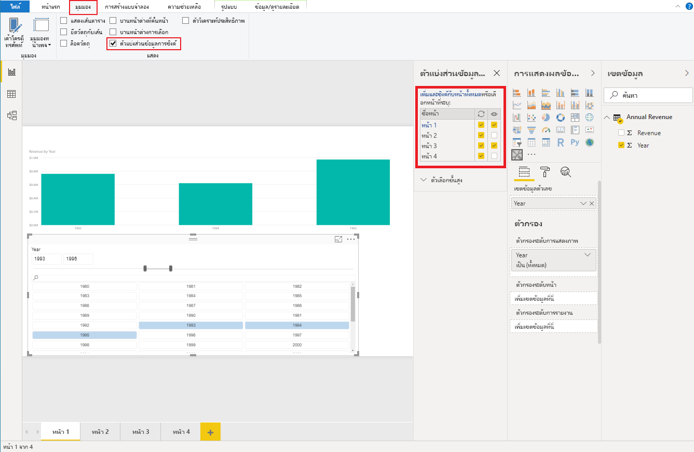

# <a name="sync-slicers-in-power-bi-visuals"></a><span data-ttu-id="8396f-104">ซิงค์ตัวแบ่งส่วนข้อมูลในวิชวล Power BI</span><span class="sxs-lookup"><span data-stu-id="8396f-104">Sync slicers in Power BI visuals</span></span>

<span data-ttu-id="8396f-105">หากคุณต้องการให้รองรับคุณลักษณะ [ซิงค์ตัวแบ่งส่วนข้อมูล](../../visuals/power-bi-visualization-slicers.md) วิชวลตัวแบ่งส่วนข้อมูลแบบกำหนดเองของคุณต้องใช้ API เวอร์ชัน 1.13.0 หรือใหม่กว่า</span><span class="sxs-lookup"><span data-stu-id="8396f-105">To support the [Sync Slicers](../../visuals/power-bi-visualization-slicers.md) feature, your custom slicer visual must use API version 1.13.0 or later.</span></span>

<span data-ttu-id="8396f-106">นอกจากนี้คุณต้องเปิดใช้งานตัวเลือกในไฟล์ *capabilities.json* ดังที่แสดงในโค้ดต่อไปนี้:</span><span class="sxs-lookup"><span data-stu-id="8396f-106">Additionally, you need to enable the option in the *capabilities.json* file, as shown in the following code:</span></span>

```json
{
    ...
    "supportsHighlight": true,
    "suppressDefaultTitle": true,
    "supportsSynchronizingFilterState": true,
    "sorting": {
        "default": {}
    }
}
```

<span data-ttu-id="8396f-107">หลังจากคุณอัปเดตไฟล์ *capabilities.json* แล้วคุณสามารถดูบานหน้าต่างตัวเลือก **ซิงค์ตัวแบ่งส่วนข้อมูล** เมื่อคุณเลือกวิชวลตัวแบ่งส่วนข้อมูลแบบกำหนดเอง</span><span class="sxs-lookup"><span data-stu-id="8396f-107">After you've updated the *capabilities.json* file, you can view the **Sync slicers** options pane when you select your custom slicer visual.</span></span>

> [!NOTE]
> <span data-ttu-id="8396f-108">คุณลักษณะซิงค์ตัวแบ่งส่วนข้อมูลไม่สนับสนุนเขตข้อมูลมากกว่าหนึ่งรายการ</span><span class="sxs-lookup"><span data-stu-id="8396f-108">The Sync Slicers feature doesn't support more than one field.</span></span> <span data-ttu-id="8396f-109">ถ้าตัวแบ่งส่วนข้อมูลของคุณมีเขตข้อมูลมากกว่าหนึ่งรายการ (**หมวดหมู่** หรือ **หน่วยวัด**) คุณลักษณะนี้จะถูกปิดใช้งาน</span><span class="sxs-lookup"><span data-stu-id="8396f-109">If your slicer has more than one field (**Category** or **Measure**), the feature is disabled.</span></span>



<span data-ttu-id="8396f-111">ในบานหน้าต่าง **ซิงค์ตัวแบ่งส่วนข้อมูล** คุณจะเห็นว่าการแสดงผลของตัวแบ่งส่วนข้อมูลของคุณและการกรองสามารถนำไปใช้กับหน้ารายงานหลายหน้าได้</span><span class="sxs-lookup"><span data-stu-id="8396f-111">In the **Sync slicers** pane, you can see that your slicer visibility and its filtration can be applied to several report pages.</span></span>