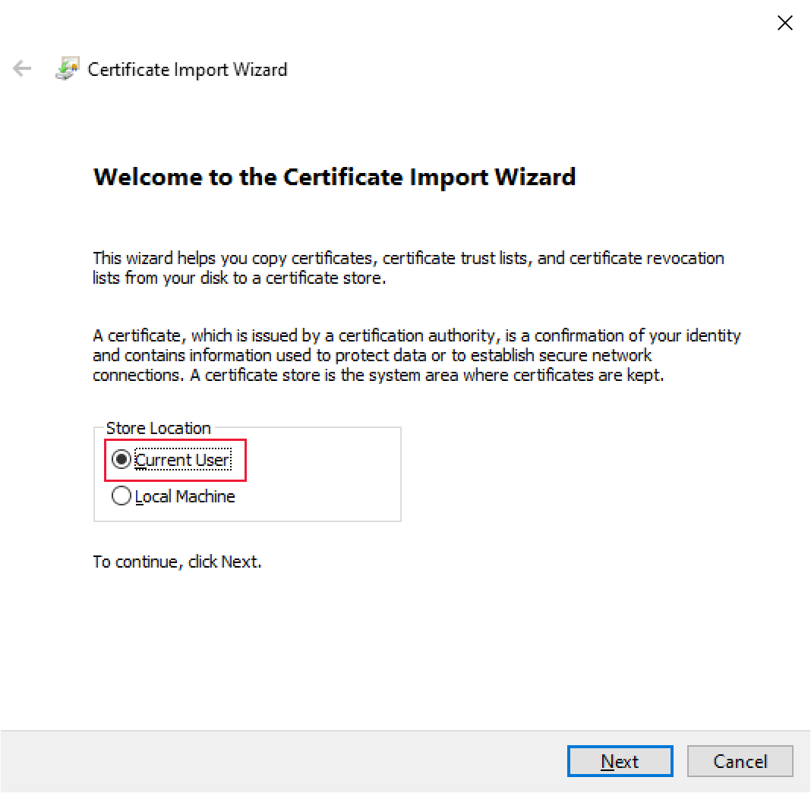

# <a name="set-up-your-environment-for-developing-a-power-bi-visual"></a>การตั้งค่าสภาพแวดล้อมของคุณสําหรับการพัฒนาวิชวล Power BI

ในบทความนี้คุณจะได้เรียนรู้วิธีการตั้งค่าสภาพแวดล้อมของคุณสำหรับการพัฒนาวิชวล Power BI

ก่อนที่คุณจะเริ่มต้นการพัฒนาคุณจะต้องติดตั้ง **node.js** และแพคเกจ **pbiviz** นอกจากนี้คุณยังจำเป็นต้องสร้างและติดตั้งใบรับรอง เมื่อมีการตั้งค่าสภาพแวดล้อมภายในเครื่องของคุณ คุณจะต้องกำหนดค่าบริการของ Power BI สำหรับการพัฒนาวิชวล Power BI

ในบทความนี้ คุณจะเรียนรู้วิธี:
> [!div class="checklist"]
> * ติดตั้ง *nodes.js*
> * ติดตั้ง *pbiviz*
> * สร้างและติดตั้งใบรับรอง
> * ตั้งค่าบริการของ Power BI สำหรับการพัฒนาวิชวล
> * ติดตั้งไลบรารีเพิ่มเติม (จำเป็นสำหรับการพัฒนาวิชวล)

## <a name="install-nodejs"></a>ติดตั้ง node.js

*Node.js* คือการรันไทม์ JavaScript ที่สร้างขึ้นบนเครื่องมือการใช้งาน JavaScript ของ Chrome V8 ซึ่งช่วยให้นักพัฒนาสามารถเรียกใช้แอปที่สร้างขึ้นบน JavaScript ได้

1. เมื่อต้องการติดตั้ง *node.js* ในเว็บเบราว์เซอร์ ให้ไปที่ [node.js](https://nodejs.org)

2. ดาวน์โหลดตัวติดตั้ง MSI ตัวล่าสุด

3. เรียกใช้ตัวติดตั้ง และจากนั้นทำตามขั้นตอนการติดตั้ง ยอมรับเงื่อนไขตามข้อตกลงอนุญาตใช้สิทธิ์และข้อกำหนดเริ่มต้นทั้งหมด

4. รีสตาร์ทเครื่องคอมพิวเตอร์ของคุณ

## <a name="install-pbiviz"></a>ติดตั้ง pbiviz

เครื่องมือ *pbiviz* ซึ่งได้รับการเขียนโดยใช้ JavaScript รวมโค้ดแหล่งที่มาของภาพของแพคเกจ *pbiviz*

แพคเกจ *pbiviz* เป็นโครงการวิชวล Power BI ที่ถูกซิป มีสคริปต์และแอสเซทที่จำเป็นทั้งหมด

1. เปิด Windows PowerShell และใส่คำสั่งต่อไปนี้

    ```powershell
    npm i -g powerbi-visuals-tools
    ```

## <a name="create-and-install-a-certificate"></a>สร้างและติดตั้งใบรับรอง

สำหรับไคลเอ็นต์ (คอมพิวเตอร์ของคุณ) และเซิร์ฟเวอร์ (บริการของ Power BI) เพื่อโต้ตอบได้อย่างปลอดภัยจะต้องใช้ [ใบรับรอง Secure Sockets Layer (SSL)](create-ssl-certificate.md) หากไม่มีใบรับรองเพื่อให้แน่ใจว่ามีการโต้ตอบที่ปลอดภัยจะถูกบล็อกโดยเบราว์เซอร์

# <a name="windows"></a>[Windows](#tab/windows)

กระบวนการนี้อธิบายการเรียกใช้คำสั่ง PowerShell ที่เปิดใช้งาน **ตัวช่วยสร้างการนำเข้าใบรับรอง** ทำตามขั้นตอนด้านล่างเพื่อกำหนดค่าใบรับรองในตัวช่วยสร้าง

>[!IMPORTANT]
>อย่าปิดหน้าต่าง PowerShell ในระหว่างขั้นตอนนี้

1. เปิด Windows PowerShell และใส่คำสั่งต่อไปนี้

    ```powershell
    pbiviz --install-cert
    ```

    คำสั่งนี้มีสองสิ่งดังนี้:
    * การส่งกลับ *วลีรหัสผ่าน* ในกรณีนี้ *วลีรหัสผ่าน* คือ  9765328806094.
    * นอกจากนี้ยังเริ่มต้นตัวช่วยสร้างการนำเข้าใบรับรอง
    
    >[!div class="mx-imgBorder"]
    >

2. ในตัวช่วยสร้างการนำเข้าใบรับรอง ให้ตรวจสอบยืนยันว่าตำแหน่งที่เก็บตั้งค่าอยู่ที่ *ผู้ใช้ปัจจุบัน* และเลือก **ถัดไป**

    >[!div class="mx-imgBorder"]
    >

3. ในหน้าต่าง **ไฟล์เพื่อนำเข้า** ให้เลือก **ถัดไป**

4. ในหน้าต่าง **การป้องกันคีย์ส่วนตัว** ในกล่องข้อความ *รหัสผ่าน* วางวลีรหัสผ่านที่คุณได้รับเมื่อดำเนินการคำสั่ง PowerShell (ขั้นตอนที่ 1) และเลือก **ถัดไป** ในตัวอย่างนี้วลีรหัสผ่านคือ 9765328806094.

    >[!div class="mx-imgBorder"]
    >

5. ที่หน้าต่าง **ที่เก็บใบรับรอง** ให้เลือกตัวเลือก **วางใบรับรองทั้งหมดในที่เก็บต่อไปนี้** และเลือก **เรียกดู**

    >[!div class="mx-imgBorder"]
    >

6. ในหน้าต่าง **เลือกที่เก็บใบรับรอง** ให้เลือก **ผู้ออกใบรับรองหลักที่เชื่อถือได้** จากนั้นเลือก **ตกลง**

    >[!div class="mx-imgBorder"]
    >

7. เลือก *ถัดไป* บนหน้าต่าง **ที่เก็บใบรับรอง**

    >[!div class="mx-imgBorder"]
    >

8. ในหน้าต่าง **การดำเนินการตัวช่วยสร้างการนำเข้าใบรับรอง** ให้ตรวจสอบการตั้งค่าของคุณและเลือก **เสร็จสิ้น**

    >[!NOTE]
    >ถ้าคุณได้รับคำเตือนด้านความปลอดภัย ให้เลือก **ใช่**


# <a name="osx"></a>[OSX](#tab/sdk2osx)

1. ถ้าล็อกมุมบนซ้ายถูกล็อค เลือกเพื่อปลดล็อก ค้นหา *localhost* และดับเบิลคลิกใบรับรอง

    

2. เลือก **เชื่อถือเสมอ** และปิดหน้าต่าง

    

3. ใส่ชื่อผู้ใช้และรหัสผ่านของคุณ แล้วเลือก **การตั้งค่าการอัปเดต**

    

4. ปิดทุกเบราว์เซอร์ที่คุณเปิดอยู่

> [!NOTE]
> ถ้าเบราว์เซอร์ยังไม่รู้จักใบรับรอง รีสตาร์ตคอมพิวเตอร์ของคุณ

---

## <a name="optional-verify-that-your-environment-is-set-up"></a>(ไม่บังคับ) ตรวจสอบว่ามีการตั้งค่าสภาพแวดล้อมของคุณแล้ว

ยืนยันว่ามีการติดตั้งแพคเกจเครื่องมือวิชวล Power BI ใน PowerShell เรียกใช้คำสั่ง `pbiviz` และตรวจทานการแสดงผลรวมถึงรายการของคำสั่งที่ได้รับการรองรับ

>[!div class="mx-imgBorder"]
>

## <a name="set-up-power-bi-service-for-developing-a-visual"></a>ตั้งค่าบริการของ Power BI สำหรับการพัฒนาวิชวล

ในการพัฒนาวิชวล Power BI คุณจะต้องเปิดใช้งานการดีบักวิชวลแบบกำหนดเองในบริการของ Power BI ทำตามคำแนะนำในส่วนนี้เพื่อเปิดใช้งานตัวเลือกนี้

1. ลงชื่อเข้าใช้ [PowerBI.com](https://powerbi.microsoft.com/)

2. นำทางไปยัง **การตั้งค่า** > **การตั้งค่า** > **การตั้งค่า**

    >[!div class="mx-imgBorder"]
    >

3. จากแท็บ **ทั่วไป** เลือก **นักพัฒนา** ใน **การตั้งค่านักพัฒนา** เลือก **เปิดใช้งานการดีบักวิชวลแบบกำหนดเองโดยใช้กล่องกาเครื่องหมาย วิชวลของนักพัฒนา** และเลือก **ใช้**

    >[!div class="mx-imgBorder"]
    >

## <a name="install-development-libraries"></a>ติดตั้งไลบรารีการพัฒนา

ในการพัฒนาวิชวล Power BI ของคุณเองคุณจะต้องติดตั้งไลบรารีเพิ่มเติม ในส่วนนี้จะอธิบายวิธีการติดตั้งไลบรารีเหล่านี้และตรวจสอบว่าการติดตั้งเสร็จสมบูรณ์

หากต้องการติดตั้งไลบรารีที่แสดงในบทความนี้ให้เปิด PowerShell และใส่คำสั่งการติดตั้งสำหรับแต่ละคอมโพเนนต์

>[!NOTE]
>เมื่อไลบรารีเหล่านี้ได้รับการติดตั้งบนคอมพิวเตอร์ของคุณแล้วคุณจะสามารถใช้งานได้กับโครงการวิชวล Power BI ใดๆ นี่คือขั้นตอนการติดตั้งครั้งเดียวต่อเครื่อง


### <a name="d3-javascript-library"></a>ไลบรารี JavaScript D3

[D3](https://d3js.org/) คือไลบรารี JavaScript สำหรับการผลิตการแสดงภาพข้อมูลเชิงโต้ตอบแบบไดนามิก ในเว็บเบราว์เซอร์ ซึ่งขึ้นอยู่กับการดำเนินการที่ใช้กันอย่างกว้างขวาง Scalable Vector Graphics (SVG), HTML5 และมาตรฐาน CSS

```powershell
npm i d3@^5.0.0 --save
```

### <a name="typescript-definitions"></a>ข้อกำหนด TypeScript

ติดตั้งข้อกำหนด TypeScript เพื่อให้คุณสามารถพัฒนาวิชวล Power BI ของคุณใน [TypeScript](https://www.typescriptlang.org/)เซตใหญ่ของ JavaScript ได้

```powershell
npm i @types/d3@^5.0.0 --save
```

### <a name="core-js"></a>core-js

[core-js](https://www.npmjs.com/package/core-js) เป็นไลบรารีมาตรฐานแบบโมดูลาร์สำหรับ JavaScript ที่รวม polyfills สำหรับ ECMAScript

```powershell
npm i core-js@3.2.1 --save
```

### <a name="powerbi-visual-api"></a>powerbi-visual-api

ติดตั้งข้อกำหนด API ของวิชวล Power BI

```powershell
npm i powerbi-visuals-api --save-dev
```

### <a name="optional-verify-that-the-d3-library-is-installed"></a>(ไม่บังคับ) ตรวจสอบว่ามีการติดตั้งไลบรารี D3

[รหัส Visual Studio](https://code.visualstudio.com/) (รหัส VS) คือ Integrated Development Environment (IDE) ในอุดมคติเพื่อพัฒนาแอปพลิเคชัน TypeScript ในส่วนนี้เราจะใช้รหัส VS เพื่อตรวจสอบว่าไลบรารี D3 ที่คุณจำเป็นต้องพัฒนาภาพ Power BI ของคุณได้รับการติดตั้งอย่างถูกต้องหรือไม่

>[!NOTE]
>กระบวนการตรวจสอบที่อธิบายไว้ในส่วนนี้ถือว่าคุณมีโครงการ Power BI วิชวลปรากฏอยู่ ถ้าคุณยังไม่มีโครงการวิชวล Power BI คุณสามารถสร้างได้โดยทำตามคำแนะนำ [การสร้างโครงการของการ์ดวงกลม](develop-circle-card.md#create-a-development-project)

1. เปิดรหัส VS

    >[!TIP]
    >คุณสามารถเปิดรหัส VS จาก PowerShell โดยการดำเนินการคำสั่งต่อไปนี้:
    >
    >```powershell
    >code .
    >```
2. ในรหัส  VS เปิดเมนู **ไฟล์** และเลือก **เปิดโฟลเดอร์**

    >[!div class="mx-imgBorder"]
    >

3. ในหน้าต่าง **เปิดโฟลเดอร์** เลือกโฟลเดอร์ที่มีโครงการ Power BI วิชวลของคุณและเลือก **เลือกโฟลเดอร์**

    >[!div class="mx-imgBorder"]
    >

4. ในบานหน้าต่าง **Explorer** ให้ขยายโฟลเดอร์ **node_modules** เพื่อตรวจสอบยืนยันว่ามีการติดตั้งไลบรารี **d3**

    >[!div class="mx-imgBorder"]
    >

5. ในบานหน้าต่าง **Explorer** ขยาย **node_modules > @types > d3** และตรวจสอบว่ามีการติดตั้งไฟล์ **index.t.ds**

    >[!div class="mx-imgBorder"]
    >

## <a name="next-steps"></a>ขั้นตอนถัดไป

> [!div class="nextstepaction"]
> [สร้างวิชวลการ์ดวงกลม Power BI](develop-circle-card.md)

> [!div class="nextstepaction"]
> [สร้างวิชวลแผนภูมิแท่ง Power BI](create-bar-chart.md)
