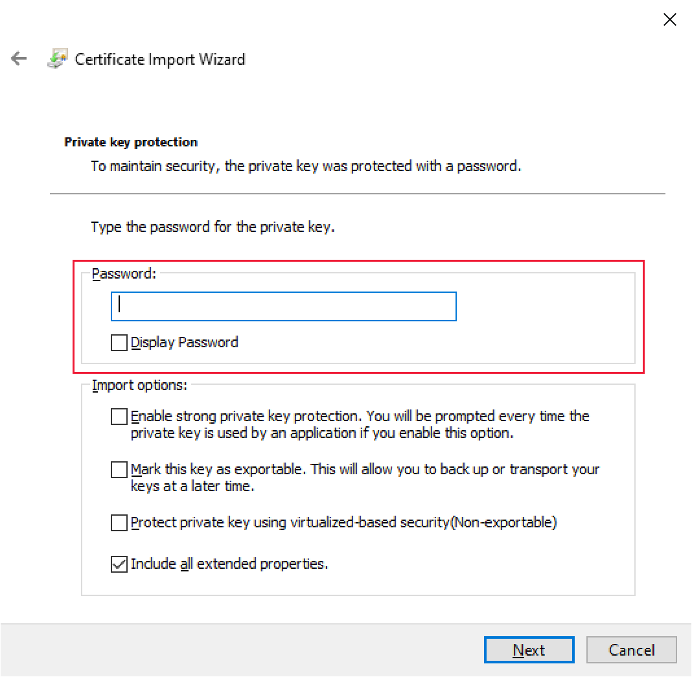
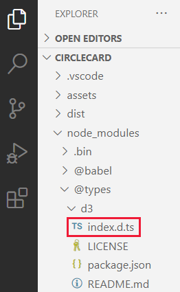

# <a name="set-up-your-environment-for-developing-a-power-bi-visual"></a><span data-ttu-id="404f8-104">การตั้งค่าสภาพแวดล้อมของคุณสําหรับการพัฒนาวิชวล Power BI</span><span class="sxs-lookup"><span data-stu-id="404f8-104">Set up your environment for developing a Power BI visual</span></span>

<span data-ttu-id="404f8-105">ในบทความนี้คุณจะได้เรียนรู้วิธีการตั้งค่าสภาพแวดล้อมของคุณสำหรับการพัฒนาวิชวล Power BI</span><span class="sxs-lookup"><span data-stu-id="404f8-105">In this article, you'll learn how to set up your environment for developing a Power BI visual.</span></span>

<span data-ttu-id="404f8-106">ก่อนที่คุณจะเริ่มต้นการพัฒนาคุณจะต้องติดตั้ง **node.js** และแพคเกจ **pbiviz**</span><span class="sxs-lookup"><span data-stu-id="404f8-106">Before you start development, you'll need to install **node.js** and the **pbiviz** package.</span></span> <span data-ttu-id="404f8-107">นอกจากนี้คุณยังจำเป็นต้องสร้างและติดตั้งใบรับรอง</span><span class="sxs-lookup"><span data-stu-id="404f8-107">You'll also need to create and install a certificate.</span></span> <span data-ttu-id="404f8-108">เมื่อมีการตั้งค่าสภาพแวดล้อมภายในเครื่องของคุณ คุณจะต้องกำหนดค่าบริการของ Power BI สำหรับการพัฒนาวิชวล Power BI</span><span class="sxs-lookup"><span data-stu-id="404f8-108">When your local environment is set up, you'll need to configure Power BI service for developing a Power BI visual.</span></span>

<span data-ttu-id="404f8-109">ในบทความนี้ คุณจะเรียนรู้วิธี:</span><span class="sxs-lookup"><span data-stu-id="404f8-109">In this article, you'll learn how to:</span></span>
> [!div class="checklist"]
> * <span data-ttu-id="404f8-110">ติดตั้ง *nodes.js*</span><span class="sxs-lookup"><span data-stu-id="404f8-110">Install *nodes.js*.</span></span>
> * <span data-ttu-id="404f8-111">ติดตั้ง *pbiviz*</span><span class="sxs-lookup"><span data-stu-id="404f8-111">Install *pbiviz*.</span></span>
> * <span data-ttu-id="404f8-112">สร้างและติดตั้งใบรับรอง</span><span class="sxs-lookup"><span data-stu-id="404f8-112">Create and install a certificate.</span></span>
> * <span data-ttu-id="404f8-113">ตั้งค่าบริการของ Power BI สำหรับการพัฒนาวิชวล</span><span class="sxs-lookup"><span data-stu-id="404f8-113">Set up Power BI service for developing a visual.</span></span>
> * <span data-ttu-id="404f8-114">ติดตั้งไลบรารีเพิ่มเติม (จำเป็นสำหรับการพัฒนาวิชวล)</span><span class="sxs-lookup"><span data-stu-id="404f8-114">Install additional libraries (required for developing a visual).</span></span>

## <a name="install-nodejs"></a><span data-ttu-id="404f8-115">ติดตั้ง node.js</span><span class="sxs-lookup"><span data-stu-id="404f8-115">Install node.js</span></span>

<span data-ttu-id="404f8-116">*Node.js* คือการรันไทม์ JavaScript ที่สร้างขึ้นบนเครื่องมือการใช้งาน JavaScript ของ Chrome V8</span><span class="sxs-lookup"><span data-stu-id="404f8-116">*Node.js* is a JavaScript runtime built on Chrome's V8 JavaScript engine.</span></span> <span data-ttu-id="404f8-117">ซึ่งช่วยให้นักพัฒนาสามารถเรียกใช้แอปที่สร้างขึ้นบน JavaScript ได้</span><span class="sxs-lookup"><span data-stu-id="404f8-117">It allows developers to run any apps created on JavaScript.</span></span>

1. <span data-ttu-id="404f8-118">เมื่อต้องการติดตั้ง *node.js* ในเว็บเบราว์เซอร์ ให้ไปที่ [node.js](https://nodejs.org)</span><span class="sxs-lookup"><span data-stu-id="404f8-118">To install *node.js*, in a web browser, navigate to [node.js](https://nodejs.org).</span></span>

2. <span data-ttu-id="404f8-119">ดาวน์โหลดตัวติดตั้ง MSI ตัวล่าสุด</span><span class="sxs-lookup"><span data-stu-id="404f8-119">Download the latest MSI installer.</span></span>

3. <span data-ttu-id="404f8-120">เรียกใช้ตัวติดตั้ง และจากนั้นทำตามขั้นตอนการติดตั้ง</span><span class="sxs-lookup"><span data-stu-id="404f8-120">Run the installer, and then follow the installation steps.</span></span> <span data-ttu-id="404f8-121">ยอมรับเงื่อนไขตามข้อตกลงอนุญาตใช้สิทธิ์และข้อกำหนดเริ่มต้นทั้งหมด</span><span class="sxs-lookup"><span data-stu-id="404f8-121">Accept the terms of the license agreement and all defaults.</span></span>

4. <span data-ttu-id="404f8-122">รีสตาร์ทเครื่องคอมพิวเตอร์ของคุณ</span><span class="sxs-lookup"><span data-stu-id="404f8-122">Restart your computer.</span></span>

## <a name="install-pbiviz"></a><span data-ttu-id="404f8-123">ติดตั้ง pbiviz</span><span class="sxs-lookup"><span data-stu-id="404f8-123">Install pbiviz</span></span>

<span data-ttu-id="404f8-124">เครื่องมือ *pbiviz* ซึ่งได้รับการเขียนโดยใช้ JavaScript รวมโค้ดแหล่งที่มาของภาพของแพคเกจ *pbiviz*</span><span class="sxs-lookup"><span data-stu-id="404f8-124">The *pbiviz* tool, which is written using JavaScript, compiles the visual source code of the *pbiviz* package.</span></span>

<span data-ttu-id="404f8-125">แพคเกจ *pbiviz* เป็นโครงการวิชวล Power BI ที่ถูกซิป มีสคริปต์และแอสเซทที่จำเป็นทั้งหมด</span><span class="sxs-lookup"><span data-stu-id="404f8-125">The *pbiviz* package is a zipped Power BI visual project, with all the needed scripts and assets.</span></span>

1. <span data-ttu-id="404f8-126">เปิด Windows PowerShell และใส่คำสั่งต่อไปนี้</span><span class="sxs-lookup"><span data-stu-id="404f8-126">Open Windows PowerShell and enter the following command.</span></span>

    ```powershell
    npm i -g powerbi-visuals-tools
    ```

## <a name="create-and-install-a-certificate"></a><span data-ttu-id="404f8-127">สร้างและติดตั้งใบรับรอง</span><span class="sxs-lookup"><span data-stu-id="404f8-127">Create and install a certificate</span></span>

<span data-ttu-id="404f8-128">สำหรับไคลเอ็นต์ (คอมพิวเตอร์ของคุณ) และเซิร์ฟเวอร์ (บริการของ Power BI) เพื่อโต้ตอบได้อย่างปลอดภัยจะต้องใช้ [ใบรับรอง Secure Sockets Layer (SSL)](create-ssl-certificate.md)</span><span class="sxs-lookup"><span data-stu-id="404f8-128">For a client (your computer) and a server (Power BI service) to interact securely, a [Secure Sockets Layer (SSL) Certificate](create-ssl-certificate.md) is required.</span></span> <span data-ttu-id="404f8-129">หากไม่มีใบรับรองเพื่อให้แน่ใจว่ามีการโต้ตอบที่ปลอดภัยจะถูกบล็อกโดยเบราว์เซอร์</span><span class="sxs-lookup"><span data-stu-id="404f8-129">Without a certificate to ensure secure interactions, they will be blocked by the browser.</span></span>

# <a name="windows"></a>[<span data-ttu-id="404f8-130">Windows</span><span class="sxs-lookup"><span data-stu-id="404f8-130">Windows</span></span>](#tab/windows)

<span data-ttu-id="404f8-131">กระบวนการนี้อธิบายการเรียกใช้คำสั่ง PowerShell ที่เปิดใช้งาน **ตัวช่วยสร้างการนำเข้าใบรับรอง**</span><span class="sxs-lookup"><span data-stu-id="404f8-131">This process describes running a PowerShell command that launches the **Certificate Import Wizard**.</span></span> <span data-ttu-id="404f8-132">ทำตามขั้นตอนด้านล่างเพื่อกำหนดค่าใบรับรองในตัวช่วยสร้าง</span><span class="sxs-lookup"><span data-stu-id="404f8-132">Follow the steps below to configure the certificate in the wizard.</span></span>

>[!IMPORTANT]
><span data-ttu-id="404f8-133">อย่าปิดหน้าต่าง PowerShell ในระหว่างขั้นตอนนี้</span><span class="sxs-lookup"><span data-stu-id="404f8-133">Do not close the PowerShell window during this procedure.</span></span>

1. <span data-ttu-id="404f8-134">เปิด Windows PowerShell และใส่คำสั่งต่อไปนี้</span><span class="sxs-lookup"><span data-stu-id="404f8-134">Open Windows PowerShell and enter the following command.</span></span>

    ```powershell
    pbiviz --install-cert
    ```

    <span data-ttu-id="404f8-135">คำสั่งนี้มีสองสิ่งดังนี้:</span><span class="sxs-lookup"><span data-stu-id="404f8-135">This command does two things:</span></span>
    * <span data-ttu-id="404f8-136">การส่งกลับ *วลีรหัสผ่าน*</span><span class="sxs-lookup"><span data-stu-id="404f8-136">It returns a *passphrase*.</span></span> <span data-ttu-id="404f8-137">ในกรณีนี้ *วลีรหัสผ่าน* คือ  9765328806094.</span><span class="sxs-lookup"><span data-stu-id="404f8-137">In this case, the *passphrase* is 9765328806094.</span></span>
    * <span data-ttu-id="404f8-138">นอกจากนี้ยังเริ่มต้นตัวช่วยสร้างการนำเข้าใบรับรอง</span><span class="sxs-lookup"><span data-stu-id="404f8-138">It also starts the Certificate Import Wizard.</span></span>
    
    >[!div class="mx-imgBorder"]
    ><span data-ttu-id="404f8-139"></span><span class="sxs-lookup"><span data-stu-id="404f8-139"></span></span>

2. <span data-ttu-id="404f8-140">ในตัวช่วยสร้างการนำเข้าใบรับรอง ให้ตรวจสอบยืนยันว่าตำแหน่งที่เก็บตั้งค่าอยู่ที่ *ผู้ใช้ปัจจุบัน* และเลือก **ถัดไป**</span><span class="sxs-lookup"><span data-stu-id="404f8-140">In the Certificate Import Wizard, verify that the store location is set to *Current User*, and select **Next**.</span></span>

    >[!div class="mx-imgBorder"]
    ><span data-ttu-id="404f8-141"></span><span class="sxs-lookup"><span data-stu-id="404f8-141"></span></span>

3. <span data-ttu-id="404f8-142">ในหน้าต่าง **ไฟล์เพื่อนำเข้า** ให้เลือก **ถัดไป**</span><span class="sxs-lookup"><span data-stu-id="404f8-142">In the **File to Import** window, select **Next**.</span></span>

4. <span data-ttu-id="404f8-143">ในหน้าต่าง **การป้องกันคีย์ส่วนตัว** ในกล่องข้อความ *รหัสผ่าน* วางวลีรหัสผ่านที่คุณได้รับเมื่อดำเนินการคำสั่ง PowerShell (ขั้นตอนที่ 1) และเลือก **ถัดไป**</span><span class="sxs-lookup"><span data-stu-id="404f8-143">In the **Private Key Protection** window, in the *Password* text box, paste the passphrase you received when executing the PowerShell command (step 1) and select **Next**.</span></span> <span data-ttu-id="404f8-144">ในตัวอย่างนี้วลีรหัสผ่านคือ 9765328806094.</span><span class="sxs-lookup"><span data-stu-id="404f8-144">In this example, the passphrase is 9765328806094.</span></span>

    >[!div class="mx-imgBorder"]
    ><span data-ttu-id="404f8-145"></span><span class="sxs-lookup"><span data-stu-id="404f8-145"></span></span>

5. <span data-ttu-id="404f8-146">ที่หน้าต่าง **ที่เก็บใบรับรอง** ให้เลือกตัวเลือก **วางใบรับรองทั้งหมดในที่เก็บต่อไปนี้** และเลือก **เรียกดู**</span><span class="sxs-lookup"><span data-stu-id="404f8-146">In the **Certificate Store** window, select the **Place all certificates in the following store** option, and select **Browse**.</span></span>

    >[!div class="mx-imgBorder"]
    ><span data-ttu-id="404f8-147"></span><span class="sxs-lookup"><span data-stu-id="404f8-147"></span></span>

6. <span data-ttu-id="404f8-148">ในหน้าต่าง **เลือกที่เก็บใบรับรอง** ให้เลือก **ผู้ออกใบรับรองหลักที่เชื่อถือได้** จากนั้นเลือก **ตกลง**</span><span class="sxs-lookup"><span data-stu-id="404f8-148">In the **Select Certificate Store** window, select **Trusted Root Certification Authorities** and then select **OK**.</span></span>

    >[!div class="mx-imgBorder"]
    ><span data-ttu-id="404f8-149"></span><span class="sxs-lookup"><span data-stu-id="404f8-149"></span></span>

7. <span data-ttu-id="404f8-150">เลือก *ถัดไป* บนหน้าต่าง **ที่เก็บใบรับรอง**</span><span class="sxs-lookup"><span data-stu-id="404f8-150">Select *Next* in the **Certificate Store** window.</span></span>

    >[!div class="mx-imgBorder"]
    ><span data-ttu-id="404f8-151"></span><span class="sxs-lookup"><span data-stu-id="404f8-151"></span></span>

8. <span data-ttu-id="404f8-152">ในหน้าต่าง **การดำเนินการตัวช่วยสร้างการนำเข้าใบรับรอง** ให้ตรวจสอบการตั้งค่าของคุณและเลือก **เสร็จสิ้น**</span><span class="sxs-lookup"><span data-stu-id="404f8-152">In the **Completing the Certificate Import Wizard** window, verify your settings and select **Finish**.</span></span>

    >[!NOTE]
    ><span data-ttu-id="404f8-153">ถ้าคุณได้รับคำเตือนด้านความปลอดภัย ให้เลือก **ใช่**</span><span class="sxs-lookup"><span data-stu-id="404f8-153">If you receive a security warning, select **Yes**.</span></span>


# <a name="osx"></a>[<span data-ttu-id="404f8-154">OSX</span><span class="sxs-lookup"><span data-stu-id="404f8-154">OSX</span></span>](#tab/sdk2osx)

1. <span data-ttu-id="404f8-155">ถ้าล็อกมุมบนซ้ายถูกล็อค เลือกเพื่อปลดล็อก</span><span class="sxs-lookup"><span data-stu-id="404f8-155">If the lock in the upper left is locked, select it to unlock it.</span></span> <span data-ttu-id="404f8-156">ค้นหา *localhost* และดับเบิลคลิกใบรับรอง</span><span class="sxs-lookup"><span data-stu-id="404f8-156">Search for *localhost* and double-click the certificate.</span></span>

    

2. <span data-ttu-id="404f8-158">เลือก **เชื่อถือเสมอ** และปิดหน้าต่าง</span><span class="sxs-lookup"><span data-stu-id="404f8-158">Select **Always Trust** and close the window.</span></span>

    

3. <span data-ttu-id="404f8-160">ใส่ชื่อผู้ใช้และรหัสผ่านของคุณ แล้วเลือก **การตั้งค่าการอัปเดต**</span><span class="sxs-lookup"><span data-stu-id="404f8-160">Enter your username and password, and select **Update Settings**.</span></span>

    

4. <span data-ttu-id="404f8-162">ปิดทุกเบราว์เซอร์ที่คุณเปิดอยู่</span><span class="sxs-lookup"><span data-stu-id="404f8-162">Close any browsers that you have open.</span></span>

> [!NOTE]
> <span data-ttu-id="404f8-163">ถ้าเบราว์เซอร์ยังไม่รู้จักใบรับรอง รีสตาร์ตคอมพิวเตอร์ของคุณ</span><span class="sxs-lookup"><span data-stu-id="404f8-163">If the certificate is not recognized, restart your computer.</span></span>

---

## <a name="optional-verify-that-your-environment-is-set-up"></a><span data-ttu-id="404f8-164">(ไม่บังคับ) ตรวจสอบว่ามีการตั้งค่าสภาพแวดล้อมของคุณแล้ว</span><span class="sxs-lookup"><span data-stu-id="404f8-164">(Optional) Verify that your environment is set up</span></span>

<span data-ttu-id="404f8-165">ยืนยันว่ามีการติดตั้งแพคเกจเครื่องมือวิชวล Power BI</span><span class="sxs-lookup"><span data-stu-id="404f8-165">Confirm that the Power BI visuals tools package is installed.</span></span> <span data-ttu-id="404f8-166">ใน PowerShell เรียกใช้คำสั่ง `pbiviz` และตรวจทานการแสดงผลรวมถึงรายการของคำสั่งที่ได้รับการรองรับ</span><span class="sxs-lookup"><span data-stu-id="404f8-166">In PowerShell, run the command `pbiviz` and review the output, including the list of supported commands.</span></span>

>[!div class="mx-imgBorder"]
><span data-ttu-id="404f8-167"></span><span class="sxs-lookup"><span data-stu-id="404f8-167"></span></span>

## <a name="set-up-power-bi-service-for-developing-a-visual"></a><span data-ttu-id="404f8-168">ตั้งค่าบริการของ Power BI สำหรับการพัฒนาวิชวล</span><span class="sxs-lookup"><span data-stu-id="404f8-168">Set up Power BI service for developing a visual</span></span>

<span data-ttu-id="404f8-169">ในการพัฒนาวิชวล Power BI คุณจะต้องเปิดใช้งานการดีบักวิชวลแบบกำหนดเองในบริการของ Power BI</span><span class="sxs-lookup"><span data-stu-id="404f8-169">To develop a Power BI visual, you'll need to enable custom visual debugging in Power BI service.</span></span> <span data-ttu-id="404f8-170">ทำตามคำแนะนำในส่วนนี้เพื่อเปิดใช้งานตัวเลือกนี้</span><span class="sxs-lookup"><span data-stu-id="404f8-170">Follow the instructions in this section to enable this option.</span></span>

1. <span data-ttu-id="404f8-171">ลงชื่อเข้าใช้ [PowerBI.com](https://powerbi.microsoft.com/)</span><span class="sxs-lookup"><span data-stu-id="404f8-171">Sign in to [PowerBI.com](https://powerbi.microsoft.com/).</span></span>

2. <span data-ttu-id="404f8-172">นำทางไปยัง **การตั้งค่า** > **การตั้งค่า** > **การตั้งค่า**</span><span class="sxs-lookup"><span data-stu-id="404f8-172">Navigate to **Settings** > **Settings** > **Settings**.</span></span>

    >[!div class="mx-imgBorder"]
    ><span data-ttu-id="404f8-173"></span><span class="sxs-lookup"><span data-stu-id="404f8-173"></span></span>

3. <span data-ttu-id="404f8-174">จากแท็บ **ทั่วไป** เลือก **นักพัฒนา**</span><span class="sxs-lookup"><span data-stu-id="404f8-174">From the **General** tab, select **Developer**.</span></span> <span data-ttu-id="404f8-175">ใน **การตั้งค่านักพัฒนา** เลือก **เปิดใช้งานการดีบักวิชวลแบบกำหนดเองโดยใช้กล่องกาเครื่องหมาย วิชวลของนักพัฒนา** และเลือก **ใช้**</span><span class="sxs-lookup"><span data-stu-id="404f8-175">In the **Developer Settings** select the **Enable custom visual debugging using the developer visual** check box, and select **Apply**.</span></span>

    >[!div class="mx-imgBorder"]
    ><span data-ttu-id="404f8-176"></span><span class="sxs-lookup"><span data-stu-id="404f8-176"></span></span>

## <a name="install-development-libraries"></a><span data-ttu-id="404f8-177">ติดตั้งไลบรารีการพัฒนา</span><span class="sxs-lookup"><span data-stu-id="404f8-177">Install development libraries</span></span>

<span data-ttu-id="404f8-178">ในการพัฒนาวิชวล Power BI ของคุณเองคุณจะต้องติดตั้งไลบรารีเพิ่มเติม</span><span class="sxs-lookup"><span data-stu-id="404f8-178">To develop your own Power BI visual, you'll need to install additional libraries.</span></span> <span data-ttu-id="404f8-179">ในส่วนนี้จะอธิบายวิธีการติดตั้งไลบรารีเหล่านี้และตรวจสอบว่าการติดตั้งเสร็จสมบูรณ์</span><span class="sxs-lookup"><span data-stu-id="404f8-179">This section describes how to install these libraries and verify that the installation is successful.</span></span>

<span data-ttu-id="404f8-180">หากต้องการติดตั้งไลบรารีที่แสดงในบทความนี้ให้เปิด PowerShell และใส่คำสั่งการติดตั้งสำหรับแต่ละคอมโพเนนต์</span><span class="sxs-lookup"><span data-stu-id="404f8-180">To install the libraries listed in this article, open PowerShell and enter the installation command for each component.</span></span>

>[!NOTE]
><span data-ttu-id="404f8-181">เมื่อไลบรารีเหล่านี้ได้รับการติดตั้งบนคอมพิวเตอร์ของคุณแล้วคุณจะสามารถใช้งานได้กับโครงการวิชวล Power BI ใดๆ</span><span class="sxs-lookup"><span data-stu-id="404f8-181">Once these libraries are installed on your computer, you'll be able to use them for any Power BI visuals project.</span></span> <span data-ttu-id="404f8-182">นี่คือขั้นตอนการติดตั้งครั้งเดียวต่อเครื่อง</span><span class="sxs-lookup"><span data-stu-id="404f8-182">This is a one time installation procedure, per machine.</span></span>


### <a name="d3-javascript-library"></a><span data-ttu-id="404f8-183">ไลบรารี JavaScript D3</span><span class="sxs-lookup"><span data-stu-id="404f8-183">D3 JavaScript library</span></span>

<span data-ttu-id="404f8-184">[D3](https://d3js.org/) คือไลบรารี JavaScript สำหรับการผลิตการแสดงภาพข้อมูลเชิงโต้ตอบแบบไดนามิก ในเว็บเบราว์เซอร์</span><span class="sxs-lookup"><span data-stu-id="404f8-184">[D3](https://d3js.org/) is a JavaScript library for producing dynamic, interactive data visualizations in web browsers.</span></span> <span data-ttu-id="404f8-185">ซึ่งขึ้นอยู่กับการดำเนินการที่ใช้กันอย่างกว้างขวาง Scalable Vector Graphics (SVG), HTML5 และมาตรฐาน CSS</span><span class="sxs-lookup"><span data-stu-id="404f8-185">It relies on widely implemented Scalable Vector Graphics (SVG), HTML5, and CSS standards.</span></span>

```powershell
npm i d3@^5.0.0 --save
```

### <a name="typescript-definitions"></a><span data-ttu-id="404f8-186">ข้อกำหนด TypeScript</span><span class="sxs-lookup"><span data-stu-id="404f8-186">TypeScript definitions</span></span>

<span data-ttu-id="404f8-187">ติดตั้งข้อกำหนด TypeScript เพื่อให้คุณสามารถพัฒนาวิชวล Power BI ของคุณใน [TypeScript](https://www.typescriptlang.org/)เซตใหญ่ของ JavaScript ได้</span><span class="sxs-lookup"><span data-stu-id="404f8-187">Install TypeScript definitions so that you can develop your Power BI visual in [TypeScript](https://www.typescriptlang.org/), a superset of JavaScript.</span></span>

```powershell
npm i @types/d3@^5.0.0 --save
```

### <a name="core-js"></a><span data-ttu-id="404f8-188">core-js</span><span class="sxs-lookup"><span data-stu-id="404f8-188">core-js</span></span>

<span data-ttu-id="404f8-189">[core-js](https://www.npmjs.com/package/core-js) เป็นไลบรารีมาตรฐานแบบโมดูลาร์สำหรับ JavaScript ที่รวม polyfills สำหรับ ECMAScript</span><span class="sxs-lookup"><span data-stu-id="404f8-189">[core-js](https://www.npmjs.com/package/core-js) is a modular standard library for JavaScript that includes polyfills for ECMAScript.</span></span>

```powershell
npm i core-js@3.2.1 --save
```

### <a name="powerbi-visual-api"></a><span data-ttu-id="404f8-190">powerbi-visual-api</span><span class="sxs-lookup"><span data-stu-id="404f8-190">powerbi-visual-api</span></span>

<span data-ttu-id="404f8-191">ติดตั้งข้อกำหนด API ของวิชวล Power BI</span><span class="sxs-lookup"><span data-stu-id="404f8-191">Install the Power BI Visuals API definitions.</span></span>

```powershell
npm i powerbi-visuals-api --save-dev
```

### <a name="optional-verify-that-the-d3-library-is-installed"></a><span data-ttu-id="404f8-192">(ไม่บังคับ) ตรวจสอบว่ามีการติดตั้งไลบรารี D3</span><span class="sxs-lookup"><span data-stu-id="404f8-192">(Optional) Verify that the D3 library is installed</span></span>

<span data-ttu-id="404f8-193">[รหัส Visual Studio](https://code.visualstudio.com/) (รหัส VS) คือ Integrated Development Environment (IDE) ในอุดมคติเพื่อพัฒนาแอปพลิเคชัน TypeScript</span><span class="sxs-lookup"><span data-stu-id="404f8-193">[Visual Studio Code](https://code.visualstudio.com/) (VS Code) is an ideal Integrated Development Environment (IDE) for developing TypeScript applications.</span></span> <span data-ttu-id="404f8-194">ในส่วนนี้เราจะใช้รหัส VS เพื่อตรวจสอบว่าไลบรารี D3 ที่คุณจำเป็นต้องพัฒนาภาพ Power BI ของคุณได้รับการติดตั้งอย่างถูกต้องหรือไม่</span><span class="sxs-lookup"><span data-stu-id="404f8-194">In this section, we'll use VS Code to verify that the D3 library you need to develop your Power BI visual, is correctly installed.</span></span>

>[!NOTE]
><span data-ttu-id="404f8-195">กระบวนการตรวจสอบที่อธิบายไว้ในส่วนนี้ถือว่าคุณมีโครงการ Power BI วิชวลปรากฏอยู่</span><span class="sxs-lookup"><span data-stu-id="404f8-195">The verification process described in this section assumes you have an existing Power BI visuals project.</span></span> <span data-ttu-id="404f8-196">ถ้าคุณยังไม่มีโครงการวิชวล Power BI คุณสามารถสร้างได้โดยทำตามคำแนะนำ [การสร้างโครงการของการ์ดวงกลม](develop-circle-card.md#create-a-development-project)</span><span class="sxs-lookup"><span data-stu-id="404f8-196">If you don't have a Power BI visuals project, you can create one by following the [circle card project creation](develop-circle-card.md#create-a-development-project) instructions.</span></span>

1. <span data-ttu-id="404f8-197">เปิดรหัส VS</span><span class="sxs-lookup"><span data-stu-id="404f8-197">Open VS Code.</span></span>

    >[!TIP]
    ><span data-ttu-id="404f8-198">คุณสามารถเปิดรหัส VS จาก PowerShell โดยการดำเนินการคำสั่งต่อไปนี้:</span><span class="sxs-lookup"><span data-stu-id="404f8-198">You can open VS Code from PowerShell by executing the following command:</span></span>
    >
    >```powershell
    >code .
    >```
2. <span data-ttu-id="404f8-199">ในรหัส  VS เปิดเมนู **ไฟล์** และเลือก **เปิดโฟลเดอร์**</span><span class="sxs-lookup"><span data-stu-id="404f8-199">In VS Code, open the **File** menu and select **Open Folder**.</span></span>

    >[!div class="mx-imgBorder"]
    ><span data-ttu-id="404f8-200"></span><span class="sxs-lookup"><span data-stu-id="404f8-200"></span></span>

3. <span data-ttu-id="404f8-201">ในหน้าต่าง **เปิดโฟลเดอร์** เลือกโฟลเดอร์ที่มีโครงการ Power BI วิชวลของคุณและเลือก **เลือกโฟลเดอร์**</span><span class="sxs-lookup"><span data-stu-id="404f8-201">In the **Open Folder** window, select the folder that contains your Power BI visual project, and select **Select Folder**.</span></span>

    >[!div class="mx-imgBorder"]
    ><span data-ttu-id="404f8-202"></span><span class="sxs-lookup"><span data-stu-id="404f8-202"></span></span>

4. <span data-ttu-id="404f8-203">ในบานหน้าต่าง **Explorer** ให้ขยายโฟลเดอร์ **node_modules** เพื่อตรวจสอบยืนยันว่ามีการติดตั้งไลบรารี **d3**</span><span class="sxs-lookup"><span data-stu-id="404f8-203">In the **Explorer** pane, expand the **node_modules** folder and verify that the **d3** library is installed.</span></span>

    >[!div class="mx-imgBorder"]
    ><span data-ttu-id="404f8-204"></span><span class="sxs-lookup"><span data-stu-id="404f8-204"></span></span>

5. <span data-ttu-id="404f8-205">ในบานหน้าต่าง **Explorer** ขยาย **node_modules > @types > d3** และตรวจสอบว่ามีการติดตั้งไฟล์ **index.t.ds**</span><span class="sxs-lookup"><span data-stu-id="404f8-205">In the **Explorer** pane, expand **node_modules > @types  > d3** and verify that the file **index.t.ds** is installed.</span></span>

    >[!div class="mx-imgBorder"]
    ><span data-ttu-id="404f8-206"></span><span class="sxs-lookup"><span data-stu-id="404f8-206"></span></span>

## <a name="next-steps"></a><span data-ttu-id="404f8-207">ขั้นตอนถัดไป</span><span class="sxs-lookup"><span data-stu-id="404f8-207">Next steps</span></span>

> [!div class="nextstepaction"]
> [<span data-ttu-id="404f8-208">สร้างวิชวลการ์ดวงกลม Power BI</span><span class="sxs-lookup"><span data-stu-id="404f8-208">Create a Power BI circle card visual</span></span>](develop-circle-card.md)

> [!div class="nextstepaction"]
> [<span data-ttu-id="404f8-209">สร้างวิชวลแผนภูมิแท่ง Power BI</span><span class="sxs-lookup"><span data-stu-id="404f8-209">Create a Power BI bar chart visual</span></span>](create-bar-chart.md)
