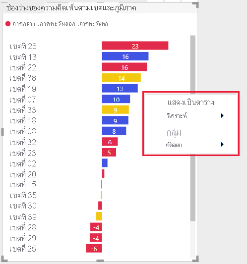
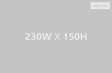
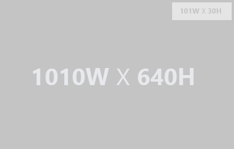

# คำแนะนำสำหรับการแสดงภาพ Power BIGuidelines for Power BI visuals
ก่อนที่คุณจะ[เผยแพร่](office-store.md)วิชวล Power BI ของคุณไปยัง Microsoft AppSource เพื่อให้ผู้อื่นสามารถค้นหาและใช้งานได้ ต้องตรวจสอบให้แน่ใจว่าคุณได้ทำตามคำแนะนำเพื่อสร้างประสบการณ์ที่ยอดเยี่ยมสำหรับผู้ใช้ของคุณแล้วBefore you [publish](office-store.md) your Power BI visual to Microsoft AppSource for others to discover and use, make sure that you follow the guidelines to create a great experience for your users.

## วิชวล Power BI ที่มีการซื้อเพิ่มเติมPower BI visuals with additional purchases

คุณสามารถส่งวิชวล Power BI ที่ไม่มีค่าใช้จ่ายไปยัง Marketplace (Microsoft AppSource) ได้You can submit Power BI visuals that are free to the Marketplace (Microsoft AppSource). นอกจากนี้คุณยังสามารถส่งวิชวล Power BI ของ Microsoft AppSource ที่มีแท็กราคาเขียนว่า "อาจจำเป็นที่ต้องซื้อเพิ่ม" ได้อีกด้วยYou can also submit to Microsoft AppSource Power BI visuals that have an "additional purchase may be required" price tag. วิชวล Power BI ที่มีแท็กราคา "อาจจำเป็นที่ต้องซื้อเพิ่ม" มีลักษณะคล้ายกับ Add-in ที่ซื้อเพิ่มภายในแอป (IAP) ในร้านค้าสำนักงาน"Additional purchase may be required" Power BI visuals, are similar to in-app purchase (IAP) add-ins in the Office Store. 

เช่นเดียวกับวิชวล Power BI แบบฟรี ซึ่งยังสามารถรับรองวิชวล IAP Power BI ได้อีกด้วยSimilarly to a free Power BI visual, an IAP Power BI visual can also be certified. ก่อนที่จะส่งวิชวล IAP Power BI ของคุณ กรุณาตรวจสอบให้แน่ใจว่าวิชวลเป็นไปตาม [ข้อกำหนดการรับรอง](power-bi-custom-visuals-certified.md) หรือไม่Before submitting your IAP Power BI visual for certification, make sure it complies with the [certification requirements](power-bi-custom-visuals-certified.md).

### วิชวล Power BI ที่มีคุณลักษณะ IAP คืออะไร?What is a Power BI visual with IAP features?

วิชวล IAP Power BI เป็นวิชวลแบบ *ฟรี* ที่ให้บริการ *คุณลักษณะแบบฟรี*An IAP Power BI visual is a *free* visual that offers *free features*. นอกจากนี้ยังมีคุณลักษณะขั้นสูงบางอย่างที่อาจมีค่าธรรมเนียมเพิ่มเติมIt also has some advanced features for which extra charges may be applied. ในการอธิบายวิชวล Power BI นักพัฒนาต้องแจ้งผู้ใช้ถึงคำอธิบายของวิชวลเกี่ยวกับคุณลักษณะที่ต้องซื้อเพิ่มเติมเพื่อใช้งานIn the Power BI visual's description, developers must notify users about the features that require additional purchases to operate. ปัจจุบัน Microsoft ไม่ได้มี APIs แบบเนทีฟเพื่อสนับสนุนการซื้อเพิ่มภายของแอปและ Add-insCurrently, Microsoft does not provide native APIs to support the purchase of apps and add-ins.

นักพัฒนาอาจใช้ระบบการชำระเงินอื่นสำหรับการซื้อเหล่านี้Developers may use any third-party payment system for these purchases. สำหรับข้อมูลเพิ่มเติม ให้ดูที่[นโยบายร้านค้าของเรา](/legal/marketplace/certification-policies#11002-displaying-ads)For more information, see [our store policy](/legal/marketplace/certification-policies#11002-displaying-ads).

>[!IMPORTANT]  
> หากคุณอัปเดตวิชวล Power BI ของคุณจากฟรีเป็น "อาจจำเป็นต้องซื้อเพิ่มเติม" ผู้ใช้จะต้องได้รับฟังก์ชันการใช้งานฟรีในระดับเดียวกับก่อนการอัปเดตIf you update your Power BI visual from free to "Additional purchase may be required", users must receive the same level of free functionality  as before the update. คุณอาจเพิ่มคุณลักษณะขั้นสูงแบบชำระเงินนอกเหนือจากคุณลักษณะฟรีแบบเก่าที่มีอยู่You may add optional advanced paid features in addition to the existing free features.

### ลายน้ำWatermarks

คุณสามารถใช้ลายน้ำเพื่อให้ลูกค้าใช้คุณสมบัติขั้นสูงของ IAP ต่อไปโดยไม่ต้องจ่ายเงินได้You can use watermarks so that customers continue using the IAP advanced features without paying. 

คุณสามารถใช้ลายน้ำเพื่อแสดงฟังก์ชันการทำงานของวิชวล Power BI เต็มรูปแบบก่อนทำการซื้อได้Watermarks can be used to showcase the full functionality of the Power BI visual, before a purchase is made. 

* ลายน้ำสามารถใช้ได้เฉพาะกับคุณลักษณะที่ต้องชำระซึ่งใช้โดยไม่ต้องมีใบอนุญาตที่ถูกต้องWatermarks may only be used on paid features that are used without a valid license.
* ไม่อนุญาตให้ใช้ลายน้ำในวิชวล Power BI ที่มีแท็กราคา *ฟรี*Watermarks are not allowed in Power BI visuals with a *free* price tag.
* ไม่อนุญาตให้ใช้ลายน้ำในวิชวล IAP เมื่อผู้ใช้ใช้คุณลักษณะฟรีWatermarks are not allowed in IAP visuals, when the user uses free features. 

### หน้าต่างป็อปอัพPop-up window

คุณสามารถใช้หน้าต่างป็อปอัพเพื่ออธิบายวิธีการซื้อสิทธิ์การใช้งานเมื่อมีการใช้ใบอนุญาตที่ไม่ถูกต้อง (หรือหมดอายุ) ด้วยวิชวล Power BI IAP ของคุณได้You can use a pop-up window to explain how to purchase a license, when an invalid (or expired) license is used with your Power BI IAP visual.

### กระบวนการส่งSubmission process

ทำตาม [กระบวนการส่งคำร้อง](office-store.md#submitting-to-appsource) และระบบจะพาไปยังแท็บ *การตั้งค่าผลิตภัณฑ์* และตรวจสอบกล่องกาเครื่องหมาย *ผลิตภัณฑ์ของฉันที่ต้องการบริการซื้อ*Follow the [submission process](office-store.md#submitting-to-appsource) and then navigate to the *Product setup* tab and check the *My product requires the purchase of a service* check box.

หลังจากตรวจสอบและอนุมัติวิชวล Power BI แล้ว การลงรายการ Microsoft AppSource สำหรับวิชวล IAP Power BI จะระบุว่า 'อาจจำเป็นต้องซื้อเพิ่ม' ภายใต้ตัวเลือกการกำหนดราคาAfter the Power BI visual is validated and approved, the Microsoft AppSource listing for the IAP Power BI visual states, "Additional purchase may be required" under the pricing options.

## เมนูบริบทContext menu
เมนูบริบทคือเมนูคลิกขวาที่จะแสดงขึ้นเมื่อผู้ใช้วางเมาส์เหนือการแสดงผลด้วยภาพContext menu is the right-click menu that is displayed when the user is hovering over a visual.
การแสดงผลด้วยภาพของ Power BI ทั้งหมดควรเปิดใช้งานเมนูบริบทเพื่อนำเสนอประสบการณ์แบบครบวงจรAll Power BI visuals should enable the context menu to bring a unified experience.
โปรดตรวจสอบ[บทความ](https://github.com/PowerBi-Projects/PowerBI-visuals/tree/gh-pages/tutorials/building-bar-chart)นี้เพื่อเรียนรู้วิธีการเพิ่มเมนูบริบทPlease check [this article](https://github.com/PowerBi-Projects/PowerBI-visuals/tree/gh-pages/tutorials/building-bar-chart) to learn how to add a context menu.

>[!div class="mx-imgBorder"]
>

## โลโก้เชิงพาณิชย์Commercial logo
ส่วนนี้จะอธิบายข้อกำหนดสำหรับการเพิ่มโลโก้เชิงพาณิชย์ในวิชวล Power BIThis section describes the specifications for adding commercial logos in Power BI visuals. โลโก้เชิงพาณิชย์ไม่ได้เป็นแบบบังคับCommercial logos are not mandatory. ถ้าเพิ่ม จะต้องเป็นไปตามคำแนะนำเหล่านี้If added they must follow these guidelines.

> [!NOTE]
> * ในบทความนี้ 'โลโก้เชิงพาณิชย์' หมายถึงไอคอนของบริษัทเชิงพาณิชย์ใด ๆ ตามที่อธิบายไว้ในภาพด้านล่างIn this article, 'commercial logo' refers to any commercial company icon as described in the pictures below.
> * โลโก้เชิงพาณิชย์ของ Microsoft ที่ใช้ในบทความนี้เป็นเพียงตัวอย่างเท่านั้นThe Microsoft commercial logo is used in this article only as an example. ใช้โลโก้เชิงพาณิชย์ของคุณเองกับวิชวล Power BI ของคุณUse your own commercial logo with your Power BI visual.

> [!IMPORTANT]
> โลโก้เชิงพาณิชย์สามารถใช้ได้ *เฉพาะในโหมดแก้ไขเท่านั้น*Commercial logos are allowed in *edit mode only*. โลโก้เชิงพาณิชย์ *ไม่สามารถ* แสดงในโหมดมุมมองได้Commercial logos *can't* be displayed in view mode.

### ประเภทของโลโก้เชิงพาณิชย์Commercial logo type

มีโลโก้เชิงพาณิชย์สามประเภท:There are three types of commercial logos:
* **โลโก้** - โลโก้มีองค์ประกอบสองอย่างที่ติดแน่นอยู่ด้วยกัน คือ ไอคอนและชื่อ**Logo** - A logo is comprised of two elements locked together, an icon and a name.

    

* **สัญลักษณ์** - กราฟิกที่ไม่มีข้อความ**Symbol** - A graphic without any text.

    

* **คำโลโก้** - โลโก้ที่ไม่มีไอคอน แต่ประกอบด้วยข้อความเท่านั้น**Logotype** - A logo without an icon, comprised only from text.

    

### สีของโลโก้เชิงพาณิชย์Commercial logo color

เมื่อใช้โลโก้เชิงพาณิชย์ สีของโลโก้จะต้องเป็นสีเทา (hex color #C8C8C8)When using a commercial logo, the color of the logo must be grey (hex color #C8C8C8). อย่าเพิ่มเอฟเฟกต์ เช่น การไล่ระดับสี แก่โลโก้เชิงพาณิชย์Don't add effects such as gradients to the commercial logo.

* **โลโก้****Logo**

    

* **สัญลักษณ์** - กราฟิกที่ไม่มีข้อความ**Symbol** - A graphic without any text.

    

* **คำโลโก้** - โลโก้ที่ไม่มีไอคอน แต่ประกอบด้วยข้อความเท่านั้น**Logotype** - A logo without an icon, comprised only from text.

    

> [!TIP]
> * หากวิชวล Power BI ของคุณมีกราฟิก ให้พิจารณาเพิ่มพื้นหลังสีขาวที่มีระยะขอบ 10 px ให้กับโลโก้ของคุณIf your Power BI visual contains a graphic, consider adding a white background with 10 px margins to your logo.
> * พิจารณาเพิ่ม dropshadow ลงในโลโก้ของคุณ (ความทึบของสีดำ 30%)Consider adding dropshadow to your logo (30% opacity black).

### ขนาดของโลโก้เชิงพาณิชย์Commercial logo size

วิชวล Power BI จำเป็นต้องใช้โลโก้เชิงพาณิชย์สองอัน อันหนึ่งสำหรับไทล์ขนาดใหญ่ และอีกหนึ่งอันสำหรับไทล์ขนาดเล็กA Power BI visual requires two commercial logos, one for large tiles and one for small tiles. วางโลโก้ภายในกล่องแสดงขอบเขตที่อยู่มุมขวาด้านบนหรือด้านล่าง ด้วยระยะขอบ 4 pxPlace the logo within a bounding box placed at the top or bottom right corner, with 4 px margins.

ตารางต่อไปนี้อธิบายถึงข้อควรพิจารณาของขนาดสำหรับวิชวล Power BIThe following table describes the size considerations for Power BI visuals.

|ตั้งค่าSettings  |วิชวล Power BI ขนาดเล็กSmall Power BI visual  |วิชวล Power BI ขนาดใหญ่Large Power BI visual  |
|---------|---------|---------|
|*ความกว้างของโลโก้**Logo width*    |สูงสุด 240 pxUp to 240 px         |มากกว่า 240 pxGreater than 240 px         |
|*ความสูงของโลโก้**Logo height*     |สูงสุด 160 pxUp to 160 px         |มากกว่า 160 pxGreater than 160 px         |
|*ขนาดกล่องแสดงขอบเขต**Bounding box size*     |40 x 15 px40 x 15 px         |101 x 30 px101 x 30 px         |
|*ตัวอย่างโลโก้เชิงพาณิชย์**Commercial logo example*     |         |         |
|*ตัวอย่างกล่องแสดงขอบเขต**Bounding box example*    |         |         |
|    |         |         |

### ลักษณะการทำงานของโลโก้เชิงพาณิชย์Commercial logo behavior

โลโก้เชิงพาณิชย์สามารถใช้ได้เฉพาะในโหมดแก้ไขเท่านั้นCommercial logos are only allowed in edit mode. เมื่อคลิกแล้ว โลโก้เชิงพาณิชย์จะมีฟังก์ชันการทำงานต่อไปนี้เท่านั้น:When clicked, a commercial logo can only include the following functionality:

* การคลิกที่โลโก้เชิงพาณิชย์จะเปลี่ยนเส้นทางไปยังเว็บไซต์ของคุณClicking the commercial logo redirects to your website.

* การคลิกโลโก้เชิงพาณิชย์จะเปิดหน้าต่างป๊อปอัปพร้อมข้อมูลเพิ่มเติมClicking the commercial logo opens a popup window with additional information. หน้าต่างป๊อปอัปควรแบ่งออกเป็นสองส่วน:The popup window should be divided into two sections:
    * พื้นที่การตลาดซึ่งสามารถรวมโลโก้เชิงพาณิชย์ การจัดอันดับวิชวลและการตลาดA marketing area which can include the the commercial logo, a visual and market ratings.
    * พื้นที่ข้อมูลซึ่งสามารถรวมข้อมูลและลิงก์An information area which can include information and links.    

### สิ่งที่ต้องหลีกเลี่ยงThings to avoid

* โลโก้เชิงพาณิชย์ไม่สามารถแสดงในโหมดมุมมองได้Commercial logos cannot be displayed in view mode.

* โลโก้เชิงพาณิชย์แบบเคลื่อนไหวสามารถแสดงภาพเคลื่อนไหวได้สูงสุดห้าวินาทีAn animated commercial logo can display animation for up to five seconds.

* หากวิชวล Power BI ของคุณมีไอคอนข้อมูล (i) ในโหมดการอ่าน วิชวลควรเป็นไปตามสี ขนาด และตำแหน่งของโลโก้เชิงพาณิชย์ดังที่อธิบายไว้ข้างต้นIf your Power BI visual includes informative icons (i) in reading mode, they should comply to the color, size, and location of the commercial logo, as described above.

* หลีกเลี่ยงการใช้โลโก้เชิงพาณิชย์ที่มีสีสันหรือสีดำAvoid a colorful or a black commercial logo. โลโก้เชิงพาณิชย์ต้องเป็นสีเทา (hex color #C8C8C8)The commercial logo must be grey (hex color #C8C8C8).

     

* โลโก้เชิงพาณิชย์ที่มีเอฟเฟกต์ เช่น การไล่ระดับสีหรือเงาที่เข้มA commercial logo with effects such as gradients or strong shadows.

    

## แนวทางปฏิบัติที่ดีที่สุดBest practices

เมื่อเผยแพร่วิชวล Power BI ให้พิจารณาคำแนะนำต่อไปนี้เพื่อมอบประสบการณ์ที่ยอดเยี่ยมแก่ผู้ใช้When publishing a Power BI visual, consider the following recommendations in order to provide users a great experience.

### หน้าเริ่มต้นของวิชวลVisual landing page

ใช้หน้าเริ่มต้นเพื่อชี้แจงให้ผู้ใช้ทราบว่าพวกเขาสามารถใช้วิชวล Power BI ของคุณได้อย่างไรและสามารถซื้อใบอนุญาตได้ที่ไหนUse the landing page to clarify to users how they can use your Power BI visual and where to purchase the license. อย่าใส่วิดีโอที่เรียกใช้งานโดยอัตโนมัติDon't include videos that are automatically triggered. เพิ่มเฉพาะเนื้อหาที่ช่วยเพิ่มประสบการณ์ของผู้ใช้ เช่น ข้อมูลหรือลิงก์ไปยังรายละเอียดการซื้อใบอนุญาตและวิธีใช้คุณลักษณะ IAP เท่านั้นAdd only material that helps improve the user's experience, such as information or links to license purchasing details and how to use IAP features.

### คีย์ใบอนุญาตและโทเค็นLicense key and token

เพื่อความสะดวกของผู้ใช้ เพิ่มคีย์ใบอนุญาตหรือโทเค็นที่เกี่ยวข้องกับเขตข้อมูลที่ด้านบนของบานหน้าต่างการจัดรูปแบบFor the user's convenience, add the license key or token related fields at the top of the format pane.

## คำถามที่ถามบ่อยFAQ

สำหรับข้อมูลเพิ่มเติมเกี่ยวกับวิชวล Power BI โปรดดูที่ [คำถามที่ถามบ่อยเกี่ยวกับวิชวล Power BI ที่มีการซื้อเพิ่มเติม](power-bi-custom-visuals-faq.md#visuals-with-additional-purchases)For more information about Power BI visuals, see  [Frequently asked questions about Power BI visuals with additional purchases](power-bi-custom-visuals-faq.md#visuals-with-additional-purchases).

## ขั้นตอนถัดไปNext steps

เรียนรู้วิธีการที่คุณสามารถเผยแพร่วิชวล Power BI ของคุณไปยัง Microsoft AppSource เพื่อให้บุคคลอื่นสามารถค้นหาและใช้งานได้Learn how you can publish your Power BI visual to Microsoft AppSource for others to discover and use.

>[!div class="nextstepaction"]
>[เผยแพร่วิชวล Power BIPublish Power BI visuals](office-store.md)
