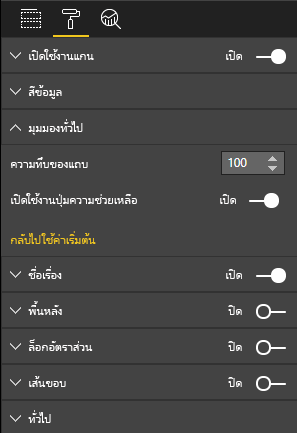

# <a name="create-a-launch-url"></a><span data-ttu-id="44d34-104">สร้าง URL เปิดใช้งาน</span><span class="sxs-lookup"><span data-stu-id="44d34-104">Create a launch URL</span></span>

<span data-ttu-id="44d34-105">ด้วยการสร้าง URL เปิดใช้งาน คุณสามารถเปิดแท็บเบราว์เซอร์ใหม่ (หรือหน้าต่าง) โดยการกำหนดงานที่แท้จริงให้กับ Power BI</span><span class="sxs-lookup"><span data-stu-id="44d34-105">By creating a launch URL, you can open a new browser tab (or window) by delegating the actual work to Power BI.</span></span>

> [!IMPORTANT]
> <span data-ttu-id="44d34-106">`host.launchUrl()`ได้รับการแนะนำใน Visuals API 1.9.0</span><span class="sxs-lookup"><span data-stu-id="44d34-106">The `host.launchUrl()` was introduced in Visuals API 1.9.0.</span></span>

## <a name="sample"></a><span data-ttu-id="44d34-107">ตัวอย่าง</span><span class="sxs-lookup"><span data-stu-id="44d34-107">Sample</span></span>

<span data-ttu-id="44d34-108">นำเข้า`IVisualHost`อินเทอร์เฟซและบันทึกการเชื่อมโยงไปยังวัตถุ`host` ในคอนสตรักเตอร์ของภาพ</span><span class="sxs-lookup"><span data-stu-id="44d34-108">Import `IVisualHost` interface and save link to `host` object in the constructor of the visual.</span></span>

```typescript
import powerbi from "powerbi-visuals-api";
import IVisualHost = powerbi.extensibility.visual.IVisualHost;

export class Visual implements IVisual {
    private host: IVisualHost;
    // ...
    constructor(options: VisualConstructorOptions) {
        // ...
        this.host = options.host;
        // ...
    }

    // ...
}
```

## <a name="usage"></a><span data-ttu-id="44d34-109">การใช้</span><span class="sxs-lookup"><span data-stu-id="44d34-109">Usage</span></span>

<span data-ttu-id="44d34-110">ใช้การเรียกใช้ `host.launchUrl()` API ซึ่งเปลี่ยน URL ปลายทางของคุณเป็นอาร์กิวเมนต์ของสตริง:</span><span class="sxs-lookup"><span data-stu-id="44d34-110">Use the `host.launchUrl()` API call, passing your destination URL as a string argument:</span></span>

```typescript
this.host.launchUrl('https://some.link.net');
```

## <a name="restrictions"></a><span data-ttu-id="44d34-111">ข้อจำกัด</span><span class="sxs-lookup"><span data-stu-id="44d34-111">Restrictions</span></span>

* <span data-ttu-id="44d34-112">ใช้เส้นทางแบบสัมบูรณ์เท่านั้น ไม่ใช่เส้นทางแบบสัมพัทธ์</span><span class="sxs-lookup"><span data-stu-id="44d34-112">Use only absolute paths, not relative paths.</span></span> <span data-ttu-id="44d34-113">ตัวอย่างเช่น ใช้เส้นทางแบบสัมบูรณ์ เช่น `https://some.link.net/subfolder/page.html`</span><span class="sxs-lookup"><span data-stu-id="44d34-113">For example, use an absolute path such as `https://some.link.net/subfolder/page.html`.</span></span> <span data-ttu-id="44d34-114">เส้นทางแบบสัมพัทธ์ `/page.html` จะไม่ถูกเปิดขึ้น</span><span class="sxs-lookup"><span data-stu-id="44d34-114">The relative path,`/page.html`, won't be opened.</span></span>

* <span data-ttu-id="44d34-115">ปัจจุบัน รองรับเฉพาะโปรโตคอล *HTTP* และ *HTTPS* เท่านั้น</span><span class="sxs-lookup"><span data-stu-id="44d34-115">Currently, only *HTTP* and *HTTPS* protocols are supported.</span></span> <span data-ttu-id="44d34-116">หลีกเลี่ยง *FTP*, *MAILTO* และอื่นๆ</span><span class="sxs-lookup"><span data-stu-id="44d34-116">Avoid *FTP*, *MAILTO*, and so on.</span></span>

## <a name="best-practices"></a><span data-ttu-id="44d34-117">แนวทางปฏิบัติที่ดีที่สุด</span><span class="sxs-lookup"><span data-stu-id="44d34-117">Best practices</span></span>

* <span data-ttu-id="44d34-118">โดยปกติแล้วจะเป็นวิธีการดีที่สุดที่จะเปิดลิงก์เพื่อเป็นการตอบสนองต่อการดำเนินการที่ชัดเจนของผู้ใช้เท่านั้น</span><span class="sxs-lookup"><span data-stu-id="44d34-118">Usually, it's best to open a link only as a response to a user's explicit action.</span></span> <span data-ttu-id="44d34-119">ทำให้ผู้ใช้เข้าใจได้ง่ายว่าการคลิกที่ลิงก์หรือปุ่มจะส่งผลให้เกิดการเปิดแท็บใหม่ การทริกเกอร์ `launchUrl()` การโทรโดยไม่มีการดำเนินการของผู้ใช้หรือเป็นผลข้างเคียงของการดำเนินการที่แตกต่างกันอาจทำให้ผู้ใช้เกิดความสับสนหรือหงุดหงิด</span><span class="sxs-lookup"><span data-stu-id="44d34-119">Make it easy for the user to understand that clicking the link or button will result in opening a new tab. Triggering a `launchUrl()` call without a user's action, or as a side effect of a different action can be confusing or frustrating for the user.</span></span>

* <span data-ttu-id="44d34-120">หากลิงก์ไม่จำเป็นต่อการทำงานที่เหมาะสมของวิชวล เราขอแนะนำว่าคุณควรให้วิธีการปิดใช้งานและซ่อนลิงก์แก่ผู้เขียนรายงาน</span><span class="sxs-lookup"><span data-stu-id="44d34-120">If the link isn't essential for the proper functioning of the visual, we recommend that you give the report's author a way to disable and hide the link.</span></span> <span data-ttu-id="44d34-121">คำแนะนำนี้มีความเกี่ยวข้องโดยเฉพาะอย่างยิ่งสำหรับกรณีการใช้ Power BI แบบพิเศษ เช่น การฝังรายงานในแอปพลิเคชันบุคคลที่สามหรือการเผยแพร่ไปยังเว็บ</span><span class="sxs-lookup"><span data-stu-id="44d34-121">This recommendation is especially relevant for special Power BI use cases, such as embedding a report in a third-party application or publishing it to the web.</span></span>

* <span data-ttu-id="44d34-122">หลีกเลี่ยงการทริกเกอร์ `launchUrl()` ซึ่งเรียกใช้จากภายในการวนรอบ ฟังก์ชันของวิชวล `update`หรือรหัสที่เกิดซ้ำบ่อยอื่นๆ</span><span class="sxs-lookup"><span data-stu-id="44d34-122">Avoid triggering a `launchUrl()` call from inside a loop, the visual's `update` function, or any other frequently recurring code.</span></span>

## <a name="a-step-by-step-example"></a><span data-ttu-id="44d34-123">ตัวอย่างแบบทีละขั้นตอน</span><span class="sxs-lookup"><span data-stu-id="44d34-123">A step-by-step example</span></span>

### <a name="add-a-link-launching-element"></a><span data-ttu-id="44d34-124">เพิ่มองค์ประกอบการเปิดใช้ลิงก์</span><span class="sxs-lookup"><span data-stu-id="44d34-124">Add a link-launching element</span></span>

<span data-ttu-id="44d34-125">บรรทัดต่อไปนี้ถูกเพิ่มไปยังฟังก์ชัน`constructor`ของวิชวล:</span><span class="sxs-lookup"><span data-stu-id="44d34-125">The following lines were added to the visual's `constructor` function:</span></span>

```typescript
    this.helpLinkElement = this.createHelpLinkElement();
    options.element.appendChild(this.helpLinkElement);
```

<span data-ttu-id="44d34-126">ฟังก์ชันส่วนตัวที่สร้างและใส่องค์ประกอบของจุดยึดถูกเพิ่มเข้ามา:</span><span class="sxs-lookup"><span data-stu-id="44d34-126">A private function that creates and attaches the anchor element was added:</span></span>

```typescript
private createHelpLinkElement(): Element {
    let linkElement = document.createElement("a");
    linkElement.textContent = "?";
    linkElement.setAttribute("title", "Open documentation");
    linkElement.setAttribute("class", "helpLink");
    linkElement.addEventListener("click", () => {
        this.host.launchUrl("https://docs.microsoft.com/power-bi/developer/visuals/custom-visual-develop-tutorial");
    });
    return linkElement;
};
```

<span data-ttu-id="44d34-127">ในท้ายที่สุด รายการในไฟล์ *visual.less* จะกำหนดสไตล์สำหรับองค์ประกอบของลิงก์:</span><span class="sxs-lookup"><span data-stu-id="44d34-127">Finally, an entry in the *visual.less* file defines the style for the link element:</span></span>

```less
.helpLink {
    position: absolute;
    top: 0px;
    right: 12px;
    display: block;
    width: 20px;
    height: 20px;
    border: 2px solid #80B0E0;
    border-radius: 20px;
    color: #80B0E0;
    text-align: center;
    font-size: 16px;
    line-height: 20px;
    background-color: #FFFFFF;
    transition: all 900ms ease;

    &:hover {
        background-color: #DDEEFF;
        color: #5080B0;
        border-color: #5080B0;
        transition: all 250ms ease;
    }

    &.hidden {
        display: none;
    }
}
```

### <a name="add-a-toggling-mechanism"></a><span data-ttu-id="44d34-128">เพิ่มกลไกการสลับ</span><span class="sxs-lookup"><span data-stu-id="44d34-128">Add a toggling mechanism</span></span>

<span data-ttu-id="44d34-129">เมื่อต้องการเพิ่มกลไกการสลับ คุณจำเป็นต้องเพิ่มออบเจ็กต์สแตติกเพื่อให้ผู้เขียนรายงานสามารถสลับการมองเห็นองค์ประกอบลิงก์ได้</span><span class="sxs-lookup"><span data-stu-id="44d34-129">To add a toggling mechanism, you need to add a static object so that the report's author can toggle the visibility of the link element.</span></span> <span data-ttu-id="44d34-130">(ค่าเริ่มต้นถูกตั้งเป็น *ซ่อน*) สำหรับข้อมูลเพิ่มเติม ให้ดู[บทช่วยสอนเรื่องออบเจ็กต์สแตติก](https://microsoft.github.io/PowerBI-visuals/docs/concepts/objects-and-properties)</span><span class="sxs-lookup"><span data-stu-id="44d34-130">(The default is set to *hidden*.) For more information, see the [static object tutorial](https://microsoft.github.io/PowerBI-visuals/docs/concepts/objects-and-properties).</span></span>

<span data-ttu-id="44d34-131">ออบเจ็กต์สแตติกแบบบูลีน `showHelpLink` ถูกเพิ่มไปยังรายการออบเจ็กต์ของไฟล์ *capabilities.json* ดังที่แสดงในโค้ดต่อไปนี้:</span><span class="sxs-lookup"><span data-stu-id="44d34-131">A `showHelpLink` Boolean static object was added to the *capabilities.json* file's objects entry, as shown in the following code:</span></span>

```typescript
"objects": {
    "generalView": {
            "displayName": "General View",
            "properties":
                "showHelpLink": {
                    "displayName": "Show Help Button",
                    "type": {
                        "bool": true
                    }
                }
            }
        }
    }
```



<span data-ttu-id="44d34-133">และในฟังก์ชัน`update`ของวิชวล มีการเพิ่มบรรทัดต่อไปนี้:</span><span class="sxs-lookup"><span data-stu-id="44d34-133">And, in the visual's `update` function, the following lines were added:</span></span>

```typescript
if (settings.generalView.showHelpLink) {
    this.helpLinkElement.classList.remove("hidden");
} else {
    this.helpLinkElement.classList.add("hidden");
}
```

<span data-ttu-id="44d34-134">คลาส *ที่ซ่อนอยู่* จะถูกกำหนดไว้ในไฟล์ *visual.less* เพื่อควบคุมการแสดงผลขององค์ประกอบ</span><span class="sxs-lookup"><span data-stu-id="44d34-134">The *hidden* class is defined in the *visual.less* file to control the display of the element.</span></span>