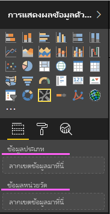
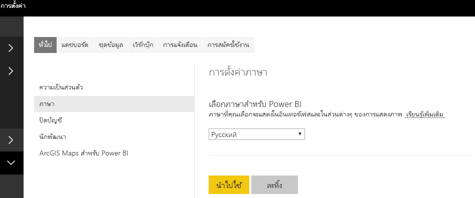

# <a name="add-the-locale-in-power-bi-for-power-bi-visuals"></a><span data-ttu-id="4191c-104">เพิ่มตำแหน่งที่ตั้งใน Power BI สำหรับวิชวล Power BI</span><span class="sxs-lookup"><span data-stu-id="4191c-104">Add the locale in Power BI for Power BI visuals</span></span>

<span data-ttu-id="4191c-105">วิชวลสามารถเรียกใช้ตำแหน่งที่ตั้งใน Power BI เพื่อแปลเนื้อหาให้เป็นภาษาที่เกี่ยวข้อง</span><span class="sxs-lookup"><span data-stu-id="4191c-105">Visuals can retrieve the Power BI locale to localize their content to the relevant language.</span></span>

<span data-ttu-id="4191c-106">อ่านเพิ่มเติมเกี่ยวกับ [ภาษาและประเทศ/ภูมิภาคที่รองรับสำหรับ Power BI](./../../fundamentals/supported-languages-countries-regions.md)</span><span class="sxs-lookup"><span data-stu-id="4191c-106">Read more about [Supported languages and countries/regions for Power BI](./../../fundamentals/supported-languages-countries-regions.md)</span></span>

<span data-ttu-id="4191c-107">ตัวอย่างเช่น รับตำแหน่งที่ตั้งในวิชวลแผนภูมิแท่งตัวอย่าง</span><span class="sxs-lookup"><span data-stu-id="4191c-107">For example, getting locale in the Sample Bar Chart visual.</span></span>


<span data-ttu-id="4191c-109">แผนภูมิแท่งเหล่านี้แต่ละอันถูกสร้างขึ้นตามตำแหน่งที่ตั้งที่แตกต่างกัน (อังกฤษ บาสก์ และฮินดี) และจะแสดงในคำแนะนำเครื่องมื</span><span class="sxs-lookup"><span data-stu-id="4191c-109">Each of these bar charts was created under a different locale (English, Basque, and Hindi), and it's displayed in the tooltip.</span></span>

> [!NOTE]
> <span data-ttu-id="4191c-110">ตัวจัดการการแปลเป็นภาษาท้องถิ่นในรหัสของวิชวลรองรับ API 1.10.0 และเวอร์ชันที่สูงกว่า</span><span class="sxs-lookup"><span data-stu-id="4191c-110">The localization manager in the visual's code is supported from API 1.10.0 and higher.</span></span>

## <a name="get-the-locale"></a><span data-ttu-id="4191c-111">รับตำแหน่งที่ตั้ง</span><span class="sxs-lookup"><span data-stu-id="4191c-111">Get the locale</span></span>

<span data-ttu-id="4191c-112">`locale` ถูกส่งผ่านเป็นสตริงระหว่างการเตรียมใช้งานของวิชวล</span><span class="sxs-lookup"><span data-stu-id="4191c-112">The `locale` is passed as a string during the initialization of the visual.</span></span> <span data-ttu-id="4191c-113">ถ้ามีการเปลี่ยนแปลงตำแหน่งที่ตั้งใน Power BI จะมีการสร้างวิชวลอีกครั้งด้วยตำแหน่งที่ตั้งใหม่</span><span class="sxs-lookup"><span data-stu-id="4191c-113">If a locale is changed in Power BI, the visual will be generated again with the new locale.</span></span> <span data-ttu-id="4191c-114">คุณสามารถค้นหารหัสตัวอย่างฉบับสมบูรณ์ได้ที่ SampleBarChart with Locale</span><span class="sxs-lookup"><span data-stu-id="4191c-114">You can find the full sample code at SampleBarChart with Locale</span></span>

<span data-ttu-id="4191c-115">ตอนนี้ คอนสตรักเตอร์ BarChart มีสมาชิกตำแหน่งที่ตั้ง ซึ่งมีการสร้างอินสแตนซ์ในคอนสตรักเตอร์ด้วยอินสแตนซ์ตำแหน่งที่ตั้งของโฮสต์</span><span class="sxs-lookup"><span data-stu-id="4191c-115">The BarChart constructor now has a locale member, which is instantiated in the constructor with the host locale instance.</span></span>

```typescript
private locale: string;
...
this.locale = options.host.locale;
```

<span data-ttu-id="4191c-116">ตำแหน่งที่ตั้งที่ได้รับการสนับสนุน:</span><span class="sxs-lookup"><span data-stu-id="4191c-116">Supported locales:</span></span>

<span data-ttu-id="4191c-117">สตริงของตำแหน่งที่ตั้ง</span><span class="sxs-lookup"><span data-stu-id="4191c-117">Locale string</span></span> | <span data-ttu-id="4191c-118">Language</span><span class="sxs-lookup"><span data-stu-id="4191c-118">Language</span></span>
--------------|----------------------
<span data-ttu-id="4191c-119">ar-SA</span><span class="sxs-lookup"><span data-stu-id="4191c-119">ar-SA</span></span> | <span data-ttu-id="4191c-120">العربية (อาหรับ)</span><span class="sxs-lookup"><span data-stu-id="4191c-120">العربية (Arabic)</span></span>
<span data-ttu-id="4191c-121">bg-BG</span><span class="sxs-lookup"><span data-stu-id="4191c-121">bg-BG</span></span> | <span data-ttu-id="4191c-122">български (บัลแกเรีย)</span><span class="sxs-lookup"><span data-stu-id="4191c-122">български (Bulgarian)</span></span>
<span data-ttu-id="4191c-123">ca-ES</span><span class="sxs-lookup"><span data-stu-id="4191c-123">ca-ES</span></span> | <span data-ttu-id="4191c-124">català (คาตาลัน)</span><span class="sxs-lookup"><span data-stu-id="4191c-124">català (Catalan)</span></span>
<span data-ttu-id="4191c-125">cs-CZ</span><span class="sxs-lookup"><span data-stu-id="4191c-125">cs-CZ</span></span> | <span data-ttu-id="4191c-126">čeština (เช็ก)</span><span class="sxs-lookup"><span data-stu-id="4191c-126">čeština (Czech)</span></span>
<span data-ttu-id="4191c-127">da-DK</span><span class="sxs-lookup"><span data-stu-id="4191c-127">da-DK</span></span> | <span data-ttu-id="4191c-128">dansk (เดนมาร์ก)</span><span class="sxs-lookup"><span data-stu-id="4191c-128">dansk (Danish)</span></span>
<span data-ttu-id="4191c-129">de-DE</span><span class="sxs-lookup"><span data-stu-id="4191c-129">de-DE</span></span> | <span data-ttu-id="4191c-130">Deutsche (เยอรมัน)</span><span class="sxs-lookup"><span data-stu-id="4191c-130">Deutsche (German)</span></span>
<span data-ttu-id="4191c-131">el-GR</span><span class="sxs-lookup"><span data-stu-id="4191c-131">el-GR</span></span> | <span data-ttu-id="4191c-132">ελληνικά (กรีก)</span><span class="sxs-lookup"><span data-stu-id="4191c-132">ελληνικά (Greek)</span></span>
<span data-ttu-id="4191c-133">en-US</span><span class="sxs-lookup"><span data-stu-id="4191c-133">en-US</span></span> | <span data-ttu-id="4191c-134">English (อังกฤษ)</span><span class="sxs-lookup"><span data-stu-id="4191c-134">English (English)</span></span>
<span data-ttu-id="4191c-135">es-ES</span><span class="sxs-lookup"><span data-stu-id="4191c-135">es-ES</span></span> | <span data-ttu-id="4191c-136">español service (สเปน)</span><span class="sxs-lookup"><span data-stu-id="4191c-136">español service (Spanish)</span></span>
<span data-ttu-id="4191c-137">et-EE</span><span class="sxs-lookup"><span data-stu-id="4191c-137">et-EE</span></span> | <span data-ttu-id="4191c-138">eesti (เอสโตเนีย)</span><span class="sxs-lookup"><span data-stu-id="4191c-138">eesti (Estonian)</span></span>
<span data-ttu-id="4191c-139">eU-ES</span><span class="sxs-lookup"><span data-stu-id="4191c-139">eU-ES</span></span> | <span data-ttu-id="4191c-140">Euskal (บาสก์)</span><span class="sxs-lookup"><span data-stu-id="4191c-140">Euskal (Basque)</span></span>
<span data-ttu-id="4191c-141">fi-FI</span><span class="sxs-lookup"><span data-stu-id="4191c-141">fi-FI</span></span> | <span data-ttu-id="4191c-142">suomi (ฟินแลนด์)</span><span class="sxs-lookup"><span data-stu-id="4191c-142">suomi (Finnish)</span></span>
<span data-ttu-id="4191c-143">fr-FR</span><span class="sxs-lookup"><span data-stu-id="4191c-143">fr-FR</span></span> | <span data-ttu-id="4191c-144">français (ฝรั่งเศส)</span><span class="sxs-lookup"><span data-stu-id="4191c-144">français (French)</span></span>
<span data-ttu-id="4191c-145">gl-ES</span><span class="sxs-lookup"><span data-stu-id="4191c-145">gl-ES</span></span> | <span data-ttu-id="4191c-146">galego (กาลิเชีย)</span><span class="sxs-lookup"><span data-stu-id="4191c-146">galego (Galician)</span></span>
<span data-ttu-id="4191c-147">he-IL</span><span class="sxs-lookup"><span data-stu-id="4191c-147">he-IL</span></span> | <span data-ttu-id="4191c-148">עברית (ฮิบรู)</span><span class="sxs-lookup"><span data-stu-id="4191c-148">עברית (Hebrew)</span></span>
<span data-ttu-id="4191c-149">hi-IN</span><span class="sxs-lookup"><span data-stu-id="4191c-149">hi-IN</span></span> | <span data-ttu-id="4191c-150">हिन्दी (ฮินดี)</span><span class="sxs-lookup"><span data-stu-id="4191c-150">हिन्दी (Hindi)</span></span>
<span data-ttu-id="4191c-151">hr-HR</span><span class="sxs-lookup"><span data-stu-id="4191c-151">hr-HR</span></span> | <span data-ttu-id="4191c-152">hrvatski (โครเอเชีย)</span><span class="sxs-lookup"><span data-stu-id="4191c-152">hrvatski (Croatian)</span></span>
<span data-ttu-id="4191c-153">hu-HU</span><span class="sxs-lookup"><span data-stu-id="4191c-153">hu-HU</span></span> | <span data-ttu-id="4191c-154">magyar (ฮังการี)</span><span class="sxs-lookup"><span data-stu-id="4191c-154">magyar (Hungarian)</span></span>
<span data-ttu-id="4191c-155">id-ID</span><span class="sxs-lookup"><span data-stu-id="4191c-155">id-ID</span></span> | <span data-ttu-id="4191c-156">Bahasa Indonesia (อินโดนีเซีย)</span><span class="sxs-lookup"><span data-stu-id="4191c-156">Bahasa Indonesia (Indonesian)</span></span>
<span data-ttu-id="4191c-157">it-IT</span><span class="sxs-lookup"><span data-stu-id="4191c-157">it-IT</span></span> | <span data-ttu-id="4191c-158">italiano (อิตาลี)</span><span class="sxs-lookup"><span data-stu-id="4191c-158">italiano (Italian)</span></span>
<span data-ttu-id="4191c-159">ja-JP</span><span class="sxs-lookup"><span data-stu-id="4191c-159">ja-JP</span></span> | <span data-ttu-id="4191c-160">日本の (ญี่ปุ่น)</span><span class="sxs-lookup"><span data-stu-id="4191c-160">日本の (Japanese)</span></span>
<span data-ttu-id="4191c-161">kk-KZ</span><span class="sxs-lookup"><span data-stu-id="4191c-161">kk-KZ</span></span> | <span data-ttu-id="4191c-162">Қазақ (คาซัคสถาน)</span><span class="sxs-lookup"><span data-stu-id="4191c-162">Қазақ (Kazakh)</span></span>
<span data-ttu-id="4191c-163">ko-KR</span><span class="sxs-lookup"><span data-stu-id="4191c-163">ko-KR</span></span> | <span data-ttu-id="4191c-164">한국의 (เกาหลี)</span><span class="sxs-lookup"><span data-stu-id="4191c-164">한국의 (Korean)</span></span>
<span data-ttu-id="4191c-165">lt-LT</span><span class="sxs-lookup"><span data-stu-id="4191c-165">lt-LT</span></span> | <span data-ttu-id="4191c-166">Lietuvos (ลิทัวเนีย)</span><span class="sxs-lookup"><span data-stu-id="4191c-166">Lietuvos (Lithuanian)</span></span>
<span data-ttu-id="4191c-167">lv-LV</span><span class="sxs-lookup"><span data-stu-id="4191c-167">lv-LV</span></span> | <span data-ttu-id="4191c-168">Latvijas (ลัตเวีย)</span><span class="sxs-lookup"><span data-stu-id="4191c-168">Latvijas (Latvian)</span></span>
<span data-ttu-id="4191c-169">ms-MY</span><span class="sxs-lookup"><span data-stu-id="4191c-169">ms-MY</span></span> | <span data-ttu-id="4191c-170">Bahasa Melayu (มลายู)</span><span class="sxs-lookup"><span data-stu-id="4191c-170">Bahasa Melayu (Malay)</span></span>
<span data-ttu-id="4191c-171">nb-NO</span><span class="sxs-lookup"><span data-stu-id="4191c-171">nb-NO</span></span> | <span data-ttu-id="4191c-172">norsk (นอร์เวย์)</span><span class="sxs-lookup"><span data-stu-id="4191c-172">norsk (Norwegian)</span></span>
<span data-ttu-id="4191c-173">nl-NL</span><span class="sxs-lookup"><span data-stu-id="4191c-173">nl-NL</span></span> | <span data-ttu-id="4191c-174">Nederlands (ดัตช์)</span><span class="sxs-lookup"><span data-stu-id="4191c-174">Nederlands (Dutch)</span></span>
<span data-ttu-id="4191c-175">pl-PL</span><span class="sxs-lookup"><span data-stu-id="4191c-175">pl-PL</span></span> | <span data-ttu-id="4191c-176">polski (โปแลนด์)</span><span class="sxs-lookup"><span data-stu-id="4191c-176">polski (Polish)</span></span>
<span data-ttu-id="4191c-177">pt-BR</span><span class="sxs-lookup"><span data-stu-id="4191c-177">pt-BR</span></span> | <span data-ttu-id="4191c-178">português (โปรตุเกส)</span><span class="sxs-lookup"><span data-stu-id="4191c-178">português (Portuguese)</span></span>
<span data-ttu-id="4191c-179">pt-PT</span><span class="sxs-lookup"><span data-stu-id="4191c-179">pt-PT</span></span> | <span data-ttu-id="4191c-180">português (โปรตุเกส)</span><span class="sxs-lookup"><span data-stu-id="4191c-180">português (Portuguese)</span></span>
<span data-ttu-id="4191c-181">ro-RO</span><span class="sxs-lookup"><span data-stu-id="4191c-181">ro-RO</span></span> | <span data-ttu-id="4191c-182">românesc (โรมาเนีย)</span><span class="sxs-lookup"><span data-stu-id="4191c-182">românesc (Romanian)</span></span>
<span data-ttu-id="4191c-183">ru-RU</span><span class="sxs-lookup"><span data-stu-id="4191c-183">ru-RU</span></span> | <span data-ttu-id="4191c-184">русский (รัสเซีย)</span><span class="sxs-lookup"><span data-stu-id="4191c-184">русский (Russian)</span></span>
<span data-ttu-id="4191c-185">sk-SK</span><span class="sxs-lookup"><span data-stu-id="4191c-185">sk-SK</span></span> | <span data-ttu-id="4191c-186">slovenský (สโลวาเกีย)</span><span class="sxs-lookup"><span data-stu-id="4191c-186">slovenský (Slovak)</span></span>
<span data-ttu-id="4191c-187">sl-SI</span><span class="sxs-lookup"><span data-stu-id="4191c-187">sl-SI</span></span> | <span data-ttu-id="4191c-188">slovenský (สโลเวเนีย)</span><span class="sxs-lookup"><span data-stu-id="4191c-188">slovenski (Slovenian)</span></span>
<span data-ttu-id="4191c-189">sr-Cyrl-RS</span><span class="sxs-lookup"><span data-stu-id="4191c-189">sr-Cyrl-RS</span></span> | <span data-ttu-id="4191c-190">српски (เซอร์เบีย)</span><span class="sxs-lookup"><span data-stu-id="4191c-190">српски (Serbian)</span></span>
<span data-ttu-id="4191c-191">sr-Latn-RS</span><span class="sxs-lookup"><span data-stu-id="4191c-191">sr-Latn-RS</span></span> | <span data-ttu-id="4191c-192">srpski (เซอร์เบีย)</span><span class="sxs-lookup"><span data-stu-id="4191c-192">srpski (Serbian)</span></span>
<span data-ttu-id="4191c-193">sv-SE</span><span class="sxs-lookup"><span data-stu-id="4191c-193">sv-SE</span></span> | <span data-ttu-id="4191c-194">svenska (สวีเดน)</span><span class="sxs-lookup"><span data-stu-id="4191c-194">svenska (Swedish)</span></span>
<span data-ttu-id="4191c-195">th-TH</span><span class="sxs-lookup"><span data-stu-id="4191c-195">th-TH</span></span> | <span data-ttu-id="4191c-196">ไทย (ภาษาไทย)</span><span class="sxs-lookup"><span data-stu-id="4191c-196">ไทย (Thai)</span></span>
<span data-ttu-id="4191c-197">tr-TR</span><span class="sxs-lookup"><span data-stu-id="4191c-197">tr-TR</span></span> | <span data-ttu-id="4191c-198">Türk (ตุรกี)</span><span class="sxs-lookup"><span data-stu-id="4191c-198">Türk (Turkish)</span></span>
<span data-ttu-id="4191c-199">uk-UA</span><span class="sxs-lookup"><span data-stu-id="4191c-199">uk-UA</span></span> | <span data-ttu-id="4191c-200">український (ยูเครน)</span><span class="sxs-lookup"><span data-stu-id="4191c-200">український (Ukrainian)</span></span>
<span data-ttu-id="4191c-201">vi-VN</span><span class="sxs-lookup"><span data-stu-id="4191c-201">vi-VN</span></span> | <span data-ttu-id="4191c-202">tiếng Việt (เวียดนาม)</span><span class="sxs-lookup"><span data-stu-id="4191c-202">tiếng Việt (Vietnamese)</span></span>
<span data-ttu-id="4191c-203">zh-CN</span><span class="sxs-lookup"><span data-stu-id="4191c-203">zh-CN</span></span> | <span data-ttu-id="4191c-204">中国 (จีนแบบย่อ)</span><span class="sxs-lookup"><span data-stu-id="4191c-204">中国 (Chinese-Simplified)</span></span>
<span data-ttu-id="4191c-205">zh-TW</span><span class="sxs-lookup"><span data-stu-id="4191c-205">zh-TW</span></span> | <span data-ttu-id="4191c-206">中國 (จีนแบบดั้งเดิม)</span><span class="sxs-lookup"><span data-stu-id="4191c-206">中國 (Chinese-Tranditional)</span></span>

> [!NOTE]
> <span data-ttu-id="4191c-207">ใน PowerBI Desktop คุณสมบัติของตำแหน่งที่ตั้งจะมีภาษาของ PowerBI Desktop ติดตั้งอยู่ด้วย</span><span class="sxs-lookup"><span data-stu-id="4191c-207">In the PowerBI Desktop the locale property will contain the language of the PowerBI Desktop installed.</span></span>

## <a name="localizing-the-property-pane-for-power-bi-visuals"></a><span data-ttu-id="4191c-208">แปลบานหน้าต่างคุณสมบัติสำหรับวิชวล Power BI ให้เป็นภาษาท้องถิ่น</span><span class="sxs-lookup"><span data-stu-id="4191c-208">Localizing the property pane for Power BI visuals</span></span>

<span data-ttu-id="4191c-209">เขตข้อมูลในบานหน้าต่างคุณสมบัติสามารถเป็นภาษาท้องถิ่นเพื่อมอบประสบการณ์การใช้งานแบบบูรณาการรวมและสอดคล้องกันมากขึ้น</span><span class="sxs-lookup"><span data-stu-id="4191c-209">Fields in the property pane can be localized to provide more integrated and coherent experience.</span></span> <span data-ttu-id="4191c-210">ซึ่งทำให้วิชวลแบบกำหนดเองของคุณนั้นทำงานเหมือนกับวิชวลหลักอื่นๆ ของ Power BI</span><span class="sxs-lookup"><span data-stu-id="4191c-210">It makes your custom visual behave like any other Power BI core visual.</span></span>

<span data-ttu-id="4191c-211">ตัวอย่างเช่น วิชวลแบบกำหนดเองที่ยังไม่ได้แปลเป็นภาษาท้องถิ่นที่สร้างขึ้นโดยใช้คำสั่ง `pbiviz new` จะแสดงเขตข้อมูลต่อไปนี้ในบานหน้าต่างคุณสมบัติ:</span><span class="sxs-lookup"><span data-stu-id="4191c-211">For example, a non-localized custom visual created by using the `pbiviz new` command, will show the following fields in the property pane:</span></span>



<span data-ttu-id="4191c-213">ทั้งข้อมูลหมวดหมู่และข้อมูลหน่วยวัดถูกกำหนดไว้ในไฟล์ capabilities.json เป็น `displayName`</span><span class="sxs-lookup"><span data-stu-id="4191c-213">both the Category Data and the Measure Data are defined in the capabilities.json file as `displayName`.</span></span>

## <a name="how-to-localize-capabilities"></a><span data-ttu-id="4191c-214">วิธีการแปลความสามารถให้เป็นภาษาท้องถิ่น</span><span class="sxs-lookup"><span data-stu-id="4191c-214">How to localize capabilities</span></span>

<span data-ttu-id="4191c-215">ก่อนอื่นให้เพิ่มคีย์ชื่อที่แสดงให้กับชื่อที่แสดงทั้งหมดที่คุณต้องการแปลความสามารถของคุณให้เป็นภาษาท้องถิ่น</span><span class="sxs-lookup"><span data-stu-id="4191c-215">First add a display name key to every display name you want to localize in your capabilities.</span></span> <span data-ttu-id="4191c-216">ในตัวอย่างนี้:</span><span class="sxs-lookup"><span data-stu-id="4191c-216">In this example:</span></span>

```json
{
    "dataRoles": [
        {
            "displayName": "Category Data",
            "displayNameKey": "VisualCategoryDataNameKey1",
            "name": "category",
            "kind": "Grouping"
        },
        {
            "displayName": "Measure Data",
            "displayNameKey": "VisualMeasureDataNameKey2",
            "name": "measure",
            "kind": "Measure"
        }
    ]
}
```

<span data-ttu-id="4191c-217">จากนั้นเพิ่มไดเรกทอรีที่เรียกว่า stringResources</span><span class="sxs-lookup"><span data-stu-id="4191c-217">Then add a directory called stringResources.</span></span> <span data-ttu-id="4191c-218">ไดเรกทอรีจะประกอบด้วยไฟล์ทรัพยากรสตริงที่แตกต่างกันทั้งหมดของคุณโดยยึดตามตำแหน่งที่ตั้งที่คุณต้องการให้วิชวลของคุณสนับสนุน</span><span class="sxs-lookup"><span data-stu-id="4191c-218">The directory will contain all your different string resource files based on the locales you want your visual to support.</span></span> <span data-ttu-id="4191c-219">ในส่วนของไดเรกทอรีนี้ คุณจะต้องเพิ่มไฟล์ JSON สำหรับทุกตำแหน่งที่ตั้งที่คุณต้องการสนับสนุน</span><span class="sxs-lookup"><span data-stu-id="4191c-219">Under this directory, you'll need to add a JSON file for every locale you want to support.</span></span> <span data-ttu-id="4191c-220">ไฟล์เหล่านั้นประกอบด้วยข้อมูลตำแหน่งที่ตั้ง และค่าสตริงที่เป็นภาษาท้องถิ่นสำหรับทุก displayNameKey ที่คุณต้องการแทนที่</span><span class="sxs-lookup"><span data-stu-id="4191c-220">Those files contain the locale information and the localized strings values for every displayNameKey you want to replace.</span></span>

<span data-ttu-id="4191c-221">ในตัวอย่างของเรา สมมติว่าเราต้องการสนับสนุนภาษาอาหรับและฮิบรู</span><span class="sxs-lookup"><span data-stu-id="4191c-221">In our example, lets say we want to support Arabic and Hebrew.</span></span> <span data-ttu-id="4191c-222">เราจะต้องเพิ่มไฟล์ JSON สองไฟล์ด้วยวิธีต่อไปนี้:</span><span class="sxs-lookup"><span data-stu-id="4191c-222">We will need to add two JSON files in the following way:</span></span>


<span data-ttu-id="4191c-224">ไฟล์ JSON ทุกไฟล์กำหนดตำแหน่งที่ตั้งเดียว (ไฟล์นี้จะต้องเป็นหนึ่งในตำแหน่งที่ตั้งจากรายการที่ได้รับการสนับสนุนด้านบน) โดยมีค่าสตริงสำหรับคีย์ชื่อที่แสดงที่ต้องการ</span><span class="sxs-lookup"><span data-stu-id="4191c-224">Every JSON file defines a single locale (this file has to be one of the locales from the supported list above), with the string values for the desired display name keys.</span></span> <span data-ttu-id="4191c-225">ในตัวอย่างของเรา ไฟล์ทรัพยากรสตริงภาษาฮิบรูจะมีลักษณะดังต่อไปนี้:</span><span class="sxs-lookup"><span data-stu-id="4191c-225">In our example the Hebrew string resource file will look as follows:</span></span>

```json
{
    "locale": "he-IL",
    "values": {
        "VisualCategoryDataNameKey1": "קטגוריה",
        "VisualMeasureDataNameKey2": "יחידות מידה"
    }
}
```

<span data-ttu-id="4191c-226">ขั้นตอนที่จำเป็นทั้งหมดในการใช้ตัวจัดการการแปลเป็นภาษาท้องถิ่นจะอธิบายไว้ด้านล่าง</span><span class="sxs-lookup"><span data-stu-id="4191c-226">All the required steps to use the localization manager are described below.</span></span>

> [!NOTE]
> <span data-ttu-id="4191c-227">ในขณะนี้ การแปลเป็นภาษาท้องถิ่นไม่รองรับการดีบักวิชวล dev</span><span class="sxs-lookup"><span data-stu-id="4191c-227">Currently, localization  is not supported for debugging the dev visual</span></span>

## <a name="setup-environment"></a><span data-ttu-id="4191c-228">สภาพแวดล้อมการตั้งค่า</span><span class="sxs-lookup"><span data-stu-id="4191c-228">Setup environment</span></span>

### <a name="desktop"></a><span data-ttu-id="4191c-229">เดสก์ท็อป</span><span class="sxs-lookup"><span data-stu-id="4191c-229">Desktop</span></span>

<span data-ttu-id="4191c-230">สำหรับการใช้งานบนเดสก์ท็อป ให้ดาวน์โหลด Power BI desktop เวอร์ชันที่แปลเป็นภาษาท้องถิ่นจาก https://powerbi.microsoft.com</span><span class="sxs-lookup"><span data-stu-id="4191c-230">For desktop usage, download the localized version of Power BI desktop from https://powerbi.microsoft.com.</span></span>

### <a name="web-service"></a><span data-ttu-id="4191c-231">บริการบนเว็บ</span><span class="sxs-lookup"><span data-stu-id="4191c-231">Web service</span></span>

<span data-ttu-id="4191c-232">ถ้าคุณใช้เว็บไคลเอ็นต์ (เบราว์เซอร์) ในบริการ ให้เปลี่ยนภาษาของคุณในการตั้งค่า:</span><span class="sxs-lookup"><span data-stu-id="4191c-232">If you use the web client (browser) in the service, then change your language in settings:</span></span>



## <a name="resource-file"></a><span data-ttu-id="4191c-234">ไฟล์ทรัพยากร</span><span class="sxs-lookup"><span data-stu-id="4191c-234">Resource file</span></span>

<span data-ttu-id="4191c-235">เพิ่มไฟล์ resources.resjson ไปยังโฟลเดอร์ที่มีชื่อเป็นตำแหน่งที่ตั้งที่คุณจะใช้งานภายในโฟลเดอร์ stringResources</span><span class="sxs-lookup"><span data-stu-id="4191c-235">Add a resources.resjson file to a folder named as the locale you're going to use inside of the stringResources folder.</span></span> <span data-ttu-id="4191c-236">ซึ่งคือ en-US และ ru-RU ในตัวอย่างของเรา</span><span class="sxs-lookup"><span data-stu-id="4191c-236">It is en-US and ru-RU in our example.</span></span>


<span data-ttu-id="4191c-238">หลังจากนั้น ให้เพิ่มสตริงการแปลเป็นภาษาท้องถิ่นทั้งหมดที่คุณจะใช้ลงในไฟล์ resources.resjson ซึ่งคุณเพิ่มไว้แล้วในขั้นตอนก่อนหน้า</span><span class="sxs-lookup"><span data-stu-id="4191c-238">After that, add all the localization strings you are going to use into the resources.resjson file you've added in the previous step.</span></span>

```json
{
    ...
    "Role_Legend": "Обозначения",
    "Role_task": "Задача",
    "Role_StartDate": "Дата начала",
    "Role_Duration": "Длительность"
    ...
}
```

<span data-ttu-id="4191c-239">ตัวอย่างนี้เป็นไฟล์ resources.resjson เวอร์ชัน en-US:</span><span class="sxs-lookup"><span data-stu-id="4191c-239">This sample is the en-US version of resources.resjson file:</span></span>

```json
{
    ...
    "Role_Legend": "Legend",
    "Role_task": "Task",
    "Role_StartDate": "Start date",
    "Role_Duration": "Duration"
    ...
}
```

<span data-ttu-id="4191c-240">อินสแตนซ์ LocalizationManager ใหม่สร้างอินสแตนซ์ของ LocalizationManager ในโค้ดของวิชวลดังต่อไปนี้</span><span class="sxs-lookup"><span data-stu-id="4191c-240">New localizationManager instance Create an instance of localizationManager in your visual's code as follows</span></span>

```typescript
private localizationManager: ILocalizationManager;

constructor(options: VisualConstructorOptions) {
    this.localizationManager = options.host.createLocalizationManager();
}
```

## <a name="localizationmanager-usage-sample"></a><span data-ttu-id="4191c-241">ตัวอย่างการใช้ localizationManager</span><span class="sxs-lookup"><span data-stu-id="4191c-241">localizationManager usage sample</span></span>

<span data-ttu-id="4191c-242">ตอนนี้คุณสามารถเรียกใช้ฟังก์ชัน getDisplayName ของตัวจัดการการแปลเป็นภาษาท้องถิ่นด้วยอาร์กิวเมนต์คีย์สตริงที่คุณกำหนดไว้ใน resources.resjson เพื่อรับสตริงที่ต้องการที่ใดก็ได้ภายในโค้ดของคุณ:</span><span class="sxs-lookup"><span data-stu-id="4191c-242">Now you can call the getDisplayName function of the localization manager with the string key argument you defined in resources.resjson to get the required string anywhere inside of your code:</span></span>

```typescript
let legend: string = this.localization.getDisplayName("Role_Legend");
```

<span data-ttu-id="4191c-243">ซึ่งส่งกลับ "Legend" สำหรับ en-US และ "Обозначения" สำหรับ ru-RU</span><span class="sxs-lookup"><span data-stu-id="4191c-243">It returns "Legend" for en-US and "Обозначения" for ru-RU</span></span>

## <a name="next-steps"></a><span data-ttu-id="4191c-244">ขั้นตอนถัดไป</span><span class="sxs-lookup"><span data-stu-id="4191c-244">Next steps</span></span>

* [<span data-ttu-id="4191c-245">โปรดอ่าน วิธีการใช้ยูทิลิตี้การจัดรูปแบบเพื่อการจัดรูปแบบที่แปลเป็นภาษาท้องถิ่น</span><span class="sxs-lookup"><span data-stu-id="4191c-245">Read how to use formatting utils to provide localized formats</span></span>](utils-formatting.md)
