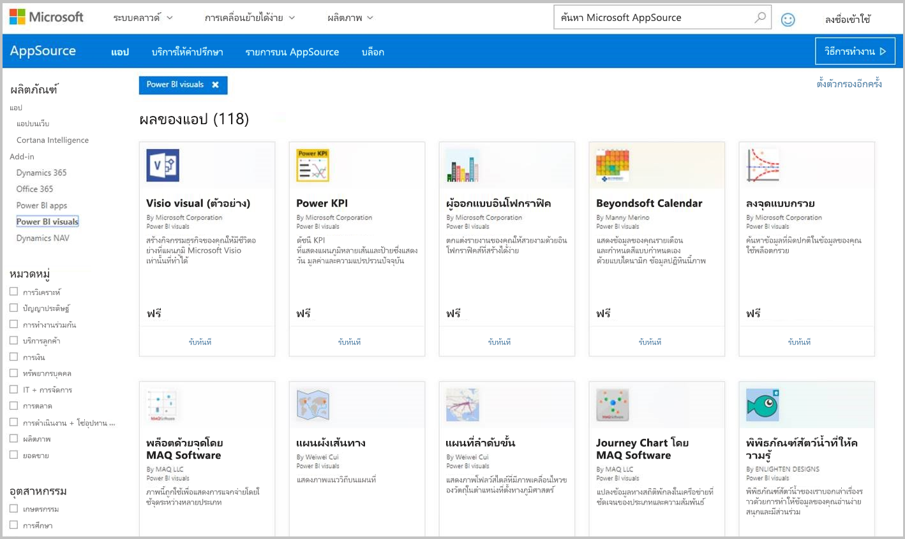
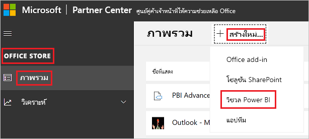

# เผยแพร่วิชวลแบบกำหนดเองไปยัง Partner CanterPublish Power BI visuals to Partner Center

เมื่อคุณสร้างวิชวล Power BI ของคุณเสร็จ คุณอาจต้องการเผยแพร่ลงใน AppSource ให้บุคคลอื่นสามารถค้นหา และใช้งานOnce you have created your Power BI visual, you may want to publish it to the AppSource for others to discover and use. สำหรับข้อมูลเพิ่มเติมเกี่ยวกับการสร้างวิชวล Power BI ให้ดูที่ [การพัฒนาวิชวลการ์ดวงกลมใน Power BI](develop-circle-card.md)For more information about creating a Power BI visual, see [Developing a Power BI circle card visual](develop-circle-card.md).

## AppSource คืออะไรWhat is AppSource?

สามารถหาแอป SaaS และ add-in สำหรับผลิตภัณฑ์และบริการของ Microsoft ได้ใน [AppSource](https://appsource.microsoft.com/marketplace/apps?product=power-bi-visuals)[AppSource](https://appsource.microsoft.com/marketplace/apps?product=power-bi-visuals) is the place to find SaaS apps and add-ins for your Microsoft products and services.

## การเตรียมเพื่อส่งวิชวล Power BI ของคุณPreparing to submit your Power BI visual

ก่อนที่จะส่งวิชวล Power BI ไปยัง AppSource ตรวจสอบให้แน่ใจว่าคุณได้อ่าน[แนวทางการแสดงภาพ Power BI](guidelines-powerbi-visuals.md) และ [ทดสอบวิชวลแบบกำหนดเองของคุณ](./submission-testing.md)Before submitting a Power BI visual to AppSource, make sure you've read the [Power BI visuals guidelines](guidelines-powerbi-visuals.md) and [tested your custom visual](./submission-testing.md).

เมื่อคุณพร้อมที่จะส่งวิชวล Power BI ของคุณให้ตรวจสอบว่าวิชวลของคุณตรงตามข้อกำหนดทั้งหมดที่ระบุไว้ด้านล่างWhen you are ready to submit your Power BI visual, verify that your visual meets all the requirements listed below.

| รายการItem | จำเป็นRequired | คำอธิบายDescription |
| --- | --- | --- |
| แพคเกจ .pbivizPbiviz package |ใช่Yes |แพ็ควิชวล Power BI ของคุณลงในแพคเกจ .Pbiviz ที่ประกอบด้วยเมตาดาต้าที่จำเป็นทั้งหมดPack your Power BI visual into a Pbiviz package containing all the required metadata. ชื่อของวิชวลVisual name ชื่อที่แสดงDisplay name GUIDGUID เวอร์ชันVersion คำอธิบายDescription ชื่อผู้เขียนและอีเมลAuthor name and email |
| ตัวอย่างไฟล์รายงาน .pbixSample .pbix report file |ใช่Yes |เพื่อใช้แสดงผลงานวิชวลของคุณ คุณควรช่วยให้ผู้ใช้สามารถทำความคุ้นเคยการใช้งานวิชวลTo showcase your visual, you should help users to get familiar with the visual. เน้นสิ่งที่วิชวลเพิ่มคุณค่าให้กับผู้ใช้ และให้ตัวอย่างของการใช้งานและ ตัวเลือกจัดรูปแบบHighlight the value that the visual brings to the user and give examples of usage and formatting options. คุณยังสามารถเพิ่มหน้า *"คำแนะนำ"* ตอนท้ายที่ให้เคล็ดลับ เทคนิคการใช้และสิ่งที่ต้องหลีกเลี่ยง เป็นต้นYou can also add a *"hints"* page at the end with some tips and tricks and things to avoid. ไฟล์รายงาน .pbix ตัวอย่างจะต้องทำงานแบบออฟไลน์ โดยไม่ต้องเชื่อมต่อใด ๆ กับภายนอกThe sample .pbix report file must work offline, without any external connections. |
| ไอคอนIcon |ใช่Yes |คุณควรใส่โลโก้ของวิชวลแบบกำหนดเองที่จะปรากฏในหน้าร้านค้าYou should include the custom visual logo that will appear in the store front. รูปแบบสามารถเป็น .png, .jpg, .jpeg หรือ .gifThe format can be .png, .jpg, .jpeg or .gif. จะต้องมีขนาด 300 px (ความกว้าง) x 300 px (ความสูง)It must be exactly 300 px (width) x 300 px (height). **สิ่งสำคัญ!****Important!** โปรดดู[คำแนะนำการเก็บภาพใน Appsource](/office/dev/store/craft-effective-appsource-store-images) อย่างระมัดระวังก่อนที่จะส่งไอคอนPlease review the [AppSource store images guide](/office/dev/store/craft-effective-appsource-store-images) carefully, before submitting the icon. |
| ภาพหน้าจอScreenshots |ใช่Yes |ต้องมีภาพหน้าจอให้อย่างน้อยหนึ่งภาพProvide at least one screenshot. รูปแบบสามารถเป็น .png, .jpg, .jpeg หรือ .gifThe format can be .png, .jpg, .jpeg or .gif. ขนาดต้องตรงกับ1366 px (ความกว้าง) กับ 768 px (ความสูง)The dimensions must be exactly 1366 px (width) by 768 px (height). ขนาดของไฟล์ไม่สามารถมีขนาดใหญ่กว่า1024 kbThe size of the file can't be larger than 1024 kb. เพื่อดึงดูดให้มีคนใช้มากขึ้น เพิ่มข้อความอธิบายลงในภาพหน้าจอเพื่อแสดงความสามารถ และประโยชน์ที่มีให้กับผู้ใช้For greater usage, add text bubbles to articulate the value proposition of key features shown in each screenshot. |
| ลิงก์ดาวน์โหลดสนับสนุนSupport download link |ใช่Yes |ใส่ URL การสนับสนุนสำหรับลูกค้าของคุณProvide a support URL for your customers. ลิงก์นี้ถูกใส่เป็นส่วนหนึ่งของรายการแดชบอร์ดผู้จำหน่ายของคุณ และจะให้ผู้ใช้มองเห็นเมื่อพวกเขาเข้าถึงรายการแสดงผลด้วยภาพของคุณบน AppSourceThis link is entered as part of your Partner Center listing, and is visible to users when they access your visual's listing on AppSource. รูปแบบของ URL ของคุณควรมี https:// หรือ https://The format of your URL should include https:// or https://. |
| ลิงก์ไปยังเอกสารความเป็นส่วนตัวPrivacy document link |ใช่Yes |ใส่ลิงก์ไปยังนโยบายความเป็นส่วนตัวของวิชวลProvide a link to the visual's privacy policy. ลิงก์นี้ถูกใส่เป็นส่วนหนึ่งของรายการแดชบอร์ดผู้จำหน่ายของคุณ และจะให้ผู้ใช้มองเห็นเมื่อพวกเขาเข้าถึงรายการแสดงผลด้วยภาพของคุณบน AppSourceThis link is entered as part of your Partner Center listing, and is visible to users when they access your visual's listing on AppSource. รูปแบบของลิงค์ของคุณควรมี http:// หรือ https://The format of your link should include https:// or https://. |
| ข้อตกลงสิทธิ์การใช้งานสำหรับผู้ใช้ (EULA)End-user license agreement (EULA) |ใช่Yes |คุณต้องระบุไฟล์ EULA สำหรับการแสดงผลด้วยภาพของ Power BI ของคุณYou must provide an EULA file for your Power BI visual. คุณสามารถใช้ [สัญญามาตรฐาน](https://go.microsoft.com/fwlink/?linkid=2041178) [สัญญาวิชวล Power BI](https://visuals.azureedge.net/app-store/Power%20BI%20-%20Default%20Custom%20Visual%20EULA.pdf) หรือ EULA ของคุณเองYou can use the [standard contract](https://go.microsoft.com/fwlink/?linkid=2041178), [Power BI visuals contract](https://visuals.azureedge.net/app-store/Power%20BI%20-%20Default%20Custom%20Visual%20EULA.pdf), or your own EULA. |
| ลิงก์วิดีโอVideo link |ไม่ใช่No |เพื่อเพิ่มความน่าสนใจของวิชวลแบบกำหนดเองของคุณ ต้องมีลิงก์ไปยังวิดีโอเกี่ยวกับวิชวลของคุณTo increase the interest of users for your custom visual, provide a link to a video about your visual. รูปแบบของ URL ของคุณควรมี https:// หรือ https://The format of your URL should include https:// or https://. |
| ที่จัดเก็บ GitHubGitHub repository |ไม่ใช่No |แชร์ลิงก์สาธารณะไปยังที่เก็บ [GitHub](https://www.github.com) กับแหล่งที่มาของข้อมูลวิชวลและตัวอย่างของ Power BI ของคุณShare a public link to a [GitHub](https://www.github.com) repository with sources of your Power BI visual and sample data. ซึ่งช่วยให้นักพัฒนาคนอื่นๆโอกาสในการให้คำติชมและเสนอการปรับปรุงให้กับรหัสของคุณThis allows other developers an opportunity to provide feedback and propose improvements to your code. |

## การรับ XML ของแพคเกจแอปGetting an app package XML

เมื่อต้องการส่งวิชวล Power BI คุณจำเป็นต้องมี XML แพคเกจโปรแกรมประยุกต์จากทีม Power BITo submit a Power BI visual you need an app package XML from the Power BI team. หากต้องการรับแพคเกจ XML ของแอปให้ส่งอีเมลไปยังทีมส่งวิชวล Power BI ([pbivizsubmit@microsoft.com](mailto:pbivizsubmit@microsoft.com))To get the app package XML, send an email to the Power BI visuals submission team ([pbivizsubmit@microsoft.com](mailto:pbivizsubmit@microsoft.com)).

ก่อนที่คุณจะสร้างแพคเกจ **.pbiviz** คุณต้องกรอกข้อมูลต่อไปนี้ในไฟล์ **pbiviz.json:**Before you create the **pbiviz** package, you must fill the following fields in the **pbiviz.json** file:
* คำอธิบายdescription
* supportUrlsupportUrl
* ผู้เขียนauthor
* namename
* อีเมลemail

แนบ **ไฟล์ .pbiviz** และ **ไฟล์ตัวอย่างรายงาน .pbix** ในอีเมลของคุณAttach the **pbiviz file** and the **sample report pbix file** to your email. ทีม Power BI จะตอบกลับพร้อมคำชี้แนะ และไฟล์ XML ของแพคเกจแอปเพื่อการอัปโหลดThe Power BI team will reply back with instructions and an app package XML file to upload. ไฟล์ XML ของแพคเกจแอป นี้จำเป็นตอนส่งวิชวลของคุณผ่านทาง ศูนย์นักพัฒนา OfficeThis XML app package is required in order to submit your visual through the Office developer center.

> [!NOTE]
> เพื่อคุณภาพที่ดีขึ้น และมั่นใจว่ารายงานที่มีอยู่ก่อนแล้วจะไม่มีปัญหา การปรับปรุงวิชวลที่มีเดิม จะใช้เวลาเพิ่มอีกสองสัปดาห์ถึงไปยังสภาพแวดล้อมการทำงานจริง หลังจากผ่านการอนุมัติจากร้านค้าTo improve quality and assure that existing reports are not breaking, updates to existing visuals will take an additional two weeks to reach production environment after approval in the store.

## การส่งไป AppSourceSubmitting to AppSource

หากต้องการส่งวิชวล Power BI ของคุณไปยัง AppSource คุณจำเป็นต้องได้รับแพคเกจแอปจากทีม Power BI จากนั้นส่งไปยังศูนย์คู่ค้าTo submit your Power BI visual to AppSource, you need to get an app package from the Power BI team, and then submit it to Partner Center.

>[!IMPORTANT]
>ถ้าคุณกำลังส่งการแสดงผลด้วยการแสดงผลด้วยภาพอีกครั้ง คุณไม่สามารถเปลี่ยน GUID ได้If you're resubmitting a visual, you cannot change its GUID.

### การรับแพคเกจแอปGetting the app package

คุณต้องส่งอีเมลที่ มีไฟล์ **.pbiviz** และไฟล์ **.pbix** ไปยังทีม Power BI ก่อนที่จะส่งไปที่ AppSourceYou must send an email with the **pbiviz** file and the **pbix** file to the Power BI team before submitting to AppSource. ซึ่งทีม Power BI อัปโหลดไฟล์ดังกล่าวไปยังเซิร์ฟเวอร์ที่แชร์กับสาธารณะThis allows the Power BI team to upload the files to the public share server. มิฉะนั้นร้านค้าจะไม่สามารถดึงไฟล์นั้นได้Otherwise, the store will not be able to retrieve the files. 

ทีมงาน Power BI ต้องตรวจสอบไฟล์ทุกครั้ง ไม่ว่าจะเป็นการส่งวิชวล Power BI ใหม่ ปรับปรุงวิชวล Power BI ที่มีอยู่ และการแก้ไขปัญหาการส่งที่ถูกปฏิเสธThe Power BI team has to check files for new Power BI visual submissions, updates to existing Power BI visuals, and fixes to rejected submissions.

### ส่งไปยัง Partner CenterSubmitting to Partner Center

หากต้องการส่งวิชวล Power BI ของคุณไปยังศูนย์คู่ค้าคุณจะต้องได้รับการลงทะเบียนกับศูนย์คู่ค้าTo submit your Power BI visual to Partner Center, you have to be registered with Partner Center. ถ้าคุณยังไม่ได้ลงทะเบียน [เปิดบัญชีนักพัฒนาในศูนย์คู่ค้า](/office/dev/store/open-a-developer-account)If you're not yet registered, [Open a developer account in Partner Center](/office/dev/store/open-a-developer-account).

>[!NOTE]
>**ผู้เผยแพร่รายบุคคล** สามารถใช้หนึ่งในวิธีการเหล่านี้เพื่อส่งวิชวล Power BI:**Individual publishers** can use one of these methods to submit a Power BI visual:
>* หากคุณมีบัญชีแดชบอร์ดของผู้ขายเดิม คุณสามารถใช้ข้อมูลประจำตัวของบัญชีนี้เพื่อลงชื่อเข้าใช้ศูนย์คู่ค้าได้If you have an old Seller Dashboard account, you can continue using this account's credentials to sign into partner Center.
>* หากคุณไม่มีบัญชีแดชบอร์ดของผู้ขายเดิมและไม่ได้ลงทะเบียนกับศูนย์คู่ค้า คุณจะต้อง [เปิดบัญชีนักพัฒนาในศูนย์คู่ค้า](/office/dev/store/open-a-developer-account) โดยใช้อีเมลที่ทำงานของคุณIf you don't have an old Seller Dashboard account, and are not registered to Partner Center, you'll need to [Open a developer account in Partner Center](/office/dev/store/open-a-developer-account) using your work email.

ทำตามขั้นตอนด้านล่างเพื่อส่งวิชวล Power BI ของคุณไปยังศูนย์คู่ค้าFollow the steps below to submit your Power BI visual to Partner Center. สำหรับข้อมูลเพิ่มเติมเกี่ยวกับกระบวนการส่งให้ดูที่การ [นำทางโซลูชัน Office ของคุณไปยัง AppSource ผ่านศูนย์คู่ค้า](/office/dev/store/use-partner-center-to-submit-to-appsource)For more information about the submission process, see [Submit your Office solution to AppSource via Partner Center](/office/dev/store/use-partner-center-to-submit-to-appsource).

1. ลงชื่อเข้าใช้ใน **Partner Center**Log into **Partner Center**.

2. ในบานหน้าต่างด้านซ้ายเลือก **OFFICE STORE**On the left pane, select **OFFICE STORE**.

3. เลือก **ภาพรวม**Select **Overview**.

4. เลือก **สร้างใหม่** และจากเมนูดรอปดาวน์เลือก **วิชวล Power BI**Select **Create a new** and from the drop-down menu, select **Power BI visual**.

    

5. ใน **สร้างหน้าต่าง Power BI วิชวลใหม่** ใส่ชื่อสำหรับวิชวล Power BI ของคุณและเลือก **สร้าง**In the **Create a new Power BI visual** window, enter a name for your Power BI visual and select **Create**.

6. เลือก **แพคเกจ** และอัปโหลดแพคเกจแอป Power BI วิชวลของคุณSelect **Packages** and upload your Power BI visual XML app package.

7. เลือก **คุณสมบัติ** และใส่ข้อมูลที่จำเป็นSelect **Properties** and provide the required information.

8. ถ้าผลิตภัณฑ์ของคุณจำเป็นต้องมีการซื้อเพิ่มเติมให้เลือก  **การตั้งค่าผลิตภัณฑ์** และตรวจสอบกล่องกาเครื่องหมาย **การซื้อของบริการที่เกี่ยวข้อง**If your product requires additional purchase, select **Product setup** and check the **Associated service purchase** check box.

9. (ไม่บังคับ) ถ้าคุณต้องการ [รับรอง](power-bi-custom-visuals-certified.md) วิชวลของคุณให้เลือกกล่องกาเครื่องหมาย **การตั้งค่าผลิตภัณฑ์** และตรวจสอบ **การรับรองความถูกต้องของ Power BI**(Optional) If you want to [certify](power-bi-custom-visuals-certified.md) your visual, select **Product setup** and check the **Power BI certification** check box.
    >[!TIP]
    >กระบวนการขอใบรับรองThe Power BI อาจใช้เวลาสักระยะThe Power BI certification process might take time. หากคุณกำลังสร้างวิชวล Power BI ใหม่ เราแนะนำให้คุณเผยแพร่วิชวล Power BI ผ่าน Partner Center ก่อนที่คุณจะขอใบรับรอง Power BIIf you're creating a new Power BI visual, we recommend that you publish your Power BI visual via the Partner Center before you request Power BI certification. กระบวนการนี้เพื่อให้แน่ใจว่าการเผยแพร่วิชวลของคุณจะไม่ถูกเลื่อนออกไปThis ensures that the publishing of your visual is not delayed.

10. เลือก **การตั้งค่าผลิตภัณฑ์** และคลิก **ตรวจสอบและเผยแพร่**Select **Product setup** and click **Review and publish**.

## การติดตามสถานะการส่งและการใช้งานTracking submission status and usage

คุณสามารถตรวจดู[นโยบายการตรวจสอบ](/legal/marketplace/certification-policies#1180-power-bi-visuals)ได้You can review the [validation policies](/legal/marketplace/certification-policies#1180-power-bi-visuals).

* หลังจากส่งแล้ว คุณจะสามารถดูสถานะการส่งได้ใน[แดชบอร์ดแอป](https://sellerdashboard.microsoft.com/Application/Summary/)After submission, you will be able to view the submission status in the [app dashboard](https://sellerdashboard.microsoft.com/Application/Summary/).

* หากต้องการรู้เมื่อวิชวล Power BI ของคุณพร้อมสำหรับการดาวน์โหลดจาก AppSource ให้ตรวจสอบ[ไทม์ไลน์ในการเผยแพร่](power-bi-custom-visuals-certified.md#publication-timeline)วิชวล Power BITo understand when your Power BI visual will be available to download from AppSource, review the Power BI visuals [publication timeline](power-bi-custom-visuals-certified.md#publication-timeline).

## การรับรองวิชวลของคุณCertify your visual

เมื่อคุณได้สร้างวิชวลของคุณแล้ว หากคุณต้องการ คุณสามารถเลือกที่จะนำวิชวลของคุณไปขอ[การรับรอง](power-bi-custom-visuals-certified.md)ได้Once your visual is created, if you want you can get your visual [certified](power-bi-custom-visuals-certified.md).

## ขั้นตอนถัดไปNext steps

* [การพัฒนาวิชวลการ์ดวงกลมใน Power BIDeveloping a Power BI circle card visual](develop-circle-card.md)

* [จัดรูปแบบข้อมูลใน Power BIVisualizations in Power BI](../../visuals/power-bi-report-visualizations.md)  

* [วิชวลใน Power BIVisuals in Power BI](power-bi-custom-visuals.md)  

* [การรับรองส่วนการจัดแสดง Power BIGetting a Power BI visual certified](power-bi-custom-visuals-certified.md)

* มีคำถามเพิ่มเติมหรือไม่More questions? [ลองถามชุมชน Power BITry asking the Power BI Community](https://community.powerbi.com/)