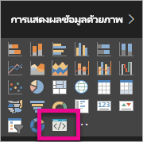

# แก้ปัญหาวิชวล Power BITroubleshoot Power BI visuals

## แก้Debug

**ไม่พบคำสั่ง Pbiviz (หรือข้อผิดพลาดที่คล้ายกัน)****Pbiviz command not found (or similar errors)**

เมื่อคุณเรียกใช้ `pbiviz` ในบรรทัดคำสั่งของเทอร์มินัล คุณควรเห็นหน้าจอความช่วยเหลือWhen you run `pbiviz` in your terminal's command line, you should see the help screen. ถ้าไม่มี แสดงว่าคำสั่งนั้นไม่ได้ถูกติดตั้งอย่างถูกต้องIf not, then it is not installed correctly. ตรวจสอบให้แน่ใจว่า คุณติดตั้ง NodeJS เวอร์ชันขั้นต่ำ 4.0Make sure you have at least the 4.0 version of NodeJS installed.

**ไม่พบวิชวลดีบักในแท็บการแสดงภาพ****Can't find the debug visual in the Visualizations tab**

ดีบักวิชวล มีลักษณะเหมือนไอคอนรูปพร้อมท์ภายในแท็บ **แสดงภาพ**The debug visual looks like a prompt icon within the **Visualizations** tab.

ถ้าคุณไม่เห็นไอคอนนั้น ตรวจสอบให้แน่ใจว่าคุณได้เปิดใช้งานภายในการตั้งค่า Power BIIf you don't see it, make sure you have enabled it within the Power BI settings.

> [!NOTE]
> ดีบักวิชวล ในขณะใช้งานได้เฉพาะ ในบริการของ Power BI และยังไม่รองรับโดย Power BI Desktop หรือแอปสำหรับอุปกรณ์เคลื่อนที่The debug visual is currently only available in the Power BI service and not in Power BI Desktop or the mobile app. วิชวลที่แพคเกจแล้วจะยังคงทำงานได้ทุก ๆ ที่The packaged visual will still work everywhere.

**ไม่สามารถติดต่อเซิร์ฟเวอร์วิชวล****Can't contact visual server**

เรียกใช้เซิร์ฟเวอร์วิชวลด้วยคำสั่ง `pbiviz start` ในบรรทัดคำสั่งของเทอร์มินัล จากรากของโครงการวิชวลของคุณRun the visual server with the command `pbiviz start` in your terminal's command line from the root of your visual project. ถ้าเซิร์ฟเวอร์ไม่ทำงาน เป็นไปได้ว่าไม่ได้ติดตั้งใบรับรอง SSL ของคุณอย่างถูกต้องIf the server is not running, it is likely that your SSL certificates weren't installed correctly.

โปรดติดต่อทีมฝ่ายสนับสนุนด้านวิชวล Power BI (pbicvsupport@microsoft.com) เพื่อสอบถามข้อสงสัย แสดงความเห็น หรือแจ้งประเด็นใด ๆ ที่คุณมีFeel free to contact the Power BI visuals support team (pbicvsupport@microsoft.com) with any questions, comments, or issues you have.

## ขั้นตอนถัดไปNext steps

สำหรับข้อมูลเพิ่มเติม โปรดเยี่ยมชม[คำถามที่ถามบ่อยเกี่ยวกับการแสดงผล Power BI](power-bi-custom-visuals-faq.md#organizational-power-bi-visuals)For more information, visit [Frequently asked questions about Power BI visuals](power-bi-custom-visuals-faq.md#organizational-power-bi-visuals).