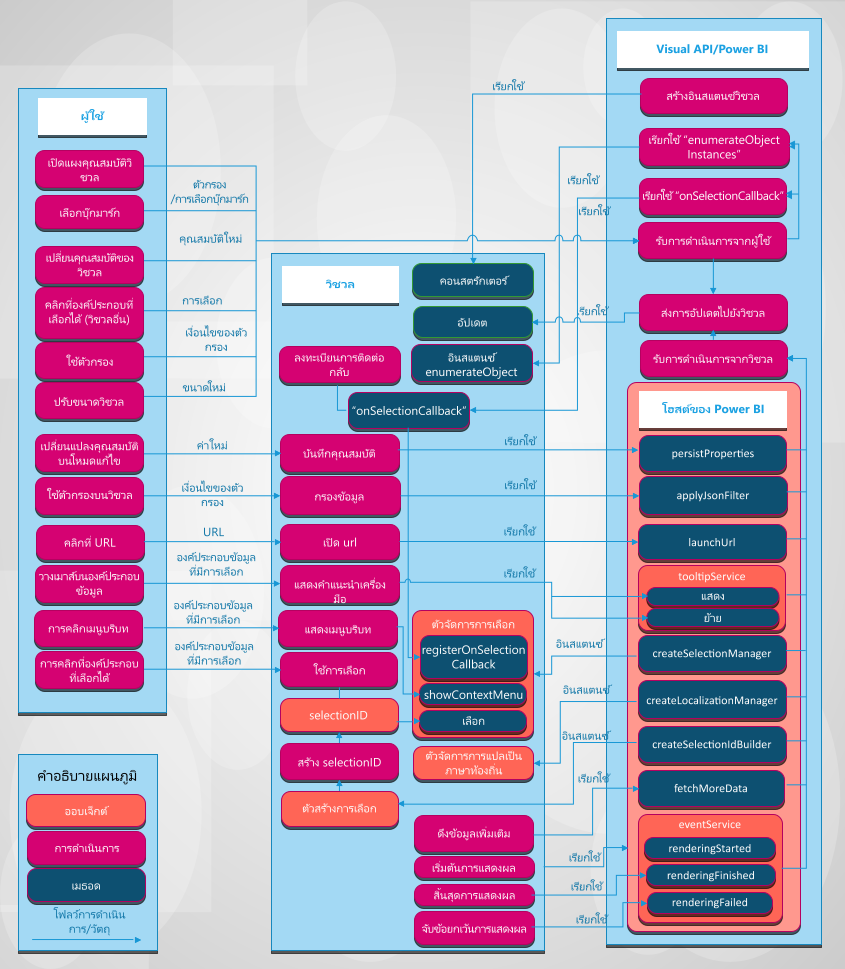

# การรวมระบบวิชวลของ Power BIPower BI visuals system integration

บทความนี้ได้อธิบายวิธีการแสดงผลด้วยภาพรวมกับ Power BI และวิธีที่ผู้ใช้สามารถโต้ตอบกับวิชวลใน Power BI ได้The article describes how visuals integrate with Power BI and how a user can interact with a visual in Power BI. 

รูปภาพต่อไปนี้แสดงการดำเนินการทั่วไปโดยใช้วิชวลที่ผู้ใช้ใช้ เช่น การเลือกที่คั่นหน้าและที่ดำเนินการใน Power BIThe following figure depicts how common visual-based actions that a user takes, like selecting a bookmark, are processed in Power BI.

## วิชวลรับการอัปเดตจาก Power BIVisuals get updates from Power BI

วิชวลเรียกใช้วิธีการ `update` เพื่อได้รับการอัปเดตจาก Power BIA visual calls an `update` method to get updates from Power BI. วิธีการ `update` จะประกอบด้วยตรรกะหลักของวิชวลและเป็นความรับผิดชอบในการแสดงแผนภูมิหรือข้อมูลที่เป็นภาพThe `update` method usually contains the main logic of the visual and is responsible for rendering a chart or visualizing data.

การอัปเดตถูกกระตุ้นเมื่อวิชวลเรียกใช้วิธีการ `update`Updates are triggered when the visual calls the `update` method.

## การดำเนินการและอัปเดตรูปแบบAction and update patterns

การดำเนินการและการปรับปรุงที่ตามมาในวิชวล Power BI จะเกิดขึ้นในหนึ่งในสามรูปแบบต่อไปนี้:Actions and subsequent updates in Power BI visuals occur in one of these three patterns:

* ผู้ใช้โต้ตอบกับวิชวลผ่าน Power BIUser interacts with a visual through Power BI.
* ผู้ใช้โต้ตอบกับวิชวลโดยตรงUser interacts with the visual directly.
* วิชวลโต้ตอบกับ Power BIVisual interacts with Power BI.

### ผู้ใช้โต้ตอบกับวิชวลผ่าน Power BIUser interacts with a visual through Power BI

* ผู้ใช้เปิดแผงคุณสมบัติวิชวลA user opens the visual's properties panel.

    เมื่อผู้ใช้เปิดแผงคุณสมบัติของวิชวล Power BI จะได้รับการสนับสนุนวัตถุและคุณสมบัติจาก *ความสามารถไฟล์ .json* ของวิชวลWhen a user opens the visual's properties panel, Power BI fetches supported objects and properties from the visual's *capabilities.json* file. ในการรับค่าที่แท้จริงของคุณสมบัติ Power BI จะเรียกวิธีการ `enumerateObjectInstances` ของวิชวลTo receive actual values of properties, Power BI calls the `enumerateObjectInstances` method of the visual. วิชวลส่งกลับค่าที่แท้จริงของคุณสมบัติThe visual returns actual values of properties.

    สำหรับข้อมูลเพิ่มเติม ดูที่ [ความสามารถและคุณสมบัติของวิชวล Power BI](capabilities.md)For more information, see [Capabilities and properties of Power BI visuals](capabilities.md).

* ผู้ใช้ [ เปลี่ยนคุณสมบัติของวิชวล](../../visuals/power-bi-visualization-customize-title-background-and-legend.md) ในแผงรูปแบบA user [changes a property of the visual](../../visuals/power-bi-visualization-customize-title-background-and-legend.md) in the format panel.

    เมื่อผู้ใช้เปลี่ยนค่าของคุณสมบัติในแผงรูปแบบ Power BI จะเรียกใช้วิธีการ `update` ของวิชวลWhen a user changes the value of a property in the format panel, Power BI calls the `update` method of the visual. Power BI ผ่านในวัตถุ `options` ใหม่ไปยังวิธีการ `update`Power BI passes in the new `options` object to the `update` method. วัตถุประกอบด้วยค่าใหม่The objects contain the new values.

    สำหรับข้อมูลเพิ่มเติม โปรดดูที่ [ออบเจ็กต์และคุณสมบัติของวิชวล Power BI](objects-properties.md)For more information, see [Objects and properties of Power BI visuals](objects-properties.md).

* ผู้ใช้ปรับขนาดวิชวลA user resizes the visual.

    เมื่อผู้ใช้เปลี่ยนขนาดของวิชวล Power BI เรียกใช้วิธีการ `update` ด้วยวัตถุ `options` ใหม่When a user changes the size of a visual, Power BI calls the `update` method with the new `options` object. วัตถุ `options` มีวัตถุ `viewport` ที่ซ้อนกันที่ประกอบด้วยความกว้างและความสูงใหม่ของวิชวลThe `options` objects have nested `viewport` objects that contain the new width and height of the visual.

* ผู้ใช้จะใช้ตัวกรองรายงาน หน้า หรือระดับของวิชวลA user applies a filter at the report, page, or visual level.

    ข้อมูลตัวกรอง Power BI ที่ยึดตามเงื่อนไขตัวกรองPower BI filters data based on filter conditions. Power BI เรียกใช้วิธีการ `update` ของวิชวลเพื่ออัปเดตวิชวลด้วยข้อมูลใหม่Power BI calls the `update` method of the visual to update the visual with new data.

    วิชวลได้รับการอัปเดตใหม่ของวัตถุ `options` เมื่อมีข้อมูลใหม่ในหนึ่งวัตถุที่มีการซ้อนกันThe visual gets a new update of the `options` objects when there's new data in one of the nested objects. การอัปเดตเกิดขึ้นอยู่กับการกำหนดค่าการวางแผนการดูข้อมูลของวิชวลHow the update occurs depends on the data view mapping configuration of the visual.

    สำหรับข้อมูลเพิ่มเติม โปรดดูที่ [ทำความเข้าใจเกี่ยวกับการแมปมุมมองข้อมูลในวิชวล Power BI](dataview-mappings.md)For more information, see [Understand data view mapping in Power BI visuals](dataview-mappings.md).

* ผู้ใช้เลือกจุดข้อมูลในวิชวลอื่นในรายงานA user selects a data point in another visual in the report.

    เมื่อผู้ใช้เลือกจุดข้อมูลในวิชวลอื่นในรายงาน ตัวกรองหรือ Power BI หรือไฮไลต์จุดข้อมูลที่เลือกและเรียกวิธีการ `update` ของวิชวลWhen a user selects a data point in another visual in the report, Power BI filters or highlights the selected data points and calls the visual's `update` method. วิชวลได้รับข้อมูลที่ถูกกรองใหม่หรือได้รับข้อมูลเดียวกันกับแถวลำดับของไฮไลต์The visual gets new filtered data, or it gets the same data with an array of highlights.

    สำหรับข้อมูลเพิ่มเติม โปรดดูหัวข้อ [การเน้นจุดข้อมูลในวิชวล Power BI](highlight.md)For more information, see [Highlight data points in Power BI visuals](highlight.md).

* ผู้ใช้เลือกที่คั่นหน้าบนแผงที่คั่นหน้าของรายงานA user selects a bookmark in the bookmarks panel of the report.

    เมื่อผู้ใช้เลือกที่คั่นหน้าในแผงที่คั่นหน้าของรายงาน หนึ่งในสองการดำเนินการสามารถเกิดขึ้นได้:When a user selects a bookmark in the report's bookmarks panel, one of two actions can occur:

    * Power BI เรียกใช้ฟังก์ชันที่มีการส่งผ่านและลงทะเบียนโดยวิธีการ `registerOnSelectionCallback`Power BI calls a function that's passed and registered by the `registerOnSelectionCallback` method. ฟังก์ชันการเรียกกลับจะรับแถวลำดับของการเลือกสำหรับที่คั่นหน้าที่เหมือนกันThe callback function gets arrays of selections for the corresponding bookmark.

    * Power BI เรียกใช้วิธีการ `update` ด้วยวัตถุ `filter` ที่เหมือนกันกันภายในวัตถุ `options`Power BI calls the `update` method with a corresponding `filter` object inside the `options` object.

    ในกรณีใดที่วิชวลจะต้องเปลี่ยนสถานะตามการเลือกที่ได้รับหรือวัตถุ `filter`In either case, the visual must change its state according to the received selections or `filter` object.

    สำหรับข้อมูลเพิ่มเติมเกี่ยวกับที่คั่นหน้าและตัวกรอง ดู [Visual Filters API ในการแสดงผลด้วยภาพของ Power BI](filter-api.md)For more information about bookmarks and filters, see [Visual Filters API in Power BI visuals](filter-api.md).

### ผู้ใช้โต้ตอบกับวิชวลโดยตรงUser interacts with the visual directly

* ผู้ใช้จะอยู่เหนือการเลื่อนเมาส์บนองค์ประกอบข้อมูลA user hovers the mouse over a data element.

    วิชวลสามารถแสดงข้อมูลเพิ่มเติมเกี่ยวกับจุดข้อมูลผ่าน Power BI Tooltips APIA visual can display more information about a data point through the Power BI Tooltips API. เมื่อผู้ใช้อยู่เหนือการเลื่อนเมาส์บนองค์ประกอบวิชวล วิชวลสามารถจัดการเหตุการณ์และแสดงข้อมูลเกี่ยวกับองค์ประกอบคำแนะนำเครื่องมือที่เกี่ยวข้องWhen a user hovers the mouse over a visual element, the visual can handle the event and display data about the associated tooltip element. วิชวลสามารถแสดงคำแนะนำเครื่องมือมาตรฐานหรือคำแนะนำเครื่องมือของหน้ารายงานThe visual can display either a standard tooltip or a report page tooltip.

    สำหรับข้อมูลเพิ่มเติม ดู [คำแนะนำเครื่องมือในวิชวล Power BI](add-tooltips.md)For more information, see [Tooltips in Power BI visuals](add-tooltips.md).

* ผู้ใช้เปลี่ยนคุณสมบัติของวิชวลA user changes visual properties. (ตัวอย่างเช่น ผู้ใช้ขยายแผนผังต้นไม้และวิชวลที่บันทึกในคุณสมบัติวิชวล)(For example, a user expands a tree and the visual saves state in the visual properties.)

    วิชวลสามารถบันทึกค่าคุณสมบัติผ่าน Power BI APIA visual can save properties values through the Power BI API. ตัวอย่าง เมื่อผู้ใช้โต้ตอบกับวิชวลและวิชวลต้องการบันทึกหรืออัปเดตค่าคุณสมบัติ วิชวลสามารถเรียกใช้วิธีการ `presistProperties`For example, when a user interacts with the visual and the visual needs to save or update properties values, the visual can call the `presistProperties` method.

* ผู้ใช้เลือก URLA user selects a URL.

    ตามค่าเริ่มต้น วิชวลไม่สามารถเปิด URL ได้โดยตรงBy default, a visual can't open a URL directly. แทนที่จะเปิด URL ในแท็บใหม่ วิชวลสามารถเรียกใช้วิธีการ `launchUrl` และส่งผ่าน URL เป็นพารามิเตอร์Instead, to open a URL in a new tab, the visual can call the `launchUrl` method and pass the URL as a parameter.

    สำหรับข้อมูลเพิ่มเติม ดู [สร้างการเปิดใช้ URL](launch-url.md)For more information, see [Create a launch URL](launch-url.md).

* ผู้ใช้ใช้ตัวกรองผ่านวิชวลA user applies a filter through the visual.

    วิชวลสามารถเรียกใช้วิธีการ `applyJsonFilter` และส่งผ่านเงื่อนไขเพื่อกรองข้อมูลในวิชวลอื่นๆA visual can call the `applyJsonFilter` method and pass conditions to filter for data in other visuals. ชนิดตัวกรองที่หลากหลายสามารถใช้งานได้ รวมถึงตัวกรองพื้นฐาน ขั้นสูงและ TupleSeveral types of filters are available, including Basic, Advanced, and Tuple filters.

    สำหรับข้อมูลเพิ่มเติม ดู [API ตัวกรองวิชวลในวิชวล Power BI](filter-api.md)For more information, see [Visual Filters API in Power BI visuals](filter-api.md).

* ผู้ใช้เลือกองค์ประกอบในวิชวลA user selects elements in the visual.

    สำหรับข้อมูลเพิ่มเติมเกี่ยวกับการเลือกในวิชวล Power BI ดู [เพิ่มการโต้ตอบได้โดยใช้การเลือกวิชวลของ Power BI](selection-api.md)For more information about selections in a Power BI visual, see [Add interactivity by using Power BI visual selections](selection-api.md).

### วิชวลโต้ตอบกับ Power BIVisual interacts with Power BI

* วิชวลร้องขอข้อมูลเพิ่มเติมจาก Power BIA visual requests more data from Power BI.

    วิชวลสามารถประมวลผลส่วนข้อมูลตามส่วนA visual processes data part by part. วิธีการ API `fetchMoreData` ร้องขอส่วนของข้อมูลต่อไปในชุดข้อมูลThe `fetchMoreData` API method requests the next fragment of data in the dataset.

    สำหรับข้อมูลเพิ่มเติม ดู [รับข้อมูลเพิ่มขึ้นจาก Power BI](fetch-more-data.md)For more information, see [Fetch more data from Power BI](fetch-more-data.md).

* ตัวกระตุ้นบริการของเหตุการณ์The event service triggers.

    Power BI สามารถส่งออกรายงานไปยัง PDF หรือส่งรายงานโดยอีเมล (ใช้กับเพียงวิชวลที่ได้รับการรับรองแล้ว)Power BI can export a report to PDF or send a report by e-mail (applies only to certified visuals). ในการแจ้งเตือน Power BI ที่แสดงได้สิ้นสุดและวิชวลที่พร้อมสำหรับจับภาพเป็น PDF หรืออีเมล์ วิชวลสามารถเรียกใช้การแสดงเหตุการณ์ APITo notify Power BI that rendering is finished and that the visual is ready to be captured as PDF or e-mail, the visual should call the Rendering Events API.

    สำหรับข้อมูลเพิ่มเติม ดู [ส่งออกรายงานจาก Power BI ไปยัง PDF](../../consumer/end-user-pdf.md)For more information, see [Export reports from Power BI to PDF](../../consumer/end-user-pdf.md).

    ในการเรียนรู้เกี่ยวกับการบริการเหตุการณ์ ดู [แสดงเหตุการณ์ในวิชวล](event-service.md)To learn about the event service, see [Render events in Power BI visuals](event-service.md).

## ขั้นตอนถัดไปNext steps

สนใจในการสร้างการแสดงด้วยภาพและเพิ่มสิ่งเหล่านั้นไปยัง Microsoft AppSource หรือไม่Interested in creating visualizations and adding them to Microsoft AppSource? ดูบทความเหล่านี้:See these articles:

* [การพัฒนาวิชวลการ์ดวงกลมใน Power BIDeveloping a Power BI circle card visual](./develop-circle-card.md)
* [เผยแพร่วิชวล Power BI ให้กับ Partner CenterPublish Power BI visuals to Partner Center](office-store.md)
