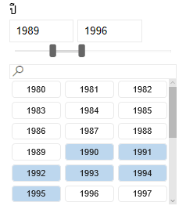
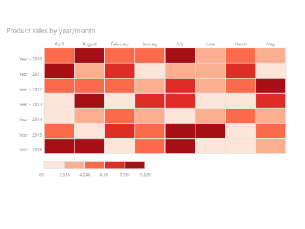
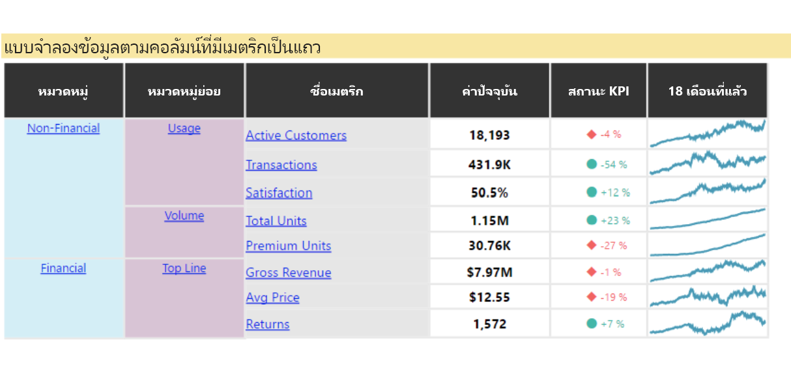
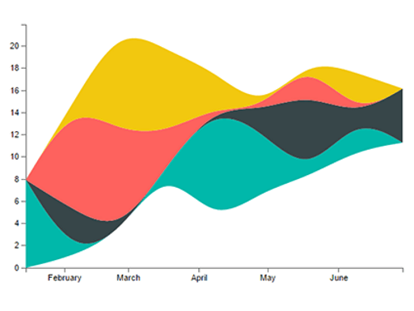
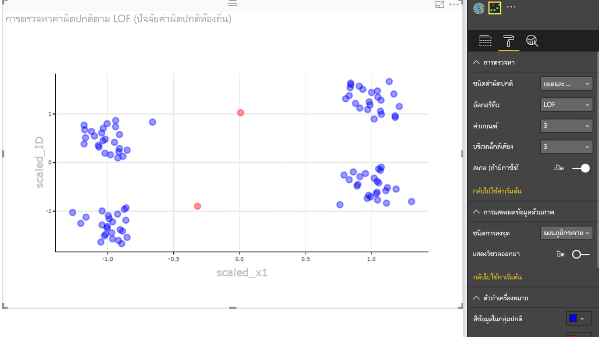

# ตัวอย่างสำหรับวิชวล Power BISamples of Power BI visuals

คุณสามารถดาวน์โหลด ใช้ และปรับเปลี่ยนวิชวล Power BI เหล่านี้ได้จาก GitHubYou can download, use, and modify these Power BI visuals from GitHub. ตัวอย่างเหล่านี้แสดงวิธีการจัดการสถานการณ์ทั่วไปเมื่อพัฒนาด้วย Power BIThese samples illustrate how to handle common situations when developing with Power BI.

## ตัวแบ่งส่วนข้อมูลSlicers

ตัวแบ่งส่วนข้อมูลจะจำกัดส่วนของข้อมูลที่แสดงอยู่ในการแสดงภาพอื่นๆ ในรายงานA slicer narrows the portion of data shown in other visualizations in a report. ตัวแบ่งส่วนข้อมูลเป็นหนึ่งในหลายวิธีในการกรองข้อมูลใน Power BISlicers are one of several ways to filter data in Power BI.

|   |  | |
| ------------- | ------------- | -------------|
| [Chiclet SlicerChiclet Slicer](https://github.com/Microsoft/powerbi-visuals-chicletslicer/)   แสดงรูปภาพหรือปุ่มข้อความที่ทำหน้าที่เป็นตัวกรองกราฟิกในพื้นที่บนวิชวลอื่น ๆDisplay image or text buttons that act as an in-canvas filter on other visuals | [Timeline SlicerTimeline slicer](https://github.com/Microsoft/powerbi-visuals-timeline/)  ตัวเลือกช่วงวันที่แบบกราฟิกที่กรองตามวันที่Graphical date range selector that filters by date | [ตัวอย่างตัวแบ่งส่วนข้อมูลSlicer sample](https://github.com/Microsoft/powerbi-visuals-sampleslicer/)  อธิบายการใช้ API การกรองขั้นสูงDemonstrates the use of the Advanced Filtering API

## แผนภูมิCharts

รับแรงบันดาลใจจากแกลเลอรีของเรา ที่ประกอบด้วยแผนภูมิแท่ง แผนภูมิวงกลม  Word Cloud และอื่นๆBe inspired with our gallery, including bar charts, pie charts, Word Cloud, and others.

|   |  | |
| ------------- | ------------- | -------------|
| [Aster PlotAster Plot](https://github.com/Microsoft/powerbi-visuals-asterplot/)   แนวทางใหม่สำหรับแผนภูมิโดนัทมาตรฐาน ที่ใช้ค่าที่สองเพื่อลบมุมA twist on a standard donut chart that uses a second value to drive sweep angle | [แผนภูมิหัวข้อย่อยBullet chart ](https://github.com/Microsoft/powerbi-visuals-bulletchart/)  แผนภูมิแท่งซึ่งมีองค์ประกอบภาพพิเศษที่ให้บริบท อันเป็นประโยชน์สำหรับการติดตามเป้าหมายA bar chart with extra visual elements that provide context useful for tracking goals | [ChordChord](https://github.com/Microsoft/powerbi-visuals-chord/)  วิธีการทางกราฟิกที่แสดงความสัมพันธ์ของข้อมูลในเมทริกซ์A graphical method that displays the relationships between data in a matrix
|  | |  
| [การพล็อตด้วยจุดDot plot](https://github.com/Microsoft/powerbi-visuals-dotplot/)  แสดงการกระจายของความถี่ในรูปแบบที่ดูดีShows the distribution of frequencies in a great looking way | [Dual KPIDual KPI](https://github.com/Microsoft/powerbi-visuals-dualkpi/)  แสดงภาพหน่วยวัดสองรายการในช่วงเวลา แสดงแนวโน้มของรายการดังกล่าวบนเส้นเวลาร่วมกันได้อย่างมีประสิทธิภาพEfficiently visualizes two measures over time, showing their trend on a joint timeline | [Enhanced ScatterEnhanced Scatter](https://github.com/Microsoft/powerbi-visuals-enhancedscatter/)  การปรับปรุงของแผนภูมิกระจายที่มีอยู่Improvements on the existing scatter chart
| | | 
| [Force GraphForce Graph](https://github.com/Microsoft/powerbi-visuals-forcegraph/)  บังคับเค้าโครงไดอะแกรมด้วยเส้นโค้ง ซึ่งประโยชน์ในการแสดงการเชื่อมต่อระหว่างเอนทิตีForce layout diagram with curved path, which is useful to show connections between entities | [GanttGantt](https://github.com/Microsoft/powerbi-visuals-gantt/)  แผนภูมิแท่งที่แสดงเส้นเวลาโครงการหรือกำหนดการพร้อมทรัพยากรA bar chart that illustrates a project timeline or schedule with resources | [Table HeatmapTable Heatmap](https://github.com/Microsoft/powerbi-visuals-heatmap/)  เปรียบเทียบข้อมูลได้อย่างง่ายดายและคล่องตัวโดยใช้สีในตารางCompare data easily and intuitively using colors in a table
|  |  |  
| [Histogram chartHistogram chart](https://github.com/Microsoft/powerbi-visuals-histogram/)  แสดงภาพการกระจายข้อมูลในช่วงเวลาต่อเนื่องหรือบางช่วงเวลาVisualizes the distribution of data over a continuous interval or certain time period | [LineDot chartLineDot chart](https://github.com/Microsoft/powerbi-visuals-linedotchart/)  แผนภูมิเส้นแบบเคลื่อนไหวที่มีจุดเคลื่อนไหว ซึ่งจะดึงดูดให้ผู้ชมสนใจข้อมูลAn animated line chart with animated dots that engage an audience with data | [Mekko chartMekko chart](https://github.com/Microsoft/powerbi-visuals-mekkochart/)  การผสมผสานของแผนภูมิคอลัมน์แบบเรียงซ้อน 100% และแผนภูมิแท่งแบบเรียงซ้อน 100% รวมอยู่ในมุมมองเดียวA mix of 100% stacked column chart and 100% stacked bar chart combined into one view
|  width="200">width="200"> |  width="200">width="200"> |  width="200">width="200"> 
| [หลาย KPIMulti KPI](https://github.com/microsoft/PowerBI-visuals-MultiKPI/)   การแสดงภาพหลาย KPI อันทรงพลังด้วย KPI หลักพร้อมกับกราฟ Sparklines ที่มีข้อมูลที่สนับสนุนหลายรายการA powerful Multi KPI visualization with a key KPI along with multiple sparklines of supporting data | [Power KPIPower KPI](https://github.com/microsoft/PowerBI-visuals-PowerKPI/)  ตัวบ่งชี้ KPI อันทรงพลัง ด้วยแผนภูมิหลายเส้นและป้ายชื่อสำหรับวันที่  มูลค่า และความแปรปรวนปัจจุบันA powerful KPI Indicator with multi-line chart and labels for current date, value, and variances | [Power KPI MatrixPower KPI Matrix](https://github.com/microsoft/PowerBI-visuals-PowerKPIMatrix/)  ตรวจสอบดัชนีชี้วัดที่สมดุลและจำนวนเมตริกและ KPI ที่ไม่ จำกัด ในรายการขนาดกะทัดรัดและอ่านง่ายMonitor balanced scorecards and unlimited number of metrics and KPIs in a compact, easy to read list
| |  |  
| [Pulse chartPulse chart](https://github.com/Microsoft/powerbi-visuals-pulsechart/)  แผนภูมิเส้นนี้มีซึ่งมีคำอธิบายประกอบของเหตุการณ์สำคัญ เหมาะสำหรับการบอกเล่าเรื่องราวด้วยข้อมูลThis line chart annotated with key events is perfect for telling stories with data| [Radar chartRadar chart](https://github.com/Microsoft/powerbi-visuals-radarchart/)  นำเสนอหลายหน่วยวัดที่ลงจุดบนแกนบอกประเภท ซึ่งมีประโยชน์ในการเปรียบเทียบคุณลักษณะPresents multiple measures plotted over a categorical axis, which is useful to compare attributes | [Sankey ChartSankey chart](https://github.com/Microsoft/powerbi-visuals-sankey/)  แผนภาพกระแสข้อมูลที่ความกว้างของชุดข้อมูลเป็นสัดส่วนกับปริมาณของกระแสข้อมูลFlow diagram where the width of the series is proportional to the quantity of the flow
|  | | 
| [Stream graphStream graph](https://github.com/Microsoft/powerbi-visuals-streamgraph/)  แผนภูมิพื้นที่แบบเรียงซ้อนที่มีการประมาณค่าในช่วงอย่างราบรื่น ซึ่งมักจะใช้ในการแสดงค่าในช่วงเวลาหนึ่งA stacked area chart with smooth interpolation, which is often used to display values over time | [Sunburst chartSunburst chart](https://github.com/Microsoft/powerbi-visuals-sunburst/)  แผนภูมิโดนัทหลายระดับสำหรับการแสดงภาพข้อมูลตามลำดับชั้นMultilevel donut chart for visualizing hierarchical data| [Tornado chartTornado chart](https://github.com/Microsoft/powerbi-visuals-tornado/)  เปรียบเทียบความสำคัญเชิงสัมพัทธ์ของตัวแปรระหว่างสองกลุ่มCompare the relative importance of variables between two groups
 | 
 | [Word CloudWord Cloud](https://github.com/Microsoft/powerbi-visuals-wordcloud/)  สร้างวิชวลสนุกสนานจากข้อความในข้อมูลของคุณที่ใช้บ่อยCreate a fun visual from frequent text in your data

## WebGLWebGL

WebGL อนุญาตให้เนื้อหาเว็บใช้ API ที่ยึดตาม OpenGL ES 2.0 เพื่อทำการแสดงภาพแบบ 2 มิติ และ 3 มิติ ในพื้นที่ทำงาน HTMLWebGL lets web content use an API based on OpenGL ES 2.0 to do 2D and 3D rendering in an HTML canvas.

| |
| ------------- |
| [Globe MapGlobe Map](https://github.com/Microsoft/powerbi-visuals-globemap/)  ลงจุดตำแหน่งที่ตั้งลงบนแผนที่ 3 มิติแบบโต้ตอบPlot locations on an interactive 3D map

## วิชวล RR visuals

ตัวอย่างเหล่านี้สาธิตวิธีการใช้งานการวิเคราะห์และการแสดงผลด้วยภาพของวิชวล R และสคริปต์ RThese samples demonstrate how to harness the analytic and visual power of R visuals and R scripts.

| | | |
|------------- |------------- |------------- |------------- |
| [กฎความสัมพันธ์Association rules](https://github.com/Microsoft/powerbi-visuals-assorules/)  แสดงความสัมพันธ์ระหว่างข้อมูลที่ดูไม่เกี่ยวข้องกันโดยการใช้คำสั่ง if-thenUncover relationships between seemingly unrelated data using if-then statements | [การทำคลัสเตอร์Clustering](https://github.com/Microsoft/powerbi-visuals-clustering-kmeans/)  ค้นหากลุ่มที่คล้ายคลึงกันในข้อมูลของคุณโดยใช้อัลกอริทึม k-meansFind similarity groups in your data using k-means algorithm | [การทำคลัสเตอร์กับค่าผิดปกติClustering with outliers](https://github.com/microsoft/PowerBI-visuals-dbscan/)  ค้นหากลุ่มที่คล้ายคลึงกันและค่าผิดปกติในข้อมูลของคุณFind similarity groups and outliers in your data
|  |  |  
| [การลงจุดค่าสหสัมพันธ์Correlation plot](https://github.com/Microsoft/powerbi-visuals-corrplot/)  เน้นตัวแปรที่สัมพันธ์กันมากที่สุดในตารางข้อมูลHighlight the most correlated variables in a data table | [แผนผังต้นไม้การตัดสินใจDecision tree chart](https://github.com/Microsoft/powerbi-visuals-decision-tree/)  แผนผังรูปต้นไม้ที่เป็นแบบแผนสำหรับกำหนดความน่าจะเป็นทางสถิติโดยใช้การแบ่งพาร์ติชันแบบเรียกซ้ำSchematic tree-shaped diagram for determining statistical probability using recursive partitioning | [การคาดการณ์ TBATSForecasting TBATS](https://github.com/Microsoft/powerbi-visuals-forcasting-tbats/)  การพยากรณ์ชุดข้อมูลเวลาสำหรับชุดข้อมูลที่มีหลาย seasonality โดยใช้แบบจำลอง TBATSTime-series forecasting for series that have multiple seasonalities using the TBATS model
|  |  |  
| [การคาดการณ์ด้วย ARIMAForecasting with ARIMA](https://github.com/Microsoft/powerbi-visuals-forcastingarima/)  ทำนายค่าในอนาคตโดยยึดตามข้อมูลในอดีตโดยใช้ Autoregressive Integrated Moving Avg (ARIMA)Predict future values based on historical data using Autoregressive Integrated Moving Avg (ARIMA) | [กราฟกรวยคว่ำFunnel plot](https://github.com/Microsoft/powerbi-visuals-funnel/)  ค้นหาค่าผิดปกติในข้อมูลของคุณโดยใช้กราฟกรวยคว่ำFind outliers in your data using a funnel plot | [การตรวจจับค่าผิดปกติOutliers detection](https://github.com/Microsoft/powerbi-visuals-outliers-det/)  ค้นหาค่าผิดปกติในข้อมูลของคุณโดยใช้วิธีการและการพล็อตกราฟที่เหมาะสมที่สุดFind outliers in your data using the most appropriate method and plot
|  |  | 
| [Spline chartSpline chart](https://github.com/Microsoft/powerbi-visuals-spline/)  แสดงภาพและทำความเข้าใจข้อมูลรบกวนVisualize and understand noisy data | [แผนภูมิ Time series decompositionTime series decomposition chart](https://github.com/Microsoft/powerbi-visuals-timeseriesdecomposition/)  ทำความเข้าใจคอมโพเนนต์ของชุดข้อมูลเวลาด้วย "Seasonal and Trend decomposition โดยใช้ Loess"Understand the time series components using "Seasonal and Trend decomposition using Loess" | [แผนภูมิ Time series forecastingTime series forecasting chart](https://github.com/Microsoft/powerbi-visuals-forcasting-exp/)  ใช้วิธี exponential smoothing เพื่อคาดการณ์ค่าอนาคตตามค่าที่ได้รับก่อนหน้านี้Using exponential smoothing model to predict future values based on previously observed values

## ขั้นตอนถัดไปNext steps

หากต้องการลองสร้างวิชวล Power BI โปรดดู [การพัฒนาวิชวลการ์ดวงกลมใน Power BI](develop-circle-card.md)To try out creating Power BI visuals, see [Developing a Power BI circle card visual](develop-circle-card.md).
