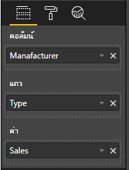

# <a name="add-interactivity-into-visual-by-power-bi-visuals-selections"></a><span data-ttu-id="9aeac-104">เพิ่มการโต้ตอบลงในภาพด้วยการเลือกภาพ Power BI</span><span class="sxs-lookup"><span data-stu-id="9aeac-104">Add interactivity into visual by Power BI visuals selections</span></span>

<span data-ttu-id="9aeac-105">Power BI มีสองวิธีในการโต้ตอบระหว่างภาพคือ - การเลือกและการกรอง</span><span class="sxs-lookup"><span data-stu-id="9aeac-105">Power BI provides two ways of interaction between visuals - selection and filtering.</span></span> <span data-ttu-id="9aeac-106">ตัวอย่างด้านล่างแสดงให้เห็นถึงวิธีการเลือกรายการใดๆ ในภาพเดียวและแจ้งภาพอื่นๆ ในรายงานเกี่ยวกับสถานะการเลือกใหม่</span><span class="sxs-lookup"><span data-stu-id="9aeac-106">The sample below demonstrates how to select any items in one visual and notify other visuals in the report about new selection state.</span></span>

<span data-ttu-id="9aeac-107">`Selection` ออบเจ็กต์ที่สอดคล้องกับอินเตอร์เฟซ:</span><span class="sxs-lookup"><span data-stu-id="9aeac-107">`Selection` object corresponds to the interface:</span></span>

```typescript
export interface ISelectionId {
    equals(other: ISelectionId): boolean;
    includes(other: ISelectionId, ignoreHighlight?: boolean): boolean;
    getKey(): string;
    getSelector(): Selector;
    getSelectorsByColumn(): SelectorsByColumn;
    hasIdentity(): boolean;
}
```

## <a name="how-to-use-selectionmanager-to-select-data-points"></a><span data-ttu-id="9aeac-108">วิธีใช้ SelectionManager เพื่อเลือกจุดข้อมูล</span><span class="sxs-lookup"><span data-stu-id="9aeac-108">How to use SelectionManager to select data points</span></span>

<span data-ttu-id="9aeac-109">ออบเจ็กต์โฮสต์วิชวลให้เมธอดในการสร้างอินสแตนซ์ของเครื่องมือจัดการการเลือก</span><span class="sxs-lookup"><span data-stu-id="9aeac-109">The visual host object provides the method for creating an instance of selection manager.</span></span> <span data-ttu-id="9aeac-110">ตัวจัดการการเลือกที่รับผิดชอบในการเลือก ล้างการเลือก แสดงเมนูบริบท จัดเก็บการเลือกปัจจุบันและตรวจสอบสถานะการเลือก</span><span class="sxs-lookup"><span data-stu-id="9aeac-110">The selection manager responsible to select, to clear selection, to show the context menu, to store current selections and check selection state.</span></span> <span data-ttu-id="9aeac-111">และตัวจัดการการเลือกมีเมธอดที่สอดคล้องกันสำหรับการดำเนินการดังกล่าว</span><span class="sxs-lookup"><span data-stu-id="9aeac-111">And the selection manager has corresponded methods for those actions.</span></span>

### <a name="create-an-instance-of-the-selection-manager"></a><span data-ttu-id="9aeac-112">สร้างอินสแตนซ์ของตัวจัดการการเลือก</span><span class="sxs-lookup"><span data-stu-id="9aeac-112">Create an instance of the selection manager</span></span>

<span data-ttu-id="9aeac-113">สำหรับการใช้ตัวจัดการการเลือก คุณจะต้องสร้างอินสแตนซ์ของตัวจัดการการเลือก</span><span class="sxs-lookup"><span data-stu-id="9aeac-113">For using the selection manager, you need to create the instance of a selection manager.</span></span> <span data-ttu-id="9aeac-114">โดยทั่วไป วิชวลจะสร้างอินสแตนซ์ตัวจัดการการเลือกใน `constructor` ของออบเจ็กต์ของวิชวล</span><span class="sxs-lookup"><span data-stu-id="9aeac-114">Usually, visuals create a selection manager instance in the `constructor` of the visual object.</span></span>

```typescript
export class Visual implements IVisual {
    private target: HTMLElement;
    private host: IVisualHost;
    private selectionManager: ISelectionManager;
    // ...
    constructor(options: VisualConstructorOptions) {
        this.host = options.host;
        // ...
        this.selectionManager = this.host.createSelectionManager();
    }
    // ...
}
```

### <a name="create-an-instance-of-the-selection-builder"></a><span data-ttu-id="9aeac-115">สร้างอินสแตนซ์ของตัวสร้างการเลือก</span><span class="sxs-lookup"><span data-stu-id="9aeac-115">Create an instance of the selection builder</span></span>

<span data-ttu-id="9aeac-116">เมื่อมีการสร้างอินสแตนซ์ตัวจัดการการเลือก คุณจะต้องสร้าง `selections` สำหรับแต่ละจุดข้อมูลของภาพ</span><span class="sxs-lookup"><span data-stu-id="9aeac-116">When the selection manager instance is created, you need to create `selections` for each data point of the visual.</span></span> <span data-ttu-id="9aeac-117">วัตถุโฮสต์ภาพมีวิธีการ `createSelectionIdBuilder` ในการสร้างการเลือกสำหรับแต่ละจุดข้อมูล</span><span class="sxs-lookup"><span data-stu-id="9aeac-117">The visual host object provides `createSelectionIdBuilder` method to generate selection for each data point.</span></span> <span data-ttu-id="9aeac-118">เมธอดนี้ส่งกลับอินสแตนซ์ของออบเจ็กต์ที่มีอินเทอร์เฟซ `powerbi.visuals.ISelectionIdBuilder`:</span><span class="sxs-lookup"><span data-stu-id="9aeac-118">This method return instance of the object with interface `powerbi.visuals.ISelectionIdBuilder`:</span></span>

```typescript
export interface ISelectionIdBuilder {
    withCategory(categoryColumn: DataViewCategoryColumn, index: number): this;
    withSeries(seriesColumn: DataViewValueColumns, valueColumn: DataViewValueColumn | DataViewValueColumnGroup): this;
    withMeasure(measureId: string): this;
    withMatrixNode(matrixNode: DataViewMatrixNode, levels: DataViewHierarchyLevel[]): this;
    withTable(table: DataViewTable, rowIndex: number): this;
    createSelectionId(): ISelectionId;
}
```

<span data-ttu-id="9aeac-119">ออบเจ็กต์นี้มีเมธอดที่สอดคล้องเพื่อสร้าง `selections` สำหรับการแมปมุมมองข้อมูลชนิดต่างๆ</span><span class="sxs-lookup"><span data-stu-id="9aeac-119">This object has corresponded methods to create `selections` for different types of data view mappings.</span></span>

> [!NOTE]
> <span data-ttu-id="9aeac-120">มีการนำเมธอด `withTable` และ `withMatrixNode` มาใช้ใน API 2.5.0 ของวิชวล Power BI</span><span class="sxs-lookup"><span data-stu-id="9aeac-120">The methods `withTable` and `withMatrixNode` were introduced on API 2.5.0 of the Power BI visuals.</span></span>
> <span data-ttu-id="9aeac-121">ถ้าคุณจำเป็นต้องใช้ตัวเลือกสำหรับการแมปมุมมองข้อมูลแบบตารางหรือเมทริกซ์ คุณจำเป็นต้องอัปเดต API ไปเป็นเวอร์ชัน 2.5.0 หรือใหม่กว่า</span><span class="sxs-lookup"><span data-stu-id="9aeac-121">If you need to use selections for table or matrix data view mappings you need to update API version to 2.5.0 or higher.</span></span>

### <a name="create-selections-for-categorical-data-view-mapping"></a><span data-ttu-id="9aeac-122">สร้างการเลือกสำหรับการแมปมุมมองข้อมูลประเภท</span><span class="sxs-lookup"><span data-stu-id="9aeac-122">Create selections for categorical data view mapping</span></span>

<span data-ttu-id="9aeac-123">มาดูกันว่าการเลือกจะแสดงถึงการแมปมุมมองข้อมูลแบบจัดกลุ่มสำหรับชุดข้อมูลตัวอย่างได้อย่างไร:</span><span class="sxs-lookup"><span data-stu-id="9aeac-123">Let's review how selections represent on categorical data view mapping for sample dataset:</span></span>

| <span data-ttu-id="9aeac-124">ผู้ผลิต</span><span class="sxs-lookup"><span data-stu-id="9aeac-124">Manufacturer</span></span> | <span data-ttu-id="9aeac-125">ชนิด</span><span class="sxs-lookup"><span data-stu-id="9aeac-125">Type</span></span> | <span data-ttu-id="9aeac-126">ค่า</span><span class="sxs-lookup"><span data-stu-id="9aeac-126">Value</span></span> |
| - | - | - |
| <span data-ttu-id="9aeac-127">ไครสเลอร์</span><span class="sxs-lookup"><span data-stu-id="9aeac-127">Chrysler</span></span> | <span data-ttu-id="9aeac-128">รถภายในประเทศ</span><span class="sxs-lookup"><span data-stu-id="9aeac-128">Domestic Car</span></span> | <span data-ttu-id="9aeac-129">28883</span><span class="sxs-lookup"><span data-stu-id="9aeac-129">28883</span></span> |
| <span data-ttu-id="9aeac-130">ไครสเลอร์</span><span class="sxs-lookup"><span data-stu-id="9aeac-130">Chrysler</span></span> | <span data-ttu-id="9aeac-131">รถบรรทุกภายในประเทศ</span><span class="sxs-lookup"><span data-stu-id="9aeac-131">Domestic Truck</span></span> | <span data-ttu-id="9aeac-132">117131</span><span class="sxs-lookup"><span data-stu-id="9aeac-132">117131</span></span> |
| <span data-ttu-id="9aeac-133">ไครสเลอร์</span><span class="sxs-lookup"><span data-stu-id="9aeac-133">Chrysler</span></span> | <span data-ttu-id="9aeac-134">รถนำเข้า</span><span class="sxs-lookup"><span data-stu-id="9aeac-134">Import Car</span></span> | <span data-ttu-id="9aeac-135">0</span><span class="sxs-lookup"><span data-stu-id="9aeac-135">0</span></span> |
| <span data-ttu-id="9aeac-136">ไครสเลอร์</span><span class="sxs-lookup"><span data-stu-id="9aeac-136">Chrysler</span></span> | <span data-ttu-id="9aeac-137">รถบรรทุกนำเข้า</span><span class="sxs-lookup"><span data-stu-id="9aeac-137">Import Truck</span></span> | <span data-ttu-id="9aeac-138">6362</span><span class="sxs-lookup"><span data-stu-id="9aeac-138">6362</span></span> |
| <span data-ttu-id="9aeac-139">ฟอร์ด</span><span class="sxs-lookup"><span data-stu-id="9aeac-139">Ford</span></span> | <span data-ttu-id="9aeac-140">รถภายในประเทศ</span><span class="sxs-lookup"><span data-stu-id="9aeac-140">Domestic Car</span></span> | <span data-ttu-id="9aeac-141">50032</span><span class="sxs-lookup"><span data-stu-id="9aeac-141">50032</span></span> |
| <span data-ttu-id="9aeac-142">ฟอร์ด</span><span class="sxs-lookup"><span data-stu-id="9aeac-142">Ford</span></span> | <span data-ttu-id="9aeac-143">รถบรรทุกภายในประเทศ</span><span class="sxs-lookup"><span data-stu-id="9aeac-143">Domestic Truck</span></span> | <span data-ttu-id="9aeac-144">122446</span><span class="sxs-lookup"><span data-stu-id="9aeac-144">122446</span></span> |
| <span data-ttu-id="9aeac-145">ฟอร์ด</span><span class="sxs-lookup"><span data-stu-id="9aeac-145">Ford</span></span> | <span data-ttu-id="9aeac-146">รถนำเข้า</span><span class="sxs-lookup"><span data-stu-id="9aeac-146">Import Car</span></span> | <span data-ttu-id="9aeac-147">0</span><span class="sxs-lookup"><span data-stu-id="9aeac-147">0</span></span> |
| <span data-ttu-id="9aeac-148">ฟอร์ด</span><span class="sxs-lookup"><span data-stu-id="9aeac-148">Ford</span></span> | <span data-ttu-id="9aeac-149">รถบรรทุกนำเข้า</span><span class="sxs-lookup"><span data-stu-id="9aeac-149">Import Truck</span></span> | <span data-ttu-id="9aeac-150">0</span><span class="sxs-lookup"><span data-stu-id="9aeac-150">0</span></span> |
| <span data-ttu-id="9aeac-151">GM</span><span class="sxs-lookup"><span data-stu-id="9aeac-151">GM</span></span> | <span data-ttu-id="9aeac-152">รถภายในประเทศ</span><span class="sxs-lookup"><span data-stu-id="9aeac-152">Domestic Car</span></span> | <span data-ttu-id="9aeac-153">65426</span><span class="sxs-lookup"><span data-stu-id="9aeac-153">65426</span></span> |
| <span data-ttu-id="9aeac-154">GM</span><span class="sxs-lookup"><span data-stu-id="9aeac-154">GM</span></span> | <span data-ttu-id="9aeac-155">รถบรรทุกภายในประเทศ</span><span class="sxs-lookup"><span data-stu-id="9aeac-155">Domestic Truck</span></span> | <span data-ttu-id="9aeac-156">138122</span><span class="sxs-lookup"><span data-stu-id="9aeac-156">138122</span></span> |
| <span data-ttu-id="9aeac-157">GM</span><span class="sxs-lookup"><span data-stu-id="9aeac-157">GM</span></span> | <span data-ttu-id="9aeac-158">รถนำเข้า</span><span class="sxs-lookup"><span data-stu-id="9aeac-158">Import Car</span></span> | <span data-ttu-id="9aeac-159">197</span><span class="sxs-lookup"><span data-stu-id="9aeac-159">197</span></span> |
| <span data-ttu-id="9aeac-160">GM</span><span class="sxs-lookup"><span data-stu-id="9aeac-160">GM</span></span> | <span data-ttu-id="9aeac-161">รถบรรทุกนำเข้า</span><span class="sxs-lookup"><span data-stu-id="9aeac-161">Import Truck</span></span> | <span data-ttu-id="9aeac-162">0</span><span class="sxs-lookup"><span data-stu-id="9aeac-162">0</span></span> |
| <span data-ttu-id="9aeac-163">ฮอนด้า</span><span class="sxs-lookup"><span data-stu-id="9aeac-163">Honda</span></span> | <span data-ttu-id="9aeac-164">รถภายในประเทศ</span><span class="sxs-lookup"><span data-stu-id="9aeac-164">Domestic Car</span></span> | <span data-ttu-id="9aeac-165">51450</span><span class="sxs-lookup"><span data-stu-id="9aeac-165">51450</span></span> |
| <span data-ttu-id="9aeac-166">ฮอนด้า</span><span class="sxs-lookup"><span data-stu-id="9aeac-166">Honda</span></span> | <span data-ttu-id="9aeac-167">รถบรรทุกภายในประเทศ</span><span class="sxs-lookup"><span data-stu-id="9aeac-167">Domestic Truck</span></span> | <span data-ttu-id="9aeac-168">46115</span><span class="sxs-lookup"><span data-stu-id="9aeac-168">46115</span></span> |
| <span data-ttu-id="9aeac-169">ฮอนด้า</span><span class="sxs-lookup"><span data-stu-id="9aeac-169">Honda</span></span> | <span data-ttu-id="9aeac-170">รถนำเข้า</span><span class="sxs-lookup"><span data-stu-id="9aeac-170">Import Car</span></span> | <span data-ttu-id="9aeac-171">2932</span><span class="sxs-lookup"><span data-stu-id="9aeac-171">2932</span></span> |
| <span data-ttu-id="9aeac-172">ฮอนด้า</span><span class="sxs-lookup"><span data-stu-id="9aeac-172">Honda</span></span> | <span data-ttu-id="9aeac-173">รถบรรทุกนำเข้า</span><span class="sxs-lookup"><span data-stu-id="9aeac-173">Import Truck</span></span> | <span data-ttu-id="9aeac-174">0</span><span class="sxs-lookup"><span data-stu-id="9aeac-174">0</span></span> |
| <span data-ttu-id="9aeac-175">นิสสัน</span><span class="sxs-lookup"><span data-stu-id="9aeac-175">Nissan</span></span> | <span data-ttu-id="9aeac-176">รถภายในประเทศ</span><span class="sxs-lookup"><span data-stu-id="9aeac-176">Domestic Car</span></span> | <span data-ttu-id="9aeac-177">51476</span><span class="sxs-lookup"><span data-stu-id="9aeac-177">51476</span></span> |
| <span data-ttu-id="9aeac-178">นิสสัน</span><span class="sxs-lookup"><span data-stu-id="9aeac-178">Nissan</span></span> | <span data-ttu-id="9aeac-179">รถบรรทุกภายในประเทศ</span><span class="sxs-lookup"><span data-stu-id="9aeac-179">Domestic Truck</span></span> | <span data-ttu-id="9aeac-180">47343</span><span class="sxs-lookup"><span data-stu-id="9aeac-180">47343</span></span> |
| <span data-ttu-id="9aeac-181">นิสสัน</span><span class="sxs-lookup"><span data-stu-id="9aeac-181">Nissan</span></span> | <span data-ttu-id="9aeac-182">รถนำเข้า</span><span class="sxs-lookup"><span data-stu-id="9aeac-182">Import Car</span></span> | <span data-ttu-id="9aeac-183">5485</span><span class="sxs-lookup"><span data-stu-id="9aeac-183">5485</span></span> |
| <span data-ttu-id="9aeac-184">นิสสัน</span><span class="sxs-lookup"><span data-stu-id="9aeac-184">Nissan</span></span> | <span data-ttu-id="9aeac-185">รถบรรทุกนำเข้า</span><span class="sxs-lookup"><span data-stu-id="9aeac-185">Import Truck</span></span> | <span data-ttu-id="9aeac-186">1430</span><span class="sxs-lookup"><span data-stu-id="9aeac-186">1430</span></span> |
| <span data-ttu-id="9aeac-187">โตโยต้า</span><span class="sxs-lookup"><span data-stu-id="9aeac-187">Toyota</span></span> | <span data-ttu-id="9aeac-188">รถภายในประเทศ</span><span class="sxs-lookup"><span data-stu-id="9aeac-188">Domestic Car</span></span> | <span data-ttu-id="9aeac-189">55643</span><span class="sxs-lookup"><span data-stu-id="9aeac-189">55643</span></span> |
| <span data-ttu-id="9aeac-190">โตโยต้า</span><span class="sxs-lookup"><span data-stu-id="9aeac-190">Toyota</span></span> | <span data-ttu-id="9aeac-191">รถบรรทุกภายในประเทศ</span><span class="sxs-lookup"><span data-stu-id="9aeac-191">Domestic Truck</span></span> | <span data-ttu-id="9aeac-192">61227</span><span class="sxs-lookup"><span data-stu-id="9aeac-192">61227</span></span> |
| <span data-ttu-id="9aeac-193">โตโยต้า</span><span class="sxs-lookup"><span data-stu-id="9aeac-193">Toyota</span></span> | <span data-ttu-id="9aeac-194">รถนำเข้า</span><span class="sxs-lookup"><span data-stu-id="9aeac-194">Import Car</span></span> | <span data-ttu-id="9aeac-195">20799</span><span class="sxs-lookup"><span data-stu-id="9aeac-195">20799</span></span> |
| <span data-ttu-id="9aeac-196">โตโยต้า</span><span class="sxs-lookup"><span data-stu-id="9aeac-196">Toyota</span></span> | <span data-ttu-id="9aeac-197">รถบรรทุกนำเข้า</span><span class="sxs-lookup"><span data-stu-id="9aeac-197">Import Truck</span></span> | <span data-ttu-id="9aeac-198">23614</span><span class="sxs-lookup"><span data-stu-id="9aeac-198">23614</span></span> |

<span data-ttu-id="9aeac-199">และวิชวลใช้การแมปมุมมองข้อมูลต่อไปนี้:</span><span class="sxs-lookup"><span data-stu-id="9aeac-199">And the visual uses the following data view mapping:</span></span>

```json
{
    "dataRoles": [
        {
            "displayName": "Columns",
            "name": "columns",
            "kind": "Grouping"
        },
        {
            "displayName": "Rows",
            "name": "rows",
            "kind": "Grouping"
        },
        {
            "displayName": "Values",
            "name": "values",
            "kind": "Measure"
        }
    ],
    "dataViewMappings": [
        {
            "categorical": {
                "categories": {
                    "for": {
                        "in": "columns"
                    }
                },
                "values": {
                    "group": {
                        "by": "rows",
                        "select": [
                            {
                                "for": {
                                    "in": "values"
                                }
                            }
                        ]
                    }
                }
            }
        }
    ]
}
```

<span data-ttu-id="9aeac-200">ในตัวอย่าง `Manufacturer`คือ `columns` และ `Type` คือ `rows`</span><span class="sxs-lookup"><span data-stu-id="9aeac-200">In the sample, `Manufacturer` is `columns` and `Type` is `rows`.</span></span> <span data-ttu-id="9aeac-201">มีชุดข้อมูลที่สร้างขึ้นโดยการจัดกลุ่มค่าโดย `rows` (`Type`)</span><span class="sxs-lookup"><span data-stu-id="9aeac-201">There's series created by groupings values by `rows` (`Type`).</span></span>

<span data-ttu-id="9aeac-202">และการแสดงผลด้วยภาพควรสามารถแบ่งข้อมูลด้วย `Manufacturer` และ `Type` ด้วย</span><span class="sxs-lookup"><span data-stu-id="9aeac-202">And visual should able to slice data by `Manufacturer` and `Type` too.</span></span>

<span data-ttu-id="9aeac-203">ตัวอย่างเช่น เมื่อผู้ใช้เลือก `Chrysler` โดย `Manufacturer` ภาพอื่นๆ ควรแสดงข้อมูลต่อไปนี้:</span><span class="sxs-lookup"><span data-stu-id="9aeac-203">For example, when user selects `Chrysler` by  `Manufacturer`, other visuals should show following data:</span></span>

| <span data-ttu-id="9aeac-204">ผู้ผลิต</span><span class="sxs-lookup"><span data-stu-id="9aeac-204">Manufacturer</span></span> | <span data-ttu-id="9aeac-205">ชนิด</span><span class="sxs-lookup"><span data-stu-id="9aeac-205">Type</span></span> | <span data-ttu-id="9aeac-206">ค่า</span><span class="sxs-lookup"><span data-stu-id="9aeac-206">Value</span></span> |
| - | - | - |
| <span data-ttu-id="9aeac-207">**ไครสเลอร์**</span><span class="sxs-lookup"><span data-stu-id="9aeac-207">**Chrysler**</span></span> | <span data-ttu-id="9aeac-208">รถภายในประเทศ</span><span class="sxs-lookup"><span data-stu-id="9aeac-208">Domestic Car</span></span> | <span data-ttu-id="9aeac-209">28883</span><span class="sxs-lookup"><span data-stu-id="9aeac-209">28883</span></span> |
| <span data-ttu-id="9aeac-210">**ไครสเลอร์**</span><span class="sxs-lookup"><span data-stu-id="9aeac-210">**Chrysler**</span></span> | <span data-ttu-id="9aeac-211">รถบรรทุกภายในประเทศ</span><span class="sxs-lookup"><span data-stu-id="9aeac-211">Domestic Truck</span></span> | <span data-ttu-id="9aeac-212">117131</span><span class="sxs-lookup"><span data-stu-id="9aeac-212">117131</span></span> |
| <span data-ttu-id="9aeac-213">**ไครสเลอร์**</span><span class="sxs-lookup"><span data-stu-id="9aeac-213">**Chrysler**</span></span> | <span data-ttu-id="9aeac-214">รถนำเข้า</span><span class="sxs-lookup"><span data-stu-id="9aeac-214">Import Car</span></span> | <span data-ttu-id="9aeac-215">0</span><span class="sxs-lookup"><span data-stu-id="9aeac-215">0</span></span> |
| <span data-ttu-id="9aeac-216">**ไครสเลอร์**</span><span class="sxs-lookup"><span data-stu-id="9aeac-216">**Chrysler**</span></span> | <span data-ttu-id="9aeac-217">รถบรรทุกนำเข้า</span><span class="sxs-lookup"><span data-stu-id="9aeac-217">Import Truck</span></span> | <span data-ttu-id="9aeac-218">6362</span><span class="sxs-lookup"><span data-stu-id="9aeac-218">6362</span></span> |

<span data-ttu-id="9aeac-219">เมื่อผู้ใช้เลือก`Import Car`โดย`Type` (เลือกข้อมูลตามชุด) ภาพอื่นๆ ควรแสดงข้อมูลต่อไปนี้:</span><span class="sxs-lookup"><span data-stu-id="9aeac-219">When user selects `Import Car` by  `Type` (selects data by series), other visuals should show following data:</span></span>

| <span data-ttu-id="9aeac-220">ผู้ผลิต</span><span class="sxs-lookup"><span data-stu-id="9aeac-220">Manufacturer</span></span> | <span data-ttu-id="9aeac-221">ชนิด</span><span class="sxs-lookup"><span data-stu-id="9aeac-221">Type</span></span> | <span data-ttu-id="9aeac-222">ค่า</span><span class="sxs-lookup"><span data-stu-id="9aeac-222">Value</span></span> |
| - | - | - |
| <span data-ttu-id="9aeac-223">ไครสเลอร์</span><span class="sxs-lookup"><span data-stu-id="9aeac-223">Chrysler</span></span> | <span data-ttu-id="9aeac-224">**รถนำเข้า**</span><span class="sxs-lookup"><span data-stu-id="9aeac-224">**Import Car**</span></span> | <span data-ttu-id="9aeac-225">0</span><span class="sxs-lookup"><span data-stu-id="9aeac-225">0</span></span> |
| <span data-ttu-id="9aeac-226">ฟอร์ด</span><span class="sxs-lookup"><span data-stu-id="9aeac-226">Ford</span></span> | <span data-ttu-id="9aeac-227">**รถนำเข้า**</span><span class="sxs-lookup"><span data-stu-id="9aeac-227">**Import Car**</span></span> | <span data-ttu-id="9aeac-228">0</span><span class="sxs-lookup"><span data-stu-id="9aeac-228">0</span></span> |
| <span data-ttu-id="9aeac-229">GM</span><span class="sxs-lookup"><span data-stu-id="9aeac-229">GM</span></span> | <span data-ttu-id="9aeac-230">**รถนำเข้า**</span><span class="sxs-lookup"><span data-stu-id="9aeac-230">**Import Car**</span></span> | <span data-ttu-id="9aeac-231">197</span><span class="sxs-lookup"><span data-stu-id="9aeac-231">197</span></span> |
| <span data-ttu-id="9aeac-232">ฮอนด้า</span><span class="sxs-lookup"><span data-stu-id="9aeac-232">Honda</span></span> | <span data-ttu-id="9aeac-233">**รถนำเข้า**</span><span class="sxs-lookup"><span data-stu-id="9aeac-233">**Import Car**</span></span> | <span data-ttu-id="9aeac-234">2932</span><span class="sxs-lookup"><span data-stu-id="9aeac-234">2932</span></span> |
| <span data-ttu-id="9aeac-235">นิสสัน</span><span class="sxs-lookup"><span data-stu-id="9aeac-235">Nissan</span></span> | <span data-ttu-id="9aeac-236">**รถนำเข้า**</span><span class="sxs-lookup"><span data-stu-id="9aeac-236">**Import Car**</span></span> | <span data-ttu-id="9aeac-237">5485</span><span class="sxs-lookup"><span data-stu-id="9aeac-237">5485</span></span> |
| <span data-ttu-id="9aeac-238">โตโยต้า</span><span class="sxs-lookup"><span data-stu-id="9aeac-238">Toyota</span></span> | <span data-ttu-id="9aeac-239">**รถนำเข้า**</span><span class="sxs-lookup"><span data-stu-id="9aeac-239">**Import Car**</span></span> | <span data-ttu-id="9aeac-240">20799</span><span class="sxs-lookup"><span data-stu-id="9aeac-240">20799</span></span> |


<span data-ttu-id="9aeac-242">จำเป็นต้องเติมตะกร้าข้อมูลด้วยภาพ</span><span class="sxs-lookup"><span data-stu-id="9aeac-242">Need to fill the visual data baskets.</span></span>



<span data-ttu-id="9aeac-244">มี `Manufacturer` เป็นประเภท (คอลัมน์) `Type` เป็นชุดข้อมูล (แถว) และ `Value` เป็น `Values` สำหรับชุดข้อมูล</span><span class="sxs-lookup"><span data-stu-id="9aeac-244">There are `Manufacturer` as category (columns), `Type` as series (rows) and `Value` as `Values` for series.</span></span>

> [!NOTE]
> <span data-ttu-id="9aeac-245">จำเป็นต้องมี `Values` สำหรับชุดข้อมูลเนื่องจากการแมปมุมมองข้อมูลตามวิชวลคาดหวังว่า `Values` จะถูกจัดกลุ่มตามข้อมูล `Rows`</span><span class="sxs-lookup"><span data-stu-id="9aeac-245">The `Values` are required for series because according to data view mapping the visual expects that `Values` will be grouped by `Rows` data.</span></span>

#### <a name="create-selections-for-categories"></a><span data-ttu-id="9aeac-246">สร้างการเลือกสำหรับประเภท</span><span class="sxs-lookup"><span data-stu-id="9aeac-246">Create selections for categories</span></span>

```typescript
// categories
const categories = dataView.categorical.categories;

// create label for 'Manufacturer' column
const p = document.createElement("p") as HTMLParagraphElement;
p.innerText = categories[0].source.displayName.toString();
this.target.appendChild(p);

// get count of category elements
const categoriesCount = categories[0].values.length;

// iterate all categories to generate selection and create button elements to use selections
for (let categoryIndex = 0; categoryIndex < categoriesCount; categoryIndex++) {
    const categoryValue: powerbi.PrimitiveValue = categories[0].values[categoryIndex];

    const categorySelectionId = this.host.createSelectionIdBuilder()
        .withCategory(categories[0], categoryIndex) // we have only one category (only one `Manufacturer` column)
        .createSelectionId();
    this.dataPoints.push({
        value: categoryValue,
        selection: categorySelectionId
    });
    console.log(categorySelectionId);

    // create button element to apply selection on click
    const button = document.createElement("button") as HTMLButtonElement;
    button.value = categoryValue.toString();
    button.innerText = categoryValue.toString();
    button.addEventListener("click", () => {
        // handle click event to apply correspond selection
        this.selectionManager.select(categorySelectionId);
    });
    this.target.appendChild(button);
}
```

<span data-ttu-id="9aeac-247">ในโค้ดตัวอย่าง คุณจะเห็นว่าเราวนซ้ำทุกหมวดหมู่</span><span class="sxs-lookup"><span data-stu-id="9aeac-247">In the sample code, you can see that we iterate all categories.</span></span> <span data-ttu-id="9aeac-248">และในแต่ละการวนซ้ำ เราเรียกใช้ `createSelectionIdBuilder` เพื่อสร้างการเลือกถัดไปสำหรับแต่ละหมวดหมู่โดยการเรียกเมธอด `withCategory` ของตัวสร้างการเลือก</span><span class="sxs-lookup"><span data-stu-id="9aeac-248">And in each iteration, we call `createSelectionIdBuilder` to create the next selection for each category by calling `withCategory` method of the selection builder.</span></span> <span data-ttu-id="9aeac-249">เมธอด `createSelectionId` ถูกใช้เป็นเมธอดสุดท้ายในการส่งกลับออบเจ็กต์ `selection` ที่สร้างขึ้น</span><span class="sxs-lookup"><span data-stu-id="9aeac-249">The method `createSelectionId` is used as a final method to return the generated `selection` object.</span></span>

<span data-ttu-id="9aeac-250">ในเมธอด `withCategory` เราส่งผ่านคอลัมน์ของ `category` ในตัวอย่าง ซึ่งคือ `Manufacturer` และดัชนีขององค์ประกอบหมวดหมู่</span><span class="sxs-lookup"><span data-stu-id="9aeac-250">In `withCategory` method, we pass the column of `category`, in the sample, it's `Manufacturer` and index of category element.</span></span>

#### <a name="create-selections-for-series"></a><span data-ttu-id="9aeac-251">สร้างการเลือกสำหรับชุดข้อมูล</span><span class="sxs-lookup"><span data-stu-id="9aeac-251">Create selections for series</span></span>

```typescript
// get groupped values for series
const series: powerbi.DataViewValueColumnGroup[] = dataView.categorical.values.grouped();

// create label for 'Type' column
const p2 = document.createElement("p") as HTMLParagraphElement;
p2.innerText = dataView.categorical.values.source.displayName;
this.target.appendChild(p2);

// iterate all series to generate selection and create button elements to use selections
series.forEach( (ser: powerbi.DataViewValueColumnGroup) => {
    // create selection id for series
    const seriesSelectionId = this.host.createSelectionIdBuilder()
        .withSeries(dataView.categorical.values, ser)
        .createSelectionId();

    this.dataPoints.push({
        value: ser.name,
        selection: seriesSelectionId
    });

    // create button element to apply selection on click
    const button = document.createElement("button") as HTMLButtonElement;
    button.value =ser.name.toString();
    button.innerText = ser.name.toString();
    button.addEventListener("click", () => {
        // handle click event to apply correspond selection
        this.selectionManager.select(seriesSelectionId);
    });
    this.target.appendChild(button);
});
```

### <a name="create-selections-for-table-data-view-mapping"></a><span data-ttu-id="9aeac-252">สร้างการเลือกสำหรับการแมปมุมมองข้อมูลตาราง</span><span class="sxs-lookup"><span data-stu-id="9aeac-252">Create selections for table data view mapping</span></span>

<span data-ttu-id="9aeac-253">ตัวอย่างของการแมปมุมมองข้อมูลตาราง</span><span class="sxs-lookup"><span data-stu-id="9aeac-253">Sample of table data views mapping</span></span>

```json
{
    "dataRoles": [
        {
            "displayName": "Values",
            "name": "values",
            "kind": "GroupingOrMeasure"
        }
    ],
    "dataViewMappings": [
        {
            "table": {
                "rows": {
                    "for": {
                        "in": "values"
                    }
                }
            }
        }
    ]
}
```

<span data-ttu-id="9aeac-254">หากต้องการสร้างการเลือกสำหรับการแมปมุมมองข้อมูลแบบตารางแต่ละแถว คุณต้องเรียกใช้เมธอด `withTable` ของตัวสร้างการเลือก</span><span class="sxs-lookup"><span data-stu-id="9aeac-254">To create a selection for each row of table data view mapping, you need to call `withTable` method of selection builder.</span></span>

```typescript
public update(options: VisualUpdateOptions) {
    const dataView = options.dataViews[0];
    dataView.table.rows.forEach((row: DataViewTableRow, rowIndex: number) => {
        this.target.appendChild(rowDiv);
        const selection: ISelectionId = this.host.createSelectionIdBuilder()
            .withTable(dataView.table, rowIndex)
            .createSelectionId();
    }
}
```

<span data-ttu-id="9aeac-255">โค้ดของวิชวลจะวนซ้ำแถวของตาราง และแต่ละแถวเรียกเมธอดตาราง `withTable`</span><span class="sxs-lookup"><span data-stu-id="9aeac-255">The visual code iterates the rows of the table and each row calls `withTable` table method.</span></span> <span data-ttu-id="9aeac-256">พารามิเตอร์ของวิธีการ `withTable` คือวัตถุ `table` และดัชนีของแถวตาราง</span><span class="sxs-lookup"><span data-stu-id="9aeac-256">Parameters of `withTable` method are `table` object and index of the table row.</span></span>

### <a name="create-selections-for-matrix-data-view-mapping"></a><span data-ttu-id="9aeac-257">สร้างการเลือกสำหรับการแมปมุมมองข้อมูลเมทริกซ์</span><span class="sxs-lookup"><span data-stu-id="9aeac-257">Create selections for matrix data view mapping</span></span>

```typescript
public update(options: VisualUpdateOptions) {
    const host = this.host;
    const rowLevels: powerbi.DataViewHierarchyLevel[] = dataView.matrix.rows.levels;
    const columnLevels: powerbi.DataViewHierarchyLevel[] = dataView.matrix.rows.levels;

    // iterate rows hierarchy
    nodeWalker(dataView.matrix.rows.root, rowLevels);
    // iterate columns hierarchy
    nodeWalker(dataView.matrix.columns.root, columnLevels);

    function nodeWalker(node: powerbi.DataViewMatrixNode, levels: powerbi.DataViewHierarchyLevel[]) {
        const nodeSelection = host.createSelectionIdBuilder().withMatrixNode(node, levels);

        if (node.children && node.children.length) {
            node.children.forEach(child => {
                nodeWalker(child, levels);
            });
        }
    }
}
```

<span data-ttu-id="9aeac-258">ในตัวอย่าง `nodeWalker` เรียกซ้ำสำหรับแต่ละโหนดและโหนดย่อย</span><span class="sxs-lookup"><span data-stu-id="9aeac-258">In the sample, `nodeWalker` calls recursively for each node and child nodes.</span></span>

<span data-ttu-id="9aeac-259">`nodeWalker` สร้างวัตถุ `nodeSelection` ในการโทรแต่ละครั้ง</span><span class="sxs-lookup"><span data-stu-id="9aeac-259">`nodeWalker` creates `nodeSelection` object on each call.</span></span> <span data-ttu-id="9aeac-260">และแต่ละ `nodeSelection` เป็นตัวแทน `selection` ของโหนดที่ตรงกัน</span><span class="sxs-lookup"><span data-stu-id="9aeac-260">And each `nodeSelection` represent `selection` of correspond nodes.</span></span>

## <a name="select-datapoints-to-slice-other-visuals"></a><span data-ttu-id="9aeac-261">เลือกจุดข้อมูลเพื่อแบ่งภาพอื่นๆ</span><span class="sxs-lookup"><span data-stu-id="9aeac-261">Select datapoints to slice other visuals</span></span>

<span data-ttu-id="9aeac-262">ในตัวอย่าง โค้ดของการเลือกสำหรับการแมปมุมมองข้อมูลแบบจัดกลุ่ม คุณเห็นว่าเราได้สร้างตัวจัดการการคลิกสำหรับองค์ประกอบปุ่ม</span><span class="sxs-lookup"><span data-stu-id="9aeac-262">In the sample, codes of selections for categorical data view mapping, you saw that we created a click handler for button elements.</span></span> <span data-ttu-id="9aeac-263">ตัวจัดการเรียกเมธอด `select` ของตัวจัดการการเลือกและส่งผ่านออบเจ็กต์การเลือก</span><span class="sxs-lookup"><span data-stu-id="9aeac-263">The handler calls `select` method of the selection manager and passes the selection object.</span></span>

```typescript
button.addEventListener("click", () => {
    // handle click event to apply correspond selection
    this.selectionManager.select(categorySelectionId);
});
```

<span data-ttu-id="9aeac-264">อินเทอร์เฟซของวิธีการ `select` คือ</span><span class="sxs-lookup"><span data-stu-id="9aeac-264">The interface of `select` method is</span></span>

```typescript
interface ISelectionManager {
    // ...
    select(selectionId: ISelectionId | ISelectionId[], multiSelect?: boolean): IPromise<ISelectionId[]>;
    // ...
}
```

<span data-ttu-id="9aeac-265">คุณสามารถดู `select` สามารถยอมรับอาร์เรย์ของการเลือกได้</span><span class="sxs-lookup"><span data-stu-id="9aeac-265">You can see `select` can accept an array of selections.</span></span> <span data-ttu-id="9aeac-266">ซึ่งหมายความว่าภาพของคุณสามารถเลือกหลายจุดข้อมูลได้</span><span class="sxs-lookup"><span data-stu-id="9aeac-266">It means your visual can select several datapoints.</span></span> <span data-ttu-id="9aeac-267">พารามิเตอร์ตัวที่สอง `multiSelect` รับผิดชอบการเลือกหลายรายการ</span><span class="sxs-lookup"><span data-stu-id="9aeac-267">The second parameter `multiSelect` responsible for multi-select.</span></span> <span data-ttu-id="9aeac-268">ถ้าค่าเป็นจริง Power BI จะไม่ล้างสถานะการเลือกก่อนหน้าและใช้การเลือกปัจจุบัน มิฉะนั้นการเลือกก่อนหน้าจะรีเซ็ต</span><span class="sxs-lookup"><span data-stu-id="9aeac-268">If the value is true, Power BI doesn't clear the previous selection state and apply current selection otherwise previous selection will reset.</span></span>

<span data-ttu-id="9aeac-269">สถานการณ์โดยทั่วไปของการใช้การจัดการ `multiSelect` ของปุ่ม CTRL สำหรับการคลิกเหตุการณ์</span><span class="sxs-lookup"><span data-stu-id="9aeac-269">The typical scenario of using `multiSelect` handling CTRL button state on click event.</span></span>

```typescript
button.addEventListener("click", (mouseEvent) => {
    const multiSelect = (mouseEvent as MouseEvent).ctrlKey;
    this.selectionManager.select(seriesSelectionId, multiSelect);
});
```

## <a name="next-steps"></a><span data-ttu-id="9aeac-270">ขั้นตอนถัดไป</span><span class="sxs-lookup"><span data-stu-id="9aeac-270">Next steps</span></span>

* [<span data-ttu-id="9aeac-271">อ่านวิธีการใช้การเลือกสำหรับการผูกคุณสมบัติวิชวลกับจุดข้อมูล</span><span class="sxs-lookup"><span data-stu-id="9aeac-271">Read how to use selections for binding visual properties to data points</span></span>](objects-properties.md#objects-selector)

* [<span data-ttu-id="9aeac-272">อ่านวิธีการจัดการกับการเลือกในการสลับบุ๊กมาร์ก</span><span class="sxs-lookup"><span data-stu-id="9aeac-272">Read how to handle selections on bookmarks switching</span></span>](bookmarks-support.md#visuals-with-selection)

* [<span data-ttu-id="9aeac-273">อ่านวิธีการเพิ่มเมนูบริบทสำหรับจุดข้อมูลภาพ</span><span class="sxs-lookup"><span data-stu-id="9aeac-273">Read how to add context menu for visuals data points</span></span>](context-menu.md)

* [<span data-ttu-id="9aeac-274">อ่านวิธีการใช้ InteractivityUtils เพื่อเพิ่มการเลือกลงในภาพ Power BI</span><span class="sxs-lookup"><span data-stu-id="9aeac-274">Read how to use InteractivityUtils to add selections into Power BI Visuals</span></span>](utils-interactivity-selections.md)
