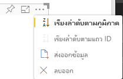

# <a name="sorting-options-for-power-bi-visuals"></a><span data-ttu-id="0d1b4-104">ตัวเลือกการเรียงลำดับสำหรับวิชวล Power BI</span><span class="sxs-lookup"><span data-stu-id="0d1b4-104">Sorting options for Power BI visuals</span></span>

<span data-ttu-id="0d1b4-105">บทความนี้อธิบายวิธีการที่ตัวเลือก *การเรียงลำดับ* ระบุพฤติกรรมการเรียงลำดับสำหรับวิชวล Power BI</span><span class="sxs-lookup"><span data-stu-id="0d1b4-105">This article describes how *sorting* options specify the sorting behavior for Power BI visuals.</span></span> 

<span data-ttu-id="0d1b4-106">ความสามารถในการเรียงลำดับต้องการหนึ่งในพารามิเตอร์ต่อไปนี้</span><span class="sxs-lookup"><span data-stu-id="0d1b4-106">The sorting capability requires one of the following parameters.</span></span>

## <a name="default-sorting"></a><span data-ttu-id="0d1b4-107">เรียงลำดับค่าเริ่มต้น</span><span class="sxs-lookup"><span data-stu-id="0d1b4-107">Default sorting</span></span>

<span data-ttu-id="0d1b4-108">ตัวเลือก `default` คือฟอร์มที่ง่ายที่สุด</span><span class="sxs-lookup"><span data-stu-id="0d1b4-108">The `default` option is the simplest form.</span></span> <span data-ttu-id="0d1b4-109">ซึ่งช่วยการเรียงลำดับข้อมูลที่แสดงในส่วน 'DataMappings'</span><span class="sxs-lookup"><span data-stu-id="0d1b4-109">It allows sorting the data presented in the 'DataMappings' section.</span></span> <span data-ttu-id="0d1b4-110">ตัวเลือกช่วยให้สามารถเรียงลำดับการแมปข้อมูลโดยผู้ใช้และระบุทิศทางการเรียงลำดับได้</span><span class="sxs-lookup"><span data-stu-id="0d1b4-110">The option enables sorting of the data mappings by the user and specifies the sorting direction.</span></span>

```json
    "sorting": {
        "default": {   }
    }
```



## <a name="implicit-sorting"></a><span data-ttu-id="0d1b4-112">การเรียงลำดับโดยนัย</span><span class="sxs-lookup"><span data-stu-id="0d1b4-112">Implicit sorting</span></span>

<span data-ttu-id="0d1b4-113">การเรียงลำดับโดยนัยเป็นการเรียงลำดับด้วยพารามิเตอร์อาร์เรย์ `clauses` ซึ่งอธิบายการเรียงลำดับสำหรับแต่ละบทบาทข้อมูล</span><span class="sxs-lookup"><span data-stu-id="0d1b4-113">Implicit sorting is sorting with the array parameter `clauses`, which describes sorting for each data role.</span></span> <span data-ttu-id="0d1b4-114">`implicit` หมายความว่าผู้ใช้ของวิชวลไม่สามารถเปลี่ยนลำดับการจัดเรียงได้</span><span class="sxs-lookup"><span data-stu-id="0d1b4-114">`implicit` means that the visual's user can't change the sorting order.</span></span> <span data-ttu-id="0d1b4-115">Power BI จะไม่แสดงตัวเลือกการเรียงลำดับในเมนูของวิชวล</span><span class="sxs-lookup"><span data-stu-id="0d1b4-115">Power BI doesn't display sorting options in the visual's menu.</span></span> <span data-ttu-id="0d1b4-116">อย่างไรก็ตาม Power BI จะเรียงลำดับข้อมูลสอดคล้องกับการตั้งค่าที่ระบุ</span><span class="sxs-lookup"><span data-stu-id="0d1b4-116">However, Power BI does sort data according to specified settings.</span></span>

<span data-ttu-id="0d1b4-117">พารามิเตอร์ `clauses` สามารถประกอบด้วยอ็อบเจ็กต์ ๆ ที่มีพารามิเตอร์สองตัว:</span><span class="sxs-lookup"><span data-stu-id="0d1b4-117">`clauses` parameters can contain several objects with two parameters:</span></span>

- <span data-ttu-id="0d1b4-118">`role`: กำหนด `DataMapping` สำหรับการจัดเรียง</span><span class="sxs-lookup"><span data-stu-id="0d1b4-118">`role`: Determines `DataMapping` for sorting</span></span>
- <span data-ttu-id="0d1b4-119">`direction`: กำหนดทิศทางการเรียงลำดับ (1 = จากน้อยไปหามาก 2 = จากมากไปหาน้อย)</span><span class="sxs-lookup"><span data-stu-id="0d1b4-119">`direction`: Determines sort direction (1 = Ascending, 2 = Descending)</span></span>

```json
    "sorting": {
        "implicit": {
            "clauses": [
                {
                    "role": "category",
                    "direction": 1
                },
                {
                    "role": "measure",
                    "direction": 2
                }
            ]
        }
    }
```

## <a name="custom-sorting"></a><span data-ttu-id="0d1b4-120">การเรียงลำดับแบบกำหนดเอง</span><span class="sxs-lookup"><span data-stu-id="0d1b4-120">Custom sorting</span></span>

<span data-ttu-id="0d1b4-121">การเรียงลำดับแบบกำหนดเองหมายถึงการจัดเรียงนั้นได้รับการจัดการโดยนักพัฒนาในโค้ดของวิชวล</span><span class="sxs-lookup"><span data-stu-id="0d1b4-121">Custom sorting means that the sorting is managed by the developer in the visual's code.</span></span>
