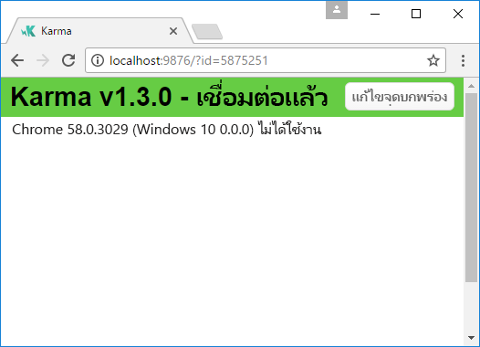
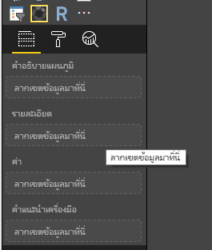
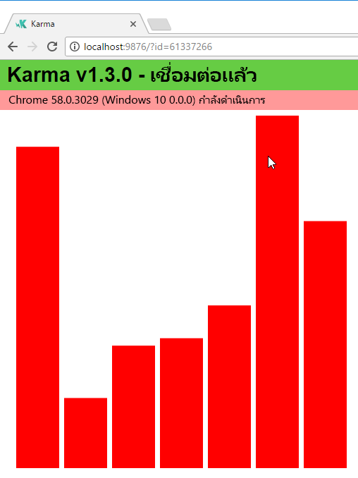

# <a name="tutorial-add-unit-tests-for-power-bi-visual-projects"></a><span data-ttu-id="11c26-104">บทช่วยสอน: เพิ่มการทดสอบหน่วยสำหรับโครงการวิชวล Power BI</span><span class="sxs-lookup"><span data-stu-id="11c26-104">Tutorial: Add unit tests for Power BI visual projects</span></span>

<span data-ttu-id="11c26-105">บทความนี้อธิบายพื้นฐานของการเขียนการทดสอบหน่วยสำหรับโครงการวิชวล Power BI ของคุณ รวมถึงวิธีการ:</span><span class="sxs-lookup"><span data-stu-id="11c26-105">This article describes the basics of writing unit tests for your Power BI visuals, including how to:</span></span>

* <span data-ttu-id="11c26-106">ตั้งค่าเฟรมเวิร์กการทดสอบสำหรับตัวเรียกใช้การทดสอบ Karma JavaScript และ Jasmine</span><span class="sxs-lookup"><span data-stu-id="11c26-106">Set up the Karma JavaScript test runner testing framework, Jasmine.</span></span>
* <span data-ttu-id="11c26-107">ใช้แพคเกจ powerbi-visuals-utils-testutils</span><span class="sxs-lookup"><span data-stu-id="11c26-107">Use the powerbi-visuals-utils-testutils package.</span></span>
* <span data-ttu-id="11c26-108">ใช้ตัวอย่างทดสอบและการหลอกเพื่อช่วยให้การทดสอบหน่วยสำหรับวิชวล Power BI ทำได้ง่ายขึ้นI</span><span class="sxs-lookup"><span data-stu-id="11c26-108">Use mocks and fakes to help simplify unit testing of Power BI visuals.</span></span>

## <a name="prerequisites"></a><span data-ttu-id="11c26-109">สิ่งที่จำเป็นต้องมี</span><span class="sxs-lookup"><span data-stu-id="11c26-109">Prerequisites</span></span>

* <span data-ttu-id="11c26-110">โครงการวิชวล Power BI ที่ติดตั้งแล้ว</span><span class="sxs-lookup"><span data-stu-id="11c26-110">An installed Power BI visuals project</span></span>
* <span data-ttu-id="11c26-111">สภาพแวดล้อม Node.JS ที่กำหนดค่าไว้แล้ว</span><span class="sxs-lookup"><span data-stu-id="11c26-111">A configured Node.js environment</span></span>

## <a name="install-and-configure-the-karma-javascript-test-runner-and-jasmine"></a><span data-ttu-id="11c26-112">ติดตั้งและกำหนดค่าตัวเรียกใช้การทดสอบ Karma JavaScript และ Jasmine</span><span class="sxs-lookup"><span data-stu-id="11c26-112">Install and configure the Karma JavaScript test runner and Jasmine</span></span>

<span data-ttu-id="11c26-113">เพิ่มไลบรารีที่จำเป็นเข้ากับไฟล์ *package.json* ในส่วน `devDependencies`:</span><span class="sxs-lookup"><span data-stu-id="11c26-113">Add the required libraries to the *package.json* file in the `devDependencies` section:</span></span>

```json
"@babel/polyfill": "^7.2.5",
"@types/d3": "5.5.0",
"@types/jasmine": "2.5.37",
"@types/jasmine-jquery": "1.5.28",
"@types/jquery": "2.0.41",
"@types/karma": "3.0.0",
"@types/lodash-es": "4.17.1",
"coveralls": "3.0.2",
"istanbul-instrumenter-loader": "^3.0.1",
"jasmine": "2.5.2",
"jasmine-core": "2.5.2",
"jasmine-jquery": "2.1.1",
"jquery": "3.1.1",
"karma": "3.1.1",
"karma-chrome-launcher": "2.2.0",
"karma-coverage": "1.1.2",
"karma-coverage-istanbul-reporter": "^2.0.4",
"karma-jasmine": "2.0.1",
"karma-junit-reporter": "^1.2.0",
"karma-sourcemap-loader": "^0.3.7",
"karma-typescript": "^3.0.13",
"karma-typescript-preprocessor": "0.4.0",
"karma-webpack": "3.0.5",
"puppeteer": "1.17.0",
"style-loader": "0.23.1",
"ts-loader": "5.3.0",
"ts-node": "7.0.1",
"tslint": "^5.12.0",
"webpack": "4.26.0"
```

<span data-ttu-id="11c26-114">หากต้องการเรียนรู้เพิ่มเติมเกี่ยวกับ *package.json* ดูคำอธิบายที่ [npm-package.json](https://docs.npmjs.com/files/package.json)</span><span class="sxs-lookup"><span data-stu-id="11c26-114">To learn more about *package.json*, see the description at [npm-package.json](https://docs.npmjs.com/files/package.json).</span></span>

<span data-ttu-id="11c26-115">บันทึกไฟล์ *package.json* และที่ตำแหน่ง `package.json` ให้เรียกใช้คำสั่งต่อไปนี้:</span><span class="sxs-lookup"><span data-stu-id="11c26-115">Save the *package.json* file and, at the `package.json` location, run the following command:</span></span>

```cmd
npm install
```

<span data-ttu-id="11c26-116">ตัวจัดการแพกเกจติดตั้งแพกเกจใหม่ทั้งหมดที่เพิ่มไปยัง *package.json*</span><span class="sxs-lookup"><span data-stu-id="11c26-116">The package manager installs all new packages that are added to *package.json*.</span></span>

<span data-ttu-id="11c26-117">เมื่อต้องการเรียกใช้การทดสอบหน่วย ให้กำหนดค่าตัวเรียกใช้การทดสอบและการกำหนดค่า `webpack`</span><span class="sxs-lookup"><span data-stu-id="11c26-117">To run unit tests, configure the test runner and `webpack` config.</span></span>

<span data-ttu-id="11c26-118">โค้ดต่อไปนี้เป็นตัวอย่างของไฟล์ *test.webpack.config.js*:</span><span class="sxs-lookup"><span data-stu-id="11c26-118">The following code is a sample of the *test.webpack.config.js* file:</span></span>

```typescript
const path = require('path');
const webpack = require("webpack");

module.exports = {
    devtool: 'source-map',
    mode: 'development',
    optimization : {
        concatenateModules: false,
        minimize: false
    },
    module: {
        rules: [
            {
                test: /\.tsx?$/,
                use: 'ts-loader',
                exclude: /node_modules/
            },
            {
                test: /\.json$/,
                loader: 'json-loader'
            },
            {
                test: /\.tsx?$/i,
                enforce: 'post',
                include: /(src)/,
                exclude: /(node_modules|resources\/js\/vendor)/,
                loader: 'istanbul-instrumenter-loader',
                options: { esModules: true }
            },
            {
                test: /\.less$/,
                use: [
                    {
                        loader: 'style-loader'
                    },
                    {
                        loader: 'css-loader'
                    },
                    {
                        loader: 'less-loader',
                        options: {
                            paths: [path.resolve(__dirname, 'node_modules')]
                        }
                    }
                ]
            }
        ]
    },
    externals: {
        "powerbi-visuals-api": '{}'
    },
    resolve: {
        extensions: ['.tsx', '.ts', '.js', '.css']
    },
    output: {
        path: path.resolve(__dirname, ".tmp/test")
    },
    plugins: [
        new webpack.ProvidePlugin({
            'powerbi-visuals-api': null
        })
    ]
};
```

<span data-ttu-id="11c26-119">โค้ดต่อไปนี้เป็นตัวอย่างของไฟล์ *karma.conf.ts*:</span><span class="sxs-lookup"><span data-stu-id="11c26-119">The following code is a sample of the *karma.conf.ts* file:</span></span>

```typescript
"use strict";

const webpackConfig = require("./test.webpack.config.js");
const tsconfig = require("./test.tsconfig.json");
const path = require("path");

const testRecursivePath = "test/visualTest.ts";
const srcOriginalRecursivePath = "src/**/*.ts";
const coverageFolder = "coverage";

process.env.CHROME_BIN = require("puppeteer").executablePath();

import { Config, ConfigOptions } from "karma";

module.exports = (config: Config) => {
    config.set(<ConfigOptions>{
        mode: "development",
        browserNoActivityTimeout: 100000,
        browsers: ["ChromeHeadless"], // or Chrome to use locally installed Chrome browser
        colors: true,
        frameworks: ["jasmine"],
        reporters: [
            "progress",
            "junit",
            "coverage-istanbul"
        ],
        junitReporter: {
            outputDir: path.join(__dirname, coverageFolder),
            outputFile: "TESTS-report.xml",
            useBrowserName: false
        },
        singleRun: true,
        plugins: [
            "karma-coverage",
            "karma-typescript",
            "karma-webpack",
            "karma-jasmine",
            "karma-sourcemap-loader",
            "karma-chrome-launcher",
            "karma-junit-reporter",
            "karma-coverage-istanbul-reporter"
        ],
        files: [
            "node_modules/jquery/dist/jquery.min.js",
            "node_modules/jasmine-jquery/lib/jasmine-jquery.js",
            {
                pattern: './capabilities.json',
                watched: false,
                served: true,
                included: false
            },
            testRecursivePath,
            {
                pattern: srcOriginalRecursivePath,
                included: false,
                served: true
            }
        ],
        preprocessors: {
            [testRecursivePath]: ["webpack", "coverage"]
        },
        typescriptPreprocessor: {
            options: tsconfig.compilerOptions
        },
        coverageIstanbulReporter: {
            reports: ["html", "lcovonly", "text-summary", "cobertura"],
            dir: path.join(__dirname, coverageFolder),
            'report-config': {
                html: {
                    subdir: 'html-report'
                }
            },
            combineBrowserReports: true,
            fixWebpackSourcePaths: true,
            verbose: false
        },
        coverageReporter: {
            dir: path.join(__dirname, coverageFolder),
            reporters: [
                // reporters not supporting the `file` property
                { type: 'html', subdir: 'html-report' },
                { type: 'lcov', subdir: 'lcov' },
                // reporters supporting the `file` property, use `subdir` to directly
                // output them in the `dir` directory
                { type: 'cobertura', subdir: '.', file: 'cobertura-coverage.xml' },
                { type: 'lcovonly', subdir: '.', file: 'report-lcovonly.txt' },
                { type: 'text-summary', subdir: '.', file: 'text-summary.txt' },
            ]
        },
        mime: {
            "text/x-typescript": ["ts", "tsx"]
        },
        webpack: webpackConfig,
        webpackMiddleware: {
            stats: "errors-only"
        }
    });
};
```

<span data-ttu-id="11c26-120">ถ้าจำเป็น คุณสามารถปรับเปลี่ยนการกำหนดค่านี้ได้</span><span class="sxs-lookup"><span data-stu-id="11c26-120">If necessary, you can modify this configuration.</span></span>

<span data-ttu-id="11c26-121">โค้ดใน *karma.conf.js* ประกอบด้วยตัวแปรดังต่อไปนี้:</span><span class="sxs-lookup"><span data-stu-id="11c26-121">The code in *karma.conf.js* contains the following variable:</span></span>

* <span data-ttu-id="11c26-122">`recursivePathToTests`: ค้นหาตำแหน่งโค้ดทดสอบ</span><span class="sxs-lookup"><span data-stu-id="11c26-122">`recursivePathToTests`: Locates the test code</span></span>

* <span data-ttu-id="11c26-123">`srcRecursivePath`: ค้นหาตำแหน่งโค้ด JavaScript ผลลัพธ์หลังจากการคอมไพล์</span><span class="sxs-lookup"><span data-stu-id="11c26-123">`srcRecursivePath`: Locates the output JavaScript code after compiling</span></span>

* <span data-ttu-id="11c26-124">`srcCssRecursivePath`: ค้นหาตำแหน่ง CSS ผลลัพธ์หลังจากการคอมไพล์ไฟล์น้อยลงด้วยสไตล์</span><span class="sxs-lookup"><span data-stu-id="11c26-124">`srcCssRecursivePath`: Locates the output CSS after compiling less file with styles</span></span>

* <span data-ttu-id="11c26-125">`srcOriginalRecursivePath`: ค้นหาตำแหน่งซอสโค้ดของวิชวลของคุณ</span><span class="sxs-lookup"><span data-stu-id="11c26-125">`srcOriginalRecursivePath`: Locates the source code of your visual</span></span>

* <span data-ttu-id="11c26-126">`coverageFolder`: กำหนดตำแหน่งที่จะสร้างรายงานความครอบคลุม</span><span class="sxs-lookup"><span data-stu-id="11c26-126">`coverageFolder`: Determines where the coverage report is to be created</span></span>

<span data-ttu-id="11c26-127">ไฟล์การกำหนดค่าประกอบด้วยคุณสมบัติต่อไปนี้:</span><span class="sxs-lookup"><span data-stu-id="11c26-127">The configuration file includes the following properties:</span></span>

* <span data-ttu-id="11c26-128">`singleRun: true`: มีการเรียกใช้การทดสอบบนระบบการบูรณาการอย่างต่อเนื่อง (CI) หรือสามารถเรียกใช้ได้ครั้งเดียว</span><span class="sxs-lookup"><span data-stu-id="11c26-128">`singleRun: true`: Tests are run on a continuous integration (CI) system, or they can be run one time.</span></span> <span data-ttu-id="11c26-129">คุณสามารถเปลี่ยนการตั้งค่าเป็น *false* สำหรับการดีบักการทดสอบของคุณ</span><span class="sxs-lookup"><span data-stu-id="11c26-129">You can change the setting to *false* for debugging your tests.</span></span> <span data-ttu-id="11c26-130">Karma ช่วยให้เบราว์เซอร์ทำงานอย่างต่อเนื่องเพื่อให้คุณสามารถใช้คอนโซลสำหรับการดีบักได้</span><span class="sxs-lookup"><span data-stu-id="11c26-130">Karma keeps the browser running so that you can use the console for debugging.</span></span>

* <span data-ttu-id="11c26-131">`files: [...]`: ในอาร์เรย์นี้ คุณสามารถระบุไฟล์ที่จะโหลดไปยังเบราว์เซอร์ได้</span><span class="sxs-lookup"><span data-stu-id="11c26-131">`files: [...]`: In this array, you can specify the files to load to the browser.</span></span> <span data-ttu-id="11c26-132">โดยทั่วไปแล้วจะมีไฟล์ต้นฉบับ กรณีการทดสอบ ไลบรารี (Jasmine, ยูทิลิตี้การทดสอบ)</span><span class="sxs-lookup"><span data-stu-id="11c26-132">Usually, there are source files, test cases, libraries (Jasmine, test utilities).</span></span> <span data-ttu-id="11c26-133">คุณสามารถเพิ่มไฟล์เพิ่มเติมลงในรายการได้ตามความจำเป็น</span><span class="sxs-lookup"><span data-stu-id="11c26-133">You can add additional files to the list, as necessary.</span></span>

* <span data-ttu-id="11c26-134">`preprocessors`: ในส่วนนี้คุณกำหนดค่าการดำเนินการที่เรียกใช้ก่อนที่จะเรียกใช้การทดสอบหน่วย</span><span class="sxs-lookup"><span data-stu-id="11c26-134">`preprocessors`: In this section, you configure actions that run before the unit tests run.</span></span> <span data-ttu-id="11c26-135">พวกเขาทำการพรีคอมไพล์ typescript ไปยัง JavaScript เตรียมไฟล์แมปต้นฉบับ และสร้างรายงานความครอบคลุมของโค้ด</span><span class="sxs-lookup"><span data-stu-id="11c26-135">They precompile the typescript to JavaScript, prepare source map files, and generate code coverage report.</span></span> <span data-ttu-id="11c26-136">คุณสามารถปิดใช้งาน `coverage` เมื่อคุณดีบักการทดสอบของคุณ</span><span class="sxs-lookup"><span data-stu-id="11c26-136">You can disable `coverage` when you debug your tests.</span></span> <span data-ttu-id="11c26-137">ความครอบคลุมจะสร้างโค้ดเพิ่มเติมเพื่อตรวจสอบโค้ดสำหรับความครอบคลุมในการทดสอบ ซึ่งจะทำให้การทดสอบการดีบักซับซ้อน</span><span class="sxs-lookup"><span data-stu-id="11c26-137">Coverage generates additional code for check code for the test coverage, which complicates debugging tests.</span></span>

<span data-ttu-id="11c26-138">สำหรับคำอธิบายของการกำหนดค่า Karma ทั้งหมดให้ไปที่หน้า[ไฟล์การกำหนดค่า Karma](https://karma-runner.github.io/1.0/config/configuration-file.html)</span><span class="sxs-lookup"><span data-stu-id="11c26-138">For descriptions of all Karma configurations, go to the [Karma Configuration File](https://karma-runner.github.io/1.0/config/configuration-file.html) page.</span></span>

<span data-ttu-id="11c26-139">เพื่อความสะดวกของคุณ คุณสามารถเพิ่มคำสั่งทดสอบลงใน `scripts`:</span><span class="sxs-lookup"><span data-stu-id="11c26-139">For your convenience, you can add a test command into `scripts`:</span></span>

```json
{
    "scripts": {
        "pbiviz": "pbiviz",
        "start": "pbiviz start",
        "typings":"node node_modules/typings/dist/bin.js i",
        "lint": "tslint -r \"node_modules/tslint-microsoft-contrib\"  \"+(src|test)/**/*.ts\"",
        "pretest": "pbiviz package --resources --no-minify --no-pbiviz --no-plugin",
        "test": "karma start"
    }
    ...
}
```

<span data-ttu-id="11c26-140">ดังนั้น ตอนนี้คุณก็พร้อมที่จะเริ่มเขียนการทดสอบหน่วยของคุณแล้ว</span><span class="sxs-lookup"><span data-stu-id="11c26-140">You're now ready to begin writing your unit tests.</span></span>

## <a name="check-the-dom-element-of-the-visual"></a><span data-ttu-id="11c26-141">ตรวจสอบองค์ประกอบ DOM ของวิชวล</span><span class="sxs-lookup"><span data-stu-id="11c26-141">Check the DOM element of the visual</span></span>

<span data-ttu-id="11c26-142">สำหรับการทดสอบวิชวล เราต้องสร้างอินสแตนซ์ของวิชวลก่อน</span><span class="sxs-lookup"><span data-stu-id="11c26-142">To test the visual, first create an instance of visual.</span></span>

### <a name="create-a-visual-instance-builder"></a><span data-ttu-id="11c26-143">สร้างตัวสร้างอินสแตนซ์ของวิชวล</span><span class="sxs-lookup"><span data-stu-id="11c26-143">Create a visual instance builder</span></span>

<span data-ttu-id="11c26-144">เพิ่มไฟล์ *visualBuilder.ts* ไปยังโฟลเดอร์ *test* โดยใช้โค้ดดังต่อไปนี้:</span><span class="sxs-lookup"><span data-stu-id="11c26-144">Add a *visualBuilder.ts* file to the *test* folder by using the following code:</span></span>

```typescript
import {
    VisualBuilderBase
} from "powerbi-visuals-utils-testutils";

import {
    BarChart as VisualClass
} from "../src/visual";

import  powerbi from "powerbi-visuals-api";
import VisualConstructorOptions = powerbi.extensibility.visual.VisualConstructorOptions;

export class BarChartBuilder extends VisualBuilderBase<VisualClass> {
    constructor(width: number, height: number) {
        super(width, height);
    }

    protected build(options: VisualConstructorOptions) {
        return new VisualClass(options);
    }

    public get mainElement() {
        return this.element.children("svg.barChart");
    }
}
```

<span data-ttu-id="11c26-145">มี `build` เมธอดสำหรับการสร้างอินสแตนซ์ของวิชวลของคุณ</span><span class="sxs-lookup"><span data-stu-id="11c26-145">There's `build` method for creating an instance of your visual.</span></span> <span data-ttu-id="11c26-146">`mainElement` เป็นเมธอดการรับ ซึ่งส่งกลับอินสแตนซ์ขององค์ประกอบแบบจำลองอ็อบเจกต์เอกสาร (DOM) "root" ในวิชวลของคุณ</span><span class="sxs-lookup"><span data-stu-id="11c26-146">`mainElement` is a get method, which returns an instance of "root" document object model (DOM) element in your visual.</span></span> <span data-ttu-id="11c26-147">Getter เป็นตัวเลือกที่จะใช้หรือไม่ใช้ก็ได้ แต่จะทำให้การเขียนการทดสอบหน่วยง่ายขึ้น</span><span class="sxs-lookup"><span data-stu-id="11c26-147">The getter is optional, but it makes writing the unit test easier.</span></span>

<span data-ttu-id="11c26-148">ขณะนี้คุณมีการสร้างอินสแตนซ์ของวิชวลของคุณแล้ว</span><span class="sxs-lookup"><span data-stu-id="11c26-148">You now have a build of an instance of your visual.</span></span> <span data-ttu-id="11c26-149">ลองเขียนกรณีทดสอบ</span><span class="sxs-lookup"><span data-stu-id="11c26-149">Let's write the test case.</span></span> <span data-ttu-id="11c26-150">กรณีทดสอบจะตรวจสอบองค์ประกอบ SVG ที่สร้างขึ้นเมื่อแสดงวิชวลของคุณ</span><span class="sxs-lookup"><span data-stu-id="11c26-150">The test case checks the SVG elements that are created when your visual is displayed.</span></span>

### <a name="create-a-typescript-file-to-write-test-cases"></a><span data-ttu-id="11c26-151">สร้างไฟล์ typescript เพื่อเขียนกรณีทดสอบ</span><span class="sxs-lookup"><span data-stu-id="11c26-151">Create a typescript file to write test cases</span></span>

<span data-ttu-id="11c26-152">เพิ่มไฟล์ *visualTest.ts* สำหรับกรณีทดสอบโดยใช้โค้ดดังต่อไปนี้:</span><span class="sxs-lookup"><span data-stu-id="11c26-152">Add a *visualTest.ts* file for the test cases by using the following code:</span></span>

```typescript
import powerbi from "powerbi-visuals-api";

import { BarChartBuilder } from "./VisualBuilder";

import {
    BarChart as VisualClass
} from "../src/visual";

import VisualBuilder = powerbi.extensibility.visual.test.BarChartBuilder;

describe("BarChart", () => {
    let visualBuilder: VisualBuilder;
    let dataView: DataView;

    beforeEach(() => {
        visualBuilder = new VisualBuilder(500, 500);
    });

    it("root DOM element is created", () => {
        expect(visualBuilder.mainElement).toBeInDOM();
    });
});
```

<span data-ttu-id="11c26-153">มีการเรียกใช้เมธอดหลายวิธี:</span><span class="sxs-lookup"><span data-stu-id="11c26-153">Several methods are called:</span></span>

* <span data-ttu-id="11c26-154">[`describe`](https://jasmine.github.io/api/2.6/global.html#describe): อธิบายกรณีทดสอบ</span><span class="sxs-lookup"><span data-stu-id="11c26-154">[`describe`](https://jasmine.github.io/api/2.6/global.html#describe): Describes a test case.</span></span> <span data-ttu-id="11c26-155">ในบริบทของเฟรมเวิร์ก Jasmine ซึ่งมักจะอธิบายชุดหรือกลุ่มของรายละเอียดจำเพาะ</span><span class="sxs-lookup"><span data-stu-id="11c26-155">In the context of the Jasmine framework, it often describes a suite or group of specs.</span></span>

* <span data-ttu-id="11c26-156">`beforeEach`: ถูกเรียกก่อนการเรียกใช้เมธอด `it` แต่ละครั้งซึ่งกำหนดไว้ในเมธอด [`describe`](https://jasmine.github.io/api/2.6/global.html#beforeEach)</span><span class="sxs-lookup"><span data-stu-id="11c26-156">`beforeEach`: Is called before each call of the `it` method, which is defined in the [`describe`](https://jasmine.github.io/api/2.6/global.html#beforeEach) method.</span></span>

* <span data-ttu-id="11c26-157">[`it`](https://jasmine.github.io/api/2.6/global.html#it): กำหนดรายละเอียดจำเพาะเดียว เมธอด `it` ควรมี `expectations` อย่างน้อยหนึ่งรายการหรือมากกว่า</span><span class="sxs-lookup"><span data-stu-id="11c26-157">[`it`](https://jasmine.github.io/api/2.6/global.html#it): Defines a single spec. The `it` method should contain one or more `expectations`.</span></span>

* <span data-ttu-id="11c26-158">[`expect`](https://jasmine.github.io/api/2.6/global.html#expect): สร้างความคาดหวังสำหรับรายละเอียดจำเพาะ รายละเอียดจำเพาะะเสร็จสมบูรณ์ถ้าเป็นไปตามความคาดหวังทั้งหมดโดยไม่มีความล้มเหลวใดเกิดขึ้น</span><span class="sxs-lookup"><span data-stu-id="11c26-158">[`expect`](https://jasmine.github.io/api/2.6/global.html#expect): Creates an expectation for a spec. A spec succeeds if all expectations pass without any failures.</span></span>

* <span data-ttu-id="11c26-159">`toBeInDOM`: หนึ่งในเมธอด *matchers*</span><span class="sxs-lookup"><span data-stu-id="11c26-159">`toBeInDOM`: One of the *matchers* methods.</span></span> <span data-ttu-id="11c26-160">สำหรับข้อมูลเพิ่มเติมเกี่ยวกับ matchers โปรดดู [Jasmine Namespace: matchers](https://jasmine.github.io/api/2.6/matchers.html)</span><span class="sxs-lookup"><span data-stu-id="11c26-160">For more information about matchers, see [Jasmine Namespace: matchers](https://jasmine.github.io/api/2.6/matchers.html).</span></span>

<span data-ttu-id="11c26-161">สำหรับข้อมูลเพิ่มเติมเกี่ยวกับ Jasmine โปรดดูที่หน้า [เอกสารประกอบสำหรับเฟรมเวิร์ก Jasmine](https://jasmine.github.io/)</span><span class="sxs-lookup"><span data-stu-id="11c26-161">For more information about Jasmine, see the [Jasmine framework documentation](https://jasmine.github.io/) page.</span></span>

### <a name="launch-unit-tests"></a><span data-ttu-id="11c26-162">เปิดใช้งานการทดสอบหน่วย</span><span class="sxs-lookup"><span data-stu-id="11c26-162">Launch unit tests</span></span>

<span data-ttu-id="11c26-163">การทดสอบนี้จะตรวจสอบว่าองค์ประกอบ SVG ระดับสูงของวิชวลถูกสร้างขึ้นหรือไม่</span><span class="sxs-lookup"><span data-stu-id="11c26-163">This test checks that root SVG element of the visuals is created.</span></span> <span data-ttu-id="11c26-164">เมื่อต้องการเรียกใช้การทดสอบหน่วย ให้ป้อนคำสั่งนี้ในเครื่องมือประเภทคอมมานด์ไลน์:</span><span class="sxs-lookup"><span data-stu-id="11c26-164">To run the unit test, enter the following command in the command-line tool:</span></span>

```cmd
npm run test
```

<span data-ttu-id="11c26-165">`karma.js` เรียกใช้กรณีทดสอบในเบราว์เซอร์ Chrome</span><span class="sxs-lookup"><span data-stu-id="11c26-165">`karma.js` runs the test case in the Chrome browser.</span></span>



> [!NOTE]
> <span data-ttu-id="11c26-167">คุณต้องติดตั้ง Google Chrome ภายในเครื่อง</span><span class="sxs-lookup"><span data-stu-id="11c26-167">You must install Google Chrome locally.</span></span>

<span data-ttu-id="11c26-168">ในหน้าต่างคอมมานด์ไลน์ (Command Line) คุณจะได้รับผลลัพธ์ต่อไปนี้:</span><span class="sxs-lookup"><span data-stu-id="11c26-168">In the command-line window, you'll get following output:</span></span>

```cmd
> karma start

23 05 2017 12:24:26.842:WARN [watcher]: Pattern "E:/WORKSPACE/PowerBI/PowerBI-visuals-sampleBarChart/data/*.csv" does not match any file.
23 05 2017 12:24:30.836:WARN [karma]: No captured browser, open https://localhost:9876/
23 05 2017 12:24:30.849:INFO [karma]: Karma v1.3.0 server started at https://localhost:9876/
23 05 2017 12:24:30.850:INFO [launcher]: Launching browser Chrome with unlimited concurrency
23 05 2017 12:24:31.059:INFO [launcher]: Starting browser Chrome
23 05 2017 12:24:33.160:INFO [Chrome 58.0.3029 (Windows 10 0.0.0)]: Connected on socket /#2meR6hjXFmsE_fjiAAAA with id 5875251
Chrome 58.0.3029 (Windows 10 0.0.0): Executed 1 of 1 SUCCESS (0.194 secs / 0.011 secs)

=============================== Coverage summary ===============================
Statements   : 27.43% ( 65/237 )
Branches     : 19.84% ( 25/126 )
Functions    : 43.86% ( 25/57 )
Lines        : 20.85% ( 44/211 )
================================================================================
```

### <a name="how-to-add-static-data-for-unit-tests"></a><span data-ttu-id="11c26-169">วิธีการเพิ่มข้อมูลแบบคงที่สำหรับการทดสอบหน่วย</span><span class="sxs-lookup"><span data-stu-id="11c26-169">How to add static data for unit tests</span></span>

<span data-ttu-id="11c26-170">สร้างไฟล์ *visualData.ts* ไปยังโฟลเดอร์ *test* โดยใช้โค้ดดังต่อไปนี้:</span><span class="sxs-lookup"><span data-stu-id="11c26-170">Create the *visualData.ts* file in the *test* folder by using the following code:</span></span>

```typescript
import powerbi from "powerbi-visuals-api";
import DataView = powerbi.DataView;

import {
    testDataViewBuilder,
    getRandomNumbers
} from "powerbi-visuals-utils-testutils";

export class SampleBarChartDataBuilder extends TestDataViewBuilder {
    public static CategoryColumn: string = "category";
    public static MeasureColumn: string = "measure";

    public constructor() {
        super();
        ...
    }

    public getDataView(columnNames?: string[]): DataView {
        let dateView: any = this.createCategoricalDataViewBuilder([
            ...
        ],
        [
            ...
        ], columnNames).build();

        // there's client side computed maxValue
        let maxLocal = 0;
        this.valuesMeasure.forEach((item) => {
                if (item > maxLocal) {
                    maxLocal = item;
                }
        });
        (<any>dataView).categorical.values[0].maxLocal = maxLocal;
    }
}
```

<span data-ttu-id="11c26-171">คลาส `SampleBarChartDataBuilder` จะขยาย `TestDataViewBuilder` และใช้เมธอดที่อยู่ในคลาสนามธรรม `getDataView`</span><span class="sxs-lookup"><span data-stu-id="11c26-171">The `SampleBarChartDataBuilder` class extends `TestDataViewBuilder` and implements the abstract method `getDataView`.</span></span>

<span data-ttu-id="11c26-172">เมื่อคุณใส่ข้อมูลลงในบักเก็ตเขตข้อมูล Power BI สร้างออบเจ็กต์ `dataview` แบบจัดกลุ่มที่ขึ้นอยู่กับข้อมูลของคุณ</span><span class="sxs-lookup"><span data-stu-id="11c26-172">When you put data into data-field buckets, Power BI produces a categorical `dataview` object that's based on your data.</span></span>



<span data-ttu-id="11c26-174">ในการทดสอบหน่วย คุณไม่มีฟังก์ชันหลักของ Power BI เพื่อที่จะทำซ้ำข้อมูล</span><span class="sxs-lookup"><span data-stu-id="11c26-174">In unit tests, you don't have Power BI core functions to reproduce the data.</span></span> <span data-ttu-id="11c26-175">แต่คุณจำเป็นต้องแมปข้อมูลแบบสแตติกของคุณไปยัง `dataview` แบบจัดกลุ่ม</span><span class="sxs-lookup"><span data-stu-id="11c26-175">But you need to map your static data to the categorical `dataview`.</span></span> <span data-ttu-id="11c26-176">คลาส `TestDataViewBuilder` สามารถช่วยคุณในการแมปได้</span><span class="sxs-lookup"><span data-stu-id="11c26-176">The `TestDataViewBuilder` class can help you map it.</span></span>

<span data-ttu-id="11c26-177">สำหรับข้อมูลเพิ่มเติมเกี่ยวกับการแมปมุมมองข้อมูล โปรดดูที่ [DataViewMappings](https://github.com/PowerBi-Projects/PowerBI-visuals/blob/master/Capabilities/DataViewMappings.md)</span><span class="sxs-lookup"><span data-stu-id="11c26-177">For more information about Data View mapping, see [DataViewMappings](https://github.com/PowerBi-Projects/PowerBI-visuals/blob/master/Capabilities/DataViewMappings.md).</span></span>

<span data-ttu-id="11c26-178">ในเมธอด `getDataView` ให้คุณเรียกใช้เมธอด `createCategoricalDataViewBuilder` ด้วยข้อมูลของคุณ</span><span class="sxs-lookup"><span data-stu-id="11c26-178">In the `getDataView` method, you call the `createCategoricalDataViewBuilder` method with your data.</span></span>

<span data-ttu-id="11c26-179">ในไฟล์ [capabilities.json](https://github.com/Microsoft/PowerBI-visuals-sampleBarChart/blob/master/capabilities.json#L2) ของวิชวล `sampleBarChart` คุณมีออบเจ็กต์ dataRoles และ dataViewMapping:</span><span class="sxs-lookup"><span data-stu-id="11c26-179">In `sampleBarChart` visual [capabilities.json](https://github.com/Microsoft/PowerBI-visuals-sampleBarChart/blob/master/capabilities.json#L2) file, we have dataRoles and dataViewMapping objects:</span></span>

```json
"dataRoles": [
    {
        "displayName": "Category Data",
        "name": "category",
        "kind": "Grouping"
    },
    {
        "displayName": "Measure Data",
        "name": "measure",
        "kind": "Measure"
    }
],
"dataViewMappings": [
    {
        "conditions": [
            {
                "category": {
                    "max": 1
                },
                "measure": {
                    "max": 1
                }
            }
        ],
        "categorical": {
            "categories": {
                "for": {
                    "in": "category"
                }
            },
            "values": {
                "select": [
                    {
                        "bind": {
                            "to": "measure"
                        }
                    }
                ]
            }
        }
    }
],
```

<span data-ttu-id="11c26-180">เมื่อต้องการสร้างการแมปเดียวกัน คุณจะต้องตั้งค่าพารามิเตอร์ต่อไปนี้เป็นเมธอด `createCategoricalDataViewBuilder`:</span><span class="sxs-lookup"><span data-stu-id="11c26-180">To generate the same mapping, you must set the following params to `createCategoricalDataViewBuilder` method:</span></span>

```typescript
([
    {
        source: {
            displayName: "Category",
            queryName: SampleBarChartData.ColumnCategory,
            type: ValueType.fromDescriptor({ text: true }),
            roles: {
                Category: true
            },
        },
        values: this.valuesCategory
    }
],
[
    {
        source: {
            displayName: "Measure",
            isMeasure: true,
            queryName: SampleBarChartData.MeasureColumn,
            type: ValueType.fromDescriptor({ numeric: true }),
            roles: {
                Measure: true
            },
        },
        values: this.valuesMeasure
    },
], columnNames)
```

<span data-ttu-id="11c26-181">โดยที่ `this.valuesCategory` เป็นอาร์เรย์ของหมวดหมู่:</span><span class="sxs-lookup"><span data-stu-id="11c26-181">Where `this.valuesCategory` is an array of categories:</span></span>

```ts
public valuesCategory: string[] = ["Monday", "Tuesday", "Wednesday", "Thursday", "Friday", "Saturday", "Sunday"];
```

<span data-ttu-id="11c26-182">และ `this.valuesMeasure` เป็นอาร์เรย์ของหน่วยวัดสำหรับแต่ละหมวดหมู่:</span><span class="sxs-lookup"><span data-stu-id="11c26-182">And `this.valuesMeasure` is an array of measures for each category:</span></span>

```ts
public valuesMeasure: number[] = [742731.43, 162066.43, 283085.78, 300263.49, 376074.57, 814724.34, 570921.34];
```

<span data-ttu-id="11c26-183">ตอนนี้ คุณสามารถใช้คลาส `SampleBarChartDataBuilder` ในการทดสอบหน่วยของคุณได้แล้ว</span><span class="sxs-lookup"><span data-stu-id="11c26-183">Now, you can use the `SampleBarChartDataBuilder` class in your unit test.</span></span>

<span data-ttu-id="11c26-184">คลาส `ValueType` จะถูกกำหนดไว้ในแพกเกจ powerbi-visuals-utils-testutils</span><span class="sxs-lookup"><span data-stu-id="11c26-184">The `ValueType` class is defined in the powerbi-visuals-utils-testutils package.</span></span> <span data-ttu-id="11c26-185">และเมธอด `createCategoricalDataViewBuilder` จำเป็นต้องมีไลบรารี `lodash`</span><span class="sxs-lookup"><span data-stu-id="11c26-185">And the `createCategoricalDataViewBuilder` method requires the `lodash` library.</span></span>

<span data-ttu-id="11c26-186">เพิ่มแพคเกจเหล่านี้ไปยังการขึ้นต่อกัน (dependencies)</span><span class="sxs-lookup"><span data-stu-id="11c26-186">Add these packages to the dependencies.</span></span>

<span data-ttu-id="11c26-187">ใน `package.json` ที่ส่วน `devDependencies`</span><span class="sxs-lookup"><span data-stu-id="11c26-187">In `package.json` at `devDependencies` section</span></span>

```json
"lodash-es": "4.17.1",
"powerbi-visuals-utils-testutils": "2.2.0"
```

<span data-ttu-id="11c26-188">เรียกใช้</span><span class="sxs-lookup"><span data-stu-id="11c26-188">Call</span></span>

```cmd
npm install
```

<span data-ttu-id="11c26-189">เพื่อติดตั้งไลบรารี `lodash-es`</span><span class="sxs-lookup"><span data-stu-id="11c26-189">to install `lodash-es` library.</span></span>

<span data-ttu-id="11c26-190">ในตอนนี้ คุณสามารถเรียกใช้การทดสอบหน่วยอีกครั้ง</span><span class="sxs-lookup"><span data-stu-id="11c26-190">Now, you can run the unit test again.</span></span> <span data-ttu-id="11c26-191">คุณต้องได้รับผลลัพธ์ต่อไปนี้:</span><span class="sxs-lookup"><span data-stu-id="11c26-191">You must get the following output:</span></span>

```cmd
> karma start

23 05 2017 16:19:54.318:WARN [watcher]: Pattern "E:/WORKSPACE/PowerBI/PowerBI-visuals-sampleBarChart/data/*.csv" does not match any file.
23 05 2017 16:19:58.333:WARN [karma]: No captured browser, open https://localhost:9876/
23 05 2017 16:19:58.346:INFO [karma]: Karma v1.3.0 server started at https://localhost:9876/
23 05 2017 16:19:58.346:INFO [launcher]: Launching browser Chrome with unlimited concurrency
23 05 2017 16:19:58.394:INFO [launcher]: Starting browser Chrome
23 05 2017 16:19:59.873:INFO [Chrome 58.0.3029 (Windows 10 0.0.0)]: Connected on socket /#NcNTAGH9hWfGMCuEAAAA with id 3551106
Chrome 58.0.3029 (Windows 10 0.0.0): Executed 1 of 1 SUCCESS (1.266 secs / 1.052 secs)

=============================== Coverage summary ===============================
Statements   : 56.72% ( 135/238 )
Branches     : 32.54% ( 41/126 )
Functions    : 66.67% ( 38/57 )
Lines        : 52.83% ( 112/212 )
================================================================================
```

<span data-ttu-id="11c26-192">วิชวลของคุณจะเปิดขึ้นในเบราว์เซอร์ Chrome ดังที่แสดง:</span><span class="sxs-lookup"><span data-stu-id="11c26-192">Your visual opens in the Chrome browser, as shown:</span></span>



<span data-ttu-id="11c26-194">รายงานสรุปแสดงให้เห็นว่าความครอบคลุมได้เพิ่มขึ้น</span><span class="sxs-lookup"><span data-stu-id="11c26-194">The summary shows that coverage has increased.</span></span> <span data-ttu-id="11c26-195">หากต้องการเรียนรู้เพิ่มเติมเกี่ยวกับความครอบคลุมของโค้ดในปัจจุบัน ให้เปิด `coverage\index.html`</span><span class="sxs-lookup"><span data-stu-id="11c26-195">To learn more about current code coverage, open `coverage\index.html`.</span></span>


<span data-ttu-id="11c26-197">หรือดูที่ขอบเขตของโฟลเดอร์ `src`:</span><span class="sxs-lookup"><span data-stu-id="11c26-197">Or look at the scope of the `src` folder:</span></span>


<span data-ttu-id="11c26-199">ในขอบเขตของไฟล์ คุณสามารถดูที่ซอสโค้ดได้</span><span class="sxs-lookup"><span data-stu-id="11c26-199">In the scope of file, you can view the source code.</span></span> <span data-ttu-id="11c26-200">ยูทิลิตี้ `Coverage` จะเน้นแถวเป็นสีแดงหากไม่ได้ดำเนินการโค้ดบางอย่างในระหว่างการทดสอบหน่วย</span><span class="sxs-lookup"><span data-stu-id="11c26-200">The `Coverage` utilities would highlight the row in red if certain code isn't executed during the unit tests.</span></span>


> [!IMPORTANT]
> <span data-ttu-id="11c26-202">การครอบคลุมโค้ดไม่ได้หมายความว่าคุณมีค่าความครอบคลุมฟังก์ชันการทำงานของวิชวลที่มีประสิทธิภาพ</span><span class="sxs-lookup"><span data-stu-id="11c26-202">Code coverage doesn't mean that you have good functionality coverage of the visual.</span></span> <span data-ttu-id="11c26-203">การทดสอบหน่วยอย่างหนึ่งครั้งให้ความครอบคลุมมากกว่า 96 เปอร์เซ็นต์ใน `src\visual.ts`</span><span class="sxs-lookup"><span data-stu-id="11c26-203">One simple unit test provides over 96 percent coverage in `src\visual.ts`.</span></span>

## <a name="next-steps"></a><span data-ttu-id="11c26-204">ขั้นตอนถัดไป</span><span class="sxs-lookup"><span data-stu-id="11c26-204">Next steps</span></span>

<span data-ttu-id="11c26-205">เมื่อวิชวลของคุณพร้อมแล้ว คุณสามารถส่งวิชวลสำหรับการเผยแพร่ได้</span><span class="sxs-lookup"><span data-stu-id="11c26-205">When your visual is ready, you can submit it for publication.</span></span> <span data-ttu-id="11c26-206">สำหรับข้อมูลเพิ่มเติม โปรดดู[เผยแพร่วิชวลแบบกำหนดเองลงใน AppSource](office-store.md)</span><span class="sxs-lookup"><span data-stu-id="11c26-206">For more information, see [Publish Power BI visuals to AppSource](office-store.md).</span></span>
