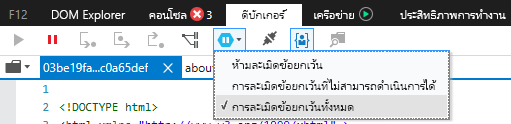
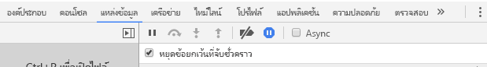

# <a name="how-to-debug-power-bi-visuals"></a><span data-ttu-id="ca44c-104">วิธีการแก้ไขจุดบกพร่องของการแสดงผลด้วยภาพของ Power BI</span><span class="sxs-lookup"><span data-stu-id="ca44c-104">How to debug Power BI visuals</span></span>

<span data-ttu-id="ca44c-105">หน้านี้แสดงเคล็ดลับบางอย่างสำหรับการแก้ไขจุดบกพร่องในขณะที่สร้างการแสดงด้วยภาพของคุณ</span><span class="sxs-lookup"><span data-stu-id="ca44c-105">This page shows some tips for debugging while building your visual.</span></span> <span data-ttu-id="ca44c-106">ซึ่งประกอบด้วยขั้นตอนพื้นฐานและแสดงความแตกต่างระหว่างแอปพลิเคชัน frontend มาตรฐานและการแก้ไขจุดบกพร่องของการแสดงผลด้วยภาพของ Power BI</span><span class="sxs-lookup"><span data-stu-id="ca44c-106">It includes basic steps and shows differences between standard frontend applications and Power BI visual's debugging.</span></span>
<span data-ttu-id="ca44c-107">หลังจากอ่านบทความ คุณจะสามารถแก้ไขจุดบกพร่องของวิชวล Power BI โดยใช้จุดสั่งหยุด ข้อยกเว้นการบันทึก และตรวจจับข้อยกเว้นใน Chrome และ Microsoft Edge</span><span class="sxs-lookup"><span data-stu-id="ca44c-107">After reading the article you will be able to debug Power BI visuals using breakpoints, log exceptions, and catch exceptions in Chrome and Edge.</span></span>

## <a name="using-breakpoints"></a><span data-ttu-id="ca44c-108">การใช้จุดสั่งหยุด</span><span class="sxs-lookup"><span data-stu-id="ca44c-108">Using breakpoints</span></span>

<span data-ttu-id="ca44c-109">เนื่องจาก JavaScript ของการแสดงผลด้วยภาพจะโหลดทุกครั้งที่มีการอัปเดตแอปจุดสั่งหยุดใด ๆ ที่คุณเพิ่มจะหายไปเมื่อมีการรีเฟรชการแก้ไขจุดบกพร่องการแสดงผลด้วยภาพ</span><span class="sxs-lookup"><span data-stu-id="ca44c-109">As the visual's JavaScript is entirely reloaded every time the visual is updated, any breakpoints you add will be lost when the debug visual is refreshed.</span></span> <span data-ttu-id="ca44c-110">เนื่องจากเป็นวิธีการแก้ไข ให้ใช้คำสั่ง `debugger` ในรหัสของคุณ</span><span class="sxs-lookup"><span data-stu-id="ca44c-110">As a workaround, use `debugger` statements in your code.</span></span> <span data-ttu-id="ca44c-111">ระบบขอแนะนำให้ปิดการโหลดอัตโนมัติในขณะที่ใช้ `debugger` ในรหัสของคุณ</span><span class="sxs-lookup"><span data-stu-id="ca44c-111">It's recommended to turn off auto reload while using `debugger` in your code.</span></span>

```typescript
public update(options: VisualUpdateOptions) {
    console.log('Visual update', options);
    debugger;
    this.target.innerHTML = `<p>Update count: <em>${(this.updateCount</em></p>`;
}
```


## <a name="showing-exceptions"></a><span data-ttu-id="ca44c-112">แสดงข้อยกเว้น</span><span class="sxs-lookup"><span data-stu-id="ca44c-112">Showing exceptions</span></span>

<span data-ttu-id="ca44c-113">เมื่อทำงานกับการแสดงผลด้วยภาพของคุณ คุณจะสังเกตเห็นว่าข้อผิดพลาดทั้งหมด 'ถูกใช้ไป' โดยบริการของ Power BI</span><span class="sxs-lookup"><span data-stu-id="ca44c-113">When working on your visual, you'll notice that all errors are 'consumed' by the Power BI service.</span></span> <span data-ttu-id="ca44c-114">นี่คือฟีเจอร์ที่จงใจของ Power BI เพื่อป้องกันไม่ให้การแสดงผลด้วยภาพที่ไม่เหมาะสมทำให้แอปทั้งหมดไม่เสถียร</span><span class="sxs-lookup"><span data-stu-id="ca44c-114">This is an intentional feature of Power BI to prevent misbehaving visuals from causing the entire app to become unstable.</span></span>

<span data-ttu-id="ca44c-115">เนื่องจากเป็นวิธีการแก้ไข โปรดเพิ่มรหัสเพื่อจับและบันทึกข้อยกเว้นของคุณ หรือตั้งค่าตัวแก้ไขจุดบกพร่องของคุณเพื่อแบ่งข้อยกเว้นที่ถูกจับ</span><span class="sxs-lookup"><span data-stu-id="ca44c-115">As a workaround, add code to catch and log your exceptions, or set your debugger to break on caught exceptions.</span></span>


## <a name="log-exceptions"></a><span data-ttu-id="ca44c-116">ข้อยกเว้นของรายการบันทึก</span><span class="sxs-lookup"><span data-stu-id="ca44c-116">Log exceptions</span></span>

<span data-ttu-id="ca44c-117">หากต้องการบันทึกข้อยกเว้นในการแสดงผลด้วยภาพของ Power BI ของคุณ ให้เพิ่มรหัสต่อไปนี้ลงในการแสดงผลด้วยภาพเพื่อกำหนดมัณฑนาการบันทึกข้อยกเว้น</span><span class="sxs-lookup"><span data-stu-id="ca44c-117">To log exceptions in your Power BI visual, add the following code to your visual, to define an exception logging decorator.</span></span>

```typescript
export function logExceptions(): MethodDecorator {
    return function (target: Object, propertyKey: string, descriptor: TypedPropertyDescriptor<any>): TypedPropertyDescriptor<any> {
        return {
            value: function () {
                try {
                    return descriptor.value.apply(this, arguments);
                } catch (e) {
                    console.error(e);
                    throw e;
                }
            }
        }
    }
}
```
<span data-ttu-id="ca44c-118">จากนั้น คุณจะสามารถใช้มัณฑนานี้บนฟังก์ชันใดๆ เพื่อดูการบันทึกข้อผิดพลาดได้</span><span class="sxs-lookup"><span data-stu-id="ca44c-118">Then, you can use this decorator on any function to see error logging.</span></span>

```typescript
@logExceptions()
public update(options: VisualUpdateOptions) {
```

## <a name="break-on-exceptions"></a><span data-ttu-id="ca44c-119">แบ่งข้อยกเว้น</span><span class="sxs-lookup"><span data-stu-id="ca44c-119">Break on exceptions</span></span>

<span data-ttu-id="ca44c-120">คุณยังสามารถตั้งค่าเบราว์เซอร์เพื่อแบ่งข้อยกเว้นที่ถูกจับได้</span><span class="sxs-lookup"><span data-stu-id="ca44c-120">You can also set the browser to break on caught exceptions.</span></span> <span data-ttu-id="ca44c-121">การดำเนินการนี้จะเป็นการหยุดการทำงานของรหัสที่มีข้อผิดพลาดเกิดขึ้น และช่วยให้คุณสามารถแก้จุดบกพร่องที่นั่นได้เลย</span><span class="sxs-lookup"><span data-stu-id="ca44c-121">This'll stop code execution wherever an error happens, and allow you to debug from there.</span></span>

### <a name="edge"></a><span data-ttu-id="ca44c-122">Edge</span><span class="sxs-lookup"><span data-stu-id="ca44c-122">Edge</span></span>

1. <span data-ttu-id="ca44c-123">เปิดเครื่องมือสำหรับนักพัฒนา (F12)</span><span class="sxs-lookup"><span data-stu-id="ca44c-123">Open developer tools (F12).</span></span>
2. <span data-ttu-id="ca44c-124">ไปที่แท็บ **ตัวแก้ไขจุดบกพร่อง**</span><span class="sxs-lookup"><span data-stu-id="ca44c-124">Go to the **Debugger** tab.</span></span>
3. <span data-ttu-id="ca44c-125">คลิกที่ไอคอน **แบ่งส่วนข้อยกเว้น** (รูปหกเหลี่ยมที่มีสัญลักษณ์หยุดชั่วคราว)</span><span class="sxs-lookup"><span data-stu-id="ca44c-125">Click the **break on exceptions** icon (hexagon with a pause symbol).</span></span>
4. <span data-ttu-id="ca44c-126">เลือก **แบ่งส่วนข้อยกเว้นทั้งหมด**</span><span class="sxs-lookup"><span data-stu-id="ca44c-126">Select **Break on all exceptions**.</span></span>



## <a name="chrome"></a><span data-ttu-id="ca44c-128">Chrome</span><span class="sxs-lookup"><span data-stu-id="ca44c-128">Chrome</span></span>

1. <span data-ttu-id="ca44c-129">เปิดเครื่องมือสำหรับนักพัฒนา (F12)</span><span class="sxs-lookup"><span data-stu-id="ca44c-129">Open developer tools (F12).</span></span>
2. <span data-ttu-id="ca44c-130">ไปที่แท็บ **แหล่งที่มา**</span><span class="sxs-lookup"><span data-stu-id="ca44c-130">Go to the  **Sources** tab.</span></span>
3. <span data-ttu-id="ca44c-131">คลิกที่ไอคอน **แบ่งส่วนข้อยกเว้น** (รูปหกเหลี่ยมที่มีสัญลักษณ์หยุดชั่วคราว)</span><span class="sxs-lookup"><span data-stu-id="ca44c-131">Click the **break on exceptions** icon (stop sign with a pause symbol).</span></span>
4. <span data-ttu-id="ca44c-132">เลือกกล่องกาเครื่องหมาย **หยุดชั่วคราวบนข้อยกเว้นที่ถูกจับ**</span><span class="sxs-lookup"><span data-stu-id="ca44c-132">Select the **Pause On Caught Exceptions** check box.</span></span>



## <a name="next-steps"></a><span data-ttu-id="ca44c-134">ขั้นตอนถัดไป</span><span class="sxs-lookup"><span data-stu-id="ca44c-134">Next steps</span></span>
* [<span data-ttu-id="ca44c-135">แก้ปัญหาการแสดงผลด้วยภาพของ Power BI</span><span class="sxs-lookup"><span data-stu-id="ca44c-135">Troubleshoot Power BI visuals</span></span>](power-bi-custom-visuals-troubleshoot.md)
* <span data-ttu-id="ca44c-136">สำหรับข้อมูลเพิ่มเติมและคำตอบที่คุณอยากรู้  โปรดเยี่ยมชม[คำถามที่ถามบ่อยเกี่ยวกับการแสดงผลด้วยภาพของ Power BI](power-bi-custom-visuals-faq.md#organizational-power-bi-visuals)</span><span class="sxs-lookup"><span data-stu-id="ca44c-136">For more information and answers to questions, visit [Frequently asked questions about Power BI visuals](power-bi-custom-visuals-faq.md#organizational-power-bi-visuals)</span></span>
