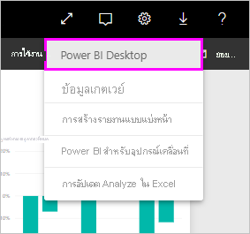
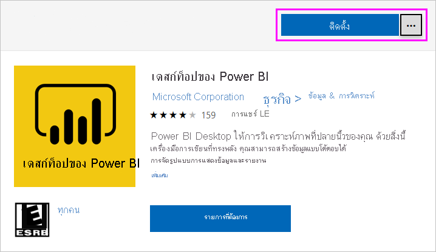
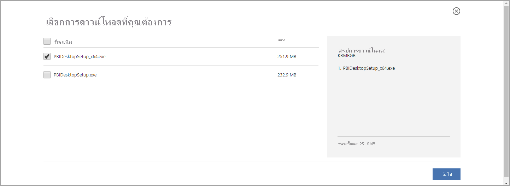
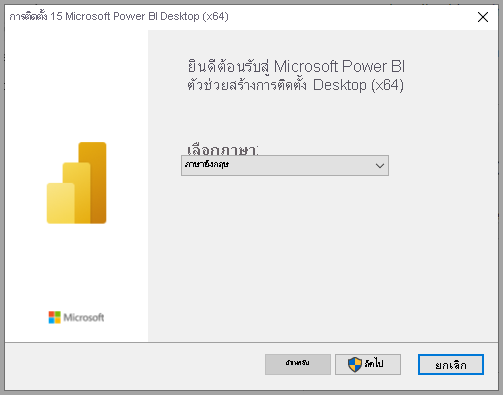
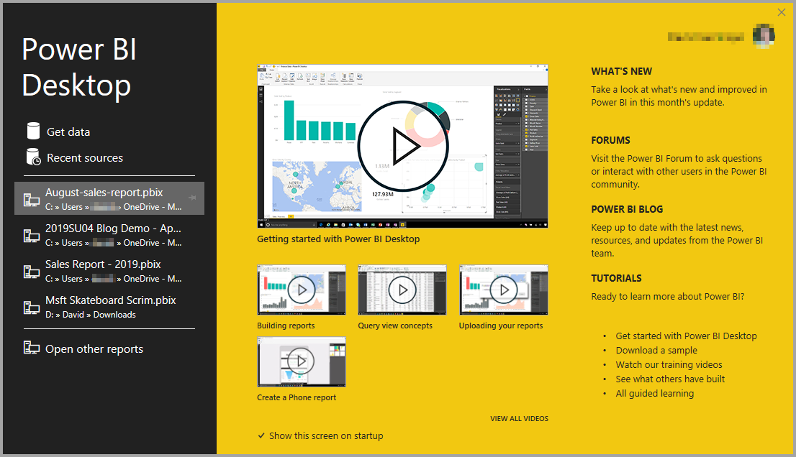

# <a name="get-power-bi-desktop"></a><span data-ttu-id="03768-103">รับ Power BI Desktop</span><span class="sxs-lookup"><span data-stu-id="03768-103">Get Power BI Desktop</span></span>
<span data-ttu-id="03768-104">Power BI Desktop ช่วยให้คุณสร้างแบบสอบถามขั้นสูง โมเดล และรายงานที่แสดงข้อมูลเป็นภาพ</span><span class="sxs-lookup"><span data-stu-id="03768-104">Power BI Desktop lets you build advanced queries, models, and reports that visualize data.</span></span> <span data-ttu-id="03768-105">เมื่อใช้ Power BI Desktop คุณสามารถสร้างโมเดลข้อมูล สร้างรายงาน และแชร์งานของคุณโดยการเผยแพร่ไปยังบริการของ Power BI ได้</span><span class="sxs-lookup"><span data-stu-id="03768-105">With Power BI Desktop, you can build data models, create reports, and share your work by publishing to the Power BI service.</span></span> <span data-ttu-id="03768-106">Power BI Desktop มีให้ดาวน์โหลดฟรี</span><span class="sxs-lookup"><span data-stu-id="03768-106">Power BI Desktop is a free download.</span></span>

<span data-ttu-id="03768-107">คุณสามารถรับ Power BI Desktop ได้สองวิธี ซึ่งจะอธิบายไว้ในส่วนต่อไป:</span><span class="sxs-lookup"><span data-stu-id="03768-107">You can get Power BI Desktop in two ways, each of which is described in the following sections:</span></span>

* <span data-ttu-id="03768-108">[ติดตั้งเป็นแอปจาก Microsoft Store](#install-as-an-app-from-the-microsoft-store)</span><span class="sxs-lookup"><span data-stu-id="03768-108">[Install as an app from the Microsoft Store](#install-as-an-app-from-the-microsoft-store).</span></span>
* <span data-ttu-id="03768-109">[ดาวน์โหลดโดยตรง เป็นการปฏิบัติการที่คุณดาวน์โหลด และติดตั้งบนคอมพิวเตอร์ของคุณ](#download-power-bi-desktop-directly)</span><span class="sxs-lookup"><span data-stu-id="03768-109">[Download directly, as an executable you download and install on your computer](#download-power-bi-desktop-directly).</span></span>

<span data-ttu-id="03768-110">ไม่ว่าจะติดตั้งวิธีใด จะได้รับ Power BI Desktop เวอร์ชันล่าสุดในคอมพิวเตอร์ของคุณ แต่มีความแตกต่างบางอย่างที่ควรทราบ ซึ่งจะอธิบายในส่วนต่อไปนี้</span><span class="sxs-lookup"><span data-stu-id="03768-110">Either approach gets the latest version of Power BI Desktop onto your computer, but there are some differences worth noting, as described in the following sections.</span></span>


> [!IMPORTANT]
> <span data-ttu-id="03768-111">มีการอัปเดตและเผยแพร่ Power BI Desktop เป็นประจำทุกเดือน ซึ่งจะรวมคำติชมของลูกค้าและคุณสมบัติใหม่ด้วย</span><span class="sxs-lookup"><span data-stu-id="03768-111">Power BI Desktop is updated and released on a monthly basis, incorporating customer feedback and new features.</span></span> <span data-ttu-id="03768-112">รองรับเฉพาะเวอร์ชันล่าสุดของ Power BI Desktop เท่านั้น ซึ่งฝ่ายสนับสนุนสำหรับ Power BI Desktop จะขอให้ลูกค้าที่ติดต่อมาอัปเกรดเป็นเวอร์ชันล่าสุด</span><span class="sxs-lookup"><span data-stu-id="03768-112">Only the most recent version of Power BI Desktop is supported; customers who contact support for Power BI Desktop will be asked to upgrade to the most recent version.</span></span> <span data-ttu-id="03768-113">คุณสามารถดาวน์โหลด Power BI Desktop เวอร์ชันล่าสุดได้จาก [Windows Store](https://aka.ms/pbidesktopstore) หรือไฟล์ปฏิบัติการเดียวซึ่งมีภาษาที่รองรับทั้งหมดที่คุณ[ดาวน์โหลด](https://www.microsoft.com/download/details.aspx?id=58494)และติดตั้งบนคอมพิวเตอร์ของคุณ</span><span class="sxs-lookup"><span data-stu-id="03768-113">You can get the most recent version of Power BI Desktop from the [Windows Store](https://aka.ms/pbidesktopstore), or as a single executable containing all supported languages that you [download](https://www.microsoft.com/download/details.aspx?id=58494) and install on your computer.</span></span>


## <a name="install-as-an-app-from-the-microsoft-store"></a><span data-ttu-id="03768-114">ติดตั้งเป็นแอปจาก Microsoft Store</span><span class="sxs-lookup"><span data-stu-id="03768-114">Install as an app from the Microsoft Store</span></span>
<span data-ttu-id="03768-115">มีสองสามวิธีในการเข้าถึง Power BI Desktop เวอร์ชันล่าสุดจาก Microsoft Store</span><span class="sxs-lookup"><span data-stu-id="03768-115">There are a few ways to access the most recent version of Power BI Desktop from the Microsoft Store.</span></span> 

1. <span data-ttu-id="03768-116">ใช้หนึ่งในตัวเลือกต่อไปนี้เพื่อเปิดหน้า **Power BI Desktop** ของ Microsoft Store:</span><span class="sxs-lookup"><span data-stu-id="03768-116">Use one of the following options to open the **Power BI Desktop** page of the Microsoft Store:</span></span>

   - <span data-ttu-id="03768-117">เปิดเบราวเซอร์แล้วไปยังหน้า [Power BI Desktop](https://aka.ms/pbidesktopstore) ของ Microsoft Store โดยตรง</span><span class="sxs-lookup"><span data-stu-id="03768-117">Open a browser and go directly to the [Power BI Desktop page](https://aka.ms/pbidesktopstore) of the Microsoft Store.</span></span>

    - <span data-ttu-id="03768-118">จาก [บริการของ Power BI](./service-get-started.md)ให้เลือกไอคอน **ดาวน์โหลด** จากมุมบนขวาแล้วเลือก **Power BI Desktop**.</span><span class="sxs-lookup"><span data-stu-id="03768-118">From the [Power BI service](./service-get-started.md), select the **Download** icon from the upper right corner, and then select **Power BI Desktop**.</span></span>

      

   - <span data-ttu-id="03768-120">ไปที่ [่หน้าผลิตภัณฑ์ Power BI Desktop](https://powerbi.microsoft.com/desktop/) จากนั้นเลือก **ดาวน์โหลดฟรี**</span><span class="sxs-lookup"><span data-stu-id="03768-120">Go to the [Power BI Desktop product page](https://powerbi.microsoft.com/desktop/), and then select **Download Free**.</span></span>
  
2. <span data-ttu-id="03768-121">หลังจากที่คุณไปถึงหน้า **Power BI Desktop** ของ Microsoft Store แล้ว ให้เลือก **ติดตั้ง**</span><span class="sxs-lookup"><span data-stu-id="03768-121">After you've landed on the **Power BI Desktop** page of the Microsoft Store, select **Install**.</span></span>

     

<span data-ttu-id="03768-123">มีข้อดีบางประการในการรับ Power BI Desktop จาก Microsoft Store:</span><span class="sxs-lookup"><span data-stu-id="03768-123">There are a few advantages to getting Power BI Desktop from the Microsoft Store:</span></span>

* <span data-ttu-id="03768-124">**การอัปเดตอัตโนมัติ**: Windows จะดาวน์โหลดเวอร์ชันล่าสุดในพื้นหลังโดยอัตโนมัติทันทีที่มี ดังนั้นเวอร์ชันของคุณจะเป็นเวอร์ชันล่าสุดเสมอ</span><span class="sxs-lookup"><span data-stu-id="03768-124">**Automatic updates**: Windows downloads the latest version automatically in the background as soon as it's available, so your version will always be up to date.</span></span>
* <span data-ttu-id="03768-125">**การดาวน์โหลดขนาดเล็กกว่า**: Microsoft Store ช่วยให้มั่นใจว่า เฉพาะคอมโพเนนต์ที่มีการเปลี่ยนแปลงในการอัปเดตแต่ละครั้ง จะถูกดาวน์โหลดลงเครื่องของคุณ ดาวน์โหลดจึงมีขนาดเล็กกว่าสำหรับแต่ละอัปเดต</span><span class="sxs-lookup"><span data-stu-id="03768-125">**Smaller downloads**: Microsoft Store ensures only components that have changed in each update are downloaded to your machine, resulting in smaller downloads for each update.</span></span>
* <span data-ttu-id="03768-126">**ไม่จำเป็นต้องมีสิทธิ์ของผู้ดูแลระบบ**: เมื่อคุณดาวน์โหลดแพคเกจโดยตรงและติดตั้ง คุณต้องเป็นผู้ดูแลระบบเพื่อให้การติดตั้งสำเร็จ</span><span class="sxs-lookup"><span data-stu-id="03768-126">**Admin privilege isn't required**: When you download the package directly and install it, you must be an administrator for the installation to complete successfully.</span></span> <span data-ttu-id="03768-127">เมื่อคุณรับ Power BI Desktop จาก Microsoft Store *ไม่จำเป็นต้องมีสิทธิ์* ของผู้ดูแลระบบ</span><span class="sxs-lookup"><span data-stu-id="03768-127">If you get Power BI Desktop from the Microsoft Store, admin privilege is *not* required.</span></span>
* <span data-ttu-id="03768-128">**การเปิดใช้งานการเผยแพร่ IT**: เมื่อใช้งาน Microsoft Store สำหรับธุรกิจ คุณสามารถปรับใช้งานได้อย่างง่ายดายมากขึ้นหรือ *เผยแพร่* Power BI Desktop ให้กับทุกคนในองค์กรของคุณ</span><span class="sxs-lookup"><span data-stu-id="03768-128">**IT roll-out enabled**: Through the Microsoft Store for Business, you can more easily deploy, or *roll out*, Power BI Desktop to everyone in your organization</span></span>

* <span data-ttu-id="03768-129">**การตรวจจับภาษา**: เวอร์ชัน Microsoft Store มีภาษาที่รองรับทั้งหมดและตรวจสอบภาษาที่ใช้ในคอมพิวเตอร์ของคุณในแต่ละครั้งที่มีการเปิดตัว</span><span class="sxs-lookup"><span data-stu-id="03768-129">**Language detection**: The Microsoft Store version includes all supported languages, and checks the language used on your computer each time it's launched.</span></span> <span data-ttu-id="03768-130">การสนับสนุนภาษานี้ยังส่งผลต่อการแปลแบบจำลองที่สร้างขึ้นใน Power BI Desktop</span><span class="sxs-lookup"><span data-stu-id="03768-130">This language support also affects the localization of models created in Power BI Desktop.</span></span> <span data-ttu-id="03768-131">ตัวอย่างเช่น ลำดับขั้นวันที่ที่มีอยู่ภายในตรงกับภาษาที่ Power BI Desktop กำลังใช้งานเมื่อมีการสร้างไฟล์ .pbix</span><span class="sxs-lookup"><span data-stu-id="03768-131">For example, built-in date hierarchies match the language that Power BI Desktop is using when the .pbix file is created.</span></span>

<span data-ttu-id="03768-132">การพิจารณาและข้อจำกัดต่อไปนี้จะนำไปใช้เมื่อคุณติดตั้ง Power BI Desktop จาก Microsoft Store:</span><span class="sxs-lookup"><span data-stu-id="03768-132">The following consideration and limitations apply when you install Power BI Desktop from the Microsoft Store:</span></span>

* <span data-ttu-id="03768-133">ถ้าคุณใช้ตัวเชื่อมต่อ SAP คุณอาจต้องย้ายไฟล์โปรแกรมควบคุม SAP ของคุณไปยังโฟลเดอร์ *Windows\System32*</span><span class="sxs-lookup"><span data-stu-id="03768-133">If you use the SAP connector, you may need to move your SAP driver files to the *Windows\System32* folder.</span></span>
* <span data-ttu-id="03768-134">การติดตั้ง Power BI Desktop จาก Microsoft Store ไม่คัดลอกการตั้งค่าผู้ใช้จากเวอร์ชัน .exe</span><span class="sxs-lookup"><span data-stu-id="03768-134">Installing Power BI Desktop from the Microsoft Store doesn't copy user settings from the .exe version.</span></span> <span data-ttu-id="03768-135">คุณอาจต้องเชื่อมต่อใหม่กับแหล่งข้อมูลที่คุณเชื่อมต่อเมื่อเร็ว ๆ นี้ และใส่ข้อมูลประจำตัวของแหล่งข้อมูลของคุณอีกครั้ง</span><span class="sxs-lookup"><span data-stu-id="03768-135">You might have to reconnect to your recent datasources and reenter your data source credentials.</span></span> 

> [!NOTE]
> <span data-ttu-id="03768-136">Power BI Desktop รุ่นเซิร์ฟเวอร์รายงาน Power BI เป็นเวอร์ชันที่ติดตั้งแยกต่างหากและแตกต่างจากเวอร์ชันที่อธิบายในบทความนี้</span><span class="sxs-lookup"><span data-stu-id="03768-136">The Power BI Report Server version of Power BI Desktop is a separate and different installation from the versions discussed in this article.</span></span> <span data-ttu-id="03768-137">สำหรับข้อมูลเกี่ยวกับ Power BI Desktop เวอร์ชันเซิร์ฟเวอร์รายงาน ดูบทความ [สร้างรายงาน Power BI สำหรับเซิร์ฟเวอร์รายงาน Power BI](../report-server/quickstart-create-powerbi-report.md)</span><span class="sxs-lookup"><span data-stu-id="03768-137">For information about the Report Server version of Power BI Desktop, see [Create a Power BI report for Power BI Report Server](../report-server/quickstart-create-powerbi-report.md).</span></span>
> 
> 

## <a name="download-power-bi-desktop-directly"></a><span data-ttu-id="03768-138">ดาวน์โหลด Power BI Desktop โดยตรง</span><span class="sxs-lookup"><span data-stu-id="03768-138">Download Power BI Desktop directly</span></span>
  
  <span data-ttu-id="03768-139">การดาวน์โหลด Power BI Desktop สามารถทำได้จาก ศูนย์ดาวน์โหลด เลือก **ดาวน์โหลด** จากหน้า [ศูนย์ดาวน์โหลด](https://www.microsoft.com/download/details.aspx?id=58494)</span><span class="sxs-lookup"><span data-stu-id="03768-139">To download the Power BI Desktop executable from the Download Center, select **Download** from the [Download Center page](https://www.microsoft.com/download/details.aspx?id=58494).</span></span> <span data-ttu-id="03768-140">จากนั้นระบุไฟล์การติดตั้งเพื่อดาวน์โหลด 32 บิต หรือ 64 บิต</span><span class="sxs-lookup"><span data-stu-id="03768-140">Then, specify a 32-bit or 64-bit installation file to download.</span></span>

  

### <a name="install-power-bi-desktop-after-downloading-it"></a><span data-ttu-id="03768-142">ติดตั้ง Power BI Desktop หลังจากดาวน์โหลดแล้ว</span><span class="sxs-lookup"><span data-stu-id="03768-142">Install Power BI Desktop after downloading it</span></span>
<span data-ttu-id="03768-143">คุณจะได้รับพร้อมท์ให้เรียกใช้ไฟล์การติดตั้งหลังจากที่คุณดาวน์โหลดเสร็จแล้ว</span><span class="sxs-lookup"><span data-stu-id="03768-143">You're prompted to run the installation file after you've finished downloading it.</span></span>

<span data-ttu-id="03768-144">เริ่มต้นด้วยการวางจำหน่ายในเดือนกรกฎาคม 2019 Power BI Desktop มาพร้อมกับแพคเกจการติดตั้ง .exe เดียวที่มีภาษาที่รองรับทั้งหมด พร้อมกับไฟล์ .exe แยกต่างหากสำหรับเวอร์ชัน 32 บิต และ 64 บิต</span><span class="sxs-lookup"><span data-stu-id="03768-144">Beginning with the July 2019 release, Power BI Desktop ships as a single .exe installation package that contains all supported languages, with a separate .exe file for the 32-bit and 64-bit versions.</span></span> <span data-ttu-id="03768-145">แพคเกจ .msi นั้นถูกยกเลิกไป โดยเริ่มต้นด้วยการวางจำหน่ายในเดือนกันยายน 2019 ซึ่งจำเป็นต้องใช้ .exe สำหรับการติดตั้ง</span><span class="sxs-lookup"><span data-stu-id="03768-145">The .msi packages are discontinued beginning with the September 2019 release, requiring the .exe executable for installation.</span></span> <span data-ttu-id="03768-146">วิธีนี้จะทำให้การแจกจ่าย การอัปเดต และการติดตั้ง (โดยเฉพาะสำหรับผู้ดูแลระบบ) ง่ายและสะดวกยิ่งขึ้น</span><span class="sxs-lookup"><span data-stu-id="03768-146">This approach makes distribution, updates, and installation (especially for administrators) much easier and more convenient.</span></span> <span data-ttu-id="03768-147">นอกจากนี้ คุณยังสามารถใช้พารามิเตอร์บรรทัดคำสั่งเพื่อกำหนดกระบวนการติดตั้งเองดังที่อธิบายไว้ใน [ตัวเลือกการใช้บรรทัดคำสั่งระหว่างการติดตั้ง](#using-command-line-options-during-installation)</span><span class="sxs-lookup"><span data-stu-id="03768-147">You can also use command-line parameters to customize the installation process, as described in [Using command-line options during installation](#using-command-line-options-during-installation).</span></span>

<span data-ttu-id="03768-148">หลังจากที่คุณเปิดใช้งานแพคเกจการติดตั้ง Power BI Desktop จะติดตั้งเป็นแอปพลิเคชันและทำงานบนเดสก์ท็อปของคุณ</span><span class="sxs-lookup"><span data-stu-id="03768-148">After you launch the installation package, Power BI Desktop installs as an application and runs on your desktop.</span></span>



> [!NOTE]
> <span data-ttu-id="03768-150">ไม่รองรับการติดตั้งเวอร์ชันดาวน์โหลด (MSI) (ไม่รองรับ) และเวอร์ชัน Microsoft Store ของ Power BI Desktop บนคอมพิวเตอร์เครื่องเดียวกัน (ในบางครั้งเรียกว่าการติดตั้ง *ข้างกัน*)</span><span class="sxs-lookup"><span data-stu-id="03768-150">Installing the downloaded (MSI) version (deprecated), and the Microsoft Store version of Power BI Desktop on the same computer (sometimes referred to as a *side-by-side* installation) is not supported.</span></span> <span data-ttu-id="03768-151">ถอนการติดตั้ง Power BI Desktop ด้วยตนเองก่อนที่คุณจะดาวน์โหลดจาก Microsoft Store</span><span class="sxs-lookup"><span data-stu-id="03768-151">Manually uninstall Power BI Desktop before you download it from the Microsoft Store.</span></span>
> 

## <a name="using-power-bi-desktop"></a><span data-ttu-id="03768-152">การใช้ Power BI Desktop</span><span class="sxs-lookup"><span data-stu-id="03768-152">Using Power BI Desktop</span></span>
<span data-ttu-id="03768-153">เมื่อคุณเรียกใช้ Power BI Desktop หน้าจอยินดีต้อนรับจะแสดงขึ้นมา</span><span class="sxs-lookup"><span data-stu-id="03768-153">When you launch Power BI Desktop, a welcome screen is displayed.</span></span>



<span data-ttu-id="03768-155">ถ้าคุณกำลังใช้ Power BI Desktop เป็นครั้งแรก (ซึ่งหมายถึงการติดตั้งไม่ใช่การอัปเกรด) คุณจะได้รับพร้อมท์ให้กรอกแบบฟอร์มหรือลงชื่อเข้าใช้ในบริการของ Power BI ก่อนที่คุณจะสามารถดำเนินการต่อได้</span><span class="sxs-lookup"><span data-stu-id="03768-155">If you're using Power BI Desktop for the first time (that is, the installation isn't an upgrade), you're prompted to fill out a form or sign in to the Power BI service before you can continue.</span></span>

<span data-ttu-id="03768-156">จากนั้น คุณสามารถสร้างรูปแบบข้อมูล หรือรายงาน แล้วแชร์ให้กับผู้อื่นบนบริการของ Power BI</span><span class="sxs-lookup"><span data-stu-id="03768-156">From there, you can begin creating data models or reports, then share them with others on the Power BI service.</span></span> <span data-ttu-id="03768-157">ดูส่วน [ขั้นตอนถัดไป](#next-steps) เพื่อลิงก์ไปยังคำแนะนำเพื่อช่วยให้คุณเริ่มต้นใช้ Power BI Desktop</span><span class="sxs-lookup"><span data-stu-id="03768-157">Check out the [Next steps](#next-steps) section for links to guides to help you get started using Power BI Desktop.</span></span>

## <a name="minimum-requirements"></a><span data-ttu-id="03768-158">ข้อกำหนดขั้นต่ำ</span><span class="sxs-lookup"><span data-stu-id="03768-158">Minimum requirements</span></span>
<span data-ttu-id="03768-159">รายการต่อไปนี้คือข้อกำหนดขั้นต่ำเพื่อเรียกใช้ Power BI Desktop:</span><span class="sxs-lookup"><span data-stu-id="03768-159">The following list provides the minimum requirements to run Power BI Desktop:</span></span>

> [!IMPORTANT]
> <span data-ttu-id="03768-160">Power BI Desktop จะไม่ได้รับการสนับสนุนใน Windows 7 อีกต่อไปหลังจากวันที่31มกราคม 2021</span><span class="sxs-lookup"><span data-stu-id="03768-160">Power BI Desktop will no longer be supported on Windows 7 after January 31st, 2021.</span></span> <span data-ttu-id="03768-161">หลังจากวันที่ดังกล่าว Power BI Desktop จะได้รับการสนับสนุนบน Windows 8 หรือ Windows รุ่นที่ใหม่กว่า สำหรับ Power BI Desktop รุ่นที่เผยแพร่ล่าสุดเท่านั้น</span><span class="sxs-lookup"><span data-stu-id="03768-161">After that date, Power BI Desktop will be supported on Windows 8 or newer versions of Windows, for the most recent release of Power BI Desktop only.</span></span> 

* <span data-ttu-id="03768-162">Windows 7 / Windows Server 2008 R2 หรือใหม่กว่า</span><span class="sxs-lookup"><span data-stu-id="03768-162">Windows 7 / Windows Server 2008 R2, or later</span></span>
* <span data-ttu-id="03768-163">.NET 4.6.2</span><span class="sxs-lookup"><span data-stu-id="03768-163">.NET 4.6.2</span></span>
* <span data-ttu-id="03768-164">Internet Explorer 10 หรือใหม่กว่า</span><span class="sxs-lookup"><span data-stu-id="03768-164">Internet Explorer 10 or later</span></span>
* <span data-ttu-id="03768-165">หน่วยความจำ (RAM): มีหน่วยความจำว่างอย่างน้อย 1 GB, แนะนำ 1.5 GB หรือมากกว่า</span><span class="sxs-lookup"><span data-stu-id="03768-165">Memory (RAM): At least 1 GB available, 1.5 GB or more recommended.</span></span>
* <span data-ttu-id="03768-166">การแสดงผล: ต้องมีขนาดอย่างน้อย 1440x900 หรือ 1600x900 (16:9)</span><span class="sxs-lookup"><span data-stu-id="03768-166">Display: At least 1440x900 or 1600x900 (16:9) required.</span></span> <span data-ttu-id="03768-167">ระบบไม่รองรับความละเอียดที่ต่ำกว่า เช่น 1024x768 หรือ 1280x800 เพราะตัวควบคุมบางอย่าง (เช่น การปิดหน้าจอเริ่มต้น) จะแสดงเกินความละเอียดเหล่านี้</span><span class="sxs-lookup"><span data-stu-id="03768-167">Lower resolutions such as 1024x768 or 1280x800 aren't supported, as certain controls (such as closing the startup screen) display beyond those resolutions.</span></span>
* <span data-ttu-id="03768-168">การตั้งค่าการแสดงผลของ Windows: ถ้าคุณตั้งค่าการแสดงผลของคุณเพื่อเปลี่ยนขนาดของข้อความ แอป และรายการอื่น ๆ ให้มีค่ามากกว่า 100% คุณอาจไม่สามารถเห็นกล่องโต้ตอบบางอย่างที่คุณต้องโต้ตอบด้วยเพื่อใช้งาน Power BI Desktop ต่อไป</span><span class="sxs-lookup"><span data-stu-id="03768-168">Windows display settings: If you set your display settings to change the size of text, apps, and other items to more than 100%, you may not be able to see certain dialogs that you must interact with to continue using Power BI Desktop.</span></span> <span data-ttu-id="03768-169">ถ้าคุณพบปัญหานี้ ตรวจสอบการตั้งค่าการแสดงผลของคุณใน Windows โดยไปที่ **การตั้งค่า**  >  **ระบบ**  >  **การแสดงผล** และใช้แถบเลื่อนเพื่อกลับไปตั้งค่าการแสดงผลเป็น 100%</span><span class="sxs-lookup"><span data-stu-id="03768-169">If you encounter this issue, check your display settings in Windows by going to **Settings** > **System** > **Display**, and use the slider to return display settings to 100%.</span></span>
* <span data-ttu-id="03768-170">CPU: แนะนำให้ใช้ CPU 1 กิกะเฮิรตซ์ (GHz) 64 บิต (x64)</span><span class="sxs-lookup"><span data-stu-id="03768-170">CPU: 1 gigahertz (GHz) 64-bit (x64) processor recommended.</span></span>

> [!NOTE]
> <span data-ttu-id="03768-171">เราขอแนะนำให้ใช้ Windows รุ่นไคลเอ็นต ์เช่น Windows 10 มากกว่า Windows Server</span><span class="sxs-lookup"><span data-stu-id="03768-171">We recommend using a client version of Windows such as Windows 10, rather than Windows Server.</span></span> <span data-ttu-id="03768-172">ตัวอย่างเช่น Power BI Desktop ไมรองรับการใช้การกำหนดค่าความปลอดภัยขั้นสูงของ Internet Explorer เนื่องจากจะทำให้ Power BI Desktop ไม่สามารถลงชื่อเข้าใช้บริการของ Power BI ได้</span><span class="sxs-lookup"><span data-stu-id="03768-172">For example, Power BI Desktop does not support using Internet Explorer Enhanced Security Configuration as it will stop Power BI Desktop from signing in to the Power BI service.</span></span>

## <a name="considerations-and-limitations"></a><span data-ttu-id="03768-173">ข้อควรพิจารณาและข้อจำกัด</span><span class="sxs-lookup"><span data-stu-id="03768-173">Considerations and limitations</span></span>

<span data-ttu-id="03768-174">เราต้องการให้ประสบการณ์การใช้งาน Power BI Desktop ของคุณดีเยี่ยม</span><span class="sxs-lookup"><span data-stu-id="03768-174">We want your experience with Power BI Desktop to be great.</span></span> <span data-ttu-id="03768-175">เนื่องจากอาจมีโอกาสที่คุณจะประสบปัญหากับ Power BI Desktop ในส่วนนี้จะประกอบด้วยวิธีแก้ไขปัญหาหรือคำแนะนำในการจัดการปัญหาเหล่านี้</span><span class="sxs-lookup"><span data-stu-id="03768-175">Because there may be occasions when you run into an issue with Power BI Desktop, this section contains solutions or suggestions to address these issues.</span></span> 

### <a name="using-command-line-options-during-installation"></a><span data-ttu-id="03768-176">การใช้ตัวเลือกบรรทัดคำสั่งระหว่างการติดตั้ง</span><span class="sxs-lookup"><span data-stu-id="03768-176">Using command-line options during installation</span></span> 

<span data-ttu-id="03768-177">เมื่อคุณติดตั้ง Power BI Desktop คุณสามารถตั้งค่าคุณสมบัติและตัวเลือกด้วยการสลับบรรทัดคำสั่งได้</span><span class="sxs-lookup"><span data-stu-id="03768-177">When you install Power BI Desktop, you can set properties and options with command-line switches.</span></span> <span data-ttu-id="03768-178">การตั้งค่าเหล่านี้จะเป็นประโยชน์โดยเฉพาะอย่างยิ่งสำหรับผู้ดูแลระบบที่จัดการหรืออำนวยความสะดวกในการติดตั้ง Power BI Desktop ในองค์กร</span><span class="sxs-lookup"><span data-stu-id="03768-178">These settings are especially useful for administrators who manage or facilitate the installation of Power BI Desktop across organizations.</span></span> <span data-ttu-id="03768-179">ตัวเลือกเหล่านี้นำไปใช้กับการติดตั้ง .msi และ .exe</span><span class="sxs-lookup"><span data-stu-id="03768-179">These options apply to .msi and .exe installations.</span></span> 


|<span data-ttu-id="03768-180">ตัวเลือกบรรทัดคำสั่ง</span><span class="sxs-lookup"><span data-stu-id="03768-180">Command-line option</span></span>  |<span data-ttu-id="03768-181">พฤติกรรม</span><span class="sxs-lookup"><span data-stu-id="03768-181">Behavior</span></span>  |
|---------|---------|
|<span data-ttu-id="03768-182">-q, -quiet, -s, -silent</span><span class="sxs-lookup"><span data-stu-id="03768-182">-q, -quiet, -s, -silent</span></span>     |<span data-ttu-id="03768-183">ติดตั้ง Silent</span><span class="sxs-lookup"><span data-stu-id="03768-183">Silent install</span></span>         |
|<span data-ttu-id="03768-184">-passive</span><span class="sxs-lookup"><span data-stu-id="03768-184">-passive</span></span>     |<span data-ttu-id="03768-185">แสดงแถบความคืบหน้าเฉพาะในระหว่างการติดตั้ง</span><span class="sxs-lookup"><span data-stu-id="03768-185">Show the progress bar only during installation</span></span>         |
|<span data-ttu-id="03768-186">-norestart</span><span class="sxs-lookup"><span data-stu-id="03768-186">-norestart</span></span>     |<span data-ttu-id="03768-187">ไม่แสดงข้อกำหนดการรีสตาร์ทคอมพิวเตอร์</span><span class="sxs-lookup"><span data-stu-id="03768-187">Suppress the computer restart requirement</span></span>         |
|<span data-ttu-id="03768-188">-forcerestart</span><span class="sxs-lookup"><span data-stu-id="03768-188">-forcerestart</span></span>     |<span data-ttu-id="03768-189">รีสตาร์ทคอมพิวเตอร์หลังจากการติดตั้งโดยไม่มีพร้อมท์</span><span class="sxs-lookup"><span data-stu-id="03768-189">Restart the computer after installation without a prompt</span></span>         |
|<span data-ttu-id="03768-190">-promptrestart</span><span class="sxs-lookup"><span data-stu-id="03768-190">-promptrestart</span></span>     |<span data-ttu-id="03768-191">แจ้งให้ผู้ใช้ทราบหากจำเป็นต้องรีสตาร์ทคอมพิวเตอร์ (ค่าเริ่มต้น)</span><span class="sxs-lookup"><span data-stu-id="03768-191">Prompt the user if computer restart is required (default)</span></span>         |
|<span data-ttu-id="03768-192">-l<>, -log<></span><span class="sxs-lookup"><span data-stu-id="03768-192">-l<>, -log<></span></span>     |<span data-ttu-id="03768-193">บันทึกการติดตั้งไปยังไฟล์ที่เฉพาะเจาะจง ด้วยไฟล์ที่ระบุใน < ></span><span class="sxs-lookup"><span data-stu-id="03768-193">Log the installation to a specific file, with the file specified in <></span></span>         |
|<span data-ttu-id="03768-194">-uninstall</span><span class="sxs-lookup"><span data-stu-id="03768-194">-uninstall</span></span>     |<span data-ttu-id="03768-195">ถอนการติดตั้ง Power BI Desktop</span><span class="sxs-lookup"><span data-stu-id="03768-195">Uninstall Power BI Desktop</span></span>         |
|<span data-ttu-id="03768-196">-repair</span><span class="sxs-lookup"><span data-stu-id="03768-196">-repair</span></span>     |<span data-ttu-id="03768-197">ซ่อมแซมการติดตั้ง (หรือติดตั้งถ้าไม่ได้ติดตั้งอยู่ในขณะนี้)</span><span class="sxs-lookup"><span data-stu-id="03768-197">Repair the installation (or install if it's not currently installed)</span></span>         |
|<span data-ttu-id="03768-198">-package, -update</span><span class="sxs-lookup"><span data-stu-id="03768-198">-package, -update</span></span>     |<span data-ttu-id="03768-199">ติดตั้ง Power BI Desktop (ค่าเริ่มต้น ตราบใดที่ไม่ได้ระบุ -uninstall หรือ -repair)</span><span class="sxs-lookup"><span data-stu-id="03768-199">Install Power BI Desktop (default, as long as -uninstall or -repair aren't specified)</span></span>         |

<span data-ttu-id="03768-200">นอกจากนี้ คุณยังสามารถใช้พารามิเตอร์ไวยากรณต์ต่อไปนี้ ซึ่งระบุด้วยไวยกรณ์ *คุณสมบัติ = ค่า*:</span><span class="sxs-lookup"><span data-stu-id="03768-200">You can also use the following syntax parameters, which you specified with a *property = value* syntax:</span></span>

|<span data-ttu-id="03768-201">พารามิเตอร์</span><span class="sxs-lookup"><span data-stu-id="03768-201">Parameter</span></span>  |<span data-ttu-id="03768-202">ความหมาย</span><span class="sxs-lookup"><span data-stu-id="03768-202">Meaning</span></span>  |
|---------|---------|
|<span data-ttu-id="03768-203">ACCEPT_EULA</span><span class="sxs-lookup"><span data-stu-id="03768-203">ACCEPT_EULA</span></span>     |<span data-ttu-id="03768-204">ต้องมีค่า 1 เพื่อยอมรับ EULA โดยอัตโนมัติ</span><span class="sxs-lookup"><span data-stu-id="03768-204">Requires a value of 1 to automatically accept the EULA</span></span>         |
|<span data-ttu-id="03768-205">ENABLECXP</span><span class="sxs-lookup"><span data-stu-id="03768-205">ENABLECXP</span></span>     |<span data-ttu-id="03768-206">ค่า 1 ที่ลงทะเบียนในโปรแกรมประสบการณ์ของลูกค้าที่บันทึกการวัดและส่งข้อมูลทางไกลเกี่ยวกับการใช้งานผลิตภัณฑ์</span><span class="sxs-lookup"><span data-stu-id="03768-206">A value of 1 enrolls in the customer experience program that captures telemetry on usage of the product</span></span>         |
|<span data-ttu-id="03768-207">INSTALLDESKTOPSHORTCUT</span><span class="sxs-lookup"><span data-stu-id="03768-207">INSTALLDESKTOPSHORTCUT</span></span>     |<span data-ttu-id="03768-208">ค่าของ 1 เพิ่มทางลัดไปยังเดสก์ท็อป</span><span class="sxs-lookup"><span data-stu-id="03768-208">A value of 1 adds a shortcut to the Desktop</span></span>         |
|<span data-ttu-id="03768-209">INSTALLLOCATION</span><span class="sxs-lookup"><span data-stu-id="03768-209">INSTALLLOCATION</span></span>     |<span data-ttu-id="03768-210">พาธของไฟล์ไปยังตำแหน่งที่คุณต้องการติดตั้ง</span><span class="sxs-lookup"><span data-stu-id="03768-210">File path to where you want it installed</span></span>         |
|<span data-ttu-id="03768-211">LANGUAGE</span><span class="sxs-lookup"><span data-stu-id="03768-211">LANGUAGE</span></span>     |<span data-ttu-id="03768-212">รหัสตำแหน่งที่ตั้ง (ตัวอย่างเช่น en-US, de-DE, pr-BR) เพื่อใช้ภาษาตามการตั้งค่าเริ่มต้นของแอปพลิเคชัน</span><span class="sxs-lookup"><span data-stu-id="03768-212">The locale code (for example, en-US, de-DE, pr-BR) to force the default language of the application.</span></span> <span data-ttu-id="03768-213">หากคุณไม่ได้ระบุภาษา ทาง Power BI Desktop จะแสดงภาษาของ Windows OS</span><span class="sxs-lookup"><span data-stu-id="03768-213">If you don't specify the language, Power BI Desktop displays the Windows OS language.</span></span> <span data-ttu-id="03768-214">คุณสามารถเปลี่ยนการตั้งค่านี้ได้ในกล่องโต้ตอบ **ตัวเลือก**</span><span class="sxs-lookup"><span data-stu-id="03768-214">You can change this setting in the **Options** dialog.</span></span>         |
|<span data-ttu-id="03768-215">REG_SHOWLEADGENDIALOG</span><span class="sxs-lookup"><span data-stu-id="03768-215">REG_SHOWLEADGENDIALOG</span></span>     |<span data-ttu-id="03768-216">ค่า 0 ปิดใช้งานการแสดงกล่องโต้ตอบที่ปรากฏขึ้นมา ก่อนที่คุณจะลงชื่อเข้าใช้ Power BI Desktop</span><span class="sxs-lookup"><span data-stu-id="03768-216">A value of 0 disables showing the dialog that appears before you've signed in to Power BI Desktop.</span></span>         |
|<span data-ttu-id="03768-217">DISABLE_UPDATE_NOTIFICATION</span><span class="sxs-lookup"><span data-stu-id="03768-217">DISABLE_UPDATE_NOTIFICATION</span></span>     |<span data-ttu-id="03768-218">ค่า 1 ปิดใช้งานการแจ้งเตือนการอัปเดต</span><span class="sxs-lookup"><span data-stu-id="03768-218">A value of 1 disables update notifications.</span></span>         |


<span data-ttu-id="03768-219">ตัวอย่างเช่น คุณสามารถใช้งาน Power BI Desktop ด้วยตัวเลือกและพารามิเตอร์ต่อไปนี้เพื่อติดตั้งโดยไม่ต้องมีอินเทอร์เฟซผู้ใช้ โดยใช้ภาษาเยอรมัน:</span><span class="sxs-lookup"><span data-stu-id="03768-219">For example, you can run Power BI Desktop with the following options and parameters to install without any user interface, using the German language:</span></span> 

```-quiet LANG=de-DE ACCEPT_EULA=1```

### <a name="installing-power-bi-desktop-on-remote-machines"></a><span data-ttu-id="03768-220">การติดตั้ง Power BI Desktop บนเครื่องระยะไกล</span><span class="sxs-lookup"><span data-stu-id="03768-220">Installing Power BI Desktop on remote machines</span></span>

<span data-ttu-id="03768-221">หากคุณปรับใช้งาน Power BI Desktop ให้กับผู้ใช้ของคุณด้วยเครื่องมือที่จำเป็นต้องใช้ไฟล์ตัวติดตั้ง Windows (ไฟล์ .msi) คุณสามารถแยกไฟล์ .msi จากไฟล์ .exe ของตัวติดตั้ง Power BI Desktop ได้</span><span class="sxs-lookup"><span data-stu-id="03768-221">If you're deploying Power BI Desktop to your users with a tool that requires a Windows installer file (.msi file), you can extract the .msi file from the Power BI Desktop installer .exe file.</span></span> <span data-ttu-id="03768-222">ใช้เครื่องมือของบริษัทอื่น เช่น WiX Toolset</span><span class="sxs-lookup"><span data-stu-id="03768-222">Use a third-party tool, such as WiX Toolset.</span></span>

> [!NOTE]
> <span data-ttu-id="03768-223">ในฐานะที่เป็นผลิตภัณฑ์ของบุคคลที่สาม ตัวเลือก WiX Toolset อาจมีการเปลี่ยนแปลงได้โดยไม่ต้องแจ้งให้ทราบล่วงหน้า</span><span class="sxs-lookup"><span data-stu-id="03768-223">As a third-party product, WiX Toolset options might change without notice.</span></span> <span data-ttu-id="03768-224">โปรดตรวจสอบว่าเอกสารประกอบนั้นมีข้อมูลที่เป็นปัจจุบันที่สุด และติดต่อพวกเขาตามที่อยู่ทางไปรษณีย์เพื่อขอความช่วยเหลือ</span><span class="sxs-lookup"><span data-stu-id="03768-224">Check their documentation for the most up-to-date information, and contact their user mailing list for help.</span></span>

1. <span data-ttu-id="03768-225">บนคอมพิวเตอร์ที่คุณดาวน์โหลดตัวติดตั้ง Power BI Desktop ให้ติดตั้งเวอร์ชันล่าสุดของ [WiX Toolset](https://wixtoolset.org/)</span><span class="sxs-lookup"><span data-stu-id="03768-225">On the computer where you downloaded the Power BI Desktop installer, install the latest version of the [WiX Toolset](https://wixtoolset.org/).</span></span>
2. <span data-ttu-id="03768-226">เปิดหน้าต่างบรรทัดคำสั่งในฐานะเป็นผู้ดูแลระบบ และนำทางไปยังโฟลเดอร์ที่คุณติดตั้ง WiX Toolset</span><span class="sxs-lookup"><span data-stu-id="03768-226">Open a command-line window as an administrator and navigate to the folder where you installed WiX Toolset.</span></span>
3. <span data-ttu-id="03768-227">เรียกใช้คำสั่งต่อไปนี้</span><span class="sxs-lookup"><span data-stu-id="03768-227">Run the following command:</span></span> 
    
    ```Dark.exe <path to Power BI Desktop installer> -x <output folder>```

    <span data-ttu-id="03768-228">ตัวอย่างเช่น:</span><span class="sxs-lookup"><span data-stu-id="03768-228">For example:</span></span>

    ``` Dark.exe C:\PBIDesktop_x64.exe -x C:\output```

    <span data-ttu-id="03768-229">โฟลเดอร์ผลลัพธ์จะมีโฟลเดอร์ที่ชื่อว่า *AttachedContainer* ที่มีไฟล์ .msi อยู่</span><span class="sxs-lookup"><span data-stu-id="03768-229">The output folder contains a folder named *AttachedContainer*, which includes the .msi files.</span></span>

<span data-ttu-id="03768-230">การอัปเกรดการติดตั้งจาก .exe เป็น .msi ที่คุณได้แยกออกจาก .exe ไม่ได้รับการรองรับ</span><span class="sxs-lookup"><span data-stu-id="03768-230">Upgrading an install from an .exe to a .msi that you've extracted from an .exe is not supported.</span></span>   <span data-ttu-id="03768-231">เพื่อที่จะทำการอัปเกรดนี้ก่อนอื่นคุณจะต้องถอนการติดตั้ง Power BI Desktop เวอร์ชันเก่าที่คุณมี</span><span class="sxs-lookup"><span data-stu-id="03768-231">In order to make this upgrade, first you'll need to uninstall the older version of Power BI Desktop that you have.</span></span>

### <a name="issues-when-using-previous-releases-of-power-bi-desktop"></a><span data-ttu-id="03768-232">ปัญหาจากรุ่นก่อนหน้าของ Power BI Desktop</span><span class="sxs-lookup"><span data-stu-id="03768-232">Issues when using previous releases of Power BI Desktop</span></span>

<span data-ttu-id="03768-233">ผู้ใช้บางคนอาจพบข้อความผิดพลาดคล้ายกับข้อความต่อไปนี้ เมื่อใช้งาน Power BI Desktop เวอร์ชันที่ล้าสมัย:</span><span class="sxs-lookup"><span data-stu-id="03768-233">Some users may encounter an error message similar to the following message when they use an outdated version of Power BI Desktop:</span></span> 

<span data-ttu-id="03768-234">*เราไม่สามารถคืนค่าฐานข้อมูลที่บันทึกไว้เข้าในโมเดล*</span><span class="sxs-lookup"><span data-stu-id="03768-234">*We weren't able to restore the saved database to the model*</span></span> 

<span data-ttu-id="03768-235">อัปเดตเป็น Power BI Desktop รุ่นปัจจุบัน มักจะแก้ไขปัญหานี้ได้</span><span class="sxs-lookup"><span data-stu-id="03768-235">Updating to the current version of Power BI Desktop usually solves this issue.</span></span>

### <a name="disabling-notifications"></a><span data-ttu-id="03768-236">การปิดการแจ้งให้ทราบ</span><span class="sxs-lookup"><span data-stu-id="03768-236">Disabling notifications</span></span>
<span data-ttu-id="03768-237">เราขอแนะนำให้อัปเดตเป็นเวอร์ชันล่าสุดของ Power BI Desktop เพื่อประโยชน์จากความก้าวหน้าในคุณลักษณะ, ประสิทธิภาพ, เสถียรภาพ และการปรับปรุงอื่น ๆ</span><span class="sxs-lookup"><span data-stu-id="03768-237">We recommend updating to the most recent version of Power BI Desktop to take advantage of advances in features, performance, stability, and other improvements.</span></span> <span data-ttu-id="03768-238">บางองค์กรอาจไม่ต้องการให้ผู้ใช้อัปเดตเป็นเวอร์ชันใหม่</span><span class="sxs-lookup"><span data-stu-id="03768-238">Some organizations may not want users to update to each new version.</span></span> <span data-ttu-id="03768-239">คุณสามารถปิดการแจ้งเตือนได้โดยการปรับเปลี่ยนรีจิสทรี ด้วยขั้นตอนต่อไปนี้:</span><span class="sxs-lookup"><span data-stu-id="03768-239">You can disable notifications by modifying the registry with the following steps:</span></span>

1. <span data-ttu-id="03768-240">การใช้ตัวแก้ไขรีจิสทรี จะนำทางไปที่คีย์ **HKEY_LOCAL_MACHINE\SOFTWARE\Microsoft\Microsoft Power BI Desktop**</span><span class="sxs-lookup"><span data-stu-id="03768-240">In the Registry Editor, navigate to the **HKEY_LOCAL_MACHINE\SOFTWARE\Microsoft\Microsoft Power BI Desktop** key.</span></span>
2. <span data-ttu-id="03768-241">สร้างรายการ **REG_DWORD** ใหม่ในคีย์ด้วยชื่อต่อไปนี้: **DisableUpdateNotification**</span><span class="sxs-lookup"><span data-stu-id="03768-241">Create a new **REG_DWORD** entry in the key with the following name: **DisableUpdateNotification**.</span></span>
3. <span data-ttu-id="03768-242">ตั้งค่าของรายการใหม่นั้นเป็น **1**</span><span class="sxs-lookup"><span data-stu-id="03768-242">Set the value of that new entry to **1**.</span></span>
4. <span data-ttu-id="03768-243">รีสตาร์ตคอมพิวเตอร์ของคุณเพื่อให้การเปลี่ยนแปลงมีผลบังคับใช้</span><span class="sxs-lookup"><span data-stu-id="03768-243">Restart your computer for the change to take effect.</span></span>

### <a name="power-bi-desktop-loads-with-a-partial-screen"></a><span data-ttu-id="03768-244">Power BI Desktop โหลดด้วยหน้าจอบางส่วน</span><span class="sxs-lookup"><span data-stu-id="03768-244">Power BI Desktop loads with a partial screen</span></span>

<span data-ttu-id="03768-245">ในบางกรณี รวมถึงบางการกำหนดค่าความละเอียดหน้าจอ ผู้ใช้บางรายอาจเห็น Power BI Desktop แสดงเนื้อหาด้วยพื้นที่สีดำขนาดใหญ่</span><span class="sxs-lookup"><span data-stu-id="03768-245">In certain circumstances, including certain screen resolution configurations, some users may see Power BI Desktop render content with large black areas.</span></span> <span data-ttu-id="03768-246">ปัญหานี้คือผลลัพธ์โดยทั่วไปของการอัปเดตระบบปฏิบัติการล่าสุดที่มีผลต่อการแสดงรายการมากกว่าเป็นผลลัพธ์โดยตรงของการแสดงเนื้อหาของ Power BI Desktop</span><span class="sxs-lookup"><span data-stu-id="03768-246">This issue is generally a result of recent operating system updates that affect how items are rendered, rather than a direct result of how Power BI Desktop presents content.</span></span> <span data-ttu-id="03768-247">ทำตามขั้นตอนเหล่านี้เพื่อแก้ปัญหานี้:</span><span class="sxs-lookup"><span data-stu-id="03768-247">Follow these steps to address this issue:</span></span>

1. <span data-ttu-id="03768-248">กดแป้น **Start** และพิมพ์คำว่า *blurry* ลงในแถบค้นหาที่ปรากฏ</span><span class="sxs-lookup"><span data-stu-id="03768-248">Press the **Start** key and enter *blurry* into the search bar that appears.</span></span>
2. <span data-ttu-id="03768-249">ในกล่องโต้ตอบที่ปรากฏขึ้น เลือกตัวเลือก: **อนุญาตให้ Windows แก้ไขแอปที่ไม่ชัดเจน**</span><span class="sxs-lookup"><span data-stu-id="03768-249">In the dialog that appears, select the option: **Let Windows fix apps that are blurry.**</span></span>
3. <span data-ttu-id="03768-250">รีสตาร์ต Power BI Desktop</span><span class="sxs-lookup"><span data-stu-id="03768-250">Restart Power BI Desktop.</span></span>

<span data-ttu-id="03768-251">ปัญหานี้อาจหมดไปหลังจากมีการเผยแพร่อัปเดตของ Windows รุ่นถัดมา</span><span class="sxs-lookup"><span data-stu-id="03768-251">This issue may resolve after later Windows updates are released.</span></span> 
 

## <a name="next-steps"></a><span data-ttu-id="03768-252">ขั้นตอนถัดไป</span><span class="sxs-lookup"><span data-stu-id="03768-252">Next steps</span></span>
<span data-ttu-id="03768-253">หลังจากที่คุณได้ติดตั้ง Power BI Desktop แล้ว เนื้อหาต่อไปนี้สามารถช่วยให้คุณเริ่มต้น และใช้งานอย่างรวดเร็ว:</span><span class="sxs-lookup"><span data-stu-id="03768-253">After you've installed Power BI Desktop, see the following content to help you get up and running quickly:</span></span>

* [<span data-ttu-id="03768-254">Power BI Desktop คืออะไร</span><span class="sxs-lookup"><span data-stu-id="03768-254">What is Power BI Desktop?</span></span>](desktop-what-is-desktop.md)
* [<span data-ttu-id="03768-255">ภาพรวมคิวรีใน Power BI Desktop</span><span class="sxs-lookup"><span data-stu-id="03768-255">Query overview in Power BI Desktop</span></span>](../transform-model/desktop-query-overview.md)
* [<span data-ttu-id="03768-256">แหล่งข้อมูลใน Power BI Desktop</span><span class="sxs-lookup"><span data-stu-id="03768-256">Data sources in Power BI Desktop</span></span>](../connect-data/desktop-data-sources.md)
* [<span data-ttu-id="03768-257">เชื่อมต่อกับข้อมูลใน Power BI Desktop</span><span class="sxs-lookup"><span data-stu-id="03768-257">Connect to data in Power BI Desktop</span></span>](../connect-data/desktop-connect-to-data.md)
* [<span data-ttu-id="03768-258">จัดรูปร่างและรวมข้อมูลใน Power BI Desktop</span><span class="sxs-lookup"><span data-stu-id="03768-258">Shape and combine data in Power BI Desktop</span></span>](../connect-data/desktop-shape-and-combine-data.md)
* [<span data-ttu-id="03768-259">งานแบบสอบถามทั่วไปใน Power BI Desktop</span><span class="sxs-lookup"><span data-stu-id="03768-259">Common query tasks in Power BI Desktop</span></span>](../transform-model/desktop-common-query-tasks.md)