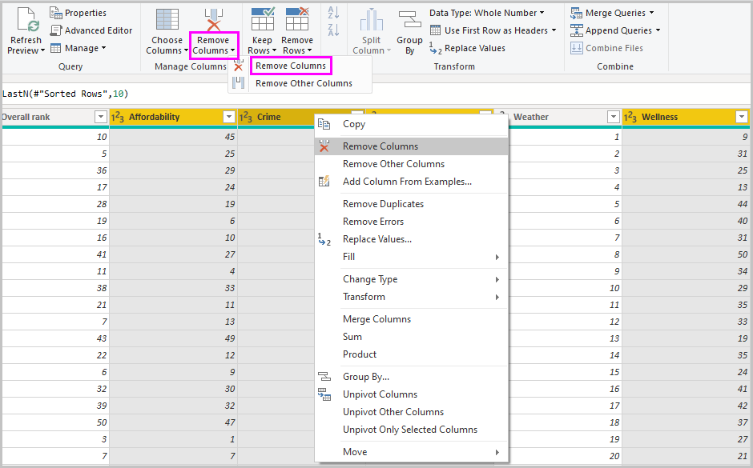
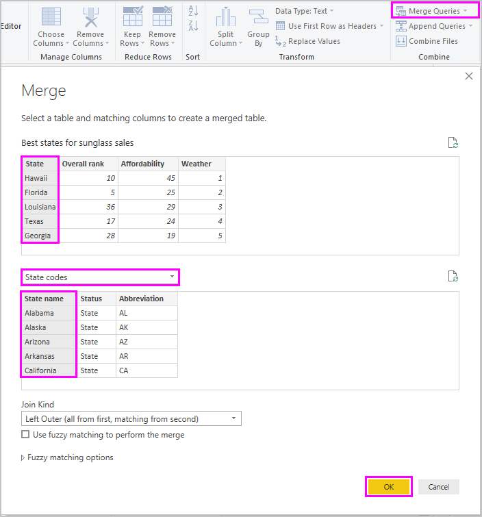
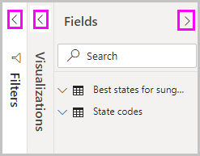
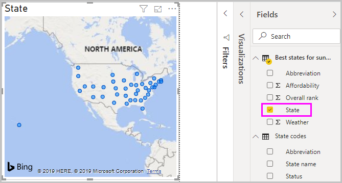
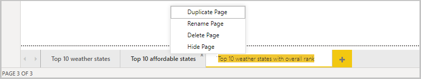
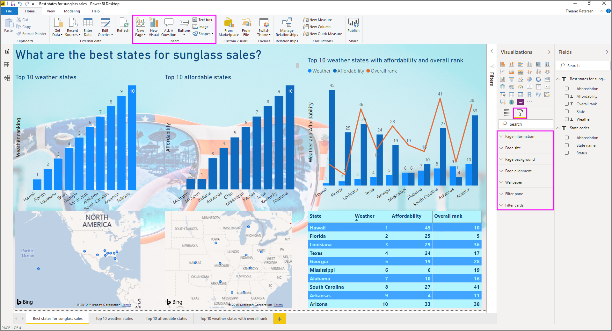
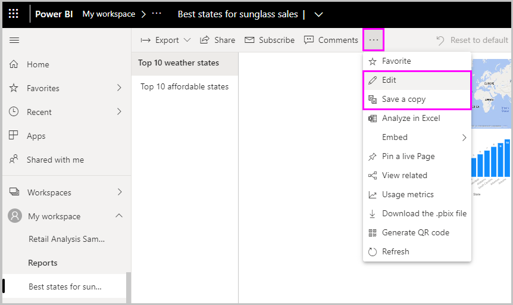

# เริ่มต้นใช้งาน Power BI DesktopGet started with Power BI Desktop
ยินดีต้อนรับสู่คู่มือการเริ่มต้นสำหรับ Power BI DesktopWelcome to the getting started guide for Power BI Desktop. ทัวร์นี้แสดงวิธีการที่ Power BI Desktop ทำงาน สิ่งที่สามารถทำได ้และวิธีการสร้างโมเดลข้อมูลที่แข็งแกร่ง และรายงานที่น่าทึ่ง เพื่อขยายข่าวกรองธุรกิจของคุณThis tour shows you how Power BI Desktop works, what it can do, and how to build robust data models and amazing reports to amplify your business intelligence.

สำหรับภาพรวมอย่างรวดเร็วของวิธีการ Power BI Desktop ทำงานและวิธีการใช้งาน คุณสามารถสแกนหน้าจอในคำแนะนำนี้ได้ในเวลาเพียงไม่กี่นาทีFor a quick overview of how Power BI Desktop works and how to use it, you can scan the screens in this guide in just a few minutes. เพื่อให้เข้าใจอย่างถ่องแท้มากขึ้น คุณสามารถอ่านแต่ละส่วนโดยละเอียดและดำเนินการตามขั้นตอน และสร้างไฟล์ Power BI Desktop ของคุณเองเพื่อโพสต์ไปยัง [บริการ Power BI](https://app.powerbi.com/) และแชร์กับผู้อื่นFor a more thorough understanding, you can read through each section, perform the steps, and create your own Power BI Desktop file to post on the [Power BI service](https://app.powerbi.com/) and share with others.

นอกจากนี้คุณยังสามารถดูวิดีโอ [เริ่มต้นใช้งานกับ Power BI Desktop](https://www.youtube.com/watch?v=Qgam9M8I0xA) และดาวน์โหลดเวิร์กบุ๊ก Excel [ตัวอย่างทางการเงิน](https://go.microsoft.com/fwlink/?LinkID=521962) เพื่อทำตามวิดีโอYou can also watch the [Getting Started with the Power BI Desktop](https://www.youtube.com/watch?v=Qgam9M8I0xA) video, and download the [Financial Sample](https://go.microsoft.com/fwlink/?LinkID=521962) Excel workbook to follow along with the video.

> [!IMPORTANT]
> มีการอัปเดตและเผยแพร่ Power BI Desktop เป็นประจำทุกเดือน ซึ่งจะรวมคำติชมของลูกค้าและคุณสมบัติใหม่ด้วยPower BI Desktop is updated and released on a monthly basis, incorporating customer feedback and new features. รองรับเฉพาะเวอร์ชันล่าสุดของ Power BI Desktop เท่านั้น ซึ่งฝ่ายสนับสนุนสำหรับ Power BI Desktop จะขอให้ลูกค้าที่ติดต่อมาอัปเกรดเป็นเวอร์ชันล่าสุดOnly the most recent version of Power BI Desktop is supported; customers who contact support for Power BI Desktop will be asked to upgrade to the most recent version. คุณสามารถดาวน์โหลด Power BI Desktop เวอร์ชันล่าสุดได้จาก [Windows Store](https://aka.ms/pbidesktopstore) หรือไฟล์ปฏิบัติการเดียวซึ่งมีภาษาที่รองรับทั้งหมดที่คุณ[ดาวน์โหลด](https://www.microsoft.com/download/details.aspx?id=58494)และติดตั้งบนคอมพิวเตอร์ของคุณYou can get the most recent version of Power BI Desktop from the [Windows Store](https://aka.ms/pbidesktopstore), or as a single executable containing all supported languages that you [download](https://www.microsoft.com/download/details.aspx?id=58494) and install on your computer.

## วิธีการทำงานของ Power BI DesktopHow Power BI Desktop works
ด้วย Power BI Desktop คุณสามารถWith Power BI Desktop, you can:
1. เชื่อมต่อกับข้อมูล รวมถึงแหล่งข้อมูลที่หลากหลายConnect to data, including multiple data sources.
1. จัดรูปร่างข้อมูลด้วยคิวรีที่สร้างรูปแบบข้อมูลเชิงลึกและน่าสนใจShape the data with queries that build insightful, compelling data models.
1. ใช้รูปแบบข้อมูลเพื่อสร้างการแสดงภาพและรายงานUse the data models to create visualizations and reports. 
1. แชร์ไฟล์รายงานของคุณให้กับผู้อื่นเพื่อใช้ประโยชน์ สร้างตาม และแชร์Share your report files for others to leverage, build upon, and share. คุณสามารถแชร์ไฟล์ Power BI Desktop *.pbix* เช่นเดียวกับไฟล์อื่นๆ แต่วิธีที่น่าสนใจที่สุดคือการอัปโหลดไปยัง [บริการของ Power BI](https://preview.powerbi.com/)You can share Power BI Desktop *.pbix* files like any other files, but the most compelling method is to upload them to the [Power BI service](https://preview.powerbi.com/). 

Power BI Desktop ผสานรวมเทคโนโลยีกลไกจัดการคิวรี Microsoft การสร้างรูปแบบข้อมูล และการแสดงภาพPower BI Desktop integrates proven Microsoft query engine, data modeling, and visualization technologies. นักวิเคราะห์ข้อมูลและผู้อื่นสามารถสร้างคอลเลกชันของคิวรี การเชื่อมต่อข้อมูล แบบจำลอง และรายงานและแชร์กับผู้อื่นได้อย่างง่ายดายData analysts and others can create collections of queries, data connections, models, and reports, and easily share them with others. ผ่านการรวมกันของ Power BI Desktop และบริการของ Power BI ข้อมูลเชิงลึกใหม่จากโลกของข้อมูลจะง่ายต่อการจำลอง สร้าง แชร์และขยายThrough the combination of Power BI Desktop and the Power BI service, new insights from the world of data are easier to model, build, share, and extend.

Power BI Desktop สร้างความเป็นศูนย์กลาง ลดความซับซ้อน และสร้างความราบรื่นในการใช้งานสิ่งที่อาจอยู่กระจัดกระจาย ไม่เชื่อมโยงกัน และกระบวนที่ยากลำบากในการออกแบบและสร้างเรื่องราวและรายงานข่าวกรองทางธุรกิจPower BI Desktop centralizes, simplifies, and streamlines what can otherwise be a scattered, disconnected, and arduous process of designing and creating business intelligence repositories and reports.
พร้อมที่จะลองทำหรือยัง?Ready to give it a try? มาเริ่มต้นกันเลยLet's get started.

> [!NOTE]
> สำหรับข้อมูลและรายงานที่ต้องคงไว้ในสถานที่ มีเวอร์ชันแยกและเวอร์ชันพิเศษของ Power BI เรียกว่า [เซิร์ฟเวอร์รายงาน Power BI](../report-server/get-started.md)For data and reporting that must remain on-premises, there's a separate and specialized version of Power BI called [Power BI Report Server](../report-server/get-started.md). เซิร์ฟเวอร์รายงาน Power BI ใช้เวอร์ชันที่แยกต่างหากและเวอร์ชันเฉพาะของ Power BI Desktop ที่เรียกว่า Power BI Desktop สำหรับเซิร์ฟเวอร์รายงาน Power BI ซึ่งทำงานกับเวอร์ชันเซิร์ฟเวอร์รายงานของ Power BI เท่านั้นPower BI Report Server uses a separate and specialized version of Power BI Desktop called Power BI Desktop for Power BI Report Server, which works only with the Report Server version of Power BI. บทความนี้อธิบาย Power BI Desktop มาตรฐานThis article describes standard Power BI Desktop.

## ติดตั้งและเปิดใช้งาน Power BI DesktopInstall and run Power BI Desktop
หากต้องการดาวน์โหลด Power BI Desktop ให้ไปที่ [หน้าดาวน์โหลด Power BI Desktop](https://powerbi.microsoft.com/desktop) และเลือก **ดาวน์โหลดฟรี**To download Power BI Desktop, go to the [Power BI Desktop download page](https://powerbi.microsoft.com/desktop) and select **Download Free**. หรือสำหรับตัวเลือกดาวน์โหลด ให้เลือก [ดูตัวเลือกดาวน์โหลดหรือภาษา](https://www.microsoft.com/download/details.aspx?id=58494)Or for download options, select [See download or language options](https://www.microsoft.com/download/details.aspx?id=58494). 

นอกจากนี้ คุณยังสามารถดาวน์โหลด Power BI Desktop จากบริการ Power BIYou can also download Power BI Desktop from the Power BI service. เลือกไอคอน **ดาวน์โหลด** ในแถบเมนูด้านบน แล้วเลือก **Power BI Desktop**Select the **Download** icon in the top menu bar, and then select **Power BI Desktop**.

ในหน้า Microsoft Store ให้เลือก **รับ** และทำตามพร้อมท์เพื่อติดตั้ง Power BI Desktop บนคอมพิวเตอร์ของคุณOn the Microsoft Store page, select **Get**, and follow the prompts to install Power BI Desktop on your computer. เริ่มต้น Power BI Desktop จากเมนู **เริ่มต้น** Windows หรือจากไอคอนในแถบงาน WindowsStart Power BI Desktop from the Windows **Start** menu or from the icon in the Windows taskbar.

ครั้งแรกที่เริ่มใช้ Power BI Desktop จะแสดงหน้าจอ **ยินดีต้อนรับ**The first time Power BI Desktop starts, it displays the **Welcome** screen.

จากหน้าจอ **ยินดีต้อนรับ** คุณสามารถ **รับข้อมูล** ดู **ทรัพยากรล่าสุด** เปิดรายงานล่าสุด **เปิดรายงานอื่นๆ**  หรือเลือกลิงก์อื่น ๆFrom the **Welcome** screen, you can **Get data**, see **Recent sources**, open recent reports, **Open other reports**, or select other links. คุณยังสามารถเลือกว่าจะแสดงหน้าจอ **ยินดีต้อนรับ** เสมอเมื่อเริ่มต้นหรือไม่You can also choose whether to always show the **Welcome** screen at startup. เลือกไอคอนปิด เพื่อปิดหน้าจอ **ยินดีต้อนรับ**Select the close icon to close the **Welcome** screen.

ทางด้านซ้ายของ Power BI Desktop คือไอคอนสำหรับมุมมอง Power BI Desktop สามมุมมอง: **รายงาน** **ข้อมูล** และ **ความสัมพันธ์** จากบนลงล่างAlong the left side of Power BI Desktop are icons for the three Power BI Desktop views: **Report**, **Data**, and **Relationships**, from top to bottom. มุมมองปัจจุบันจะแสดงโดยแถบสีเหลืองทางด้านซ้ายและคุณสามารถเปลี่ยนมุมมองได้โดยการเลือกไอคอนใดๆThe current view is indicated by the yellow bar along the left, and you can change views by selecting any of the icons. 

มุมมอง **รายงาน** เป็นมุมมองเริ่มต้น**Report** view is the default view. 

Power BI Desktop ยังรวมถึง ตัวแก้ไข **Power Query** ซึ่งเปิดในหน้าต่างแยกPower BI Desktop also includes the **Power Query Editor**, which opens in a separate window. ใน **ตัวแก้ไข Power Query** คุณสามารถสร้างคิวรีและแปลงข้อมูลได้ จากนั้นโหลดแบบจำลองข้อมูลที่ปรับแต่งแล้วนั้นลงใน Power BI Desktop เพื่อสร้างรายงานIn **Power Query Editor**, you can build queries and transform data, then load the refined data model into Power BI Desktop to create reports.

## เชื่อมต่อกับข้อมูลConnect to data
เมื่อคุณติดตั้ง Power BI Desktop แล้ว คุณก็พร้อมที่จะเชื่อมต่อกับโลกแห่งข้อมูลที่ขยายขึ้นเรื่อย ๆWith Power BI Desktop installed, you're ready to connect to the ever-expanding world of data. หากต้องการดูแหล่งข้อมูลหลายชนิดที่ใช้ได้ ให้เลือก **รับข้อมูล** > **เพิ่มเติม** ในแท็บ **หน้าแรก** ของ Power BI Desktop และในหน้าต่าง **รับข้อมูล** ให้เลื่อนผ่านรายการแหล่งข้อมูล **ทั้งหมด**To see the many types of data sources available, select **Get Data** > **More** in the Power BI Desktop **Home** tab, and in the **Get Data** window, scroll through the list of **All** data sources. ในการทัวร์ด่วนนี้ คุณเชื่อมต่อกับแหล่งข้อมูล **เว็บ** ที่แตกต่างกันสองสามแห่งIn this quick tour, you connect to a couple of different **Web** data sources.

จินตนาการว่าคุณเป็นนักวิเคราะห์ข้อมูลกำลังทำงานให้กับร้านค้าปลีกแว่นตากันแดดImagine you're a data analyst working for a sunglasses retailer. คุณต้องการช่วยยอดขายแว่นกันแดดตามเป้าหมายของลูกค้าในพื้นที่ที่มีีแดดแรงบ่อยมากที่สุดYou want to help your client target sunglasses sales where the sun shines most frequently. Bankrate.com หน้า [Best and worst states for retirement (รัฐที่ดีที่สุดและแย่ที่สุดสำหรับเกษียณ) ](https://www.bankrate.com/retirement/best-and-worst-states-for-retirement/) มีข้อมูลที่น่าสนใจในหัวเรื่องนี้The Bankrate.com [Best and worst states for retirement](https://www.bankrate.com/retirement/best-and-worst-states-for-retirement/) page has interesting data on this subject.

บนแท็บ **หน้าแรก** ของ Power BI Desktop ให้เลือก **รับข้อมูล** > **เว็บ** เพื่อเชื่อมต่อกับแหล่งข้อมูลเว็บOn the Power BI Desktop **Home** tab, select **Get Data** > **Web** to connect to a web data source. 

ในกล่องโต้ตอบ **จากเว็บ** วางที่อยู่ *https:\//www.bankrate.com/retirement/best-and-worst-states-for-retirement/* ลงในเขตข้อมูล **URL** แล้วเลือก **ตกลง**In the **From Web** dialog box, paste the address *https:\//www.bankrate.com/retirement/best-and-worst-states-for-retirement/* into the **URL** field, and select **OK**. 

หากมีข้อความปรากฏขึ้น บนหน้าจอ **เข้าถึงเนื้อหาเว็บ** ให้เลือก **เนื้อหา** เพื่อใช้การเข้าถึงแบบไม่ระบุชื่อIf prompted, on the **Access Web Content** screen, select **Connect** to use anonymous access. 

ฟังก์ชันการทำงานของ Power BI Desktop จะทำงานและติดต่อทรัพยากรเว็บThe query functionality of Power BI Desktop goes to work and contacts the web resource. หน้าต่าง **ตัวนำทาง** จะแสดงสิ่งที่พบบนหน้าเว็บ ในกรณีนี้คือตารางที่ชื่อว่า **Ranking of best and worst states for retirement (ลำดับของรัฐที่ดีที่สุดและแย่ที่สุดสำหรับเกษียณ)** และเอกสารThe **Navigator** window returns what it found on the web page, in this case a table called **Ranking of best and worst states for retirement**, and a document. คุณสนใจในตาราง ดังนั้นให้เลือกตารางเพื่อดูตัวอย่างYou're interested in the table, so select it to see a preview.

ในจุดนี้ คุณสามารถเลือก **โหลด** เพื่อโหลดตารางหรือ **การแปลงข้อมูล** เพื่อทำการเปลี่ยนแปลงในตารางก่อนที่คุณจะโหลดAt this point you can select **Load** to load the table, or **Transform data** to make changes in the table before you load it.

เมื่อคุณเลือก **การแปลงข้อมูล** Power Query Editor จะเปิดขึ้นพร้อมกับมุมมองแสดงของตารางWhen you select **Transform data**, Power Query Editor launches, with a representative view of the table. บานหน้าต่าง **การตั้งค่าคิวรี** ด้านขวา หรือคุณสามารถแสดงได้โดยการเลือก **การตั้งค่าคิวรี** บนแท็บ **มุมมอง** ของตัวแก้ไข Power QueryThe **Query Settings** pane is on the right, or you can always show it by selecting **Query Settings** on the **View** tab of Power Query Editor. 

สำหรับข้อมูลเพิ่มเติมเกี่ยวกับการเชื่อมต่อกับข้อมูล ดู [เชื่อมต่อกับข้อมูลใน Power BI Desktop](../connect-data/desktop-connect-to-data.md)For more information about connecting to data, see [Connect to data in Power BI Desktop](../connect-data/desktop-connect-to-data.md).

## จัดรูปร่างข้อมูลShape data
เวลานี้ที่เราเชื่อมต่อกับแหล่งข้อมูลแล้ว คุณสามารถปรับข้อมูลตามความต้องการของคุณNow that you're connected to a data source, you can adjust the data to meet your needs. หากต้องการ *จัดรูปร่าง* ข้อมูล คุณให้ตัวแก้ไข Power Query พร้อมคำแนะนำทีละขั้นตอนสำหรับการปรับข้อมูลในขณะที่โหลดและนำเสนอTo *shape* data, you provide Power Query Editor with step-by-step instructions for adjusting the data while loading and presenting it. การจัดรูปร่างไม่กระทบต่อแหล่งข้อมูลเดิม แต่จะมีผลต่อมุมมองข้อมูลนี้เท่านั้นShaping doesn't affect the original data source, only this particular view of the data. 

> [!NOTE]
> ข้อมูลตารางที่ใช้ในคู่มือนี้อาจเปลี่ยนแปลงเมื่อเวลาผ่านไปThe table data used in this guide might change over time. ดังนั้นขั้นตอนที่คุณต้องทำตามอาจแตกต่าง ซึ่งคุณจำเป็นต้องใช้ความคิดสร้างสรรค์เกี่ยวกับวิธีการปรับขั้นตอนหรือผลลัพธ์ ซึ่งเป็นส่วนหนึ่งของความสนุกในการเรียนรู้As such, the steps you need to follow might vary, requiring you to be creative about how you adjust steps or outcomes, which is all part of the fun of learning. 

การจัดรูปร่างอาจหมายถึง *การแปลง* ข้อมูล เช่น การเปลี่ยนชื่อคอลัมน์หรือตาราง การลบแถวหรือคอลัมน์ หรือเปลี่ยนประเภทข้อมูลShaping can mean *transforming* the data, such as renaming columns or tables, removing rows or columns, or changing data types. Power Query Editor จะจับขั้นตอนเหล่านี้ตามลำดับภายใต้ **ใช้ขั้นตอน** ในบานหน้าต่าง **การตั้งค่าคิวรี**Power Query Editor captures these steps sequentially under **Applied Steps** in the **Query Settings** pane. แต่ละครั้งที่คิวรีนี้เชื่อมต่อกับแหล่งข้อมูล จะดำเนินการตามขั้นตอนเหล่านั้นเพื่อจัดรูปร่างข้อมูลในรูปแบบที่คุณระบุเสมอEach time this query connects to the data source, those steps are carried out, so the data is always shaped the way you specify. กระบวนการนี้เกิดขึ้นเมื่อคุณใช้คิวรีใน Power BI Desktop หรือเมื่อใครก็ตามที่ใช้คิวรีของคุณที่แชร์ เช่น ในบริการ Power BIThis process occurs when you use the query in Power BI Desktop, or when anyone uses your shared query, such as in the Power BI service. 

โปรดทราบว่า **ขั้นตอนที่ใช้งาน** ใน **การตั้งค่าคิวรี** ประกอบด้วยสองสามขั้นตอนแล้วNotice that the **Applied Steps** in **Query Settings** already contain a few steps. คุณสามารถเลือกแต่ละขั้นตอนเพื่อดูผลกระทบในตัวแก้ไข Power QueryYou can select each step to see its effect in the Power Query Editor. ก่อนอื่นคุณระบุแหล่งที่มาของเว็บและจากนั้นคุณสามารถแสดงตัวอย่างตารางในหน้าต่าง **ตัวนำทาง**First, you specified a web source, and then you previewed the table in the **Navigator** window. ในขั้นตอนที่สาม **เปลี่ยนประเภท** Power BI รับรู้ข้อมูลจำนวนเต็มเมื่อมีการนำเข้า และเปลี่ยน **ข้อความ** *ประเภทข้อมูล* ของเว็บเดิมเป็น **จำนวนเต็ม**In the third step, **Changed type**, Power BI recognized whole number data when importing it, and automatically changed the original web **Text** *data type* to **Whole numbers**. 

หากคุณจำเป็นต้องเปลี่ยนประเภทข้อมูล ให้เลือกคอลัมน์หรือคอลัมน์สำหรับเปลี่ยนIf you need to change a data type, select the column or columns to change. กดค้างแป้น **Shift** เพื่อเลือกคอลัมน์ติดกันหลายคอลัมน์ หรือกด **Ctrl** เพื่อเลือกคอลัมน์ที่ไม่ติดกันHold down the **Shift** key to select several adjacent columns, or **Ctrl** to select non-adjacent columns. คลิกขวาที่ส่วนหัวของคอลัมน์ เลือก **เปลี่ยนประเภท** และเลือกประเภทข้อมูลใหม่จากเมนู หรือเลื่อนลงรายการที่อยู่ถัดจาก **ประเภทข้อมูล** ในกลุ่ม **การแปลง** ของแท็บ **หน้าแรก** แล้วเลือกประเภทข้อมูลใหม่Either right-click a column header, select **Change Type**, and choose a new data type from the menu, or drop down the list next to **Data Type** in the **Transform** group of the **Home** tab, and select a new data type.

> [!NOTE]
> ตัวแก้ไข Power Query ใน Power BI Desktop ใช้ริบบอน หรือเมนูคลิกขวาสำหรับงานที่พร้อมใช้งานThe Power Query Editor in Power BI Desktop uses the ribbon or the right-click menus for available tasks. งานที่คุณสามารถเลือกได้ส่วนใหญ่ในแท็บ **หน้าแรก** หรือ **การแปลง** ของริบบอนยังสามารถใช้งานได้โดยการคลิกขวาบนรายการ แล้วเลือกจากเมนูที่ปรากฏขึ้นMost of the tasks you can select on the **Home** or **Transform** tabs of the ribbon are also available by right-clicking an item and choosing from the menu that appears.

ขณะนี้คุณสามารถใช้การเปลี่ยนและการแปลงข้อมูลของคุณเอง และดูได้ใน **ขั้นตอนที่ใช้**You can now apply your own changes and transformations to the data and see them in **Applied Steps**. 

ตัวอย่างเช่น สำหรับยอดขายแว่นตากันแดดคุณสนใจในการจัดอันดับสภาพอากาศมากที่สุด ดังนั้นคุณตัดสินใจที่จะจัดเรียงตารางตามคอลัมน์ **สภาพอากาศ** แทนที่จะเป็น **อันดับโดยรวม**For example, for sunglasses sales you're most interested in the weather ranking, so you decide to sort the table by the **Weather** column instead of by **Overall rank**. วางลูกศรลงที่ด้านข้างหัวข้อ **สภาพอากาศ** แล้วเลือก **จัดเรียงจากน้อยไปหามาก**Drop down the arrow next to the **Weather** header, and select **Sort ascending**. ในตอนนี้ข้อมูลที่ปรากฏจัดเรียงตามการจัดอันดับสภาพอากาศ และขั้นตอน **แถวที่จัดเรียง** จะปรากฏใน **ขั้นตอนที่ใช้**The data now appears sorted by weather ranking, and the step **Sorted Rows** appears in **Applied Steps**. 

คุณไม่สนใจที่จะขายแว่นกันแดดให้กับรัฐที่สภาพอากาศที่เลวร้ายที่สุด ดังนั้นคุณตัดสินใจที่จะลบรัฐเหล่านั้นออกจากตารางYou're not very interested in selling sunglasses to the worst weather states, so you decide to remove them from the table. จาก **ลดแถว** กลุ่มของแท็บ **หลัก** เลือก **เอาแถว** > **ลบแถวล่าง** ออกFrom the **Reduce Rows** group of the **Home** tab, select **Remove Rows** > **Remove Bottom Rows**. ในกล่องโต้ตอบ **ลบแถวล่าง** ให้ใส่ *10* จากนั้นเลือก **ตกลง**In the **Remove Bottom Rows** dialog box, enter *10*, and then select **OK**. 

แถวสภาพอากาศที่เลวร้ายที่สุด 10 แถวล่างจะถูกเอาออกจากตาราง และขั้นตอน **ลบแถวล่าง** จะปรากฏใน **ขั้นตอนที่ใช้**The bottom 10 worst weather rows are removed from the table, and the step **Removed Bottom Rows** appears in **Applied Steps**.

คุณตัดสินใจว่าตารางมีข้อมูลเพิ่มเติมมากเกินไปสำหรับความต้องการของคุณ และต้องการลบคอลัมน์ **กำลังในการซื้อ** **อาชญากรรม** **วัฒนธรรม** และ **สุขภาพ**You decide the table has too much extra information for your needs, and to remove the **Affordability**, **Crime**, **Culture**, and **Wellness** columns. เลือกส่วนหัวของแต่ละคอลัมน์ที่คุณต้องการลบออกSelect the header of each column that you want to remove. กดค้างแป้น **Shift** เพื่อเลือกคอลัมน์ติดกันหลายคอลัมน์ หรือกด **Ctrl** เพื่อเลือกคอลัมน์ที่ไม่ติดกันHold down the **Shift** key to select several adjacent columns, or **Ctrl** to select non-adjacent columns. 

จากนั้นจาก **จัดการคอลัมน์** กลุ่มของแท็บ **หน้าแรก** เลือก **เอาคอลัมน์ออก**Then, from the **Manage Columns** group of the **Home** tab, select **Remove Columns**. คุณยังสามารถคลิกขวาที่หนึ่งในหัวข้อคอลัมน์ที่เลือก แล้วเลือก **ลบคอลัมน์** จากเมนูYou can also right-click one of the selected column headers and select **Remove Columns** from the menu. คอลัมน์ที่เลือกจะถูกลบออก และขั้นตอน **ลบคอลัมน์** จะปรากฏใน **ขั้นตอนที่ใช้**The selected columns are removed, and the step **Removed Columns** appears in **Applied Steps**.

เมื่อคิดดูอีกที สุดท้ายแล้ว **กำลังในการซื้อ** อาจสัมพันธ์กับยอดขายแว่นกันแดดOn second thought, **Affordability** might be relevant to sunglasses sales after all. คุณต้องการที่จะได้รับคอลัมน์นั้นกลับมาYou'd like to get that column back. คุณสามารถยกเลิกการทำขั้นตอนล่าสุดในบานหน้าต่าง **ขั้นตอนที่ใช้** โดยการเลือกไอคอนลบ **X** ที่อยู่ถัดจากขั้นตอนYou can easily undo the last step in the **Applied Steps** pane by selecting the **X** delete icon next to the step. เวลานี้ยกเลิกการทำขั้นตอน ให้เลือกเฉพาะคอลัมน์ที่คุณต้องการลบNow redo the step, selecting only the columns you want to delete. เพื่อให้มีความยืดหยุ่นมากขึ้นคุณสามารถลบแต่ละคอลัมน์เป็นขั้นตอนที่แยกต่างหากFor more flexibility, you could delete each column as a separate step. 

คุณสามารถคลิกขวาที่ขั้นตอนใดๆ ในบานหน้าต่าง **ขั้นตอนที่ใช้** และเลือกเพื่อลบ เปลี่ยนชื่อ ย้ายขึ้นหรือลงในลำดับ หรือเพิ่มหรือลบขั้นตอนหลังจากนั้นYou can right-click any step in the **Applied Steps** pane and choose to delete it, rename it, move it up or down in the sequence, or add or delete steps after it. สำหรับขั้นตอนระหว่างกลาง Power BI Desktop จะเตือนคุณหากการเปลี่ยนแปลงอาจส่งผลกระทบต่อขั้นตอนในภายหลังและทำให้คิวรีของคุณเสียหายFor intermediate steps, Power BI Desktop will warn you if the change could affect later steps and break your query.  

ตัวอย่างเช่น หากคุณไม่ต้องการจัดเรียงตารางตาม **สภาพอากาศ** อีกต่อไป คุณอาจต้องพยายามลบขั้นตอน **แถวที่จัดเรียงแล้ว**For example, if you no longer wanted to sort the table by **Weather**, you might try to delete the **Sorted Rows** step. Power BI Desktop เตือนคุณว่าการลบขั้นตอนนี้อาจทำให้คิวรีของคุณเสียหายPower BI Desktop warns you that deleting this step could cause your query to break. คุณได้ลบแถวล่าง 10 แถวหลังจากที่คุณจัดเรียงตามสภาพอากาศไปแล้ว ดังนั้นถ้าคุณลบการจัดเรียงนี้ แถวอื่นๆ จะถูกลบไปด้วยYou removed the bottom 10 rows after you sorted by weather, so if you remove the sort, different rows will be removed. คุณจะได้รับคำเตือนเช่นกัน ถ้าคุณเลือกขั้นตอน **แถวที่จัดเรียงแล้ว** และลองเพิ่มขั้นตอนระดับกลางใหม่ที่จุดนั้นYou also get a warning if you select the **Sorted Rows** step and try to add a new intermediate step at that point.  

สุดท้าย คุณเปลี่ยนชื่อตารางเป็นยอดขายแว่นตาแทนการเกษียณFinally, you change the table title to be about sunglass sales instead of retirement. ภายใต้ **คุณสมบัติ** ในบานหน้าต่าง **การตั้งค่าคิวรี่** ให้เปลี่ยนชื่อเรื่องเก่าด้วย *รัฐที่ดีที่สุดสำหรับการขายแว่นกันแดด*Under **Properties** in the **Query Settings** pane, replace the old title with *Best states for sunglass sales*.

คิวรีที่เสร็จสิ้นแล้วสำหรับข้อมูลที่จัดรูปร่างแล้วของคุณจะมีลักษณะดังนี้:The finished query for your shaped data looks like this:

สำหรับข้อมูลเพิ่มเติมเกี่ยวกับการจัดรูปร่างข้อมูล ดู [จัดรูปร่างและรวมข้อมูลใน Power BI Desktop](../connect-data/desktop-shape-and-combine-data.md)For more information about shaping data, see [Shape and combine data in Power BI Desktop](../connect-data/desktop-shape-and-combine-data.md).

## รวมข้อมูลCombine data
ข้อมูลเกี่ยวกับรัฐต่าง ๆ นั้นน่าสนใจ และจะเป็นประโยชน์สำหรับการสร้างการวิเคราะห์และการคิวรีเพิ่มเติมThe data about various states is interesting, and will be useful for building additional analysis efforts and queries. แต่มีปัญหาหนึ่งอย่าง: ข้อมูลส่วนใหญ่ใช้ตัวย่อสองตัวอักษรสำหรับรหัสรัฐ ไม่ใช่ชื่อเต็มของรัฐBut there's one problem: most data out there uses two-letter abbreviations for state codes, not the full names of the states. การใช้ข้อมูลนั้น คุณจำเป็นต้องมีวิธีการสัมพันธ์ชื่อของรัฐของคุณกับตัวย่อTo use that data, you need some way to associate your state names with their abbreviations.

คุณกำลังโชคดีYou're in luck. แหล่งข้อมูลสาธารณะอื่นมีเพียงเท่านั้น แต่ข้อมูลดังกล่าวจะต้องมีจำนวนการจัดรูปแบบที่เป็นธรรมก่อนที่คุณสามารถ *รวม* กับตารางแว่นกันแดดของคุณAnother public data source does just that, but the data will need a fair amount of shaping before you can *combine* it with your sunglass table.

หากต้องการนำเข้าข้อมูลตัวย่อของรัฐลงในตัวแก้ไข Power Query ให้เลือก **แหล่งที่มาใหม่** > **เว็บ** จากกลุ่ม **คิวรีใหม่** บนแท็บ **หน้าแรก** ของริบบอนTo import the state abbreviations data into Power Query Editor, select **New Source** > **Web** from the **New Query** group on the **Home** tab of the ribbon. 

ในกล่องโต้ตอบ **จากเว็บ** ป้อน URL สำหรับเว็บไซต์ตัวย่อของรัฐ: *https:\//en.wikipedia.org/wiki/List_of_U.S._state_abbreviations*In the **From Web** dialog box, enter the URL for the state abbreviations site: *https:\//en.wikipedia.org/wiki/List_of_U.S._state_abbreviations*.

ในหน้าต่าง **ตัวนำทาง** ให้เลือกตาราง **รหัสและตัวย่อสำหรับรัฐ เขตรัฐบาลกลาง ดินแดนในสหรัฐอเมริกา และภูมิภาคอื่น ๆ** และจากนั้นเลือก **ตกลง**In the **Navigator** window, select the table **Codes and abbreviations for U.S. states, federal district, territories, and other regions**, and then select **OK**. ตารางเปิดในตัวแก้ไข Power QueryThe table opens in Power Query Editor.

ลบคอลัมน์ทั้งหมดยกเว้นสำหรับ **ชื่อและรัฐของภูมิภาค** **ชื่อและรัฐของภูมิภาค2** และ **ANSI**Remove all columns except for **Name and status of region**, **Name and status of region2**, and **ANSI**. การเลือกเฉพาะคอลัมน์เหล่านี้ ให้กดค้าง **Ctrl** แล้วเลือกคอลัมน์To keep only these columns, hold down **Ctrl** and select the columns. จากนั้น ให้คลิกขวาที่หนึ่งในส่วนหัวของคอลัมน์และเลือก **ลบคอลัมน์อื่น** หรือ จากกลุ่ม **จัดการคอลัมน์** ของแท็บ **หน้าแรก** ให้เลือก **ลบคอลัมน์อื่น**Then, either right-click one of the column headers and select **Remove Other Columns**, or, from the **Manage Columns** group of the **Home** tab, select **Remove Other Columns**. 

เลื่อนลูกศรลงให้อยู่ถัดจากคอลัมน์ **ชื่อและรัฐของภูมิภาค2** แล้วเลือก **ตัวกรอง** > **เท่ากับ**Drop down the arrow next to the **Name and status of region2** column header, and select **Filters** > **Equals**. ในกล่องโต้ตอบ **แถวตัวกรอง** เลื่อนลูกศรลงในเขตข้อมูล **ป้อนหรือเลือกค่า** ที่อยู่ถัดจาก **เท่ากับ** แล้วเลือก **รัฐ**In the **Filter Rows** dialog box, drop down the **Enter or select a value** field next to **equals** and select **State**. 

เลือก **หรือ** และถัดจากเขตข้อมูล **เท่ากับ** ที่สอง ให้เลือก **รัฐ ("เครือจักรภพ")**Select **Or**, and next to the second **equals** field, select **State ("Commonwealth")**. เลือก **ตกลง**Select **OK**. 

เมื่อลบค่าเพิ่มเติม เช่น **เขตของรัฐบาลกลาง** และ **เกาะ** ออกแล้ว เวลานี้คุณมีรายการของรัฐ 50 รัฐ และตัวย่อสองตัวอักษรอย่างเป็นทางการWith extra values like **Federal district** and **island** removed, you now have a list of the 50 states and their official two-letter abbreviations. คุณสามารถเปลี่ยนชื่อคอลัมน์เพื่อให้เข้าใจมากขึ้น ตัวอย่างเช่น **ชื่อรัฐ** **สถานะ** และ **ตัวย่อ** โดยการคลิกขวาที่ส่วนหัวของคอลัมน์ แล้วเลือก **เปลี่ยนชื่อ**You can rename the columns to make more sense, for example **State name**, **Status**, and **Abbreviation**, by right-clicking the column headers and selecting **Rename**.

โปรดทราบว่าขั้นตอนเหล่านี้ถูกบันทึกไว้ภายใต้ **ขั้นตอนที่ใช้** ในบานหน้าต่าง **การตั้งค่าคิวรี**Note that all of these steps are recorded under **Applied Steps** in the **Query Settings** pane.

ตารางที่จัดรูปร่างแล้วตอนนี้มีลักษณะดังนี้:Your shaped table now looks like this:

เปลี่ยนชื่อตารางเป็น *รหัสรัฐ* ในเขตข้อมูล **คุณสมบัติ** ของ **การตั้งค่าคิวรี**Retitle the table to *State codes* in the **Properties** field of **Query Settings**. 

เมื่อจัดรูปร่างตาราง **รหัสรัฐ** แล้ว คุณสามารถ *รวม* ตารางสองตารางเหล่านี้เป็นหนึ่งตารางWith the **State codes** table shaped, you can *combine* these two tables into one. เนื่องจากเวลานี้ตารางของคุณมีผลลัพธ์ของคิวรีที่คุณนำไปใช้กับข้อมูล ดังนั้นจึงเรียกตารางเหล่านี้ว่า *คิวรี* เช่นกันSince the tables you now have are a result of queries you applied to the data, they're also called *queries*. มีสองวิธีหลักของการรวมคิวรีได้แก่ *ผสาน* และ *ผนวก*There are two primary ways of combining queries: *merge* and *append*. 

เมื่อคุณต้องการเพิ่มคอลัมน์หนึ่งคอลัมน์หรือมากกว่าเข้าไปในคิวรีอื่น ให้คุณ *ผสาน* คิวรีWhen you have one or more columns you'd like to add to another query, you *merge* the queries. เมื่อคุณต้องการเพิ่มแถวของข้อมูลเพิ่มเติมลงในคิวรีที่มีอยู่แล้ว ให้คุณ *ผนวก* คิวรีWhen you have additional rows of data you'd like to add to an existing query, you *append* the query.

ในกรณีนี้ คุณต้องการ *ผสาน* คิวรี **รหัสรัฐ** ลงในคิวรี **รัฐที่ดีที่สุดสำหรับแว่นกันแดด**In this case, you want to *merge* the **State codes** query into the **Best states for sunglasses** query. ในการผสานคิวรี ให้สลับคิวรี **รัฐที่ดีที่สุดสำหรับแว่นกันแดด** โดยการเลือกจากบานหน้าต่าง **คิวรี** ทางด้านซ้ายของตัวแก้ไข Power QueryTo merge the queries, switch to the **Best states for sunglasses** query by selecting it from the **Queries** pane on the left side of Power Query Editor. จากนั้นเลือก **ผสานคิวรี** จากกลุ่ม **รวม** ในแท็บ **หน้าแรก** ของริบบอนThen select **Merge Queries** from the **Combine** group in the **Home** tab of the ribbon.

ในหน้าต่าง **ผสาน** ให้เลื่อนเขตข้อมูลลงเพื่อเลือก **รหัสรัฐ** จากคิวรีอื่นๆ ที่พร้อมใช้งานIn the **Merge** window, drop down the field to select **State codes** from the other queries available. เลือกคอลัมน์ให้ตรงกันจากแต่ละตาราง ในกรณีนี้คือ **รัฐ** จากคิวรี **รัฐที่ดีที่สุดสำหรับแว่นกันแดด** และ **ชื่อรัฐ** จากคิวรี **รหัสรัฐ**Select the column to match from each table, in this case **State** from the **Best states for sunglasses** query and **State name** from the **State codes** query. 

หากคุณรับกล่องโต้ตอบ **ระดับความเป็นส่วนตัว** ให้เลือก **เพิกเฉยต่อการตรวจสอบระดับความเป็นส่วนตัวสำหรับไฟล์นี้** จากนั้นเลือก **บันทึก**If you get a **Privacy levels** dialog, select **Ignore privacy levels checks for this file** and then select **Save**. เลือก **ตกลง**Select **OK**. 

คอลัมน์ใหม่ที่เรียกว่า **รหัสรัฐ** จะปรากฏทางด้านขวาของตาราง **รัฐที่ดีที่สุดสำหรับยอดขายแว่นกันแดด**A new column called **State codes** appears on the right of the **Best states for sunglass sales** table. โดยประกอบด้วยคิวรีรหัสรัฐที่คุณผสานกับคิวรีรัฐที่ดีที่สุดสำหรับยอดขายแว่นกันแดดIt contains the state code query that you merged with the best states for sunglass sales query. คอลัมน์ทั้งหมดจากตารางที่ผสานจะถูกบีบลงในคอลัมน์ **รหัสรัฐ**All the columns from the merged table are condensed into the **State codes** column. คุณสามารถ *ขยาย* ตารางที่ผสานและรวมเฉพาะคอลัมน์ที่คุณต้องการได้You can *expand* the merged table and include only the columns you want. 

การขยายตารางที่ผสานและเลือกว่ารวมคอลัมน์ใด ให้เลือกไอคอน **ขยาย** ในส่วนหัวของคอลัมน์To expand the merged table and select which columns to include, select the **Expand** icon in the column header. ในกล่องโต้ตอบ **ขยาย** ให้เลือกเฉพาะคอลัมน์ **ตัวย่อ**In the **Expand** dialog box, select only the **Abbreviation** column. ยกเลิกการเลือก **ใช้ชื่อคอลัมน์เดิมเป็นคำนำหน้า** จากนั้นเลือก **ตกลง**Deselect **Use original column name as prefix**, and then select **OK**. 

> [!NOTE]
> คุณสามารถมีลูกเล่นเกี่ยวกับวิธีการนำเข้าในตาราง **รหัสรัฐ**You can play around with how to bring in the **State codes** table. ทดสอบเล็กน้อย และหากคุณไม่ชอบผลลัพธ์ เพียงแค่ลบขั้นตอนนี้จากรายการ **ขั้นตอนที่ใช้** ในบานหน้าต่าง **การตั้งค่าคิวรี**Experiment a bit, and if you don't like the results, just delete that step from the **Applied Steps** list in the **Query Settings** pane. คุณสามารถทำซ้ำได้หลายครั้งตามที่ต้องการ จนกระทั่งกระบวนการขยายมีลักษณะตามที่คุณต้องการIt's a free do-over, which you can do as many times as you like until the expand process looks the way you want it.

สำหรับคำอธิบายที่สมบูรณ์ของแต่ละขั้นตอนการจัดรูปร่างและรวมข้อมูล ดู [การจัดรูปร่างและรวมข้อมูลใน Power BI Desktop](../connect-data/desktop-shape-and-combine-data.md)For a more complete description of the shape and combine data steps, see [Shape and combine data in Power BI Desktop](../connect-data/desktop-shape-and-combine-data.md).

ในตอนนี้คุณมีคิวรีตารางเดียว ที่รวมแหล่งข้อมูลสองแหล่ง ซึ่งแต่ละแหล่งถูกจัดรูปร่างให้ตรงตามความต้องการของคุณแล้วYou now have a single query table that combines two data sources, each of which has been shaped to meet your needs. คิวรีนี้สามารถใช้เป็นพื้นฐานสำหรับการเชื่อมต่อข้อมูลเพิ่มเติมที่น่าสนใจอีกมากมาย เช่น ภูมิศาสตร์ ระดับความร่ำรวย และโอกาสสร้างใหม่ในรัฐThis query can serve as a basis for lots of additional, interesting data connections, such as demographics, wealth levels, or recreational opportunities in the states.

สำหรับเวลานี้ คุณมีข้อมูลที่เพียงพอสำหรับสร้างรายงานที่น่าสนใจใน Power BI Desktop แล้วFor now, you have enough data to create an interesting report in Power BI Desktop. เนื่องจากนี่เป็นเหตุการณ์สำคัญ ให้ปรับใช้การเปลี่ยนแปลงใน **ตัวแก้ไข Power Query** และโหลดลงไปใน Power BI Desktop โดยการเลือก **ปิดและปรับใช้** จากแท็บ **หน้าแรก** ของริบบอนSince this is a milestone, apply the changes in **Power Query Editor** and load them into Power BI Desktop by selecting **Close & Apply** from the **Home** tab of the ribbon. นอกจากนี้คุณยังสามารถเลือกเพียง **ปรับใช้** เพื่อเก็บคิวรีให้เปิดอยู่ในตัวแก้ไข Power Query ในขณะที่คุณทำงานใน Power BI DesktopYou can also select just **Apply** to keep the query open in Power Query Editor while you work in Power BI Desktop. 

คุณสามารถทำการเปลี่ยนแปลงมากขึ้นไปยังตารางหลังจากที่โหลดเข้าใน Power BI Desktop แล้วรีโหลดโมเดลเพื่อปรับใช้การเปลี่ยนแปลงใดๆ ที่คุณได้แก้ไขYou can make more changes to a table after it is loaded into Power BI Desktop, and reload the model to apply any changes you make. หากต้องการเปิด **ตัวแก้ไข Power Query** จาก Power BI Desktop ให้เลือก **แก้ไขคิวรี** บนแท็บ **หน้าแรก** ของริบบอน Power BI DesktopTo reopen **Power Query Editor** from Power BI Desktop, select **Edit Queries** on the **Home** tab of the Power BI Desktop ribbon. 

## สร้างรายงานBuild reports
ในมุมมอง **รายงาน** Power BI Desktop คุณสามารถสร้างการแสดงภาพและรายงานIn Power BI Desktop **Report** view, you can build visualizations and reports. มุมมอง **รายงาน** มีพื้นที่หลักหกพื้นที่:The **Report** view has six main areas:

1. ริบบอนที่ด้านบน ซึ่งแสดงงานทั่วไปที่สัมพันธ์กับรายงานและการแสดงภาพThe ribbon at the top, which displays common tasks associated with reports and visualizations.
2. พื้นที่จัดแสดงตรงกลางที่มีการสร้างและจัดการแสดงภาพThe canvas area in the middle, where visualizations are created and arranged.
3. พื้นที่แท็บหน้าที่ด้านล่างที่ให้คุณเลือกและเพิ่มหน้ารายงานThe pages tab area at the bottom, which lets you select or add report pages.
4. บานหน้าต่าง **ตัวกรอง** ที่ซึ่งคุณสามารถกรองการแสดงภาพข้อมูลThe **Filters** pane, where you can filter data visualizations.
5. บานหน้าต่าง **การแสดงผลด้วยภาพ** ที่คุณสามารถเพิ่มเปลี่ยนแปลงหรือกำหนดค่าการแสดงภาพและใช้เจาะลึกได้The **Visualizations** pane, where you can add, change, or customize visualizations, and apply drillthrough.
6. บานหน้าต่าง **เขตข้อมูล** ซึ่งแสดงเขตข้อมูลที่ใช้ได้ในคิวรีของคุณThe **Fields** pane, which shows the available fields in your queries. คุณสามารถลากเขตข้อมูลเหล่านี้ลงในพื้นที่จัดแสดง บานหน้าต่าง **ตัวกรอง** หรือบานหน้าต่าง **การแสดงผลด้วยภาพ** เพื่อสร้างหรือแก้ไขการแสดงผลด้วยภาพYou can drag these fields onto the canvas, the **Filters** pane, or the **Visualizations** pane to create or modify visualizations.

คุณสามารถขยายและย่อบานหน้าต่าง **ตัวกรอง** **การแสดงผลด้วยภาพ** และ **เขตข้อมูล** โดยการเลือกลูกศรที่ด้านบนของบานหน้าต่างYou can expand and collapse the **Filters**, **Visualizations**, and **Fields** panes by selecting the arrows at the tops of the panes. การย่อบานหน้าต่างให้พื้นที่เพิ่มเติมบนพื้นที่จัดแสดงเพื่อสร้างการแสดงภาพที่ดีCollapsing the panes provides more space on the canvas to build cool visualizations. 

การสร้างการแสดงผลด้วยภาพแบบง่าย เพียงเลือกเขตข้อมูลใดๆ ในรายการเขตข้อมูล หรือลากเขตข้อมูลจากรายการ **เขตข้อมูล** ลงในพื้นที่จัดแสดงTo create a simple visualization, just select any field in the fields list, or drag the field from the **Fields** list onto the canvas. ตัวอย่างเช่น ลากเขตข้อมูล **รัฐ** จาก **รัฐที่ดีที่สุดสำหรับยอดขายแว่นกันแดด** ไปยังพื้นที่จัดแสดง และดูสิ่งที่เกิดขึ้นFor example, drag the **State** field from **Best states for sunglass sales** onto the canvas, and see what happens.

ดูนั่นสิ!Look at that! Power BI Desktop รับรู้ได้ว่าเขตข้อมูล **รัฐ** นั้นประกอบด้วยข้อมูลทางภูมิศาสตร์ และสร้างการแสดงภาพที่ยึดตามแผนที่ขึ้นโดยอัตโนมัติPower BI Desktop recognized that the **State** field contained geolocation data and automatically created a map-based visualization. การแสดงภาพแสดงจุดข้อมูลสำหรับ 40 รัฐ จากรูปแบบข้อมูลของคุณThe visualization shows data points for the 40 states from your data model. 

ในบานหน้าต่าง **การแสดงผลด้วยภาพ** แสดงข้อมูลเกี่ยวกับการแสดงผลด้วยภาพและให้คุณแก้ไขThe **Visualizations** pane shows information about the visualization and lets you modify it. 

1. ไอคอนแสดงประเภทของการแสดงภาพที่สร้างขึ้นThe icons show the type of visualization created. คุณสามารถเปลี่ยนแปลงประเภทของการแสดงภาพที่เลือกโดยการเลือกไอคอนอื่นๆ หรือสร้างการแสดงภาพใหม่ด้วยการเลือกไอคอนที่ไม่เลือกการแสดงภาพที่มีอยู่You can change the type of a selected visualization by selecting a different icon, or create a new visualization by selecting an icon with no existing visualization selected. 
2. ตัวเลือก **เขตข้อมูล** ในบานหน้าต่าง **การแสดงผลด้วยภาพ** ช่วยให้คุณลากเขตข้อมูลไปยัง **คำอธิบายแผนภูมิ** และเขตข้อมูลอื่นๆ ในบานหน้าต่างได้ดีThe **Fields** option in the **Visualization** pane lets you drag data fields to **Legend** and other field wells in the pane. 
3. ตัวเลือก **รูปแบบ** ช่วยให้คุณปรับใช้รูปแบบและควบคุมผู้อื่นในการแสดงผลด้วยภาพThe **Format** option lets you apply formatting and other controls to visualizations. 

ตัวเลือกที่ใช้ได้ในพื้นที่ **เขตข้อมูล** และ **รูปแบบ** ขึ้นอยู่กับประเภทของการแสดงผลด้วยภาพและข้อมูลที่คุณมีThe options available in the **Fields** and **Format** areas depend on the type of visualization and data you have.

คุณต้องการการแสดงภาพแผนที่ของคุณเพื่อแสดงเฉพาะรัฐที่มีสภาพอากาศ 10 อันดับแรกYou want your map visualization to show only the top 10 weather states. หากต้องการแสดงเฉพาะรัฐ 10 อันดับแรก ในบานหน้าต่าง **ตัวกรอง** เลื่อนเคเซอร์ให้อยู่บน **รัฐคือ (ทั้งหมด)** แล้วขยายลูกศรที่ปรากฏTo show only the top 10 states, in the **Filters** pane, hover over **State is (All)** and expand the arrow that appears. ภายใต้ **ประเภทตัวกรอง** เลื่อนลงแล้วเลือก **Top N** ด้านล่าง **แสดงรายการ** ให้เลือก **ล่าง** เพราะคุณต้องการแสดงรายการที่มีช่วงจำนวนต่ำสุด แล้วป้อน *10* ลงในช่องรายการถัดไปUnder **Filter type**, drop down and select **Top N**. Under **Show items**, select **Bottom**, because you want to show the items with the lowest numerical ranks, and enter *10* in the next field.

ลากเขตข้อมูล **สภาพอากาศ** จากบานหน้าต่าง **เขตข้อมูล** ลงในเขตข้อมูล **ตามค่า** จากนั้นเลือก **ปรับใช้ตัวกรอง**Drag the **Weather** field from the **Fields** pane into the **By value** field, and then select **Apply filter**. 

เวลานี้คุณจะเห็นเฉพาะรัฐที่มีสภาพอากาศ 10 อันดับแรกในการแสดงภาพแผนที่You now see only the top 10 weather states in the map visualization. 

เปลี่ยนชื่อการแสดงผลด้วยภาพของคุณโดยการเลือกไอคอน **รูปแบบ** ในบานหน้าต่าง **การแสดงผลด้วยภาพ** เลือก **ชื่อเรื่อง** แล้วพิมพ์ *รัฐที่มีสภาพอากาศ 10 อันดับแรก* ภายใต้ **ข้อความชื่อเรื่อง**Retitle your visualization by selecting the **Format** icon in the **Visualization** pane, selecting **Title**, and typing *Top 10 weather states* under **Title text**. 

การเพิ่มการแสดงผลด้วยภาพที่แสดงชื่อของรัฐที่มีสภาพอากาศ 10 อันดับแรกและการจัดอันดับจาก 1 ถึง 10 ให้เลือกพื้นที่ว่างของพื้นที่จัดแสดง จากนั้นเลือกไอคอน **แผนภูมิคอลัมน์** จากบานหน้าต่าง **การแสดงผลด้วยภาพ**To add a visualization that shows the names of the top 10 weather states and their ranks from 1 to 10, select a blank area of the canvas and then select the **Column chart** icon from the **Visualization** pane. ในบานหน้าต่าง **เขตข้อมูล** ให้เลือก **รัฐ** และ **สภาพอากาศ**In the **Fields** pane, select **State** and **Weather**. แผนภูมิคอลัมน์แสดง 40 รัฐในคิวรีของคุณโดยจัดอันดับจากอันดับหมายเลขสูงสุดถึงอันดับหมายเลขต่ำสุดหรือสภาพอากาศที่เลวร้ายที่สุดถึงดีที่สุดA column chart shows the 40 states in your query, ranked from highest to lowest numerical rank, or worst to best weather. 

เมื่อต้องการสลับลำดับของการจัดอันดับเพื่อให้หมายเลข 1 ปรากฏก่อน ให้เลือกจุดไข่ปลา **ตัวเลือกเพิ่มเติม** ที่ด้านบนขวาของการแสดงภาพและเลือก **การเรียงลำดับจากน้อยไปหามาก** จากเมนูTo switch the order of the ranking so that number 1 appears first, select the **More options** ellipsis at the upper right of the visualization, and select **Sort ascending** from the menu. 

หากต้องการจำกัดตารางเป็นรัฐ 10 อันดับแรก ให้ใช้วิธีเดียวกับกับตัวกรอง 10 อันดับล่างสุดเหมือนการแสดงภาพแผนที่To limit the table to the top 10 states, apply the same bottom 10 filter as you did for the map visualization. 

เปลี่ยนชื่อการแสดงภาพด้วยวิธีเดียวกันสำหรับการแสดงภาพแผนที่Retitle the visualization the same way as for the map visualization. นอกจากนี้ในส่วนของ **รูปแบบ** ของบานหน้าต่าง **การแสดงผลด้วยภาพ** ให้เปลี่ยน **แกน Y** > **ชื่อแกน** จาก **สภาพอากาศ** เป็น *การจัดอันดับอากาศ* เพื่อทำให้เข้าใจมากขึ้นAlso in the **Format** section of the **Visualization** pane, change **Y axis** > **Axis title** from **Weather** to *Weather ranking* to make it more understandable. จากนั้นให้ตัวเลือก **แกน Y** เป็น **ปิด** และให้ **ฉลากข้อมูล** เป็น **เปิด**Then, turn the **Y axis** selector to **Off**, and turn **Data labels** to **On**.

เวลานี้ รัฐที่มีสภาพอากาศ 10 อันดับแรกปรากฏขึ้นตามลำดับตามลำดับตัวเลขNow, the top 10 weather states appear in ranked order along with their numerical rankings.

คุณสามารถทำการแสดงภาพที่คล้ายกันหรืออื่นๆ สำหรับเขตข้อมูล **กำลังในการซื้อ** และ **การจัดอันดับโดยรวม** หรือรวมหลายเขตข้อมูลลงในการแสดงภาพหนึ่งรายการYou can make similar or other visualizations for the **Affordability** and **Overall ranking** fields, or combine several fields into one visualization. มีรายงานและการสร้างภาพข้อมูลที่น่าสนใจจำนวนมากที่คุณสามารถสร้างได้There are all sorts of interesting reports and visualizations you can create. การแสดงภาพ **ตาราง** และ **บรรทัดและแผนภูมิคอลัมน์รวม** เหล่านี้แสดงรัฐที่มีสภาพอากาศ 10 อันดับแรกพร้อมกับกำลังในการซื้อและการจัดอันดับโดยรวม:These **Table** and **Line and clustered column chart** visualizations shows the top 10 weather states along with their affordability and overall rankings:

คุณสามารถแสดงการแสดงภาพที่แตกต่างกันบนหน้ารายงานที่แตกต่างกันYou can show different visualizations on different report pages. ในการเพิ่มบานหน้าต่างใหม่ ให้เลือกสัญลักษณ์ **+** ถัดจากหน้าที่มีอยู่บนแถบหน้า หรือเลือก **แทรก** > **หน้าใหม่** ในแท็บ **หน้าแรก** ของริบบอนTo add a new page, select the **+** symbol next to the existing pages on the pages bar, or select **Insert** > **New Page** in the **Home** tab of the ribbon. หากต้องการเปลี่ยนชื่อหน้า ดับเบิลคลิกชื่อหน้าในแถบหน้า หรือคลิกขวาแล้วเลือก **เปลี่ยนชื่อหน้า** จากนั้นพิมพ์ชื่อใหม่To rename a page, double-click the page name in the pages bar, or right-click it and select **Rename Page**, and then type the new name. หากต้องการไปที่บานหน้าต่างอื่นๆ ของรายงาน ให้เลือกหน้าจากแถบหน้าTo go to a different page of the report, select the page from the pages bar. 

คุณสามารถเพิ่มกล่องข้อความ รูปภาพ และปุ่มไปยังหน้ารายงานของคุณจากกลุ่ม **แทรก** ของแท็บ **หน้าแรก** ในการตั้งค่าตัวเลือกการจัดรูปแบบสำหรับการแสดงผลด้วยภาพ ให้เลือกการแสดงผลด้วยภาพ จากนั้นเลือกไอคอน **รูปแบบ** ในบานหน้าต่าง **การแสดงผลด้วยภาพ**You can add text boxes, images, and buttons to your report pages from the **Insert** group of the **Home** tab. To set formatting options for visualizations, select a visualization and then select the **Format** icon in the **Visualizations** pane. ในการกำหนดค่าขนาดของหน้า พื้นหลัง และข้อมูลอื่นๆ ของหน้า ให้เลือกไอคอน **รูปแบบ** โดยไม่ต้องเลือกการแสดงผลภาพTo configure page sizes, backgrounds, and other page information, select the **Format** icon with no visualization selected.

เมื่อคุณทำการสร้างบานหน้าต่างและการแสดงผลด้วยภาพของคุณเสร็จแล้ว ให้เลือก **ไฟล์** > **บันทึก** แล้วบันทึกรายงานของคุณWhen you finish creating your pages and visualizations, select **File** > **Save** and save your report. 

สำหรับข้อมูลเพิ่มเติมเกี่ยวกับรายงาน ดู[มุมมองรายงานใน Power BI Desktop](../create-reports/desktop-report-view.md)For more information about reports, see [Report View in Power BI Desktop](../create-reports/desktop-report-view.md).

## แชร์งานของคุณShare your work
เวลานี้ที่คุณมีรายงาน Power BI Desktop คุณสามารถแชร์กับผู้อื่นได้Now that you have a Power BI Desktop report, you can share it with others. มีสองสามวิธีในการแชร์งานของคุณThere are a few ways to share your work. คุณสามารถจำหน่ายจ่ายแจกไฟล์ *.pbix* ได้เช่นเดียวกับไฟล์อื่นๆ คุณสามารถอัปโหลดไฟล์ *.pbix* จากบริการ Power BI หรือคุณสามารถเผยแพร่โดยตรงจาก Power BI Desktop ไปยังบริการ Power BIYou can distribute the report *.pbix* file like any other file, you can upload the *.pbix* file from the Power BI service, or you can publish directly from Power BI Desktop to the Power BI service. คุณต้องมีบัญชี Power BI เพื่อเผยแพร่หรืออัปโหลดรายงานไปยังบริการ Powre BIYou must have a Power BI account to be able to publish or upload reports to Power BI service. 

หากต้องการเผยแพร่ไปยังบริการ **Power BI** จาก Power BI Desktop จากแท็บ **หน้าแรก** ของริบบอน ให้เลือก **เผยแพร่**To publish to the **Power BI** service from Power BI Desktop, from the **Home** tab of the ribbon, select **Publish**.

คุณอาจได้รับข้อความปรากฏให้ลงชื่อเข้าใช้ Power BI หรือให้เลือกปลายทางYou may be prompted to sign in to Power BI, or to select a destination.

เมื่อกระบวนการเผยแพร่เสร็จสมบูรณ์ คุณจะเห็นกล่องโต้ตอบต่อไปนี้When the publish process is complete, you see the following dialog:

เมื่อคุณเลือกลิงก์เพื่อเปิดใน Power BI รายงานของคุณจะเปิดในไซต์ Power BI ของคุณ ภายใต้ **พื้นที่ทำงานของฉัน** > **รายงาน**When you select the link to open the report in Power BI, your report opens in your Power BI site under **My workspace** > **Reports**. 

อีกวิธีในการแชร์งานของคุณคือการโหลดจากภายในบริการ **Power BI**Another way to share your work is to load it from within the **Power BI** service. ไปที่ *https:* \//app.powerbi.com เพื่อเปิด Power BI ในเบราว์เซอร์Go to *https:\//app.powerbi.com* to open Power BI in a browser. บน **หน้าแรก** Power BI ของคุณ ให้เลือก **รับข้อมูล** ที่ด้านล่างซ้ายเพื่อเริ่มกระบวนการโหลดรายงาน Power BI Desktop ของคุณOn your Power BI **Home** page, select **Get data** at lower left to start the process of loading your Power BI Desktop report.

ในหน้าถัดไป เลือก **รับ** จากส่วน **ไฟล์**On the next page, select **Get** from the **Files** section.

ในหน้าถัดไป ให้เลือก **ไฟล์ในเครื่อง**On the next page, select **Local File**. เรียกดูและเลือกไฟล์ Power BI Desktop *.pbix* ของคุณ แล้วเลือก **เปิด**Browse to and select your Power BI Desktop *.pbix* file, and select **Open**. 

หลังจากนำเข้าไฟล์ คุณสามารถดูรายการภายใต้ **พื้นที่ทำงานของฉัน** > **รายงาน** ในบานหน้าต่างซ้ายของบริการ Power BIAfter the file imports, you can see it listed under **My workspace** > **Reports** in the left pane of the Power BI service.

เมื่อคุณเลือกไฟล์ หน้าแรกของรายงานจะปรากฏขึ้นWhen you select the file, the first page of the report appears. คุณสามารถเลือกหน้าอื่น ๆ จากแท็บที่ด้านซ้ายของรายงานYou can select different pages from the tabs at the left of the report. 

คุณสามารถทำการเปลี่ยนแปลงไปยังรายงานในบริการ **Power BI** ได้โดยการเลือก **ตัวเลือกเพิ่มเติม** > **แก้ไข** จากด้านบนของพื้นที่จัดแสดงรายงานYou can make changes to a report in the **Power BI** service by selecting **More options** > **Edit** from the top of the report canvas. การบันทึกการเปลี่ยนแปลง ให้เลือก **บันทึกสำเนา**To save your changes, select **Save a copy**.

มีการแสดงภาพที่น่าสนใจมากมายหลายชนิดที่คุณสามารถสร้างได้จากรายงานของคุณในบริการ **Power BI** ซึ่งคุณสามารถปักหมุดไปยัง *แดชบอร์ด* ได้There are all sorts of interesting visuals you can create from your report in the **Power BI** service, which you can pin to a *dashboard*. หากต้องการเรียนรู้เกี่ยวกับแดชบอร์ดในบริการ **Power BI** ให้ดู [เคล็ดลับสำหรับการออกแบบแดชบอร์ดที่ดีเยี่ยม](../create-reports/service-dashboards-design-tips.md)To learn about dashboards in the **Power BI** service, see [Tips for designing a great dashboard](../create-reports/service-dashboards-design-tips.md). สำหรับข้อมูลเพิ่มเติมเกี่ยวกับการสร้าง แชร์ และปรับเปลี่ยนแดชบอร์ด ดู[แชร์แดชบอร์ด](../collaborate-share/service-share-dashboards.md)For more information about creating, sharing, and modifying dashboards, see [Share a dashboard](../collaborate-share/service-share-dashboards.md).

เมื่อต้องการแชร์รายงานหรือแดชบอร์ด ให้เลือก **แชร์** ที่ด้านบนของหน้ารายงานหรือแดชบอร์ดที่เปิดอยู่ หรือเลือกไอคอน **แชร์** ที่อยู่ถัดจากชื่อรายงานหรือแดชบอร์ดในรายงาน **พื้นที่ทำงานของฉัน**  > **หรือรายการ** **พื้นที่ทำงานของฉัน** > **แดชบอร์ด**To share a report or dashboard, select **Share** at the top of the open report or dashboard page, or select the **Share** icon next to the report or dashboard name in the **My workspace** > **Reports** or **My workspace** > **Dashboards** lists.

กรอกหน้าจอ **แชร์รายงาน** หรือ **แชร์แดชบอร์ด** ให้เสร็จสิ้นเพื่อส่งอีเมลหรือรับลิงก์เพื่อแชร์รายงานหรือแดชบอร์ดของคุณกับผู้อื่นComplete the **Share report** or **Share dashboard** screen to send an email or get a link to share your report or dashboard with others. 

มี Mashup ที่เกี่ยวข้องกับข้อมูลและการแสดงภาพที่น่าสนใจจำนวนมากที่คุณสามารถทำได้กับ Power BI Desktop และบริการ Power BIThere are many compelling data-related mash-ups and visualizations you can do with Power BI Desktop and the Power BI service. 

## ขั้นตอนถัดไปNext steps
Power BI Desktop รองรับการเชื่อมต่อไปยังพอร์ตการวินิจฉัยPower BI Desktop supports connecting to a diagnostics port. ช่องการวินิจฉัยจะอนุญาตให้เครื่องมืออื่นๆ เชื่อมต่อและทำการติดตามเพื่อวัตถุประสงค์ในการวินิจฉัยThe diagnostics port allows other tools to connect to and perform traces for diagnostic purposes. เมื่อใช้ส่วนของการวินิจฉัย *ไม่รองรับการเปลี่ยนแปลงใดๆ ไปยังโมเดล การเปลี่ยนแปลงไปยังรูปแบบอาจทำให้ข้อมูลเสียหายและสูญหายได้*When using the diagnostics port, *making any changes to the model is not supported. Changes to the model may lead to corruption and data loss.*

สำหรับข้อมูลเพิ่มเติมเกี่ยวกับความสามารถของ Power BI Desktop จำนวนมาก ให้ตรวจสอบทรัพยากรต่อไปนี้For more information on the many capabilities of Power BI Desktop, check out the following resources:

* [ภาพรวมคิวรีใน Power BI DesktopQuery overview in Power BI Desktop](../transform-model/desktop-query-overview.md)
* [แหล่งข้อมูลใน Power BI DesktopData sources in Power BI Desktop](../connect-data/desktop-data-sources.md)
* [เชื่อมต่อกับข้อมูลใน Power BI DesktopConnect to data in Power BI Desktop](../connect-data/desktop-connect-to-data.md)
* [บทช่วยสอน: จัดรูปร่างและรวมข้อมูลด้วย Power BI DesktopTutorial: Shape and combine data with Power BI Desktop](../connect-data/desktop-shape-and-combine-data.md)
* [งานแบบสอบถามทั่วไปใน Power BI DesktopCommon query tasks in Power BI Desktop](../transform-model/desktop-common-query-tasks.md)   
