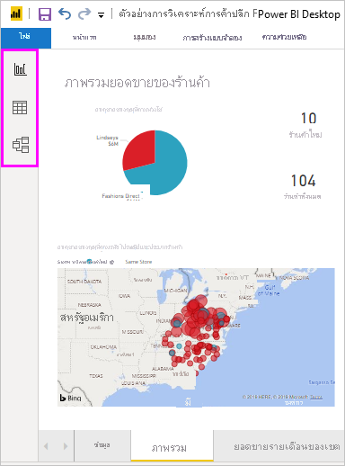
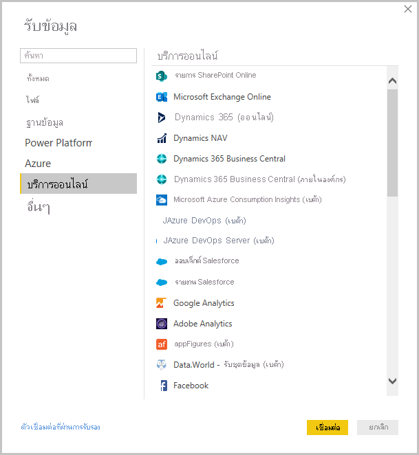
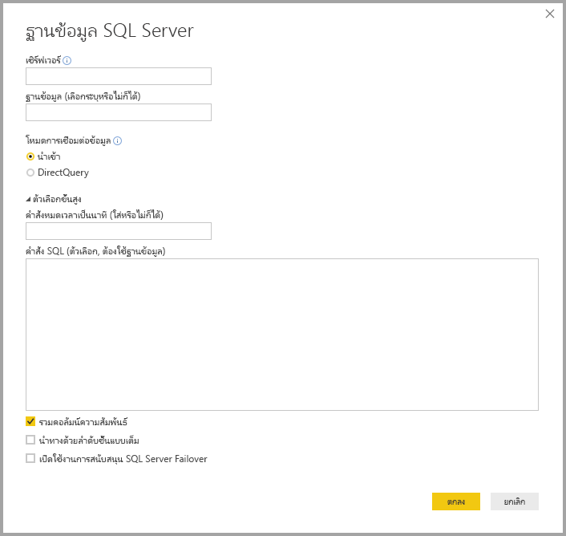
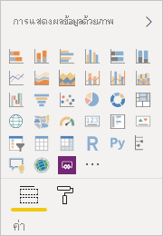
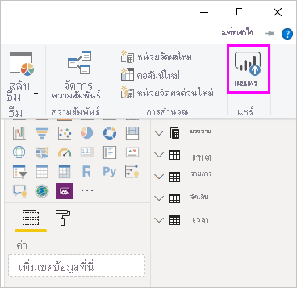

# Power BI Desktop คืออะไรWhat is Power BI Desktop?

*Power BI Desktop* คือแอปพลิเคชันฟรีที่คุณสามารถติดตั้งบนคอมพิวเตอร์ของคุณ เพื่อช่วยให้คุณเชื่อมต่อ แปลง และแสดงข้อมูลของคุณ*Power BI Desktop* is a free application you install on your local computer that lets you connect to, transform, and visualize your data. ด้วย Power BI Desktop คุณสามารถเชื่อมต่อกับหลายแหล่งข้อมูลและรวมกันได้ (มักเรียกว่า *การสร้างแบบจำลอง*) ลงในแบบจำลองข้อมูลWith Power BI Desktop, you can connect to multiple different sources of data, and combine them (often called *modeling*) into a data model. แบบจำลองข้อมูลนี้ช่วยให้คุณสามารถสร้างวิชวลและคอลเลกชันของวิชวลที่คุณสามารถแชร์เป็นรายงานกับบุคคลอื่นภายในองค์กรของคุณThis data model lets you build visuals, and collections of visuals you can share as reports, with other people inside your organization. ผู้ใช้ส่วนใหญ่ที่ทำงานในโครงการข่าวกรองธุรกิจ ใช้ Power BI Desktop เพื่อสร้างรายงาน จากนั้นใช้ *บริการของ Power BI* เพื่อแชร์รายงานของพวกเขาให้กับผู้อื่นMost users who work on business intelligence projects use Power BI Desktop to create reports, and then use the *Power BI service* to share their reports with others.

การใช้งานที่บ่อยที่สุดของ Power BI Desktop มีดังนี้:The most common uses for Power BI Desktop are as follows:

* เชื่อมต่อกับข้อมูลConnect to data
* แปลงและล้างข้อมูล เพื่อสร้างรูปแบบข้อมูลTransform and clean that data, to create a data model
* สร้างวิชวล เช่น แผนภูมิหรือกราฟ ที่แทนข้อมูลด้วยภาพCreate visuals, such as charts or graphs, that provide visual representations of the data
* สร้างรายงานที่ประกอบด้วยคอลเลกชันของวิชวล บนหน้ารายงานหนึ่งหรือหลายหน้าCreate reports that are collections of visuals, on one or more report pages
* แชร์รายงานให้กับผู้อื่นโดยใช้บริการของ Power BIShare reports with others by using the Power BI service

บุคคลที่มักรับผิดชอบงานดังกล่าว ถือว่าเป็น *นักวิเคราะห์ข้อมูล* (บางครั้งเรียกแค่ *นักวิเคราะห์*) หรือผู้เชี่ยวชาญด้านข่าวกรองธุรกิจ (มักจะเรียกว่า *นักสร้างรายงาน*)People most often responsible for such tasks are often considered *data analysts* (sometimes referred to as *analysts*) or business intelligence professionals (often referred to as *report creators*). แต่บุคคลจำนวนมากที่ไม่ได้มองตนเองว่าเป็นนักวิเคราะห์ข้อมูลหรือนักสร้างรายงาน ใช้ Power BI Desktop เพื่อสร้างรายงานที่น่าสนใจ หรือดึงข้อมูลจากแหล่งต่าง ๆ และสร้างรูปแบบข้อมูล ซึ่งสามารถแชร์ให้กับเพื่อนร่วมงานและองค์กรของพวกเขาHowever, many people who don't consider themselves an analyst or a report creator use Power BI Desktop to create compelling reports, or to pull data from various sources and build data models, which they can share with their coworkers and organizations.

> [!IMPORTANT]
> มีการอัปเดตและเผยแพร่ Power BI Desktop เป็นประจำทุกเดือน ซึ่งจะรวมคำติชมของลูกค้าและคุณสมบัติใหม่ด้วยPower BI Desktop is updated and released on a monthly basis, incorporating customer feedback and new features. รองรับเฉพาะเวอร์ชันล่าสุดของ Power BI Desktop เท่านั้น ซึ่งฝ่ายสนับสนุนสำหรับ Power BI Desktop จะขอให้ลูกค้าที่ติดต่อมาอัปเกรดเป็นเวอร์ชันล่าสุดOnly the most recent version of Power BI Desktop is supported; customers who contact support for Power BI Desktop will be asked to upgrade to the most recent version. คุณสามารถดาวน์โหลด Power BI Desktop เวอร์ชันล่าสุดได้จาก [Windows Store](https://aka.ms/pbidesktopstore) หรือไฟล์ปฏิบัติการเดียวซึ่งมีภาษาที่รองรับทั้งหมดที่คุณ[ดาวน์โหลด](https://www.microsoft.com/download/details.aspx?id=58494)และติดตั้งบนคอมพิวเตอร์ของคุณYou can get the most recent version of Power BI Desktop from the [Windows Store](https://aka.ms/pbidesktopstore), or as a single executable containing all supported languages that you [download](https://www.microsoft.com/download/details.aspx?id=58494) and install on your computer.

มีสามมุมมองที่พร้อมใช้งานใน Power BI Desktop ซึ่งคุณเลือกทางด้านซ้ายของพื้นที่ทำงานThere are three views available in Power BI Desktop, which you select on the left side of the canvas. มุมมองที่แสดงตามลำดับจะปรากฏขึ้นดังต่อไปนี้:The views, shown in the order they appear, are as follows:
* **รายงาน**: ในมุมมองนี้ คุณสมารถสร้างรายงานและวิชวลที่คุณใช้เวลาในการสร้างมากที่สุด**Report**: In this view, you create reports and visuals, where most of your creation time is spent.
* **ข้อมูล**: ในมุมมองนี้ คุณสามารถดูตารางหน่วยวัดและข้อมูลอื่น ๆ ที่ใช้ในแบบจำลองข้อมูลที่เชื่อมโยงกับรายงานของคุณ และแปลงข้อมูลเพื่อให้ใช้งานได้ดีที่สุดในแบบจำลองของรายงาน**Data**: In this view, you see the tables, measures, and other data used in the data model associated with your report, and transform the data for best use in the report's model.
* **แบบจำลอง**: ในมุมมองนี้ คุณจะเห็นและจัดการความสัมพันธ์ระหว่างตารางในแบบจำลองข้อมูลของคุณ**Model**: In this view, you see and manage the relationships among tables in your data model.

รูปภาพต่อไปนี้แสดงมุมมองสามแบบดังที่แสดงตามแนวทางด้านซ้ายของพื้นที่ทำงาน:The following image shows the three views, as displayed along the left side of the canvas:

 

## เชื่อมต่อกับข้อมูลConnect to data
เพื่อเริ่มต้นใช้งานด้วยPower BI Desktop ขั้นตอนแรกคือการเชื่อมต่อกับข้อมูลTo get started with Power BI Desktop, the first step is to connect to data. มีแหล่งข้อมูลต่าง ๆ มากมายที่คุณสามารถเชื่อมต่อจาก Power BI DesktopThere are many different data sources you can connect to from Power BI Desktop. 

วิธีเชื่อมต่อกับข้อมูล:To connect to data:

1. จากริบบอน **หน้าแรก** เลือก **รับข้อมูล** > **เพิ่มเติม**From the **Home** ribbon, select **Get Data** > **More**. 

   หน้าต่าง **รับข้อมูล** จะปรากฎขึ้น ซึ่งแสดงแหล่งข้อมูลหลายประเภทที่ Power BI Desktop สามารถเชื่อมต่อได้The **Get Data** window appears, showing the many categories to which Power BI Desktop can connect.

   

2. เมื่อคุณเลือกชนิดข้อมูล คุณจะได้รับพร้อมท์สำหรับข้อมูล เช่น URL และข้อมูลประจำตัว ที่จำเป็นสำหรับให้ Power BI Desktop เชื่อมต่อกับแหล่งข้อมูลในนามของคุณWhen you select a data type, you're prompted for information, such as the URL and credentials, necessary for Power BI Desktop to connect to the data source on your behalf.

   

3. หลังจากที่คุณเชื่อมต่อกับแหล่งข้อมูลหนึ่งหรือหลายแหล่ง คุณอาจต้องการแปลงข้อมูลเพื่อให้เป็นประโยชน์สำหรับคุณAfter you connect to one or more data sources, you may want to transform the data so it's useful for you.

## แปลงและล้างข้อมูล แล้วสร้างรูปแบบTransform and clean data, create a model

ใน Power BI Desktop คุณสามารถล้างและแปลงข้อมูลโดยใช้ [ตัวแก้ไขคิวรี Power](../transform-model/desktop-query-overview.md) ที่มีอยู่ภายในได้In Power BI Desktop, you can clean and transform data using the built-in [Power Query Editor](../transform-model/desktop-query-overview.md). ด้วยตัวแก้ไขคิวรี Power คุณสามารถทำการเปลี่ยนแปลงข้อมูลของคุณ เช่น เปลี่ยนชนิดของข้อมูล เอาคอลัมน์ออก หรือรวมข้อมูลจากหลายแหล่งWith Power Query Editor, you make changes to your data, such as changing a data type, removing columns, or combining data from multiple sources. ซึ่งคล้ายกับการแกะสลัก - คุณเริ่มต้นจากดินเหนียว (หรือข้อมูล) ก้อนใหญ่ จากนั้นแกะเอาชิ้นส่วนออกไป หรือเพิ่มส่วนอื่นถ้าจำเป็น จนกระทั่งรูปร่างของข้อมูลเป็นแบบที่คุณต้องการIt's like sculpting: you start with a large block of clay (or data), then shave off pieces or add others as needed, until the shape of the data is how you want it. 

วิธีการเริ่มต้นใช้งานตัวแก้ไขคิวรี Power:To start Power Query Editor:

- เลือก **แก้ไขคิวรี** > **แก้ไขคิวรี** จากริบบอน **หน้าแรก**Select **Edit Queries** > **Edit Queries** from the **Home** ribbon.

   หน้าต่าง **ตัวแก้ไขคิวรี Power** จะปรากฏขึ้นThe **Power Query Editor** window appears.

   

แต่ละขั้นตอนที่คุณดำเนินการในการแปลงข้อมูล (เช่น การเปลี่ยนชื่อตาราง การแปลงชนิดข้อมูล หรือการลบคอลัมน์) จะถูกบันทึกโดยตัวแก้ไขคิวรี PowerEach step you take in transforming data (such as renaming a table, transforming a data type, or deleting a column) is recorded by Power Query Editor. ทุกครั้งที่คิวรีนี้เชื่อมต่อกับแหล่งข้อมูล จะดำเนินการตามขั้นตอนเหล่านั้นเพื่อจัดรูปร่างข้อมูลในรูปแบบที่คุณระบุเสมอEvery time this query connects to the data source, those steps are carried out so that the data is always shaped the way you specify.

รูปภาพต่อไปนี้แสดง บานหน้าต่าง **ตัวแก้ไขคิวรี Power** สำหรับคิวรีที่ได้จัดรูปแบบ และกลายเป็นแบบจำลองThe following image shows the **Power Query Editor** window for a query that has been shaped, and turned into a model.

 

เมื่อข้อมูลของคุณอยู่ในแบบที่คุณต้องการแล้ว คุณสามารถสร้างวิชวล หรือการแสดงผลด้วยภาพOnce your data is how you want it, you can create visuals. 

## สร้างการแสดงผลด้วยภาพCreate visuals 

หลังจากที่คุณมีแบบจำลอง คุณสามารถลาก *เขตข้อมูล* ลงบนพื้นที่รายงานเพื่อสร้าง *วิชวล* ได้After you have a data model, you can drag *fields* onto the report canvas to create *visuals*. วิชวลเป็นการแสดงข้อมูลในรูปแบบของคุณด้วยภาพกราฟิกA visual is a graphic representation of the data in your model. มีวิชวลชนิดต่าง ๆ จำนวนมากให้เลือกจากใน Power BI DesktopThere are many different types of visuals to choose from in Power BI Desktop. วิชวลต่อไปนี้แสดงแผนภูมิคอลัมน์แบบง่ายThe following visual shows a simple column chart. 

วิธีการสร้างหรือเปลี่ยนแปลงวิชวล:To create or change a visual: 

- จากบานหน้าต่าง **การแสดงผลด้วยภาพ** เลือกไอคอนวิชวลFrom the **Visualizations** pane, select the visual icon. 

   

   ถ้าคุณมีวิชวลที่เลือกแล้วบนพื้นที่รายงาน วิชวลที่เลือกจะเปลี่ยนเป็นชนิดคุณที่เลือกIf you already have a visual selected on the report canvas, the selected visual changes to the type you selected. 

   ถ้าไม่เลือกวิชวลก่อนบนพื้นที่ทำงาน วิชวลใหม่จะถูกสร้างขึ้นตามตัวเลือกของคุณIf no visual is selected on the canvas, a new visual is created based on your selection.

## สร้างรายงานCreate reports

บ่อยครั้งที่คุณต้องการสร้างคอลเลกชันของวิชวลที่แสดงข้อมูลคุณในแง่มุมต่าง ๆ กัน จากข้อมูลที่คุณใช้สร้างแบบจำลองของคุณใน Power BI DesktopMore often, you'll want to create a collection of visuals that show various aspects of the data you've used to create your model in Power BI Desktop. คอลเลกชันของวิชวลในไฟล์ Power BI Desktop หนึ่งไฟล์ จะเรียกว่า *รายงาน*A collection of visuals, in one Power BI Desktop file, is called a *report*. รายงานสามารถมีหนึ่งหรือหลายหน้า เหมือนกับแฟ้ม Excel ที่สามารถมีเวิร์กชีตหนึ่งหรือหลายแผ่นA report can have one or more pages, just like an Excel file can have one or more worksheets.

ด้วย Power BI Desktop คุณสามารถสร้างรายงานที่ซับซ้อนและสวยงาม โดยใช้ข้อมูลจากหลายแหล่งข้อมูล ทั้งหมดในรายงานเดียว ที่คุณสามารถแชร์ให้กับผู้อื่นในองค์กรของคุณได้With Power BI Desktop you can create complex and visually rich reports, using data from multiple sources, all in one report that you can share with others in your organization.

ในรูปต่อไปนี้ คุณจะเห็นหน้าแรกของรายงาน Power BI Desktop ที่ชื่อว่า **Overview** เห็นจากแท็บที่ใกล้กับด้านล่างของรูปภาพIn the following image, you see the first page of a Power BI Desktop report, named **Overview**, as seen on the tab near the bottom of the image. 

## แชร์รายงานShare reports

หลังจากที่รายงานพร้อมที่จะแชร์ให้กับผู้อื่น คุณสามารถ *เผยแพร่* รายงานไปยังบริการของ Power BI และทำให้ทุกคนในองค์กรของคุณที่มีสิทธิ์การใช้งาน Power BI สามารถใช้รายงานได้After a report is ready to share with others, you can *publish* the report to the Power BI service, and make it available to anyone in your organization who has a Power BI license. 

วิธีการเผยแพร่รายงาน Power BI DesktopTo publish a Power BI Desktop report: 

1. เลือก **เผยแพร่** จากริบบอน **หน้าแรก**Select **Publish** from the **Home** ribbon.

   

   Power BI Desktop เชื่อมต่อคุณกับบริการของ Power BI กับบัญชี Power BI ของคุณPower BI Desktop connects you to the Power BI service with your Power BI account. 

2. Power BI จะแจ้งให้คุณเลือกตำแหน่งที่บริการของ Power BI คุณต้องการแชร์รายงานเช่น พื้นที่ทำงานของคุณ พื้นที่ทำงานของทีม หรือตำแหน่งที่ตั้งอื่นในบริการของ Power BIPower BI prompts you to select where in the Power BI service you'd like to share the report, such as your workspace, a team workspace, or some other location in the Power BI service. 

   คุณต้องมีสิทธิ์การใช้งาน Power BI เพื่อแชร์รายงานไปยังบริการของ Power BIYou must have a Power BI license to share reports to the Power BI service.

## ขั้นตอนถัดไปNext steps

หากต้องการเริ่มต้นใช้งานด้วย Power BI Desktop สิ่งแรกที่คุณต้องทำคือดาวน์โหลด และติดตั้งแอปพลิเคชันTo get started with Power BI Desktop, the first thing you need is to download and install the application. มีสองวิธีในการรับ Power BI Desktop:There are two ways to get Power BI Desktop:

* [รับ Power BI Desktop จาก Windows StoreGet Power BI Desktop from the Windows Store](https://aka.ms/pbidesktopstore)
* [ดาวน์โหลด Power BI Desktop จากเว็บDownload Power BI Desktop from the web](https://www.microsoft.com/download/details.aspx?id=58494)