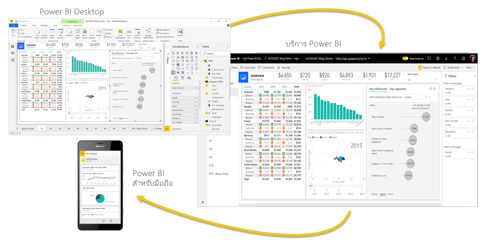
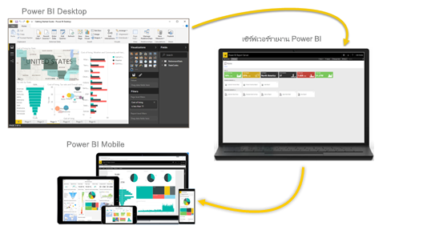

# Power BI คืออะไรWhat is Power BI?
**Power BI** คือคอลเลกชันของบริการซอฟต์แวร์ แอป และตัวเชื่อมต่อที่ทำงานร่วมกันเพื่อเปลี่ยนแหล่งข้อมูลที่ไม่เกี่ยวข้องของคุณให้เป็นข้อมูลเชิงลึกที่สอดคล้องกัน แสดงข้อมูลได้ และโต้ตอบได้**Power BI** is a collection of software services, apps, and connectors that work together to turn your unrelated sources of data into coherent, visually immersive, and interactive insights. ข้อมูลของคุณอาจเป็นสเปรดชีต Excel หรือคอลเลกชันของระบบ Cloud และคลังข้อมูลแบบไฮบริดภายในองค์กรYour data may be an Excel spreadsheet, or a collection of cloud-based and on-premises hybrid data warehouses. Power BI ช่วยให้คุณเชื่อมต่อกับแหล่งข้อมูลของคุณ แสดงภาพและค้นพบเรื่องสำคัญ รวมถึงแชร์สิ่งเหล่านั้นกับบุคคลหรือทุกคนที่คุณต้องการได้อย่างง่ายดายPower BI lets you easily connect to your data sources, visualize and discover what's important, and share that with anyone or everyone you want.

## ส่วนต่างๆ ของ Power BIThe parts of Power BI
Power BI ประกอบด้วยองค์ประกอบหลายอย่างที่ทำงานร่วมกันโดยเริ่มต้นด้วยข้อมูลพื้นฐานสามประการต่อไปนี้:Power BI consists of several elements that all work together, starting with these three basics: 
- แอปพลิเคชันสำหรับเครื่องเดสก์ท็อป Windows ที่เรียกว่า **Power BI Desktop**A Windows desktop application called **Power BI Desktop**.
- บริการ SaaS (*Software as a Service*) แบบออนไลน์ที่เรียกว่า **บริการของ Power BI**An online SaaS (*Software as a Service*) service called the **Power BI service**. 
- **แอปสำหรับอุปกรณ์เคลื่อนที่** Power BI สำหรับอุปกรณ์ Windows, iOS และ AndroidPower BI **mobile apps** for Windows, iOS, and Android devices.

องค์ประกอบทั้งสามเหล่านี้ อันได้แก่ &mdash;Pwer BI Desktop บริการ และแอปสำหรับอุปกรณ์เคลื่อนที่&mdash; ได้รับการออกแบบมาเพื่อช่วยคุณในการสร้าง แชร์ และใช้ข้อมูลเชิงลึกทางธุรกิจด้วยวิธีหรือบทบาทที่คุณต้องการได้อย่างมีประสิทธิภาพสูงสุดThese three elements&mdash;Power BI Desktop, the service, and the mobile apps&mdash;are designed to let you create, share, and consume business insights in the way that serves you and your role most effectively.

นอกเหนือจากนี้ Power BI ยังประกอบด้วยองค์ประกอบอื่นๆ อีกสองประการ:Beyond those three, Power BI also features two other elements:

- **ตัวสร้างรายงาน Power BI** สำหรับการสร้างรายงานที่มีการแบ่งหน้าเพื่อแชร์ในบริการของ Power BI**Power BI Report Builder**, for creating paginated reports to share in the Power BI service. อ่านเพิ่มเติมเกี่ยวกับ [รายงานที่มีการแบ่งหน้า](#paginated-reports-in-the-power-bi-service) ในภายหลังในบทความนี้Read more about [paginated reports](#paginated-reports-in-the-power-bi-service) later in this article.
- **เซิร์ฟเวอร์รายงาน Power BI** เซิร์ฟเวอร์รายงานภายในองค์กรที่คุณสามารถเผยแพร่รายงาน Power BI ของคุณได้หลังจากที่สร้างใน Power BI Desktop**Power BI Report Server**, an on-premises report server where you can publish your Power BI reports, after creating them in Power BI Desktop. เรียนรู้เพิ่มเติมเกี่ยวกับ [เซิร์ฟเวอร์รายงาน Power BI](#on-premises-reporting-with-power-bi-report-server) ในภายหลังในบทความนี้Read more about [Power BI Report Server](#on-premises-reporting-with-power-bi-report-server) later in this article.

## Power BI เหมาะสมกับบทบาทของคุณอย่างไรHow Power BI matches your role
วิธีที่คุณใช้ Power BI อาจขึ้นอยู่กับบทบาทของคุณในโครงการหรือในทีมHow you use Power BI may depend on your role in a project or on a team. ผู้อื่นในบทบาทอื่นอาจใช้ Power BI แตกต่างกันไป ซึ่งเป็นสิ่งที่สามารถทำได้Other people, in other roles, might use Power BI differently.

ตัวอย่างเช่น คุณอาจใช้ **บริการของ Power BI** เป็นหลักเพื่อดูรายงานและแดชบอร์ดFor example, you might primarily use the **Power BI service** to view reports and dashboards. เพื่อนร่วมงานที่ทำงานกับตัวเลขและสร้างรายงานทางธุรกิจอาจใช้งาน **Power BI Desktop** หรือ **ตัวสร้างรายงาน Power BI** เพื่อสร้างรายงาน จากนั้นเผยแพร่รายงานเหล่านั้นไปยังบริการของ Power BI ซึ่งเป็นที่ที่คุณดูได้Your number-crunching, business-report-creating coworker might make extensive use of **Power BI Desktop** or **Power BI Report Builder** to create reports, then publish those reports to the Power BI service, where you view them. และเพื่อนร่วมงานคนอื่นๆ ในแผนกการขายอาจใช้ **แอป Power BI บนโทรศัพท์** เพื่อตรวจดูความคืบหน้าของโควต้าการขาย และดูรายละเอียดลูกค้าเป้าหมายAnother coworker, in sales, might mainly use the **Power BI phone app** to monitor progress on sales quotas, and to drill into new sales lead details.

ถ้าคุณเป็นนักพัฒนา คุณอาจใช้ Power BI API เพื่อพุชข้อมูลลงในชุดข้อมูล หรือเพื่อฝังแดชบอร์ดและรายงานลงในแอปพลิเคชันแบบกำหนดเองของคุณIf you're a developer, you might use Power BI APIs to push data into datasets or to embed dashboards and reports into your own custom applications. มีแนวคิดสำหรับวิชวลใหม่หรือไม่Have an idea for a new visual? ลองสร้างด้วยตัวคุณเอง แล้วแชร์กับผู้อื่นBuild it yourself and share it with others.  

คุณยังอาจใช้แต่ละองค์ประกอบของ Power BI ในช่วงเวลาที่ต่างกัน โดยขึ้นอยู่กับสิ่งที่คุณต้องการทำหรือบทบาทของคุณในโครงการที่มีYou also might use each element of Power BI at different times, depending on what you're trying to achieve or your role for a given project.

วิธีที่คุณใช้ Power BI สามารถยึดตามลักษณะหรือบริการของ Power BI ซึ่งเป็นเครื่องมือที่ดีที่สุดสำหรับสถานการณ์ของคุณHow you use Power BI can be based on which feature or service of Power BI is the best tool for your situation. ตัวอย่างเช่น คุณสามารถใช้ Power BI Desktop ในการสร้างรายงานเกี่ยวกับการส่วนมีส่วนร่วมกับลูกค้าสำหรับทีมของคุณเอง และคุณอาจดูสินค้าคงคลังและความคืบหน้ากระบวนการผลิตในแดชบอร์ดแบบเรียลไทม์ในบริการของ Power BIFor example, you can use Power BI Desktop to create reports for your own team about customer engagement statistics and you can view inventory and manufacturing progress in a real-time dashboard in the Power BI service. คุณสามารถสร้างรายงานที่มีการแบ่งหน้าของใบแจ้งหน้าที่เข้าถึงได้ โดยยึดตามชุดข้อมูล Power BIYou can create a paginated report of mailable invoices, based on a Power BI dataset. เนื่องจากแต่ละส่วนของ Power BI พร้อมให้บริการแก่คุณ จึงเป็นเหตุผลที่ผลิตภัณฑ์ Power BI มีความยืดหยุ่นและน่าสนใจEach part of Power BI is available to you, which is why it's so flexible and compelling.

สำรวจเอกสารประกอบที่เหมาะสมกับบทบาทของคุณ:Explore documents that pertain to your role:
- Power BI สำหรับ [*ผู้ใช้ทางธุรกิจ*](../consumer/end-user-consumer.md)Power BI for [*business users*](../consumer/end-user-consumer.md)
- Power BI Desktop สำหรับ [*ผู้สร้างรายงาน*](desktop-what-is-desktop.md)Power BI Desktop for [*report creators*](desktop-what-is-desktop.md)
- ตัวสร้างรายงาน Power BI สำหรับ [*ผู้สร้างรายงานระดับองค์กร*](../paginated-reports/paginated-reports-report-builder-power-bi.md)Power BI Report Builder for [*enterprise report creators*](../paginated-reports/paginated-reports-report-builder-power-bi.md)
- Power BI สำหรับ [*ผู้ดูแลระบบ*](../admin/service-admin-administering-power-bi-in-your-organization.md)Power BI for [*administrators*](../admin/service-admin-administering-power-bi-in-your-organization.md)
- Power BI สำหรับ *นักพัฒนา*Power BI for *developers*
    * [การวิเคราะห์แบบฝังตัวด้วย Power BIEmbedded analytics with Power BI](../developer/embedded/embedding.md)
    * [Power BI อะไรที่ถูกฝังอยู่ใน Azure?What is Power BI Embedded in Azure?](../developer/embedded/azure-pbie-what-is-power-bi-embedded.md)
    * [วิชวลใน Power BIVisuals in Power BI](../developer/visuals/power-bi-custom-visuals.md)
    * [นักพัฒนาสามารถทำอะไรด้วย API ของ Power BI ได้บ้างWhat can developers do with the Power BI API?](../developer/automation/overview-of-power-bi-rest-api.md)

## ลำดับการทำงานใน Power BIThe flow of work in Power BI
เวิร์กโฟลว์ทั่วไปใน Power BI เริ่มจากการเชื่อมต่อกับแหล่งข้อมูลใน Power BI Desktop และสร้างรายงานOne common workflow in Power BI begins by connecting to data sources in Power BI Desktop and building a report. จากนั้น คุณจึงเผยแพร่รายงานนั้นจาก Power BI Desktop ไปยัง บริการของ Power BI และแชร์เพื่อให้ผู้ใช้ทางธุรกิจในบริการของ Power BI และอุปกรณ์เคลื่อนที่ สามารถดู และโต้ตอบกับรายงานได้You then publish that report from Power BI Desktop to the Power BI service, and share it so business users in the Power BI service and on mobile devices can view and interact with the report.

เวิร์กโฟลว์นี้เป็นปกติ และแสดงวิธีการทำงานขององค์ประกอบหลักทั้งสามของ Power BIThis workflow is common, and shows how the three main Power BI elements complement one another.

นี่คือ [การเปรียบเทียบของ Power BI Desktop และบริการของ Power BI](../fundamentals/service-service-vs-desktop.md) โดยละเอียดHere's a detailed [comparison of Power BI Desktop and the Power BI service](../fundamentals/service-service-vs-desktop.md).

## รายงานที่มีการแบ่งหน้าในบริการ Power BIPaginated reports in the Power BI service

เวิร์กโฟลว์อื่นเกี่ยวข้องกับรายงานที่มีการแบ่งหน้าในบริการของ Power BIAnother workflow involves paginated reports in the Power BI service. ผู้สร้างรายงานระดับองค์กรจะเป็นผู้ออกแบบรายงานที่มีการแบ่งหน้าสำหรับพิมพ์หรือแชร์Enterprise report creators design paginated reports to be printed or shared. และยังสามารถแชร์รายงานเหล่านี้ในบริการของ Power BI อีกด้วยThey can also share these reports in the Power BI service. ซึ่งเรียกว่า *แบบแบ่งหน้า* เนื่องจากมีการจัดรูปแบบให้พอดีกับหน้าThey're called *paginated* because they're formatted to fit well on a page. โดยมักใช้สำหรับรายงานการดำเนินงานหรือการพิมพ์ฟอร์มต่างๆ เช่น ใบแจ้งหนี้หรือสำเนาบทสนทนาThey're often used for operational reports, or for printing forms such as invoices or transcripts. โดยกำหนดให้แสดงข้อมูลทั้งหมดในตาราง แม้ว่าตารางนั้นต้องใช้พื้นที่หลายหน้าThey display all the data in a table, even if the table spans multiple pages. ตัวสร้างรายงานใน Power BI เป็นเครื่องมือแบบเดี่ยวเพื่อใช้เขียนรายงานแบบแบ่งหน้าPower BI Report Builder is the standalone tool for authoring paginated reports.

:::image type="content" source="media/power-bi-overview/paginated-report-invoice-power-bi-service.png" alt-text="สกรีนช็อตของรายงานที่มีการแบ่งหน้าในบริการของ Power B I":::

อ่านเพิ่มเติมเกี่ยวกับ [รายงานที่มีการแบ่งหน้า](../paginated-reports/paginated-reports-report-builder-power-bi.md) ในบริการของ Power BIRead more about [paginated reports](../paginated-reports/paginated-reports-report-builder-power-bi.md) in the Power BI service.

## การรายงานในองค์กรด้วยเซิร์ฟเวอร์รายงาน Power BIOn-premises reporting with Power BI Report Server

จะเกิดอะไรขึ้น ถ้าคุณจำเป็นต้องเก็บรายงานของคุณในองค์กร กล่าวคือ อยู่ด้านหลังไฟร์วอลล์What if you need to keep your reports on premises, say, behind a firewall?  ลองอ่านต่อไปRead on.

คุณสามารถสร้าง ปรับใช ้และจัดการรายงาน Power BI ใน Power BI Desktop และรายงานที่มีการแบ่งหน้าในตัวสร้างรายงาน ด้วยเครื่องมือและบริการที่พร้อมใช้งานที่เซิร์ฟเวอร์รายงาน Power BI มีให้You can create, deploy, and manage Power BI reports in Power BI Desktop, and paginated reports in Report Builder, with the ready-to-use tools and services that Power BI Report Server provides.

เซิร์ฟเวอร์รายงาน Power BI เป็นโซลูชันที่คุณปรับใช้หลังไฟร์วอลล์ของคุณ และจัดส่งรายงานของคุณไปยังผู้ใช้ที่ถูกต้อง ด้วยวิธีต่างๆ ไม่ว่าจะดูในเว็บเบราว์เซอร์ บนอุปกรณ์เคลื่อนที่ หรือทางอีเมลPower BI Report Server is a solution that you deploy behind your firewall and then deliver your reports to the right users in different ways, whether that's viewing them in a web browser, on a mobile device, or as an email. และเนื่องจากเซิร์ฟเวอร์รายงาน Power BI เข้ากันได้กับ Power BI ในระบบคลาวด์ คุณสามารถย้ายไปยังคลาวด์เมื่อคุณพร้อมAnd because Power BI Report Server is compatible with Power BI in the cloud, you can move to the cloud when you're ready. 

เรียนรู้เพิ่มเติมเกี่ยวกับ [Power BI Report Server](../report-server/get-started.md)Read more about [Power BI Report Server](../report-server/get-started.md).

## ขั้นตอนถัดไปNext steps
- [เริ่มต้นใช้งานด่วน: เรียนรู้วิธีการสำรวจบริการของ Power BIQuickstart: Learn your way around the Power BI service](../consumer/end-user-experience.md)   
- [บทช่วยสอน: เริ่มต้นใช้งานกับบริการของ Power BITutorial: Get started with the Power BI service](service-get-started.md)
- [เริ่มต้นใช้งานด่วน: เชื่อมต่อกับข้อมูลใน Power BI DesktopQuickstart: Connect to data in Power BI Desktop](../connect-data/desktop-quickstart-connect-to-data.md)
