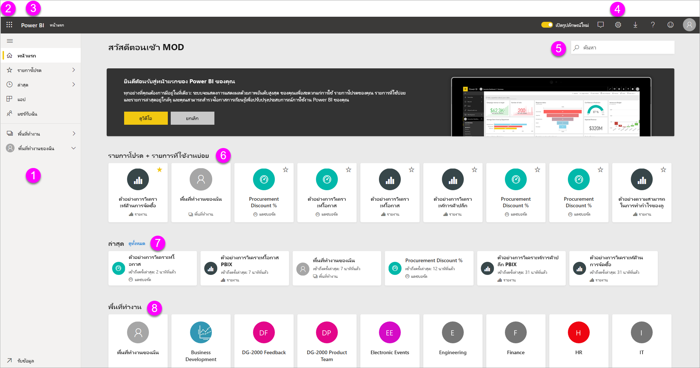

# แนวคิดพื้นฐานสำหรับนักออกแบบในบริการ Power BIBasic concepts for designers in the Power BI service

จุดประสงค์ของบทความนี้คือช่วยให้คุณคุ้นเคยกับบริการของ Power BI: องค์ประกอบต่างๆ วิธีการทำงานร่วมกัน และวิธีที่คุณสามารถทำงานกับผลิตภัณฑ์The aim of this article is to orient you to the Power BI service: what the different elements are, how they work together, and how you can work with them. คุณอาจได้เรียนรู้เพิ่มเติมหากคุณได้ [ลงชื่อเข้าใช้สำหรับบริการของ Power BI](service-self-service-signup-for-power-bi.md) และ [เพิ่มข้อมูลบางอย่าง](../connect-data/service-get-data.md) อยู่แล้วYou may get more out of it if you've already [signed up for the Power BI service](service-self-service-signup-for-power-bi.md) and [added some data](../connect-data/service-get-data.md). ในฐานะนักออกแบบ เวิร์กโฟลว์ทั่วไปของคุณมักเริ่มต้น ด้วยการสร้างรายงานใน Power BI DesktopAs a designer, your typical workflow is usually to start by creating reports in Power BI Desktop. จากนั้นจึงเผยแพร่รายงานไปยังบริการของ Power BI ซึ่งเป็นที่ที่คุณสามารถดำเนินการปรับเปลี่ยนต่อได้Then you publish them to the Power BI service, where you can continue modifying them. นอกจากนี้คุณยังสามารถสร้างแดชบอร์ดโดยยึดตามรายงานของคุณในบริการของ Power BI ได้อีกด้วยYou also create the dashboards based on your reports in the Power BI service. 

สำหรับบทความนี้ หากคุณยังไม่มีรายงานของตนเอง โปรดลองติดตั้ง [ชุดเนื้อหาตัวอย่าง Power BI](../create-reports/sample-datasets.md)For this article, if you don't have your own reports yet try installing one of the  [Power BI samples](../create-reports/sample-datasets.md).

เมื่อคุณเปิดบริการของ Power BI ในเบราว์เซอร์ คุณจะเริ่มต้นที่หน้าจอหลักของคุณWhen you open the Power BI service in a browser, you start at your Home screen. นี่คือองค์ประกอบที่คุณอาจเห็น:Here are the elements you may see:

1. แผงนำทางNavigation pane
2. ตัวเปิดแอป  Microsoft 365Microsoft 365 app launcher
3. ปุ่มหน้าหลัก Power BIPower BI home button
4. ปุ่มไอคอน รวมถึงการตั้งค่า วิธีใช้ และคำติชมIcon buttons, including settings, help, and feedback
5. กล่องค้นหาSearch box
6. แดชบอร์ดที่ใช้งานบ่อยและรายงานโปรด รายงานและพื้นที่ทำงานFavorite and frequent dashboards, reports, and workspaces
7. แดชบอร์ด รายงานและพื้นที่ทำงานที่พึ่งใช้งานRecent dashboards, reports, and workspaces
8. พื้นที่ทำงานของคุณYour workspaces

ผู้ใช้ปลายทางของคุณที่ใช้รายงานและแดชบอร์ดของคุณจะเริ่มประสบการณ์การใช้งานในบริการของ Power BI ในเบราว์เซอร์เหมือนกันYou and the end users for your reports and dashboards have the same start experience in the Power BI service in a browser.

เราจะเจาะลึกรายละเอียดคุณลักษณะเหล่านี้ในภายหลัง แต่ก่อนอื่นมาดูแนวคิดบางอย่างสำหรับ Power BI กันก่อนWe'll dig into these features later, but first let's review some Power BI concepts. หรือคุณอาจต้องการดูวิดีโอนี้ก่อนOr you might want to watch this video first.  ในวิดีโอ Will จะรีวิวแนวคิดพื้นฐานและพาชมบริการของ Power BIIn the video, Will reviews the basic concepts and gives a tour of the Power BI service.

<iframe width="560" height="315" src="https://www.youtube.com/embed/B2vd4MQrz4M" frameborder="0" allowfullscreen></iframe>

## แนวคิดสำหรับ Power BIPower BI concepts
โครงสร้างหลักห้าชนิดของ Power BI คือ: *แดชบอร์ด*, *รายงาน*, *เวิร์กบุค*, *ชุดข้อมูล* และ *กระแสข้อมูล*The five major building blocks of Power BI are: *dashboards*, *reports*, *workbooks*, *datasets*, and *dataflows*. โครงสร้างทั้งหมดจะถูกจัดระเบียบเป็น *พื้นที่ทำงาน* และถูกสร้างขึ้นบน *ความจุ*They're all organized into *workspaces*, and they're created on *capacities*.  สิ่งสำคัญคือต้องเข้าใจความจุและพื้นที่ทำงานก่อนที่เราจะเจาะลึกลงไปในโครงสร้างหลักห้าชนิด ดังนั้นเรามาเริ่มต้นกันที่ส่วนแรกก่อนเลยIt's important to understand capacities and workspaces before we dig into the five building blocks, so let's start there.

## ความจุCapacities
ความจุเป็นแนวคิดหลักของ Power BI ที่แสดงถึงชุดของทรัพยากร (หน่วยเก็บข้อมูล ตัวประมวลผล และหน่วยความจำ) ที่ใช้เพื่อโฮสต์และส่งมอบเนื้อหา Power BI ของคุณCapacities are a core Power BI concept representing a set of resources (storage, processor, and memory) used to host and deliver your Power BI content. ความจุเป็น _แบบใช้ร่วมกัน_ หรือไม่ก็ _เฉพาะ_Capacities are either _shared_ or _dedicated_. ความจุแบบใช้ร่วมกันจะถูกแชร์กับลูกค้าคนอื่นของ Microsoft ในขณะที่ความจุแบบเฉพาะนั้นมุ่งมั่นอย่างเต็มที่กับลูกค้ารายเดียวA shared capacity is shared with other Microsoft customers, while a dedicated capacity is fully committed to a single customer. ความจุแบบเฉพาะจำเป็นต้องใช้[การสมัครสมาชิก](../admin/service-premium-what-is.md) และอธิบายไว้ในบทความ [การจัดการความจุแบบพรีเมี่ยม](../admin/service-premium-capacity-manage.md)Dedicated capacities require a [subscription](../admin/service-premium-what-is.md), and are fully described in the [Managing Premium capacities](../admin/service-premium-capacity-manage.md) article.

ตามค่าเริ่มต้น พื้นที่ทำงานจะถูกสร้างขึ้นในความจุแบบใช้ร่วมกันBy default, workspaces are created on a shared capacity. ในความจุที่ใช้ร่วมกัน ปริมาณงานจะทำงานบนแหล่งทรัพยากรเชิงคำนวณที่ใช้ร่วมกับลูกค้าคนอื่น ๆIn shared capacity, workloads run on computational resources shared with other customers. เมื่อความจุต้องใช้ทรัพยากรร่วมกัน ขีดจำกัดจะถูกกำหนดไว้เพื่อให้แน่ใจว่า "fair play" เช่น ขนาดแบบจำลองสูงสุด (1 GB) และความถี่ในการรีเฟรชรายวันสูงสุด (แปดครั้งต่อวัน)As the capacity must share resources, limitations are imposed to ensure "fair play", such as the maximum model size (1 GB) and maximum daily refresh frequency (eight times per day).

## พื้นที่ทำงานWorkspaces
พื้นที่ทำงานจะถูกสร้างขึ้นบนความจุWorkspaces are created on capacities. โดยพื้นฐานแล้ว คือคอนเทนเนอร์สำหรับแดชบอร์ด รายงาน เวิร์กบุค ชุดข้อมูลและกระแสข้อมูลใน Power BIEssentially, they are containers for dashboards, reports, workbooks, datasets, and dataflows in Power BI.

มีพื้นที่ทำงานสองชนิด: *พื้นที่ทำงานของฉัน* และ *พื้นที่ทำงาน*There are two types of workspaces: *My workspace* and *workspaces*.

- *พื้นที่ทำงานของฉัน* เป็นพื้นที่ทำงานส่วนบุคคลสำหรับให้ลูกค้า Power BI ใด ๆ ทำงานกับเนื้อหาของตนเอง*My workspace* is the personal workspace for any Power BI customer to work with your own content. เฉพาะคุณเท่านั้นที่สามารถเข้าถึงพื้นที่ทำงานของฉัน (My Workspace) ของคุณเองได้Only you have access to your My workspace. คุณสามารถแชร์แดชบอร์ดและรายงานจาก พื้นที่ทำงานของฉัน ได้You can share dashboards and reports from your My Workspace. หากคุณต้องการทำงานร่วมกันบนแดชบอร์ดและรายงาน หรือสร้างแอป คุณจะต้องทำงานในพื้นที่ทำงานIf you want to collaborate on dashboards and reports, or create an app, then you want to work in a workspace.

-  *พื้นที่ทำงาน* ถูกใช้เพื่อทำงานร่วมกันและแบ่งปันเนื้อหากับเพื่อนร่วมงาน*Workspaces* are used to collaborate and share content with colleagues. คุณสามารถเพิ่มเพื่อนร่วมงานลงในพื้นที่ทำงานของคุณและทำงานร่วมกันบนแดชบอร์ด รายงาน เวิร์กบุ๊ก และชุดข้อมูลYou can add colleagues to your workspaces and collaborate on dashboards, reports, workbooks, and datasets. ด้วยข้อยกเว้นหนึ่งข้อ สมาชิกของพื้นที่ทำงานทั้งหมดจำเป็นต้องมีสิทธิ์การใช้ Power BI ProWith one exception, all workspace members need Power BI Pro licenses. อ่านเพิ่มเติมเกี่ยวกับ[พื้นที่ทำงานใหม่](../collaborate-share/service-create-the-new-workspaces.md)Read more about the [new workspaces](../collaborate-share/service-create-the-new-workspaces.md). 

    นอกจากนี้พื้นที่ทำงานยังเป็นสถานที่ที่คุณสร้าง เผยแพร่ และจัดการ *แอป* สำหรับองค์กรของคุณอีกด้วยWorkspaces are also the places where you create, publish, and manage *apps* for your organization. คิดว่าพื้นที่ทำงานเป็นส่วนการจัดเตรียมและคอนเทนเนอร์สำหรับเนื้อหาที่ประกอบเป็นแอป Power BIThink of workspaces as staging areas and containers for the content that will make up a Power BI app. *แอปฯ* คืออะไร?So what is an *app*? นี่คือคอลเลกชันของแดชบอร์ดและรายงานที่สร้างขึ้นเพื่อนำเสนอเมตริกหลักให้กับผู้บริโภค Power BI ในองค์กรของคุณIt's a collection of dashboards and reports built to deliver key metrics to the Power BI consumers in your organization. แอปเป็นแบบโต้ตอบได้ แต่ผู้บริโภคไม่สามารถแก้ไขได้Apps are interactive, but consumers can't edit them. แต่ผู้บริโภคแอปฯ (ผู้ร่วมงานที่มีสิทธิ์เข้าถึงแอปฯ) ไม่จำเป็นต้องมีสิทธิ์การใช้งาน ProApp consumers, the colleagues who have access to the apps, don't necessarily need Pro licenses.  

เริ่มต้นด้วยการแชร์ทั่วไปเช่น [วิธีการแชร์แดชบอร์ดที่คุณทำงาน](../collaborate-share/service-how-to-collaborate-distribute-dashboards-reports.md) เพื่อเรียนรู้เพิ่มเติมTo learn more about sharing in general, start with [Ways to share dashboards your work](../collaborate-share/service-how-to-collaborate-distribute-dashboards-reports.md).

ในตอนนี้ เราก็จะมาพูดถึงโครงสร้างหลักห้าชนิดของ Power BI กันNow, on to the five Power BI building blocks.

## กระแสข้อมูลDataflows
*กระแสข้อมูล* ช่วยให้องค์กรสามารถรวมข้อมูลจากแหล่งที่ไม่เหมือนกันให้สอดคล้องกันได้A *dataflow* helps organizations to unify data from disparate sources. ซึ่งเป็นตัวเลือก และมักใช้ในโครงการที่ซับซ้อนหรือใหญ่กว่าThey are optional, and are often used in complex or larger projects. เป็นตัวแทนของข้อมูลที่เตรียมและจัดทำไว้สำหรับชุดข้อมูลThey represent data prepared and staged for use by datasets. อย่างไรก็ตาม กระแสข้อมูลไม่สามารถใช้เป็นแหล่งข้อมูลสำหรับการรายงานได้โดยตรงHowever, they can't be used directly as a source for reporting. ซึ่งใช้ประโยชน์จากคอลเลกชันที่ครอบคลุมของตัวเชื่อมต่อข้อมูล Microsoft การเปิดใช้งานการเพิ่มข้อมูลจากแหล่งข้อมูลภายในองค์กรและแหล่งข้อมูลบนระบบคลาวด์They leverage the extensive collection of Microsoft data connectors, enabling the ingestion of data from on-premises and cloud-based data sources.

กระแสข้อมูลถูกสร้างและจัดการในพื้นที่ทำงานเท่านั้น (แต่ไม่ใช่ *พื้นที่ทำงานของฉัน*) และถูกเก็บเป็นเอนทิตีใน Common Data Model (CDM) ใน Azure Data Lake Storage Gen2Dataflows are only created and managed in workspaces (but not *My Workspace*), and they are stored as entities in the Common Data Model (CDM) in Azure Data Lake Storage Gen2. โดยทั่วไปแล้วจะมีการกำหนดตารางเวลาให้รีเฟรชตามการเกิดซ้ำเพื่อจัดเก็บข้อมูลที่เป็นปัจจุบันTypically, they're scheduled to refresh on a recurring basis to store up-to-date data. ซึ่งเหมาะอย่างมากสำหรับการเตรียมข้อมูล เพื่อใช้งานและใช้ซ้ำ โดยชุดข้อมูลของคุณThey're great for preparing data for use—and potential re-use—by your datasets. โปรดดูที่บทความ [การเตรียมข้อมูลแบบบริการตนเองใน Power BI](../transform-model/dataflows/dataflows-introduction-self-service.md)For more information, see the [Self-service data prep in Power BI](../transform-model/dataflows/dataflows-introduction-self-service.md) article.

คุณไม่สามารถมีแดชบอร์ดหรือรายงานที่ไม่มีข้อมูล (เช่นกัน คุณสามารถมีแดชบอร์ดว่างเปล่าและรายงานเปล่า แต่ไม่มีประโยชน์จนกว่าพวกเขาจะมีข้อมูล) ดังนั้นในตอนนี้เราขอแนะนำ **ชุดข้อมูล**You can't have dashboards or reports without data (well, you can have empty dashboards and empty reports, but they're not useful until they have data), so let's now introduce **datasets**.

## ชุดข้อมูลDatasets
*ชุดข้อมูล* คือคอลเลกชันของข้อมูลที่คุณ *นำเข้า* หรือ *เชื่อมต่อ*A *dataset* is a collection of data that you *import* or *connect* to. Power BI ช่วยให้คุณเชื่อมต่อและนำเข้าชุดข้อมูลทุกประเภท และการนำข้อมูลทั้งหมดมารวมกันไว้ในที่เดียวPower BI lets you connect to and import all sorts of datasets and bring all of it together in one place. นอกจากนี้ชุดข้อมูลยังสามารถนำมาจากกระแสข้อมูลได้อีกด้วยDatasets can also source data from dataflows.

ชุดข้อมูลเกี่ยวข้องกับ *พื้นที่ทำงาน* และชุดข้อมูลหนึ่งสามารถเป็นส่วนหนึ่งของหลายพื้นที่ทำงานได้Datasets are associated with *workspaces* and a single dataset can be part of many workspaces. เมื่อคุณเปิดพื้นที่ทำงาน ชุดข้อมูลที่เกี่ยวข้องจะแสดงอยู่ใต้แท็บ **ชุดข้อมูล** ชุดข้อมูลแต่ละรายการแสดงถึงแหล่งข้อมูลหนึ่งแหล่ง ตัวอย่างเช่น เวิร์กบุ๊ก Excel ใน OneDrive หรือชุดข้อมูลแบบตาราง SSAS ภายในองค์กร หรือชุดข้อมูล SalesforceWhen you open a workspace, the associated datasets are listed under the **Datasets** tab. Each listed dataset represents a single source of data, for example, an Excel workbook on OneDrive, or an on-premises SSAS tabular dataset, or a Salesforce dataset. มีแหล่งข้อมูลต่างๆ มากมายที่ระบบสนับสนุน และเราเพิ่มแหล่งข้อมูลใหม่ๆ อยู่ตลอดเวลาThere are many different data sources supported, and we're adding new ones all the time. ดูรายการของชนิดของ[ชุดข้อมูลที่สามารถใช้ได้กับ Power BI](../connect-data/service-get-data.md)See the list of [dataset types that you can use with Power BI](../connect-data/service-get-data.md).

ในตัวอย่างด้านล่าง เราเลือกพื้นที่ทำงาน "การขายและการตลาด" และคลิกที่แท็บสำหรับ **ชุดข้อมูล**In the example below, I've selected the "Sales and marketing" workspace and clicked the tab for **Datasets**.

**หนึ่ง** ชุดข้อมูล...**ONE** dataset...

* สามารถใช้ซ้ำได้ในหนึ่งหรือในหลายพื้นที่ทำงานcan be used over and over in one or in many workspaces.
* สามารถใช้ในรายงานต่าง ๆ มากมายได้can be used in many different reports.
* การแสดงภาพจากชุดข้อมูลหนึ่งสามารถแสดงบนหลายแดชบอร์ดได้Visualizations from that one dataset can display on many different dashboards.

  

หากต้องการ [เชื่อมต่อหรือนำเข้าชุดข้อมูล](../connect-data/service-get-data.md) ให้เลือก **รับข้อมูล** ที่ด้านล่างของบานหน้าต่างนำทางTo [connect to or import a dataset](../connect-data/service-get-data.md), select **Get Data** at the bottom of the nav pane. ให้ทำตามคำแนะนำดังกล่าวเพื่อเชื่อมต่อหรือนำเข้าแหล่งข้อมูลที่เฉพาะเจาะจง และเพิ่มชุดข้อมูลลงในพื้นที่ทำงานที่ใช้งานอยู่Follow the instructions to connect to or import the specific source and add the dataset to the active workspace. ชุดข้อมูลใหม่จะถูกทำเครื่องหมายดอกจันสีเหลืองNew datasets are marked with a yellow asterisk. งานที่คุณทำใน Power BI จะไม่เปลี่ยนแปลงชุดข้อมูลเบื้องต้นThe work you do in Power BI doesn't change the underlying dataset.

ชุดข้อมูลที่สมาชิกของพื้นที่ทำงานเพิ่มเข้าไป จะพร้อมใช้งานสำหรับสมาชิกอื่น ๆ ในพื้นที่ทำงานด้วยด้วยบทบาท *แอดมิน* *สมาชิก* และ *ผู้จัดจำหน่าย*Datasets added by one workspace member are available to the other workspace members with an *admin*, *member*, or *contributor* role.

เราสามารถรีเฟรช เปลี่ยนชื่อ สำรวจ และลบชุดข้อมูลได้Datasets can be refreshed, renamed, explored, and removed. ใช้ชุดข้อมูลเพื่อสร้างรายงานตั้งแต่เริ่มต้น หรือโดยการเรียกใช้[ข้อมูลเชิงลึกด่วน](../create-reports/service-insights.md)Use a dataset to create a report from scratch or by running [quick insights](../create-reports/service-insights.md).  เพื่อดูว่ารายงานและแดชบอร์ดใดที่ใช้ชุดข้อมูลแล้ว ให้เลือก **ดูที่เกี่ยวข้อง**To see which reports and dashboards are already using a dataset, select **View related**. ในการสำรวจชุดข้อมูล เลือกตัวเลือกนี้To explore a dataset, select it. สิ่งที่คุณกำลังทำอยู่คือการเปิดชุดข้อมูลในตัวแก้ไขรายงาน ซึ่งคุณสามารถเริ่มต้นการสำรวจข้อมูลได้โดยสร้างการแสดงผลข้อมูลด้วยภาพWhat you're actually doing is opening the dataset in the report editor where you can really start exploring into the data by creating visualizations.

ในตอนนี้ เรามาย้ายไปยังหัวข้อถัดไป หัวข้อรายงานกันเถอะNow, let's move on to the next topic—reports.

### เจาะลึกมากขึ้นDig deeper
* [ชุดข้อมูลในบริการ Power BIDatasets in the Power BI service](../connect-data/service-datasets-understand.md)
* [โหมดชุดข้อมูลในบริการ Power BIDataset modes in the Power BI service](../connect-data/service-dataset-modes-understand.md)
* [Power BI Premium คืออะไร?What is Power BI Premium?](../admin/service-premium-what-is.md)
* [รับข้อมูลสำหรับ Power BIGet data for Power BI](../connect-data/service-get-data.md)
* [ชุดข้อมูลตัวอย่างสำหรับ Power BISample datasets for Power BI](../create-reports/sample-datasets.md)

## รายงานReports
รายงาน Power BI คือหน้าเพจที่แสดงภาพอย่างน้อยหนึ่งหน้า เช่น แผนภูมิเส้น แผนที่ และทรีแมปA Power BI report is one or more pages of visualizations such as line charts, maps, and treemaps. นอกจากนี้ การแสดงภาพยังเรียกว่า **_วิชวล_**Visualizations are also called **_visuals_**. การแสดงภาพทั้งหมดในรายงานมาจากชุดข้อมูลเดียวAll of the visualizations in a report come from a single dataset. คุณสามารถสร้างรายงานตั้งแต่เริ่มต้นภายใน Power BI ได้ และสามารถนำเข้ากับแดชบอร์ดที่เพื่อนร่วมงานแชร์กับคุณได้ หรือ Power BI สามารถสร้างขึ้นเมื่อคุณเชื่อมต่อกับชุดข้อมูลจาก Excel, Power BI Desktop ฐานข้อมูล แอปพลิเคชัน SaaS ได้You can create reports from scratch within Power BI, import them with dashboards that colleagues share with you, or Power BI can create them when you connect to datasets from Excel, Power BI Desktop, databases, and SaaS applications.  ตัวอย่างเช่น เมื่อคุณเชื่อมต่อกับเวิร์กบุ๊ก Excel ที่ประกอบด้วยแผ่นงาน Power View, Power BI สร้างรายงานที่ยึดตามแผ่นงานเหล่านั้นFor example, when you connect to an Excel workbook that contains Power View sheets, Power BI creates a report based on those sheets. และเมื่อคุณเชื่อมต่อกับแอปพลิเคชัน SaaS, Power BI จะนำเข้ารายงานที่สร้างไว้ล่วงหน้าAnd when you connect to an SaaS application, Power BI imports a pre-built report.

มีสองโหมดสำหรับการดูและการโต้ตอบกับรายงาน: *มุมมองการอ่าน* และ *มุมมองการแก้ไข*There are two modes to view and interact with reports: *Reading view* and *Editing view*. เมื่อคุณเปิดรายงานจะเปิดขึ้นในมุมมองการอ่านWhen you open a report, it opens in Reading view. ถ้าคุณมีสิทธิ์ในการแก้ไขคุณจะเห็น **แก้ไขรายงาน** ในมุมบนซ้ายและคุณสามารถดูรายงานในมุมมองการแก้ไขได้If you have edit permissions, then you see **Edit report** in the upper-left corner, and you can view the report in Editing view.  ถ้ารายงานอยู่ในพื้นที่ทำงานทุกคนที่มี *แอดมิน* *สมาชิก* หรือ *ผู้สนับสนุน* บทบาทสามารถแก้ไขได้If a report is in a workspace, everyone with an *admin*, *member*, or *contributor* role can edit it. พวกเขามีสิทธิ์เข้าถึงการสำรวจการออกแบบการสร้างและการแชร์ความสามารถของมุมมองการแก้ไขสำหรับรายงานนั้นThey  have access to all the exploring, designing, building, and sharing capabilities of Editing view for that report. และบุคคลที่ได้รับการแชร์รายงานเหล่านี้สามารถสำรวจและโต้ตอบกับรายงานได้โดยใช ้มุมมองการอ่านThe people they share the report with can explore and interact with the report in Reading view.

เมื่อคุณเปิดพื้นที่รายงานหนึ่งขึ้น รายงานที่เกี่ยวข้องจะแสดงอยู่ภายใต้แท็บ **รายงาน** แต่ละรายงานจะแสดงการแสดงภาพอย่างน้อยหนึ่งหน้าตามชุดข้อมูลเบื้องต้นเพียงหนึ่งชุดWhen you open a workspace, the associated reports are listed under the **Reports** tab. Each listed report represents one or more pages of visualizations based on only one of the underlying datasets. หากต้องการเปิดรายงาน ให้เลือกรายงานนั้นTo open a report, select it.

เมื่อคุณเปิดแอปฯ คุณจะแสดงด้วยแดชบอร์ดหนึ่งWhen you open an app, you're presented with a dashboard.  หากต้องการเข้าถึงรายงานเบื้องต้น เลือกไทล์แดชบอร์ด (เราจะเรียนรู้เพิ่มเติมเกี่ยวกับไทล์ในภายหลัง) ที่ถูกปักหมุดจากรายงานTo access an underlying report, select a dashboard tile (more on tiles later) that was pinned from a report. โปรดทราบว่า ไทล์ทั้งหมดไม่ได้ถูกปักหมุดจากรายงาน ดังนั้น คุณอาจจำเป็นต้องคลิกที่สองถึงสามไทล์เพื่อค้นหารายงานKeep in mind that not all tiles are pinned from reports, so you may have to click a few tiles to find a report.

ตามค่าเริ่มต้น รายงานเปิดขึ้นในมุมมองการอ่านBy default, the report opens in Reading view.  เพียงเลือก **แก้ไขรายงาน** เพื่อเปิดขึ้นในมุมมองการแก้ไข (ถ้าคุณมีสิทธิ์ในการแก้ไข)Just select **Edit report** to open it in Editing view (if you have the necessary permissions).

ในตัวอย่างด้านล่าง เราเลือกพื้นที่ทำงาน "การขายและการตลาด" และคลิกที่แท็บสำหรับ **รายงาน**In the example below, I selected the "Sales and marketing" workspace and clicked the tab for **Reports**.

**หนึ่ง** รายงาน...**ONE** report...

* อยู่ในพื้นที่ทำงานเดียวis contained in a single workspace.
* สามารถเชื่อมโยงกับหลายแดชบอร์ดภายในพื้นที่ทำงานนั้นcan be associated with multiple dashboards within that workspace. (ไทล์ที่ปักหมุดจากรายงานนั้นอาจปรากฏบนหลายแดชบอร์ดTiles pinned from that one report can appear on multiple dashboards.
* สามารถสร้างโดยใช้ข้อมูลจากชุดเดียวcan be created using data from one dataset. Power BI Desktop สามารถรวมแหล่งข้อมูลมากกว่าหนึ่งชุดช้อมูลลงในรายงานเดียว และคุณสามารถนำเข้ารายงานนั้นใน Power BI ได้Power BI Desktop can combine more than one data source into a single dataset in a report, and that report can be imported into Power BI.

  

### เจาะลึกมากขึ้นDig deeper
- [สร้างรายงานในบริการของ Power BI โดยการนำเข้าชุดข้อมูลCreate a report in the Power BI service by importing a dataset](../create-reports/service-report-create-new.md)
- [ปรับรายงานให้เหมาะสมสำหรับแอป Power BI ในมือถือOptimize reports for the Power BI mobile apps](../create-reports/desktop-create-phone-report.md)

## แดชบอร์ดDashboards
*แดชบอร์ด* เป็นสิ่งที่คุณสร้าง **ในบริการของ Power BI** หรือสิ่งที่เพื่อนร่วมงานสร้าง **ในบริการของ Power BI** และแชร์กับคุณA *dashboard* is something you create **in the Power BI service** or something a colleague creates **in the Power BI service** and shares with you. เป็นพื้นที่ที่ประกอบด้วยไทล์และวิดเจ็ตศูนย์ไทล์หรือวิดเจ็ตหรือมากกว่านั้นIt is a single canvas that contains zero or more tiles and widgets. แต่ละไทล์ที่ปักหมุดจากรายงานหรือจาก[การถามตอบ](../consumer/end-user-q-and-a.md)แสดง[การแสดงภาพ](../visuals/power-bi-report-visualizations.md)เดียวที่สร้างขึ้นจากชุดข้อมูลและปักหมุดไปยังแดชบอร์ดEach tile pinned from a report or from [Q&A](../consumer/end-user-q-and-a.md) displays a single [visualization](../visuals/power-bi-report-visualizations.md) that was created from a dataset and pinned to the dashboard. นอกจากนี้ หน้ารายงานทั้งหมดยังสามารถปักหมุดไปยังแดชบอร์ดเป็นหนึ่งไทล์ได้Entire report pages can also be pinned to a dashboard as a single tile. มีหลายวิธีในการเพิ่มไทล์ไปยังแดชบอร์ด แต่มีจำนวนมากเกินไปจะรวมเข้าได้หมดในหัวข้อภาพรวมนี้There are many ways to add tiles to your dashboard; too many to be covered in this overview topic. เมื่อต้องการเรียนรู้เพิ่มเติม ดู[ไทล์แดชบอร์ดใน Power BI](../create-reports/service-dashboard-tiles.md)To learn more, see [Dashboard tiles in Power BI](../create-reports/service-dashboard-tiles.md).

ทำไมผู้คนสร้างแดชบอร์ดขึ้น?Why do people create dashboards?  ต่อไปนี้เป็นเหตุผลเพียงบางส่วน:Here are just some of the reasons:

* เพื่อดูข้อมูลทั้งหมดที่จำเป็นสำหรับการตัดสินใจอย่างรวดเร็วto see, in one glance, all the information needed to make decisions.
* เพื่อตรวจสอบข้อมูลที่สำคัญมากที่สุดเกี่ยวกับธุรกิจของคุณto monitor the most-important information about your business.
* เพื่อให้แน่ใจว่าเพื่อนร่วมงานทั้งหมดเข้าใจตรงกัน ดู และใช้ข้อมูลเดียวกันto ensure all colleagues are on the same page, viewing and using the same information.
* เพื่อการตรวจสอบสถานภาพของธุรกิจ หรือผลิตภัณฑ์ หรือหน่วยธุรกิจ หรือแคมเปญการตลาด และอื่น ๆto monitor the health of a business or product or business unit or marketing campaign, etc.
* เพื่อสร้างมุมมองส่วนบุคคลของแดชบอร์ดที่ใหญ่กว่า เมตริกทั้งหมดที่เกี่ยวข้องกับคุณto create a personalized view of a larger dashboard -- all the metrics that matter to you.

เมื่อคุณเปิดพื้นที่ทำงาน แดชบอร์ดที่เกี่ยวข้องจะแสดงอยู่ใต้แท็บ **แดชบอร์ด** หากต้องการเปิดแดชบอร์ด ให้เลือกแดชบอร์ดนั้นWhen you open a workspace, the associated dashboards are listed under the **Dashboards** tab. To open a dashboard, select it. เมื่อคุณเปิดแอปฯ คุณจะเห็นแดชบอร์ดหนึ่งWhen you open an app, you'll be presented with a dashboard.  แดชบอร์ดแต่ละรายการแสดงมุมมองแบบกำหนดเองของชุดย่อยบางรายการของชุดข้อมูลเบื้องต้นEach dashboard represents a customized view of some subset of the underlying dataset(s).  ถ้าคุณเป็นเจ้าของแดชบอร์ด คุณจะสามารถเข้าถึงเพื่อแก้ไขชุดข้อมูลเบื้องต้นและรายงานได้If you own the dashboard, you'll also have edit access to the underlying dataset(s) and reports.  ถ้ามีการแชร์แดชบอร์ดดังกล่าวกับคุณ คุณจะสามารถโต้ตอบกับแดชบอร์ดและรายงานเบื้องต้นใด ๆ ได้ แต่จะไม่สามารถบันทึกการเปลี่ยนแปลงได้If the dashboard was shared with you, you'll be able to interact with the dashboard and any underlying reports, but will not be able to save any changes.

มีวิธีต่าง ๆ มากมายที่คุณหรือเพื่อนร่วมงาน สามารถ[แชร์แดชบอร์ด](../collaborate-share/service-share-dashboards.md)ได้There are many different ways that you, or a colleague, can [share a dashboard](../collaborate-share/service-share-dashboards.md). Power BI Pro จำเป็นสำหรับการแชร์แดชบอร์ด และอาจจำเป็นสำหรับการดูแดชบอร์ดที่แชร์Power BI Pro is required for sharing a dashboard and may be required for viewing a shared dashboard.

**หนึ่ง** แดชบอร์ด...**ONE** dashboard...

* เกี่ยวเนื่องกับพื้นที่ทำงานเดียวis associated with a single workspace
* สามารถแสดงภาพจากหลายชุดข้อมูลที่แตกต่างกันได้can display visualizations from many different datasets
* สามารถแสดงภาพจากหลายรายงานที่แตกต่างกันได้can display visualizations from many different reports
* สามารถแสดงภาพที่ปักหมุดจากเครื่องมืออื่น ๆ ได้ (ตัวอย่างเช่น Excel)can display visualizations pinned from other tools (for example, Excel)

  

### เจาะลึกมากขึ้นDig deeper
* [สร้างแดชบอร์ดเปล่า จากนั้นรับข้อมูล](../create-reports/service-dashboard-create.md)[Create a blank dashboard and then get some data](../create-reports/service-dashboard-create.md) .
* [ทำซ้ำแดชบอร์ดDuplicate a dashboard](../create-reports/service-dashboard-copy.md)
* [สร้างมุมมองโทรศัพท์ของแดชบอร์ดCreate a phone view of a dashboard](../create-reports/service-create-dashboard-mobile-phone-view.md)

## เวิร์กบุ๊กWorkbooks
เวิร์กบุ๊กเป็นชุดข้อมูลชนิดพิเศษWorkbooks are a special type of dataset. ถ้าคุณได้อ่านในหัวข้อ **ชุดข้อมูล** ที่ด้านบน คุณจะทราบเกือบทั้งหมดที่คุณจำเป็นต้องทราบเกี่ยวกับเวิร์กบุ๊กIf you've read the **Datasets** section above, you know almost all you need to know about workbooks. แต่คุณอาจสงสัยว่าทำไมในบางครั้ง Power BI แยกประเภทเวิร์กบุ๊ก Excel เป็นแบบ **ชุดข้อมูล** และในบางครั้งเป็นการ **สมุดงาน (Workbook)**But you may be wondering why sometimes Power BI classifies an Excel workbook as a **Dataset** and other times as a **Workbook**.

เมื่อคุณใช้ **รับข้อมูล** กับไฟล์ Excel คุณสามารถเลือกที่จะ *นำเข้า* หรือ *เชื่อมต่อ* ไปยังไฟล์ได้When you use **Get data** with Excel files, you have the option to *Import* or *Connect* to the file. เมื่อคุณเลือกตัวเลือกนี้ เวิร์กบุ๊กของคุณจะปรากฏใน Power BI เช่นเดียวกับที่ปรากฏใน Excel OnlineWhen you choose Connect, your workbook will appear in Power BI just like it would in Excel Online. แต่แตกต่างจาก Excel Online คือ คุณจะมีคุณลักษณะบางอย่างที่ช่วยให้คุณสามารถปักหมุดองค์ประกอบต่างๆ จากแผ่นงานของคุณไปยังแดชบอร์ดได้ทันทีBut, unlike Excel Online, you'll have some great features to help you pin elements from your worksheets right to your dashboards.

คุณไม่สามารถแก้ไขเวิร์กบุ๊กของคุณใน Power BI ได้You can't edit your workbook in Power BI. แต่ถ้าคุณจำเป็นต้องทำการเปลี่ยนแปลงบางอย่าง คุณสามารถคลิก แก้ไข แล้วเลือกแก้ไขสมุดงานของคุณใน Excel Online หรือเปิดใน Excel บนคอมพิวเตอร์ของคุณBut if you need to make some changes, you can click Edit, and then choose to edit your workbook in Excel Online or open it in Excel on your computer. การเปลี่ยนแปลงใด ๆ ที่คุณดำเนินการจะถูกบันทึกไปยังสมุดงานบน OneDriveAny changes you make are saved to the workbook on OneDrive.

### เจาะลึกมากขึ้นDig deeper
* [รับข้อมูลจากไฟล์เวิร์กบุ๊ก ExcelGet data from Excel workbook files](../connect-data/service-excel-workbook-files.md)
* [เผยแพร่ไปยัง Power BI จาก ExcelPublish to Power BI from Excel](../connect-data/service-publish-from-excel.md)

## แดชบอร์ดในพื้นที่ทำงานของฉันA dashboard in My Workspace
เราได้เรียนรู้ทั้งหมดสำหรับพื้นที่ทำงานและองค์ประกอบหลักแล้วWe've covered workspaces and building blocks. ลองมารวมเข้าด้วยกันและตรวจทานชิ้นส่วนที่ประกอบขึ้นเป็นประสบการณ์แดชบอร์ดในบริการ Power BILet's bring it together and review the pieces that make up the dashboard experience in the Power BI service.

### 1. **บานหน้าต่างนำทาง**1. **Navigation pane**
ใช้บานหน้าต่างนำทางเพื่อค้นหาและย้ายระหว่างพื้นที่ทำงานของคุณและโครงสร้างหลักของ Power BI : แดชบอร์ด รายงาน เวิร์กบุ๊ก และชุดข้อมูลUse the nav pane to locate and move between your workspaces and the Power BI building blocks: dashboards, reports, workbooks, and datasets.  

  

* เลือก **รับข้อมูล** เพื่อ [เพิ่มชุดข้อมูล รายงาน และแดชบอร์ดไปยัง Power BI](../connect-data/service-get-data.md)Select **Get Data** to [add datasets, reports, and dashboards to Power BI](../connect-data/service-get-data.md).
* ขยายและยุบบานหน้าต่างนำทางด้วยไอคอนนี้Expand and collapse the nav pane with this icon ..
* เปิดหรือจัดการเนื้อหาโปรดของคุณโดยการเลือก **รายการโปรด**Open or manage your favorite content by selecting **Favorites**.
* ดูและเปิดเนื้อหาที่คุณเยี่ยมชมมากที่สุดเมื่อเร็ว ๆ นี้โดยการเลือก **ล่าสุด**View and open your most-recently visited content by selecting **Recent**
* ดู เปิด หรือลบแอปฯโดยการเลือก **แอปฯ**View, open, or delete an app by selecting **Apps**.
* เพื่อนร่วมงานแชร์เนื้อหาร่วมกับคุณหรือไม่?Did a colleague share content with you? เลือก **ที่แชร์กับฉัน** เพื่อค้นหาและจัดเรียงเนื้อหานั้นเพื่อค้นหาสิ่งที่คุณต้องการSelect **Shared with me** to search and sort that content to find what you need.
* แสดงและเปิดพื้นที่ทำงานของคุณโดยเลือก **พื้นที่ทำงาน**Display and open your workspaces by selecting **Workspaces**.

คลิกองค์ประกอบเหล่านี้ครั้งเดียว:Single-click these elements:

* ที่ไอคอนหรือหัวข้อเพื่อเปิดในมุมมองเนื้อหาan icon or heading to open in content view
* ลูกศรชี้ไปทางขวา (>) เพื่อเปิดเมนูลอยสำหรับรายการโปรด รายการล่าสุด และพื้นที่ทำงานa right arrow (>) to open a flyout menu for Favorites, Recent, and Workspaces.
* ไอคอนเครื่องหมายรูปตัว V เพื่อแสดงรายการ **My Workspace** ที่เลื่อนได้ของแดชบอร์ด รายงาน เวิร์กบุ๊ก และชุดข้อมูลa chevron icon to display the **My Workspace** scrollable list of dashboards, reports, workbooks, and datasets.

### 2. **พื้นที่ทำงาน**2. **Canvas**
เนื่องจากเราได้เปิดแดชบอร์ด พื้นที่ทำงานจะแสดงไทล์การแสดงภาพขึ้นBecause we've opened a dashboard, the canvas area displays visualization tiles. ตัวอย่างเช่น ถ้าเราได้เปิดตัวแก้ไขรายงานนั้น พื้นที่ทำงานจะแสดงหน้ารายงานหนึ่งขึ้นIf for example, we had opened the report editor, the canvas area would display a report page.

แดชบอร์ดที่จะประกอบด้วย[ไทล์](../create-reports/service-dashboard-tiles.md)ต่าง ๆDashboards are composed of [tiles](../create-reports/service-dashboard-tiles.md).  ไทล์จะถูกสร้างขึ้นในมุมมองแก้ไข การถามตอบ แดชบอร์ดอื่น ๆ และสามารถปักหมุดจาก Excel, SSRS และอื่น ๆ ได้Tiles are created in report Editing view, Q&A, other dashboards, and can be pinned from Excel, SSRS, and more. ไทล์ชนิดพิเศษที่เรียกว่าการ[วิดเจ็ต](../create-reports/service-dashboard-add-widget.md)จะเพิ่มลงในแดชบอร์ดโดยตรงA special type of tile called a [widget](../create-reports/service-dashboard-add-widget.md) is added directly onto the dashboard. ไทล์ที่ปรากฏบนแดชบอร์ดถูกวางไว้ตรงนั้นโดยเฉพาะโดยผู้สร้าง/เจ้าของรายงานThe tiles that appear on a dashboard were specifically put there by a report creator/owner.  การเพิ่มไทล์ไปยังแดชบอร์ดจะเรียกว่า *การปักหมุด*The act of adding a tile to a dashboard is called *pinning*.

สำหรับข้อมูลเพิ่มเติม ดู[แดชบอร์ด](#dashboards)(ด้านบน)For more information, see [Dashboards](#dashboards) (above).

### 3. **กล่องคำถาม Q&A**3. **Q&A question box**
วิธีหนึ่งในการสำรวจข้อมูลของคุณคือการถามคำถามและให้ Power BI ให้คำตอบแก่คุณในรูปแบบการแสดงภาพOne way to explore your data is to ask a question and let Power BI Q&A give you an answer, in the form of a visualization. เราสามารถเพิ่มการถามตอบเพื่อเพิ่มเนื้อหาลงในแดชบอร์ดหรือรายงานได้Q&A can be used to add content to a dashboard or report.

การถามตอบจะค้นหาคำตอบในชุดข้อมูลที่เชื่อมต่อไปยังแดชบอร์ดQ&A looks for an answer in the dataset(s) connected to the dashboard.  ชุดข้อมูลที่เชื่อมต่อเป็นชุดที่มีอย่างน้อยหนึ่งไทล์ปักหมุดไปยังแดชบอร์ดนั้นA connected dataset is one that has at least one tile pinned to that dashboard.

ทันทีที่คุณเริ่มพิมพ์คำถามของคุณ การถามตอบจะนำคุณไปยังหน้าถามตอบ (Q&A)As soon as you start to type your question, Q&A takes you to the Q&A page. ขณะที่คุณพิมพ์ การถามตอบจะช่วยให้คุณถามคำถามที่ถูกต้องและค้นหาคำตอบที่ดีที่สุดด้วยการเปลี่ยนวลี เติมอัตโนมัติ คำแนะนำ และอื่น ๆAs you type, Q&A helps you ask the right question and find the best answer with rephrasings, autofill, suggestions, and more. เมื่อคุณมีการแสดงภาพ (คำตอบ) ที่คุณชอบ ให้ปักหมุดลงในแดชบอร์ดของคุณWhen you have a visualization (answer) you like, pin it to your dashboard. สำหรับข้อมูลเพิ่มเติม ดู[ถามตอบใน Power BI](../consumer/end-user-q-and-a.md)For more information, see [Q&A in Power BI](../consumer/end-user-q-and-a.md).

### 4. **ไอคอนในแถบส่วนหัวสีดำ**4. **Icons in the black header bar**
ไอคอนที่มุมบนขวาเป็นทรัพยากรที่คุณใช้สำหรับการตั้งค่า การแจ้งเตือน ดาวน์โหลด ขอความช่วยเหลือ เปิดและปิด **New look** และให้คำติชมไปยังทีม Power BIThe icons in the upper right corner are your resource for settings, notifications, downloads, getting help, turning the **New look** on or off, and providing feedback to the Power BI team.  

### 5. **ชื่อแดชบอร์ด** (เส้นทางนำทางหรือเบรดครัม (breadcrumb))5. **Dashboard title** (navigation path, or breadcrumbs)
การที่จะทราบว่าพื้นที่ทำงานและแดชบอร์ดใดที่เปิดใช้งานอยู่นั้น ไม่ใช่เรื่องง่ายเสมอไป ดังนั้น Power BI จึงสร้างเส้นทางการนำทางให้คุณIt's not always easy to figure out which workspace and dashboard are active, so Power BI creates a navigation path for you.  ในตัวอย่างนี้ เราเห็นพื้นที่ทำงาน (พื้นที่ทำงานของฉัน) และชื่อเรื่องแดชบอร์ด (ตัวอย่างการวิเคราะห์ร้านค้าปลีก)In this example, we see the workspace (My workspace) and the dashboard title (Retail Analysis Sample).  ถ้าเราเปิดรายงานหนึ่งขึ้น ชื่อของรายงานจะถูกผนวกเข้ากับจุดสิ้นสุดของเส้นทางการนำทางIf we opened a report, the name of the report would be appended to the end of the navigation path.  แต่ละส่วนของเส้นทางจะเป็นไฮเปอร์ลิงก์ที่มีการใช้งานอยู่Each section of the path is an active hyperlink.  

โปรดสังเกตไอคอน "C" หลังชื่อเรื่องแดชบอร์ดNotice the "C" icon after the dashboard title. แดชบอร์ดนี้มี[แท็กการจัดประเภทข้อมูล](../create-reports/service-data-classification.md)ของ "ลับเฉพาะ"This dashboard has a [data classification tag](../create-reports/service-data-classification.md) of "confidential." แท็กดังกล่าวระบุระดับความลับและระดับความปลอดภัยของข้อมูลThe tag identifies the sensitivity and security level of the data. ถ้าผู้ดูแลระบบของคุณได้เปิดใช้งานการจัดประเภทข้อมูล ทุกแดชบอร์ดจะมีแท็กตามค่าเริ่มต้นIf your Admin has turned on data classification, every dashboard will have a default tag set. เจ้าของแดชบอร์ดควรเปลี่ยนแท็กเพื่อให้ตรงกับระดับความปลอดภัยที่เหมาะสมของแดชบอร์ดของตนDashboard owners should change the tag to match their dashboard's proper security level.

### 6. **ตัวเปิดแอป  Microsoft 365**6. **Microsoft 365 app launcher**
ด้วยตัวเปิดใช้แอป แอป Microsoft 365 ทั้งหมดของคุณจะพร้อมใช้งานได้อย่างง่ายดายด้วยคลิกเดียวWith the app launcher, all your Microsoft 365 apps are easily available with one click. จากตรงนี้ คุณสามารถเปิดใช้งานอีเมล เอกสาร ปฏิทิน และอื่น ๆ ของคุณได้อย่างรวดเร็วFrom here, you can quickly launch your email, documents, calendar, and more.

### 7. **หน้าหลัก Power BI**7. **Power BI home**
การเลือก **Power BI** จะนำคุณกลับไปยัง Power BI HomeSelecting **Power BI** brings you back to your Power BI home.

   

### 8. **ไอคอนที่มีป้ายชื่อในแถบเมนูสีเทา**8. **Labeled icons in the gray menu bar**
พื้นที่ของหน้าจอนี้ประกอบด้วยตัวเลือกเพิ่มเติมสำหรับการโต้ตอบกับเนื้อหา (ในกรณีนี้เป็นกับแดชบอร์ด)This area of the screen contains additional options for interacting with the content (in this case, with the dashboard).  นอกเหนือจากไอคอนที่มีป้ายชื่อที่คุณสามารถเห็นได้แล้ว เลือก **ตัวเลือกอื่นๆ (...)** เพื่อแสดงตัวเลือกสำหรับการทำซ้ำ พิมพ์ รีเฟรชแดชบอร์ดและอื่น ๆ อีกมากBesides the labeled icons you can see, selecting the **More options (…)** reveals options for duplicating, printing, refreshing the dashboard and more.

   

## ขั้นตอนถัดไปNext steps
- [Power BI คืออะไรWhat is Power BI?](power-bi-overview.md)  
- [วิดีโอ Power BIPower BI videos](videos.md)  
- [ตัวแก้ไขรายงาน... ชมการแนะนำReport editor - take a tour](../create-reports/service-the-report-editor-take-a-tour.md)
- มีคำถามเพิ่มเติมหรือไม่More questions? [ลองถามชุมชน Power BITry asking the Power BI Community](https://community.powerbi.com/)