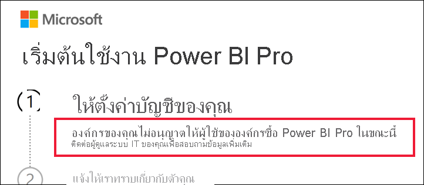

# จะทำอย่างไรหากการซื้อ Power BI Pro ถูกปิดใช้งานWhat to do if purchasing Power BI Pro is disabled

คุณเคยลองซื้อ Power BI Pro แล้ว และได้รับข้อความว่าองค์กรของคุณไม่อนุญาตให้ผู้ใช้ทำเช่นนี้You've tried to purchase Power BI Pro and received a message that your organization doesn't allow its users to do this. ด้วยเหตุผลหลายประการ บางองค์กรจะปิดกั้นสมาชิกจากการซื้อ Power BI Pro แบบบริการตนเองFor a variety of reasons, some organizations block members from self-service purchase of Power BI Pro.  ตัวอย่างเช่น องค์กรของคุณอาจมีนโยบายที่ระบุว่าสิทธิ์ใช้งานและการสมัครใช้งานทั้งหมดต้องได้รับการจัดการโดยแผนกไอทีหรือแผนกช่วยเหลือส่วนกลางFor example, your organization may have a policy that all licenses and subscriptions are managed by a centralized IT department or help desk. 

## วิธีแก้Solution
หากต้องการซื้อให้เสร็จสมบูรณ์ โปรดติดต่อแผนก IT หรือฝ่ายให้ความช่วยเหลือของคุณและขอให้พวกเขา[ทำตามคำแนะนำเหล่านี้เพื่อมอบหมายสิทธิ์การใช้งานให้แก่คุณ](../admin/service-admin-manage-licenses.md)To finish your purchase, contact your IT department or help desk and ask them to [follow these instructions to provide you with a license](../admin/service-admin-manage-licenses.md).

## ขั้นตอนถัดไปNext steps
[คุณลักษณะ Power BI ตามประเภทของสิทธิ์การใช้งานPower BI features by license type](service-features-license-type.md)