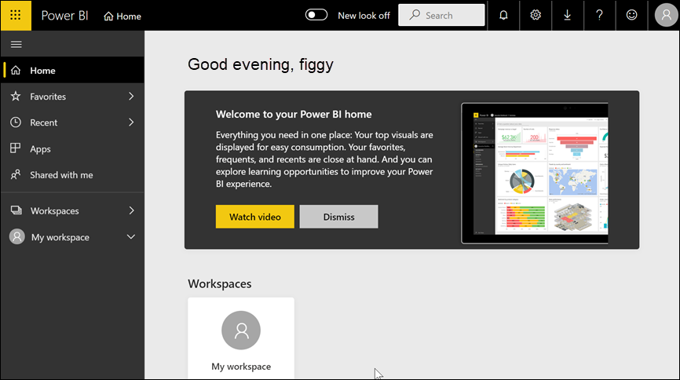

# ลงทะเบียนใช้งาน Power BI เป็นรายบุคคลSign up for the Power BI service as an individual

Power BI สามารถเป็นเครื่องมือการวิเคราะห์ข้อมูลส่วนบุคคลและเครื่องมือการแสดงภาพของคุณ และยังสามารถทำหน้าที่เป็นกลไกจัดการการวิเคราะห์และการตัดสินใจอยู่เบื้องหลังโครงการของกลุ่มบริษัท แผนก หรือบริษัททั้งหมดPower BI can be your personal data analysis and visualization tool, and can also serve as the analytics and decision engine behind group projects, divisions, or entire corporations. บทความนี้อธิบายวิธีการลงทะเบียนใช้งาน Power BI เป็นรายบุคคลThis article explains how to sign up for Power BI as an individual. ถ้าคุณเป็นผู้ดูแลระบบส่วนกลางหรือผู้ดูแลระบบการเรียกเก็บเงิน ให้ดูที่ [สิทธิ์การใช้งาน Power BI สำหรับองค์กรของคุณ](../admin/service-admin-licensing-organization.md)If you're a global administrator or billing administrator, see [Power BI licensing for your organization](../admin/service-admin-licensing-organization.md).

## Power BI คืออะไรWhat is Power BI?
Power BI คือแพลตฟอร์มข่าวกรองธุรกิจแบบบริการตนเองและสำหรับองค์กรที่รวมประสบการณ์ใช้งานแบบดั้งเดิมกับการแสดงข้อมูลอัจฉริยะเพื่อนำเสนอข้อมูลเชิงลึกมากขึ้นPower BI is a unified self-service and enterprise business intelligence platform that combines an intuitive user experience with intelligent data visualizations to provide greater depth of data insight. คุณสามารถแชร์รายงานภายในเครื่องมือของ Microsoft เช่น Teams, SharePoint, PowerPoint หรือภายในผลิตภัณฑ์ที่มีประสิทธิภาพอื่น ๆ ได้Reports can be shared within Microsoft tools like Teams, SharePoint, PowerPoint, or within other productivity products. ซึ่งนำเสนอเป็น SaaS (Software as a Service) ออนไลน์ที่มาพร้อมกับแอปพลิเคชันสนับสนุนสองตัวได้แก่ แอปพลิเคชันเดสก์ท็อป Microsoft Windows ที่เรียกว่า Power BI Desktop สำหรับการสร้างรายงาน และแอป BI สำหรับอุปกรณ์เคลื่อนที่แบบดั้งเดิมสำหรับการใช้งานรายงานบนอุปกรณ์ iOS และ AndroidIt is offered as an online SaaS (Software as a Service) offering with two companion applications: a Microsoft Windows desktop application called Power BI Desktop for creating reports and native mobile BI apps for consuming reports on iOS and Android devices. 

องค์ประกอบทั้งสามเหล่านี้ อันได้แก่ Pwer BI Desktop บริการ และ แอปสำหรับอุปกรณ์เคลื่อนที่ได้รับการออกแบบมาเพื่อช่วยผู้ใช้ในการสร้าง แชร์ และใช้ข้อมูลเชิงลึกทางธุรกิจด้วยวิธีหรือบทบาทที่ผู้ใช้ต้องการได้อย่างมีประสิทธิภาพสูงสุดThese three elements—Desktop, the service, and the mobile apps—are designed to let people create, share, and consume business insights in the way that serves them, or their role, most effectively.

## การลงทะเบียนสำหรับบริการของ Power BISigning up for the Power BI service
บทความนี้อธิบายขั้นตอนในการลงทะเบียนสำหรับ **บริการของ Power BI** เป็นรายบุคคลThis article describes the steps to sign up for **the Power BI service** as an individual. หากคุณกำลังมองหาความช่วยเหลือในการดาวน์โหลด Power BI Desktop หรือการติดตั้งแอปสำหรับอุปกรณ์เคลื่อนที่ โปรดดูที่บทความเหล่านี้แทน:If you are looking for help downloading Power BI Desktop or installing the mobile apps, please refer to these articles instead:
- [Power BI Desktop (ยังมีบริการดาวน์โหลดฟรีทั้งหมด)Power BI Desktop (it's also a totally free download)](desktop-get-the-desktop.md)    
- [แอปสำหรับอุปกรณ์เคลื่อนที่ Power BI (ยังมีบริการดาวน์โหลดฟรีทั้งหมด)Power BI mobile apps (also a totally free download)](../consumer/mobile/mobile-apps-for-mobile-devices.md)

## ที่อยู่อีเมลที่สนับสนุนSupported email addresses

ก่อนที่คุณจะเริ่มขั้นตอนการลงทะเบียน คุณจำเป็นต้องเรียนรู้ประเภทของที่อยู่อีเมลที่คุณสามารถใช้ในการลงทะเบียนสำหรับ Power BI:Before you start the sign-up process, it's important to learn which types of email addresses that you can use to sign-up for Power BI:

* Power BI กำหนดให้คุณใช้ที่อยู่อีเมลที่ทำงาน หรือที่อยู่อีเมลโรงเรียนในการลงทะเบียนPower BI requires that you use a work or school email address to sign up. คุณไม่สามารถลงทะเบียนโดยใช้ที่อยู่อีเมลที่จัดหาให้ตามการบริการอีเมลของผู้ใช้งานหรือผู้ให้บริการระบบโทรคมนาคมได้You can't sign up using email addresses provided by consumer email services or telecommunication providers. ซึ่งรวมถึง outlook.com, hotmail.com, gmail.com และอื่น ๆThis includes outlook.com, hotmail.com, gmail.com, and others. ถ้าคุณยังไม่มีบัญชีที่ทำงานหรือโรงเรียน [เรียนรู้เกี่ยวกับวิธีการสำรองเพื่อลงทะเบียน](../admin/service-admin-signing-up-for-power-bi-with-a-new-office-365-trial.md)If you don't have a work or school account, [learn about alternate ways to sign up.](../admin/service-admin-signing-up-for-power-bi-with-a-new-office-365-trial.md)

* คุณสามารถลงทะเบียน Power BI ด้วยที่อยู่ gov หรือ. mil ได้ แต่ต้องใช้กระบวนการอื่นYou can sign-up for Power BI with .gov or .mil addresses, but this requires a different process. สำหรับข้อมูลเพิ่มเติม ดู [ลงทะเบียนหน่วยงานราชการของรัฐบาลสหรัฐในบริการของ Power BI](../admin/service-govus-signup.md)For more info, see [Enroll your US Government organization in the Power BI service](../admin/service-govus-signup.md).

## ลงชื่อออกจากบริการ Power BISign up for the Power BI service

ทำตามขั้นตอนต่อไปนี้เพื่อลงทะเบียนบัญชี Power BIFollow these steps to sign up for a Power BI account. เมื่อคุณเสร็จสิ้นกระบวนการนี้ คุณจะมีสิทธิ์การใช้งาน Power BI (ฟรี) ที่คุณสามารถใช้เพื่อลองบริการของ Power BI ด้วยตนเองโดยใช้พื้นที่ทำงานของฉัน ซึ่งต้องอาศัยเนื้อหาจากพื้นที่ทำงาน Power BI ที่กำหนดไว้สำหรับความจุ Power BI Premium หรือเริ่มใช้ Power BI Pro รุ่นทดลองใช้เป็นรายบุคคลOnce you complete this process you will have a Power BI (free) license which you can use to try the Power BI service on your own using My Workspace, consume content from a Power BI workspace assigned to a Power BI Premium capacity, or initiate an individual Power BI Pro trial. ดูข้อมูลเพิ่มเติมได้ที่ [คุณลักษณะของ Power BI ตามประเภทใบอนุญาตการใช้งาน](service-features-license-type.md)For more information, see [Power BI features by license type](service-features-license-type.md). 

ขั้นตอนที่แน่นอนสำหรับการลงทะเบียนอาจแตกต่างกันไปขึ้นอยู่กับองค์กรของคุณ และสิ่งที่คุณคลิกเพื่อเริ่มกระบวนการThe exact steps for sign up can vary depending on your organization and what you click to start the process. ด้วยเหตุผลนี้ คุณอาจไม่เห็นหน้าจอทั้งหมดที่แสดงด้านล่างFor this reason, you may not be presented with all of the screens shown below. มีหลายวิธีในการลงทะเบียนสำหรับบริการของ Power BI เป็นรายบุคคล และขั้นตอนในบทความนี้นำไปใช้กับสองวิธีที่พบบ่อยเป็นส่วนใหญ่There are many different ways to sign up for the Power BI service as an individual, and the steps in this article apply to the two most common.
- คุณเลือกปุ่ม **ลองใช้งานฟรี** หรือ **เริ่มต้นใช้งานฟรี**1you select a **Try free** or **Start free** button1.     
- คุณจะได้รับอีเมลที่มีลิงก์ไปยังแดชบอร์ด รายงาน หรือแอป Power BIyou receive an email with a link to a Power BI dashboard, report, or app. คุณยังไม่เคยลงชื่อเข้าใช้บัญชี Power BI ของคุณก่อนหน้านี้You haven't previously signed in to your Power BI account.

    1คุณจะพบปุ่ม **ลองใช้งานฟรี** ฟรี powerbi.microsoft.com ในผลิตภัณฑ์ Microsoft ที่เกี่ยวข้องและในเอกสารและบทความการตลาด1You'll find the **Try free** type of buttons on powerbi.microsoft.com, in related Microsoft products, and in documentation and marketing articles.

### ขั้นตอนที่ 1Step 1

- เลือก **เริ่มต้นใช้งานฟรี** หรือ **ลองใช้งานฟรี** จาก [powerbi.microsoft.com](https://powerbi.com)Select **Start free** or **Try free** from [powerbi.microsoft.com](https://powerbi.com). คุณอาจต้องเลือกปุ่มสองครั้งYou may have to select a button twice.

        

- หรือเลือกลิงก์อีเมลไปยังแดชบอร์ด รายงาน หรือแอป Power BIOr, select an email link to a Power BI dashboard, report, or app.

    

1. Microsoft 365 จะจดจำคุณและทราบว่าคุณมีบริการ Microsoft ติดตั้งอยู่แล้วMicrosoft 365 recognizes you and knows that you already have a Microsoft service installed. เลือก **ลงชื่อเข้าใช้**Select **Sign in**.

    

1. คุณอาจได้รับหนึ่งในกล่องโต้ตอบเหล่านี้You may receive one of these dialog boxes. 
    - ถ้าคุณได้รับพร้อมท์ ให้ลงชื่อเข้าใช้ด้วยบัญชีองค์กรของคุณIf you're prompted, sign in using your organizational account.

        

    - ถ้าคุณได้รับข้อความเช่นนี้ ตรวจสอบให้แน่ใจว่าคุณกำลังใช้ที่อยู่อีเมลที่ทำงานหรือโรงเรียน และไม่ใช่ที่อยู่สาธารณะเช่น hotmail, gmail หรือ outlookIf you get a message like this, make sure that you are using a work or school email address and not a consumer address like hotmail, gmail, or outlook. โปรดดู [ที่อยู่อีเมลที่สนับสนุนข้างต้น](#supported-email-addresses)See [supported email addresses, above.](#supported-email-addresses)

       

    - หากคุณได้รับข้อความเช่นนี้ ให้ทบทวนข้อตกลงและเงื่อนไขIf you get a message like this, review the terms and conditions. หากคุณยอมรับ ให้เลือก **เริ่มต้น**If you agree, select **Start**. 

        

1. อีกทางหนึ่ง คือเชิญเพื่อนร่วมงานบางคนเข้าร่วมกับคุณOptionally, invite some colleagues to join you.

       

1. ในขั้นตอนนี้ คุณอาจต้องรอหาก Microsoft [กำลังตั้งค่าผู้เช่ารายใหม่](../admin/service-admin-signing-up-for-power-bi-with-a-new-office-365-trial.md)At this point, you may have to wait if Microsoft is [setting up a new tenant](../admin/service-admin-signing-up-for-power-bi-with-a-new-office-365-trial.md). มิฉะนั้น บริการของ Power BI จะเปิดขึ้นในเบราว์เซอร์ของคุณOtherwise, the Power BI service opens in your browser.

        

## ลงทะเบียนสำหรับ Power BI Pro รุ่นทดลองใช้ฟรีเป็นรายบุคคลSign up for an individual trial of Power BI Pro
ขอแสดงความยินดีในการลงชื่อเข้าใช้บัญชี Power BI ของคุณเป็นครั้งแรก!Congratulations on signing into your Power BI account for the first time! ขณะนี ้คุณมีสิทธิ์การใช้งานฟรี2You now have a free license2. เมื่อคุณเริ่มสำรวจบริการของ Power BI คุณจะเห็นป็อปอัพเพื่อถามว่าคุณต้องการอัปเกรดเป็น Power BI Pro รุ่นทดลองใช้ฟรีเป็นรายบุคคลหรือไม่As you start to explore the Power BI service, you'll see pop-ups asking if you want to upgrade to an individual trial of Power BI Pro. [คุณลักษณะบางอย่างของบริการของ Power BI จำเป็นต้องใช้สิทธิ์การใช้งานแบบ Pro](../consumer/end-user-license.md)[Some features of the Power BI service require a Pro license](../consumer/end-user-license.md). หากคุณต้องการเริ่มต้น Power BI Pro รุ่นทดลองใช้ฟรีเป็นรายบุคคล 60 วัน ให้เลือก **เริ่มใช้รุ่นทดลองใช้ฟรี**If you'd like to start a free 60 day individual trial of Power BI Pro, select **Start trial**.  

2 ในบางองค์กร บัญชี Power BI เริ่มต้นของคุณอาจเป็นสิทธิ์การใช้งาน Power BI **Pro**2 In some organizations, your default Power BI account may be a Power BI **Pro** license. ตัวอย่างเช่น Microsoft 365 บางรุ่นมีสิทธิ์การใช้งาน Power BI ProFor example, some versions of Microsoft 365 include a Power BI Pro license. หากต้องการเรียนรู้วิธีการค้นหาสิทธิ์การใช้งานใบอนุญาตของผู้ใช้ของคุณ โปรดดู [สิทธิ์การใช้งานใดบ้างที่ฉันมี](../consumer/end-user-license.md)To learn how to look up your user license, see [what license do I have?](../consumer/end-user-license.md)

## การหมดอายุของเวอร์ชันทดลองTrial expiration

เมื่อ Power BI Pro รุ่นทดลองใช้ฟรีเป็นรายบุคคลหมดอายุ สิทธิ์การใช้งานของคุณจะเปลี่ยนกลับเป็นสิทธิ์การใช้งาน Power BI (ฟรี)When your free individual trial of Power BI Pro expires, your license changes back to a Power BI (free) license. ไม่สามารถขยายรุ่นทดลองใช้ฟรีได้The trial cannot be extended. คุณไม่สามารถเข้าถึงคุณลักษณะที่จำเป็นต้องมีสิทธิ์การใช้งาน Power BI Pro ได้You will no longer have access to features that require a Power BI Pro license. สำหรับข้อมูลเพิ่มเติม โปรดดู [คุณลักษณะตามประเภทสิทธิ์การใช้งาน](service-features-license-type.md)For more information, see [Features by license type](service-features-license-type.md).

ถ้าสิทธิ์การใช้งาน Power BI (ฟรี) เพียงพอ คุณไม่จำเป็นต้องทำอะไรอีกIf a Power BI (free) license is sufficient, you don't have to do anything else. หากต้องการใช้ประโยชน์จากคุณลักษณะ Power BI Pro ให้ซื้อสิทธิ์การใช้งาน Pro โดยการเลือก **ซื้อทันที** หรือเข้าดู [ราคา Power BI](https://powerbi.microsoft.com/pricing)To take advantage of Power BI Pro features, purchase a Pro license by selecting **Buy now** or visiting [Power BI pricing](https://powerbi.microsoft.com/pricing).

ถ้าไม่มีการซื้อแบบบริการตนเอง ให้ติดต่อผู้ดูแลระบบของคุณเกี่ยวกับการซื้อสิทธิ์การใช้งาน Power BI ProIf self-service purchase is not available, contact your administrator about purchasing a Power BI Pro license.

## การแก้ไขปัญหากระบวนการลงทะเบียนTroubleshooting the sign-up process

ในกรณีส่วนใหญ่ คุณสามารถลงทะเบียน Power BI โดยทำตามขั้นตอนที่ได้อธิบายไว้ต่อไปนี้In most cases, you can sign up for Power BI by following the described process. ปัญหาบางอย่างที่อาจทำให้คุณไม่สามารถลงทะเบียนได้จะมีการอธิบายไว้ด้านล่าง โดยมีการแก้ไขปัญหาที่เป็นไปได้Some of the issues that may prevent you from signing up are described below, with possible workarounds.

**อีเมลแอดเดรสส่วนบุคคล** คุณพยายามลงทะเบียนโดยใช้อีเมลแอดเดรสส่วนบุคคล (ตัวอย่างเช่น nancy@gmail.com) และคุณได้รับข้อความที่คล้ายคลึงกับหนึ่งในข้อความต่อไปนี้:**Personal email addresses** You attempt to sign up using a personal email addresses (for example nancy@gmail.com) and you receive a message similar to one of these: 

*คุณใส่ที่อยู่อีเมลส่วนบุคคล: โปรดป้อนที่อยู่อีเมลที่ทำงานของคุณเพื่อให้เราสามารถจัดเก็บข้อมูลของบริษัทของคุณได้อย่างปลอดภัย**You entered a personal email address: Please enter your work email address so we can securely store your company's data*.

หรือor

*ที่มีลักษณะเหมือนอยู่อีเมลส่วนบุคคล ใส่ที่อยู่ทำงานของคุณเพื่อให้เราสามารถเชื่อมต่อคุณกับผู้อื่นในบริษัทของคุณ และไม่ต้องกังวล เราจะไม่แชร์ที่อยู่ของคุณกับผู้ใด**That looks like a personal email address. Enter your work address so we can connect you with others in your company. And don't worry. We won't share your address with anyone*.

**การแก้ไขปัญหา** Power BI ไม่รองรับอีเมลแอดเดรสของการบริการอีเมลของลูกค้าหรือจากผู้ให้บริการโทรคมนาคม**Solution** Power BI doesn't support email addresses provided by consumer email services or telecommunications providers. หากต้องการลงทะเบียนให้เสร็จสมบูรณ์ ลองอีกครั้งโดยใช้ที่อยู่อีเมลที่ที่ทำงานหรือโรงเรียนของคุณกำหนดไว้To finish signing up, try again using an email address assigned by your work or school. 

ถ้าคุณยังคงไม่สามารถลงทะเบียน และบีบเพื่อเสร็จสิ้นกระบวนการตั้งค่าขั้นสูงเพิ่มเติมหรือไม่ คุณสามารถ[ลงทะเบียนสำหรับการสมัครใช้งานเวอร์ชันทดลองใช้ Microsoft 365 ใหม่และใช้อีเมลแอดเดรสเพื่อลงทะเบียน](../admin/service-admin-signing-up-for-power-bi-with-a-new-office-365-trial.md)ได้If you still can't sign up and are willing to complete a more advanced setup process, you can [register for a new Microsoft 365 trial subscription and use that email address to sign up](../admin/service-admin-signing-up-for-power-bi-with-a-new-office-365-trial.md). 

นอกจากนี้คุณยังสามารถอนุญาตให้ผู้ใช้ที่มีอยู่ [เชิญคุณเป็นผู้เยี่ยมชม](../admin/service-admin-azure-ad-b2b.md)ได้You can also have an existing user [invite you as a guest](../admin/service-admin-azure-ad-b2b.md). 

[!INCLUDE[self-service-signup](../includes/self-service-signup-help.md)]

**อีเมลแอดเดรสของคุณไม่ใช่รหัส Microsoft 365 ID** คุณพยายามที่จะลงทะเบียนและรับข้อความต่อไปนี้:**Your email address isn't a Microsoft 365 ID** You attempt to sign up and receive a message like this:

*เราไม่พบคุณที่ contoso.com  คุณใช้ ID อื่นที่ที่ทำงานหรือโรงเรียนหรือไม่?  ลองลงชื่อเข้าใช้ด้วย ID ดังกล่าว และถ้าไม่สามารถใช้ได้ ให้ติดต่อแผนก IT ของคุณ**We can't find you at contoso.com.  Do you use a different ID at work or school?  Try signing in with that, and if it doesn't work, contact your IT department.*

**การแก้ไขปัญหา** องค์กรของคุณใช้รหัส ID (ซึ่งแตกต่างจากที่อยู่อีเมลของคุณ) ลงชื่อเข้าใช้ Microsoft 365 และบริการอื่น ๆ ของ Microsoft**Solution** Your organization uses IDs (that are different than your email address) to sign in to Microsoft 365 and other Microsoft services.  ตัวอย่างเช่น ที่อยู่อีเมลของคุณอาจzalan.bola@contoso.comแต่ ID ของคุณคือzalanb@contoso.comได้For example, your email address might be zalan.bola@contoso.com but your ID is zalanb@contoso.com.

หากต้องการลงทะเบียนให้เสร็จสมบูรณ์ ให้ใช้รหัส ID ที่องค์กรของคุณกำหนดให้คุณสำหรับการลงชื่อเข้าใช้ Microsoft 365 หรือบริการอื่นๆ ของ MicrosoftTo finish signing up, use the ID that your organization has assigned to you for signing in to Microsoft 365 or other Microsoft services.  ถ้าคุณไม่ทราบว่าคืออะไร ให้ติดต่อผู้ดูแลระบบของบริษัทของคุณIf you don't know what this is, contact your Global administrator.  

ถ้าคุณยังคงไม่สามารถลงทะเบียน และบีบเพื่อเสร็จสิ้นกระบวนการตั้งค่าขั้นสูงเพิ่มเติมหรือไม่ คุณสามารถ[ลงทะเบียนสำหรับการสมัครใช้งานเวอร์ชันทดลองใช้ Microsoft 365 ใหม่และใช้อีเมลแอดเดรสเพื่อลงทะเบียน](../admin/service-admin-signing-up-for-power-bi-with-a-new-office-365-trial.md)ได้If you still can't sign up and are willing to complete a more advanced setup process, you can [register for a new Microsoft 365 trial subscription and use that email address to sign up](../admin/service-admin-signing-up-for-power-bi-with-a-new-office-365-trial.md).

**การลงชื่อเข้าใช้ Power BI ไม่ได้จดจำรหัสผ่านของคุณ****Power BI sign in doesn't recognize your password**

**การแก้ไขปัญหา** บางครั้งอาจใช้เวลาสักครู่**Solution** Sometimes it takes a few tries. หากคุณลองใช้รหัสผ่านของคุณใหม่หลายครั้ง และคุณยังคงไม่สามารถเข้าสู่ระบบได้ ให้ลองเปิดเบราว์เซอร์ของคุณในโหมดที่ไม่ระบุตัวตน (Chrome) หรือ InPrivate (Microsoft Edge)If you retry your password several times and you still can't log in, try running your browser in Incognito (Chrome) or InPrivate (Edge) mode.

## ขั้นตอนถัดไปNext steps

[คุณลักษณะ Power BI ตามประเภทของสิทธิ์การใช้งาน](../consumer/end-user-features.md)  [Power BI features by license type](../consumer/end-user-features.md)    
[เคล็ดลับในการค้นหาการช่วยเหลือTips for finding help](../fundamentals/service-tips-for-finding-help.md)    

มีคำถามเพิ่มเติมหรือไม่More questions? [ลองถามชุมชน Power BITry asking the Power BI Community](https://community.powerbi.com/)
