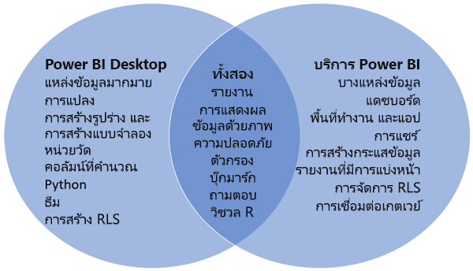

# การเปรียบเทียบ Power BI Desktop และบริการ Power BIComparing Power BI Desktop and the Power BI service

ในแผนภาพเวนน์ที่เปรียบเทียบ Power BI Desktop และบริการ Power BI พื้นที่ตรงกลางจะแสดงให้เห็นว่าทั้งสองทับซ้อนกันอย่างไรIn a Venn diagram comparing Power BI Desktop and the Power BI service, the area in the middle shows how the two overlap. งานบางอย่างที่คุณสามารถทำได้ทั้งใน Power BI Desktop หรือบริการSome tasks you can do in either Power BI Desktop or the service. ทั้งสองด้านของแผนภาพเวนน์แสดงคุณสมบัติที่เป็นเอกลักษณ์ของแอปพลิเคชันและบริการThe two sides of the Venn diagram show the features that are unique to the application and the service.  

**Power BI Desktop** คือเครื่องมือวิเคราะห์ข้อมูลและสร้างรายงานที่สมบูรณ์ ซึ่งคุณติดตั้งได้ฟรีบนเครื่องคอมพิวเตอร์ของคุณ**Power BI Desktop** is a complete data analysis and report creation tool that you install for free on your local computer. ซึ่งรวมถึง Query Editor ที่คุณสามารถเชื่อมต่อกับแหล่งข้อมูลที่แตกต่างกันมากมายและรวมเข้าด้วยกัน (มักเรียกว่าการสร้างแบบจำลอง) ลงในแบบจำลองข้อมูลIt includes the Query Editor, in which you can connect to many different sources of data, and combine them (often called modeling) into a data model. จากนั้นคุณออกแบบรายงานที่ยึดตามแบบจำลองข้อมูลนั้นThen you design a report based on that data model. [แนวทางการเริ่มใช้งาน Power BI Desktop](desktop-getting-started.md) ผ่านกระบวนการต่างๆThe [Power BI Desktop getting started guide](desktop-getting-started.md) walks through the process.

**บริการของ PowerBI** เป็นบริการบนคลาวด์The **Power BI service** is a cloud-based service. ซึ่งสนับสนุนการแก้ไขรายงานและความร่วมมือกับทีมและองค์กรIt supports light report editing and collaboration for teams and organizations. คุณสามารถเชื่อมต่อกับแหล่งข้อมูลในบริการ Power BI ได้เช่นกัน แต่การสร้างแบบจำลองจะถูกจำกัดไว้You can connect to data sources in the Power BI service, too, but modeling is limited.

นักออกแบบรายงาน Power BI ส่วนใหญ่ที่ทำงานในโครงการข่าวกรองธุรกิจจะใช้ **Power BI Desktop** เพื่อสร้างรายงาน Power BI จากนั้นใช้ **บริการ Power BI** เพื่อทำงานร่วมกันและแจกจ่ายรายงานMost Power BI report designers who work on business intelligence projects use **Power BI Desktop** to create Power BI reports, and then use the **Power BI service** to collaborate and distribute their reports.

บริการ Power BI ยังโฮสต์ *รายงานที่มีการแบ่งหน้า* ในพื้นที่ทำงานที่ได้รับการสนับสนุนโดยความจุของ Power BI PremiumThe Power BI service also hosts *paginated reports* in workspaces backed by a Power BI Premium capacity. คุณสร้างรายงานแบบแบ่งหน้าด้วย Power BI Report BuilderYou create paginated reports with Power BI Report Builder. ดู [เปรียบเทียบรายงาน Power BI และรายงานที่แบ่งหน้า](../paginated-reports/paginated-reports-report-builder-power-bi.md#compare-power-bi-reports-and-paginated-reports) ในบทความ "รายงานที่มีการแบ่งหน้าใน Power BI Premium คืออะไร"See [Compare Power BI reports and paginated reports](../paginated-reports/paginated-reports-report-builder-power-bi.md#compare-power-bi-reports-and-paginated-reports) in the article "What are paginated reports in Power BI Premium?" สำหรับข้อมูลเพิ่มเติมfor more information.

## การแก้ไขรายงาน Power BIEditing Power BI reports

ทั้งในแอปพลิเคชันและบริการ คุณสร้างและแก้ไข *รายงาน* ของ Power BIIn both the application and the service, you build and edit Power BI *reports*. รายงานสามารถมีตั้งแต่หนึ่งหน้าขึ้นไปได้ พร้อมด้วยวิชวลและชุดของวิชวลA report can have one or many pages, with visuals and collections of visuals. เพิ่มบุ๊กมาร์ก ปุ่ม ตัวกรอง และการเจาะลึกข้อมูลเพื่อปรับปรุงการนำทางในรายงานของคุณAdd bookmarks, buttons, filters, and drillthrough, to enhance navigation in your reports.

เครื่องมือแก้ไขรายงานใน Power BI Desktop และในบริการมีความคล้ายคลึงกันThe report editors in Power BI Desktop and in the service are similar. โดยมีการสร้างขึ้นจากสามส่วน:They're made up of three sections:  

1. บานหน้าต่างนำทางด้านบนแตกต่างกันใน Power BI Desktop และบริการThe top nav panes, different in Power BI Desktop and the service    
2. พื้นที่รายงานThe report canvas     
3. **ช่องข้อมูล** **การแสดงภาพ** และพื้นที่ **ตัวกรอง**The **Fields**, **Visualizations**, and **Filters** panes

วิดีโอนี้แสดงเครื่องมือแก้ไขรายงานใน Power BI DesktopThis video shows the report editor in Power BI Desktop. 

<iframe width="560" height="315" src="https://www.youtube.com/embed/IkJda4O7oGs" frameborder="0" allowfullscreen></iframe>

## การทำงานในบริการของ Power BIWorking in the Power BI service

### การทำงานร่วมกันCollaborating

หลังจากที่คุณสร้างรายงาน คุณสามารถบันทึกลง *พื้นที่ทำงาน* ใน **บริการ Power BI** ซึ่งคุณและเพื่อนร่วมงานของคุณทำงานร่วมกันได้After you've created your reports, you can save them to a *workspace* in the **Power BI service**, where you and your colleagues collaborate. คุณสร้าง *แดชบอร์ด* ด้านบนของรายงานเหล่านั้นYou build *dashboards* on top of those reports. จากนั้น คุณแชร์แดชบอร์ดและรายงานเหล่านั้นกับผู้ใช้รายงานภายในและภายนอกองค์กรของคุณThen, you share those dashboards and reports with report consumers inside and outside your organization. ผู้ใช้รายงานของคุณดูรายงานเหล่านั้นในบริการ Power BI ใน *มุมมองการอ่าน* ไม่ใช่มุมมองการแก้ไขYour report consumers view them in the Power BI service in a *Reading view*, not Editing view. พวกเขาไม่มีการเข้าถึงคุณลักษณะทั้งหมดที่พร้อมใช้งานสำหรับผู้สร้างรายงานThey don't have access to all the features available to report creators.  คุณยังสามารถแชร์ชุดข้อมูลของคุณและให้ผู้อื่นสร้างรายงานของพวกเขาเองได้You can also share your datasets and let others build their own reports from them. อ่านเพิ่มเติมเกี่ยวกับ [การทำงานร่วมกันในบริการ Power BI](../collaborate-share/service-new-workspaces.md)Read more about [collaborating in the Power BI service](../collaborate-share/service-new-workspaces.md).

### การเตรียมข้อมูลด้วยตัวเองโดยใช้กระแสข้อมูลSelf-service data prep with dataflows

กระแสข้อมูลช่วยให้องค์กรรวมข้อมูลจากแหล่งที่แตกต่างกันอย่างสิ้นเชิง และเตรียมข้อมูลนั้นเพื่อทำแบบจำลองDataflows help organizations unify data from disparate sources and prepare it for modeling. นักวิเคราะห์สามารถสร้างกระแสข้อมูลได้ง่ายๆ ด้วยการใช้เครื่องมือแบบบริการตนเองที่คุ้นเคยกันดีAnalysts can easily create dataflows, using familiar, self-service tools. นักวิเคราะห์ใช้กระแสข้อมูลเพื่อนำเข้า แปลง ผสานรวม และเติมแต่งข้อมูลขนาดใหญ่โดยการกำหนดการเชื่อมต่อของแหล่งข้อมูล, ตรรกะ ETL, กำหนดการรีเฟรช และอื่นๆAnalysts use dataflows to ingest, transform, integrate, and enrich big data by defining data source connections, ETL logic, refresh schedules, and more. อ่านเพิ่มเติมเกี่ยวกับ [การเตรียมข้อมูลด้วยตัวเองโดยใช้กระแสข้อมูล](../transform-model/dataflows/dataflows-introduction-self-service.md)Read more about [self-service data prep with dataflows](../transform-model/dataflows/dataflows-introduction-self-service.md).

## ขั้นตอนถัดไปNext steps

[Power BI Desktop คืออะไรWhat is Power BI Desktop?](desktop-what-is-desktop.md)

[สร้างรายงาน](../create-reports/service-report-create-new.md)นี้ในบริการของ Power BI[Create a report](../create-reports/service-report-create-new.md) in the Power BI service

[แนวคิดพื้นฐานสำหรับนักออกแบบรายงานBasic concepts for report designers](service-basic-concepts.md)

มีคำถามเพิ่มเติมหรือไม่More questions? [ลองไปที่ชุมชน Power BITry the Power BI Community](https://community.powerbi.com/)