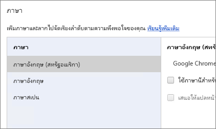

# ภาษาและประเทศ/ภูมิภาคที่สนับสนุนสำหรับ Power BISupported languages and countries/regions for Power BI

บทความนี้ครอบคลุมภาษาและประเทศ/ภูมิภาคที่รองรับสำหรับบริการของ Power BI, Power BI Desktop และเอกสาร Power BIThis article covers supported languages and countries/regions for the Power BI service, Power BI Desktop, and Power BI documentation.

## ประเทศและภูมิภาคที่ Power BI พร้อมใช้งานCountries and regions where Power BI is available
สำหรับรายการของประเทศและภูมิภาคที่ Power BI พร้อมใช้งาน ดู [รายการความพร้อมใช้งานในต่างประเทศ](https://products.office.com/business/international-availability)For a list of countries and regions where Power BI is available, see the [international availability list](https://products.office.com/business/international-availability). 

## ภาษาสำหรับบริการ Power BILanguages for the Power BI service
บริการ Power BI (ในเบราว์เซอร์ดังกล่าว) พร้อมใช้งานใน 44 ภาษาดังต่อไปนี้:The Power BI service (in the browser) is available in the following 44 languages:

* อาหรับArabic
* บาสก์ - BasqueBasque - Basque
* บัลแกเรีย - БългарскиBulgarian - Български
* คาตาลัน - catalàCatalan - català
* จีน (ประยุกต์) - 中文(简体)Chinese (Simplified) - 中文(简体)
* จีน (ดั้งเดิม) - 中文(繁體)Chinese (Traditional) - 中文(繁體)
* โครเอเชีย - hrvatskiCroatian - hrvatski
* เช็ก - češtinaCzech - čeština
* เดนมาร์ก - danskDanish - dansk
* ดัตช์ - NederlandsDutch - Nederlands
* อังกฤษ - EnglishEnglish - English
* เอสโตเนีย - eestiEstonian - eesti
* ฟินแลนด์ - suomiFinnish - suomi
* ฝรั่งเศส - françaisFrench - français
* กาลิเชีย - galegoGalician - galego
* เยอรมัน - DeutschGerman - Deutsch
* กรีก - ΕλληνικάGreek - Ελληνικά
* ฮิบรูHebrew
* ฮินดี - हिंदीHindi - हिंदी
* ฮังการี - magyarHungarian - magyar
* อินโดนีเซีย - Bahasa IndonesiaIndonesian - Bahasa Indonesia
* อิตาลี - italianoItalian - italiano
* ญี่ปุ่น - 日本語Japanese - 日本語
* คาซัคสถาน - ҚазақKazakh - Қазақ
* เกาหลี - 한국어Korean - 한국어
* ลัตเวีย - latviešuLatvian - latviešu
* ลิทัวเนีย - lietuviųLithuanian - lietuvių
* มลายู - Bahasa MelayuMalay - Bahasa Melayu
* นอร์เวย์ (Bokmål) - norsk (bokmål)Norwegian (Bokmål) - norsk (bokmål)
* โปแลนด์ - PolskiPolish - Polski
* โปรตุเกส (บราซิล) - PortuguêsPortuguese (Brazil) - Português
* โปรตุเกส (โปรตุเกส) - portuguêsPortuguese (Portugal) - português
* โรมาเนีย - românăRomanian - română
* รัสเซีย - РусскийRussian - Русский
* เซอร์เบีย (ซิริลลิก) - српскиSerbian (Cyrillic) - српски
* เซอร์เบีย (ละติน) - srpskiSerbian (Latin) - srpski
* สโลวัก - slovenčinaSlovak - slovenčina
* สโลวีเนีย - slovenskiSlovenian - slovenski
* สเปน - españolSpanish - español
* สวีเดน - svenskaSwedish - svenska
* ไทย - ไทยThai - ไทย
* ตุรกี - TürkçeTurkish - Türkçe
* ยูเครน - українськаUkrainian - українська
* เวียดนาม - Tiếng ViệtVietnamese - Tiếng Việt

### สิ่งที่ีแปลWhat's translated
Power BI แปลเมนู ปุ่ม ข้อความ และองค์ประกอบอื่น ๆ ของประสบการณ์เป็นภาษาของคุณPower BI translates menus, buttons, messages, and other elements of the experience into your language. ตัวอย่างเช่น Power BI แปลเนื้อหารายงาน เช่น ชื่อเรื่อง ตัวกรอง และคำแนะนำเครื่องมือที่สร้างขึ้นโดยอัตโนมัติFor example, Power BI translates report content such as automatically generated titles, filters, and tooltips. อย่างไรก็ตาม ระบบจะไม่แปลข้อมูลของคุณโดยอัตโนมัติHowever, your data isn't automatically translated. ภายในรายงาน เค้าโครงของภาพวิชวลจะไม่เปลี่ยนแปลงหากคุณใช้ภาษาจากขวาไปซ้าย เช่น ภาษาฮีบรูInside reports, the layout of visuals doesn't change if you're using a right-to-left language such as Hebrew.

ในขณะนี้ คุณลักษณะบางอย่างจะพร้อมใช้งานในภาษาอังกฤษเท่านั้น:At this time, a few features are available in English only:

* แดชบอร์ดและรายงานที่ Power BI สร้างขึ้นเมื่อคุณเชื่อมต่อกับบริการ เช่น Microsoft Dynamics CRM, Google Analytics และ SalesforceDashboards and reports that Power BI creates when you connect to services such as Microsoft Dynamics CRM, Google Analytics, and Salesforce. คุณยังคงสามารถสร้างแดชบอร์ดและรายงานของคุณเองในภาษาของคุณYou can still create your own dashboards and reports in your own language.
* สำรวจข้อมูลของคุณด้วยการถามตอบExploring your data with Q&A.

โปรดติดตามต่อไปขณะที่เราทำงานเพื่อจัดทำคุณลักษณะสำหรับภาษาอื่นเพิ่มเติมStay tuned as we work to bring additional features to other languages. 

### เลือกภาษาของคุณในบริการ Power BIChoose your language in the Power BI service
1. ในบริการ Power BI ให้เลือกไอคอน **การตั้งค่า** In the Power BI service, select the **Settings** icon  > **การตั้งค่า** > **Settings**.
2. ที่แท็บ **ทั่วไป** > **ภาษา**On the **General** tab > **Language**.
3. เลือกภาษาของคุณ > **นำไปใช้**Select your language > **Apply**.

### เลือกภาษาของคุณในเบราว์เซอร์Choose your language in the browser
Power BI ตรวจหาภาษาของคุณโดยยึดตามภาษาที่คุณกำหนดบนคอมพิวเตอร์ของคุณPower BI detects your language based on the language preferences on your computer. วิธีที่คุณเข้าถึงและเปลี่ยนการตั้งค่าเหล่านี้อาจแตกต่างกันโดยขึ้นอยู่กับระบบปฏิบัติการและเบราว์เซอร์ของคุณThe way you access and change these preferences may vary depending on your operating system and browser. นี่คือวิธีการเข้าถึงการกำหนดลักษณะเหล่านี้จาก Internet Explorer และ Google ChromeHere's how to access these preferences from Internet Explorer and Google Chrome.

#### Internet Explorer (เวอร์ชัน 11)Internet Explorer (version 11)
1. คลิกที่ปุ่ม **เครื่องมือ** ที่มุมบนขวาของหน้าต่างเบราว์เซอร์ของคุณ:Click the **Tools** button in the top-right corner of your browser window:
   
   
2. คลิก **ตัวเลือกอินเทอร์เน็ต**Click **Internet Options**.
3. ในกล่องโต้ตอบตัวเลือกอินเทอร์เน็ตบนแท็บ General ใต้ Appearance คลิกปุ่ม **ภาษา (Languages)**In the Internet Options dialog, on the General tab under Appearance, click the **Languages** button.

#### Google Chrome (เวอร์ชัน 42)Google Chrome (version 42)
1. คลิกที่ปุ่มเมนูที่มุมบนขวาของหน้าต่างเบราว์เซอร์ของคุณ:Click the menu button in the top-right corner of your browser window:
   
   
2. คลิก **การตั้งค่า**Click **Settings**.
3. คลิก **แสดงการตั้งค่าขั้นสูง**Click **Show advanced settings**.
4. ใต้ภาษา คลิกปุ่ม **ภาษาและการตั้งค่าสำหรับการป้อนค่า**Under Languages, click the **Language and input settings** button.
5. คลิก **เพิ่ม** เลือกภาษาแล้วคลิก **ตกลง**Click **Add**, select a language, and click **OK**.
   
   
   
   ภาษาใหม่อยู่ที่ส่วนท้ายของรายการThe new language is at the end of the list. 
6. ลากภาษาใหม่ไปยังด้านบนของรายการ จากนั้นคลิก **แสดง Google Chrome ในภาษานี้**Drag the new language to the top of the list, and click **Display Google Chrome in this language**.
   
   
   
   คุณอาจจำเป็นต้องปิดและเปิดเบราว์เซอร์ของคุณอีกครั้งเพื่อดูการเปลี่ยนแปลงYou may need to close and reopen your browser to see the change.

## เลือกภาษาหรือตำแหน่งที่ตั้งของ Power BI DesktopChoose the language or locale of Power BI Desktop
มีสองวิธีในการได้ Power BI Desktop: คุณสามารถดาวน์โหลดเป็นตัวติดตั้งแยกต่างหาก หรือติดตั้งจาก Windows StoreYou have two ways of getting Power BI Desktop: You can download it as a standalone installer, or install it from the Windows Store.

* ขณะทำการติดตั้ง Power BI Desktop จาก Windows Store ระบบจะทำการติดตั้งภาษาทั้งหมดและค่าเริ่มต้นจะแสดงภาษาที่ตรงกับภาษาเริ่มต้นของ WindowsWhen you install Power BI Desktop from the Windows Store, it installs all the languages and by default shows the language that corresponds to the Windows default language.
* เมื่อดาวน์โหลด Power BI Desktop เป็นตัวติดตั้งแบบเดี่ยว คุณจะต้องเลือกภาษาเริ่มต้นขณะที่คุณเรียกใช้ตัวติดตั้งWhen you download Power BI Desktop as a standalone installer, you choose the default language when you run the installer. คุณสามารถเปลี่ยนแปลงได้ในภายหลังYou can change it at a later date.
* นอกจากนี้ คุณยังสามารถ [เลือกตำแหน่งที่ตั้งที่จะใช้เมื่อนำเข้าข้อมูล](#choose-the-locale-for-importing-data-into-power-bi-desktop)สำหรับรายงานเฉพาะได้You can also [choose a locale to be used when importing data](#choose-the-locale-for-importing-data-into-power-bi-desktop) for a specific report.

> [!NOTE]
> หากคุณกำลังติดตั้ง Power BI Desktop ในเวอร์ชันที่ปรับให้เหมาะกับเซิร์ฟเวอร์รายงาน Power BI แล้ว คุณต้องเลือกภาษาเมื่อคุณดาวน์โหลดIf you're installing the version of Power BI Desktop that's optimized for Power BI Report Server, you choose the language when you download. ดูรายละเอียดที่ [ติดตั้ง Power BI Desktop ที่ปรับให้เหมาะสำหรับเซิร์ฟเวอร์รายงาน Power BI](../report-server/install-powerbi-desktop.md)See [Install Power BI Desktop optimized for Power BI Report Server](../report-server/install-powerbi-desktop.md) for details.

### เลือกภาษาสำหรับ Power BI DesktopChoose a language for Power BI Desktop 
1. ติดตั้ง Power BI Desktop [จาก Windows Store](https://aka.ms/pbidesktopstore)หรือเป็น[ตัวติดตั้งแยกเดี่ยว](https://aka.ms/pbiSingleInstaller)Install Power BI Desktop [from the Windows Store](https://aka.ms/pbidesktopstore), or as a [standalone installer](https://aka.ms/pbiSingleInstaller).
2. หากต้องการเปลี่ยนภาษา ให้เลือก **การตั้งค่า** บนเมนู WindowsTo change the language, on the Windows menu select **Settings**

3. ใน **การตั้งค่า Windows** ให้เลือก **เวลาและภาษา**In **Windows Settings**, select **Time & language**.
   
     
4. เลือก **ภาษา** แล้วจึงเลือกภาษาSelect **Language** and select a language. เลือก **เพิ่มภาษาในการแสดงผลของ Windows ใน Microsoft Store** หากจำเป็นSelect **Add a Windows display language in Microsoft Store** if necessary.
   
     
   
     ในครั้งถัดไปที่คุณเริ่มต้น Power BI Desktop ระบบจะใช้ภาษาที่คุณตั้งเป็นค่าเริ่มต้นThe next time you start Power BI Desktop it will use the language you set as the default. 

หากต้องการแทนที่ค่าเริ่มต้นและใช้ Power BI Desktop ในภาษาอื่นนอกเหนือจากภาษาของ Windows ของคุณ ให้ทำตามขั้นตอนต่อไปนี้To override the default and use Power BI Desktop in a language other than your Windows language do the following.
1. ใน Power BI Desktop ไปที่ตัวเลือก **แฟ้ม** > **และตัวเลือก** > **การตั้งค่า**In Power BI Desktop, go to **File** > **Options and settings** > **Options**.
2. ภายใต้ **การตั้งค่าส่วนกลาง** เลือก **การตั้งค่าภูมิภาค**Under **Global Settings**, select **Regional Settings**.
3. ในกล่อง **ภาษาแอปพลิเคชัน** ให้เลือกภาษาอื่นIn the **Application Language** box, select a different locale. 

ภาษาที่รองรับการใช้งานใน Power BI Desktop จำกัดเฉพาะภาษาที่แสดงในรายการแบบเลื่อนลงของภาษาแอปพลิเคชันLanguage support in Power BI Desktop is limited to the languages displayed in the Application Language dropdown.

### ตรวจสอบการจัดรูปแบบตัวเลขและวันที่เริ่มต้นของ Power BI DesktopVerify Power BI Desktop default number and date formatting

Power BI Desktop รับการจัดรูปแบบตัวเลขและวันที่เริ่มต้นจากการตั้งค่า Windows RegionPower BI Desktop gets its default number and date formatting from the Windows Region settings. คุณสามารถตรวจสอบหรือเปลี่ยนแปลงการตั้งค่าเหล่านั้นได้ หากจำเป็นYou can check or change those settings, if needed.

1. เลือก **การตั้งค่า** บนเมนู WindowsOn the Windows menu select **Settings**

2. ใน **การตั้งค่า Windows** ให้เลือก **เวลาและภาษา**In **Windows Settings**, select **Time & language**.
   
     

3. เลือก **ภูมิภาค** > **การตั้งค่าวันที่ เวลา และภูมิภาคเพิ่มเติม**Select **Region** > **Additional date, time, and regional settings**.

    :::image type="content" source="media/supported-languages-countries-regions/power-bi-service-region-settings.png" alt-text="การตั้งค่าวันที่ เวลา และภูมิภาคเพิ่มเติม":::

4. ในเมนู **นาฬิกาและภูมิภาค** ให้เลือก **เปลี่ยนแปลงรูปแบบวันที่เวลา หรือตัวเลข**In **Clock and Region**, select **Change date, time, or number formats**.

    :::image type="content" source="media/supported-languages-countries-regions/power-bi-service-check-region-settings.png" alt-text="การตั้งค่านาฬิกาและภูมิภาค":::

5. ตรวจสอบให้แน่ใจว่าคุณได้เลือก **ตรงกับภาษาในการแสดงผลของ Windows** หรือเปลี่ยนการตั้งค่านี้ หากจำเป็นMake sure **Match Windows display language** is selected, or change it if necessary.

    :::image type="content" source="media/supported-languages-countries-regions/power-bi-service-match-windows.png" alt-text="ตรงกับภาษาในการแสดงผลของ Windows":::

### เลือกตำแหน่งที่ตั้งสำหรับการนำเข้าข้อมูลลงใน Power BI DesktopChoose the locale for importing data into Power BI Desktop
ไม่ว่าคุณจะดาวน์โหลด Power BI Desktop หรือติดตั้งจาก Windows Store คุณสามารถเลือกตำแหน่งที่ตั้งสำหรับรายงานเฉพาะให้เป็นตำแหน่งอื่นนอกเหนือจากตำแหน่งที่ตั้งใน Power BI Desktop เวอร์ชันของคุณได้Whether you download Power BI Desktop or install it from the Windows Store, you can choose a locale for a specific report to be something other than the locale in your version of Power BI Desktop. ระบบภาษาท้องถิ่นจะเปลี่ยนแปลงวิธีแปลข้อมูลของ Power BI เมื่อนำเข้าจากแหล่งข้อมูลของคุณThe locale changes the way Power BI interprets data when it's imported from your data source. ตัวอย่างเช่น ระบบจะแปล "3/4/2017" เป็น 3 เมษายนหรือ 4 มีนาคม ใช่หรือไม่For example, is "3/4/2017" interpreted as 3 April or March 4?

1. ใน Power BI Desktop ไปที่ตัวเลือก **แฟ้ม** > **และตัวเลือก** > **การตั้งค่า**In Power BI Desktop, go to **File** > **Options and settings** > **Options**.
2. ใต้ **แฟ้มปัจจุบัน** เลือก **การตั้งค่าภูมิภาค**Under **Current file**, select **Regional Settings**.
3. ในกล่อง **ตำแหน่งที่ตั้งสำหรับการนำเข้า** เลือกตำแหน่งที่ตั้งอื่นIn the **Locale for import** box, select a different locale. 
   
   
4. เลือก **ตกลง**Select **OK**.

### เลือกภาษาสำหรับแบบจำลองใน Power BI DesktopChoose the language for the model in Power BI Desktop

นอกจากการตั้งค่าภาษาสำหรับแอปพลิเคชัน Power BI Desktop แล้ว คุณยังสามารถตั้งค่าภาษาแบบจำลองได้Besides setting the language for the Power BI Desktop application, you can also set the model language. ภาษาแบบจำลองส่งผลกระทบที่สำคัญสองประการ:The model language affects chiefly two things:

- วิธีการที่เราเปรียบเทียบและเรียงลำดับสตริงHow we compare and sort strings. ตัวอย่างเช่น เนื่องจากในภาษาตุรกี (Turkish) มีตัวอักษร i สองตัว ดังนั้น โดยขึ้นอยู่กับการจัดเรียงฐานข้อมูลของคุณ จึงทำให้ตัวอักษรทั้งสองสามารถถูกจัดเรียงในลำดับที่แตกต่างกันเมื่อทำการเรียงลำดับFor example, because Turkish has two of the letter i, depending on the collation of your database, the two can end up in different orders when sorting. 
- ภาษาที่ Power BI Desktop ใช้เมื่อสร้างตารางวันที่แบบซ่อนไว้จากเขตข้อมูลวันที่The language Power BI Desktop uses when creating hidden date tables from date fields. ตัวอย่างเช่น เขตข้อมูลระบุว่า เดือน/Month/Monat/Mois และอื่น ๆFor example, fields are called Month/Monat/Mois, and so on.

> [!NOTE]
> รูปแบบของ Power BI ในขณะนี้ใช้ระบบภาษาท้องถิ่นที่ไม่กำหนดการใช้ตัวพิมพ์ใหญ่-เล็ก (หรือการใช้อักษรคานะ) ดังนั้น "ABC" และ "abc" จะถือว่าเหมือนกันThe Power BI model currently uses a locale that is not case-sensitive (or kana-sensitive) so "ABC" and "abc" will be treated as equivalent. หาก "ABC" ถูกโหลดลงในฐานข้อมูลก่อน ค่าสตริงอื่นที่แตกต่างกันเพียงแค่ตัวพิมพ์ใหญ่-เล็กเท่านั้น เช่น "Abc" จะไม่ถือว่าเป็นค่าที่ต่างกันIf "ABC" is loaded into the database first, other strings that differ only by case such as "Abc" won't be loaded as a separate value.
> 
>

ต่อไปนี้คือวิธีการตั้งค่าภาษาแบบจำลองHere's how to set the model language.

1. ใน Power BI Desktop ไปที่ตัวเลือก **แฟ้ม** > **และตัวเลือก** > **การตั้งค่า**In Power BI Desktop, go to **File** > **Options and settings** > **Options**.
2. ใต้ **Global** เลือก **การตั้งค่าภูมิภาค**Under **Global**, select **Regional Settings**.
3. ในกล่อง **รูปแบบภาษา** เลือกภาษาอื่นIn the **Model language** box, select a different language. 

    

> [!NOTE]
> เมื่อสร้างแล้ว ภาษาของแบบจำลอง Power BI ไม่สามารถเปลี่ยนได้Once created, the language of a Power BI model can't be changed.
> 
>

## ภาษาสำหรับเอกสารให้ความช่วยเหลือLanguages for the help documentation
ความช่วยเหลือได้รับการแปลเป็น 10 ภาษาดังนี้:Help is localized in these 10 languages: 

* จีน (ประยุกต์) - 中文(简体)Chinese (Simplified) - 中文(简体)
* จีน (ดั้งเดิม) - 中文(繁體)Chinese (Traditional) - 中文(繁體)
* ฝรั่งเศส - françaisFrench - français
* เยอรมัน - DeutschGerman - Deutsch
* อิตาลี - italianoItalian - italiano
* ญี่ปุ่น - 日本語Japanese - 日本語
* เกาหลี - 한국어Korean - 한국어
* โปรตุเกส (บราซิล) - PortuguêsPortuguese (Brazil) - Português
* รัสเซีย - РусскийRussian - Русский
* สเปน - españolSpanish - español

## ขั้นตอนถัดไปNext steps
* คุณกำลังใช้หนึ่งในแอปอุปกรณ์เคลื่อนที่ Power BI ใช่หรือไม่?Are you using one of the Power BI mobile apps? สำหรับรายละเอียด ดู [ภาษาที่สนับสนุนในแอปอุปกรณ์เคลื่อนที่ Power BI](../consumer/mobile/mobile-apps-supported-languages.md)See [Supported languages in the Power BI mobile apps](../consumer/mobile/mobile-apps-supported-languages.md) for details.
* มีคำถามหรือไม่Questions? ลองถาม[ชุมชน Power BI](https://community.powerbi.com/)Try asking the [Power BI Community](https://community.powerbi.com/).
* ยังคงมีปัญหาใช่หรือไม่?Still have an issue? โปรดเยี่ยมชม[หน้าการสนับสนุน Power BI](https://powerbi.microsoft.com/support/)Visit the [Power BI support page](https://powerbi.microsoft.com/support/).
