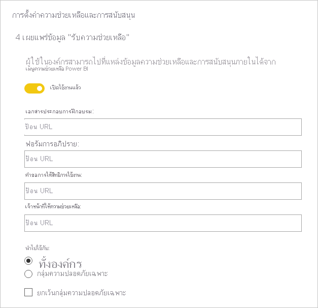
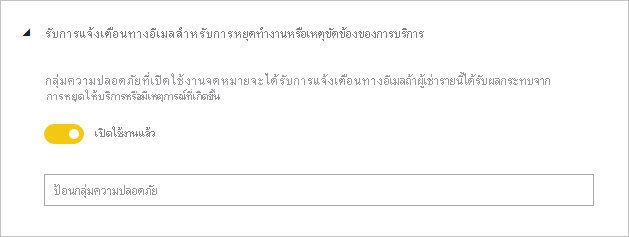
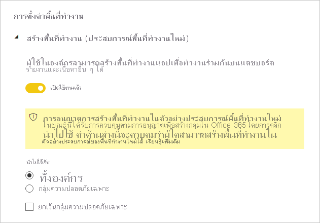
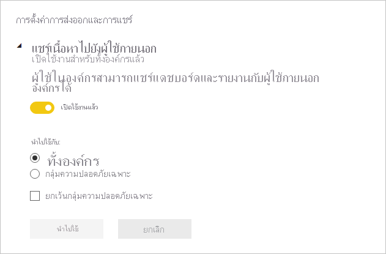
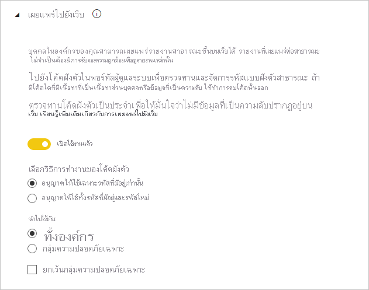
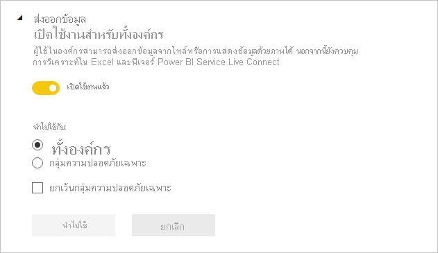
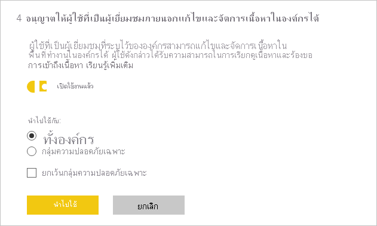

# คำแนะนำเกี่ยวกับการตั้งค่าของผู้เช่าTenant settings guidance

บทความนี้มีผู้อ่านเป้าหมายเป็นผู้ดูแลระบบของ Power BI ที่มีหน้าที่รับผิดชอบเกี่ยวกับการตั้งค่าและการกำหนดค่าสภาพแวดล้อมของ Power BI ในองค์กรของตนเองThis article targets Power BI administrators who are responsible for setting up and configuring the Power BI environment in their organization.

เราให้คำแนะนำสำหรับการตั้งค่าเฉพาะของผู้เช่า ซึ่งจะช่วยปรับปรุงประสบการณ์ใช้งานเกี่ยวกับ Power BI ให้ดียิ่งขึ้ หรืออาจทำให้องค์กรของคุณตกอยู่ในความเสี่ยงได้เช่นกันWe provide guidance for specific tenant settings that help improve the Power BI experience, or could expose your organization to risk. เราขอแนะนำให้คุณกำหนดค่าผู้เช่าของคุณให้ตรงกับนโยบายและกระบวนการขององค์กรของคุณเสมอWe recommend you always configure your tenant to align with your organization's policies and processes.

[การตั้งค่าผู้เช่า](../admin/service-admin-portal.md#tenant-settings) สามารถจัดการได้ใน [พอร์ทัลผู้ดูแลระบบ](https://app.powerbi.com/admin-portal/tenantSettings) และสามารถกำหนดค่าโดย [ผู้ดูแลระบบบริการ Power BI](../admin/service-admin-administering-power-bi-in-your-organization.md#administrator-roles-related-to-power-bi)[Tenant settings](../admin/service-admin-portal.md#tenant-settings) are managed in the [Admin portal](https://app.powerbi.com/admin-portal/tenantSettings), and can be configured by a [Power BI service administrator](../admin/service-admin-administering-power-bi-in-your-organization.md#administrator-roles-related-to-power-bi). การตั้งค่าผู้เช่าจำนวนมากอาจจำกัดความสามารถและคุณลักษณะต่า ๆ สำหรับชุดผู้ใช้ที่จำกัดMany tenant settings can restrict capabilities and features to a limited set of users. ดังนั้น เราขอแนะนำให้คุณทำความคุ้นเคยกับการตั้งค่าต่าง ๆ ก่อน เพื่อวางแผนกลุ่มความปลอดภัยที่คุณจะต้องใช้So, we recommend you first become familiar with the settings to plan the security groups you'll need. คุณอาจพบว่า คุณสามารถปรับใช้กลุ่มความปลอดภัยเดียวกันกับการตั้งค่าหลายอย่างYou might find that you can apply the same security group to multiple settings.

## ปรับปรุงประสบการณ์ใช้งาน Power BI ให้ดียิ่งขึ้นImprove Power BI experience

### เผยแพร่ข้อมูล "รับความช่วยเหลือ"Publish "Get Help" information

เราสนับสนุนให้คุณตั้งค่าไซต์ที่เกี่ยวข้องกับ Power BI ภายใน โดยใช้ [Microsoft Teams](/microsoftteams) หรือแพลตฟอร์มอื่น ๆ ที่ทำงานร่วมกันWe encourage you to set up internal Power BI-related sites using [Microsoft Teams](/microsoftteams), or other collaboration platform. ไซต์เหล่านี้อาจใช้สำหรับจัดเก็บเอกสารการฝึกอบรม เป็นพื้นที่ในการอภิปราย ส่งคำขอรับใบอนุญาต หรือตอบสนองเพื่อให้ความช่วยเหลือThese sites can be used to store training documentation, host discussions, make requests for licenses, or respond to help.

หากคุณดำเนินการดังกล่าวด้วย เราขอแนะนำให้คุณเปิดใช้งานการตั้งค่า **เผยแพร่ข้อมูล "รับความช่วยเหลือ"** _สำหรับทั้งองค์กร_If you do so, we recommend you then enable the **Publish "Get Help" information** setting _for the entire organization_. โดยเข้าไปได้ในกลุ่ม **การตั้งค่าความช่วยเหลือและการสนับสนุน**It's found in the **Help and support settings** group. คุณสามารถตั้งค่า URL สำหรับ:You can set URLs for your:

- เอกสารการฝึกอบรมTraining documentation
- ฟอรัมการอภิปรายDiscussion forum
- คำขอสิทธิ์อนุญาตการใช้งานLicensing requests
- บริการช่วยเหลือHelp desk

URL เหล่านี้จะมีให้ใช้งานในรูปแบบลิงก์ในเมนูความช่วยเหลือของ Power BIThese URLs will become available as links in the Power BI help menu.

> [!NOTE]
> การจัดหา URL **คำขอสิทธิ์การใช้งาน** จะป้องกันไม่ให้ผู้ใช้แต่ละรายซื้อใบอนุญาตให้ใช้งาน Power BI ProSupplying the **Licensing requests** URL prevents individual users from buying a Power BI Pro license. แต่จะนำไปยังเว็บไซต์ภายในของคุณพร้อมข้อมูลเกี่ยวกับวิธีการขอใบอนุญาตให้ใช้งานInstead, they'll be directed to your internal site with information on how to acquire a license. การตั้งค่า **อนุญาตให้ผู้ใช้ลองใช้ Power BI Pro** ที่เปิดใช้งานโดยค่าเริ่มต้นและแยกประสบการณ์การซื้อและการใช้รุ่นทดลองThe setting **Allow users to try Power BI Pro** is enabled by default and separates the purchase and trial experiences. ในการเรียนรู้เพิ่มเติมเกี่ยวกับธีการทำงานร่วมกันของการตั้งค่าเหล่านี้ให้ดูที่ [อนุญาตให้ผู้ใช้ลองใช้ Power BI Pro](../admin/service-admin-portal.md#allow-users-to-try-power-bi-paid-features) ได้To learn more about how these settings work together, see [Allow users to try Power BI Pro](../admin/service-admin-portal.md#allow-users-to-try-power-bi-paid-features).
>
>

สำหรับข้อมูลเพิ่มเติมให้ดู [การตั้งค่าความช่วยเหลือและการสนับสนุน](../admin/service-admin-portal.md#help-and-support-settings)For more information, see [Help and support settings](../admin/service-admin-portal.md#help-and-support-settings).

## จัดการความเสี่ยงManage risk
การตั้งค่าเพื่อจัดการความเสี่ยงสามารถช่วยคุณในการสร้างนโยบายการกำกับดูแลในผู้เช่า Power BI ของคุณThe settings to manage risks can help you establish governance policies in your Power BI tenant. อย่างไรก็ตาม โปรดทราบว่าการตั้งค่าการกำกับดูแลดังกล่าวไม่ใช่หน่วยวัดความปลอดภัยKeep in mind, however, that governance settings are not a security measure. ตัวอย่างเช่น การปิดใช้งานการตั้งค่า **การส่งออกข้อมูล** จะลบคุณลักษณะจากส่วนติดต่อผู้ใช้ Power BI และช่วยด้วยวิธีนี้ให้ผู้ใช้ Power BI สามารถปฏิบัติตามนโยบายการกำกับดูแลขององค์กรของคุณ แต่ไม่ได้ป้องกันผู้ใช้โดยจากการกำหนดไม่ให้ส่งออกข้อมูลโดยใช้ตัวเลือกอื่น ๆFor example, disabling the **Export data** setting removes the feature from the Power BI user interface and helps in this way Power BI users to work in compliance with your organization's governance policies, but it does not prevent determined users from exporting data using other options. จากมุมมองด้านความปลอดภัย ผู้ใช้ Power BI ที่มีการเข้าถึงชุดข้อมูลแบบอ่านมีสิทธิ์ในการคิวรีชุดข้อมูลนี้ และสามารถยืนยันผลลัพธ์ได้โดยไม่คำนึงถึงคุณลักษณะที่พร้อมใช้งานในอินเทอร์เฟซผู้ใช้ Power BIFrom a security viewpoint, a Power BI user with read access to a dataset has the permission to query this dataset and can persist the results regardless of the features available in the Power BI user interface.
### รับการแจ้งเตือนทางอีเมลสำหรับการหยุดทำงานหรือเหตุขัดข้องของการบริการReceive email notification service outages or incidents

คุณอาจได้รับการแจ้งเตือนทางอีเมล หากผู้เช่าของคุณได้รับผลกระทบจากการหยุดทำงานหรือเหตุขัดข้องของการบริการYou can be notified by email if your tenant is impacted by a service outage or incident. หากเป็นเช่นนี้ คุณอาจตอบสนองในเชิงรุกต่อเหตุขัดข้องดังกล่าวได้This way, you can proactively respond to incidents.

เราขอแนะนำให้คุณเปิดใช้การตั้งค่า **รับการแจ้งเตือนทางอีเมลสำหรับการหยุดทำงานหรือเหตุขัดข้องของการบริการ**We recommend you enable the **Receive email notification service outages or incidents** setting. โดยเข้าไปได้ในกลุ่ม **การตั้งค่าความช่วยเหลือและการสนับสนุน**It's found in the **Help and support settings** group. กำหนดกลุ่มความปลอดภัยที่ _เปิดใช้งานเมล_ อย่างน้อยหนึ่งกลุ่มAssign one or more _mail-enabled_ security groups.

### การปกป้องข้อมูลInformation protection

การปกป้องข้อมูล จะอนุญาตการเปิดใช้การตั้งค่าการป้องกันต่าง ๆ เช่น การเข้ารหัสหรือลายน้ำ ขณะทำการส่งออกข้อมูลจากบริการ Power BIInformation protection allows enforcing protection settings—such as encryption or watermarks—when exporting data from the Power BI service.

โดยมีการตั้งค่าผู้เช่าสองแบบที่เกี่ยวข้องกับการปกป้องข้อมูลThere are two tenant settings related to information protection. ตามค่าเริ่มต้นแล้ว การตั้งค่าทั้งสองรายการจะปิดใช้งานสำหรับทั้งองค์กรBy default, both settings are disabled for the entire organization.

เราขอแนะนำให้คุณเปิดใช้การตั้งค่าดังกล่าวเมื่อคุณต้องการจัดการและปกป้องข้อมูลที่สำคัญWe recommend you enable these settings when you need to handle and protect sensitive data. สำหรับข้อมูลเพิ่มเติม โปรดดู [การปกป้องข้อมูลใน Power BI](../admin/service-security-data-protection-overview.md)For more information, see [Data protection in Power BI](../admin/service-security-data-protection-overview.md).

### สร้างพื้นที่ทำงานCreate workspaces

คุณสามารถจำกัดผู้ใช้ไม่ให้สร้างพื้นที่ทำงานYou can restrict users from creating workspaces. ด้วยวิธีนี้ คุณจะสามารถควบคุมสิ่งที่สร้างขึ้นภายในองค์กรของคุณได้This way, you can govern what is created within your organization.

> [!NOTE]
> ปัจจุบัน จะมีระยะเวลาการเปลี่ยนผ่านระหว่างประสบการณ์ใช้งานพื้นที่ทำงานแบบเดิมกับแบบใหม่Currently there's a transition period between the old workspace experience and the new. ทั้งนี้ การตั้งค่าผู้เช่านี้จะปรับใชักับประสบการณ์ใช้งานแบบใหม่เท่านั้นThis tenant setting applies only to the new experience.

ตามค่าเริ่มต้น การตั้งค่า **สร้างพื้นที่ทำงาน** จะเปิดใช้งานสำหรับทั้งองค์กรThe **Create workspaces** setting is enabled by default for the entire organization. โดยพบได้ในกลุ่ม **การตั้งค่าพื้นที่ทำงาน**It's found in the **Workspace settings** group.

เราขอแนะนำให้คุณกำหนดกลุ่มความปลอดภัยอย่างน้อยหนึ่งกลุ่มWe recommend you assign one or more security groups. กลุ่มเหล่านี้อาจมีสิทธิ์อนุญาตทั้งแบบอนุญาต _หรือปฏิเสธ_ ในการสร้างพื้นที่ทำงานก็ได้These groups can be granted _or denied_ permission to create workspaces.

โปรดแน่ใจว่าได้ระบุคำชี้แจงไว้ในเอกสารของคุณ เพื่อแจ้งให้ผู้ใช้ (บุคคลที่ไม่มีสิทธิ์ในการสร้างพื้นที่ทำงาน) ทราบวิธีการส่งคำขอพื้นที่ทำงานใหม่Be sure to include instructions in your documentation letting users (who don't have workspace creation rights) know how they can request a new workspace.

### แชร์เนื้อหาไปยังผู้ใช้ภายนอกShare content with external users

ผู้ใช้สามารถแชร์รายงานและแดชบอร์ดกับผู้คนที่อยู่ภายนอกองค์กรของคุณได้Users can share reports and dashboards with people outside your organization.

ตามค่าเริ่มต้น การตั้งค่า **แชร์เนื้อหากับผู้ใช้ภายนอก** จะเปิดใช้งานสำหรับทั้งองค์กรThe **Share content with external users** setting is enabled by default for the entire organization. โดยพบได้ในกลุ่ม **การตั้งค่าการส่งออกและการแชร์**It's found in the **Export and sharing settings** group.

เราขอแนะนำให้คุณกำหนดกลุ่มความปลอดภัยอย่างน้อยหนึ่งกลุ่มWe recommend you assign one or more security groups. กลุ่มเหล่านี้อาจมีสิทธิ์อนุญาตเป็นแบบอนุญาต _หรือปฏิเสธ_ ในการแชร์เนื้อหากับผู้ใช้ภายนอกก็ได้These groups can be granted _or denied_ permission to share content with external users.

### เผยแพร่ไปยังเว็บPublish to web

คุณลักษณะ [เผยแพร่ไปยังเว็บ](../collaborate-share/service-publish-to-web.md) จะอนุญาตการเผยแพร่รายงานสาธารณะบนเว็บThe [publish to web](../collaborate-share/service-publish-to-web.md) feature allows publishing public reports on the web. ถ้ามีการใช้อย่างไม่เหมาะสม มีความเสี่ยงที่ข้อมูลลับอาจรั่วไหลไปบนเว็บIf used inappropriately, there's risk that confidential information could be made available live on the web.

ตามค่าเริ่มต้น การตั้งค่า **เผยแพร่ไปยังเว็บ** นี้จะเปิดใช้งานสำหรับทั้งองค์กร แต่จะจำกัดความสามารถในการสร้างโค้ดฝังตัวสำหรับผู้ใชที่ไม่ใช่ผู้ดูแลระบบThe **Publish to web** setting is enabled by default for the entire organization, but restricting the ability for non-admin users to create embed codes. โดยพบได้ในกลุ่ม **การตั้งค่าการส่งออกและการแชร์**It's found in the **Export and sharing settings** group.

หากเปิดใช้งาน เราขอแนะนำให้คุณกำหนดกลุ่มความปลอดภัยอย่างน้อยหนึ่งกลุ่มIf enabled, we recommend you assign one or more security groups. กลุ่มเหล่านี้อาจมีสิทธิ์อนุญาตทั้งแบบอนุญาต _หรือปฏิเสธ_ ในการเผยแพร่รายงานก็ได้These groups can be granted _or denied_ permission to publish reports.

นอกจากนี้ ยังมีตัวเลือกสำหรับเลือกลักษณะการทำงานของโค้ดฝังตัวของคุณอีกด้วยFurther, there's an option to choose how your embed codes work. ตามค่าเริ่มต้น จะมีการตั้งค่าเป็น **อนุญาตเฉพาะโค้ดที่มีอยู่เท่านั้น**By default, it's set to **Only allow existing codes**. หมายความว่า ผู้ใช้จะได้รับการร้องขอให้ติดต่อผู้ดูแลระบบ Power BI สร้างโค้ดฝังตัวIt means users will be asked to contact a Power BI admin to create an embed code.

นอกจากนี้ เราขอแนะนำให้คุณตรวจสอบ [โค้ดฝังตัวของการเผยแพร่ไปยังเว็บ](https://app.powerbi.com/admin-portal/embedCodes) เป็นประจำWe also recommend you review [publish to web embed codes](https://app.powerbi.com/admin-portal/embedCodes) regularly. โปรดลบโค้ดออก หากมีการเผยแพร่ข้อมูลส่วนตัวหรือข้อมูลลับRemove codes if they result in the publication of private or confidential information.

### ส่งออกข้อมูลExport data

คุณสามารถจำกัดผู้ใช้ไม่ให้ส่งออกข้อมูลจากไทล์แดชบอร์ดหรือวิชวลรายงานได้You can restrict users from exporting data from dashboard tiles or report visuals.

ตามค่าเริ่มต้น การตั้งค่า **ส่งออกข้อมูล** จะเปิดใช้งานสำหรับทั้งองค์กรThe **Export data** setting is enabled by default for the entire organization. โดยพบได้ในกลุ่ม **การตั้งค่าการส่งออกและการแชร์**It's found in the **Export and sharing settings** group.

เราขอแนะนำให้คุณกำหนดกลุ่มความปลอดภัยอย่างน้อยหนึ่งกลุ่มWe recommend you assign one or more security groups. กลุ่มเหล่านี้อาจมีสิทธิ์อนุญาตทั้งแบบอนุญาต _หรือปฏิเสธ_ ในการเผยแพร่รายงานก็ได้These groups can be granted _or denied_ permission to publish reports.

> [!IMPORTANT]
> นอกจากนี้ การปิดใช้งานการตั้งค่านี้จะจำกัดการใช้คุณลักษณะ [การวิเคราะห์ใน Excel](../collaborate-share/service-analyze-in-excel.md) และ[การเชื่อมต่อแบบสด](../connect-data/desktop-report-lifecycle-datasets.md#using-a-power-bi-service-live-connection-for-report-lifecycle-management)ของบริการ Power BIDisabling this setting also restricts the use of the [Analyze in Excel](../collaborate-share/service-analyze-in-excel.md) and Power BI service [live connection](../connect-data/desktop-report-lifecycle-datasets.md#using-a-power-bi-service-live-connection-for-report-lifecycle-management) features.

> [!NOTE]
> หากผู้ใช้อนุญาตให้ผู้ใช้ส่งออกข้อมูลได้ คุณจะสามารถเพิ่มระดับชั้นการปกป้องได้โดยการเปิดใช้ [การปกป้องข้อมูล](../admin/service-security-data-protection-overview.md)If users allow users to export data, you can add a layer of protection by enforcing [data protection](../admin/service-security-data-protection-overview.md). หลังจากกำหนดค่าแล้ว ระบบจะบล็อกผู้ใช้ที่ไม่ได้รับอนุญาต ไม่ให้ส่งออกเนื้อหาที่มีป้ายกำกับว่าเป็นข้อมูลสำคัญWhen configured, unauthorized users will be blocked from exporting content with sensitivity labels.

### อนุญาตให้ผู้ใช้ที่เป็นผู้เยี่ยมชมภายนอกแก้ไขและจัดการเนื้อหาในองค์กรAllow external guest users to edit and manage content in the organization

มีความเป็นไปได้ที่ผู้ใช้ที่เป็นผู้เยี่ยมชมจากภายนอกสามารถแก้ไขและจัดการเนื้อหา Power BI ได้It's possible that external guest users can edit and manage Power BI content. สำหรับข้อมูลเพิ่มเติม โปรดดู [กระจายเนื้อหา Power BI ไปยังผู้ใช้ที่เป็นผู้เยี่ยมชมจากภายนอกด้วย Azure AD B2B](../admin/service-admin-azure-ad-b2b.md)For more information, see [Distribute Power BI content to external guest users with Azure AD B2B](../admin/service-admin-azure-ad-b2b.md).

ตามค่าเริ่มต้น การตั้งค่า **อนุญาตให้ผู้ใช้ที่เป็นผู้เยี่ยมชมภายนอกแก้ไขและจัดการเนื้อหาในองค์กร** จะปิดใช้งานสำหรับทั้งองค์กรThe **Allow external guest users to edit and manage content in the organization** setting is disabled by default for the entire organization. โดยพบได้ในกลุ่ม **การตั้งค่าการส่งออกและการแชร์**It's found in the **Export and sharing settings** group.

หากคุณต้องการอนุญาตให้ผู้ใช้ภายนอกสามารถแก้ไขและจัดการเนื้อหาได้ เราขอแนะนำให้คุณกำหนดกลุ่มความปลอดภัยอย่างน้อยหนึ่งกลุ่มIf you need to authorize external users to edit and manage content, we recommend you assign one or more security groups. กลุ่มเหล่านี้อาจมีสิทธิ์อนุญาตทั้งแบบอนุญาต _หรือปฏิเสธ_ ในการเผยแพร่รายงานก็ได้These groups can be granted _or denied_ permission to publish reports.

### การตั้งค่าผู้พัฒนาDeveloper settings

มีการตั้งค่าผู้เช่าที่เกี่ยวกับ [การฝังเนื้อหา Power BI](../developer/embedded/embedding.md) สองแบบThere are two tenant settings related to [embedding Power BI content](../developer/embedded/embedding.md). คือ:They are:

- เนื้อหาที่ฝังในแอป (เปิดใช้งานตามค่าเริ่มต้น)Embed content in apps (enabled by default)
- อนุญาตให้ผู้ใช้บริการหลักใช้ API ของ Power BI (ปิดใช้งานตามค่าเริ่มต้น)Allow service principals to user Power BI APIs (disabled by default)

หากคุณไม่ต้องการใช้ API ของนักพัฒนาในการฝังเนื้อหา เราขอแนะนำให้คุณปิดการใช้งานฟังก์ชันนี้If you have no intention of using the developer APIs to embed content, we recommend you disable them. หรืออย่างน้อย กำหนดค่ากลุ่มความปลอดภัยเฉพาะที่จะทำงานนี้Or, at least configure specific security groups that would be doing this work.

## ขั้นตอนถัดไปNext steps

สำหรับข้อมูลเพิ่มเติมที่เกี่ยวข้องกับบทความนี้ โปรดดูทรัพยากรต่อไปนี้:For more information related to this article, check out the following resources:

- [การดูแลระบบ Power BI คืออะไร?What is Power BI administration?](../admin/service-admin-administering-power-bi-in-your-organization.md)
- [การดูแล Power BI ในพอร์ทัลผู้ดูแลระบบAdministering Power BI in the admin portal](../admin/service-admin-portal.md)
- มีคำถามหรือไม่Questions? [ลองถามชุมชน Power BITry asking the Power BI Community](https://community.powerbi.com/)
- มีข้อเสนอแนะไหมSuggestions? [สนับสนุนแนวคิดในการปรับปรุง Power BIContribute ideas to improve Power BI](https://ideas.powerbi.com)