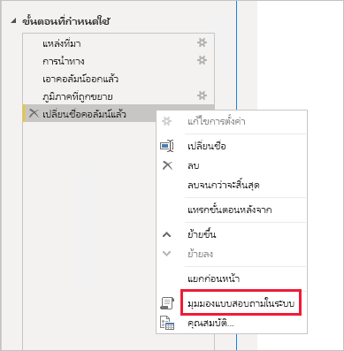
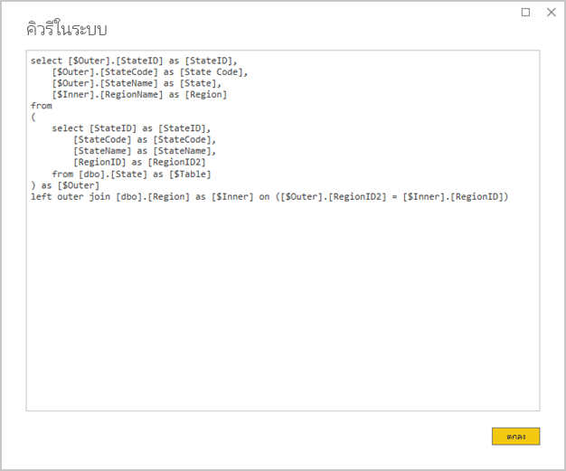
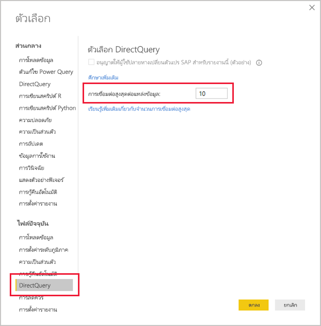
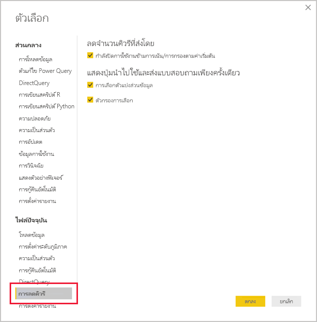
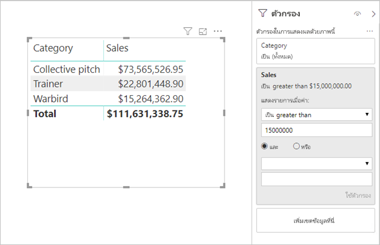

# <a name="directquery-model-guidance-in-power-bi-desktop"></a><span data-ttu-id="963a2-103">คำแนะนำแบบจำลอง DirectQuery ใน Power BI Desktop</span><span class="sxs-lookup"><span data-stu-id="963a2-103">DirectQuery model guidance in Power BI Desktop</span></span>

<span data-ttu-id="963a2-104">บทความนี้มีเป้าหมายสำหรับผู้สร้างแบบจำลองข้อมูลที่กำลังพัฒนาแบบจำลอง Power BI DirectQuery ซึ่งพัฒนาโดยใช้ Power BI Desktop หรือบริการของ Power BI</span><span class="sxs-lookup"><span data-stu-id="963a2-104">This article targets data modelers developing Power BI DirectQuery models, developed by using either Power BI Desktop or the Power BI service.</span></span> <span data-ttu-id="963a2-105">ซึ่งอธิบายถึงกรณีที่ใช้ DirectQuery ข้อจำกัด และคำแนะนำ</span><span class="sxs-lookup"><span data-stu-id="963a2-105">It describes DirectQuery use cases, limitations, and guidance.</span></span> <span data-ttu-id="963a2-106">คำแนะนำได้รับการออกแบบมาเพื่อช่วยให้คุณตรวจสอบว่า DirectQuery เป็นโหมดที่เหมาะสมสำหรับแบบจำลองของคุณหรือไม ่และเพื่อปรับปรุงประสิทธิภาพของรายงานของคุณตามแบบจำลอง DirectQuery</span><span class="sxs-lookup"><span data-stu-id="963a2-106">Specifically, the guidance is designed to help you determine whether DirectQuery is the appropriate mode for your model, and to improve the performance of your reports based on DirectQuery models.</span></span> <span data-ttu-id="963a2-107">บทความนี้นำไปใช้กับแบบจำลอง DirectQuery ที่โฮสต์ในบริการของ Power BI หรือเซิร์ฟเวอร์รายงาน Power BI</span><span class="sxs-lookup"><span data-stu-id="963a2-107">This article applies to DirectQuery models hosted in the Power BI service or Power BI Report Server.</span></span>

<span data-ttu-id="963a2-108">บทความนี้ไม่ได้มีไว้เพื่อจัดการอภิปรายที่สมบูรณ์เกี่ยวกับการออกแบบแบบจำลอง DirectQuery</span><span class="sxs-lookup"><span data-stu-id="963a2-108">This article is not intended to provide a complete discussion on DirectQuery model design.</span></span> <span data-ttu-id="963a2-109">สำหรับคำแนะนำ ให้ดูที่บทความ [แบบจำลอง DirectQuery ใน Power BI Desktop](../connect-data/desktop-directquery-about.md)</span><span class="sxs-lookup"><span data-stu-id="963a2-109">For an introduction, refer to the [DirectQuery models in Power BI Desktop](../connect-data/desktop-directquery-about.md) article.</span></span> <span data-ttu-id="963a2-110">สำหรับการอภิปรายเชิงลึก ให้ดูที่เอกสารทางเทคนิค [DirectQuery ใน SQL Server 2016 Analysis Services](https://download.microsoft.com/download/F/6/F/F6FBC1FC-F956-49A1-80CD-2941C3B6E417/DirectQuery%20in%20Analysis%20Services%20-%20Whitepaper.pdf)โดยตรง</span><span class="sxs-lookup"><span data-stu-id="963a2-110">For a deeper discussion, refer directly to the [DirectQuery in SQL Server 2016 Analysis Services](https://download.microsoft.com/download/F/6/F/F6FBC1FC-F956-49A1-80CD-2941C3B6E417/DirectQuery%20in%20Analysis%20Services%20-%20Whitepaper.pdf) whitepaper.</span></span> <span data-ttu-id="963a2-111">โปรดทราบว่าเอกสารทางเทคนิคจะอธิบายโดยใช้ DirectQuery ใน SQL Server Analysis Services</span><span class="sxs-lookup"><span data-stu-id="963a2-111">Bear in mind that the whitepaper describes using DirectQuery in SQL Server Analysis Services.</span></span> <span data-ttu-id="963a2-112">อย่างไรก็ตาม เนื้อหาส่วนใหญ่จะยังคงสามารถใช้ได้กับแบบจำลอง Power BI DirectQuery</span><span class="sxs-lookup"><span data-stu-id="963a2-112">Much of the content, however, is still applicable to Power BI DirectQuery models.</span></span>

<span data-ttu-id="963a2-113">บทความนี้ไม่ได้ครอบคลุมแบบจำลองคอมโพสิตโดยตรง</span><span class="sxs-lookup"><span data-stu-id="963a2-113">This article does not directly cover Composite models.</span></span> <span data-ttu-id="963a2-114">แบบจำลองคอมโพสิตจะประกอบด้วยแหล่งข้อมูล DirectQuery อย่างน้อยหนึ่งรายการและอาจเพิ่มเติมได้</span><span class="sxs-lookup"><span data-stu-id="963a2-114">A Composite model will consist of at least one DirectQuery source, and possibly more.</span></span> <span data-ttu-id="963a2-115">คำแนะนำที่อธิบายไว้ในบทความนี้ยังคงเกี่ยวข้องกับการออกแบบแบบจำลองคอมโพสิตเป็นอย่างน้อย</span><span class="sxs-lookup"><span data-stu-id="963a2-115">The guidance described in this article is still relevant—at least in part—to Composite model design.</span></span> <span data-ttu-id="963a2-116">อย่างไรก็ตาม ความเกี่ยวข้องของการรวมตารางนำเข้ากับตาราง DirectQuery ไม่ได้อยู่ในขอบเขตสำหรับบทความนี้</span><span class="sxs-lookup"><span data-stu-id="963a2-116">However, the implications of combining Import tables with DirectQuery tables are not in scope for this article.</span></span> <span data-ttu-id="963a2-117">สำหรับข้อมูลเพิ่มเติม โปรดดูการ[ใช้โมเดลแบบรวมใน Power BI Desktop](../transform-model/desktop-composite-models.md)</span><span class="sxs-lookup"><span data-stu-id="963a2-117">For more information, see [Use composite models in Power BI Desktop](../transform-model/desktop-composite-models.md).</span></span>

<span data-ttu-id="963a2-118">สิ่งสำคัญคือต้องทำความเข้าใจว่าแบบจำลอง DirectQuery กำหนดปริมาณงานที่แตกต่างกันในสภาพแวดล้อม Power BI (บริการของ Power BI หรือเซิร์ฟเวอร์รายงาน Power BI) และบนแหล่งข้อมูลต้นแบบ</span><span class="sxs-lookup"><span data-stu-id="963a2-118">It is important to understand that DirectQuery models impose a different workload on the Power BI environment (Power BI service or Power BI Report Server) and also on the underlying data sources.</span></span> <span data-ttu-id="963a2-119">ถ้าคุณตัดสินใจว่า DirectQuery เป็นวิธีการออกแบบที่เหมาะสม เราขอแนะนำให้คุณร่วมมือกับบุคคลที่เหมาะสมกับโครงการ</span><span class="sxs-lookup"><span data-stu-id="963a2-119">If you determine that DirectQuery is the appropriate design approach, we recommend that you engage the right people on the project.</span></span> <span data-ttu-id="963a2-120">เรามักจะเห็นว่าการปรับใช้แบบจำลองDirectQuery ที่ประสบความสำเร็จนั้นเป็นผลมาจากทีมผู้เชี่ยวชาญด้านไอทีที่ทำงานร่วมกันอย่างใกล้ชิด</span><span class="sxs-lookup"><span data-stu-id="963a2-120">We often see that a successful DirectQuery model deployment is the result of a team of IT professionals working closely together.</span></span> <span data-ttu-id="963a2-121">ทีมมักจะประกอบด้วยนักพัฒนาแบบจำลองและผู้ดูแลระบบฐานข้อมูลต้นทาง</span><span class="sxs-lookup"><span data-stu-id="963a2-121">The team usually consists of model developers and the source database administrators.</span></span> <span data-ttu-id="963a2-122">นอกจากนี้ยังสามารถเกี่ยวข้องกับสถาปนิกข้อมูลและคลังข้อมูลและนักพัฒนา ETL</span><span class="sxs-lookup"><span data-stu-id="963a2-122">It can also involve data architects, and data warehouse and ETL developers.</span></span> <span data-ttu-id="963a2-123">บ่อยครั้งที่การปรับให้เหมาะสมจะต้องถูกนำไปใช้กับแหล่งข้อมูลโดยตรงเพื่อให้ได้ผลลัพธ์ประสิทธิภาพที่ดี</span><span class="sxs-lookup"><span data-stu-id="963a2-123">Often, optimizations need to be applied directly to the data source to achieve good performance results.</span></span>

## <a name="design-in-power-bi-desktop"></a><span data-ttu-id="963a2-124">ออกแบบใน Power BI Desktop</span><span class="sxs-lookup"><span data-stu-id="963a2-124">Design in Power BI Desktop</span></span>

<span data-ttu-id="963a2-125">ทั้งคลังข้อมูล Azure SQL และแหล่งข้อมูล Azure HDInsight Spark สามารถเชื่อมต่อโดยตรงได้โดยไม่จำเป็นต้องใช้ Power BI Desktop</span><span class="sxs-lookup"><span data-stu-id="963a2-125">Both Azure SQL Data Warehouse and Azure HDInsight Spark data sources can be connected to directly, without the need to use Power BI Desktop.</span></span> <span data-ttu-id="963a2-126">ซึ่งสามารถทำได้ในบริการของ Power BI โดย "การรับข้อมูล" และการเลือกไทล์ฐานข้อมูล</span><span class="sxs-lookup"><span data-stu-id="963a2-126">It is achieved in the Power BI service by "Getting Data" and choosing the Databases tile.</span></span> <span data-ttu-id="963a2-127">สำหรับข้อมูลเพิ่มเติม ดูที่[คลังข้อมูล Azure SQL ที่มี DirectQuery](../connect-data/service-azure-sql-data-warehouse-with-direct-connect.md)</span><span class="sxs-lookup"><span data-stu-id="963a2-127">For more information, see [Azure SQL Data Warehouse with DirectQuery](../connect-data/service-azure-sql-data-warehouse-with-direct-connect.md).</span></span>

<span data-ttu-id="963a2-128">แม้ว่าการเชื่อมต่อโดยตรงจะสะดวก แต่เราไม่แนะนำให้คุณใช้วิธีนี้</span><span class="sxs-lookup"><span data-stu-id="963a2-128">While direct connect is convenient, we don't recommend that you use this approach.</span></span> <span data-ttu-id="963a2-129">เหตุผลหลักคือไม่สามารถรีเฟรชโครงสร้างแบบจำลองหากมีการเปลี่ยนแปลง Schema แหล่งข้อมูลต้นแบบ</span><span class="sxs-lookup"><span data-stu-id="963a2-129">The main reason is that it is not possible to refresh the model structure should the underlying data source schema change.</span></span>

<span data-ttu-id="963a2-130">เราขอแนะนำให้คุณใช้ Power BI Desktop เพื่อสร้างและจัดการแบบจำลอง DirectQuery ทั้งหมดของคุณ</span><span class="sxs-lookup"><span data-stu-id="963a2-130">We recommend that you use Power BI Desktop to create and manage all of your DirectQuery models.</span></span> <span data-ttu-id="963a2-131">วิธีนี้ช่วยให้คุณสามารถควบคุมได้อย่างเต็มที่เพื่อกำหนดแบบจำลองที่คุณต้องการ ซึ่งรวมถึงการใช้คุณลักษณะที่ได้รับการสนับสนุนเช่น ลำดับชั้น คอลัมน์จากการคำนวณ หน่วยวัด และอื่น ๆ อีกมากมาย</span><span class="sxs-lookup"><span data-stu-id="963a2-131">This approach provides you with complete control to define the model that you need, including the use of supported features like hierarchies, calculated columns, measures, and more.</span></span> <span data-ttu-id="963a2-132">นอกจากนี้ยังจะช่วยให้คุณสามารถแก้ไขการออกแบบแบบจำลองหากมีการเปลี่ยนแปลง Schema แหล่งข้อมูลต้นแบบ</span><span class="sxs-lookup"><span data-stu-id="963a2-132">It will also allow you to revise the model design should the underlying data source schema change.</span></span>

## <a name="optimize-data-source-performance"></a><span data-ttu-id="963a2-133">ปรับประสิทธิภาพของแหล่งข้อมูลให้เหมาะสม</span><span class="sxs-lookup"><span data-stu-id="963a2-133">Optimize data source performance</span></span>

<span data-ttu-id="963a2-134">แหล่งฐานข้อมูลเชิงสัมพันธ์สามารถปรับให้เหมาะสมได้ในหลายวิธีตามที่อธิบายไว้ในรายการหัวข้อย่อยต่อไปนี้</span><span class="sxs-lookup"><span data-stu-id="963a2-134">The relational database source can be optimized in several ways, as described in the following bulleted list.</span></span>

> [!NOTE]
> <span data-ttu-id="963a2-135">เราเข้าใจว่าผู้สร้างแบบจำลองบางคนไม่ได้รับอนุญาตหรือไม่มีทักษะในการปรับประสิทธิภาพฐานข้อมูลเชิงสัมพันธ์ให้เหมาะสม</span><span class="sxs-lookup"><span data-stu-id="963a2-135">We understand that not all modelers have the permissions or skills to optimize a relational database.</span></span> <span data-ttu-id="963a2-136">แม้ว่าจะเป็นเลเยอร์ที่จำเป็นในการเตรียมข้อมูลสำหรับแบบจำลอง DirectQuery แต่การเพิ่มประสิทธิภาพบางอย่างยังสามารถทำได้ในการออกแบบแบบจำลองโดยไม่ต้องแก้ไขฐานข้อมูลต้นทาง</span><span class="sxs-lookup"><span data-stu-id="963a2-136">While it is the preferred layer to prepare the data for a DirectQuery model, some optimizations can also be achieved in the model design, without modifying the source database.</span></span> <span data-ttu-id="963a2-137">อย่างไรก็ตาม ผลการเพิ่มประสิทธิภาพที่ดีที่สุดมักจะทำได้โดยใช้การปรับให้เหมาะสมกับฐานข้อมูลต้นทาง</span><span class="sxs-lookup"><span data-stu-id="963a2-137">However, best optimization results are often achieved by applying optimizations to the source database.</span></span>

- <span data-ttu-id="963a2-138">**ตรวจสอบให้แน่ใจว่าข้อมูลมีความถูกต้อง:** เป็นสิ่งสำคัญอย่างยิ่งที่ตารางประเภทมิติต้องประกอบด้วยคอลัมน์ของค่าที่ไม่ซ้ำกัน (คีย์มิติ) ซึ่งแมปกับตารางประเภทข้อเท็จจริง</span><span class="sxs-lookup"><span data-stu-id="963a2-138">**Ensure data integrity is complete:** It is especially important that dimension-type tables contain a column of unique values (dimension key) that maps to the fact-type table(s).</span></span> <span data-ttu-id="963a2-139">นอกจากนี้ ยังเป็นสิ่งสำคัญที่คอลัมน์มิติข้อเท็จจริงต้องมีค่าคีย์มิติที่ถูกต้อง</span><span class="sxs-lookup"><span data-stu-id="963a2-139">It's also important that fact-type dimension columns contain valid dimension key values.</span></span> <span data-ttu-id="963a2-140">การดำเนินการนี้จะช่วยให้การกำหนดค่าความสัมพันธ์แบบจำลองมีประสิทธิภาพมากขึ้น ซึ่งคาดว่าจะมีค่าที่ตรงกันทั้งสองด้านของความสัมพันธ์</span><span class="sxs-lookup"><span data-stu-id="963a2-140">They will allow configuring more efficient model relationships that expect matched values on both sides of relationships.</span></span> <span data-ttu-id="963a2-141">หากข้อมูลต้นฉบับไม่ถูกต้อง ขอแนะนำให้เพิ่มไฟล์ข้อมูลมิติ "ไม่ทราบ" เพื่อซ่อมแซมข้อมูลอย่างมีประสิทธิภาพ</span><span class="sxs-lookup"><span data-stu-id="963a2-141">When the source data lacks integrity, it's recommended that an "unknown" dimension record is added to effectively repair the data.</span></span> <span data-ttu-id="963a2-142">ตัวอย่างเช่น คุณสามารถเพิ่มแถวลงในตาราง **ผลิตภัณฑ์** เพื่อแสดงถึงผลิตภัณฑ์ที่ไม่รู้จัก และจากนั้นกำหนดคีย์ที่อยู่นอกช่วงเช่น -1</span><span class="sxs-lookup"><span data-stu-id="963a2-142">For example, you can add a row to the **Product** table to represent an unknown product, and then assign it an out-of-range key, like -1.</span></span> <span data-ttu-id="963a2-143">ถ้าแถวในตาราง **ยอดขาย** ประกอบด้วยค่าคีย์ผลิตภัณฑ์ที่ขาดหายไป ให้แทนที่ด้วย -1</span><span class="sxs-lookup"><span data-stu-id="963a2-143">If rows in the **Sales** table contain a missing product key value, substitute them with -1.</span></span> <span data-ttu-id="963a2-144">การดำเนินการนี้จะทำให้แน่ใจว่าค่าคีย์ผลิตภัณฑ์ **ยอดขาย** ทั้งหมดมีแถวที่สอดคล้องกันในตาราง **ผลิตภัณฑ์**</span><span class="sxs-lookup"><span data-stu-id="963a2-144">It will ensure every **Sales** product key value has a corresponding row in the **Product** table.</span></span>
- <span data-ttu-id="963a2-145">**เพิ่มดัชนี:** กำหนดดัชนีที่เหมาะสม—ในตารางหรือมุมมองเพื่อสนับสนุนการดึงข้อมูลที่มีประสิทธิภาพสำหรับการกรองและการจัดกลุ่มวิชวลรายงานที่คาดไว้</span><span class="sxs-lookup"><span data-stu-id="963a2-145">**Add indexes:** Define appropriate indexes—on tables or views—to support the efficient retrieval of data for the expected report visual filtering and grouping.</span></span> <span data-ttu-id="963a2-146">สำหรับ SQL Server ฐานข้อมูล Azure SQL หรือแหล่งข้อมูลคลัง Azure SQL ให้ดู [คู่มือสถาปัตยกรรมและการออกแบบ SQL Server Index](/sql/relational-databases/sql-server-index-design-guide) สำหรับข้อมูลที่เป็นประโยชน์เกี่ยวกับคำแนะนำการออกแบบดัชนี</span><span class="sxs-lookup"><span data-stu-id="963a2-146">For SQL Server, Azure SQL Database or Azure SQL Data Warehouse sources, see [SQL Server Index Architecture and Design Guide](/sql/relational-databases/sql-server-index-design-guide) for helpful information on index design guidance.</span></span> <span data-ttu-id="963a2-147">สำหรับแหล่งข้อมูลที่เปลี่ยนแปลงได้ของ SQL Server หรือ Azure SQL Database ให้ดู [เริ่มต้นใช้งานด้วย Columnstore เพื่อการวิเคราะห์การดำเนินงานแบบเรียลไทม์](/sql/relational-databases/indexes/get-started-with-columnstore-for-real-time-operational-analytics)</span><span class="sxs-lookup"><span data-stu-id="963a2-147">For SQL Server or Azure SQL Database volatile sources, see [Get started with Columnstore for real-time operational analytics](/sql/relational-databases/indexes/get-started-with-columnstore-for-real-time-operational-analytics).</span></span>
- <span data-ttu-id="963a2-148">**ออกแบบตารางแบบกระจาย:** สำหรับแหล่งคลังข้อมูล Azure SQL ซึ่งใช้ประโยชน์จากสถาปัตยกรรม Massively Parallel Processing (MPP) ให้พิจารณากำหนดค่าตารางประเภทข้อเท็จจริงขนาดใหญ่เป็นแฮชที่กระจาย และตารางประเภทมิติเพื่อทำซ้ำในโหนดการคำนวณทั้งหมด</span><span class="sxs-lookup"><span data-stu-id="963a2-148">**Design distributed tables:** For Azure SQL Data Warehouse sources, which leverage Massively Parallel Processing (MPP) architecture, consider configuring large fact-type tables as hash distributed, and dimension-type tables to replicate across all the compute nodes.</span></span> <span data-ttu-id="963a2-149">สำหรับข้อมูลเพิ่มเติม ให้ดู[คำแนะนำสำหรับการออกแบบตารางแบบกระจายในคลังข้อมูล Azure SQL](/azure/sql-data-warehouse/sql-data-warehouse-tables-distribute#what-is-a-distributed-table)</span><span class="sxs-lookup"><span data-stu-id="963a2-149">For more information, see [Guidance for designing distributed tables in Azure SQL Data Warehouse](/azure/sql-data-warehouse/sql-data-warehouse-tables-distribute#what-is-a-distributed-table).</span></span>
- <span data-ttu-id="963a2-150">**ตรวจสอบให้แน่ใจว่ามีการแปลงข้อมูลที่จำเป็นให้เป็นรูปธรรม:** สำหรับแหล่งฐานข้อมูลเชิงสัมพันธ์ SQL Server (และแหล่งฐานข้อมูลเชิงสัมพันธ์อื่นๆ) สามารถเพิ่มคอลัมน์จากการคำนวณลงในตารางได้</span><span class="sxs-lookup"><span data-stu-id="963a2-150">**Ensure required data transformations are materialized:** For SQL Server relational database sources (and other relational database sources), computed columns can be added to tables.</span></span> <span data-ttu-id="963a2-151">คอลัมน์เหล่านี้จะยึดตามนิพจน์เช่น **ปริมาณ** คูณด้วย **UnitPrice**.</span><span class="sxs-lookup"><span data-stu-id="963a2-151">These columns are based on an expression, like **Quantity** multiplied by **UnitPrice**.</span></span> <span data-ttu-id="963a2-152">คอลัมน์จากการคำนวณสามารถคงอยู่ได้ (เป็นรูปธรรม) และเช่นเดียวกับคอลัมน์ปกติ บางครั้งก็สามารถสร้างดัชนีได้</span><span class="sxs-lookup"><span data-stu-id="963a2-152">Computed columns can be persisted (materialized) and, like regular columns, sometimes they can be indexed.</span></span> <span data-ttu-id="963a2-153">สำหรับข้อมูลเพิ่มเติม ให้ดู[ดัชนีบนคอลัมน์จากการคำนวณ](/sql/relational-databases/indexes/indexes-on-computed-columns)</span><span class="sxs-lookup"><span data-stu-id="963a2-153">For more information, see [Indexes on Computed Columns](/sql/relational-databases/indexes/indexes-on-computed-columns).</span></span>

    <span data-ttu-id="963a2-154">พิจารณามุมมองที่มีการจัดทำดัชนีซึ่งสามารถรวบรวมข้อมูลตารางข้อเท็จจริงล่วงหน้าในระดับเกรนที่สูงขึ้นได้</span><span class="sxs-lookup"><span data-stu-id="963a2-154">Consider also indexed views that can pre-aggregate fact table data at a higher grain.</span></span> <span data-ttu-id="963a2-155">ตัวอย่างเช่น ถ้าตาราง **ยอดขาย** จัดเก็บข้อมูลที่ระดับใบสั่งซื้อ คุณสามารถสร้างมุมมองเพื่อสรุปข้อมูลนี้ได้</span><span class="sxs-lookup"><span data-stu-id="963a2-155">For example, if the **Sales** table stores data at order line level, you could create a view to summarize this data.</span></span> <span data-ttu-id="963a2-156">มุมมองอาจขึ้นอยู่กับคำสั่ง SELECT ที่จัดกลุ่มข้อมูลตาราง **ยอดขาย** ตามวันที่ (ในระดับเดือน) ลูกค้า ผลิตภัณฑ์ และสรุปค่าหน่วยวัดเช่น ยอดขาย ปริมาณ, ฯลฯ จากนั้นสามารถทำดัชนีมุมมองได้</span><span class="sxs-lookup"><span data-stu-id="963a2-156">The view could be based on a SELECT statement that groups the **Sales** table data by date (at month level), customer, product, and summarizes measure values like sales, quantity, etc. The view can then be indexed.</span></span> <span data-ttu-id="963a2-157">สำหรับ SQL Server หรือแหล่งฐานข้อมูล Azure SQL ให้ดู [สร้างมุมมองที่จัดทำดัชนี](/sql/relational-databases/views/create-indexed-views)</span><span class="sxs-lookup"><span data-stu-id="963a2-157">For SQL Server or Azure SQL Database sources, see [Create Indexed Views](/sql/relational-databases/views/create-indexed-views).</span></span>
- <span data-ttu-id="963a2-158">**ทำตารางวันที่ให้เป็นรูปธรรม:** ข้อกำหนดในการสร้างแบบจำลองทั่วไปเกี่ยวข้องกับการเพิ่มตารางวันที่เพื่อสนับสนุนการกรองตามเวลา</span><span class="sxs-lookup"><span data-stu-id="963a2-158">**Materialize a date table:** A common modeling requirement involves adding a date table to support time-based filtering.</span></span> <span data-ttu-id="963a2-159">เพื่อสนับสนุนตัวกรองตามเวลาที่รู้จักในองค์กรของคุณ ให้สร้างตารางในฐานข้อมูลต้นทางและตรวจสอบให้แน่ใจว่าตารางได้ถูกโหลดในช่วงวันที่ ซึ่งครอบคลุมวันที่ของตารางข้อเท็จจริง</span><span class="sxs-lookup"><span data-stu-id="963a2-159">To support the known time-based filters in your organization, create a table in the source database, and ensure it is loaded with a range of dates encompassing the fact table dates.</span></span> <span data-ttu-id="963a2-160">นอกจากนี้ยังตรวจสอบให้แน่ใจว่ามีคอลัมน์สำหรับช่วงเวลาที่มีประโยชน์ เช่น ปี ไตรมาส เดือน สัปดาห์ ฯลฯ</span><span class="sxs-lookup"><span data-stu-id="963a2-160">Also ensure that it includes columns for useful time periods, like year, quarter, month, week, etc.</span></span>

## <a name="optimize-model-design"></a><span data-ttu-id="963a2-161">ปรับแต่งการออกแบบแบบจำลอง</span><span class="sxs-lookup"><span data-stu-id="963a2-161">Optimize model design</span></span>

<span data-ttu-id="963a2-162">แบบจำลอง DirectQuery สามารถปรับให้เหมาะสมได้หลายวิธีตามที่อธิบายไว้ในรายการหัวข้อย่อยต่อไปนี้</span><span class="sxs-lookup"><span data-stu-id="963a2-162">A DirectQuery model can be optimized in many ways, as described in the following bulleted list.</span></span>

- <span data-ttu-id="963a2-163">**หลีกเลี่ยงการใช้คิวรี Power Query ที่ซับซ้อน:** การออกแบบรูปแบบที่มีประสิทธิภาพสามารถทำได้โดยไม่จำเป็นต้องใช้คิวรี Power Query เพื่อทำการแปลงข้อมูลใด ๆ</span><span class="sxs-lookup"><span data-stu-id="963a2-163">**Avoid complex Power Query queries:** An efficient model design can be achieved by removing the need for the Power Query queries to apply any transformations.</span></span> <span data-ttu-id="963a2-164">ซึ่งหมายความว่าคิวรีแต่ละรายการจะแมปไปยังตารางแหล่งข้อมูลเชิงสัมพันธ์หรือมุมมองเดียว</span><span class="sxs-lookup"><span data-stu-id="963a2-164">It means that each query maps to a single relational database source table or view.</span></span> <span data-ttu-id="963a2-165">คุณสามารถแสดงตัวอย่างของคำสั่งคิวรี SQL ที่แท้จริงสำหรับขั้นตอนที่ใช้ Power Query โดยการเลือกตัวเลือก **ดูคิวรีในระบบของฐานข้อมูล**</span><span class="sxs-lookup"><span data-stu-id="963a2-165">You can preview a representation of the actual SQL query statement for a Power Query applied step, by selecting the **View Native Query** option.</span></span>

    
    
    

- <span data-ttu-id="963a2-169">**ตรวจสอบการใช้งานของคอลัมน์จากการคำนวณและการเปลี่ยนแปลงชนิดข้อมูล** แบบจำลอง DirectQuery รองรับการเพิ่มการคำนวณและขั้นตอน Power Query เพื่อแปลงชนิดข้อมูล</span><span class="sxs-lookup"><span data-stu-id="963a2-169">**Examine the use of calculated columns and data type changes:** DirectQuery models support adding calculations and Power Query steps to convert data types.</span></span> <span data-ttu-id="963a2-170">อย่างไรก็ตาม ประสิทธิภาพที่ดีขึ้นมักจะทำได้โดยการทำให้ผลการแปลงข้อมูลเป็นรูปธรรมในแหล่งฐานข้อมูลเชิงสัมพันธ์เมื่อเป็นไปได้</span><span class="sxs-lookup"><span data-stu-id="963a2-170">However, better performance is often achieved by materializing transformation results in the relational database source, when possible.</span></span>
- <span data-ttu-id="963a2-171">**อย่าใช้การกรองวันที่ที่สัมพันธ์กันของ Power Query:** คุณสามารถกำหนดการกรองวันที่ที่สัมพันธ์กันในคิวรี Power Query ได้</span><span class="sxs-lookup"><span data-stu-id="963a2-171">**Do not use Power Query relative date filtering:** It's possible to define relative date filtering in a Power Query query.</span></span> <span data-ttu-id="963a2-172">ตัวอย่างเช่น ในการดึงข้อมูลใบสั่งขายที่สร้างขึ้นในปีที่ผ่านมา (เทียบกับวันที่ปัจจุบัน)</span><span class="sxs-lookup"><span data-stu-id="963a2-172">For example, to retrieve to the sales orders that were created in the last year (relative to today's date).</span></span> <span data-ttu-id="963a2-173">ตัวกรองชนิดนี้จะแปลเป็นคิวรีในระบบของฐานข้อมูลที่ไม่มีประสิทธิภาพ ดังต่อไปนี้:</span><span class="sxs-lookup"><span data-stu-id="963a2-173">This type of filter translates to an inefficient native query, as follows:</span></span>

    ```SQL
    …
    from [dbo].[Sales] as [_]
    where [_].[OrderDate] >= convert(datetime2, '2018-01-01 00:00:00') and [_].[OrderDate] < convert(datetime2, '2019-01-01 00:00:00'))  
    ```
    
    <span data-ttu-id="963a2-174">วิธีการออกแบบที่ดีกว่าคือการรวมคอลัมน์เวลาที่สัมพันธ์กันในตารางวันที่</span><span class="sxs-lookup"><span data-stu-id="963a2-174">A better design approach is to include relative time columns in the date table.</span></span> <span data-ttu-id="963a2-175">คอลัมน์เหล่านี้จะจัดเก็บค่าตรงข้ามที่สัมพันธ์กับวันที่ปัจจุบัน</span><span class="sxs-lookup"><span data-stu-id="963a2-175">These columns store offset values relative to the current date.</span></span> <span data-ttu-id="963a2-176">ตัวอย่างเช่น ในคอลัมน์ **RelativeYear** ค่าศูนย์แทนปีปัจจุบัน -1 แทนปีก่อนหน้า เป็นต้น อย่างไรก็ตาม คอลัมน์ **RelativeYear** จะปรากฎขึ้นในตารางวันที่</span><span class="sxs-lookup"><span data-stu-id="963a2-176">For example, in a **RelativeYear** column, the value zero represents current year, -1 represents previous year, etc. Preferably, the **RelativeYear** column is materialized in the date table.</span></span> <span data-ttu-id="963a2-177">แม้ว่าประสิทธิภาพจะน้อยลง แต่ก็ยังสามารถเพิ่มเป็นคอลัมน์จากการคำนวณของแบบจำลองโดยยึดตามนิพจน์โดยใช้ฟังก์ชัน DAX ของ [TODAY](/dax/today-function-dax) และ [DATE](/dax/date-function-dax)</span><span class="sxs-lookup"><span data-stu-id="963a2-177">While less efficient, it could also be added as a model calculated column, based on the expression using the [TODAY](/dax/today-function-dax) and [DATE](/dax/date-function-dax) DAX functions.</span></span>

- <span data-ttu-id="963a2-178">**เก็บหน่วยวัดแบบง่าย:** อย่างน้อยในขั้นตอนแรก เราาขอแนะนำให้จำกัดหน่วยวัดเป็นผลรวมอย่างง่าย</span><span class="sxs-lookup"><span data-stu-id="963a2-178">**Keep measures simple:** At least initially, it's recommended to limit measures to simple aggregates.</span></span> <span data-ttu-id="963a2-179">ฟังก์ชันการรวมประกอบด้วย SUM, COUNT, MIN, MAX และ AVERAGE</span><span class="sxs-lookup"><span data-stu-id="963a2-179">The aggregate functions include SUM, COUNT, MIN, MAX, and AVERAGE.</span></span> <span data-ttu-id="963a2-180">จากนั้นหากการวัดนั้นสามารถตอบสนองได้อย่างเพียงพอ คุณสามารถทดสอบด้วยการวัดที่ซับซ้อนมากขึ้น แต่ให้ความสนใจกับประสิทธิภาพของการวัดแต่ละรายการ</span><span class="sxs-lookup"><span data-stu-id="963a2-180">Then, if the measures are sufficiently responsive, you can experiment with more complex measures, but paying attention to the performance for each.</span></span> <span data-ttu-id="963a2-181">แม้ว่าฟังก์ชัน DAX ของ [CALCULATE](/dax/calculate-function-dax) สามารถใช้ในการสร้างนิพจน์หน่วยวัดที่มีความซับซ้อนซึ่งจัดการบริบทตัวกรอง แต่อาจก่อให้เกิดคิวรีในระบบของฐานข้อมูลที่มีราคาแพงที่ไม่ได้ทำงานได้ดี</span><span class="sxs-lookup"><span data-stu-id="963a2-181">While the [CALCULATE](/dax/calculate-function-dax) DAX function can be used to produce sophisticated measure expressions that manipulate filter context, they can generate expensive native queries that do not perform well.</span></span>
- <span data-ttu-id="963a2-182">**หลีกเลี่ยงความสัมพันธ์บนคอลัมน์จากการคำนวณ:** ความสัมพันธ์ของแบบจำลองสามารถเชื่อมโยงคอลัมน์เดียวในตารางเดียวกับคอลัมน์เดียวในตารางอื่นเท่านั้น</span><span class="sxs-lookup"><span data-stu-id="963a2-182">**Avoid relationships on calculated columns:** Model relationships can only relate a single column in one table to a single column in a different table.</span></span> <span data-ttu-id="963a2-183">อย่างไรก็ตาม ในบางครั้งคุณจำเป็นต้องเชื่อมโยงตารางโดยใช้หลายคอลัมน์</span><span class="sxs-lookup"><span data-stu-id="963a2-183">Sometimes, however, it is necessary to relate tables by using multiple columns.</span></span> <span data-ttu-id="963a2-184">ตัวอย่างเช่น ตาราง **ยอดขาย** และ **ภูมิศาสตร์** จะเชื่อมโยงกันโดยสองคอลัมน์ได้แก่ **ประเทศ** และ **เมือง**.</span><span class="sxs-lookup"><span data-stu-id="963a2-184">For example, the **Sales** and **Geography** tables are related by two columns: **Country** and **City**.</span></span> <span data-ttu-id="963a2-185">ในการสร้างความสัมพันธ์ระหว่างตาราง ต้องใช้คอลัมน์เดียว และในตาราง **ภูมิศาสตร์** คอลัมน์จะต้องมีค่าที่ไม่ซ้ำกัน</span><span class="sxs-lookup"><span data-stu-id="963a2-185">To create a relationship between the tables, a single column is required, and in the **Geography** table, the column must contain unique values.</span></span> <span data-ttu-id="963a2-186">การเชื่อมโยงประเทศและเมืองด้วยตัวคั่นยัติภังค์สามารถบรรลุผลลัพธ์นี้ได้</span><span class="sxs-lookup"><span data-stu-id="963a2-186">Concatenating the country and city with a hyphen separator could achieve this result.</span></span>

    <span data-ttu-id="963a2-187">คอลัมน์ที่รวมสามารถสร้างขึ้นได้ด้วยคอลัมน์แบบกำหนดเองของ Power Query หรือในแบบจำลองเป็นคอลัมน์จากการคำนวณ</span><span class="sxs-lookup"><span data-stu-id="963a2-187">The combined column can be created with either a Power Query custom column, or in the model as a calculated column.</span></span> <span data-ttu-id="963a2-188">อย่างไรก็ตาม การดำเนินการนี้ควรหลีกเลี่ยงเนื่องจากนิพจน์การคำนวณจะถูกฝังลงในคิวรีแหล่งข้อมูล</span><span class="sxs-lookup"><span data-stu-id="963a2-188">However, it should be avoided as the calculation expression will be embedded into the source queries.</span></span> <span data-ttu-id="963a2-189">ไม่เพียงแต่จะไม่มีประสิทธิภาพเท่านั้น แต่ยังขัดขวางมิให้มีการใช้ดัชนี</span><span class="sxs-lookup"><span data-stu-id="963a2-189">Not only is it inefficient, it commonly prevents the use of indexes.</span></span> <span data-ttu-id="963a2-190">ให้เพิ่มคอลัมน์ที่เป็นรูปธรรมในแหล่งฐานข้อมูลเชิงสัมพันธ์แทน และพิจารณาการจัดทำดัชนีคอลัมน์เหล่านั้น</span><span class="sxs-lookup"><span data-stu-id="963a2-190">Instead, add materialized columns in the relational database source, and consider indexing them.</span></span> <span data-ttu-id="963a2-191">นอกจากนี้คุณยังสามารถพิจารณาเพิ่มคอลัมน์คีย์ตัวแทนไปยังตารางชนิดมิติ ซึ่งเป็นแนวทางปฏิบัติทั่วไปในการออกแบบคลังข้อมูลเชิงสัมพันธ์</span><span class="sxs-lookup"><span data-stu-id="963a2-191">You can also consider adding surrogate key columns to dimension-type tables, which is a common practice in relational data warehouse designs.</span></span>
    
    <span data-ttu-id="963a2-192">มีข้อยกเว้นหนึ่งข้อสำหรับคำแนะนำนี้ และเกี่ยวข้องกับการใช้ฟังก์ชัน DAX ของ [COMBINEVALUES](/dax/combinevalues-function-dax)</span><span class="sxs-lookup"><span data-stu-id="963a2-192">There is one exception to this guidance, and it concerns the use of the [COMBINEVALUES](/dax/combinevalues-function-dax) DAX function.</span></span> <span data-ttu-id="963a2-193">วัตถุประสงค์ของฟังก์ชันนี้คือการสนับสนุนความสัมพันธ์ของแบบจำลองที่มีหลายคอลัมน์</span><span class="sxs-lookup"><span data-stu-id="963a2-193">The purpose of this function is to support multi-column model relationships.</span></span> <span data-ttu-id="963a2-194">ให้สร้างเพรดิเคตการรวม SQL แบบหลายคอลัมน์ แทนการสร้างนิพจน์ที่ความสัมพันธ์ใช้</span><span class="sxs-lookup"><span data-stu-id="963a2-194">Rather than generate an expression that the relationship uses, it generates a multi-column SQL join predicate.</span></span>
- <span data-ttu-id="963a2-195">**หลีกเลี่ยงความสัมพันธ์บนคอลัมน์ “ตัวระบุที่ไม่ซ้ำกัน”** โดยดั้งเดิมแล้ว Power BI จะไม่สนับสนุนชนิดข้อมูลตัวระบุที่ไม่ซ้ำกัน (GUID)</span><span class="sxs-lookup"><span data-stu-id="963a2-195">**Avoid relationships on "Unique Identifier" columns:** Power BI does not natively support the unique identifier (GUID) data type.</span></span> <span data-ttu-id="963a2-196">เมื่อกำหนดความสัมพันธ์ระหว่างคอลัมน์ประเภทนี้ Power BI จะสร้างคิวรีแหล่งข้อมูลด้วยการรวมที่เกี่ยวข้องกับการแปลง</span><span class="sxs-lookup"><span data-stu-id="963a2-196">When defining a relationship between columns of this type, Power BI will generate a source query with a join involving a cast.</span></span> <span data-ttu-id="963a2-197">การแปลงข้อมูลเวลาของคิวรีนี้ส่งผลให้ประสิทธิภาพการทำงานแย่ลง</span><span class="sxs-lookup"><span data-stu-id="963a2-197">This query-time data conversion commonly results in poor performance.</span></span> <span data-ttu-id="963a2-198">การแก้ไขปัญหาชั่วคราวเป็นเพียงการทำให้คอลัมน์ของประเภทข้อมูลทางเลือกเป็นรูปธรรมในฐานข้อมูลต้นแบบเท่านั้น จนกว่ากรณีนี้จะได้รับการปรับให้เหมาะสม</span><span class="sxs-lookup"><span data-stu-id="963a2-198">Until this case is optimized, the only workaround is to materialize columns of an alternative data type in the underlying database.</span></span>
- <span data-ttu-id="963a2-199">**ซ่อนคอลัมน์ด้านเดียวของความสัมพันธ์:** คอลัมน์ด้านเดียวของความสัมพันธ์ควรจะถูกซ่อนไว้</span><span class="sxs-lookup"><span data-stu-id="963a2-199">**Hide the one-side column of relationships:** The one-side column of a relationship should be hidden.</span></span> <span data-ttu-id="963a2-200">(ซึ่งมักจะเป็นคอลัมน์คีย์หลักของตารางชนิดมิติ) เมื่อซ่อนอยู่ จะไม่สามารถใช้งานได้ในบานหน้าต่าง **เขตข้อมูล** และดังนั้นจึงไม่สามารถใช้ในการกำหนดค่าวิชวลได้.</span><span class="sxs-lookup"><span data-stu-id="963a2-200">(It is usually the primary key column of dimension-type tables.) When hidden, it is not available in the **Fields** pane and so cannot be used to configure a visual.</span></span> <span data-ttu-id="963a2-201">คอลัมน์แบบหลายด้านสามารถมองเห็นได้ถ้าเป็นประโยชน์ในการจัดกลุ่มหรือกรองรายงานตามค่าของคอลัมน์</span><span class="sxs-lookup"><span data-stu-id="963a2-201">The many-side column can remain visible if it is useful to group or filter reports by the column values.</span></span> <span data-ttu-id="963a2-202">ตัวอย่างเช่น ให้พิจารณาแบบจำลองที่มีความสัมพันธ์ระหว่างตาราง **ยอดขาย** และ **ผลิตภัณฑ์**</span><span class="sxs-lookup"><span data-stu-id="963a2-202">For example, consider a model where a relationship exists between **Sales** and **Product** tables.</span></span> <span data-ttu-id="963a2-203">คอลัมน์ความสัมพันธ์ประกอบด้วยค่า SKU (หน่วยการเก็บสินค้าคงคลัง) ของผลิตภัณฑ์</span><span class="sxs-lookup"><span data-stu-id="963a2-203">The relationship columns contain product SKU (Stock-Keeping Unit) values.</span></span> <span data-ttu-id="963a2-204">ถ้าต้องเพิ่ม SKU ของผลิตภัณฑ์ในวิชวล ควรมองเห็นได้เฉพาะในตาราง **ยอดขาย**</span><span class="sxs-lookup"><span data-stu-id="963a2-204">If product SKU must be added to visuals, it should be visible only in the **Sales** table.</span></span> <span data-ttu-id="963a2-205">เมื่อคอลัมน์นี้ถูกใช้ในการกรองหรือจัดกลุ่มในวิชวล Power BI จะสร้างคิวรีที่ไม่จำเป็นต้องรวมตาราง **ยอดขาย** และ **ผลิตภัณฑ์**</span><span class="sxs-lookup"><span data-stu-id="963a2-205">When this column is used to filter or group in a visual, Power BI will generate a query that does not need to join the **Sales** and **Product** tables.</span></span>
- <span data-ttu-id="963a2-206">**กำหนดความสัมพันธ์เพื่อทำให้ถูกต้อง:** คุณสมบัติ **ตั้งสมมุติฐานแบบ Referential Integrity** ของความสัมพันธ์ DirectQuery จะกำหนดว่า Power BI จะสร้างคิวรีแหล่งข้อมูลโดยใช้การรวมภายในแทนการรวมภายนอก</span><span class="sxs-lookup"><span data-stu-id="963a2-206">**Set relationships to enforce integrity:** The **Assume Referential Integrity** property of DirectQuery relationships determines whether Power BI will generate source queries using an inner join rather than an outer join.</span></span> <span data-ttu-id="963a2-207">ซึ่งโดยทั่วไปแล้วจะช่วยปรับปรุงประสิทธิภาพการทำงานของคิวรี แม้ว่าจะขึ้นอยู่กับแหล่งฐานข้อมูลเชิงสัมพันธ์</span><span class="sxs-lookup"><span data-stu-id="963a2-207">It generally improves query performance, though it does depend on the specifics of the relational database source.</span></span> <span data-ttu-id="963a2-208">สำหรับข้อมูลเพิ่มเติม ให้ดู [สมมติว่ามีการตั้งค่า Referential Integrity ใน Power BI Desktop](../connect-data/desktop-assume-referential-integrity.md)</span><span class="sxs-lookup"><span data-stu-id="963a2-208">For more information, see [Assume referential integrity settings in Power BI Desktop](../connect-data/desktop-assume-referential-integrity.md).</span></span>
- <span data-ttu-id="963a2-209">**หลีกเลี่ยงการใช้การกรองความสัมพันธ์แบบสองทิศทาง:** การใช้การกรองความสัมพันธ์แบบสองทิศทางสามารถทำให้คำสั่งคิวรีทำงานได้ไม่ดี</span><span class="sxs-lookup"><span data-stu-id="963a2-209">**Avoid use of bi-directional relationship filtering:** Use of bi-directional relationship filtering can lead to query statements that don't perform well.</span></span> <span data-ttu-id="963a2-210">ใช้คุณลักษณะความสัมพันธ์นี้เฉพาะเมื่อจำเป็นเท่านั้น และโดยปกติแล้วจะเป็นกรณีที่มีความสัมพันธ์แบบกลุ่ม-ต่อ-กลุ่มในตารางการเชื่อมโยง</span><span class="sxs-lookup"><span data-stu-id="963a2-210">Only use this relationship feature when necessary, and it's usually the case when implementing a many-to-many relationship across a bridging table.</span></span> <span data-ttu-id="963a2-211">สำหรับข้อมูลเพิ่มเติม ดู [ความสัมพันธ์กับคาร์ดินัลลิตี้แบบกลุ่ม-ต่อ-กลุ่มใน Power BI Desktop](../transform-model/desktop-many-to-many-relationships.md)</span><span class="sxs-lookup"><span data-stu-id="963a2-211">For more information, see [Relationships with a many-many cardinality in Power BI Desktop](../transform-model/desktop-many-to-many-relationships.md).</span></span>
- <span data-ttu-id="963a2-212">**จำกัดคิวรีแบบขนาน:** คุณสามารถตั้งค่าจำนวนสูงสุดของการเชื่อมต่อที่ DirectQuery เปิดขึ้นสำหรับแหล่งข้อมูลต้นแบบแต่ละแหล่ง</span><span class="sxs-lookup"><span data-stu-id="963a2-212">**Limit parallel queries:** You can set the maximum number of connections DirectQuery opens for each underlying data source.</span></span> <span data-ttu-id="963a2-213">การดำเนินการนี้จะควบคุมจำนวนคิวรีที่ส่งไปยังแหล่งข้อมูลพร้อมกัน</span><span class="sxs-lookup"><span data-stu-id="963a2-213">It controls the number of queries concurrently sent to the data source.</span></span>

    
    
    <span data-ttu-id="963a2-215">การตั้งค่าจะเปิดใช้งานเฉพาะเมื่อมีอย่างน้อยหนึ่งแหล่งข้อมูล DirectQuery ในแบบจำลอง</span><span class="sxs-lookup"><span data-stu-id="963a2-215">The setting is only enabled when there's at least one DirectQuery source in the model.</span></span> <span data-ttu-id="963a2-216">ค่าดังกล่าวจะนำไปใช้กับแหล่งข้อมูล DirectQuery ทั้งหมด และแหล่งข้อมูล DirectQuery ใหม่ใด ๆ ที่เพิ่มลงในแบบจำลอง</span><span class="sxs-lookup"><span data-stu-id="963a2-216">The value applies to all DirectQuery sources, and to any new DirectQuery sources added to the model.</span></span>

    <span data-ttu-id="963a2-217">การเพิ่มค่า **การเชื่อมต่อสูงสุดต่อแหล่งข้อมูล** ช่วยให้มั่นใจได้ว่าจะสามารถส่งคิวรีไปยังแหล่งข้อมูลต้นแบบได้มากขึ้น (ถึงจำนวนสูงสุดตามที่ระบุ) ซึ่งเป็นประโยชน์เมื่อมีวิชวลจำนวนมากในหน้าเดียวหรือมีผู้ใช้หลายคนที่เข้าถึงรายงานในเวลาเดียวกัน</span><span class="sxs-lookup"><span data-stu-id="963a2-217">Increasing the **Maximum Connections per Data Source** value ensures more queries (up to the maximum number specified) can be sent to the underlying data source, which is useful when numerous visuals are on a single page, or many users access a report at the same time.</span></span> <span data-ttu-id="963a2-218">เมื่อถึงขีดจำกัดจำนวนสูงสุดของการเชื่อมต่อ เพิ่มเติมคิวรีอยู่ในคิวจนกว่าการเชื่อมต่อจะพร้อมใช้งาน</span><span class="sxs-lookup"><span data-stu-id="963a2-218">Once the maximum number of connections is reached, further queries are queued until a connection becomes available.</span></span> <span data-ttu-id="963a2-219">การเพิ่มขีดจำกัดนี้จะทำให้เกิดการโหลดในแหล่งข้อมูลต้นแบบ ดังนั้นการตั้งค่าจึงไม่ได้รับการรับประกันการปรับปรุงประสิทธิภาพการทำงานโดยรวม</span><span class="sxs-lookup"><span data-stu-id="963a2-219">Increasing this limit does result in more load on the underlying data source, so the setting isn't guaranteed to improve overall performance.</span></span>
    
    <span data-ttu-id="963a2-220">เมื่อมีการเผยแพร่แบบจำลองไปยัง Power BI จำนวนสูงสุดของคิวรีที่เกิดขึ้นพร้อมกันที่ส่งไปยังแหล่งข้อมูลต้นแบบจะขึ้นอยู่กับสภาพแวดล้อมด้วย</span><span class="sxs-lookup"><span data-stu-id="963a2-220">When the model is published to Power BI, the maximum number of concurrent queries sent to the underlying data source also depends on the environment.</span></span> <span data-ttu-id="963a2-221">สภาพแวดล้อมต่าง ๆ (เช่น Power BI, Power BI Premium หรือ เซิร์ฟเวอร์รายงาน Power BI) แต่ละรายการสามารถกำหนดขีดจำกัดอัตราความเร็วที่แตกต่างกัน</span><span class="sxs-lookup"><span data-stu-id="963a2-221">Different environments (such as Power BI, Power BI Premium, or Power BI Report Server) each can impose different throughput constraints.</span></span> <span data-ttu-id="963a2-222">สำหรับข้อมูลเพิ่มเติมเกี่ยวกับข้อจำกัดของทรัพยากรความจุ Power BI Premium ให้ดู [การปรับใช้และการจัดการความจุ Power BI Premium](./whitepaper-powerbi-premium-deployment.md)</span><span class="sxs-lookup"><span data-stu-id="963a2-222">For more information about Power BI Premium capacity resource limitations, see [Deploying and Managing Power BI Premium Capacities](./whitepaper-powerbi-premium-deployment.md).</span></span>

## <a name="optimize-report-designs"></a><span data-ttu-id="963a2-223">ปรับการออกแบบรายงานให้เหมาะสม</span><span class="sxs-lookup"><span data-stu-id="963a2-223">Optimize report designs</span></span>

<span data-ttu-id="963a2-224">รายงานที่ยึดตามชุดข้อมูล DirectQuery สามารถปรับให้เหมาะสมได้หลายวิธีตามที่อธิบายไว้ในรายการหัวข้อย่อยต่อไปนี้</span><span class="sxs-lookup"><span data-stu-id="963a2-224">Reports based on a DirectQuery dataset can be optimized in many ways, as described in the following bulleted list.</span></span>

- <span data-ttu-id="963a2-225">**เปิดใช้งานเทคนิคการลดคิวรี:** _ตัวเลือกและการตั้งค่า_ Power BI Desktop มีหน้าการลดคิวรี</span><span class="sxs-lookup"><span data-stu-id="963a2-225">**Enable query reduction techniques:** Power BI Desktop _Options and Settings_ includes a Query Reduction page.</span></span> <span data-ttu-id="963a2-226">หน้านี้มีตัวเลือกที่เป็นประโยชน์สามอย่าง</span><span class="sxs-lookup"><span data-stu-id="963a2-226">This page has three helpful options.</span></span> <span data-ttu-id="963a2-227">คุณสามารถปิดใช้งานการไฮไลต์แบบเชื่อมโยงและการกรองข้ามได้ตามค่าเริ่มต้น แม้ว่าการดำเนินการนี้จะถูกแทนที่ด้วยการแก้ไขการโต้ตอบก็ตาม</span><span class="sxs-lookup"><span data-stu-id="963a2-227">It's possible to disable cross-highlighting and cross-filtering by default, though it can be overridden by editing interactions.</span></span> <span data-ttu-id="963a2-228">นอกจากนี้ยังสามารถแสดงปุ่มนำไปใช้บนตัวแบ่งส่วนข้อมูลและตัวกรองได้</span><span class="sxs-lookup"><span data-stu-id="963a2-228">It is also possible to show an Apply button on slicers and filters.</span></span> <span data-ttu-id="963a2-229">ไม่สามารถใช้ตัวเลือกตัวแบ่งส่วนข้อมูลหรือตัวกรองได้จนกว่าผู้ใช้รายงานจะคลิกปุ่ม</span><span class="sxs-lookup"><span data-stu-id="963a2-229">The slicer or filter options will not be applied until the report user clicks the button.</span></span> <span data-ttu-id="963a2-230">ถ้าคุณเปิดใช้งานตัวเลือกเหล่านี้ เราขอแนะนำให้คุณทำเช่นนั้นเมื่อสร้างรายงานก่อน</span><span class="sxs-lookup"><span data-stu-id="963a2-230">If you enable these options, we recommend that you do so when first creating the report.</span></span>

    
    
- <span data-ttu-id="963a2-232">**ใช้ตัวกรองเป็นอันดับแรก:** เมื่อทำการออกแบบรายงานครั้งแรก เราขอแนะนำให้คุณใช้ตัวกรองที่เกี่ยวข้องต่าง ๆ ในรายงาน หน้า หรือระดับวิชวล ก่อนที่จะแมปเขตข้อมูลไปยังเขตข้อมูลวิชวล</span><span class="sxs-lookup"><span data-stu-id="963a2-232">**Apply filters first:** When first designing reports, we recommend that you apply any applicable filters—at report, page, or visual level—before mapping fields to the visual fields.</span></span> <span data-ttu-id="963a2-233">ตัวอย่างเช่น ให้ใช้ตัวกรองบนเขตข้อมูล **ปี** ก่อน แทนการลากในหน่วยวัด **ประเทศ** และ **ยอดขาย** และจากนั้นกรองตามปีเฉพาะ</span><span class="sxs-lookup"><span data-stu-id="963a2-233">For example, rather than dragging in the **Country** and **Sales** measures, and then filtering by a particular year, apply the filter on the **Year** field first.</span></span> <span data-ttu-id="963a2-234">ทั้งนี้เนื่องจากแต่ละขั้นตอนของการสร้างวิชวลจะส่งคิวรี และคุณสามารถทำการเปลี่ยนแปลงอื่น ๆ ก่อนที่คิวรีแรกจะเสร็จสมบูรณ์ การดำเนินการนี้ยังจะก่อให้เกิดโหลดที่ไม่จำเป็นในแหล่งข้อมูลต้นแบบได้</span><span class="sxs-lookup"><span data-stu-id="963a2-234">It's because each step of building a visual will send a query, and whilst it's possible to then make another change before the first query has completed, it still places unnecessary load on the underlying data source.</span></span> <span data-ttu-id="963a2-235">จากการใช้ตัวกรองในช่วงแรก โดยทั่วไปแล้วจะทำให้คิวรีขั้นกลางมีค่าใช้จ่ายน้อยและเร็วขึ้น</span><span class="sxs-lookup"><span data-stu-id="963a2-235">By applying filters early, it generally makes those intermediate queries less costly and faster.</span></span> <span data-ttu-id="963a2-236">นอกจากนี้ หากไม่สามารถใช้ตัวกรองได้ตั้งแต่ต้นอาจส่งผลให้เกินขีด จำกัด 1 ล้านแถวตามที่อธิบายไว้ข้างต้น</span><span class="sxs-lookup"><span data-stu-id="963a2-236">Also, failing to apply filters early can result in exceeding the 1 million-row limit, as described above.</span></span>
- <span data-ttu-id="963a2-237">**จำกัดจำนวนของวิชวลในหน้า:** เมื่อหน้ารายงานเปิดขึ้น (และเมื่อมีการใช้ตัวกรองหน้า) วิชวลทั้งหมดในหน้านั้นจะถูกรีเฟรช</span><span class="sxs-lookup"><span data-stu-id="963a2-237">**Limit the number of visuals on a page:** When a report page is opened (and when page filters are applied) all of the visuals on a page are refreshed.</span></span> <span data-ttu-id="963a2-238">อย่างไรก็ตาม มีขีดจำกัดเกี่ยวกับจำนวนของคิวรีที่สามารถส่งในแบบขนาน ซึ่งกำหนดโดยสภาพแวดล้อม Power BI และการตั้งค่าแบบจำลอง **การเชื่อมต่อสูงสุดต่อหนึ่งแหล่งข้อมูล** ตามที่อธิบายไว้ด้านบน</span><span class="sxs-lookup"><span data-stu-id="963a2-238">However, there is a limit on the number of queries that can be sent in parallel, imposed by the Power BI environment and the **Maximum Connections per Data Source** model setting, as described above.</span></span> <span data-ttu-id="963a2-239">ดังนั้นเมื่อจำนวนวิชวลหน้าเพิ่มขึ้น จึงมีโอกาสสูงที่วิชวลเหล่านั้นจะถูกรีเฟรชในลักษณะต่อเนื่องกัน</span><span class="sxs-lookup"><span data-stu-id="963a2-239">So, as the number of page visuals increases, there is higher chance that they will be refreshed in a serial manner.</span></span> <span data-ttu-id="963a2-240">การดำเนินการนี้จะเพิ่มเวลาในการรีเฟรชทั้งหน้า และยังเพิ่มโอกาสที่วิชวลอาจแสดงผลลัพธ์ที่ไม่สอดคล้องกัน (สำหรับแหล่งข้อมูลที่เปลี่ยนแปลงได้)</span><span class="sxs-lookup"><span data-stu-id="963a2-240">It increases the time taken to refresh the entire page, and it also increases the chance that visuals may display inconsistent results (for volatile data sources).</span></span> <span data-ttu-id="963a2-241">ด้วยเหตุผลเหล่านี ้ขอแนะนำให้จำกัดจำนวนวิชวลในหน้าต่าง ๆ และใช้หน้าเว็บที่ง่ายกว่าแทน</span><span class="sxs-lookup"><span data-stu-id="963a2-241">For these reasons, it's recommended to limit the number of visuals on any page, and instead have more simpler pages.</span></span> <span data-ttu-id="963a2-242">การแทนที่วิชวลการ์ดหลายใบด้วยวิชวลการ์ดแบบหลายแถววิชวลเดียวสามารถสร้างเค้าโครงหน้ากระดาษที่คล้ายกันได้</span><span class="sxs-lookup"><span data-stu-id="963a2-242">Replacing multiple card visuals with a single multi-row card visual can achieve a similar page layout.</span></span>
- <span data-ttu-id="963a2-243">**ปิดการโต้ตอบระหว่างวิชวล:** การโต้ตอบด้วยการไฮไลต์แบบเชื่อมโยงและการกรองข้ามจะต้องมีการส่งคิวรีไปยังแหล่งข้อมูลต้นแบบ</span><span class="sxs-lookup"><span data-stu-id="963a2-243">**Switch off interaction between visuals:** Cross-highlighting and cross-filtering interactions require queries be submitted to the underlying source.</span></span> <span data-ttu-id="963a2-244">ถ้าไม่จำเป็นต้องมีการโต้ตอบเหล่านี้ เราขอแนะนำให้ปิดถ้าเวลาที่ใช้ในการตอบสนองต่อการเลือกของผู้ใช้จะใช้เวลานานเกินสมควร</span><span class="sxs-lookup"><span data-stu-id="963a2-244">Unless these interactions are necessary, it's recommended they be switched off if the time taken to respond to users' selections would be unreasonably long.</span></span> <span data-ttu-id="963a2-245">คุณสามารถปิดการโต้ตอบเหล่านี้สำหรับรายงานทั้งหมด (ตามที่อธิบายไว้ด้านบนสำหรับ ตัวเลือกการลดคิวรี) หรือในแต่ละกรณ</span><span class="sxs-lookup"><span data-stu-id="963a2-245">These interactions can be switched off, either for the entire report (as described above for Query Reduction options), or on a case-by-case basis.</span></span> <span data-ttu-id="963a2-246">สำหรับข้อมูลเพิ่มเติม โปรดดู [วิธีการใช้วิชวลกรองข้ามกันในรายงาน Power BI](../consumer/end-user-interactions.md)</span><span class="sxs-lookup"><span data-stu-id="963a2-246">For more information, see [How visuals cross-filter each other in a Power BI report](../consumer/end-user-interactions.md).</span></span>

<span data-ttu-id="963a2-247">นอกเหนือจากรายการเทคนิคการเพิ่มประสิทธิภาพ ความสามารถแต่ละอย่างในการรายงานต่อไปนี้อาจก่อให้เกิดปัญหาด้านประสิทธิภาพการทำงานได้</span><span class="sxs-lookup"><span data-stu-id="963a2-247">In addition to the above list of optimization techniques, each of the following reporting capabilities can contribute to performance issues:</span></span>

- <span data-ttu-id="963a2-248">**ตัวกรองหน่วยวัด:** วิชวลที่มีหน่วยวัด (หรือการรวมของคอลัมน์) อาจมีตัวกรองที่ใช้กับหน่วยวัดเหล่านั้น</span><span class="sxs-lookup"><span data-stu-id="963a2-248">**Measure filters:** Visuals containing measures (or aggregates of columns) can have filters applied to those measures.</span></span> <span data-ttu-id="963a2-249">ตัวอย่างเช่น วิชวลด้านล่างจะแสดง **ยอดขาย** ตาม **ประเภท** แต่เพียงแค่สำหรับประเภทที่มียอดขายมากกว่า 15 ล้านเหรียญเท่านั้น</span><span class="sxs-lookup"><span data-stu-id="963a2-249">For example, the visual below shows **Sales** by **Category**, but only for categories with more than $15 million of sales.</span></span>

    
    
    
    <span data-ttu-id="963a2-251">ซึ่งอาจส่งผลให้มีการส่งคิวรีสองคิวรีไปยังแหล่งข้อมูลต้นแบบ</span><span class="sxs-lookup"><span data-stu-id="963a2-251">It may result in two queries being sent to the underlying source:</span></span>
    
    - <span data-ttu-id="963a2-252">คิวรีแรกจะดึงข้อมูลประเภทที่ตรงตามเงื่อนไข (ยอดขาย > 15 ล้านเหรียญ)</span><span class="sxs-lookup"><span data-stu-id="963a2-252">The first query will retrieve the categories meeting the condition (Sales > $15 million)</span></span>
    - <span data-ttu-id="963a2-253">คิวรีที่สองจะดึงข้อมูลจำเป็นสำหรับวิชวล ซึ่งเพิ่มประเภทที่ตรงตามเงื่อนไขในคำสั่ง WHERE</span><span class="sxs-lookup"><span data-stu-id="963a2-253">The second query will then retrieve the necessary data for the visual, adding the categories that met the condition to the WHERE clause</span></span>
    
    <span data-ttu-id="963a2-254">ซึ่งโดยทั่วไปแล้วจะดำเนินการได้ดีหากมีหลายร้อยหรือหลายพันประเภท ตามตัวอย่างนี้</span><span class="sxs-lookup"><span data-stu-id="963a2-254">It generally performs fine if there are hundreds or thousands of categories, as in this example.</span></span> <span data-ttu-id="963a2-255">อย่างไรก็ตาม ประสิทธิภาพการทำงานจะลดลงถ้าจำนวนของประเภทมีขนาดใหญ่มาก (และคิวรีจะล้มเหลวถ้ามีมากกว่า 1 ล้านประเภทที่ตรงตามเงื่อนไข เนื่องจากขีดจำกัดแถวคือ 1 ล้านแถวตามที่กล่าวไว้ข้างต้น)</span><span class="sxs-lookup"><span data-stu-id="963a2-255">Performance can degrade, however, if the number of categories is much larger (and indeed, the query will fail if there are more than 1 million categories meeting the condition, due to the 1 million-row limit discussed above).</span></span>
- <span data-ttu-id="963a2-256">**ตัวกรอง TopN:** สามารถกำหนดตัวกรองขั้นสูงเพื่อกรองเฉพาะค่า N สูงสุด (หรือต่ำสุด) เท่านั้นที่จัดอันดับด้วยหน่วยวัด</span><span class="sxs-lookup"><span data-stu-id="963a2-256">**TopN filters:** Advanced filters can be defined to filter on only the top (or bottom) N values ranked by a measure.</span></span> <span data-ttu-id="963a2-257">ตัวอย่างเช่น เมื่อต้องการแสดงเฉพาะห้าประเภทสูงสุดในวิชวลข้างต้น</span><span class="sxs-lookup"><span data-stu-id="963a2-257">For example, to display only the top five categories in the above visual.</span></span> <span data-ttu-id="963a2-258">เช่นเดียวกับตัวกรองหน่วยวัด การดำเนินการนี้จะส่งผลให้มีการส่งคิวรีสองคิวรีไปยังแหล่งข้อมูลต้นแบบด้วย</span><span class="sxs-lookup"><span data-stu-id="963a2-258">Like the measure filters, it will also result in two queries being sent to the underlying data source.</span></span> <span data-ttu-id="963a2-259">อย่างไรก็ตาม คิวรีแรกจะส่งกลับทุกประเภทจากแหล่งข้อมูลต้นแบบ และ N สูงสุดจะถูกกำหนดโดยยึดตามผลลัพธ์ที่ส่งกลับ</span><span class="sxs-lookup"><span data-stu-id="963a2-259">However, the first query will return all categories from the underlying source, and then the top N are determined based on the returned results.</span></span> <span data-ttu-id="963a2-260">การดำเนินการนี้อาจทำให้เกิดปัญหาด้านประสิทธิภาพการทำงาน (หรือความล้มเหลวของคิวรีเนื่องจากขีดจำกัดแถว 1 ล้านแถว) ซึ่งขึ้นอยู่กับคาร์ดินัลลิติ้ของคอลัมน์เกี่ยวข้อง</span><span class="sxs-lookup"><span data-stu-id="963a2-260">Depending on the cardinality of the column involved, it can lead to performance issues (or query failures due to the 1 million-row limit).</span></span>
- <span data-ttu-id="963a2-261">**ค่ากลาง:** โดยทั่วไปแล้ว การรวมใด ๆ (ผลรวม จำนวนนับเฉพาะ ฯลฯ) จะถูกผลักไปยังแหล่งข้อมูลต้นแบบ</span><span class="sxs-lookup"><span data-stu-id="963a2-261">**Median:** Generally, any aggregation (Sum, Count Distinct, etc.) is pushed to the underlying source.</span></span> <span data-ttu-id="963a2-262">อย่างไรก็ตาม การดำเนินการนี้ไม่ถูกต้องสำหรับค่ามัธยฐาน เนื่องจากการรวมนี้ไม่ได้รับการสนับสนุนโดยแหล่งข้อมูลต้นแบบ</span><span class="sxs-lookup"><span data-stu-id="963a2-262">However, it's not true for Median, as this aggregate is not supported by the underlying source.</span></span> <span data-ttu-id="963a2-263">ในกรณีดังกล่าว ข้อมูลรายละเอียดจะถูกดึงมาจากแหล่งข้อมูลต้นแบบ และ Power BI จะคำนวณค่ามัธยฐานจากผลลัพธ์ที่ส่งกลับ</span><span class="sxs-lookup"><span data-stu-id="963a2-263">In such cases, detail data is retrieved from the underlying source, and Power BI evaluates the median from the returned results.</span></span> <span data-ttu-id="963a2-264">การทำเช่นนี้จะผลดีเมื่อมีการคำนวณค่ามัธยฐานจากจำนวนผลลัพธ์ที่ค่อนข้างน้อย แต่ปัญหาด้านประสิทธิภาพการทำงาน (หรือความล้มเหลวของคิวรีเนื่องจากขีดจำกัดแถว 1 ล้านแถว) จะเกิดขึ้นหากคาร์ดินัลลิติ้มีขนาดใหญ่</span><span class="sxs-lookup"><span data-stu-id="963a2-264">It's fine when the median is to be calculated over a relatively small number of results, but performance issues (or query failures due to the 1 million-row limit) will occur if the cardinality is large.</span></span> <span data-ttu-id="963a2-265">ตัวอย่างเช่น จำนวนประชากรของประเทศโดยเฉลี่ยอาจเหมาะสม แต่ราคาขายโดยเฉลี่ยนอาจไม่เหมาะสม</span><span class="sxs-lookup"><span data-stu-id="963a2-265">For example, median country population might be reasonable, but median sales price might not be.</span></span>
- <span data-ttu-id="963a2-266">**เลือกตัวแบ่งส่วนข้อมูลหลายรายการ:** การอนุญาตให้มีการเลือกหลายรายการในตัวแบ่งส่วนข้อมูลและตัวกรองอาจทำให้เกิดปัญหาด้านประสิทธิภาพการทำงานได้</span><span class="sxs-lookup"><span data-stu-id="963a2-266">**Multi-select slicers:** Allowing multi-selection in slicers and filters can cause performance issues.</span></span> <span data-ttu-id="963a2-267">ทั้งนี้เนื่องจากผู้ใช้เลือกรายการตัวแบ่งส่วนข้อมูลเพิ่มเติม (ตัวอย่างเช่น การสร้างผลิตภัณฑ์ที่ผู้ใช้มีความสนใจจำนวน 10 รายการ) การเลือกใหม่แต่ละรายการจะส่งให้มีการส่งคิวรีใหม่ไปยังแหล่งข้อมูลต้นแบบ</span><span class="sxs-lookup"><span data-stu-id="963a2-267">It's because as the user selects additional slicer items (for example, building up to the 10 products they are interested in), each new selection results in a new query being sent to the underlying source.</span></span> <span data-ttu-id="963a2-268">ผู้ใช้สามารถเลือกรายการถัดไปก่อนที่จะดำเนินการคิวรีให้เสร็จสิ้น ซึ่งจะส่งผลให้เกิดภาระส่วนเกินในแหล่งข้อมูลต้นแบบ</span><span class="sxs-lookup"><span data-stu-id="963a2-268">Whilst the user can select the next item prior to the query completing, it results in extra load on the underlying source.</span></span> <span data-ttu-id="963a2-269">สถานการณ์นี้สามารถหลีกเลี่ยงได้โดยการแสดงปุ่มนำไปใช้ตามที่อธิบายไว้ด้านบนในเทคนิคการลดคิวรี</span><span class="sxs-lookup"><span data-stu-id="963a2-269">This situation can be avoided by showing the Apply button, as described above in the query reduction techniques.</span></span>
- <span data-ttu-id="963a2-270">**ผลรวมวิชวล:** ตามค่าเริ่มต้น ตารางและเมทริกซ์จะแสดงผลรวมและผลรวมย่อย</span><span class="sxs-lookup"><span data-stu-id="963a2-270">**Visual totals:** By default, tables and matrices display totals and subtotals.</span></span> <span data-ttu-id="963a2-271">ในหลายกรณี คิวรีเพิ่มเติมจะต้องถูกส่งไปยังแหล่งข้อมูลต้นแบบเพื่อรับค่าสำหรับผลรวม</span><span class="sxs-lookup"><span data-stu-id="963a2-271">In many cases, additional queries must be sent to the underlying source to obtain the values for the totals.</span></span> <span data-ttu-id="963a2-272">การดำเนินการนี้จะนำมาใช้เมื่อใดก็ตามที่ใช้ผลรวมของจำนวนนับเฉพาะหรือมัธยฐาน และในทุกกรณีเมื่อใช้ DirectQuery บน SAP HANA หรือ SAP Business Warehouse</span><span class="sxs-lookup"><span data-stu-id="963a2-272">It applies whenever using Count Distinct or Median aggregates, and in all cases when using DirectQuery over SAP HANA or SAP Business Warehouse.</span></span> <span data-ttu-id="963a2-273">ผลรวมดังกล่าวควรจะปิด (โดยใช้บานหน้าต่างรูปแบบ) ถ้าไม่จำเป็นต้องใช้</span><span class="sxs-lookup"><span data-stu-id="963a2-273">Such totals should be switched off (by using the Format pane) if not necessary.</span></span>

## <a name="convert-to-a-composite-model"></a><span data-ttu-id="963a2-274">แปลงเป็นแบบจำลองคอมโพสิต</span><span class="sxs-lookup"><span data-stu-id="963a2-274">Convert to a Composite Model</span></span>

<span data-ttu-id="963a2-275">ประโยชน์ของแบบจำลองการนำเข้าและ DirectQuery สามารถรวมเป็นแบบจำลองเดี่ยวได้โดยการกำหนดค่าโหมดที่เก็บข้อมูลของตารางแบบจำลอง</span><span class="sxs-lookup"><span data-stu-id="963a2-275">The benefits of Import and DirectQuery models can be combined into a single model by configuring the storage mode of the model tables.</span></span> <span data-ttu-id="963a2-276">โหมดที่เก็บข้อมูลตารางสามารถนำเข้าหรือ DirectQuery หรือทั้งสองอย่างที่เรียกว่าคู่</span><span class="sxs-lookup"><span data-stu-id="963a2-276">The table storage mode can be Import or DirectQuery, or both, known as Dual.</span></span> <span data-ttu-id="963a2-277">เมื่อแบบจำลองมีตารางที่มีโหมดที่เก็บข้อมูลที่แตกต่างกัน แบบจำลองดังกล่าวจะเรียกว่าแบบจำลองคอมโพสิต</span><span class="sxs-lookup"><span data-stu-id="963a2-277">When a model contains tables with different storage modes, it is known as a Composite model.</span></span> <span data-ttu-id="963a2-278">สำหรับข้อมูลเพิ่มเติม โปรดดูการ[ใช้โมเดลแบบรวมใน Power BI Desktop](../transform-model/desktop-composite-models.md)</span><span class="sxs-lookup"><span data-stu-id="963a2-278">For more information, see [Use composite models in Power BI Desktop](../transform-model/desktop-composite-models.md).</span></span>

<span data-ttu-id="963a2-279">มีการปรับปรุงฟังก์ชันการทำงานและประสิทธิภาพการทำงานจำนวนมากที่สามารถทำได้โดยการแปลงแบบจำลอง DirectQuery เป็นแบบจำลองคอมโพสิต</span><span class="sxs-lookup"><span data-stu-id="963a2-279">There are many functional and performance enhancements that can be achieved by converting a DirectQuery model to a Composite model.</span></span> <span data-ttu-id="963a2-280">แบบจำลองคอมโพสิตสามารถผนวกแหล่งข้อมูล DirectQuery ได้มากกว่าหนึ่งรายการ และยังรวมถึงการรวมด้วย</span><span class="sxs-lookup"><span data-stu-id="963a2-280">A Composite model can integrate more than one DirectQuery source, and it can also include aggregations.</span></span> <span data-ttu-id="963a2-281">ตารางการรวมสามารถเพิ่มลงในตาราง DirectQuery เพื่อนำเข้าการแสดงผลสรุปของตาราง</span><span class="sxs-lookup"><span data-stu-id="963a2-281">Aggregation tables can be added to DirectQuery tables to import a summarized representation of the table.</span></span> <span data-ttu-id="963a2-282">ซึ่งสามารถปรับปรุงประสิทธิภาพการทำงานได้อย่างมากเมื่อวิชวลทำการคิวรีการรวมในระดับที่สูงขึ้น</span><span class="sxs-lookup"><span data-stu-id="963a2-282">They can achieve dramatic performance enhancements when visuals query higher-level aggregates.</span></span> <span data-ttu-id="963a2-283">สำหรับข้อมูลเพิ่มเติม ดู[การรวมใน Power BI Desktop](../transform-model/desktop-aggregations.md)</span><span class="sxs-lookup"><span data-stu-id="963a2-283">For more information, see [Aggregations in Power BI Desktop](../transform-model/desktop-aggregations.md).</span></span>

## <a name="educate-users"></a><span data-ttu-id="963a2-284">ให้ความรู้แก่ผู้ใช้</span><span class="sxs-lookup"><span data-stu-id="963a2-284">Educate users</span></span>

<span data-ttu-id="963a2-285">สิ่งสำคัญคือต้องให้ความรู้แก่ผู้ใช้ของคุณเกี่ยวกับวิธีทำงานอย่างมีประสิทธิภาพกับรายงานตามชุดข้อมูล DirectQuery</span><span class="sxs-lookup"><span data-stu-id="963a2-285">It is important to educate your users on how to efficiently work with reports based on DirectQuery datasets.</span></span> <span data-ttu-id="963a2-286">ผู้เขียนรายงานของคุณควรมีความรู้เกี่ยวกับเนื้อหาที่อธิบายไว้ในส่วน [ปรับการออกแบบรายงานให้เหมาะสม](#optimize-report-designs)</span><span class="sxs-lookup"><span data-stu-id="963a2-286">Your report authors should be educated on the content described in the [Optimize report designs](#optimize-report-designs) section.</span></span>

<span data-ttu-id="963a2-287">เราขอแนะนำให้คุณให้ความรู้แก่ผู้ใช้รายงานเกี่ยวกับรายงานของคุณที่อิงกับชุดข้อมูล DirectQuery</span><span class="sxs-lookup"><span data-stu-id="963a2-287">We recommend that you educate your report consumers about your reports that are based on DirectQuery datasets.</span></span> <span data-ttu-id="963a2-288">ซึ่งอาจเป็นประโยชน์สำหรับผู้ใช้พื่อทำความเข้าใจสถาปัตยกรรมข้อมูลทั่วไป รวมถึงข้อจำกัดที่เกี่ยวข้องใด ๆ ที่อธิบายไว้ในบทความนี้</span><span class="sxs-lookup"><span data-stu-id="963a2-288">It can be helpful for them to understand the general data architecture, including any relevant limitations described in this article.</span></span> <span data-ttu-id="963a2-289">แจ้งให้ผู้ใช้ทราบว่าการตอบสนองต่อการรีเฟรชและการกรองแบบโต้ตอบอาจจะช้าในบางครั้ง</span><span class="sxs-lookup"><span data-stu-id="963a2-289">Let them know to expect that refresh responses and interactive filtering may at times be slow.</span></span> <span data-ttu-id="963a2-290">เมื่อผู้ใช้รายงานเข้าใจว่าเหตุใดประสิทธิภาพการทำงานจึงลดลง ความเชื่อถือของพวกเขาที่มีต่อรายงานและข้อมูลอาจไม่ลดน้อยลง</span><span class="sxs-lookup"><span data-stu-id="963a2-290">When report users understand why performance degradation happens, they are less likely to lose trust in the reports and data.</span></span>

<span data-ttu-id="963a2-291">เมื่อส่งรายงานเกี่ยวกับแหล่งข้อมูลที่เปลี่ยนแปลงได้ ต้องให้แน่ใจว่าผู้ใช้รายงานมีความรู้เกี่ยวกับการใช้ปุ่มรีเฟรช</span><span class="sxs-lookup"><span data-stu-id="963a2-291">When delivering reports on volatile data sources, be sure to educate report users on the use of the Refresh button.</span></span> <span data-ttu-id="963a2-292">แจ้งให้ผู้ใช้ทราบว่าอาจเป็นไปได้ที่จะเห็นผลลัพธ์ที่ไม่สอดคล้องกันและการรีเฟรชรายงานสามารถแก้ไขความไม่สอดคล้องกันต่าง ๆ บนหน้ารายงานได้</span><span class="sxs-lookup"><span data-stu-id="963a2-292">Let them know also that it may be possible to see inconsistent results, and that a refresh of the report can resolve any inconsistencies on the report page.</span></span>

## <a name="next-steps"></a><span data-ttu-id="963a2-293">ขั้นตอนถัดไป</span><span class="sxs-lookup"><span data-stu-id="963a2-293">Next steps</span></span>

<span data-ttu-id="963a2-294">สำหรับข้อมูลเพิ่มเติมเกี่ยวกับ DirectQuery โปรดดูที่ทรัพยากรดังต่อไปนี้:</span><span class="sxs-lookup"><span data-stu-id="963a2-294">For more information about DirectQuery, check out the following resources:</span></span>

- [<span data-ttu-id="963a2-295">แบบจำลอง DirectQuery ใน Power BI Desktop</span><span class="sxs-lookup"><span data-stu-id="963a2-295">DirectQuery models in Power BI Desktop</span></span>](../connect-data/desktop-directquery-about.md)
- [<span data-ttu-id="963a2-296">ใช้ DirectQuery ใน Power BI Desktop</span><span class="sxs-lookup"><span data-stu-id="963a2-296">Use DirectQuery in Power BI Desktop</span></span>](../connect-data/desktop-use-directquery.md)
- [<span data-ttu-id="963a2-297">การแก้ไขปัญหาแบบจำลอง DirectQuery ใน Power BI Desktop</span><span class="sxs-lookup"><span data-stu-id="963a2-297">DirectQuery model troubleshooting in Power BI Desktop</span></span>](../connect-data/desktop-directquery-troubleshoot.md)
- <span data-ttu-id="963a2-298">มีคำถามหรือไม่</span><span class="sxs-lookup"><span data-stu-id="963a2-298">Questions?</span></span> [<span data-ttu-id="963a2-299">ลองถามชุมชน Power BI</span><span class="sxs-lookup"><span data-stu-id="963a2-299">Try asking the Power BI Community</span></span>](https://community.powerbi.com/)
