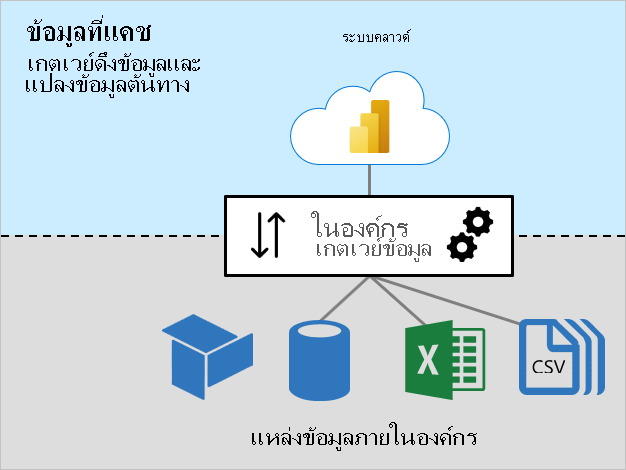
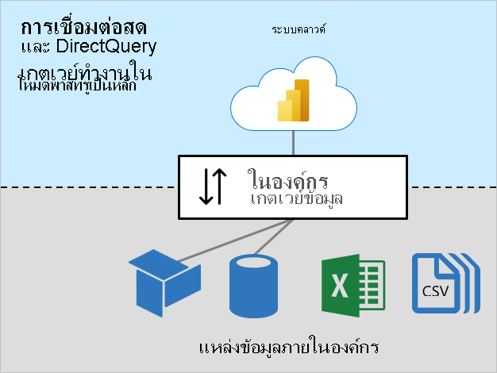

# ขนาดเกตเวย์ข้อมูลภายในองค์กรOn-premises data gateway sizing

บทความนี้มุ่งเป้าที่ผู้ดูแลระบบ Power BI ที่จำเป็นต้องติดตั้งและจัดการ [เกตเวย์ข้อมูลภายในองค์กร](../connect-data/service-gateway-onprem.md)This article targets Power BI administrators who need to install and manage the [on-premises data gateway](../connect-data/service-gateway-onprem.md).

จำเป็นต้องใช้เกตเวย์เมื่อ Power BI ต้องเข้าถึงข้อมูลที่ไม่สามารถใช้งานได้โดยตรงผ่านทางอินเทอร์เน็ตThe gateway is required whenever Power BI must access data that isn't accessible directly over the Internet. สามารถติดตั้งได้บนเซิร์ฟเวอร์ภายในองค์กรหรือ VM-hosted Infrastructure-as-a-Service (IaaS)It can be installed on a server on-premises, or VM-hosted Infrastructure-as-a-Service (IaaS).

## ปริมาณงานเกตเวย์Gateway workloads

เกตเวย์ข้อมูลภายในองค์กรรองรับได้สองปริมาณงานThe on-premises data gateway supports two workloads. เป็นสิ่งสำคัญที่คุณต้องทำความเข้าใจปริมาณงานเหล่านี้ก่อนที่เราจะพูดคุยเกี่ยวกับการปรับขนาดเกตเวย์และคำแนะนำIt's important you first understand these workloads before we discuss gateway sizing and recommendations.

### ปริมาณงานข้อมูลที่แคชCached data workload

ปริมาณงาน _ข้อมูลที่แคชไว้_ ดึงและแปลงแหล่งข้อมูลต้นฉบับสำหรับการโหลดลงในชุดข้อมูล Power BIThe _Cached data_ workload retrieves and transforms source data for loading into Power BI datasets. สามารถทำได้ในสามขั้นตอน:It does so in three steps:

1. **การเชื่อมต่อ**: เกตเวย์เชื่อมต่อกับข้อมูลต้นทาง**Connection**: The gateway connects to source data
1. **การเรียกและการแปลงข้อมูล**: ข้อมูลจะถูกเรียกใช้ และเมื่อจำเป็น จะถูกแปลง**Data retrieval and transformation**: Data is retrieved, and when necessary, transformed. เมื่อใดก็ตามที่เป็นไปได้ Power Query mashup engine จะส่งขั้นตอนการแปลงไปยังแหล่งข้อมูล - ซึ่งเรียกว่า _[การพับคิวรี](power-query-folding.md)_Whenever possible, the Power Query mashup engine pushes transformation steps to the data source—it's known as _[query folding](power-query-folding.md)_. เมื่อไม่สามารถทำได้ การแปลงจะต้องทำโดยเกตเวย์When it's not possible, transformations must be done by the gateway. ในกรณีนี้ เกตเวย์จะใช้ทรัพยากร CPU และหน่วยความจำมากขึ้นIn this case, the gateway will consume more CPU and memory resources.
1. **ถ่ายโอน**: ข้อมูลถูกถ่ายโอนไปยังบริการของ Power BI —การเชื่อมต่ออินเทอร์เน็ตที่เชื่อถือได้และรวดเร็วเป็นสิ่งสำคัญโดยเฉพาะอย่างยิ่งสำหรับจำนวนข้อมูลขนาดใหญ่**Transfer**: Data is transferred to the Power BI service—a reliable and fast Internet connection is important, especially for large data volumes

### ปริมาณงานการเชื่อมต่อสดและ DirectQueryLive Connection and DirectQuery workloads

ปริมาณงาน _การเชื่อมต่อสดและ DirectQuery_ ส่วนใหญ่จะทำงานในโหมดพาส-ทรูThe _Live Connection and DirectQuery_ workload works mostly in pass-through mode. บริการของ Power BI ส่งคิวรีและตอบสนองของเกตเวย์ด้วยผลลัพธ์คิวรีThe Power BI service sends queries, and the gateway responds with query results. โดยทั่วไป ผลลัพธ์คิวรีมีขนาดเล็กGenerally, query results are small in size.

- สำหรับข้อมูลเพิ่มเติมเกี่ยวกับการเชื่อมต่อสด ดู [ชุดข้อมูลในบริการของ Power BI (แบบจำลองข้อมูลที่โฮสต์ภายนอก)](../connect-data/service-datasets-understand.md#external-hosted-models)For more information about Live Connection, see [Datasets in the Power BI service (Externally-hosted models)](../connect-data/service-datasets-understand.md#external-hosted-models).
- สำหรับข้อมูลเพิ่มเติมเกี่ยวกับ DirectQuery ดู [โหมดชุดข้อมูลในบริการของ Power BI (โหมด DirectQuery)](../connect-data/service-dataset-modes-understand.md#directquery-mode)For more information about DirectQuery, see [Dataset modes in the Power BI service (DirectQuery mode)](../connect-data/service-dataset-modes-understand.md#directquery-mode).

ปริมาณงานนี้จำเป็นต้องมีทรัพยากรของ CPU สำหรับคิวรีของเส้นทางและผลลัพธ์คิวรีThis workload requires CPU resources for routing queries and query results. โดยปกติแล้วจะมีความต้องการ CPU น้อยกว่าปริมาณการแคชข้อมูลที่จำเป็น โดยเฉพาะอย่างยิ่งเมื่อจำเป็นต้องแปลงข้อมูลสำหรับการแคชUsually there's much less demand for CPU than is required by the Cache data workload—especially when it's required to transform data for caching.

การเชื่อมต่อที่เชื่อถือได้ รวดเร็ว และสม่ำเสมอ เป็นสิ่งสำคัญที่ต้องตรวจสอบให้แน่ใจว่าผู้ใช้รายงานมีประสบการณ์ตอบสนองในลักษณะนี้Reliable, fast, and consistent connectivity is important to ensure report users have responsive experiences.

## ข้อควรพิจารณาเกี่ยวกับการปรับขนาดSizing considerations

การกำหนดขนาดที่ถูกต้องสำหรับเครื่องเกตเวย์ของคุณอาจขึ้นอยู่กับตัวแปรดังต่อไปนี้:Determining the correct sizing for your gateway machine can depend on the following variables:

- สำหรับปริมาณงานของข้อมูลแคช:For Cache data workloads:
  - จำนวนการรีเฟรชชุดข้อมูลพร้อมกันThe number of concurrent dataset refreshes
  - ชนิดของแหล่งข้อมูล (ฐานข้อมูลเชิงสัมพันธ์ ฐานข้อมูลการวิเคราะห์ ฟีดข้อมูล หรือไฟล์)The types of data sources (relational database, analytic database, data feeds, or files)
  - ปริมาณข้อมูลที่จะเรียกใช้จากแหล่งข้อมูลThe volume of data to be retrieved from data sources
  - การแปลงใดๆ ที่จำเป็นต้องทำโดย Power Query mashup engineAny transformations required to be done by the Power Query mashup engine
  - ปริมาณของข้อมูลที่จะถ่ายโอนไปยังบริการของ Power BIThe volume of data to be transferred to the Power BI service
- สำหรับปริมาณงานการเชื่อมต่อสดและ DirectQuery:For Live Connection and DirectQuery workloads:
  - จำนวนผู้ใช้รายงานที่เกิดขึ้นพร้อมกันThe number of concurrent report users
  - จำนวนการแสดงผลด้วยภาพบนหน้ารายงาน (แต่ละวิชวลจะส่งอย่างน้อยหนึ่งคิวรี)The number of visuals on report pages (each visual sends at least one query)
  - ความถี่ของการอัปเดตแคชคิวรีของแดชบอร์ด Power BIThe frequency of Power BI dashboard query cache updates
  - จำนวนรายงานแบบเรียลไทม์ใช้คุณลักษณะ[การรีเฟรชหน้าโดยอัตโนมัติ](../create-reports/desktop-automatic-page-refresh.md)The number of real-time reports using the [Automatic page refresh](../create-reports/desktop-automatic-page-refresh.md) feature
  - ไม่ว่าชุดข้อมูลจะบังคับใช้ [การรักษาความปลอดภัยระดับแถว (RLS)](../create-reports/desktop-rls.md) หรือไม่Whether datasets enforce [Row-level Security (RLS)](../create-reports/desktop-rls.md)

โดยทั่วไป แล้วปริมาณงานการเชื่อมต่อสดและ DirectQuery จำเป็นต้องมี CPU เพียงพอ ในขณะที่ปริมาณงานแคชข้อมูลจำเป็นต้องใช้ CPU และหน่วยความจำมากขึ้นGenerally, Live Connection and DirectQuery workloads require sufficient CPU, while Cache data workloads require more CPU and memory. ปริมาณงานทั้งสองขึ้นอยู่กับการเชื่อมต่อที่ดีกับบริการของ Power BI และแหล่งข้อมูลBoth workloads depend on good connectivity with the Power BI service, and the data sources.

> [!NOTE]
> ความจุ Power BI กำหนดขีดจำกัดในการรีเฟรชแบบจำลองแบบขนาน และอัตราความเร็วการเชื่อมต่อสดและ DirectQueryPower BI capacities impose limits on model refresh parallelism, and Live Connection and DirectQuery throughput. การปรับขนาดของเกตเวย์ของคุณเพื่อส่งข้อมูลมากกว่าที่บริการของ Power BI สนับสนุนไม่ได้ส่งผลใดๆ เกิดขึ้นThere's no point sizing your gateways to deliver more than what the Power BI service supports. ขีดจำกัดมีความแตกต่างตาม Premium SKU (และ SKU ที่มีขนาดเท่ากัน)Limits differ by Premium SKU (and equivalently sized A SKU). สำหรับข้อมูลเพิ่มเติม ให้ดู [Power BI Premium คืออะไร (โหนดความจุ)](../admin/service-premium-what-is.md#capacity-nodes)For more information, see [What is Power BI Premium? (Capacity nodes)](../admin/service-premium-what-is.md#capacity-nodes).

## คำแนะนำRecommendations

คำแนะนำในการปรับขนาดเกตเวย์ขึ้นอยู่กับตัวแปรจำนวนมากGateway sizing recommendations depend on many variables. ในส่วนนี้ เราจะให้คำแนะนำทั่วไปที่คุณสามารถนำไปพิจารณาดูได้In this section, we provide you with general recommendations that you can take into consideration.

### การปรับขนาดเริ่มต้นInitial sizing

อาจเป็นเรื่องยากที่จะประเมินขนาดที่ถูกต้องได้อย่างแม่นยำIt can be difficult to accurately estimate the right size. เราขอแนะนำให้คุณเริ่มต้นด้วยเครื่องที่มีแกน CPU อย่างน้อย 8 คอร์ RAM 8 GB และอะแดปเตอร์เครือข่ายหลายจิกะบิตWe recommend that you start with a machine with at least 8 CPU cores, 8 GB of RAM, and multiple Gigabit network adapters. จากนั้นคุณสามารถวัดปริมาณงานเกตเวย์ทั่วไปได้โดยการบันทึกตัวนับของ CPU และหน่วยความจำระบบYou can then measure a typical gateway workload by logging CPU and memory system counters. สำหรับข้อมูลเพิ่มเติม ดูที่ [การตรวจสอบและปรับประสิทธิภาพการทำงานของเกตเวย์ข้อมูลภายในองค์กรให้เหมาะสม](/data-integration/gateway/service-gateway-performance)For more information, see [Monitor and optimize on-premises data gateway performance](/data-integration/gateway/service-gateway-performance).

### การเชื่อมต่อConnectivity

วางแผนสำหรับการเชื่อมต่อที่ดีที่สุดที่เป็นไปได้ระหว่างบริการของ Power BI กับเกตเวย์ของคุณ และเกตเวย์ของคุณกับแหล่งข้อมูลPlan for the best possible connectivity between the Power BI service and your gateway, and your gateway and the data sources.

- มุ่งมั่นเพื่อความน่าเชื่อถือ ความรวดเร็ว และเวลาในการตอบสนองที่ต่ำและสม่ำเสมอStrive for reliability, fast speeds, and low, consistent latencies
- กำจัด - หรือลด - การกระโดดของเครื่องระหว่างเกตเวย์และแหล่งข้อมูลของคุณEliminate—or reduce—machine hops between the gateway and your data sources
- ลบการควบคุมเครือข่ายใดๆ ที่กำหนดโดยเลเยอร์พร็อกซีไฟร์วอลล์ของคุณRemove any network throttling imposed by your firewall proxy layer. สำหรับข้อมูลเพิ่มเติมเกี่ยวกับตำแหน่งข้อมูล Power BI ดูที่ [เพิ่ม URL Power BI ในรายการอนุญาตของคุณ](../admin/power-bi-whitelist-urls.md)For more information about Power BI endpoints, see [Add Power BI URLs to your allow list](../admin/power-bi-whitelist-urls.md).
- กำหนดค่า [Azure ExpressRoute](/azure/expressroute/expressroute-introduction) เพื่อสร้างการเชื่อมต่อส่วนตัวที่มีการจัดการไปยัง Power BIConfigure [Azure ExpressRoute](/azure/expressroute/expressroute-introduction) to establish private, managed connections to Power BI
- สำหรับแหล่งข้อมูลใน Azure VMs ตรวจสอบให้แน่ใจว่า VMs [colocate กับบริการของ Power BI](../admin/service-admin-where-is-my-tenant-located.md)For data sources in Azure VMs, ensure the VMs are [colocated with the Power BI service](../admin/service-admin-where-is-my-tenant-located.md)
- สำหรับปริมาณงานการเชื่อมต่อสดไปยัง SQL Server Analysis Services (SSAS) ที่เกี่ยวข้องกับ RLS แบบไดนามิก ตรวจสอบให้แน่ใจว่ามีการเชื่อมต่อที่ดีระหว่างเครื่องเกตเวย์และ Active Directory ภายในองค์กรFor Live Connection workloads to SQL Server Analysis Services (SSAS) involving dynamic RLS, ensure good connectivity between the gateway machine and the on-premises Active Directory

### การทำคลัสเตอร์Clustering

สำหรับการปรับใช้งานขนาดใหญ่ คุณสามารถสร้างเกตเวย์ของการติดตั้งคลัสเตอร์ได้For large-scale deployments, you can create a gateway of cluster installations. คลัสเตอร์หลีกเลี่ยงจุดเดียวของความล้มเหลว และสามารถโหลดการรับส่งข้อมูลสมดุลข้ามเกตเวย์Clusters avoid single points of failure, and can load balance traffic across gateways. คุณสามารถ:You can:

- ติดตั้งเกตเวย์หนึ่งรายการหรือมากกว่าได้ในคลัสเตอร์Install one or more gateways in a cluster
- แยกปริมาณงานไปยังเกตเวย์แบบสแตนด์อโลน หรือคลัสเตอร์ของเซิร์ฟเวอร์เกตเวย์ได้Isolate workloads to standalone gateways, or clusters of gateway servers

สำหรับข้อมูลเพิ่มเติม ดู [การจัดการคลัสเตอร์เกตเวย์ข้อมูลภายในองค์กรที่มีความพร้อมใช้งานสูงและการปรับสมดุลการโหลด](/data-integration/gateway/service-gateway-high-availability-clusters)For more information, see [Manage on-premises data gateway high-availability clusters and load balancing](/data-integration/gateway/service-gateway-high-availability-clusters).

### การออกแบบชุดข้อมูลและการตั้งค่าDataset design and settings

การออกแบบชุดข้อมูลและการตั้งค่าอาจส่งผลต่อปริมาณงานเกตเวย์Dataset design, and their settings, can impact on gateway workloads. หากต้องการลดปริมาณงานเกตเวย์ คุณสามารถพิจารณาการดำเนินการต่อไปนี้To reduce gateway workload, you can consider the following actions.

สำหรับชุดข้อมูลที่นำเข้า:For Import datasets:

- กำหนดค่าการรีเฟรชข้อมูลน้อยลงConfigure less frequent data refresh
- กำหนดค่า [การรีเฟรชแบบเพิ่มทีละส่วน](../admin/service-premium-incremental-refresh.md) เพื่อลดจำนวนข้อมูลที่จะถ่ายโอนConfigure [incremental refresh](../admin/service-premium-incremental-refresh.md) to minimize the amount of data to transfer
- เมื่อใดที่เป็นไปได้ ตรวจสอบแน่ใจว่ามี [การพับคิวรี](power-query-folding.md)เกิดขึ้นWhenever possible, ensure [query folding](power-query-folding.md) takes place
- โดยเฉพาะอย่างยิ่งสำหรับข้อมูลขนาดใหญ่หรือความจำเป็นสำหรับผลลัพธ์ที่มีความแฝงต่ำ ให้แปลงการออกแบบเป็นแบบจำลอง DirectQuery หรือ [แบบรวม](../connect-data/service-dataset-modes-understand.md#composite-mode)Especially for large data volumes or a need for low-latency results, convert the design to a DirectQuery or [Composite](../connect-data/service-dataset-modes-understand.md#composite-mode) model

สำหรับชุดข้อมูล DirectQuery:For DirectQuery datasets:

- ปรับแหล่งข้อมูล แบบจำลอง และการออกแบบรายงานให้เหมาะสม สำหรับข้อมูลเพิ่มเติม ดู [คำแนะนำแบบจำลอง DirectQuery ใน Power BI Desktop](directquery-model-guidance.md)Optimize data sources, model, and report designs—for more information, see [DirectQuery model guidance in Power BI Desktop](directquery-model-guidance.md)
- สร้าง [การรวม](../transform-model/desktop-aggregations.md) เพื่อแคชผลลัพธ์ในระดับที่สูงขึ้น เพื่อลดจำนวนคำขอ DirectQueryCreate [aggregations](../transform-model/desktop-aggregations.md) to cache higher-level results to reduce the number of DirectQuery requests
- จำกัดช่วง [การรีเฟรชหน้าอัตโนมัติ](../create-reports/desktop-automatic-page-refresh.md) ในการออกแบบรายงานและการตั้งค่าความจุRestrict [Automatic page refresh](../create-reports/desktop-automatic-page-refresh.md) intervals, in report designs and capacity settings
- โดยเฉพาะอย่างยิ่งเมื่อบังคับใช้ RLS แบบไดนามิก ให้จำกัดความถี่ในการอัปเดตแคชของแดชบอร์ดEspecially when dynamic RLS is enforced, restrict dashboard cache update frequency
- โดยเฉพาะอย่างยิ่งสำหรับข้อมูลที่มีขนาดเล็กหรือสำหรับข้อมูลถาวร ให้แปลงการออกแบบเป็นแบบจำลองการนำเข้าหรือ [แบบรวม](../connect-data/service-dataset-modes-understand.md#composite-mode)Especially for smaller data volumes or for non-volatile data, convert the design to an Import or [Composite](../connect-data/service-dataset-modes-understand.md#composite-mode) model

สำหรับชุดข้อมูลการเชื่อมต่อสด:For Live Connection datasets:

- โดยเฉพาะอย่างยิ่งเมื่อบังคับใช้ RLS แบบไดนามิก ให้จำกัดความถี่ในการอัปเดตแคชของแดชบอร์ดEspecially when dynamic RLS is enforced, restrict dashboard cache update frequency

## ขั้นตอนถัดไปNext steps

สำหรับข้อมูลเพิ่มเติมที่เกี่ยวข้องกับบทความนี้ โปรดดูทรัพยากรต่อไปนี้:For more information related to this article, check out the following resources:

- [คำแนะนำสำหรับการปรับใช้เกตเวย์ข้อมูลจาก Power BIGuidance for deploying a data gateway for Power BI](../connect-data/service-gateway-deployment-guidance.md)
- [กำหนดค่าการตั้งค่าพร็อกซีสำหรับเกตเวย์ข้อมูลภายในองค์กรConfigure proxy settings for the on-premises data gateway](/data-integration/gateway/service-gateway-proxy)
- [การตรวจสอบและปรับประสิทธิภาพการทำงานของเกตเวย์ข้อมูลภายในองค์กรให้เหมาะสมMonitor and optimize on-premises data gateway performance](/data-integration/gateway/service-gateway-performance)
- [แก้ไขปัญหาเกตเวย์-Power BITroubleshoot gateways - Power BI](../connect-data/service-gateway-onprem-tshoot.md)
- [แก้ไขปัญหาเกตเวย์ข้อมูลภายในองค์กรTroubleshoot the on-premises data gateway](/data-integration/gateway/service-gateway-tshoot)
- [ความสำคัญของการพับคิวรีThe importance of query folding](power-query-folding.md)
- มีคำถามหรือไม่Questions? [ลองถามชุมชน Power BITry asking the Power BI Community](https://community.powerbi.com/)
- มีข้อเสนอแนะไหมSuggestions? [สนับสนุนแนวคิดในการปรับปรุง Power BIContribute ideas to improve Power BI](https://ideas.powerbi.com)
