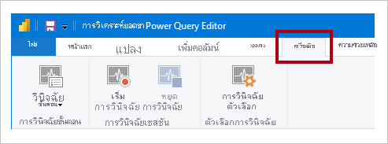

# <a name="monitor-report-performance-in-power-bi"></a><span data-ttu-id="90385-103">ตรวจสอบประสิทธิภาพของรายงานใน Power BI</span><span class="sxs-lookup"><span data-stu-id="90385-103">Monitor report performance in Power BI</span></span>

<span data-ttu-id="90385-104">ตรวจสอบประสิทธิภาพการทำงานของรายงานใน Power BI Desktop โดยใช้แอป [Power BI Premium Metrics](../admin/service-premium-metrics-app.md) และหาตำแหน่งที่ทีการทำงานระดับคอขวดและเรียนรู้วิธีการที่คุณจะสามารถปรับปรุงประสิทธิภาพการทำงานของรายงาน</span><span class="sxs-lookup"><span data-stu-id="90385-104">Monitor report performance in Power BI Desktop by using the [Power BI Premium Metrics app](../admin/service-premium-metrics-app.md), learn where the bottlenecks are, and learn how you can improve report performance.</span></span>

<span data-ttu-id="90385-105">การตรวจสอบประสิทธิภาพการทำงานเกี่ยวข้องกันในสถานการณ์ต่อไปนี้:</span><span class="sxs-lookup"><span data-stu-id="90385-105">Monitoring performance is relevant in the following situations:</span></span>

- <span data-ttu-id="90385-106">การรีเฟรชโมเดลข้อมูลการนำเข้าของคุณช้าลง</span><span class="sxs-lookup"><span data-stu-id="90385-106">Your Import data model refresh is slow.</span></span>
- <span data-ttu-id="90385-107">รายงาน DirectQuery หรือการเชื่อมต่อสดของคุณช้าลง</span><span class="sxs-lookup"><span data-stu-id="90385-107">Your DirectQuery or Live Connection reports are slow.</span></span>
- <span data-ttu-id="90385-108">การคำนวณแบบจำลองของคุณช้าลง</span><span class="sxs-lookup"><span data-stu-id="90385-108">Your model calculations are slow.</span></span>

<span data-ttu-id="90385-109">คิวรีที่ช้าหรือการแสดงผลด้วยภาพของรายงานควรมีเป้าหมายในการปรับให้เหมาะสมอย่างต่อเนื่อง</span><span class="sxs-lookup"><span data-stu-id="90385-109">Slow queries or report visuals should be a focal point of continued optimization.</span></span>

## <a name="use-query-diagnostics"></a><span data-ttu-id="90385-110">การวินิจฉัยคิวรี</span><span class="sxs-lookup"><span data-stu-id="90385-110">Use Query Diagnostics</span></span>

<span data-ttu-id="90385-111">ใช้[การวินิจฉัยคิวรี](/power-query/QueryDiagnostics)ใน Power BI Desktop เพื่อกำหนดว่า Power Query จะทำอะไรบ้างในขณะที่แสดงตัวอย่างหรือใช้คิวรี</span><span class="sxs-lookup"><span data-stu-id="90385-111">Use [Query Diagnostics](/power-query/QueryDiagnostics) in Power BI Desktop to determine what Power Query is doing when previewing or applying queries.</span></span> <span data-ttu-id="90385-112">นอกจากนี้ ให้ใช้ฟังก์ชัน _วินิจฉัยขั้นตอน_ เพื่อบันทึกข้อมูลการประเมินผลโดยละเอียดสำหรับแต่ละขั้นตอนคิวรี</span><span class="sxs-lookup"><span data-stu-id="90385-112">Further, use the _Diagnose Step_ function to record detailed evaluation information for each query step.</span></span> <span data-ttu-id="90385-113">ผลลัพธ์จะมีให้ใช้งานใน Power Query และคุณสามารถใช้การแปลงข้อมูลเพื่อทำความเข้าใจการดำเนินการคิวรีได้ดียิ่งขึ้น</span><span class="sxs-lookup"><span data-stu-id="90385-113">The results are made available in a Power Query, and you can apply transformations to better understand query execution.</span></span>

> [!NOTE]
> <span data-ttu-id="90385-114">การวินิจฉัยคิวรีเป็นฟีเจอร์แสดงตัวอย่าง ดังนั้นคุณต้องเปิดใช้งานใน _ตัวเลือกและการตั้งค่า_</span><span class="sxs-lookup"><span data-stu-id="90385-114">Query Diagnostics is currently a preview feature, and so you must enable it in _Options and Settings_.</span></span> <span data-ttu-id="90385-115">เมื่อเปิดใช้งาน คำสั่งจะพร้อมใช้งานในหน้าต่างตัวแก้ไข Power Query บนแท็บ ribbon **เครื่องมือ**</span><span class="sxs-lookup"><span data-stu-id="90385-115">Once enabled, its commands are available in the Power Query Editor window, on the **Tools** ribbon tab.</span></span>



## <a name="use-performance-analyzer"></a><span data-ttu-id="90385-117">ใช้ตัววิเคราะห์ประสิทธิภาพ</span><span class="sxs-lookup"><span data-stu-id="90385-117">Use Performance Analyzer</span></span>

<span data-ttu-id="90385-118">ใช้[ตัววิเคราะห์ประสิทธิภาพ](../create-reports/desktop-performance-analyzer.md)ใน Power BI Desktop เพื่อดูว่าแต่ละองค์ประกอบรายงานของคุณเช่น การแสดงผลด้วยภาพและสูตร DAX กำลังทำอะไรอยู่</span><span class="sxs-lookup"><span data-stu-id="90385-118">Use [Performance Analyzer](../create-reports/desktop-performance-analyzer.md) in Power BI Desktop to find out how each of your report elements—such as visuals and DAX formulas—are doing.</span></span> <span data-ttu-id="90385-119">ซึ่งเป็นประโยชน์โดยเฉพาะอย่างยิ่งในการตรวจสอบว่าเป็นคิวรีหรือการแสดงผลด้วยภาพที่มีการรองรับปัญหาด้านประสิทธิภาพการทำงาน</span><span class="sxs-lookup"><span data-stu-id="90385-119">It's especially useful to determine whether it's the query or visual rendering that's contributing to performance issues.</span></span>

## <a name="use-sql-server-profiler"></a><span data-ttu-id="90385-120">ใช้ตัวสร้างโพรไฟล์ของเซิร์ฟเวอร์ SQL</span><span class="sxs-lookup"><span data-stu-id="90385-120">Use SQL Server Profiler</span></span>

<span data-ttu-id="90385-121">คุณยังสามารถใช้[ตัวสร้างโพรไฟล์ของเซิร์ฟเวอร์ SQL](/sql/tools/sql-server-profiler/sql-server-profiler) เพื่อระบุคิวรีที่ช้าได้</span><span class="sxs-lookup"><span data-stu-id="90385-121">You can also use [SQL Server Profiler](/sql/tools/sql-server-profiler/sql-server-profiler) to identify queries that are slow.</span></span>

> [!NOTE]
> <span data-ttu-id="90385-122">ตัวสร้างโพรไฟล์ของเซิร์ฟเวอร์ SQL มีให้ใช้งานเป็นส่วนหนึ่งของ [SQL Server Management Studio](/sql/ssms/download-sql-server-management-studio-ssms)</span><span class="sxs-lookup"><span data-stu-id="90385-122">SQL Server Profiler is available as part of [SQL Server Management Studio](/sql/ssms/download-sql-server-management-studio-ssms).</span></span>

<span data-ttu-id="90385-123">ใช้ตัวสร้างโพรไฟล์ของเซิร์ฟเวอร์ SQL เมื่อแหล่งข้อมูลของคุณเป็น:</span><span class="sxs-lookup"><span data-stu-id="90385-123">Use SQL Server Profiler when your data source is either:</span></span>

- <span data-ttu-id="90385-124">SQL Server</span><span class="sxs-lookup"><span data-stu-id="90385-124">SQL Server</span></span>
- <span data-ttu-id="90385-125">SQL Server Analysis Services</span><span class="sxs-lookup"><span data-stu-id="90385-125">SQL Server Analysis Services</span></span>
- <span data-ttu-id="90385-126">Azure Analysis Services</span><span class="sxs-lookup"><span data-stu-id="90385-126">Azure Analysis Services</span></span>

> [!CAUTION]
> <span data-ttu-id="90385-127">Power BI Desktop รองรับการเชื่อมต่อไปยังพอร์ตการวินิจฉัย</span><span class="sxs-lookup"><span data-stu-id="90385-127">Power BI Desktop supports connecting to a diagnostics port.</span></span> <span data-ttu-id="90385-128">พอร์ตการวินิจฉัยอนุญาตให้เครื่องมืออื่นๆ เชื่อมต่อและดำเนินการติดตามเพื่อการวินิจฉัยได้</span><span class="sxs-lookup"><span data-stu-id="90385-128">The diagnostic port allows for other tools to make connections to perform traces for diagnostic purposes.</span></span> <span data-ttu-id="90385-129">การเปลี่ยนแปลงใดๆ กับรูปแบบข้อมูล Power Desktop ไม่ได้รับการรองรับ</span><span class="sxs-lookup"><span data-stu-id="90385-129">Making any changes to the Power Desktop data model is not supported.</span></span> <span data-ttu-id="90385-130">การเปลี่ยนแปลงโมเดลข้อมูลอาจทำให้เกิดความเสียหายและการสูญหายของข้อมูล</span><span class="sxs-lookup"><span data-stu-id="90385-130">Changes to the data model may lead to corruption and data loss.</span></span>

<span data-ttu-id="90385-131">เมื่อต้องการสร้างการติดตามของตัวสร้างโพรไฟล์ของเซิร์ฟเวอร์ SQL ให้ทำตามคำแนะนำเหล่านี้:</span><span class="sxs-lookup"><span data-stu-id="90385-131">To create a SQL Server Profiler trace, follow these instructions:</span></span>

1. <span data-ttu-id="90385-132">เปิดรายงาน Power BI Desktop ของคุณ (เพื่อให้ง่ายต่อการค้นหาพอร์ตในขั้นตอนถัดไป และปิดรายงานอื่นๆ ที่เปิดอยู่)</span><span class="sxs-lookup"><span data-stu-id="90385-132">Open your Power BI Desktop report (so it will be easy to locate the port in the next step, close any other open reports).</span></span>
1. <span data-ttu-id="90385-133">หากต้องการกำหนดพอร์ตที่ใช้โดย Power BI Desktop ใน PowerShell (พร้อมสิทธิ์ผู้ดูแลระบบ) หรือที่พร้อมท์คำสั่ง  ให้ป้อนคำสั่งต่อไปนี้:</span><span class="sxs-lookup"><span data-stu-id="90385-133">To determine the port being used by Power BI Desktop, in PowerShell (with administrator privileges), or at the Command Prompt, enter the following command:</span></span>
    ```powershell
    netstat -b -n
    ```
    <span data-ttu-id="90385-134">ผลลัพธ์ควรเป็นรายการของแอปพลิเคชันและพอร์ตที่เปิด ตัวอย่างเช่น:</span><span class="sxs-lookup"><span data-stu-id="90385-134">The output will be a list of applications and their open ports.</span></span> <span data-ttu-id="90385-135">ค้นหาพอร์ตที่ใช้โดย **msmdsrv.exe** และบันทึกไว้ใช้ในภายหลัง</span><span class="sxs-lookup"><span data-stu-id="90385-135">Look for the port used by **msmdsrv.exe**, and record it for later use.</span></span> <span data-ttu-id="90385-136">นี่คืออินสแตนซ์ของ Power BI Desktop ของคุณ</span><span class="sxs-lookup"><span data-stu-id="90385-136">It's your instance of Power BI Desktop.</span></span>
1. <span data-ttu-id="90385-137">เชื่อมต่อตัวสร้างโพรไฟล์ของเซิร์ฟเวอร์ SQL ไปยัง Power BI Desktop</span><span class="sxs-lookup"><span data-stu-id="90385-137">To connect SQL Server Profiler to your Power BI Desktop report:</span></span>
    1. <span data-ttu-id="90385-138">ใช้ตัวสร้างโพรไฟล์ของเซิร์ฟเวอร์ SQL</span><span class="sxs-lookup"><span data-stu-id="90385-138">Open SQL Server Profiler.</span></span>
    1. <span data-ttu-id="90385-139">ในตัวสร้างโพรไฟล์ของเซิร์ฟเวอร์ SQL บนเมนู _ไฟล์_ ให้เลือก _การติดตามใหม่_</span><span class="sxs-lookup"><span data-stu-id="90385-139">In SQL Server Profiler, on the _File_ menu, select _New Trace_.</span></span>
    1. <span data-ttu-id="90385-140">สำหรับ **ชนิดเซิร์ฟเวอร์** ให้เลือก _บริการวิเคราะห์_</span><span class="sxs-lookup"><span data-stu-id="90385-140">For **Server Type**, select _Analysis Services_.</span></span>
    1. <span data-ttu-id="90385-141">สำหรับ **ชื่อเซิร์ฟเวอร์** ให้ป้อน _localhost: [พอร์ตที่บันทึกไว้ก่อนหน้านี้]_</span><span class="sxs-lookup"><span data-stu-id="90385-141">For **Server Name**, enter _localhost:[port recorded earlier]_.</span></span>
    1. <span data-ttu-id="90385-142">คลิก _เรียกใช้_ – ตอนนี้การติดตามของตัวสร้างโพรไฟล์ของเซิร์ฟเวอร์ SQL นั้นยังทำงานอยู่และกำลังสร้างโพรไฟล์คิวรี Power BI Desktop อย่างต่อเนื่อง</span><span class="sxs-lookup"><span data-stu-id="90385-142">Click _Run_—now the SQL Server Profiler trace is live, and is actively profiling Power BI Desktop queries.</span></span>
1. <span data-ttu-id="90385-143">เมื่อดำเนินการคิวรี Power BI Desktop คุณจะเห็นระยะเวลาและเวลาของ CPU ที่เกี่ยวข้อง</span><span class="sxs-lookup"><span data-stu-id="90385-143">As Power BI Desktop queries are executed, you'll see their respective durations and CPU times.</span></span> <span data-ttu-id="90385-144">โดยขึ้นอยู่กับชนิดแหล่งข้อมูล คุณอาจเห็นเหตุการณ์อื่นๆ ที่ระบุวิธีดำเนินการคิวรี</span><span class="sxs-lookup"><span data-stu-id="90385-144">Depending on the data source type, you may see other events indicating how the query was executed.</span></span> <span data-ttu-id="90385-145">โดยการใช้ข้อมูลนี้ คุณสามารถกำหนดว่าคิวรีใดที่เป็นระดับคอขวดได้</span><span class="sxs-lookup"><span data-stu-id="90385-145">Using this information, you can determine which queries are the bottlenecks.</span></span>

<span data-ttu-id="90385-146">ประโยชน์ของการใช้ตัวสร้างโพรไฟล์ของเซิร์ฟเวอร์ SQL คือคุณสามารถบันทึกการติดตามฐานข้อมูลเซิร์ฟเวอร์ SQL (เชิงสัมพันธ์) ได้</span><span class="sxs-lookup"><span data-stu-id="90385-146">A benefit of using SQL Server Profiler is that it's possible to save a SQL Server (relational) database trace.</span></span> <span data-ttu-id="90385-147">การติดตามสามารถเป็นข้อมูลป้อนเข้าไปยัง[โปรแกรมช่วยแนะนำการปรับแต่งกลไกจัดการฐานข้อมูล](/sql/relational-databases/performance/start-and-use-the-database-engine-tuning-advisor)ได้</span><span class="sxs-lookup"><span data-stu-id="90385-147">The trace can become an input to the [Database Engine Tuning Advisor](/sql/relational-databases/performance/start-and-use-the-database-engine-tuning-advisor).</span></span> <span data-ttu-id="90385-148">ด้วยวิธีนี้ คุณจะได้รับคำแนะนำเกี่ยวกับวิธีการปรับแต่งแหล่งข้อมูลของคุณ</span><span class="sxs-lookup"><span data-stu-id="90385-148">This way, you can receive recommendations on how to tune your data source.</span></span>

## <a name="monitor-premium-metrics"></a><span data-ttu-id="90385-149">ตรวจสอบเมตริกพรีเมี่ยม</span><span class="sxs-lookup"><span data-stu-id="90385-149">Monitor Premium metrics</span></span>

<span data-ttu-id="90385-150">สำหรับความจุ Power BI Premium คุณสามารถใช้ **แอปเมตริก Power BI Premium** เพื่อจัดการประสิทธิภาพและความจุของการสมัครใช้งาน Power BI Premium ของคุณได้</span><span class="sxs-lookup"><span data-stu-id="90385-150">For Power BI Premium capacities, use the **Power BI Premium Metrics app** to monitor the health and capacity of your Power BI Premium subscription.</span></span> <span data-ttu-id="90385-151">สำหรับข้อมูลเพิ่มเติม ให้ดู[แอปเมตริก Power BI Premium](../admin/service-premium-metrics-app.md)</span><span class="sxs-lookup"><span data-stu-id="90385-151">For more information, see [Power BI Premium Metrics app](../admin/service-premium-metrics-app.md).</span></span>

## <a name="next-steps"></a><span data-ttu-id="90385-152">ขั้นตอนถัดไป</span><span class="sxs-lookup"><span data-stu-id="90385-152">Next steps</span></span>

<span data-ttu-id="90385-153">สำหรับข้อมูลเพิ่มเติมเกี่ยวกับบทความนี้ โปรดดูทรัพยากรต่อไปนี้:</span><span class="sxs-lookup"><span data-stu-id="90385-153">For more information about this article, check out the following resources:</span></span>

- [<span data-ttu-id="90385-154">การวินิจฉัยแบบคิวรี</span><span class="sxs-lookup"><span data-stu-id="90385-154">Query Diagnostics</span></span>](/power-query/QueryDiagnostics)
- [<span data-ttu-id="90385-155">ตัววิเคราะห์ประสิทธิภาพ</span><span class="sxs-lookup"><span data-stu-id="90385-155">Performance Analyzer</span></span>](../create-reports/desktop-performance-analyzer.md)
- [<span data-ttu-id="90385-156">วิธีแก้ไขปัญหาประสิทธิภาพของรายงานใน Power BI</span><span class="sxs-lookup"><span data-stu-id="90385-156">Troubleshoot report performance in Power BI</span></span>](report-performance-troubleshoot.md)
- [<span data-ttu-id="90385-157">แอปเมตริก Power BI Premium</span><span class="sxs-lookup"><span data-stu-id="90385-157">Power BI Premium Metrics app</span></span>](../admin/service-premium-metrics-app.md)
- <span data-ttu-id="90385-158">มีคำถามหรือไม่</span><span class="sxs-lookup"><span data-stu-id="90385-158">Questions?</span></span> [<span data-ttu-id="90385-159">ลองถามชุมชน Power BI</span><span class="sxs-lookup"><span data-stu-id="90385-159">Try asking the Power BI Community</span></span>](https://community.powerbi.com/)
- <span data-ttu-id="90385-160">มีข้อเสนอแนะไหม</span><span class="sxs-lookup"><span data-stu-id="90385-160">Suggestions?</span></span> [<span data-ttu-id="90385-161">สนับสนุนแนวคิดในการปรับปรุง Power BI</span><span class="sxs-lookup"><span data-stu-id="90385-161">Contribute ideas to improve Power BI</span></span>](https://ideas.powerbi.com/)
