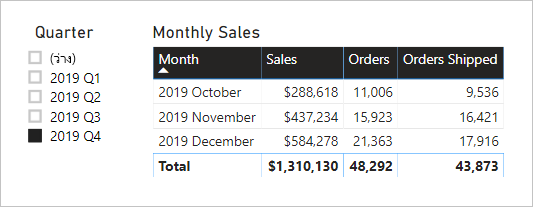

# <a name="active-vs-inactive-relationship-guidance"></a><span data-ttu-id="35ab1-103">คำแนะนำความสัมพันธ์ที่ใช้งานอยู่และไม่ได้ใช้งาน</span><span class="sxs-lookup"><span data-stu-id="35ab1-103">Active vs inactive relationship guidance</span></span>

<span data-ttu-id="35ab1-104">บทความนี้มุ่งเป้าหมายไปที่เรื่อง ตัวสร้างแบบจำลองข้อมูลนำเข้าที่ทำงานกับ Power BI Desktop</span><span class="sxs-lookup"><span data-stu-id="35ab1-104">This article targets you as a data modeler working with Power BI Desktop.</span></span> <span data-ttu-id="35ab1-105">ซึ่งจะให้คำแนะนำคุณเกี่ยวกับเวลาที่จะสร้างความสัมพันธ์ของรูปแบบที่ใช้งานอยู่หรือไม่ได้ใช้งาน</span><span class="sxs-lookup"><span data-stu-id="35ab1-105">It provides you with guidance on when to create active or inactive model relationships.</span></span> <span data-ttu-id="35ab1-106">ตามค่าเริ่มต้น ความสัมพันธ์ที่ใช้งานอยู่จะเผยแพร่ตัวกรองไปยังตารางอื่น</span><span class="sxs-lookup"><span data-stu-id="35ab1-106">By default, active relationships propagate filters to other tables.</span></span> <span data-ttu-id="35ab1-107">อย่างไรก็ตามความสัมพันธ์ที่ไม่ได้ใช้งานจะเผยแพร่เฉพาะตัวกรองเมื่อมีการเรียกใช้งานนิพจน์ DAX</span><span class="sxs-lookup"><span data-stu-id="35ab1-107">Inactive relationship, however, only propagate filters when a DAX expression activates (uses) the relationship.</span></span>

[!INCLUDE [relationships-prerequisite-reading](includes/relationships-prerequisite-reading.md)]

## <a name="active-relationships"></a><span data-ttu-id="35ab1-108">ความสัมพันธ์ที่ไม่ได้ใช้งาน</span><span class="sxs-lookup"><span data-stu-id="35ab1-108">Active relationships</span></span>

<span data-ttu-id="35ab1-109">โดยทั่วไป เราขอแนะนำให้กำหนดความสัมพันธ์ที่ใช้งานอยู่เมื่อใดก็ตามที่ทำได้</span><span class="sxs-lookup"><span data-stu-id="35ab1-109">Generally, we recommend defining active relationships whenever possible.</span></span> <span data-ttu-id="35ab1-110">โดยจะขยายขอบเขตและศักยภาพของวิธีที่คุณสามารถใช้แบบจำลองของคุณโดยผู้เขียนรายงานและการทำงานกับการถามตอบ</span><span class="sxs-lookup"><span data-stu-id="35ab1-110">They widen the scope and potential of how your model can be used by report authors, and users working with Q&A.</span></span>

<span data-ttu-id="35ab1-111">พิจารณาตัวอย่างของแบบจำลองการนำเข้าที่ออกแบบมาเพื่อวิเคราะห์ประสิทธิภาพการทำงานตามเวลาของเที่ยวบิน (OTP)</span><span class="sxs-lookup"><span data-stu-id="35ab1-111">Consider an example of an Import model designed to analyze airline flight on-time performance (OTP).</span></span> <span data-ttu-id="35ab1-112">แบบจำลองมีตาราง **เที่ยวบิน** ซึ่งเป็นตารางชนิดข้อเท็จจริงที่จัดเก็บหนึ่งแถวต่อตัวเที่ยวบิน</span><span class="sxs-lookup"><span data-stu-id="35ab1-112">The model has a **Flight** table, which is a fact-type table storing one row per flight.</span></span> <span data-ttu-id="35ab1-113">แต่ละแถวจะบันทึกวันที่เที่ยวบินหมายเลขเที่ยวบิน การออกเดินทาง สนามบินขาเข้า และเวลาล่าช้า (เป็นนาที)</span><span class="sxs-lookup"><span data-stu-id="35ab1-113">Each row records the flight date, flight number, departure and arrival airports, and any delay time (in minutes).</span></span> <span data-ttu-id="35ab1-114">นอกจากนี้ยังมีตาราง **สนามบิน** ซึ่งเป็นตารางชนิดมิติที่จัดเก็บหนึ่งแถวต่อสนามบิน</span><span class="sxs-lookup"><span data-stu-id="35ab1-114">There's also an **Airport** table, which is a dimension-type table storing one row per airport.</span></span> <span data-ttu-id="35ab1-115">แต่ละแถวจะอธิบายรหัสสนามบิน ชื่อสนามบิน และประเทศ</span><span class="sxs-lookup"><span data-stu-id="35ab1-115">Each row describes the airport code, airport name, and the country.</span></span>

<span data-ttu-id="35ab1-116">นี่คือไดอะแกรมแบบจำลองบางส่วนของสองตาราง</span><span class="sxs-lookup"><span data-stu-id="35ab1-116">Here's a partial model diagram of the two tables.</span></span>


<span data-ttu-id="35ab1-119">มีสองความสัมพันธ์แบบจำลองระหว่างตาราง **เที่ยวบิน** และ **สนามบิน**</span><span class="sxs-lookup"><span data-stu-id="35ab1-119">There are two model relationships between the **Flight** and **Airport** tables.</span></span> <span data-ttu-id="35ab1-120">ในตาราง **เที่ยวบิน** คอลัมน์ **DepartureAirport** และ **ArrivalAirport** เชื่อมโยงกับคอลัมน์ **สนามบิน** ของตาราง **สนามบิน**</span><span class="sxs-lookup"><span data-stu-id="35ab1-120">In the **Flight** table, the **DepartureAirport** and **ArrivalAirport** columns relate to the **Airport** column of the **Airport** table.</span></span> <span data-ttu-id="35ab1-121">ในการออกแบบ schema ของดาว ตาราง **สนามบิน** ได้รับการอธิบายเป็น [มิติการเล่นตามบทบาท](star-schema.md#role-playing-dimensions)</span><span class="sxs-lookup"><span data-stu-id="35ab1-121">In star schema design, the **Airport** table is described as a [role-playing dimension](star-schema.md#role-playing-dimensions).</span></span> <span data-ttu-id="35ab1-122">ในแบบจำลองนี้ บทบาททั้งสองคือ _สนามบินขาออก_ และ _สนามบินขาเข้า_</span><span class="sxs-lookup"><span data-stu-id="35ab1-122">In this model, the two roles are _departure airport_ and _arrival airport_.</span></span>

<span data-ttu-id="35ab1-123">ในขณะที่การออกแบบนี้ทำงานได้ดีสำหรับการออกแบบ schema ดาวเชิงสัมพันธ์ซึ่งไม่ใช่สำหรับแบบจำลอง Power BI</span><span class="sxs-lookup"><span data-stu-id="35ab1-123">While this design works well for relational star schema designs, it doesn't for Power BI models.</span></span> <span data-ttu-id="35ab1-124">เนื่องจากความสัมพันธ์แบบจำลองคือเส้นทางสำหรับการเผยแพร่ตัวกรองและเส้นทางเหล่านี้ต้องเป็นแบบเชิงกำหนด</span><span class="sxs-lookup"><span data-stu-id="35ab1-124">It's because model relationships are paths for filter propagation, and these paths must be deterministic.</span></span> <span data-ttu-id="35ab1-125">ด้วยเหตุนี้ แบบจำลองไม่สามารถมีความสัมพันธ์ที่ใช้งานอยู่ระหว่างสองตารางได้</span><span class="sxs-lookup"><span data-stu-id="35ab1-125">For this reason, a model cannot have multiple active relationships between two tables.</span></span> <span data-ttu-id="35ab1-126">ดังนั้น ตามที่อธิบายไว้ในตัวอย่างนี้ นั่นคือความสัมพันธ์ที่ใช้งานอยู่ในขณะที่ความสัมพันธ์อื่นไม่ได้ใช้งานอยู่ (แสดงเป็นเส้นประ)</span><span class="sxs-lookup"><span data-stu-id="35ab1-126">Therefore—as described in this example—one relationship is active while the other is inactive (represented by the dashed line).</span></span> <span data-ttu-id="35ab1-127">โดยเฉพาะจะมีความสัมพันธ์กับคอลัมน์ **ArrivalAirport** ที่ใช้งานอยู่</span><span class="sxs-lookup"><span data-stu-id="35ab1-127">Specifically, it's the relationship to the **ArrivalAirport** column that's active.</span></span> <span data-ttu-id="35ab1-128">ซึ่งหมายความว่าตัวกรองที่นำไปใช้กับตาราง **สนามบิน** จะเผยแพร่ไปยังคอลัมน์ **ArrivalAirport** ของตาราง **เที่ยวบิน** โดยอัตโนมัติ</span><span class="sxs-lookup"><span data-stu-id="35ab1-128">This means filters applied to the **Airport** table automatically propagate to the **ArrivalAirport** column of the **Flight** table.</span></span>

<span data-ttu-id="35ab1-129">การออกแบบแบบจำลองนี้มีขีดจำกัดที่รุนแรงเกี่ยวกับวิธีการรายงานข้อมูล</span><span class="sxs-lookup"><span data-stu-id="35ab1-129">This model design imposes severe limitations on how the data can be reported.</span></span> <span data-ttu-id="35ab1-130">โดยเฉพาะไม่สามารถกรองตาราง **สนามบิน** เพื่อแยกรายละเอียดเที่ยวบินสำหรับสนามบินต้นทางโดยอัตโนมัติได้</span><span class="sxs-lookup"><span data-stu-id="35ab1-130">Specifically, it's not possible to filter the **Airport** table to automatically isolate flight details for a departure airport.</span></span> <span data-ttu-id="35ab1-131">ในฐานะที่เป็นข้อกำหนดในการรายงานที่เกี่ยวข้องกับการกรอง (หรือการจัดกลุ่ม) โดยสนามบินขาออกและขาเข้า _ในเวลาเดียวกัน_ ความสัมพันธ์ที่ใช้งานอยู่ทั้สองอย่างจึงจำเป็น</span><span class="sxs-lookup"><span data-stu-id="35ab1-131">As reporting requirements involve filtering (or grouping) by departure and arrival airports _at the same time_, two active relationships are needed.</span></span> <span data-ttu-id="35ab1-132">การแปลข้อกำหนดนี้ลงในการออกแบบแบบจำลอง Power BI หมายความว่าแบบจำลองจะต้องมีตารางสนามบินสองตาราง</span><span class="sxs-lookup"><span data-stu-id="35ab1-132">Translating this requirement into a Power BI model design means the model must have two airport tables.</span></span>

<span data-ttu-id="35ab1-133">นี่คือการออกแบบแบบจำลองที่ได้รับการปรับปรุงแล้ว</span><span class="sxs-lookup"><span data-stu-id="35ab1-133">Here's the improved model design.</span></span>


<span data-ttu-id="35ab1-135">แบบจำลองนี้มีตารางสนามบินสองตาราง: **สนามบินขาออก** และ **สนามบินขาเข้า**</span><span class="sxs-lookup"><span data-stu-id="35ab1-135">The model now has two airport tables: **Departure Airport** and **Arrival Airport**.</span></span> <span data-ttu-id="35ab1-136">ความสัมพันธ์แบบจำลองระหว่างตารางเหล่านี้กับตาราง **เที่ยวบิน** มีการใช้งานอยู่</span><span class="sxs-lookup"><span data-stu-id="35ab1-136">The model relationships between these tables and the **Flight** table are active.</span></span> <span data-ttu-id="35ab1-137">นอกจากนี้โปรดทราบว่าชื่อคอลัมน์ในตาราง **สนามบินขาออก** และ **สนามบินที่ขาเข้า** จะถูกขึ้นต้นด้วยคำว่า _ขาออก_ หรือ _ขาเข้า_</span><span class="sxs-lookup"><span data-stu-id="35ab1-137">Notice also that the column names in the **Departure Airport** and **Arrival Airport** tables are prefixed with the word _Departure_ or _Arrival_.</span></span>

<span data-ttu-id="35ab1-138">การออกแบบแบบจำลองที่ได้รับการปรับปรุงรองรับการสร้างการออกแบบรายงานต่อไปนี้</span><span class="sxs-lookup"><span data-stu-id="35ab1-138">The improved model design supports producing the following report design.</span></span>


<span data-ttu-id="35ab1-141">ตัวกรองหน้ารายงานโดยเมลเบิร์นเป็นสนามบินขาออกและกลุ่มการแสดงผลด้วยภาพของตารางโดยสนามบินขาเข้า</span><span class="sxs-lookup"><span data-stu-id="35ab1-141">The report page filters by Melbourne as the departure airport, and the table visual groups by arrival airports.</span></span>

> [!NOTE]
> <span data-ttu-id="35ab1-142">สำหรับแบบจำลองที่นำเข้า ตารางเพิ่มเติมจะส่งผลให้มีขนาดแบบจำลองที่เพิ่มขึ้นและเวลารีเฟรชที่นานขึ้น</span><span class="sxs-lookup"><span data-stu-id="35ab1-142">For Import models, the additional table has resulted in an increased model size, and longer refresh times.</span></span> <span data-ttu-id="35ab1-143">ดังนั้นจึงขัดต่อคำแนะนำที่อธิบายไว้ในบทความ[เทคนิคการลดข้อมูลสำหรับการนำเข้าแบบจำลอง](import-modeling-data-reduction.md)</span><span class="sxs-lookup"><span data-stu-id="35ab1-143">As such, it contradicts the recommendations described in the [Data reduction techniques for Import modeling](import-modeling-data-reduction.md) article.</span></span> <span data-ttu-id="35ab1-144">อย่างไรก็ตาม ในตัวอย่าง ข้อกำหนดในการมีเฉพาะความสัมพันธ์ที่ใช้งานอยู่จะแทนที่คำแนะนำเหล่านี้</span><span class="sxs-lookup"><span data-stu-id="35ab1-144">However, in the example, the requirement to have only active relationships overrides these recommendations.</span></span>
>
> <span data-ttu-id="35ab1-145">นอกจากนี้ เป็นเรื่องปกติที่ตารางชนิดมิติประกอบด้วยจำนวนแถวต่ำเมื่อเทียบกับจำนวนแถวตารางชนิดข้อเท็จจริง</span><span class="sxs-lookup"><span data-stu-id="35ab1-145">Further, it's common that dimension-type tables contain low row counts relative to fact-type table row counts.</span></span> <span data-ttu-id="35ab1-146">ดังนั้น ขนาดของแบบจำลองที่เพิ่มขึ้นและเวลาการรีเฟรชไม่น่าจะมีขนาดใหญ่เกินไป</span><span class="sxs-lookup"><span data-stu-id="35ab1-146">So, the increased model size and refresh times aren't likely to be excessively large.</span></span>

### <a name="refactoring-methodology"></a><span data-ttu-id="35ab1-147">วิธีการ Refactoring</span><span class="sxs-lookup"><span data-stu-id="35ab1-147">Refactoring methodology</span></span>

<span data-ttu-id="35ab1-148">ต่อไปนี้คือวิธีการปรับโครงสร้างแบบจำลองจากตารางชนิดมิติการเล่นตามบทบาทเดียวกับการออกแบบที่มี _หนึ่งตารางต่อบทบาท_</span><span class="sxs-lookup"><span data-stu-id="35ab1-148">Here's a methodology to refactor a model from a single role-playing dimension-type table, to a design with _one table per role_.</span></span>

1. <span data-ttu-id="35ab1-149">นำความสัมพันธ์ที่ไม่ได้ใช้งานออก</span><span class="sxs-lookup"><span data-stu-id="35ab1-149">Remove any inactive relationships.</span></span>
2. <span data-ttu-id="35ab1-150">พิจารณาเปลี่ยนชื่อตารางชนิดมิติการเล่นตามบทบาทเพื่ออธิบายบทบาทนั้นๆ ให้ดียิ่งขึ้น</span><span class="sxs-lookup"><span data-stu-id="35ab1-150">Consider renaming the role-playing dimension-type table to better describe its role.</span></span> <span data-ttu-id="35ab1-151">ในตัวอย่าง ตาราง **สนามบิน** จะเชื่อมโยงกับคอลัมน์ **ArrivalAirport** ของตาราง **เที่ยวบิน** ดังนั้นจึงถูกเปลี่ยนชื่อเป็น **สนามบินขาเข้า**</span><span class="sxs-lookup"><span data-stu-id="35ab1-151">In the example, the **Airport** table is related to the **ArrivalAirport** column of the **Flight** table, so it's renamed as **Arrival Airport**.</span></span>
3. <span data-ttu-id="35ab1-152">สร้างสำเนาของตารางการเล่นบทบาทให้มีชื่อที่แสดงถึงบทบาท</span><span class="sxs-lookup"><span data-stu-id="35ab1-152">Create a copy of the role-playing table, providing it with a name that reflects its role.</span></span> <span data-ttu-id="35ab1-153">ถ้าเป็นตารางนำเข้า เราขอแนะนำให้กำหนดตารางที่มีการคำนวณ</span><span class="sxs-lookup"><span data-stu-id="35ab1-153">If it's an Import table, we recommend defining a calculated table.</span></span> <span data-ttu-id="35ab1-154">ถ้าเป็นตาราง DirectQuery คุณสามารถทำซ้ำแบบสอบถาม Power Query ได้</span><span class="sxs-lookup"><span data-stu-id="35ab1-154">If it's a DirectQuery table, you can duplicate the Power Query query.</span></span>

    <span data-ttu-id="35ab1-155">ในตัวอย่าง ตาราง **สนามบินขาออก** ถูกสร้างขึ้นโดยใช้ข้อกำหนดตารางที่มีการคำนวณต่อไปนี้</span><span class="sxs-lookup"><span data-stu-id="35ab1-155">In the example, the **Departure Airport** table was created by using the following calculated table definition.</span></span>

    ```dax
    Departure Airport = 'Arrival Airport'
    ```

4. <span data-ttu-id="35ab1-156">สร้างความสัมพันธ์ที่ใช้งานอยู่เพื่อเชื่อมโยงตารางใหม่</span><span class="sxs-lookup"><span data-stu-id="35ab1-156">Create an active relationship to relate the new table.</span></span>
5. <span data-ttu-id="35ab1-157">พิจารณาเปลี่ยนชื่อคอลัมน์ในตารางเพื่อให้สะท้อนบทบาทของคอลัมน์ได้อย่างถูกต้อง</span><span class="sxs-lookup"><span data-stu-id="35ab1-157">Consider renaming the columns in the tables so they accurately reflect their role.</span></span> <span data-ttu-id="35ab1-158">ในตัวอย่าง คอลัมน์ทั้งหมดถูกขึ้นต้นด้วยคำว่า _ขาออก_ หรือ _ขาเข้า_</span><span class="sxs-lookup"><span data-stu-id="35ab1-158">In the example, all columns are prefixed with the word _Departure_ or _Arrival_.</span></span> <span data-ttu-id="35ab1-159">ชื่อเหล่านี้ทำให้มั่นใจได้ว่ารายงานการแสดงผลด้วยภาพจะมีป้ายชื่อที่อธิบายตัวเองและไม่ชัดเจน</span><span class="sxs-lookup"><span data-stu-id="35ab1-159">These names ensure report visuals, by default, will have self-describing and non-ambiguous labels.</span></span> <span data-ttu-id="35ab1-160">นอกจากนี้ยังปรับปรุงประสบการณ์การถามและตอบ ช่วยให้ผู้ใช้สามารถเขียนคำถามได้อย่างง่ายดาย</span><span class="sxs-lookup"><span data-stu-id="35ab1-160">It also improves the Q&A experience, allowing users to easily write their questions.</span></span>
6. <span data-ttu-id="35ab1-161">พิจารณาการเพิ่มคำอธิบายไปยังตารางการเล่นตามบทบาท</span><span class="sxs-lookup"><span data-stu-id="35ab1-161">Consider adding descriptions to role-playing tables.</span></span> <span data-ttu-id="35ab1-162">(ในบานหน้าต่าง **เขตข้อมูล** คำอธิบายจะปรากฏในคำแนะนำเครื่องมือเมื่อผู้เขียนรายงานเลื่อนเคอร์เซอร์ไปที่ตาราง) ด้วยวิธีนี้ คุณสามารถสื่อสารรายละเอียดการเผยแพร่ตัวกรองเพิ่มเติมใดๆ ก็ตามให้กับผู้เขียนรายงานของคุณได้</span><span class="sxs-lookup"><span data-stu-id="35ab1-162">(In the **Fields** pane, a description appears in a tooltip when a report author hovers their cursor over the table.) This way, you can communicate any additional filter propagation details to your report authors.</span></span>

## <a name="inactive-relationships"></a><span data-ttu-id="35ab1-163">ความสัมพันธ์ที่ไม่ได้ใช้งาน</span><span class="sxs-lookup"><span data-stu-id="35ab1-163">Inactive relationships</span></span>

<span data-ttu-id="35ab1-164">ในบางสถานการณ์ ความสัมพันธ์ที่ไม่ใช้งานจะสามารถตอบสนองความต้องการการรายงานพิเศษได้</span><span class="sxs-lookup"><span data-stu-id="35ab1-164">In specific circumstances, inactive relationships can address special reporting needs.</span></span>

<span data-ttu-id="35ab1-165">ตอนนี้เรามาพิจารณาความต้องการแบบจำลองและการรายงานที่แตกต่างกัน:</span><span class="sxs-lookup"><span data-stu-id="35ab1-165">Let's now consider different model and reporting requirements:</span></span>

- <span data-ttu-id="35ab1-166">แบบจำลองการขายประกอบด้วยตาราง **ยอดขาย** ที่มีสองคอลัมน์วันที่ดังนี้: **OrderDate** และ **ShipDate**</span><span class="sxs-lookup"><span data-stu-id="35ab1-166">A sales model contains a **Sales** table that has two date columns: **OrderDate** and **ShipDate**</span></span>
- <span data-ttu-id="35ab1-167">แต่ละแถวในตาราง **ยอดขาย** จะบันทึกคำสั่งเดียว</span><span class="sxs-lookup"><span data-stu-id="35ab1-167">Each row in the **Sales** table records a single order</span></span>
- <span data-ttu-id="35ab1-168">ตัวกรองวันที่จะถูกนำไปใช้กับคอลัมน์ **OrderDate** ซึ่งจะจัดเก็บวันที่ที่ถูกต้องเสมอ</span><span class="sxs-lookup"><span data-stu-id="35ab1-168">Date filters are almost always applied to the **OrderDate** column, which always stores a valid date</span></span>
- <span data-ttu-id="35ab1-169">เพียงหนึ่งหน่วยวัดเท่านั้นที่จำเป็นต้องมีการเผยแพร่ตัวกรองวันที่ไปยังคอลัมน์ **ShipDate** ซึ่งสามารถมีช่องว่างได้ (จนกว่าจะมีการจัดส่งรายการสั่งซื้อ)</span><span class="sxs-lookup"><span data-stu-id="35ab1-169">Only one measure requires date filter propagation to the **ShipDate** column, which can contain BLANKs (until the order is shipped)</span></span>
- <span data-ttu-id="35ab1-170">ไม่มีความต้องการในตัวกรอง (หรือจัดกลุ่มตาม) _และ_ ระยะเวลาการวันที่จัดส่งพร้อมกัน</span><span class="sxs-lookup"><span data-stu-id="35ab1-170">There's no requirement to simultaneously filter (or group by) order _and_ ship date periods</span></span>

<span data-ttu-id="35ab1-171">นี่คือไดอะแกรมแบบจำลองบางส่วนของสองตาราง</span><span class="sxs-lookup"><span data-stu-id="35ab1-171">Here's a partial model diagram of the two tables.</span></span>


<span data-ttu-id="35ab1-174">มีสองความสัมพันธ์แบบจำลองระหว่างตาราง **ยอดขาย** และ **วันที่**</span><span class="sxs-lookup"><span data-stu-id="35ab1-174">There are two model relationships between the **Sales** and **Date** tables.</span></span> <span data-ttu-id="35ab1-175">ในตาราง **ยอดขาย** คอลัมน์ **OrderDate** และ **ShipDate** คอลัมน์ที่เชื่อมโยงกับคอลัมน์ **วันที่** ของตาราง **วันที่**</span><span class="sxs-lookup"><span data-stu-id="35ab1-175">In the **Sales** table, the **OrderDate** and **ShipDate** columns relate to the **Date** column of the **Date** table.</span></span> <span data-ttu-id="35ab1-176">ในแบบจำลองนี้ บทบาทที่สองสำหรับตาราง **วันที่** เป็น _วันที่สั่งซื้อ_ และ _วันที่จัดส่ง_</span><span class="sxs-lookup"><span data-stu-id="35ab1-176">In this model, the two roles for the **Date** table are _order date_ and _ship date_.</span></span> <span data-ttu-id="35ab1-177">ซึ่งเป็นความสัมพันธ์กับคอลัมน์ **OrderDate** ที่ใช้งานอยู่</span><span class="sxs-lookup"><span data-stu-id="35ab1-177">It's the relationship to the **OrderDate** column that's active.</span></span>

<span data-ttu-id="35ab1-178">หน่วยวัดทั้งหกข้อยกเว้นหนึ่งรายการจะต้องถูกกรองโดยคอลัมน์ **OrderDate**</span><span class="sxs-lookup"><span data-stu-id="35ab1-178">All of the six measures—except one—must filter by the **OrderDate** column.</span></span> <span data-ttu-id="35ab1-179">หน่วยวัด **คำสั่งซื้อที่จัดส่งแล้ว** อย่างไรก็ตามต้องกรองโดยคอลัมน์ **ShipDate**</span><span class="sxs-lookup"><span data-stu-id="35ab1-179">The **Orders Shipped** measure, however, must filter by the **ShipDate** column.</span></span>

<span data-ttu-id="35ab1-180">นี่คือ **คำสั่งซื้อ** ของตัววัด</span><span class="sxs-lookup"><span data-stu-id="35ab1-180">Here's the **Orders** measure definition.</span></span> <span data-ttu-id="35ab1-181">เพียงแค่นับแถวของตาราง **ยอดขาย** ภายในบริบทตัวกรอง</span><span class="sxs-lookup"><span data-stu-id="35ab1-181">It simply counts the rows of the **Sales** table within the filter context.</span></span> <span data-ttu-id="35ab1-182">ตัวกรองใดๆ ที่ใช้กับตาราง **วันที่** จะเผยแพร่ไปยังคอลัมน์ **OrderDate**</span><span class="sxs-lookup"><span data-stu-id="35ab1-182">Any filters applied to the **Date** table will propagate to the **OrderDate** column.</span></span>

```dax
Orders = COUNTROWS(Sales)
```

<span data-ttu-id="35ab1-183">นี่คือ **คำสั่งซื้อที่จัดส่งแล้ว** ของตัววัด</span><span class="sxs-lookup"><span data-stu-id="35ab1-183">Here's the **Orders Shipped** measure definition.</span></span> <span data-ttu-id="35ab1-184">ซึ่งจะใช้ฟังก์ชัน[USERELATIONSHIP](/dax/userelationship-function-dax) DAX ซึ่งจะเปิดการเผยแพร่ตัวกรองสำหรับความสัมพันธ์เฉพาะในระหว่างการประเมินของนิพจน์เท่านั้น</span><span class="sxs-lookup"><span data-stu-id="35ab1-184">It uses the [USERELATIONSHIP](/dax/userelationship-function-dax) DAX function, which activates filter propagation for a specific relationship only during the evaluation of the expression.</span></span> <span data-ttu-id="35ab1-185">ในตัวอย่างนี้ ความสัมพันธ์กับคอลัมน์ **ShipDate** มีการใช้งานอยู่</span><span class="sxs-lookup"><span data-stu-id="35ab1-185">In this example, the relationship to the **ShipDate** column is used.</span></span>

```dax
Orders Shipped =
CALCULATE(
    COUNTROWS(Sales)
    ,USERELATIONSHIP('Date'[Date], Sales[ShipDate])
)
```

<span data-ttu-id="35ab1-186">การออกแบบแบบจำลองที่ได้รับการปรับปรุงรองรับการสร้างการออกแบบรายงานต่อไปนี้</span><span class="sxs-lookup"><span data-stu-id="35ab1-186">This model design supports producing the following report design.</span></span>



<span data-ttu-id="35ab1-189">ตัวกรองหน้ารายงานตามไตรมาสที่ 4 ปี 2019</span><span class="sxs-lookup"><span data-stu-id="35ab1-189">The report page filters by quarter 2019 Q4.</span></span> <span data-ttu-id="35ab1-190">กลุ่มการแสดงผลด้วยภาพตารางตามเดือนและแสดงสถิติการขายต่างๆ</span><span class="sxs-lookup"><span data-stu-id="35ab1-190">The table visual groups by month and displays various sales statistics.</span></span> <span data-ttu-id="35ab1-191">หน่วยวัด **คำสั่งซื้อ** และ **คำสั่งซื้อที่จัดส่งแล้ว** ให้ผลลัพธ์ที่แตกต่างกัน</span><span class="sxs-lookup"><span data-stu-id="35ab1-191">The **Orders** and **Orders Shipped** measures produce different results.</span></span> <span data-ttu-id="35ab1-192">โดยใช้ตรรกะการสรุปเดียวกัน (นับจำนวนแถวของตาราง **ยอดขาย**) แต่การเผยแพร่ตัวกรองตาราง **วันที่** แตกต่างกัน</span><span class="sxs-lookup"><span data-stu-id="35ab1-192">They each use the same summarization logic (count rows of the **Sales** table), but different **Date** table filter propagation.</span></span>

<span data-ttu-id="35ab1-193">โปรดสังเกตว่าตัวแบ่งส่วนข้อมูลไตรมาสมีรายการที่ว่างเปล่า</span><span class="sxs-lookup"><span data-stu-id="35ab1-193">Notice that the quarter slicer includes a BLANK item.</span></span> <span data-ttu-id="35ab1-194">รายการตัวแบ่งส่วนข้อมูลนี้จะปรากฏขึ้นมาเป็นผลลัพธ์ของ[การขยายตาราง](../transform-model/desktop-relationships-understand.md#regular-relationships)</span><span class="sxs-lookup"><span data-stu-id="35ab1-194">This slicer item appears as a result of [table expansion](../transform-model/desktop-relationships-understand.md#regular-relationships).</span></span> <span data-ttu-id="35ab1-195">ในขณะที่แถวของตาราง **ยอดขาย** แต่ละรายการมีวันที่สั่งซื้อ บางแถวมีวันที่จัดส่งที่ว่างเปล่า — คำสั่งซื้อเหล่านี้ยังไม่ได้รับการจัดส่ง</span><span class="sxs-lookup"><span data-stu-id="35ab1-195">While each **Sales** table row has an order date, some rows have a BLANK ship date—these orders are yet to be shipped.</span></span> <span data-ttu-id="35ab1-196">การขยายตารางพิจารณาความสัมพันธ์ที่ไม่ได้ใช้งานด้วยเช่นกัน ดังนั้นค่าว่างจึงสามารถปรากฏได้เนื่องจากมีค่าว่างในหลายๆ ด้านของความสัมพันธ์หรือเนื่องจากปัญหาความสมบูรณ์ของข้อมูล</span><span class="sxs-lookup"><span data-stu-id="35ab1-196">Table expansion considers inactive relationships too, and so BLANKs can appear due to BLANKs on the many-side of the relationship, or due to data integrity issues.</span></span>

## <a name="recommendations"></a><span data-ttu-id="35ab1-197">คำแนะนำ</span><span class="sxs-lookup"><span data-stu-id="35ab1-197">Recommendations</span></span>

<span data-ttu-id="35ab1-198">โดยทั่วไป เราขอแนะนำให้กำหนดความสัมพันธ์ที่ใช้งานอยู่เมื่อใดก็ตามที่ทำได้</span><span class="sxs-lookup"><span data-stu-id="35ab1-198">In summary, we recommend defining active relationships whenever possible.</span></span> <span data-ttu-id="35ab1-199">โดยจะขยายขอบเขตและศักยภาพของวิธีที่คุณสามารถใช้แบบจำลองของคุณโดยผู้เขียนรายงานและการทำงานกับการถามตอบ</span><span class="sxs-lookup"><span data-stu-id="35ab1-199">They widen the scope and potential of how your model can be used by report authors, and users working with Q&A.</span></span> <span data-ttu-id="35ab1-200">ซึ่งหมายความว่าตารางชนิดมิติการเล่นบทบาทจะถูกทำซ้ำในแบบจำลองของคุณ</span><span class="sxs-lookup"><span data-stu-id="35ab1-200">It means that role-playing dimension-type tables should be duplicated in your model.</span></span>

<span data-ttu-id="35ab1-201">ในบางสถานการณ์ อย่างไรก็ตาม คุณสามารถกำหนดความสัมพันธ์ที่ไม่ได้ใช้งานอย่างน้อยหนึ่งรายการสำหรับตารางชนิดมิติการเล่นบทบาทได้</span><span class="sxs-lookup"><span data-stu-id="35ab1-201">In specific circumstances, however, you can define one or more inactive relationships for a role-playing dimension-type table.</span></span> <span data-ttu-id="35ab1-202">คุณสามารถพิจารณาการออกแบบนี้ได้เมื่อ:</span><span class="sxs-lookup"><span data-stu-id="35ab1-202">You can consider  this design when:</span></span>

- <span data-ttu-id="35ab1-203">ไม่มีข้อกำหนดสำหรับการแสดงผลด้วยภาพเพื่อกรองตามบทบาทที่แตกต่างกัน</span><span class="sxs-lookup"><span data-stu-id="35ab1-203">There's no requirement for report visuals to simultaneously filter by different roles</span></span>
- <span data-ttu-id="35ab1-204">คุณใช้ฟังก์ชัน DAX USERELATIONSHIP เพื่อเปิดใช้งานความสัมพันธ์เฉพาะสำหรับการคำนวณแบบจำลองที่เกี่ยวข้อง</span><span class="sxs-lookup"><span data-stu-id="35ab1-204">You use the USERELATIONSHIP DAX function to activate a specific relationship for relevant model calculations</span></span>

## <a name="next-steps"></a><span data-ttu-id="35ab1-205">ขั้นตอนถัดไป</span><span class="sxs-lookup"><span data-stu-id="35ab1-205">Next steps</span></span>

<span data-ttu-id="35ab1-206">สำหรับข้อมูลเพิ่มเติมที่เกี่ยวข้องกับบทความนี้ โปรดดูทรัพยากรต่อไปนี้:</span><span class="sxs-lookup"><span data-stu-id="35ab1-206">For more information related to this article, check out the following resources:</span></span>

- [<span data-ttu-id="35ab1-207">ความสัมพันธ์ของแบบจำลองใน Power BI Desktop</span><span class="sxs-lookup"><span data-stu-id="35ab1-207">Model relationships in Power BI Desktop</span></span>](../transform-model/desktop-relationships-understand.md)
- [<span data-ttu-id="35ab1-208">ทำความเข้าใจแบบจำลองมิติที่มีลักษณะคล้ายดาวและความสำคัญที่มีต่อ Power BI</span><span class="sxs-lookup"><span data-stu-id="35ab1-208">Understand star schema and the importance for Power BI</span></span>](star-schema.md)
- [<span data-ttu-id="35ab1-209">คำแนะนำการแก้ไขปัญหาความสัมพันธ์</span><span class="sxs-lookup"><span data-stu-id="35ab1-209">Relationship troubleshooting guidance</span></span>](relationships-troubleshoot.md)
- <span data-ttu-id="35ab1-210">มีคำถามหรือไม่</span><span class="sxs-lookup"><span data-stu-id="35ab1-210">Questions?</span></span> [<span data-ttu-id="35ab1-211">ลองถามชุมชน Power BI</span><span class="sxs-lookup"><span data-stu-id="35ab1-211">Try asking the Power BI Community</span></span>](https://community.powerbi.com/)
- <span data-ttu-id="35ab1-212">มีข้อเสนอแนะไหม</span><span class="sxs-lookup"><span data-stu-id="35ab1-212">Suggestions?</span></span> [<span data-ttu-id="35ab1-213">สนับสนุนแนวคิดในการปรับปรุง Power BI</span><span class="sxs-lookup"><span data-stu-id="35ab1-213">Contribute ideas to improve Power BI</span></span>](https://ideas.powerbi.com/)
