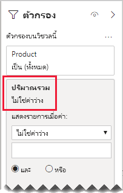

# <a name="bi-directional-relationship-guidance"></a><span data-ttu-id="5837b-103">คำแนะนำความสัมพันธ์แบบสองทิศทาง</span><span class="sxs-lookup"><span data-stu-id="5837b-103">Bi-directional relationship guidance</span></span>

<span data-ttu-id="5837b-104">บทความนี้มุ่งเป้าหมายไปที่เรื่อง ตัวสร้างแบบจำลองข้อมูลนำเข้าที่ทำงานกับ Power BI Desktop</span><span class="sxs-lookup"><span data-stu-id="5837b-104">This article targets you as a data modeler working with Power BI Desktop.</span></span> <span data-ttu-id="5837b-105">ซึ่งจะให้คำแนะนำแก่คุณว่าเวลาใดที่ควรสร้างแบบจำลองความสัมพันธ์แบบสองทิศทาง</span><span class="sxs-lookup"><span data-stu-id="5837b-105">It provides you with guidance on when to create bi-directional model relationships.</span></span> <span data-ttu-id="5837b-106">ความสัมพันธ์แบบสองทิศทางคือตัวกรองใน _ทั้งสองทิศทาง_</span><span class="sxs-lookup"><span data-stu-id="5837b-106">A bi-directional relationship is one that filters in _both directions_.</span></span>

[!INCLUDE [relationships-prerequisite-reading](includes/relationships-prerequisite-reading.md)]

<span data-ttu-id="5837b-107">โดยทั่วไปแล้ว เราขอแนะนำให้ลดการใช้ความสัมพันธ์แบบสองทิศทาง</span><span class="sxs-lookup"><span data-stu-id="5837b-107">Generally, we recommend minimizing the use of bi-directional relationships.</span></span> <span data-ttu-id="5837b-108">ซึ่งความสัมพันธ์สามารถส่งผลกระทบต่อประสิทธิภาพการทำงานของคิวรีแบบจำลอง และอาจสร้างความสับสนสำให้กับผู้ใช้รายงานของคุณ</span><span class="sxs-lookup"><span data-stu-id="5837b-108">They can negatively impact on model query performance, and possibly deliver confusing experiences for your report users.</span></span>

<span data-ttu-id="5837b-109">มีสามสถานการณ์สมมติเมื่อการกรองแบบสองทิศทางสามารถแก้ไขข้อกำหนดเฉพาะได้:</span><span class="sxs-lookup"><span data-stu-id="5837b-109">There are three scenarios when bi-directional filtering can solve specific requirements:</span></span>

- [<span data-ttu-id="5837b-110">ความสัมพันธ์แบบจำลองพิเศษ</span><span class="sxs-lookup"><span data-stu-id="5837b-110">Special model relationships</span></span>](#special-model-relationships)
- [<span data-ttu-id="5837b-111">รายการตัวแบ่งส่วนข้อมูล "ด้วยข้อมูล"</span><span class="sxs-lookup"><span data-stu-id="5837b-111">Slicer items "with data"</span></span>](#slicer-items-with-data)
- [<span data-ttu-id="5837b-112">การวิเคราะห์มิติไปยังมิติ</span><span class="sxs-lookup"><span data-stu-id="5837b-112">Dimension-to-dimension analysis</span></span>](#dimension-to-dimension-analysis)

## <a name="special-model-relationships"></a><span data-ttu-id="5837b-113">ความสัมพันธ์แบบจำลองพิเศษ</span><span class="sxs-lookup"><span data-stu-id="5837b-113">Special model relationships</span></span>

<span data-ttu-id="5837b-114">ความสัมพันธ์แบบสองทิศทางมีบทบาทสำคัญในการสร้างความสัมพันธ์แบบสองทิศทางรุ่นพิเศษสองประเภทดังต่อไปนี้:</span><span class="sxs-lookup"><span data-stu-id="5837b-114">Bi-directional relationships play an important role when creating the following two special model relationship types:</span></span>

- <span data-ttu-id="5837b-115">**แบบหนึ่งต่อหนึ่ง**: ความสัมพันธ์แบบหนึ่งต่อหนึ่งจะต้องเป็นแบบสองทิศทาง ซึ่งไม่สามารถกำหนดเป็นค่าอื่นได้</span><span class="sxs-lookup"><span data-stu-id="5837b-115">**One-to-one**: All one-to-one relationships must be bi-directional—it isn't possible to configure otherwise.</span></span> <span data-ttu-id="5837b-116">โดยทั่วไปแล้ว เราไม่แนะนำให้สร้างชนิดของความสัมพันธ์เหล่านี้</span><span class="sxs-lookup"><span data-stu-id="5837b-116">Generally, we don't recommend creating these types of relationships.</span></span> <span data-ttu-id="5837b-117">สำหรับการสนทนาที่สมบูรณ์และการออกแบบทางเลือก โปรดดู[คำแนะนำความสัมพันธ์แบบหนึ่งต่อหนึ่ง](relationships-one-to-one.md)</span><span class="sxs-lookup"><span data-stu-id="5837b-117">For a complete discussion and alternative designs, see [One-to-one relationship guidance](relationships-one-to-one.md).</span></span>
- <span data-ttu-id="5837b-118">**แบบกลุ่มต่อกลุ่ม**: จำเป็นต้องมีตารางเชื่อมโยงเมื่อเชื่อมโยงตารางประเภทมิติสองตารางเข้าด้วยกัน</span><span class="sxs-lookup"><span data-stu-id="5837b-118">**Many-to-many**: When relating two dimension-type tables, a bridging table is required.</span></span> <span data-ttu-id="5837b-119">จำเป็นต้องใช้ตัวกรองแบบสองทิศทางเพื่อให้แน่ใจว่าตัวกรองเผยแพร่ไปทั่วตารางการเชื่อมโยง</span><span class="sxs-lookup"><span data-stu-id="5837b-119">A bi-directional filter is required to ensure filters propagate across the bridging table.</span></span> <span data-ttu-id="5837b-120">สำหรับข้อมูลเพิ่มเติม โปรดดู[คำแนะนำความสัมพันธ์แบบกลุ่มต่อกลุ่ม (เชื่อมโยงตารางประเภทมิติสองตาราง)](relationships-many-to-many.md#relate-many-to-many-dimensions)</span><span class="sxs-lookup"><span data-stu-id="5837b-120">For more information, see [Many-to-many relationship guidance (Relate many-to-many dimensions)](relationships-many-to-many.md#relate-many-to-many-dimensions).</span></span>

## <a name="slicer-items-with-data"></a><span data-ttu-id="5837b-121">รายการตัวแบ่งส่วนข้อมูล "ด้วยข้อมูล"</span><span class="sxs-lookup"><span data-stu-id="5837b-121">Slicer items "with data"</span></span>

<span data-ttu-id="5837b-122">ความสัมพันธ์แบบสองทิศทางสามารถส่งตัวแบ่งส่วนข้อมูลที่จำกัดรายการไปยังตำแหน่งที่มีข้อมูลอยู่ได้</span><span class="sxs-lookup"><span data-stu-id="5837b-122">Bi-directional relationships can deliver slicers that limit items to where data exists.</span></span> <span data-ttu-id="5837b-123">(หากคุณคุ้นเคยกับ Excel PivotTables และตัวแบ่งส่วนข้อมูล นี่คือพฤติกรรมเริ่มต้นเมื่อทำการจัดหาข้อมูลจากชุดข้อมูล Power BI หรือแบบจำลองบริการการวิเคราะห์) เพื่อช่วยอธิบายให้เข้าใจความหมาย ก่อนอื่นให้พิจารณาไดอะแกรมแบบจำลองต่อไปนี้</span><span class="sxs-lookup"><span data-stu-id="5837b-123">(If you're familiar with Excel PivotTables and slicers, it's the default behavior when sourcing data from a Power BI dataset, or an Analysis Services model.) To help explain what it means, first consider the following model diagram.</span></span>


<span data-ttu-id="5837b-126">ตารางแรกที่มีชื่อว่า **ลูกค้า** ซึ่งมีสามคอลัมน์ดังต่อไปนี้: **ประเทศ-ภูมิภาค** **ลูกค้า** และ **CustomerCode**</span><span class="sxs-lookup"><span data-stu-id="5837b-126">The first table is named **Customer**, and it contains three columns: **Country-Region**, **Customer**, and **CustomerCode**.</span></span> <span data-ttu-id="5837b-127">ตารางที่สองที่มีชื่อว่า **ผลิตภัณฑ์** ซึ่งมีสามคอลัมน์ดังต่อไปนี้: **สี** **ผลิตภัณฑ์** และ **SKU**</span><span class="sxs-lookup"><span data-stu-id="5837b-127">The second table is named **Product**, and it contains three columns: **Color**, **Product**, and **SKU**.</span></span> <span data-ttu-id="5837b-128">ตารางที่สามชื่อว่า **ยอดขาย** ซึ่งมีสี่คอลัมน์ดังต่อไปนี้: **CustomerCode** **OrderDate** **Quantity** และ **SKU**</span><span class="sxs-lookup"><span data-stu-id="5837b-128">The third table is named **Sales**, and it contains four columns: **CustomerCode**, **OrderDate**, **Quantity**, and **SKU**.</span></span> <span data-ttu-id="5837b-129">ตาราง **ลูกค้า** และ **ผลิตภัณฑ์** เป็นตารางชนิดมิติและแต่ละรายการมีความสัมพันธ์แบบหนึ่งต่อกลุ่มไปยังตาราง **ยอดขาย**</span><span class="sxs-lookup"><span data-stu-id="5837b-129">The **Customer** and **Product** tables are dimension-type tables, and each has a one-to-many relationship to the **Sales** table.</span></span> <span data-ttu-id="5837b-130">แต่ละความสัมพันธ์จะกรองในทิศทางเดียว</span><span class="sxs-lookup"><span data-stu-id="5837b-130">Each relationship filters in a single direction.</span></span>

<span data-ttu-id="5837b-131">เพื่อช่วยอธิบายวิธีการกรองแบบสองทิศทาง ไดอะแกรมแบบจำลองได้รับการแก้ไขเพื่อแสดงแถวของตาราง</span><span class="sxs-lookup"><span data-stu-id="5837b-131">To help describe how bi-directional filtering works, the model diagram has been modified to reveal the table rows.</span></span> <span data-ttu-id="5837b-132">ตัวอย่างทั้งหมดในบทความนี้เป็นไปตามข้อมูลนี้</span><span class="sxs-lookup"><span data-stu-id="5837b-132">All examples in this article are based on this data.</span></span>

> [!NOTE]
> <span data-ttu-id="5837b-133">ไม่สามารถแสดงแถวตารางในไดอะแกรมแบบจำลอง Power BI Desktop ได้</span><span class="sxs-lookup"><span data-stu-id="5837b-133">It's not possible to display table rows in the Power BI Desktop model diagram.</span></span> <span data-ttu-id="5837b-134">การดำเนินการนี้จะทำในบทความนี้เพื่อสนับสนุนการสนทนาด้วยตัวอย่างที่ชัดเจน</span><span class="sxs-lookup"><span data-stu-id="5837b-134">It's done in this article to support the discussion with clear examples.</span></span>


<span data-ttu-id="5837b-137">รายละเอียดแถวสำหรับสามตารางอธิบายไว้ในหัวข้อย่อยต่อไปนี้:</span><span class="sxs-lookup"><span data-stu-id="5837b-137">The row details for the three tables are described in the following bulleted list:</span></span>

- <span data-ttu-id="5837b-138">ตาราง **Customer** มีสองแถว:</span><span class="sxs-lookup"><span data-stu-id="5837b-138">The **Customer** table has two rows:</span></span>
  - <span data-ttu-id="5837b-139">**CustomerCode** CUST-01 **Customer** Customer-1 **ประเทศ-ภูมิภาค** สหรัฐอเมริกา</span><span class="sxs-lookup"><span data-stu-id="5837b-139">**CustomerCode** CUST-01, **Customer** Customer-1, **Country-Region** United States</span></span>
  - <span data-ttu-id="5837b-140">**CustomerCode** CUST-02 **Customer** Customer-1 **ประเทศ-ภูมิภาค** ออสเตรเลีย</span><span class="sxs-lookup"><span data-stu-id="5837b-140">**CustomerCode** CUST-02, **Customer** Customer-2, **Country-Region** Australia</span></span>
- <span data-ttu-id="5837b-141">ตาราง **ผลิตภัณฑ์** มีสามแถว:</span><span class="sxs-lookup"><span data-stu-id="5837b-141">The **Product** table has three rows:</span></span>
  - <span data-ttu-id="5837b-142">**SKU** CL-01 **ผลิตภัณฑ์** เสื้อยืด **สี** เขียว</span><span class="sxs-lookup"><span data-stu-id="5837b-142">**SKU** CL-01, **Product** T-shirt, **Color** Green</span></span>
  - <span data-ttu-id="5837b-143">**SKU** CL-02 **ผลิตภัณฑ์** กางเกงยีนส์ **สี** น้ำเงิน</span><span class="sxs-lookup"><span data-stu-id="5837b-143">**SKU** CL-02, **Product** Jeans, **Color** Blue</span></span>
  - <span data-ttu-id="5837b-144">**SKU** AC-01 **ผลิตภัณฑ์** หมวก **สี** น้ำเงิน</span><span class="sxs-lookup"><span data-stu-id="5837b-144">**SKU** AC-01, **Product** Hat, **Color** Blue</span></span>
- <span data-ttu-id="5837b-145">ตาราง **ยอดขาย** มีสามแถวดังต่อไปนี้:</span><span class="sxs-lookup"><span data-stu-id="5837b-145">The **Sales** table has three rows:</span></span>
  - <span data-ttu-id="5837b-146">**OrderDate** 1 มกราคม 2019 **CustomerCode** CUST-01 **SKU** CL-01 **จำนวน** 10</span><span class="sxs-lookup"><span data-stu-id="5837b-146">**OrderDate** January 1 2019, **CustomerCode** CUST-01, **SKU** CL-01, **Quantity** 10</span></span>
  - <span data-ttu-id="5837b-147">**OrderDate** 2 กุมภาพันธ์ 2019 **CustomerCode** CUST-01 **SKU** CL-02 **จำนวน** 20</span><span class="sxs-lookup"><span data-stu-id="5837b-147">**OrderDate** February 2 2019, **CustomerCode** CUST-01, **SKU** CL-02, **Quantity** 20</span></span>
  - <span data-ttu-id="5837b-148">**OrderDate** 3 มีนาคม 2019 **CustomerCode** CUST-02 **SKU** CL-01 **จำนวน** 30</span><span class="sxs-lookup"><span data-stu-id="5837b-148">**OrderDate** March 3 2019, **CustomerCode** CUST-02, **SKU** CL-01, **Quantity** 30</span></span>

<span data-ttu-id="5837b-149">ในตอนนี้ ให้พิจารณาหน้ารายงานต่อไปนี้</span><span class="sxs-lookup"><span data-stu-id="5837b-149">Now consider the following report page.</span></span>


<span data-ttu-id="5837b-152">หน้านี้ประกอบด้วยตัวแบ่งส่วนข้อมูลสองตัวและการ์ดแสดงผลด้วยภาพ</span><span class="sxs-lookup"><span data-stu-id="5837b-152">The page consists of two slicers and a card visual.</span></span> <span data-ttu-id="5837b-153">ตัวแบ่งส่วนข้อมูลแรกคือสำหรับ **ประเทศ-ภูมิภาค** และมีสองรายการดังต่อไปนี้: ออสเตรเลียและสหรัฐอเมริกา</span><span class="sxs-lookup"><span data-stu-id="5837b-153">The first slicer is for **Country-Region** and it has two items: Australia and United States.</span></span> <span data-ttu-id="5837b-154">ในขณะนี้จะมีการแบ่งส่วนตามประเทศออสเตรเลีย</span><span class="sxs-lookup"><span data-stu-id="5837b-154">It currently slices by Australia.</span></span> <span data-ttu-id="5837b-155">ตัวแบ่งส่วนข้อมูลที่สองสำหรับ **ผลิตภัณฑ์** และมีสามรายการดังต่อไปนี้: หมวก กางเกงยีนส์ และเสื้อยืด</span><span class="sxs-lookup"><span data-stu-id="5837b-155">The second slicer is for **Product**, and it has three items: Hat, Jeans, and T-shirt.</span></span> <span data-ttu-id="5837b-156">ไม่มีรายการที่ถูกเลือก (หมายความว่า _ไม่มีการกรอง_ ผลิตภัณฑ์)</span><span class="sxs-lookup"><span data-stu-id="5837b-156">No items are selected (meaning _no products_ are filtered).</span></span> <span data-ttu-id="5837b-157">การ์ดแสดงผลด้วยภาพแสดงปริมาณ 30</span><span class="sxs-lookup"><span data-stu-id="5837b-157">The card visual displays a quantity of 30.</span></span>

<span data-ttu-id="5837b-158">เมื่อรายงานผู้ใช้ส่วนแบ่งจากออสเตรเลีย คุณอาจต้องการจำกัดตัวแบ่งส่วนข้อมูล **ผลิตภัณฑ์** เพื่อแสดงรายการที่ข้อมูล _เกี่ยวข้อง_ กับยอดขายของประเทศออสเตรเลีย</span><span class="sxs-lookup"><span data-stu-id="5837b-158">When report users slice by Australia, you might want to limit the **Product** slicer to display items where data _relates_ to Australian sales.</span></span> <span data-ttu-id="5837b-159">ซึ่งหมายความว่ามีการแสดงรายการตัวแบ่งส่วนข้อมูล "ด้วยข้อมูล"</span><span class="sxs-lookup"><span data-stu-id="5837b-159">It's what's meant by showing slicer items "with data".</span></span> <span data-ttu-id="5837b-160">คุณสามารถบรรลุลักษณะการทำงานนี้ได้โดยการกำหนดค่าความสัมพันธ์ระหว่าง **ผลิตภัณฑ์** และตาราง **ยอดขาย** เพื่อกรองทั้งสองทิศทาง</span><span class="sxs-lookup"><span data-stu-id="5837b-160">You can achieve this behavior by configuring the relationship between the **Product** and **Sales** table to filter in both directions.</span></span>


<span data-ttu-id="5837b-162">ตัวในขณะนี้แบ่งส่วนข้อมูล **ผลิตภัณฑ์** แสดงรายการเดียวดังนี้: เสื้อยืด</span><span class="sxs-lookup"><span data-stu-id="5837b-162">The **Product** slicer now lists a single item: T-shirt.</span></span> <span data-ttu-id="5837b-163">รายการนี้แสดงเฉพาะผลิตภัณฑ์ที่ขายให้กับลูกค้าชาวออสเตรเลียเท่านั้น</span><span class="sxs-lookup"><span data-stu-id="5837b-163">This item represents the only product sold to Australian customers.</span></span>


<span data-ttu-id="5837b-165">ก่อนอื่นเราขอแนะนำให้คุณพิจารณาอย่างรอบคอบว่างานออกแบบนี้เหมาะกับผู้ใช้รายงานของคุณหรือไม่</span><span class="sxs-lookup"><span data-stu-id="5837b-165">We first suggest you consider carefully whether this design works for your report users.</span></span> <span data-ttu-id="5837b-166">ผู้ใช้รายงานบางรายเจอกับการใช้งานที่สับสน</span><span class="sxs-lookup"><span data-stu-id="5837b-166">Some report users find the experience confusing.</span></span> <span data-ttu-id="5837b-167">พวกเขาไม่เข้าใจว่าทำไมรายการตัวแบ่งส่วนข้อมูลแบบไดนามิกปรากฏหรือหายไปเมื่อใดก็ตามที่มีการโต้ตอบกับแบ่งส่วนข้อมูลอื่นๆ</span><span class="sxs-lookup"><span data-stu-id="5837b-167">They don't understand why slicer items dynamically appear or disappear when they interact with other slicers.</span></span>

<span data-ttu-id="5837b-168">ถ้าคุณตัดสินใจที่จะแสดงรายการตัวแบ่งส่วนข้อมูล "ด้วยข้อมูล" เราไม่แนะนำให้คุณกำหนดค่าความสัมพันธ์เป็นแบบสองทิศทาง</span><span class="sxs-lookup"><span data-stu-id="5837b-168">If you do decide to show slicer items "with data", we don't recommend you configure bi-directional relationships.</span></span> <span data-ttu-id="5837b-169">ความสัมพันธ์แบบสองทิศทางจำเป็นต้องใช้การประมวลผลที่มากขึ้นและอาจส่งผลกระทบต่อประสิทธิภาพการทำงานของคิวรีได้ โดยเฉพาะอย่างยิ่งเมื่อจำนวนความสัมพันธ์แบบสองทิศทางในแบบจำลองของคุณเพิ่มขึ้น</span><span class="sxs-lookup"><span data-stu-id="5837b-169">Bi-directional relationships require more processing and so they can negatively impact on query performance—especially as the number of bi-directional relationships in your model increases.</span></span>

<span data-ttu-id="5837b-170">มีวิธีที่ดีกว่าเพื่อให้ได้ผลลัพธ์เดียวกัน: แทนที่จะใช้ตัวกรองแบบสองทิศทาง คุณสามารถนำตัวกรองระดับแสดงผลด้วยภาพไปใช้กับตัวแบ่งส่วนข้อมูล **ผลิตภัณฑ์** ได้</span><span class="sxs-lookup"><span data-stu-id="5837b-170">There's a better way to achieve the same result: Instead of using bi-directional filters, you can apply a visual-level filter to the **Product** slicer itself.</span></span>

<span data-ttu-id="5837b-171">ตอนนี้เรามาพิจารณาว่าความสัมพันธ์ระหว่าง **ผลิตภัณฑ์** และตาราง **ยอดขาย** ไม่มีการกรองในสองทิศทางอีกต่อไป</span><span class="sxs-lookup"><span data-stu-id="5837b-171">Let's now consider that the relationship between the **Product** and **Sales** table no longer filters in both directions.</span></span> <span data-ttu-id="5837b-172">และมีการเพิ่มข้อกำหนดหน่วยวัดต่อไปนี้ลงในตาราง **ยอดขาย**</span><span class="sxs-lookup"><span data-stu-id="5837b-172">And, the following measure definition has been added to the **Sales** table.</span></span>

```dax
Total Quantity = SUM(Sales[Quantity])
```

<span data-ttu-id="5837b-173">หากต้องการแสดงรายการ **ผลิตภัณฑ์** ตัวแบ่งส่วนข้อมูล "ด้วยข้อมูล" จะต้องมีการกรองโดยหน่วยวัด **ปริมาณรวม** โดยใช้เงื่อนไข "ไม่ใช่ค่าว่าง"</span><span class="sxs-lookup"><span data-stu-id="5837b-173">To show the **Product** slicer items "with data", it simply needs to be filtered by the **Total Quantity** measure using the "is not blank" condition.</span></span>



## <a name="dimension-to-dimension-analysis"></a><span data-ttu-id="5837b-175">การวิเคราะห์มิติไปยังมิติ</span><span class="sxs-lookup"><span data-stu-id="5837b-175">Dimension-to-dimension analysis</span></span>

<span data-ttu-id="5837b-176">สถานการณ์ที่แตกต่างกันที่เกี่ยวข้องกับความสัมพันธ์แบบสองทิศทางจะถือว่าตารางชนิดข้อเท็จจริงเหมือนกับตารางเชื่อมโยง</span><span class="sxs-lookup"><span data-stu-id="5837b-176">A different scenario involving bi-directional relationships treats a fact-type table like a bridging table.</span></span> <span data-ttu-id="5837b-177">โดยวิธีนี้สนับสนุนการวิเคราะห์ข้อมูลตารางชนิดมิติภายในบริบทตัวกรองของตารางชนิดมิติที่แตกต่างกัน</span><span class="sxs-lookup"><span data-stu-id="5837b-177">This way, it supports analyzing dimension-type table data within the filter context of a different dimension-type table.</span></span>

<span data-ttu-id="5837b-178">ในการใช้แบบจำลองตัวอย่างในบทความนี้   ให้พิจารณาว่าสามารถตอบคำถามต่อไปนี้ได้อย่างไร:</span><span class="sxs-lookup"><span data-stu-id="5837b-178">Using the example model in this article, consider how the following questions can be answered:</span></span>

- <span data-ttu-id="5837b-179">มีสีกี่สีที่ถูกจำหน่ายให้กับลูกค้าชาวออสเตรเลีย</span><span class="sxs-lookup"><span data-stu-id="5837b-179">How many colors were sold to Australian customers?</span></span>
- <span data-ttu-id="5837b-180">มีประเทศจำนวนกี่ประเทศที่ซื้อกางเกงยีนส์</span><span class="sxs-lookup"><span data-stu-id="5837b-180">How many countries purchased jeans?</span></span>

<span data-ttu-id="5837b-181">ทั้งสองคำถามสามารถตอบ _ได้โดยไม่ต้อง_ สรุปข้อมูลในตารางชนิดข้อเท็จจริงของการเชื่อมโยง</span><span class="sxs-lookup"><span data-stu-id="5837b-181">Both questions can be answered _without_ summarizing data in the bridging fact-type table.</span></span> <span data-ttu-id="5837b-182">อย่างไรก็ตาม จำเป็นต้องใช้ใตัวกรองเผยแพร่จากตารางชนิดมิติหนึ่งไปยังอีกตารางหนึ่ง</span><span class="sxs-lookup"><span data-stu-id="5837b-182">They do, however, require that filters propagate from one dimension-type table to the other.</span></span> <span data-ttu-id="5837b-183">เมื่อตัวกรองเผยแพร่ผ่านตารางชนิดข้อเท็จจริงแล้ว การสรุปคอลัมน์ประเภทชนิดมิติสามารถทำได้โดยใช้ฟังก์ชัน [DISTINCTCOUNT](/dax/distinctcount-function-dax) DAX และอาจเป็นฟังก์ชั่น [ MIN ](/dax/min-function-dax) และ [ MAX ](/dax/max-function-dax) DAX</span><span class="sxs-lookup"><span data-stu-id="5837b-183">Once filters propagate via the fact-type table, summarization of dimension-type table columns can be achieved using the [DISTINCTCOUNT](/dax/distinctcount-function-dax) DAX function—and possibly the [MIN](/dax/min-function-dax) and [MAX](/dax/max-function-dax) DAX functions.</span></span>

<span data-ttu-id="5837b-184">ในขณะที่ตารางชนิดข้อเท็จจริงทำงานเหมือนกับตารางการเชื่อมโยงคุณสามารถปฏิบัติตามคำแนะนำความสัมพันธ์แบบกลุ่มต่อกลุ่มเพื่อเชื่อมโยงตารางชนิดสองมิติได้</span><span class="sxs-lookup"><span data-stu-id="5837b-184">As the fact-type table behaves like a bridging table, you can follow the many-to-many relationship guidance to relate two dimension-type tables.</span></span> <span data-ttu-id="5837b-185">ซึ่งจะต้องมีการกำหนดค่าความสัมพันธ์อย่างน้อยหนึ่งค่าเพื่อกรองทั้งสองทิศทาง</span><span class="sxs-lookup"><span data-stu-id="5837b-185">It will require configuring at least one relationship to filter in both directions.</span></span> <span data-ttu-id="5837b-186">สำหรับข้อมูลเพิ่มเติม โปรดดู[คำแนะนำความสัมพันธ์แบบกลุ่มต่อกลุ่ม (เชื่อมโยงตารางประเภทมิติสองตาราง)](relationships-many-to-many.md#relate-many-to-many-dimensions)</span><span class="sxs-lookup"><span data-stu-id="5837b-186">For more information, see [Many-to-many relationship guidance (Relate many-to-many dimensions)](relationships-many-to-many.md#relate-many-to-many-dimensions).</span></span>

<span data-ttu-id="5837b-187">อย่างไรก็ตาม ตามที่อธิบายไว้ในบทความนี้ การออกแบบนี้มักจะส่งผลกระทบเชิงลบต่อประสิทธิภาพการทำงานและการใช้งานของผู้ใช้ที่เกี่ยวข้องกับ [รายการตัวแบ่งส่วนข้อมูล "ด้วยข้อมูล"](#slicer-items-with-data)</span><span class="sxs-lookup"><span data-stu-id="5837b-187">However, as already described in this article, this design will likely result in a negative impact on performance, and the user experience consequences related to [slicer items "with data"](#slicer-items-with-data).</span></span> <span data-ttu-id="5837b-188">ดังนั้นเราขอแนะนำให้คุณเปิดใช้งานการกรองแบบสองทิศทาง _ในข้อกำหนดหน่วยวัด_ โดยใช้ฟังก์ชัน [CROSSFILTER](/dax/crossfilter-function) DAX แทน</span><span class="sxs-lookup"><span data-stu-id="5837b-188">So, we recommend that you activate bi-directional filtering _in a measure definition_ by using the [CROSSFILTER](/dax/crossfilter-function) DAX function instead.</span></span> <span data-ttu-id="5837b-189">สามารถใช้ฟังก์ชัน CROSSFILTER เพื่อปรับเปลี่ยนทิศทางตัวกรองหรือแม้กระทั่งปิดการใช้งานความสัมพันธ์ ระหว่างการประเมินของนิพจน์ได้</span><span class="sxs-lookup"><span data-stu-id="5837b-189">The CROSSFILTER function can be used to modify filter directions—or even disable the relationship—during the evaluation of an expression.</span></span>

<span data-ttu-id="5837b-190">พิจารณาข้อกำหนดหน่วยวัดต่อไปนี้ที่เพิ่มไปยังตาราง **ยอดขาย**</span><span class="sxs-lookup"><span data-stu-id="5837b-190">Consider the following measure definition added to the **Sales** table.</span></span> <span data-ttu-id="5837b-191">ในตัวอย่างนี้ ความสัมพันธ์แบบจำลองระหว่างตาราง **ลูกค้า** และ **ยอดขาย** ได้รับการกำหนดค่าให้กรองใน _ทิศทางเดียว_</span><span class="sxs-lookup"><span data-stu-id="5837b-191">In this example, the model relationship between the **Customer** and **Sales** tables has been configured to filter in a _single direction_.</span></span>

```dax
Different Countries Sold =
CALCULATE(
    DISTINCTCOUNT(Customer[Country-Region]),
    CROSSFILTER(
        Customer[CustomerCode],
        Sales[CustomerCode],
        BOTH
    )
)
```

<span data-ttu-id="5837b-192">ในระหว่างการประเมินผลของนิพจน์หน่วยวัด **ยอดขายจากแต่ละประเทศ** ความสัมพันธ์ระหว่างตาราง **ลูกค้า** และ **ยอดขาย** จะกรองทั้งสองทิศทาง.</span><span class="sxs-lookup"><span data-stu-id="5837b-192">During the evaluation of the **Different Countries Sold** measure expression, the relationship between the **Customer** and **Sales** tables filters in both directions.</span></span>

<span data-ttu-id="5837b-193">สถิติการแสดงผลด้วยภาพในตารางต่อไปนี้สำหรับแต่ละผลิตภัณฑ์ที่ขาย</span><span class="sxs-lookup"><span data-stu-id="5837b-193">The following table visual present statistics for each product sold.</span></span> <span data-ttu-id="5837b-194">คอลัมน์ **ปริมาณ** เป็นเพียงผลรวมของค่าปริมาณ</span><span class="sxs-lookup"><span data-stu-id="5837b-194">The **Quantity** column is simply the sum of quantity values.</span></span> <span data-ttu-id="5837b-195">คอลัมน์ **ยอดขายจากแต่ละประเทศ** แสดงจำนวนที่แตกต่างของค่าภูมิภาคและประเทศของลูกค้าทั้งหมดที่ได้ซื้อผลิตภัณฑ์</span><span class="sxs-lookup"><span data-stu-id="5837b-195">The **Different Countries Sold** column represents the distinct count of country-region values of all customers who have purchased the product.</span></span>


## <a name="next-steps"></a><span data-ttu-id="5837b-198">ขั้นตอนถัดไป</span><span class="sxs-lookup"><span data-stu-id="5837b-198">Next steps</span></span>

<span data-ttu-id="5837b-199">สำหรับข้อมูลเพิ่มเติมที่เกี่ยวข้องกับบทความนี้ โปรดดูทรัพยากรต่อไปนี้:</span><span class="sxs-lookup"><span data-stu-id="5837b-199">For more information related to this article, check out the following resources:</span></span>

- [<span data-ttu-id="5837b-200">ความสัมพันธ์ของแบบจำลองใน Power BI Desktop</span><span class="sxs-lookup"><span data-stu-id="5837b-200">Model relationships in Power BI Desktop</span></span>](../transform-model/desktop-relationships-understand.md)
- [<span data-ttu-id="5837b-201">ทำความเข้าใจแบบจำลองมิติที่มีลักษณะคล้ายดาวและความสำคัญที่มีต่อ Power BI</span><span class="sxs-lookup"><span data-stu-id="5837b-201">Understand star schema and the importance for Power BI</span></span>](star-schema.md)
- [<span data-ttu-id="5837b-202">คำแนะนำความสัมพันธ์แบบหนึ่งต่อหนึ่ง</span><span class="sxs-lookup"><span data-stu-id="5837b-202">One-to-one relationship guidance</span></span>](relationships-one-to-one.md)
- [<span data-ttu-id="5837b-203">คำแนะนำความสัมพันธ์แบบกลุ่มต่อกลุ่ม</span><span class="sxs-lookup"><span data-stu-id="5837b-203">Many-to-many relationship guidance</span></span>](relationships-many-to-many.md)
- [<span data-ttu-id="5837b-204">คำแนะนำการแก้ไขปัญหาความสัมพันธ์</span><span class="sxs-lookup"><span data-stu-id="5837b-204">Relationship troubleshooting guidance</span></span>](relationships-troubleshoot.md)
- <span data-ttu-id="5837b-205">มีคำถามหรือไม่</span><span class="sxs-lookup"><span data-stu-id="5837b-205">Questions?</span></span> [<span data-ttu-id="5837b-206">ลองถามชุมชน Power BI</span><span class="sxs-lookup"><span data-stu-id="5837b-206">Try asking the Power BI Community</span></span>](https://community.powerbi.com/)
- <span data-ttu-id="5837b-207">มีข้อเสนอแนะไหม</span><span class="sxs-lookup"><span data-stu-id="5837b-207">Suggestions?</span></span> [<span data-ttu-id="5837b-208">สนับสนุนแนวคิดในการปรับปรุง Power BI</span><span class="sxs-lookup"><span data-stu-id="5837b-208">Contribute ideas to improve Power BI</span></span>](https://ideas.powerbi.com/)