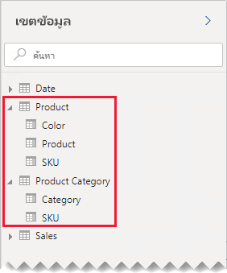
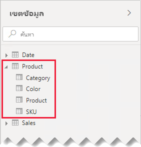
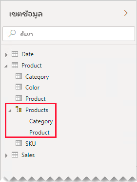
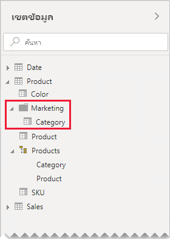

# คำแนะนำความสัมพันธ์แบบหนึ่งต่อหนึ่งOne-to-one relationship guidance

บทความนี้มุ่งเป้าหมายไปที่เรื่อง ตัวสร้างแบบจำลองข้อมูลนำเข้าที่ทำงานกับ Power BI DesktopThis article targets you as a data modeler working with Power BI Desktop. ซึ่งจะให้คำแนะนำเกี่ยวกับการทำงานกับความสัมพันธ์แบบจำลองหนึ่งต่อหนึ่งIt provides you with guidance on working with one-to-one model relationships. สามารถสร้างความสัมพันธ์แบบหนึ่งต่อหนึ่งได้เมื่อทั้งสองตารางมีคอลัมน์ของค่าทั่วไปและไม่ซ้ำกันA one-to-one relationship can be created when both tables each contain a column of common and unique values.

[!INCLUDE [relationships-prerequisite-reading](includes/relationships-prerequisite-reading.md)]

มีสองสถานการณ์ที่เกี่ยวข้องกับความสัมพันธ์แบบหนึ่งต่อหนึ่งดังนี้:There are two scenarios that involve one-to-one relationships:

- [มิติลดรูป](#degenerate-dimensions): คุณสามารถหา[มิติลดรูป](star-schema.md#degenerate-dimensions)จากตารางชนิดข้อเท็จจริงได้[Degenerate dimensions](#degenerate-dimensions): You can derive a [degenerate dimension](star-schema.md#degenerate-dimensions) from a fact-type table.
- [ข้อมูลแถวที่ขยายข้ามตาราง](#row-data-spans-across-tables): เอนทิตีธุรกิจเดี่ยวหรือหัวเรื่องถูกโหลดเป็นตารางแบบจำลองสองตางราง (หรือมากกว่า) ซึ่งอาจเนื่องมาจากข้อมูลเป็นที่มาจากร้านค้าข้อมูลที่แตกต่างกัน[Row data spans across tables](#row-data-spans-across-tables): A single business entity or subject is loaded as two (or more) model tables, possibly because their data is sourced from different data stores. สถานการณ์นี้อาจเป็นเรื่องปกติสำหรับตารางชนิดมิติThis scenario can be common for dimension-type tables. ตัวอย่างเช่น รายละเอียดผลิตภัณฑ์หลักจะถูกจัดเก็บไว้ในระบบการขายการดำเนินงาน และรายละเอียดผลิตภัณฑ์เสริมจะถูกจัดเก็บไว้ในแหล่งข้อมูลอื่นFor example, master product details are stored in an operational sales system, and supplementary product details are stored in a different source.

    อย่างไรก็ตาม คุณจะต้องเชื่อมโยงตารางชนิดข้อเท็จจริงสองรายการกับความสัมพันธ์แบบหนึ่งต่อหนึ่งIt's unusual, however, that you'd relate two fact-type tables with a one-to-one relationship. เนื่องจากตารางชนิดข้อเท็จจริงทั้งสองตารางจะต้องมีมิติและส่วนประกอบเดียวกันIt's because both fact-type tables would need to have the same dimensionality and granularity. นอกจากนี้ ตารางชนิดข้อเท็จจริงแต่ละตารางจะต้องมีคอลัมน์ที่ไม่ซ้ำกันเพื่อให้สามารถสร้างความสัมพันธ์แบบจำลองได้Also, each fact-type table would need unique columns to allow the model relationship to be created.

## ตัวอย่างมิติลดรูปDegenerate dimensions

เมื่อคอลัมน์จากตารางชนิดข้อเท็จจริงถูกใช้สำหรับการกรองหรือการจัดกลุ่ม คุณสามารถทำให้พร้อมใช้งานได้ในตารางที่แยกต่างหากWhen columns from a fact-type table are used for filtering or grouping, you can consider making them available in a separate table. ด้วยวิธีนี้ คุณจะแยกคอลัมน์ที่ใช้สำหรับตัวกรองหรือการจัดกลุ่มจากคอลัมน์นั้นๆ ที่ใช้เพื่อสรุปแถวข้อเท็จจริงได้This way, you separate columns used for filter or grouping, from those columns used to summarize fact rows. การแยกนี้สามารถ:This separation can:

- ลดพื้นที่การจัดเก็บReduce storage space
- ลดความซับซ้อนของการคำนวณแบบจำลองSimplify model calculations
- มีส่วนร่วมในการปรับปรุงประสิทธิภาพการทำงานของคิวรีContribute to improved query performance
- จัดส่งเขตข้อมูลบานหน้าต่าง **เขตข้อมูล** ที่ใช้งานง่ายขึ้นให้กับผู้เขียนรายงานของคุณDeliver a more intuitive **Fields** pane experience to your report authors

พิจารณาตารางยอดขายแหล่งที่มาที่จัดเก็บรายละเอียดคำสั่งซื้อในทั้งสองคอลัมน์Consider a source sales table that stores sales order details in two columns.

คอลัมน์ **OrderNumber** จะจัดเก็บหมายเลขลำดับ และคอลัมน์ **OrderLineNumber** จะจัดเก็บลำดับของบรรทัดภายในลำดับThe **OrderNumber** column stores the order number, and the **OrderLineNumber** column stores a sequence of lines within the order.

ในไดอะแกรมแบบจำลองต่อไปนี้ โปรดสังเกตว่าคอลัมน์หมายเลขลำดับและหมายเลขบรรทัดคำสั่งซื้อไม่ได้โหลดไปยังตาราง **ยอดขาย**In the following model diagram, notice that the order number and order line number columns haven't been loaded to the **Sales** table. แต่ค่าเหล่านั้นถูกใช้ในการสร้าง [คีย์ตัวแทน](star-schema.md#surrogate-keys) คอลัมน์ที่ชื่อว่า **SalesOrderLineID**Instead, their values were used to create a [surrogate key](star-schema.md#surrogate-keys) column named **SalesOrderLineID**. (ค่าคีย์ถูกคำนวณโดยการคูณหมายเลขคำสั่งซื้อด้วย 1,000 จากนั้นเพิ่มหมายเลขบรรทัดคำสั่ง)(The key value is calculated by multiplying the order number by 1000, and then adding the order line number.)

ตาราง **คำสั่งซื้อ** ให้ประสบการณ์การใช้งานที่หลากหลายสำหรับผู้เขียนรายงานที่มีคอลัมน์สามคอลัมน์: **คำสั่งซื้อ** **บรรทัดคำสั่งซื้อ** และ **หมายเลขบรรทัด**The **Sales Order** table provides a rich experience for report authors with three columns: **Sales Order**, **Sales Order Line**, and **Line Number**. นอกจากนี้ยังมีลำดับชั้นอีกด้วยIt also includes a hierarchy. ทรัพยากรตารางเหล่านี้รองรับการออกแบบรายงานที่ต้องการกรอง จัดกลุ่ม หรือเจอะลึกรายละเอียดคำสั่งซื้อและรายการคำสั่งซื้อThese table resources support report designs that need to filter, group by, or drill down through orders and order lines.

เนื่องจากตาราง **คำสั่งซื้อ** ที่ได้มาจากข้อมูลการขาย ดังนั้นควรมีจำนวนแถวเท่ากันในแต่ละตารางAs the **Sales Order** table is derived from the sales data, there should be exactly the same number of rows in each table. นอกจากนี้ควรมีค่าที่ตรงกันในแต่ละคอลัมน์ **SalesOrderLineID**Further, there should be matching values between each **SalesOrderLineID** column.

## ข้อมูลแถวที่ขยายข้ามตาราง:Row data spans across tables

ลองพิจารณาตัวอย่างที่เกี่ยวข้องกับตารางมิติข้อมูลที่เกี่ยวข้องแบบหนึ่งต่อหนึ่งสองตารางต่อไปนี้: **ผลิตภัณฑ์** และ **ประเภทผลิตภัณฑ์**Consider an example involving two one-to-one related dimension-type tables: **Product**, and **Product Category**. แต่ละตารางแสดงข้อมูลที่นำเข้าและมีคอลัมน์ **SKU** (หน่วยเก็บรักษาสต็อค) ที่มีค่าที่ไม่ซ้ำกันEach table represents imported data and has a **SKU** (Stock-Keeping Unit) column containing unique values.

นี่คือไดอะแกรมแบบจำลองบางส่วนของสองตารางHere's a partial model diagram of the two tables.

ตารางที่สองที่มีชื่อว่า **ผลิตภัณฑ์** ซึ่งมีสามคอลัมน์ดังต่อไปนี้: **สี** **ผลิตภัณฑ์** และ **SKU**The first table is named **Product**, and it contains three columns: **Color**, **Product**, and **SKU**. ตารางที่สองที่มีชื่อว่า **ประเภทผลิตภัณฑ์** ซึ่งมีสองคอลัมน์ดังต่อไปนี้: **ประเภท** และ **SKU**The second table is named **Product Category**, and it contains two columns: **Category**, and **SKU**. ความสัมพันธ์แบบหนึ่งต่อหนึ่งเกี่ยวข้องกับคอลัมน์ **SKU** สองคอลัมน์A one-to-one relationship relates the two **SKU** columns. ตัวกรองความสัมพันธ์ทั้งสองทิศทางซึ่งเป็นกรณีสำหรับความสัมพันธ์แบบหนึ่งต่อหนึ่งเสมอThe relationship filters in both directions, which is always the case for one-to-one relationships.

เพื่อช่วยในการอธิบายวิธีการทำงานของการถ่ายถอดตัวกรองความสัมพันธ์ ไดอะแกรมแบบจำลองได้รับการแก้ไขเพื่อแสดงแถวตารางTo help describe how the relationship filter propagation works, the model diagram has been modified to reveal the table rows. ตัวอย่างทั้งหมดในบทความนี้เป็นไปตามข้อมูลนี้All examples in this article are based on this data.

> [!NOTE]
> ไม่สามารถแสดงแถวตารางในไดอะแกรมแบบจำลอง Power BI Desktop ได้It's not possible to display table rows in the Power BI Desktop model diagram. การดำเนินการนี้จะทำในบทความนี้เพื่อสนับสนุนการสนทนาด้วยตัวอย่างที่ชัดเจนIt's done in this article to support the discussion with clear examples.

รายละเอียดแถวสำหรับสองตารางอธิบายในหัวข้อย่อยต่อไปนี้:The row details for the two tables are described in the following bulleted list:

- ตาราง **ผลิตภัณฑ์** มีสามแถวดังนี้:The **Product** table has three rows:
  - **SKU** CL-01 **ผลิตภัณฑ์** เสื้อยืด **สี** เขียว**SKU** CL-01, **Product** T-shirt, **Color** Green
  - **SKU** CL-02 **ผลิตภัณฑ์** กางเกงยีนส์ **สี** น้ำเงิน**SKU** CL-02, **Product** Jeans, **Color** Blue
  - **SKU** AC-01 **ผลิตภัณฑ์** หมวก **สี** น้ำเงิน**SKU** AC-01, **Product** Hat, **Color** Blue
- ตาราง **ประเภทผลิตภัณฑ์** ซึ่งมีสองแถวดังนี้:The **Product Category** table has two rows:
  - **SKU** CL-01 **ประเภท** เสื้อผ้า**SKU** CL-01, **Category** Clothing
  - **SKU** AC-01 **ประเภท** อุปกรณ์**SKU** AC-01, **Category** Accessories

โปรดสังเกตว่าตาราง **ประเภทผลิตภัณฑ์** ไม่มีแถวสำหรับผลิตภัณฑ์ SKU CL-02Notice that the **Product Category** table doesn't include a row for the product SKU CL-02. เราจะกล่าวถึงผลกระทบของแถวที่หายไปนี้ในบทความนี้ในภายหลังWe'll discuss the consequences of this missing row later in this article.

ในบานหน้าต่าง **เขตข้อมูล** ผู้เขียนรายงานจะพบเขตข้อมูลที่เกี่ยวข้องกับผลิตภัณฑ์ในสองตารางดังนี้: **ผลิตภัณฑ์** และ **ประเภทผลิตภัณฑ์**In the **Fields** pane, report authors will find product-related fields in two tables: **Product** and **Product Category**.

มาดูกันว่าจะเกิดอะไรขึ้นเมื่อมีการเพิ่มเขตข้อมูลจากทั้งสองตารางลงในภาพตารางLet's see what happens when fields from both tables are added to a table visual. ในตัวอย่างนี้ คอลัมน์ **SKU** คือที่มาจากตาราง **ผลิตภัณฑ์**In this example, the **SKU** column is sourced from the **Product** table.

โปรดสังเกตว่าค่า **ประเภท** สำหรับผลิตภัณฑ์ SKU CL-02 ว่างเปล่าNotice that the **Category** value for product SKU CL-02 is BLANK. เนื่องจากไม่มีแถวในตาราง **ประเภทผลิตภัณฑ์** สำหรับผลิตภัณฑ์นี้It's because there's no row in the **Product Category** table for this product.

### คำแนะนำRecommendations

เมื่อเป็นไปได้ เราขอแนะนำให้คุณหลีกเลี่ยงการสร้างความสัมพันธ์แบบจำลองหนึ่งต่อหนึ่งเมื่อข้อมูลแถวขยายข้ามตารางแบบจำลองWhen possible, we recommend you avoid creating one-to-one model relationships when row data spans across model tables. เนื่องจากการออกแบบนี้สามารถทำสิ่งต่อไปนี้ได้:It's because this design can:

- มีส่วนร่วมกับกองข้อความของบานหน้าต่างของ **เขตข้อมูล** แสดงรายการตารางมากเกินความจำเป็นContribute to **Fields** pane clutter, listing more tables than necessary
- ทำให้เป็นเรื่องยากสำหรับผู้เขียนรายงานในการค้นหาเขตข้อมูลที่เกี่ยวข้องเนื่องจากมีการกระจายข้ามหลายตารางMake it difficult for report authors to find related fields, because they're distributed across multiple tables
- จำกัดความสามารถในการสร้างลำดับชั้น เนื่องจากระดับของพวกเขาจะต้องยึดตามคอลัมน์จาก _ตารางเดียวกัน_Limit the ability to create hierarchies, as their levels must be based on columns from the _same table_
- สร้างผลลัพธ์ที่ไม่คาดคิดเมื่อไม่มีการจับคู่แถวระหว่างตารางทั้งหมดProduce unexpected results when there isn't a complete match of rows between the tables

คำแนะนำเฉพาะที่แตกต่างกันโดยขึ้นอยู่กับว่าความสัมพันธ์แบบหนึ่งต่อหนึ่งคือ _แบบภายในกลุ่มแหล่งข้อมูล_ หรือ _แบบข้ามกลุ่มแหล่งข้อมูล_Specific recommendations differ depending on whether the one-to-one relationship is _intra source group_ or _cross source group_. เมื่อต้องการเรียนรู้เพิ่มเติมเกี่ยวกับความสัมพันธ์ โปรดดู[ความสัมพันธ์แบบจำลองใน Power BI Desktop (การประเมินผลความสัมพันธ์)](../transform-model/desktop-relationships-understand.md#relationship-evaluation)For more information about relationship evaluation, see [Model relationships in Power BI Desktop (Relationship evaluation)](../transform-model/desktop-relationships-understand.md#relationship-evaluation).

### ความสัมพันธ์ชนิดหนึ่งต่อหนึ่งแบบภายในกลุ่มแหล่งข้อมูลIntra source group one-to-one relationship

เมื่อมีความสัมพันธ์ _แบบภายในกลุ่มแหล่งข้อมูล_ แบบหนึ่งต่อหนึ่งที่มีอยู่ระหว่างตาราง เราขอแนะนำให้รวมข้อมูลลงในตารางแบบจำลองเดียวWhen a one-to-one _intra source group_ relationship exists between tables, we recommend consolidating the data into a single model table. ซึ่งทำได้โดยการผสานคิวรี Power QueryIt's done by merging the Power Query queries.

ขั้นตอนต่อไปนี้แสดงวิธีการรวมและแบบจำลองข้อมูลที่เกี่ยวข้องแบบหนึ่งต่อหนึ่ง:The following steps present a methodology to consolidate and model the one-to-one related data:

1. **การผสานคิวรี**: เมื่อ [รวมคิวรีสองคิวรีเข้าด้วยกัน](../connect-data/desktop-shape-and-combine-data.md#combine-queries) ให้พิจารณาความสมบูรณ์ของข้อมูลในแต่ละคิวรี**Merge queries**: When [combining the two queries](../connect-data/desktop-shape-and-combine-data.md#combine-queries), give consideration to the completeness of data in each query. ถ้าคิวรีหนึ่งมีชุดแถวทั้งหมด (เช่นรายการหลัก) ให้ผสานคิวรีอื่นเข้าด้วยกันIf one query contains a complete set of rows (like a master list), merge the other query with it. กำหนดค่าการแปลงแบบผสานเพื่อใช้ _การรวมภายนอกด้านซ้าย_ ซึ่งเป็นชนิดการเข้าร่วมเริ่มต้นConfigure the merge transformation to use a _left outer join_, which is the default join type. ชนิดการรวมนี้ช่วยให้แน่ใจว่าคุณจะเก็บแถวทั้งหมดของคิวรีแรกและเสริมให้กับแถวใดๆ ก็ตามที่ตรงกันของคิวรีที่สองThis join type ensures you'll keep all rows of the first query, and supplement them with any matching rows of the second query. ขยายคอลัมน์ที่จำเป็นทั้งหมดของคิวรีที่สองลงในคิวรีแรกExpand all required columns of the second query into the first query.
2. **ปิดใช้งานการโหลดคิวรี**: ตรวจสอบให้แน่ใจว่าได้ [ปิดใช้งาน](import-modeling-data-reduction.md#disable-power-query-query-load)การโหลดคิวรีที่สอง**Disable query load**: Be sure to [disable the load](import-modeling-data-reduction.md#disable-power-query-query-load) of the second query. ด้วยวิธีนี้ ระบบจะไม่โหลดผลลัพธ์เป็นตารางแบบจำลองThis way, it won't load its result as a model table. การกำหนดค่านี้จะช่วยลดขนาดการจัดเก็บแบบจำลองข้อมูล และช่วยในการลดกองข้อความบานหน้าต่าง **เขตข้อมูล**This configuration reduces the data model storage size, and helps to unclutter the **Fields** pane.

    ในตัวอย่างของเรา ตอนนี้ผู้เขียนรายงานค้นหาตารางเดียวที่ชื่อว่า **ผลิตภัณฑ์** ในบานหน้าต่าง **เขตข้อมูล**In our example, report authors now find a single table named **Product** in the **Fields** pane. ซึ่งประกอบด้วยเขตข้อมูลที่เกี่ยวข้องกับผลิตภัณฑ์ทั้งหมดIt contains all product-related fields.

    
3. **แทนที่ค่าที่หายไป**: ถ้าคิวรีที่สองมีแถวที่ไม่ตรงกันค่า Null จะปรากฏในคอลัมน์ที่นำมาใช้จากที่นั่น**Replace missing values**: If the second query has unmatched rows, NULLs will appear in the columns introduced from it. เมื่อเหมาะสม ให้พิจารณาเปลี่ยนค่า Null ด้วยค่าโทเค็นWhen appropriate, consider replacing NULLs with a token value. การแทนที่ค่าที่หายไปเป็นสิ่งสำคัญโดยเฉพาะอย่างยิ่งเมื่อผู้สร้างรายงานกรองหรือจัดกลุ่มตามค่าของคอลัมน์เนื่องจากช่องว่างอาจปรากฏในภาพรายงานReplacing missing values is especially important when report authors filter or group by the column values, as BLANKs could appear in report visuals.

    ในการแสดงผลด้วยภาต่อไพตารางปนี้ โปรดสังเกตว่าประเภทสำหรับผลิตภัณฑ์ SKU CL-02 แสดงเป็น _[ไม่ได้กำหนด]_In the following table visual, notice that the category for product SKU CL-02 now reads _[Undefined]_. ในแบบสอบถามประเภท ค่า null ถูกแทนที่ด้วยค่าข้อความโทเค็นนี้In the query, null categories were replaced with this token text value.

    

4. **สร้างลำดับชั้น**: ถ้ามีความสัมพันธ์อยู่ _ระหว่างคอลัมน์_ ของตารางที่รวมอยู่ในขณะนี้ ให้พิจารณาการสร้างลำดับชั้น**Create hierarchies**: If relationships exist _between the columns_ of the now-consolidated table, consider creating hierarchies. ด้วยวิธีนี้ ผู้เขียนรายงานจะระบุโอกาสสำหรับการเจาะลึกภาพรายงานได้อย่างรวดเร็วThis way, report authors will quickly identify opportunities for report visual drilling.

    ในตัวอย่างของเรา ผู้เขียนรายงานสามารถใช้ลำดับชั้นที่มีสองระดับได้แล้วในขณะนี้: **ประเภท** และ **SKU**.In our example, report authors now can use a hierarchy that has two levels: **Category** and **Product**.

    

ถ้าคุณต้องการให้ตารางที่แยกต่างหากช่วยจัดระเบียบเขตข้อมูลของคุณ เรายังคงแนะนำให้ทำการรวมบัญชีลงในตารางเดียวIf you like how separate tables help organize your fields, we still recommend consolidating into a single table. คุณยังสามารถจัดระเบียบเขตข้อมูลของคุณได้แต่โดยใช้การ _แสดงโฟลเดอร์_ แทนYou can still organize your fields, but by using _display folders_ instead.

ในตัวอย่างของเรา ผู้เขียนรายงานสามารถค้นหาเขตข้อมูล **ประเภท** ภายในโฟลเดอร์การแสดงผล **การตลาด** ได้In our example, report authors can find the **Category** field within the **Marketing** display folder.

คุณยังคงตัดสินใจที่จะกำหนดความสัมพันธ์แบบภายในกลุ่มแหล่งข้อมูลชนิดหนึ่งต่อหนึ่งในโมเดลของคุณ เมื่อเป็นไปได้ ให้ตรวจสอบให้แน่ใจว่ามีแถวที่ตรงกันในตารางที่เกี่ยวข้องShould you still decide to define one-to-one intra source group relationships in your model, when possible, ensure there are matching rows in the related tables. ในฐานะที่เป็นความสัมพันธ์แบบภายในกลุ่มแหล่งข้อมูลชนิดหนึ่งต่อหนึ่ง ความสัมพันธ์จะได้รับการประเมินเป็น[ความสัมพันธ์แบบปกติ](../transform-model/desktop-relationships-understand.md#regular-relationships) โดยปัญหาการทำงานของข้อมูลที่สามารถทำให้พื้นผิวในภาพรายงานของคุณเป็นช่องว่างได้As a one-to-one intra source group relationship is evaluated as a [regular relationship](../transform-model/desktop-relationships-understand.md#regular-relationships), data integrity issues could surface in your report visuals as BLANKs. (คุณสามารถดูตัวอย่างของการจัดกลุ่มว่างในตารางแรกที่แสดงในบทความนี้ได้)(You can see an example of a BLANK grouping in the first table visual presented in this article.)

### ความสัมพันธ์ชนิดหนึ่งต่อหนึ่งแบบข้ามกลุ่มแหล่งข้อมูลCross source group one-to-one relationship

เมื่อมีความสัมพันธ์ _แบบข้ามกลุ่มแหล่งข้อมูล_ แบบหนึ่งต่อหนึ่งที่มีอยู่ระหว่างตาราง จะไม่มีการออกแบบจำลองสำรองไว้ เว้นแต่ว่าคุณจะรวบรวมข้อมูลในแหล่งข้อมูลของคุณไว้ล่วงหน้าWhen a one-to-one _cross source group_ relationship exists between tables, there's no alternative model design—unless you pre-consolidate the data in your data sources. Power BI จะประเมินความสัมพันธ์ของแบบจำลองหนึ่งต่อหนึ่งเป็น[ความสัมพันธ์แบบจำกัด](../transform-model/desktop-relationships-understand.md#limited-relationships)Power BI will evaluate the one-to-one model relationship as a [limited relationship](../transform-model/desktop-relationships-understand.md#limited-relationships). ดังนั้นการดูแลรักษาเพื่อให้แน่ใจว่ามีแถวที่ตรงกันในตารางที่เกี่ยวข้องเนื่องจากแถวที่ไม่สอดคล้องกันจะถูกตัดออกจากผลลัพธ์คิวรีTherefore, take care to ensure there are matching rows in the related tables, as unmatched rows will be eliminated from query results.

มาดูกันว่าจะเกิดอะไรขึ้น เมื่อมีการเพิ่มเขตข้อมูลจากทั้งสองตารางลงในภาพตาราง และความสัมพันธ์แบบจำกัดอยู่ระหว่างตารางLet's see what happens when fields from both tables are added to a table visual, and a limited relationship exists between the tables.

ตารางแสดงแถวสองแถวเท่านั้นThe table displays two rows only. ผลิตภัณฑ์ SKU CL-02 หายไปเนื่องจากไม่มีแถวที่ตรงกันในตาราง **ประเภทผลิตภัณฑ์**Product SKU CL-02 is missing because there's no matching row in the **Product Category** table.

## ขั้นตอนถัดไปNext steps

สำหรับข้อมูลเพิ่มเติมที่เกี่ยวข้องกับบทความนี้ โปรดดูทรัพยากรต่อไปนี้:For more information related to this article, check out the following resources:

- [ความสัมพันธ์ของแบบจำลองใน Power BI DesktopModel relationships in Power BI Desktop](../transform-model/desktop-relationships-understand.md)
- [ทำความเข้าใจแบบจำลองมิติที่มีลักษณะคล้ายดาวและความสำคัญที่มีต่อ Power BIUnderstand star schema and the importance for Power BI](star-schema.md)
- [คำแนะนำการแก้ไขปัญหาความสัมพันธ์Relationship troubleshooting guidance](relationships-troubleshoot.md)
- มีคำถามหรือไม่Questions? [ลองถามชุมชน Power BITry asking the Power BI Community](https://community.powerbi.com/)
- มีข้อเสนอแนะไหมSuggestions? [สนับสนุนแนวคิดในการปรับปรุง Power BIContribute ideas to improve Power BI](https://ideas.powerbi.com/)
