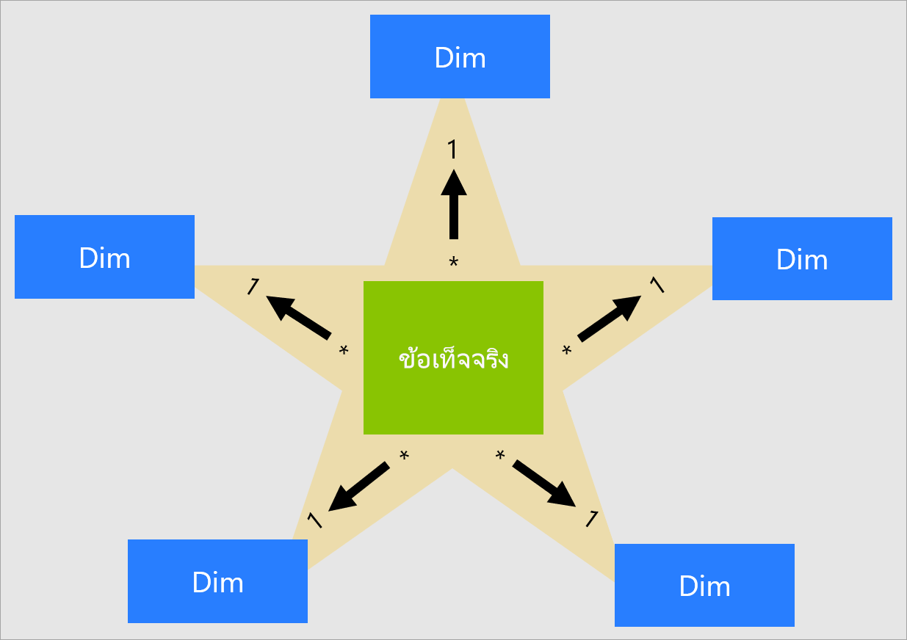
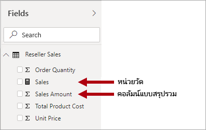
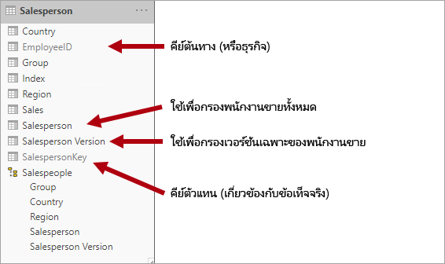
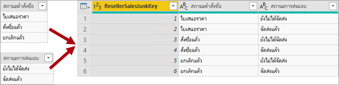
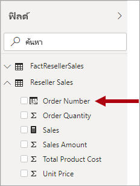

# ทำความเข้าใจกับแบบจำลองมิติที่มีลักษณะคล้ายดาวและความสำคัญที่มีต่อ Power BIUnderstand star schema and the importance for Power BI

บทความนี้มีเป้าหมายที่ตัวสร้างแบบจำลองข้อมูลของ Power BI DesktopThis article targets Power BI Desktop data modelers. บทความนี้อธิบายการออกแบบแบบจำลองมิติที่มีลักษณะคล้ายดาวและความสัมพันธ์ของการออกแบบนั้นเพื่อพัฒนาแบบจำลองข้อมูล Power BI ที่ปรับให้เหมาะสมเพื่อประสิทธิภาพการทำงานและความสามารถในการใช้งานIt describes star schema design and its relevance to developing Power BI data models optimized for performance and usability.

บทความนี้ไม่ได้เจตนาที่จะพูดคุยถึงการออกแบบแบบจำลองมิติที่มีลักษณะคล้ายดาวที่สมบูรณ์แต่อย่างใดThis article isn't intended to provide a complete discussion on star schema design. สำหรับรายละเอียดเพิ่มเติม ให้ดูที่เนื้อหาที่เผยแพร่โดยตรง เช่น **ชุดเครื่องมือคลังข้อมูล: คำแนะนำในการสร้างแบบจำลองเชิงมิติฉบับสมบูรณ์** (พิมพ์ครั้งที่ 3, 2013) โดย Ralph Kimball และคณะFor more details, refer directly to published content, like **The Data Warehouse Toolkit: The Definitive Guide to Dimensional Modeling** (3rd edition, 2013) by Ralph Kimball et al.

## ภาพรวมแบบจำลองมิติที่มีลักษณะคล้ายดาวStar schema overview

**แบบจำลองมิติที่มีลักษณะคล้ายดาว** คือ วิธีการสร้างแบบจำลองที่เสร็จสมบูรณ์ซึ่งนำมาใช้โดยคลังข้อมูลเชิงสัมพันธ์อย่างแพร่หลาย**Star schema** is a mature modeling approach widely adopted by relational data warehouses. ซึ่งกำหนดให้ตัวสร้างแบบจำลองจัดประเภทตารางแบบจำลองให้เป็นแบบ _มิติ_ หรือ _ค่าความจริง_It requires modelers to classify their model tables as either _dimension_ or _fact_.

**ตารางสำหรับจัดเก็บข้อมูลสำหรับแต่ละมิติทางธุรกิจ** อธิบายถึงเอนทิตี้ธุรกิจซึ่งเป็น _สิ่ง_ ที่คุณสร้างแบบจำลองขึ้นมา**Dimension tables** describe business entities—the _things_ you model. เอนทิตี้สามารถรวมถึงผลิตภัณฑ์ ผู้คน สถานที่ และแนวความคิด รวมถึงเวลาด้วยในตัวEntities can include products, people, places, and concepts including time itself. ตารางที่สอดคล้องกันมากที่สุดที่คุณจะพบในแบบจำลองมิติที่มีลักษณะคล้ายดาวก็คือ ตารางสำหรับจัดเก็บข้อมูลสำหรับแต่ละมิติทางธุรกิจในรูปวันที่The most consistent table you'll find in a star schema is a date dimension table. ตารางสำหรับจัดเก็บข้อมูลสำหรับแต่ละมิติทางธุรกิจประกอบด้วยคอลัมน์หลัก (หรือคอลัมน์) ที่ทำหน้าที่เป็นตัวระบุที่ไม่ซ้ำกัน และคอลัมน์เชิงบรรยายA dimension table contains a key column (or columns) that acts as a unique identifier, and descriptive columns.

**ตารางข้อเท็จจริง** จัดเก็บข้อมูลการสังเกตการณ์หรือเหตุการณ์ ซึ่งสามารถเป็นคำสั่งซื้อ ยอดคงเหลือสินค้าคงคลัง อัตราแลกเปลี่ยน อุณหภูมิ ฯลฯ ตารางสำหรับเก็บข้อมูลตัวชี้วัดประกอบด้วยคอลัมน์คีย์มิติที่เกี่ยวข้องกับตารางสำหรับจัดเก็บข้อมูลสำหรับแต่ละมิติทางธุรกิจิ และคอลัมน์หน่วยวัดตัวเลข**Fact tables** store observations or events, and can be sales orders, stock balances, exchange rates, temperatures, etc. A fact table contains dimension key columns that relate to dimension tables, and numeric measure columns. คอลัมน์คีย์มิติจะกำหนด _มิติ_ ของตารางสำหรับเก็บข้อมูลตัวชี้วัด ในขณะที่ค่าคีย์มิติจะกำหนด _ส่วนประกอบย่อย_ ของตารางสำหรับเก็บข้อมูลตัวชี้วัดThe dimension key columns determine the _dimensionality_ of a fact table, while the dimension key values determine the _granularity_ of a fact table. ตัวอย่างเช่น พิจารณาตารางสำหรับเก็บข้อมูลตัวชี้วัดที่ออกแบบมาเพื่อจัดเก็บเป้ายอดขายที่มีสองคอลัมน์คีย์มิติ **วันที่** และ **ProductKey**For example, consider a fact table designed to store sale targets that has two dimension key columns **Date** and **ProductKey**. ถือเป็นเรื่องง่ายในการทำความเข้าใจว่าตารางมีสองมิติIt's easy to understand that the table has two dimensions. อย่างไรก็ตาม ่ไม่สามารถกำหนดรายละเอียดของข้อมูลได้โดยไม่คำนึงถึงค่าคีย์มิติThe granularity, however, can't be determined without considering the dimension key values. ในตัวอย่างนี้ พิจารณาว่าค่าที่จัดเก็บไว้ในคอลัมน์ **วันที่** คือ วันแรกของแต่ละเดือนIn this example, consider that the values stored in the **Date** column are the first day of each month. ในกรณีนี้ รายละเอียดของข้อมูลจะอยู่ในระดับเดือน-ผลิตภัณฑ์In this case, the granularity is at month-product level.

โดยทั่วไปแล้ว ตารางสำหรับจัดเก็บข้อมูลสำหรับแต่ละมิติทางธุรกิจจะประกอบด้วยจำนวนแถวที่ค่อนข้างน้อยGenerally, dimension tables contain a relatively small number of rows. ในทางกลับกัน ตารางสำหรับเก็บข้อมูลตัวชี้วัดสามารถประกอบด้วยแถวจำนวนมากและเพิ่มขึ้นต่อเนื่องเมื่อเวลาผ่านไปFact tables, on the other hand, can contain a very large number of rows and continue to grow over time.

## ความสัมพันธ์ของแบบจำลองมิติที่มีลักษณะคล้ายดาวต่อแบบจำลอง Power BIStar schema relevance to Power BI models

การออกแบบแบบจำลองมิติที่มีลักษณะคล้ายดาวและแนวคิดที่เกี่ยวข้องมากมายที่แนะนำในบทความนี้จะสัมพันธ์กันมากในการพัฒนาแบบจำลอง Power BI ที่ได้รับการปรับให้เหมาะสมเพื่อประสิทธิภาพการทำงานและความสามารถในการใช้งานStar schema design and many related concepts introduced in this article are highly relevant to developing Power BI models that are optimized for performance and usability.

ให้พิจารณาว่าวิชวลรายงาน Power BI แต่ละรายการจะสร้างคิวรีที่ถูกส่งไปยังแบบจำลอง Power BI (ซึ่งบริการของ Power BI จะเรียกใช้ชุดข้อมูล)Consider that each Power BI report visual generates a query that is sent to the Power BI model (which the Power BI service calls a dataset). คิวรีเหล่านี้จะใช้เพื่อกรอง จัดกลุ่มและสรุปข้อมูลแบบจำลองThese queries are used to filter, group, and summarize model data. จากนั้นแบบจำลองที่ได้รับการออกแบบมาเป็นอย่างดีก็คือ แบบจำลองที่มีตารางสำหรับการกรองและการจัดกลุ่ม และตารางสำหรับการสรุปข้อมูลA well-designed model, then, is one that provides tables for filtering and grouping, and tables for summarizing. การออกแบบนี้เหมาะสมกับหลักการ Schema ของดาว:This design fits well with star schema principles:

- ตารางสำหรับจัดเก็บข้อมูลสำหรับแต่ละมิติทางธุรกิจสนับสนุน _การกรอง_ และ _การจัดกลุ่ม_Dimension tables support _filtering_ and _grouping_
- ตารางสำหรับเก็บข้อมูลตัวชี้วัดสนับสนุน _การสรุปข้อมูล_Fact tables support _summarization_

ไม่มีคุณสมบัติของตารางที่ผู้สร้างแบบจำลองตั้งค่าเพื่อกำหนดชนิดตารางเป็นมิติหรือความเป็นจริงThere's no table property that modelers set to configure the table type as dimension or fact. ซึ่งเป็นข้อเท็จจริงที่กำหนดโดยความสัมพันธ์แบบจำลองIt's in fact determined by the model relationships. ความสัมพันธ์แบบจำลองสร้างเส้นทางการแพร่กระจายตัวกรองระหว่างสองตาราง และเป็นคุณสมบัติ **คาร์ดินาลลิตี้** ของความสัมพันธ์ที่กำหนดชนิดของตารางA model relationship establishes a filter propagation path between two tables, and it's the **Cardinality** property of the relationship that determines the table type. ภาวะเชิงการนับของเซ็ตของความสัมพันธ์ทั่วไปคือ _หนึ่งต่อกลุ่ม_ หรือในทางกลับกันเป็นแบบ _กลุ่มต่อหนึ่ง_A common relationship cardinality is _one-to-many_ or its inverse _many-to-one_. ด้าน "หนึ่ง" คือ ตารางชนิดมิติตายตัวในขณะที่ด้าน "กลุ่ม" คือ ตารางชนิดค่าความจริงตายตัวเช่นกันThe "one" side is always a dimension-type table while the "many" side is always a fact-type table. เมื่อต้องการเรียนรู้เพิ่มเติมเกี่ยวกับความสัมพันธ์ โปรดดู[แบบจำลองความสัมพันธ์ใน Power BI Desktop](../transform-model/desktop-relationships-understand.md)For more information about relationships, see [Model relationships in Power BI Desktop](../transform-model/desktop-relationships-understand.md).

การออกแบบแบบจำลองที่มีโครงสร้างเป็นอย่างดีควรรวมเอาตารางที่เป็นตารางชนิดมิติหรือตารางชนิดค่าความจริงA well-structured model design should include tables that are either dimension-type tables or fact-type tables. คุณควรหลีกเลี่ยงการผสมตารางทั้งสองชนิดเข้าด้วยกันสำหรับตารางเดี่ยวAvoid mixing the two types together for a single table. นอกจากนี้เราขอแนะนำว่าคุณควรพยายามส่งจำนวนตารางที่ถูกต้องกับความสัมพันธ์ที่ถูกต้องในตำแหน่งเดิมWe also recommend that you should strive to deliver the right number of tables with the right relationships in place. นอกจากนี้ยังเป็นสิ่งสำคัญที่ว่าตารางชนิดค่าความจริงจะโหลดข้อมูลที่หน่วยมาตราวัดที่สอดคล้องกันเสมอIt's also important that fact-type tables always load data at a consistent grain.

สุดท้ายนี้ ถือว่ามีความสำคัญในการทำความเข้าใจว่าการออกแบบแบบจำลองที่เหมาะสมนั้นถือเป็นวิทยาศาสตร์ส่วนหนึ่งและศิลปะส่วนหนึ่งLastly, it's important to understand that optimal model design is part science and part art. ในบางครั้งคุณสามารถแบ่งมันออกด้วยคำแนะนำที่ดีเมื่อดูแล้วสมเหตสมุผลในการที่จะทำเช่นนั้นSometimes you can break with good guidance when it makes sense to do so.

มีแนวคิดเพิ่มเติมมากมายที่เกี่ยวข้องกับการออกแบบแบบจำลองมิติที่มีลักษณะคล้ายดาวที่สามารถนำไปใช้กับแบบจำลอง Power BI ได้There are many additional concepts related to star schema design that can be applied to a Power BI model. แนวคิดเหล่านี้ประกอบด้วย:These concepts include:

- [หน่วยวัดMeasures](#measures)
- [คีย์ตัวแทนSurrogate keys](#surrogate-keys)
- [แบบจำลองมิติที่เพิ่มการทำนอร์มอลไลซ์กับข้อมูลSnowflake dimensions](#snowflake-dimensions)
- [มิติการเล่นบทบาทRole-playing dimensions](#role-playing-dimensions)
- [มิติเปลี่ยนแปลงอย่างช้า ๆSlowly changing dimensions](#slowly-changing-dimensions)
- [มิติขยะJunk dimensions](#junk-dimensions)
- [ลดรูปมิติDegenerate dimensions](#degenerate-dimensions)
- [ตารางสำหรับเก็บข้อมูลตัวชี้วัดที่ไม่มีการเก็บค่าความจริงหรือมาตรวัดใด ๆFactless fact tables](#factless-fact-tables)

## หน่วยวัดMeasures

ในการออกแบบแบบจำลองมิติที่มีลักษณะคล้ายดาว **หน่วยวัด** คือ คอลัมน์ตารางสำหรับเก็บข้อมูลตัวชี้วัดที่จัดเก็บค่าที่จะใช้ในการสรุปข้อมูลIn star schema design, a **measure** is a fact table column that stores values to be summarized.

ในแบบจำลอง Power BI **หน่วยวัด** มีความแตกต่างกัน—แต่นิยามนั้น—คล้ายกันIn a Power BI model, a **measure** has a different—but similar—definition. ซึ่งเป็นสูตรที่เขียนใน[นิพจน์การวิเคราะห์ข้อมูล (DAX)](/dax/data-analysis-expressions-dax-reference) ที่ทำการสรุปเป็นผลสำเร็จIt's a formula written in [Data Analysis Expressions (DAX)](/dax/data-analysis-expressions-dax-reference) that achieves summarization. นิพจน์หน่วยวัดมักจะใช้ประโยชน์จากฟังก์ชันการรวม DAX เช่น SUM, MIN, MAX, AVERAGE ฯลฯ เพื่อสร้างผลลัพธ์การคืนค่าเป็นข้อมูลชนิดพื้นฐานเพียงตัวเดียวในเวลาที่ทำการคิวรี (จะไม่มีการจัดเก็บค่าไว้ในแบบจำลอง)Measure expressions often leverage DAX aggregation functions like SUM, MIN, MAX, AVERAGE, etc. to produce a scalar value result at query time (values are never stored in the model). นิพจน์หน่วยวัดมีความหลากหลายมากตั้งแต่การรวมคอลัมน์แบบง่ายไปจนถึงสูตรที่ซับซ้อนมากขึ้นซึ่งลบล้างบริบทตัวกรองและ/หรือการกระจายความสัมพันธ์Measure expression can range from simple column aggregations to more sophisticated formulas that override filter context and/or relationship propagation. สำหรับข้อมูลเพิ่มเติม อ่านบทความ [พื้นฐาน DAX ใน Power BI Desktop](../transform-model/desktop-quickstart-learn-dax-basics.md)For more information, read the [DAX Basics in Power BI Desktop](../transform-model/desktop-quickstart-learn-dax-basics.md) article.

ถือเป็นสิ่งสำคัญที่ต้องทำความเข้าใจว่าแบบจำลอง Power BI สนับสนุนวิธีการที่สองสำหรับการบรรลุผลการให้ข้อสรุปIt's important to understand that Power BI models support a second method for achieving summarization. คอลัมน์ใด ๆ —และคอลัมน์ตัวเลขโดยทั่วไป—สามารถสรุปได้โดยการวิชวลรายงานหรือการถามตอบAny column—and typically numeric columns—can be summarized by a report visual or Q&A. คอลัมน์เหล่านี้จะเรียกว่า _หน่วยวัดทางอ้อม_These columns are referred to as _implicit measures_. ซึ่งจะมีความสะดวกสำหรับคุณในฐานะนักพัฒนาแบบจำลอง เช่นเดียวกับในอินสแตนซ์จำนวนมากที่คุณไม่จำเป็นต้องสร้างหน่วยวัดThey offer a convenience for you as a model developer, as in many instances you do not need to create measures. ตัวอย่างเช่น คอลัมน์ **ยอดขาย** ยอดขายของผู้ค้าปลีกของงานผจญภัยสามารถสรุปได้หลายวิธี (เช่น สรุป, นับ, เฉลี่ย, มัธยฐาน, ต่ำสุด, สูงสุด, ฯลฯ) โดยไม่จำเป็นต้องสร้างหน่วยวัดสำหรับแต่ละชนิดการรวมที่เป็นไปได้For example, the Adventure Works reseller sales **Sales Amount** column could be summarized in numerous ways (sum, count, average, median, min, max, etc.), without the need to create a measure for each possible aggregation type.

อย่างไรก็ตาม มีสามสาเหตุที่น่าสนใจสำหรับคุณในการสร้างหน่วยวัด แม้แต่กับการให้ข้อสรุปในระดับคอลัมน์แบบง่าย:However, there are three compelling reasons for you to create measures, even for simple column-level summarizations:

- เมื่อคุณทราบว่าผู้เขียนรายงานจะคิวรีแบบจำลองโดยใช้ [นิพจน์แบบหลายมิติ (MDX)](/sql/analysis-services/multidimensional-models/mdx/mdx-query-the-basic-query) แบบจำลองจะต้องรวม _หน่วยวัดโดยตรง_When you know your report authors will query the model by using [Multidimensional Expressions (MDX)](/sql/analysis-services/multidimensional-models/mdx/mdx-query-the-basic-query), the model must include _explicit measures_. มีการกำหนดหน่วยวัดโดยตรงโดยใช้ DAXExplicit measures are defined by using DAX. วิธีการออกแบบนี้มีความเกี่ยวข้องอย่างมากเมื่อมีการคิวรีชุดข้อมูล Power BI โดยใช้ MDX เนื่องจาก MDX ไม่สามารถทำการสรุปของค่าคอลัมน์ได้This design approach is highly relevant when a Power BI dataset is queried by using MDX, because MDX can't achieve summarization of column values. โดยเฉพาะอย่างยิ่ง MDX จะใช้เมื่อทำการ [วิเคราะห์ใน Excel](../collaborate-share/service-analyze-in-excel.md) เพราะคิวรี MDX ของปัญหา PivotTableNotably, MDX will be used when performing [Analyze in Excel](../collaborate-share/service-analyze-in-excel.md), because PivotTables issue MDX queries.
- เมื่อคุณทราบว่าผู้เขียนรายงานของคุณจะสร้างรายงานที่มีการแบ่งหน้าของ Power BI โดยใช้ตัวออกแบบคิวรี MDX แบบจำลองจะต้องมีหน่วยวัดโดยตรงWhen you know your report authors will create Power BI paginated reports using the MDX query designer, the model must include explicit measures. เฉพาะตัวออกแบบคิวรี MDX เท่านั้นที่สนับสนุน [การรวมเซิร์ฟเวอร์](/sql/reporting-services/report-design/report-builder-functions-aggregate-function)Only the MDX query designer supports [server aggregates](/sql/reporting-services/report-design/report-builder-functions-aggregate-function). ดังนั้นถ้าผู้เขียนรายงานจำเป็นต้องมีหน่วยวัดที่ประเมินโดย Power BI (แทนที่จะเป็นโดยกลไกจัดการรายงานที่มีการแบ่งหน้า) พวกเขาต้องใช้ตัวออกแบบคิวรี MDXSo, if report authors need to have measures evaluated by Power BI (instead of by the paginated report engine), they must use the MDX query designer.
- หากคุณต้องการให้แน่ใจว่าผู้เขียนรายงานของคุณสามารถสรุปคอลัมน์ในรูปแบบที่เฉพาะเจาะจงเท่านั้นWhen you need to ensure that your report authors can only summarize columns in specific ways. ตัวอย่างเช่น คอลัมน์ **ราคาต่อหน่วย** ของยอดขายของผู้ค้าปลีก (ซึ่งแสดงถึงอัตราต่อหน่วย) สามารถสรุปได้โดยการใช้ฟังก์ชันการรวมเฉพาะเท่านั้นFor example, the reseller sales **Unit Price** column (which represents a per unit rate) can be summarized, but only by using specific aggregation functions. ซึ่งไม่ควรมีการรวมข้อมูลแต่ถือว่ามีความเหมาะสมในการสรุปโดยใช้ฟังก์ชันการรวมอื่น ๆ เช่น ต่ำสุด, สูงสุด, เฉลี่ย, ฯลฯ ในอินสแตนซ์นี้ ตัวสร้างแบบจำลองสามารถซ่อนคอลัมน์ **ราคาต่อหน่วย** และสร้างหน่วยวัดสำหรับฟังก์ชันการรวมที่เหมาะสมทั้งหมดได้It should never be summed, but it's appropriate to summarize by using other aggregation functions like min, max, average, etc. In this instance, the modeler can hide the **Unit Price** column, and create measures for all appropriate aggregation functions.

โปรดทราบว่าวิธีการออกแบบนี้ทำงานได้เป็นอย่างดีสำหรับรายงานที่เขียนในบริการของ Power BI และสำหรับการถามตอบThis design approach works well for reports authored in the Power BI service and for Q&A. อย่างไรก็ตาม การเชื่อมต่อสดของ Power BI Desktop อนุญาตให้ผู้สร้างรายงานแสดงเขตข้อมูลที่ซ่อนอยู่ในบานหน้าต่าง **เขตข้อมูล** ซึ่งอาจส่งผลให้เกิดการเลี่ยงวิธีการออกแบบลักษณะนี้However, Power BI Desktop live connections allow report authors to show hidden fields in the **Fields** pane, which can result in circumventing this design approach.

## คีย์ตัวแทนSurrogate keys

**คีย์ตัวแทน** คือ ตัวระบุที่ไม่ซ้ำกันที่คุณเพิ่มไปยังตารางเพื่อสนับสนุนการสร้างแบบจำลองมิติที่มีลักษณะคล้ายดาวA **surrogate key** is a unique identifier that you add to a table to support star schema modeling. ตามข้อกำหนด จะไม่มีการกำหนดหรือจัดเก็บไว้ในข้อมูลต้นฉบับBy definition, it's not defined or stored in the source data. โดยทั่วไปแล้วจะมีการเพิ่มคีย์ตัวแทนไปยังตารางสำหรับจัดเก็บข้อมูลสำหรับแต่ละมิติทางธุรกิจคลังข้อมูลที่เกี่ยวข้องเพื่อมอบตัวระบุที่ไม่ซ้ำกันสำหรับแต่ละแถวตารางมิติCommonly, surrogate keys are added to relational data warehouse dimension tables to provide a unique identifier for each dimension table row.

ความสัมพันธ์ของแบบจำลอง Power BI จะขึ้นอยู่กับคอลัมน์เดี่ยวที่ไม่ซ้ำกันในหนึ่งตาราง ซึ่งแพร่กระจายตัวกรองไปยังคอลัมน์เดี่ยวในอีกตารางPower BI model relationships are based on a single unique column in one table, which propagates filters to a single column in a different table. เมื่อตารางชนิดมิติในแบบจำลองของคุณไม่มีคอลัมน์เดี่ยวที่ไม่ซ้ำกันเพียง คุณต้องเพิ่มตัวระบุที่ไม่ซ้ำกันเพื่อให้เป็นด้าน "หนึ่ง" ของความสัมพันธ์When a dimension-type table in your model doesn't include a single unique column, you must add a unique identifier to become the "one" side of a relationship. ใน Power BI Desktop คุณสามารถดำเนินการได้อย่างง่ายดายโดยการสร้าง [คอลัมน์ดัชนี Power Query](/powerquery-m/table-addindexcolumn)In Power BI Desktop, you can easily achieve this requirement by creating a [Power Query index column](/powerquery-m/table-addindexcolumn).

คุณต้องผสานคิวรีนี้กับคิวรีด้าน "หลากหลาย" เพื่อให้คุณสามารถเพิ่มคอลัมน์ดัชนีไปยังคิวรีได้อีกด้วยYou must merge this query with the "many"-side query so that you can add the index column to it also. เมื่อคุณโหลดคิวรีเหล่านี้ไปยังแบบจำลอง คุณสามารถสร้างความสัมพันธ์แบบหนึ่งต่อกลุ่มระหว่างตารางแบบจำลองได้When you load these queries to the model, you can then create a one-to-many relationship between the model tables.

## แบบจำลองมิติที่เพิ่มการทำนอร์มอลไลซ์กับข้อมูลSnowflake dimensions

**แบบจำลองมิติที่เพิ่มการทำนอร์มอลไลซ์กับข้อมูล** คือ ชุดของตารางที่ทำการนอร์มอลไลซ์สำหรับเอนทิตี้ธุรกิจเดี่ยวA **snowflake dimension** is a set of normalized tables for a single business entity. ตัวอย่างเช่น งานผจญภัยจัดประเภทผลิตภัณฑ์ตามหมวดหมู่และหมวดหมู่ย่อยFor example, Adventure Works classifies products by category and subcategory. หมวดหมู่จะถูกกำหนดให้กับหมวดหมู่ย่อย และในทางกลับกันผลิตภัณฑ์จะถูกกำหนดให้เป็นหมวดหมู่ย่อยCategories are assigned to subcategories, and products are in turn assigned to subcategories. ในคลังข้อมูลเชิงสัมพันธ์ของงานผจญภัย จะมีการนอร์มอลไลซ์มิติของผลิตภัณฑ์และจัดเก็บไว้ในตารางที่เกี่ยวข้องสามตารางด้วยกัน: **DimProductCategory** , **DimProductSubcategory** และ **DimProduct**In the Adventure Works relational data warehouse, the product dimension is normalized and stored in three related tables: **DimProductCategory**, **DimProductSubcategory**, and **DimProduct**.

หากคุณใช้จินตนาการของคุณ คุณสามารถนึกภาพตารางที่ทำการนอร์มอลไลซ์ตั้งอยู่ในตำแหน่งที่ตั้งออกข้างนอกจากตารางสำหรับเก็บข้อมูลตัวชี้วัด ก่อขึ้นเป็นการออกแบบแบบจำลองมิติที่เพิ่มการทำนอร์มอลไลซ์กับข้อมูลIf you use your imagination, you can picture the normalized tables positioned outwards from the fact table, forming a snowflake design.

ใน Power BI Desktop คุณสามารถเลือกจำลองการออกแบบแบบจำลองมิติที่เพิ่มการทำนอร์มอลไลซ์กับข้อมูลได้ (บางทีอาจเนื่องมาจากข้อมูลต้นฉบับของคุณ) หรือรวม (ที่ไม่มีการนอร์มอลไลซ์) ตารางแหล่งข้อมูลลงในตารางแบบจำลองเดี่ยวIn Power BI Desktop, you can choose to mimic a snowflake dimension design (perhaps because your source data does) or integrate (denormalize) the source tables into a single model table. โดยทั่วไปแล้ว ประโยชน์ของตารางแบบจำลองเดี่ยวมีค่าเกินประโยชน์จากตารางแบบจำลองหลากหลายGenerally, the benefits of a single model table outweigh the benefits of multiple model tables. การตัดสินใจที่เหมาะสมที่สุดอาจขึ้นอยู่กับปริมาณของข้อมูลและความต้องการความสามารถในการใช้งานสำหรับแบบจำลองThe most optimal decision can depend on the volumes of data and the usability requirements for the model.

เมื่อคุณเลือกจำลองการออกแบบแบบจำลองมิติที่เพิ่มการทำนอร์มอลไลซ์กับข้อมูล:When you choose to mimic a snowflake dimension design:

- Power BI จะโหลดตารางเพิ่มเติม ซึ่งมีประสิทธิภาพน้อยกว่าจากที่จัดเก็บข้อมูลและมุมมองเชิงประสิทธิภาพPower BI loads more tables, which is less efficient from storage and performance perspectives. ตารางเหล่านี้จะต้องรวมเอาคอลัมน์เพื่อสนับสนุนความสัมพันธ์แบบจำลอง และการดำเนินการนี้อาจส่งผลให้ขนาดของแบบจำลองมีขนาดใหญ่ขึ้นThese tables must include columns to support model relationships, and it can result in a larger model size.
- ห่วงโซ่การแพร่กระจายตัวกรองความสัมพันธ์ที่ยาวกว่าจะต้องได้รับการสำรวจ ซึ่งมีแนวโน้มว่าอาจจะมีประสิทธิภาพด้อยกว่าตัวกรองที่ใช้กับตารางเดี่ยวLonger relationship filter propagation chains will need to be traversed, which will likely be less efficient than filters applied to a single table.
- บานหน้าต่าง **เขตข้อมูล** แสดงตารางแบบจำลองเพิ่มเติมให้กับผู้สร้างรายงาน ซึ่งอาจส่งผลให้ประสบการณ์การใช้งานที่ง่ายลดน้อยลง โดยเฉพาะอย่างยิ่งเมื่อตารางสำหรับจัดเก็บข้อมูลสำหรับแต่ละมิติทางธุรกิจที่เพิ่มการทำนอร์มอลไลซ์กับข้อมูลมีแค่หนึ่งหรือสองคอลัมน์The **Fields** pane presents more model tables to report authors, which can result in a less intuitive experience, especially when snowflake dimension tables contain just one or two columns.
- จึงเป็นไปไม่ได้ที่จะสร้างลำดับชั้นที่ครอบคลุมทั้งตารางได้It's not possible to create a hierarchy that spans the tables.

เมื่อคุณเลือกที่จะรวมลงในตารางแบบจำลองเดี่ยว คุณยังสามารถกำหนดลำดับชั้นที่ครอบคลุมถึงหน่วยมาตราชั่งสูงสุดและต่ำสุดของมิติได้อีกด้วยWhen you choose to integrate into a single model table, you can also define a hierarchy that encompasses the highest and lowest grain of the dimension. มีความเป็นไปได้ว่าการจัดเก็บข้อมูลที่ไม่มีการนอร์มอลไลซ์ที่ซ้ำซ้อนอาจส่งผลให้ขนาดพื้นที่การจัดเก็บแบบจำลองนั้นเพิ่มขึ้น โดยเฉพาะอย่างยิ่งสำหรับตารางสำหรับจัดเก็บข้อมูลสำหรับแต่ละมิติทางธุรกิจที่มีขนาดใหญ่มากPossibly, the storage of redundant denormalized data can result in increased model storage size, particularly for very large dimension tables.

## มิติที่มีการเปลี่ยนแปลงอย่างช้า ๆSlowly changing dimensions

**มิติที่มีการเปลี่ยนแปลงอย่างช้า ๆ** (SCD) คือ หนึ่งมิติจัดการการเปลี่ยนแปลงของสมาชิกมิติเมื่อเวลาผ่านไปได้อย่างเหมาะสมA **slowly changing dimension** (SCD) is one that appropriately manages change of dimension members over time. ซึ่งจะใช้เมื่อค่าเอนทิตี้ทางธุรกิจเปลี่ยนไปตามเวลาและในลักษณะเฉพาะกิจIt applies when business entity values change over time, and in an ad hoc manner. ตัวอย่างที่ดีของมิติที่มีการเปลี่ยนแปลงอย่าง _ช้า ๆ_ คือ มิติลูกค้า โดยเฉพาะคอลัมน์รายละเอียดการติดต่อ เช่น ที่อยู่อีเมลและหมายเลขโทรศัพท์A good example of a _slowly_ changing dimension is a customer dimension, specifically its contact detail columns like email address and phone number. ในทางตรงกันข้าม บางมิติจะพิจารณาว่าเป็นการเปลี่ยนแปลง _อย่างรวดเร็ว_ เมื่อมีการเปลี่ยนแปลงแอตทริบิวต์มิติบ่อยครั้ง เช่น ราคาตลาดของหุ้น เป็นต้นIn contrast, some dimensions are considered to be _rapidly_ changing when a dimension attribute changes often, like a stock's market price. วิธีการออกแบบทั่วไปในอินสแตนซ์เหล่านี้คือ เพื่อจัดเก็บค่าแอตทริบิวต์ที่เปลี่ยนแปลงอย่างรวดเร็วในหน่วยวัดของตารางสำหรับเก็บข้อมูลตัวชี้วัดThe common design approach in these instances is to store rapidly changing attribute values in a fact table measure.

ทฤษฎีการออกแบบแบบจำลองมิติที่มีลักษณะคล้ายดาวดาวอ้างอิงถึง SCD สองชนิดที่พบบ่อย: ชนิดที่ 1และชนิดที่ 2Star schema design theory refers to two common SCD types: Type 1 and Type 2. ตารางชนิดมิติอาจเป็นชนิดที่ 1 หรือชนิดที่ 2 หรือสนับสนุนทั้งสองชนิดในเวลาเดียวกันสำหรับคอลัมน์ที่แตกต่างกันA dimension-type table could be Type 1 or Type 2, or support both types simultaneously for different columns.

### SCD ชนิดที่ 1Type 1 SCD

**SCD** **ชนิดที่ 1** แสดงค่าล่าสุดเสมอ และเมื่อตรวจพบการเปลี่ยนแปลงในข้อมูลต้นฉบับ ข้อมูลตารางสำหรับจัดเก็บข้อมูลสำหรับแต่ละมิติทางธุรกิจถูกเขียนทับอย่างง่ายดายA **Type 1**  **SCD** always reflects the latest values, and when changes in source data are detected, the dimension table data is overwritten. วิธีการออกแบบนี้ถือเป็นเรื่องปกติสำหรับคอลัมน์ที่จัดเก็บค่าเสริม เช่น ที่อยู่อีเมลหรือหมายเลขโทรศัพท์ของลูกค้าThis design approach is common for columns that store supplementary values, like the email address or phone number of a customer. เมื่อที่อยู่อีเมลหรือหมายเลขโทรศัพท์ของลูกค้ามีการเปลี่ยนแปลง ตารางสำหรับจัดเก็บข้อมูลสำหรับแต่ละมิติทางธุรกิจจะอัปเดตแถวลูกค้าด้วยค่าใหม่When a customer email address or phone number changes, the dimension table updates the customer row with the new values. ซึ่งเทียบได้ว่าลูกค้ามีข้อมูลการติดต่อนี้อยู่เสมอIt's as if the customer always had this contact information.

การรีเฟรชแบบไม่เพิ่มของตารางชนิดมิติแบบจำลอง Power BI จะทำให้เกิดผลลัพธ์เป็น SCD ชนิดที่ 1A non-incremental refresh of a Power BI model dimension-type table achieves the result of a Type 1 SCD. เป็นการรีเฟรชข้อมูลตารางเพื่อให้แน่ใจว่ามีการโหลดค่าล่าสุดIt refreshes the table data to ensure the latest values are loaded.

### SCD ชนิดที่ 2Type 2 SCD

**SCD** **ชนิดที่ 2** สนับสนุนการกำหนดเวอร์ชันของสมาชิกมิติA **Type 2**  **SCD** supports versioning of dimension members. ถ้าระบบต้นทางไม่ได้จัดเก็บเวอร์ชันไว้ จากนั้นมักจะเป็นกระบวนการโหลดของคลังข้อมูลที่ตรวจหาการเปลี่ยนแปลง และจัดการการเปลี่ยนแปลงในตารางสำหรับจัดเก็บข้อมูลสำหรับแต่ละมิติทางธุรกิจได้อย่างเหมาะสมIf the source system doesn't store versions, then it's usually the data warehouse load process that detects changes, and appropriately manages the change in a dimension table. ในกรณีนี้ ตารางสำหรับจัดเก็บข้อมูลสำหรับแต่ละมิติทางธุรกิจต้องใช้คีย์ตัวแทนเพื่อระบุการอ้างอิงที่ไม่ซ้ำกันกับ _เวอร์ชัน_ ของสมาชิกมิติIn this case, the dimension table must use a surrogate key to provide a unique reference to a _version_ of the dimension member. นอกจากนี้ยังรวมถึงคอลัมน์ที่กำหนดความถูกต้องของช่วงวันที่ของเวอร์ชันแ(เช่น **StartDate** และ **EndDate**) และอาจเป็นคอลัมน์ค่าสถานะ (เช่น **IsCurrent**) เพื่อกรองตามสมาชิกมิติปัจจุบันได้อย่างง่ายดายIt also includes columns that define the date range validity of the version (for example, **StartDate** and **EndDate**) and possibly a flag column (for example, **IsCurrent**) to easily filter by current dimension members.

ตัวอย่างเช่น งานผจญภัยกำหนดพนักงานขายให้กับภูมิภาคการขายFor example, Adventure Works assigns salespeople to a sales region. เมื่อพนักงานขายย้ายภูมิภาค จะต้องมีการสร้างเวอร์ชันใหม่ของพนักงานขายเพื่อให้แน่ใจว่าค่าความจริงในอดีตยังคงเชื่อมโยงกับภูมิภาคก่อนหน้านี้When a salesperson relocates region, a new version of the salesperson must be created to ensure that historical facts remain associated with the former region. เมื่อต้องการสนับสนุนการวิเคราะห์ประวัติยอดขายที่ถูกต้องตามพนักงานขาย ตารางสำหรับจัดเก็บข้อมูลสำหรับแต่ละมิติทางธุรกิจิต้องจัดเก็บเวอร์ชันของพนักงานขายและภูมิภาคที่เกี่ยวข้องของพวกเขาTo support accurate historic analysis of sales by salesperson, the dimension table must store versions of salespeople and their associated region(s). นอกจากนี้ตารางควรรวมค่าวันที่เริ่มต้นและสิ้นสุดเพื่อกำหนดความสมเหตุสมผลด้านเวลาThe table should also include start and end date values to define the time validity. เวอร์ชันปัจจุบันอาจกำหนดวันสิ้นสุดว่างเปล่า (หรือ 12/31/9999) ซึ่งบ่งชี้ว่าแถวเป็นเวอร์ชันปัจจุบันCurrent versions may define an empty end date (or 12/31/9999), which indicates that the row is the current version. นอกจากนี้ตารางต้องกำหนดคีย์ตัวแทนเนื่องจากคีย์ธุรกิจ (ในอินสแตนซ์นี้ รหัสพนักงาน) จะไม่ซ้ำกันThe table must also define a surrogate key because the business key (in this instance, employee ID) won't be unique.

ถือเป็นสิ่งสำคัญที่ต้องทำความเข้าใจว่าเมื่อข้อมูลต้นฉบับไม่ได้จัดเก็บเวอร์ชันไว้ คุณต้องใช้ระบบขั้นกลาง (เช่น คลังข้อมูล) เพื่อตรวจหาและจัดเก็บการเปลี่ยนแปลงIt's important to understand that when the source data doesn't store versions, you must use an intermediate system (like a data warehouse) to detect and store changes. กระบวนการการโหลดตารางต้องรักษาข้อมูลที่มีอยู่และตรวจหาการเปลี่ยนแปลงThe table load process must preserve existing data and detect changes. เมื่อตรวจพบการเปลี่ยนแปลง กระบวนการโหลดตารางต้องทำให้เวอร์ชันปัจจุบันหมดอายุWhen a change is detected, the table load process must expire the current version. ซึ่งจะบันทึกการเปลี่ยนแปลงเหล่านี้โดยการอัปเดตค่า **EndDate** และการแทรกเวอร์ชันใหม่ด้วยค่า **StartDate** ที่เริ่มต้นจากค่า **EndDate** ก่อนหน้าIt records these changes by updating the **EndDate** value and inserting a new version with the **StartDate** value commencing from the previous **EndDate** value. นอกจากนี้ ข้อเท็จจริงที่เกี่ยวข้องต้องใช้การค้นหาโดยยึดตามเวลาเพื่อค้นคืนค่าคีย์มิติที่สัมพันธ์กับวันที่ตามค่าความจริงAlso, related facts must use a time-based lookup to retrieve the dimension key value relevant to the fact date. แบบจำลอง Power BI ที่ใช้ Power Query ไม่สามารถสร้างผลลัพธ์นี้ได้A Power BI model using Power Query can't produce this result. อย่างไรก็ตาม แบบจำลองสามารถโหลดข้อมูลจากตารางสำหรับจัดเก็บข้อมูลสำหรับแต่ละมิติทางธุรกิจชนิด SCD ชนิดที่ 2 ที่โหลดไว้ล่วงหน้าได้It can, however, load data from a pre-loaded SCD Type 2 dimension table.

แบบจำลอง Power BI ควรสนับสนุนการคิวรีข้อมูลประวัติสำหรับสมาชิก โดยไม่คำนึงถึงการเปลี่ยนแปลง และสำหรับเวอร์ชันของสมาชิกซึ่งแสดงสถานะเฉพาะของสมาชิกในเวลาThe Power BI model should support querying historical data for a member, regardless of change, and for a version of the member, which represents a particular state of the member in time. ในบริบทของงานผจญภัย การออกแบบนี้จะช่วยให้คุณสามารถคิวรีพนักงานขายได้ โดยไม่คำนึงถึงภูมิภาคการขายที่กำหนด หรือสำหรับเวอร์ชันเฉพาะของพนักงานขายIn the context of Adventure Works, this design enables you to query the salesperson regardless of assigned sales region, or for a particular version of the salesperson.

ในการดำเนินการนี้ ตารางชนิดมิติแบบจำลอง Power BI ต้องรวมคอลัมน์สำหรับการกรองพนักงานขาย และคอลัมน์ที่แตกต่างกันสำหรับการกรองเวอร์ชันเฉพาะของพนักงานขายTo achieve this requirement, the Power BI model dimension-type table must include a column for filtering the salesperson, and a different column for filtering a specific version of the salesperson. ถือเป็นสิ่งสำคัญที่คอลัมน์เวอร์ชันจะต้องมีคำอธิบายที่ไม่กำกวม เช่น "Michael Blythe (12/15/2008-06/26/2019)" หรือ "Michael Blythe (ปัจจุบัน)"It's important that the version column provides a non-ambiguous description, like "Michael Blythe (12/15/2008-06/26/2019)" or "Michael Blythe (current)". นอกจากนี้ยังถือเป็นสิ่งสำคัญที่จะให้ความรู้แก่ผู้เขียนรายงานและผู้บริโภคเกี่ยวกับพื้นฐานของ SCD ชนิดที่ 2 และวิธีการออกแบบรายงานที่เหมาะสมโดยนำเอาตัวกรองที่ถูกต้องมาใช้It's also important to educate report authors and consumers about the basics of SCD Type 2, and how to achieve appropriate report designs by applying correct filters.

นอกจากนี้ยังเป็นแนวทางปฏิบัติด้านการออกแบบที่ดีเพื่อรวมลำดับชั้นที่อนุญาตให้วิชวลทำการเจาะลงไปยังระดับเวอร์ชันIt's also a good design practice to include a hierarchy that allows visuals to drill down to the version level.

## มิติการเล่นบทบาทRole-playing dimensions

**มิติการเล่นบทบาท** คือ มิติที่สามารถกรองค่าความจริงที่เกี่ยวข้องอย่างแตกต่างกันได้A **role-playing dimension** is a dimension that can filter related facts differently. ตัวอย่างเช่น ในงานผจญภัย ตารางสำหรับจัดเก็บข้อมูลสำหรับแต่ละมิติทางธุรกิจวันที่มีสามความสัมพันธ์ไปยังค่าความจริงยอดขายของผู้ค้าปลีกFor example, at Adventure Works, the date dimension table has three relationships to the reseller sales facts. ตารางสำหรับจัดเก็บข้อมูลสำหรับแต่ละมิติทางธุรกิจเดียวกันสามารถใช้เพื่อกรองค่าความจริงตามวันที่สั่งซื้อ, วันที่ส่งหรือวันที่จัดส่งThe same dimension table can be used to filter the facts by order date, ship date, or delivery date.

ในคลังข้อมูล วิธีการออกแบบที่ได้รับการยอมรับคือ เพื่อกำหนดตารางสำหรับจัดเก็บข้อมูลสำหรับแต่ละมิติทางธุรกิจวันที่เดี่ยวIn a data warehouse, the accepted design approach is to define a single date dimension table. ณ เวลาที่ทำการคิวรี "บทบาท" ของมิติวันที่จะถูกสร้างขึ้นโดยคอลัมน์ค่าความจริงที่คุณใช้ในการรวมตารางAt query time, the "role" of the date dimension is established by which fact column you use to join the tables. ตัวอย่างเช่น เมื่อคุณวิเคราะห์ยอดขายตามวันที่ในใบสั่งซื้อ การรวมตารางจะเกี่ยวข้องกับคอลัมน์วันที่ในใบสั่งขายของผู้ค้าปลีกFor example, when you analyze sales by order date, the table join relates to the reseller sales order date column.

ในแบบจำลอง Power BI การออกแบบนี้สามารถลอกเลียนแบบได้โดยการสร้างความสัมพันธ์ที่หลากหลายระหว่างสองตารางIn a Power BI model, this design can be imitated by creating multiple relationships between two tables. ในตัวอย่างงานผจญภัย ตารางวันที่และยอดขายของผู้ค้าปลีกจะมีสามความสัมพันธ์In the Adventure Works example, the date and reseller sales tables would have three relationships. ในขณะที่การออกแบบนี้มีความเป็นไปได้ จำเป็นต้องทำความเข้าใจว่าความสัมพันธ์สามารถใช้งานได้เฉพาะระหว่างสองตารางแบบจำลองของ Power BI เท่านั้นWhile this design is possible, it's important to understand that there can only be one active relationship between two Power BI model tables. ต้องตั้งค่าความสัมพันธ์ที่เหลือทั้งหมดเป็นไม่ได้ใช้งานAll remaining relationships must be set to inactive. การมีความสัมพันธ์ที่ใช้งานเดี่ยวหมายความว่ามีการแพร่กระจายตัวกรองค่าเริ่มต้นจากวันที่ไปยังยอดขายของผู้ค้าปลีกHaving a single active relationship means there is a default filter propagation from date to reseller sales. ในอินสแตนซ์นี้ ความสัมพันธ์ที่ใช้งานอยู่ถูกตั้งค่าเป็นตัวกรองทั่วไปมากที่สุดที่ใช้โดยรายงาน ซึ่งที่งานผจญภัยคือ ความสัมพันธ์ของวันที่สั่งซื้อIn this instance, the active relationship is set to the most common filter that is used by reports, which at Adventure Works is the order date relationship.

วิธีเดียวที่จะใช้ความสัมพันธ์ที่ไม่ได้ทำงานคือ เพื่อกำหนดนิพจน์ DAX ที่ใช้ [ฟังก์ชัน USERELATIONSHIP](/dax/userelationship-function-dax)The only way to use an inactive relationship is to define a DAX expression that uses the [USERELATIONSHIP function](/dax/userelationship-function-dax). ในตัวอย่างของเรา นักพัฒนาแบบจำลองจะต้องสร้างหน่วยวัดเพื่อเปิดใช้งานการวิเคราะห์ยอดขายของผู้ค้าปลีกตามวันที่จัดส่งและวันที่ส่งมอบIn our example, the model developer must create measures to enable analysis of reseller sales by ship date and delivery date. การทำงานนี้อาจเป็นเรื่องน่าเบื่อ โดยเฉพาะอย่างยิ่งเมื่อตารางผู้ค้าปลีกกำหนดหน่วยวัดจำนวนมากThis work can be tedious, especially when the reseller table defines many measures. นอกจากนี้ยังสร้างพื้นที่ทำงานของบานหน้าต่าง **เขตข้อมูล** ด้วยหน่วยวัดที่มากเกินไปIt also creates **Fields** pane clutter, with an overabundance of measures. รวมถึงยังมีข้อจำกัดอื่น ๆ อีกด้วย:There are other limitations, too:

- เมื่อผู้สร้างรายงานอาศัยการสรุปคอลัมน์ แทนที่จะเป็นการกำหนดหน่วยวัด พวกเขาไม่จึงสามารถบรรลุการให้ข้อสรุปสำหรับความสัมพันธ์ที่ไม่ได้ใช้งานโดยไม่ต้องเขียนหน่วยวัดระดับรายงานWhen report authors rely on summarizing columns, rather than defining measures, they can't achieve summarization for the inactive relationships without writing a report-level measure. สามารถกำหนดหน่วยวัดระดับรายงานเมื่อทำการเขียนรายงานใน Power BI Desktop เท่านั้นReport-level measures can only be defined when authoring reports in Power BI Desktop.
- ด้วยเส้นทางความสัมพันธ์ที่ใช้งานอยู่ระหว่างวันที่และผู้จำหน่ายเท่านั้นจึงเป็นไปไม่ได้ที่จะกรองยอดขายของผู้จำหน่ายได้ในเวลาเดียวกันตามชนิดของวันที่ที่แตกต่างกันWith only one active relationship path between date and reseller sales, it's not possible to simultaneously filter reseller sales by different types of dates. ตัวอย่างเช่น คุณไม่สามารถสร้างวิชวลที่วางแผนยอดขายของวันที่สั่งซื้อตามยอดขายที่จัดส่งFor example, you can't produce a visual that plots order date sales by shipped sales.

เพื่อเอาชนะข้อจำกัดเหล่านี้ เทคนิคการสร้างแบบจำลอง Power BI ทั่วไปก็คือ เพื่อสร้างตารางชนิดมิติสำหรับแต่ละอินสแตนซ์การเล่นตามบทบาทTo overcome these limitations, a common Power BI modeling technique is to create a dimension-type table for each role-playing instance. โดยทั่วไปคุณสร้างตารางสำหรับจัดเก็บข้อมูลสำหรับแต่ละมิติทางธุรกิจเพิ่มเติมเป็น [ตารางที่มีการคำนวณ](/dax/calculatetable-function-dax) โดยใช้ DAXYou typically create the additional dimension tables as [calculated tables](/dax/calculatetable-function-dax), using DAX. การใช้ตารางที่มีการคำนวณ แบบจำลองสามารถประกอบด้วยตาราง **วันที่** ตาราง **วันที่จัดส่ง** และตาราง **วันที่ส่งมอบ** ซึ่งแต่ละตารางมีความสัมพันธ์แบบเดี่ยวกับแบบที่ใช้งานอยู่ไปยังคอลัมน์ตารางยอดขายของผู้ค้าปลีกที่เกี่ยวข้องUsing calculated tables, the model can contain a **Date** table, a **Ship Date** table and a **Delivery Date** table, each with a single and active relationship to their respective reseller sales table columns.

วิธีการออกแบบนี้ไม่จำเป็นต้องให้คุณกำหนดหน่วยวัดหลาหลายให้กับบทบาทวันที่ที่แตกต่างกัน และอนุญาตให้มีการกรองในเวลาเดียวกันตามบทบาทวันที่อื่นที่แตกต่างกันThis design approach doesn't require you to define multiple measures for different date roles, and it allows simultaneous filtering by different date roles. อย่างไรก็ตาม ราคาเล็กน้อยในการชำระเงิน ด้วยวิธีการออกแบบนี้คือ จะมีการทำซ้ำของตารางสำหรับจัดเก็บข้อมูลสำหรับแต่ละมิติทางธุรกิจวันที่ซึ่งส่งผลให้ขนาดพื้นที่จัดเก็บแบบจำลองเพิ่มขึ้นA minor price to pay, however, with this design approach is that there will be duplication of the date dimension table resulting in an increased model storage size. โดยทั่วไปแล้ว ตารางชนิดมิติจะจัดเก็บแถวน้อยกว่าที่สัมพันธ์กับตารางชนิดค่าความจริง ซึ่งไม่ใช่เรื่องที่น่ากังวลแต่อย่างใดAs dimension-type tables typically store fewer rows relative to fact-type tables, it is rarely a concern.

สังเกตแนวทางปฏิบัติด้านการออกแบบที่ดีต่อไปนี้เมื่อคุณสร้างตารางชนิดมิติแบบจำลองสำหรับแต่ละบทบาท:Observe the following good design practices when you create model dimension-type tables for each role:

- ตรวจสอบให้แน่ใจว่าชื่อคอลัมน์สามารถอธิบายตัวเองEnsure that the column names are self-describing. ในขณะที่เป็นไปได้ที่จะมีคอลัมน์ **ปี** ในตารางวันที่ทั้งหมด (ชื่อคอลัมน์จะไม่ซ้ำกันภายในตารางของเหล่านั้น) ซึ่งจะไม่มีการอธิบายตัวเองตามชื่อวิชวลที่เป็นค่าเริ่มต้นWhile it's possible to have a **Year** column in all date tables (column names are unique within their table), it's not self-describing by default visual titles. พิจารณาเปลี่ยนชื่อคอลัมน์ในแต่ละตารางบทบาทมิติ เพื่อให้ตาราง **วันที่จัดส่ง** มีคอลัมน์ปีที่ชื่อว่า **ปีการจัดส่ง** ฯลฯConsider renaming columns in each dimension role table, so that the **Ship Date** table has a year column named **Ship Year**, etc.
- เมื่อเกี่ยวเนื่องกัน ตรวจสอบให้แน่ใจว่าคำอธิบายตารางมอบคำติชมไปยังผู้เขียนรายงาน (ผ่านเคล็ดลับเครื่องมือของบานหน้าต่าง **เขตข้อมูล**) เกี่ยวกับวิธีการกำหนดค่าการแพร่กระจายตัวกรองWhen relevant, ensure that table descriptions provide feedback to report authors (through **Fields** pane tooltips) about how filter propagation is configured. ความชัดเจนนี้ถือเป็นสิ่งสำคัญเมื่อแบบจำลองประกอบด้วยตารางที่มีชื่อโดยทั่วไป เช่น **วันที่** ซึ่งถูกใช้เพื่อกรองตารางชนิดค่าความจริงจำนวนมากThis clarity is important when the model contains a generically named table, like **Date**, which is used to filter many fact-type tables. ตัวอย่างเช่น ในกรณีที่ตารางนี้มีความสัมพันธ์ที่ใช้งานอยู่ไปยังคอลัมน์วันที่ของใบสั่งขายของผู้ค้าปลีก ลองพิจารณาให้คำอธิบายตารางเช่น "กรองยอดขายของผู้ค้าปลีกตามวันที่สั่งซื้อ"In the case that this table has, for example, an active relationship to the reseller sales order date column, consider providing a table description like "Filters reseller sales by order date".

สำหรับข้อมูลเพิ่มเติม โปรดดู[คำแนะนำความแตกต่างระหว่างความสัมพันธ์ที่ใช้และไม่ได้ใช้งาน](relationships-active-inactive.md)For more information, see [Active vs inactive relationship guidance](relationships-active-inactive.md).

## มิติขยะJunk dimensions

**มิติขยะ** มีประโยชน์เมื่อมมิติจำนวนมาก โดยเฉพาะอย่างยิ่งที่ประกอบด้วยสองถึงสามแอตทริบิวต์ (บางทีอาจเป็นหนึ่ง) และเมื่อแอตทริบิวต์เหล่านี้มีค่าไม่มากA **junk dimension** is useful when there are many dimensions, especially consisting of few attributes (perhaps one), and when these attributes have few values. ผู้สมัครที่ดีจะรวมคอลัมน์สถานะคำสั่งซื้อ หรือคอลัมน์เชิงประชากรศาสตร์ของลูกค้า (เพศ กลุ่มอายุ ฯลฯ)Good candidates include order status columns, or customer demographic columns (gender, age group, etc.).

วัตถุประสงค์ในการออกแบบมิติขยะก็คือ เพื่อรวมมิติ "ขนาดเล็ก" จำนวนมากเข้าเป็นมิติเดี่ยวเพื่อทั้งลดขนาดการจัดเก็บแบบจำลองและยังลดกลุ่มของบานหน้าต่าง **เขตข้อมูล** โดยทำให้ตารางแบบจำลองที่น้อยกว่าปรากฎขึ้นThe design objective of a junk dimension is to consolidate many "small" dimensions into a single dimension to both reduce the model storage size and also reduce **Fields** pane clutter by surfacing fewer model tables.

โดยทั่วไปแล้ว ตารางสำหรับจัดเก็บข้อมูลสำหรับแต่ละมิติทางธุรกิจขยะมักจะเป็นผลิตภัณฑ์คาร์ทีเซียนของสมาชิกแอตทริบิวต์มิติทั้งหมดที่มีคอลัมนคีย์ตัวแทนA junk dimension table is typically the Cartesian product of all dimension attribute members, with a surrogate key column. คีย์ตัวแทนให้การอ้างอิงที่ไม่ซ้ำกันกับแต่ละแถวในตารางThe surrogate key provides a unique reference to each row in the table. คุณสามารถสร้างมิติในคลังข้อมูล หรือโดยการใช้ Power Query เพื่อสร้างคิวรีที่ดำเนินการ [รวมคิวรีภายนอกแบบเต็ม](/powerquery-m/table-join) จากนั้นจึงเพิ่มคีย์ตัวแทน (คอลัมน์ดัชนี)You can build the dimension in a data warehouse, or by using Power Query to create a query that performs [full outer query joins](/powerquery-m/table-join), then adds a surrogate key (index column).

คุณโหลดคิวรีนี้ไปยังแบบจำลองเป็นตารางชนิดมิติYou load this query to the model as a dimension-type table. นอกจากนี้คุณยังต้องผสานคิวรีนี้กับคิวรีค่าความจริง ดังนั้นจึงมีการโหลดคอลัมน์ดัชนีไปยังแบบจำลองเพื่อสนับสนุนการสร้างความสัมพันธ์แบบจำลองแบบ "หนึ่งต่อกลุ่ม"You also need to merge this query with the fact query, so the index column is  loaded to the model to support the creation of a "one-to-many" model relationship.

## ตัวอย่างมิติลดรูปDegenerate dimensions

**มิติลดรูป** อ้างอิงถึงแอตทริบิวต์ของตารางสำหรับเก็บข้อมูลตัวชี้วัดที่กำหนดสำหรับการกรองA **degenerate dimension** refers to an attribute of the fact table that is required for filtering. ในงานผจญภัย หมายเลขใบสั่งขายของผู้ค้าปลีกคือ ตัวอย่างที่ดีAt Adventure Works, the reseller sales order number is a good example. ในกรณีนี้จะไม่ทำให้การออกแบบแบบจำลองที่ดีมีความสมเหตุสมผลในการสร้างตารางอิสระที่ประกอบด้วยแค่หนึ่งคอลัมน์นี้ เนื่องจากมันจะเพิ่มขนาดการจัดเก็บแบบจำลองและผลลัพธ์ในบานหน้าต่าง **เขตข้อมูล** ที่ไม่เป็นระเบียบIn this case, it doesn't make good model design sense to create an independent table consisting of just this one column, because it would increase the model storage size and result in **Fields** pane clutter.

ในแบบจำลอง Power BI ถือว่าเหมาะสมที่จะเพิ่มคอลัมน์หมายเลขใบสั่งขายไปยังตารางชนิดค่าความจริงเพื่ออนุญาตให้มีการกรองหรือการจัดกลุ่มตามหมายเลขใบสั่งขายIn the Power BI model, it can be appropriate to add the sales order number column to the fact-type table to allow filtering or grouping by sales order number. ซึ่งเป็นข้อยกเว้นสำหรับกฎที่แนะนำก่อนหน้านี้ที่คุณไม่ควรผสมชนิดของตารางเข้าด้วยกัน (เช่น โดยทั่วไปแล้ว ตารางแบบจำลองควรเป็นชนิดมิติหรือชนิดค่าความจริง)It is an exception to the formerly introduced rule that you should not mix table types (generally, model tables should be either dimension-type or fact-type).

อย่างไรก็ตาม ถ้าตารางยอดขายของผู้จำหน่ายใน Adventure Works มีหมายเลขคำสั่งซื้อ _และ_ คอลัมน์หมายเลขบรรทัดคำสั่งซื้อ และคุณจำเป็นต้องใช้ทั้งสองคอลัมน์ในการกรอง ควรเลือกใช้ตารางแบบ degenerate dimensionHowever, if the Adventure Works resellers sales table has order number _and_ order line number columns, and they're required for filtering, a degenerate dimension table would be a good design. สำหรับข้อมูลเพิ่มเติม โปรดดู[คำแนะนำความสัมพันธ์แบบหนึ่งต่อหนึ่ง (มิติลดรูป)](relationships-one-to-one.md#degenerate-dimensions)For more information, see [One-to-one relationship guidance (Degenerate dimensions)](relationships-one-to-one.md#degenerate-dimensions).

## ตารางสำหรับเก็บข้อมูลตัวชี้วัดที่ไม่มีการเก็บค่าความจริงหรือมาตรวัดใด ๆFactless fact tables

ตาราง **สำหรับเก็บข้อมูลตัวชี้วัดที่ไม่มีการเก็บค่าความจริงหรือมาตรวัดใด ๆ** จะไม่รวมคอลัมน์หน่วยวัดใด ๆA **factless fact** table doesn't include any measure columns. ซึ่งประกอบด้วยคีย์มิติเท่านั้นIt contains only dimension keys.

ตารางสำหรับเก็บข้อมูลตัวชี้วัดที่ไม่มีการเก็บค่าความจริงหรือมาตรวัดใด ๆ สามารถจัดเก็บการสังเกตการณ์ที่กำหนดโดยคีย์มิติได้A factless fact table could store observations defined by dimension keys. ตัวอย่างเช่น ณ วันที่และเวลาเฉพาะ ลูกค้าเฉพาะเข้าสู่ระบบในเว็บไซต์ของคุณFor example, at a particular date and time, a particular customer logged into your web site. คุณสามารถกำหนดหน่วยวัดเพื่อนับจำนวนแถวของตารางสำหรับเก็บข้อมูลตัวชี้วัดที่ไม่มีการเก็บค่าความจริงหรือมาตรวัดใด ๆ เพื่อดำเนินการวิเคราะห์ว่าจำนวนลูกค้าที่เข้าสู่ระบบมีจำนวนกี่รายและเมื่อใดบ้างYou could define a measure to count the rows of the factless fact table to perform analysis of when and how many customers have logged in.

การใช้งานที่น่าสนใจมากขึ้นของตารางสำหรับเก็บข้อมูลตัวชี้วัดที่ไม่มีการเก็บค่าความจริงหรือมาตรวัดใด ๆ ก็คือ เพื่อจัดเก็บความสัมพันธ์ระหว่างมิติ และเป็นวิธีการออกแบบแบบจำลอง Power BI ที่เราแนะนำให้กำหนดความสัมพันธ์ของมิติแบบกลุ่ม-ต่อ-กลุ่มA more compelling use of a factless fact table is to store relationships between dimensions, and it's the Power BI model design approach we recommend defining many-to-many dimension relationships. ใน [การออกแบบความสัมพันธ์ของมิติแบบกลุ่ม-ต่อ-กลุ่ม](relationships-many-to-many.md#relate-many-to-many-dimensions)ตารางสำหรับเก็บข้อมูลตัวชี้วัดที่ไม่มีการเก็บค่าความจริงหรือมาตรวัดใด ๆ จะเรียกว่าเป็น _ตารางการเชื่อมโยง_In a [many-to-many dimension relationship design](relationships-many-to-many.md#relate-many-to-many-dimensions), the factless fact table is referred to as a _bridging table_.

ตัวอย่างเช่น พิจารณาว่าพนักงานขายสามารถกำหนดให้กับหนึ่งภูมิภาคการขาย _ขึ้นไป_For example, consider that salespeople can be assigned to one _or more_ sales regions. ตารางการเชื่อมโยงจะได้รับการออกแบบเป็นตารางสำหรับเก็บข้อมูลตัวชี้วัดที่ไม่มีการเก็บค่าความจริงหรือมาตรวัดใด ๆ ที่ประกอบด้วยสองคอลัมน์: คีย์พนักงานขายและคีย์ภูมิภาคThe bridging table would be designed as a factless fact table consisting of two columns: salesperson key and region key. สามารถจัดเก็บค่าที่ซ้ำกันได้ในทั้งสองคอลัมน์Duplicate values can be stored in both columns.

วิธีการออกแบบแบบกลุ่ม-ต่อ-กลุ่มนี้ได้รับการจัดทำเป็นเอกสารไว้เป็นอย่างดี และสามารถดำเนินการให้สำเร็จได้โดยไม่ต้องมีตารางการเชื่อมโยงThis many-to-many design approach is well documented, and it can be achieved without a bridging table. อย่างไรก็ตาม วิธีการของตารางการเชื่อมโยงถือว่าเป็นแนวทางปฏิบัติที่ดีที่สุดเมื่อสัมพันธ์กับสองมิติHowever, the bridging table approach is considered the best practice when relating two dimensions. สำหรับข้อมูลเพิ่มเติม โปรดดู[คำแนะนำความสัมพันธ์แบบกลุ่มต่อกลุ่ม เชื่อมโยงตารางประเภทมิติสองตาราง)](relationships-many-to-many.md#relate-many-to-many-dimensions)For more information, see [Many-to-many relationship guidance (Relate two dimension-type tables)](relationships-many-to-many.md#relate-many-to-many-dimensions).

## ขั้นตอนถัดไปNext steps

สำหรับข้อมูลเพิ่มเติมเกี่ยวกับการออกแบบแบบจำลองมิติที่มีลักษณะคล้ายดาวและการออกแบบแบบจำลอง Power BI ให้ดูบทความต่อไปนี้:For more information about star schema design or Power BI model design, see the following articles:

- [บทความของวิกิพีเดียเกี่ยวกับการทำแบบจำลองเชิงมิติDimensional modeling Wikipedia article](https://go.microsoft.com/fwlink/p/?linkid=246459)
- [สร้างและจัดการความสัมพันธ์ใน Power BI DesktopCreate and manage relationships in Power BI Desktop](../transform-model/desktop-create-and-manage-relationships.md)
- [คำแนะนำความสัมพันธ์แบบหนึ่งต่อหนึ่งOne-to-one relationship guidance](relationships-one-to-one.md)
- [คำแนะนำความสัมพันธ์แบบกลุ่มต่อกลุ่มMany-to-many relationship guidance](relationships-many-to-many.md)
- [คำแนะนำความสัมพันธ์แบบสองทิศทางBi-directional relationship guidance](relationships-bidirectional-filtering.md)
- [คำแนะนำความสัมพันธ์ที่ใช้งานอยู่และไม่ได้ใช้งานActive vs inactive relationship guidance](relationships-active-inactive.md)
- มีคำถามหรือไม่Questions? [ลองถามชุมชน Power BITry asking the Power BI Community](https://community.powerbi.com/)
- มีข้อเสนอแนะไหมSuggestions? [สนับสนุนแนวคิดในการปรับปรุง Power BIContribute ideas to improve Power BI](https://ideas.powerbi.com/)
