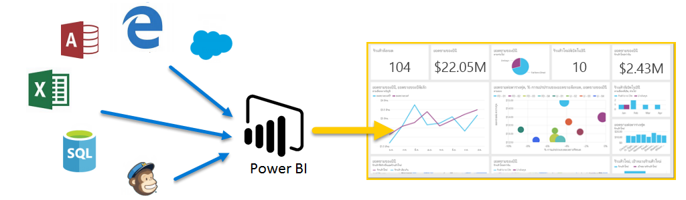
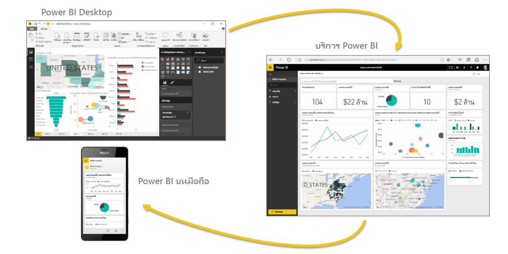

ยินดีต้อนรับสู่**การเรียนรู้พร้อมคำแนะนำ**สำหรับ Power BIWelcome to **Guided Learning** for Power BI. หลักสูตรเรียนรู้ด้วยตนเองทางออนไลน์นี้จะอธิบาย Power BI ตามลำดับ ดังนั้น คุณจึงสามารถสร้างความรู้ของคุณได้ตั้งแต่พื้นฐานThis self-paced online course explains Power BI in a sequential way, so you can build your knowledge from the ground up.

หลักสูตรถูกออกแบบให้มีแนวทางที่รวบรัดและเข้าใจได้ง่าย ด้วยลำดับทางตรรกะที่ช่วยให้คุณเรียนรู้แนวคิด รายละเอียด และตัวอย่างThe course is designed to provide guidance in understandable chunks, with logical flow that helps you absorb concepts, details, and examples. ซึ่งรวมถึงการแสดงผลด้วยภาพและวิดีโอจำนวนมากที่จะช่วยให้คุณเรียนรู้เช่นกันIt includes lots of visuals and videos to help you learn, too.

หลักสูตร**การเรียนรู้พร้อมคำแนะนำ**นี้มี**ส่วน**มากมาย และแต่ละส่วนมี**หัวข้อ**อีกหลายหัวข้อThis **Guided Learning** course contains many **sections**, and each section has many **topics**. หลังจากหัวข้อช่วงแรกในส่วน**เริ่มต้นใช้งาน**นี้ เกือบทุกหัวข้อจะมีวิดีโอที่อธิบายสิ่งที่คุณจะได้เรียนรู้After the first few topics in this **Getting Started** section, nearly every topic includes a video describing what you’ll learn. เนื้อหาทางด้านล่างวิดีโอจะอธิบายแนวคิด ทำให้คุณสามารถทบทวนและเรียนรู้ตามที่คุณต้องการได้The content below the video further explains the concept, letting you review and learn at your own pace.

ถ้าคุณเป็น**ผู้เริ่มต้น**ใน Power BI หลักสูตรนี้จะช่วยให้คุณเริ่มต้นใช้งาน และถ้าคุณเป็น**ผู้มีประสบการณ์**ใน Power BI หลักสูตรนี้จะรวบรวมแนวคิดเข้าด้วยกัน และเติมเต็มสิ่งที่คุณขาดIf you're a **beginner** with Power BI this course will get you going, and if you're a Power BI **veteran** this course will tie concepts together, and fill in the gaps. เราหวังว่าคุณจะเพลิดเพลินไปกับหลักสูตรนี้ และคาดหวังจะได้เพิ่มเนื้อหาอื่นๆ อีกในอนาคตWe hope you enjoy the course, and look forward to including more content in the future.

## Power BI คืออะไรWhat is Power BI?
**Power BI** คือคอลเลกชันของบริการซอฟต์แวร์ แอป และตัวเชื่อมต่อที่ทำงานร่วมกันเพื่อเปลี่ยนแหล่งข้อมูลที่ไม่เกี่ยวข้องของคุณให้เป็นข้อมูลเชิงลึกที่สอดคล้องกัน แสดงข้อมูลได้ และโต้ตอบได้**Power BI** is a collection of software services, apps, and connectors that work together to turn your unrelated sources of data into coherent, visually immersive, and interactive insights. ไม่ว่าข้อมูลของคุณจะเป็นสเปรดชีต Excel ง่ายๆ หรือคอลเลกชันของคลังข้อมูลแบบไฮบริดบนระบบคลาวด์และในองค์กร **Power BI** จะช่วยให้คุณเชื่อมต่อกับแหล่งข้อมูลของคุณ แสดง (หรือค้นพบ) ข้อมูลสำคัญ และแชร์ข้อมูลนั้นกับใครก็ตามหรือทุกคนที่คุณต้องการได้อย่างง่ายดายWhether your data is a simple Excel spreadsheet, or a collection of cloud-based and on-premises hybrid data warehouses, **Power BI** lets you easily connect to your data sources, visualize (or discover) what’s important, and share that with anyone or everyone you want.

**Power BI** สามารถใช้งานได้ง่ายและสะดวก – สามารถสร้างข้อมูลเชิงลึกด่วนจากสเปรดชีต Excel หรือฐานข้อมูลในเครื่อง**Power BI** can be simple and fast – capable of creating quick insights from an Excel spreadsheet or a local database. แต่ **Power BI** ยังทนทานและเป็นเครื่องมือระดับองค์กร พร้อมสำหรับการวางรูปแบบพิเศษและการวิเคราะห์แบบเรียลไทม์ เช่นเดียวกับการพัฒนาที่กำหนดเองBut **Power BI** is also robust and enterprise-grade, ready for extensive modeling and real-time analytics, as well as custom development. ดังนั้น จึงสามารถเป็นรายงานส่วนบุคคลและเครื่องมือการจัดรูปแบบการแสดงข้อมูลของคุณ และยังสามารถทำหน้าที่เป็นเครื่องมือวิเคราะห์และตัดสินใจในโครงการกลุ่ม แผนก หรือทั้งองค์กรSo it can be your personal report and visualization tool, and can also serve as the analytics and decision engine behind group projects, divisions, or entire corporations.

## ส่วนต่างๆ ของ Power BIThe parts of Power BI
Power BI มีแอปพลิเคชันบนเดสก์ท็อป Windows ที่เรียกว่า **Power BI Desktop** และบริการ SaaS (*Software as a Service*) ออนไลน์ที่เรียกว่า**บริการ Power BI** และ**แอป** Power BI สำหรับอุปกรณ์เคลื่อนที่ที่พร้อมใช้งานบนโทรศัพท์และแท็บเล็ต Windows และอุปกรณ์ iOS และ AndroidPower BI consists of a Windows desktop application called **Power BI Desktop**, an online SaaS (*Software as a Service*) service called the **Power BI service**, and mobile Power BI **apps** available on Windows phones and tablets, as well as for iOS and Android devices.

สามองค์ประกอบเหล่านี้ – **Desktop** **บริการ** และ **Mobile** – ได้รับการออกแบบให้ช่วยผู้ใช้ในการสร้าง แชร์ และใช้ข้อมูลเชิงลึกทางธุรกิจด้วยวิธีที่พวกเขาหรือบทบาทของพวกเขาต้องการได้อย่างมีประสิทธิภาพสูงสุดThese three elements – the **Desktop**, the **service**, and **Mobile** – are designed to let people create, share, and consume business insights in the way that serves them, or their role, most effectively.

## Power BI เหมาะสมกับบทบาทของคุณอย่างไรHow Power BI matches your role
วิธีที่คุณใช้ Power BI อาจขึ้นอยู่กับบทบาทของคุณในโครงการหรือในทีมHow you use Power BI may depend on your role in a project or on a team. และผู้อื่น ในบทบาทอื่น อาจใช้ Power BI แตกต่างกันไป ซึ่งเป็นสิ่งที่สามารถทำได้And other people, in other roles, might use Power BI differently, which is just fine.

ตัวอย่างเช่น คุณอาจใช้**บริการ Power BI**  เป็นหลัก แต่เพื่อนร่วมงานที่ทำงานกับตัวเลขและสร้างรายงานทางธุรกิจอาจใช้งาน **Power BI Desktop** (และเผยแพร่รายการเดสก์ท็อปไปยังบริการ Power BI ซึ่งคุณสามารถดูได้)For example, you might primarily use the **Power BI service**, but your number-crunching, business-report-creating coworker might make extensive use of **Power BI Desktop** (and publish Desktop reports to the Power BI service, which you then view). และเพื่อนร่วมงานคนอื่นๆ ในแผนกการขายอาจใช้แอป Power BI บนโทรศัพท์เพื่อตรวจดูความคืบหน้าของโควต้าการขาย และดูรายละเอียดลูกค้าเป้าหมายAnd another coworker, in sales, might mainly use Power BI phone app to monitor progress on sales quotas, and to drill into new sales lead details.

คุณยังอาจใช้แต่ละองค์ประกอบของ **Power BI** ในช่วงเวลาที่ต่างกัน โดยขึ้นอยู่กับสิ่งที่คุณต้องการทำหรือบทบาทของคุณในโครงการหรือการทำงานYou also might use each element of **Power BI** at different times, depending on what you’re trying to achieve or what your role is for a given project or effort.

คุณอาจดูสินค้าคงคลังและกระบวนการผลิตในแดชบอร์ดแบบเรียลไทม์ในบริการ และยังใช้ **Power BI Desktop** ในการสร้างรายงานเกี่ยวกับการส่วนมีส่วนร่วมกับลูกค้าสำหรับทีมของคุณเองPerhaps you view inventory and manufacturing progress in a real-time dashboard in the service, and also use **Power BI Desktop** to create reports for your own team about customer engagement statistics. วิธีที่คุณใช้ Power BI อาจขึ้นอยู่กับฟีเจอร์หรือบริการของ Power BI ที่เป็นเครื่องมือที่ดีที่สุดสำหรับสถานการณ์ของคุณ แต่ทุกส่วนของ Power BI พร้อมใช้งานสำหรับคุณ ทำให้มีความยืดหยุ่นและน่าสนใจHow you use Power BI can be based on which feature or service of Power BI is the best tool for your situation – but each part of Power BI is available to you, which is why it’s so flexible and compelling.

เราจะอธิบายทั้งสามองค์ประกอบเหล่านี้ – **Desktop** **บริการ** และแอป **Mobile** – ด้วยรายละเอียดเพิ่มเติมในภายหลังในหลังใน**การเรียนรู้พร้อมคำแนะนำ**นี้We discuss these three elements – the **Desktop**, **service**, and **Mobile** apps – with more detail a little later in this **Guided Learning** course. เรายังจะสร้างรายงานใน Power BI Desktop แชร์ในบริการ และเจาะลึกบนอุปกรณ์เคลื่อนที่ของเราในบทความถัดจากนี้ เช่นกันWe’ll also create reports in Power BI Desktop, share them in the service, and drill into them on our Mobile device in upcoming articles, too.

## ลำดับการทำงานใน Power BIThe flow of work in Power BI
ลำดับการทำงานใน Power BI เริ่มต้นใน **Power BI Desktop** ซึ่งเป็นที่สร้างรายงานA common flow of work in Power BI begins in **Power BI Desktop**, where a report is created. รายงานนั้นจะถูกเผยแพร่ไปยัง**บริการ** Power BI และแชร์กับผู้ใช้แอป **Power BI บนมือถือ** ที่สามารถใช้ข้อมูลThat report is then published to the Power BI **service**, and then shared so users of **Power BI Mobile** apps can consume the information.

ซึ่งอาจไม่ได้เป็นตามลำดับนี้ทุกครั้งซึ่งเกิดขึ้นได้ แต่เราจะใช้ลำดับนั้นในการช่วยให้คุณเรียนรู้ส่วนต่างๆ ของ Power BI และวิธีที่แต่ละส่วนเติมเต็มส่วนอื่นๆIt doesn’t always happen that way, and that’s okay, but we’ll use that flow to help you learn the various parts of Power BI, and how they complement one another.

เอาล่ะ ตอนนี้เราอธิบายภาพรวมของหลักสูตรนี้ หน้าที่ของ Power BI และองค์ประกอบหลักทั้งสาม มาดูที่ลักษณะการใช้งาน **Power BI** กันเถอะOkay, now that we have an overview of this course, what Power BI is, and its three main elements, let's take a look at what using **Power BI** is like.

