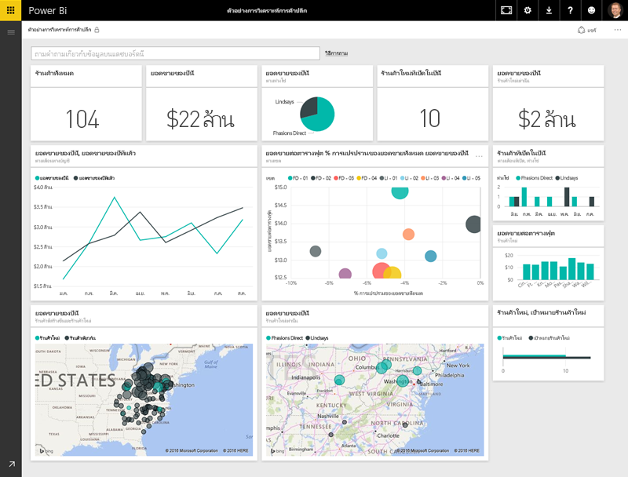
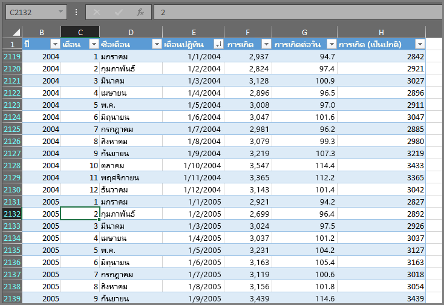
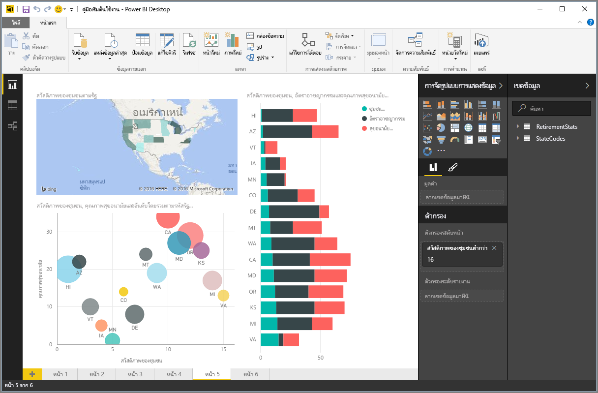
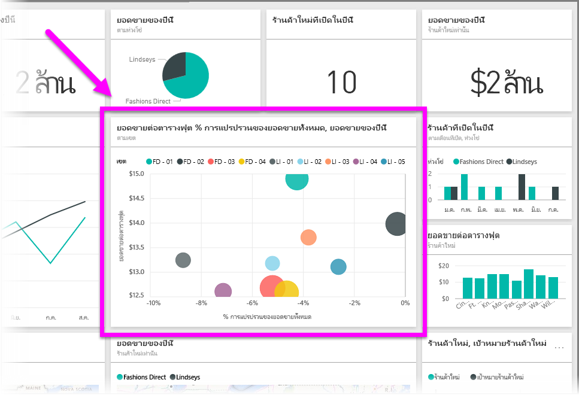

ทุกอย่างที่คุณทำใน Power BI สามารถแบ่งเป็น**โครงสร้าง**พื้นฐานหลายส่วนEverything you do in Power BI can be broken down into a few basic **building blocks**. เมื่อคุณเข้าใจโครงสร้างเหล่านี้ คุณจะสามารถใช้งานแต่ละส่วนได้ดียิ่งขึ้นและเริ่มสร้างรายงานที่ละเอียดและซับซ้อนได้Once you understand these building blocks, you can expand on each of them and begin creating elaborate and complex reports. แม้แต่สิ่งที่ซับซ้อนที่สุดก็ถูกสร้างขึ้นจากโครงสร้างพื้นฐาน เช่นเดียวกับที่อาคารถูกสร้างขึ้นจากไม้ เหล็ก คอนกรีต และกระจกAfter all, even seemingly complex things are built from basic building blocks – buildings are created with wood, steel, concrete and glass. รถยนต์ทำมาจากเหล็ก ผ้า และยางCars are made from metal, fabric, and rubber. แน่นอน อาคารและรถยนต์อาจมีรูปแบบพื้นฐานหรือซับซ้อนได้เช่นกัน โดยขึ้นอยู่กับวิธีการจัดโครงสร้างพื้นฐานเหล่านั้นOf course, buildings and cars can be basic or elaborate as well – depending on how those basic building blocks are arranged.

มาดูที่โครงสร้างพื้นฐานเหล่านี้ เรียนรู้สิ่งง่ายๆ ที่สามารถสร้างขึ้นได้ แล้วดูสิ่งที่ซับซ้อนที่สามารถสร้างขึ้นได้เช่นกันLet’s take a look at these basic building blocks, discuss some simple things that can be built with them, then provide a glimpse into how complex things can be created as well.

โครงสร้างพื้นฐานใน Power BI มีดังต่อไปนี้:The basic building blocks in Power BI are the following:

* การจัดรูปแบบการแสดงข้อมูลVisualizations
* ชุดข้อมูลDatasets
* รายงานReports
* แดชบอร์ดDashboards
* ไทล์Tiles

## การจัดรูปแบบการแสดงข้อมูลVisualizations
**การจัดรูปแบบการแสดงข้อมูล** (ในบางครั้งจะเรียกว่า **การแสดงผลด้วยภาพ**) คือการแสดงแทนข้อมูล เช่น แผนภูมิ กราฟ แผนที่รหัสสี หรือสิ่งที่น่าสนใจอื่นๆ ที่คุณสามารถสร้างขึ้นเพื่อแสดงแทนข้อมูลของคุณA **visualization** (sometimes also referred to as a **visual**) is a visual representation of data, such as a chart, a graph, a color-coded map, or other interesting things you can create to represent your data visually. Power BI มีชนิดการจัดรูปแบบการแสดงข้อมูลทุกชนิด และมีชนิดอื่นๆ เพิ่มเข้ามาตลอดเวลาPower BI has all sorts of different visualization types, and more coming all the time. รูปภาพต่อไปนี้แสดงคอลเลกชันของการจัดรูปแบบการแสดงข้อมูลต่างๆ ที่ถูกสร้างขึ้นในบริการ Power BIThe following image shows a collection of different visualizations that were created in the Power BI service.

การจัดรูปแบบการแสดงข้อมูลอาจไม่ซับซ้อน เช่น ตัวเลขเดียวที่แสดงถึงสิ่งสำคัญ หรืออาจซับซ้อน เช่น แผนที่ไล่ระดับสีที่แสดงทัศนคติต่อปัญหาทางสังคมหรือความกังวลVisualizations can be simple – like a single number that represents something significant – or they can be visually complex – like a gradient-colored map that shows voter sentiment toward a certain social issue or concern. เป้าหมายของการแสดงผลด้วยภาพคือเพื่อแสดงข้อมูลด้วยวิธีที่มีบริบทและข้อมูลเชิงลึก ซึ่งอาจแสดงด้วยตารางข้อมูลตัวเลขหรือข้อความได้ยากลำบากThe goal of a visual is to present data in a way that provides context and insights, either of which would likely be difficult to discern from a raw table of numbers or text.

## ชุดข้อมูลDatasets
**ชุดข้อมูล**คือคอลเลกชันของข้อมูลที่ Power BI ใช้ในการสร้างการจัดรูปแบบการแสดงข้อมูลA **dataset** is a collection of data that Power BI uses to create its visualizations.

คุณสามารถสร้างฐานข้อมูลง่ายๆ โดยยึดตามตารางเดียวจากเวิร์กบุ๊ก Excel คล้ายกับที่แสดงในรูปภาพต่อไปนี้You can have a simple dataset based on a single table from Excel workbook, similar to what’s shown in the following image.

**ชุดข้อมูล**ยังสามารถเป็นการผสมผสานของแหล่งข้อมูลต่างๆ มากมาย ซึ่งคุณสามารถกรองและผสมเพื่อให้ได้ข้อมูลคอลเลกชันที่ไม่ซ้ำกัน (ชุดข้อมูล) สำหรับใช้ใน Power BI**Datasets** can also be a combination of many different sources, which you can filter and combine to provide a unique collection data (a dataset) for use in Power BI.

ตัวอย่างเช่น คุณสามารถสร้างชุดข้อมูลจากสามเขตข้อมูลฐานข้อมูลที่ต่างกัน คือ หนึ่งตารางเว็บไซต์ หนึ่งตาราง Excel และผลลัพธ์ของแคมเปญด้านการตลาดทางอีเมลFor example, you could create a dataset from three different database fields, one website table, an Excel table, and online results of an email marketing campaign. การผสมผสานที่ไม่ซ้ำกันจะยังคงถือเป็นหนึ่ง**ชุดข้อมูล** แม้ว่าจะมีข้อมูลที่ดึงมารวมกันจากหลายแหล่งข้อมูลก็ตามThat unique combination is still considered a single **dataset**, even though it was pulled together from many different sources.

การกรองข้อมูลก่อนที่จะนำเข้าสู่ Power BI จะช่วยให้คุณสามารถเน้นข้อมูลที่สำคัญได้Filtering data before bringing it into Power BI lets you focus on the data that matters to you. ตัวอย่างเช่น คุณสามารถกรองฐานข้อมูลที่ติดต่อของคุณเพื่อให้มีเฉพาะลูกค้าที่รับอีเมลจากแคมเปญด้านการตลาดอยู่ในฐานข้อมูลFor example, you could filter your contact database so only customers who received emails from the marketing campaign were included in the dataset. จากนั้น คุณสามารถสร้างการแสดงผลด้วยภาพโดยยึดตามชุดย่อย (คอลเลกชันที่กรองแล้ว) ของลูกค้าที่เข้าร่วมแคมเปญThen you could create visuals based on that subset (that filtered collection) of customers who were included in the campaign. การกรองจะช่วยให้คุณเน้นข้อมูลของคุณ และการทำงานของคุณFiltering helps you focus your data, and your efforts.

ส่วนสำคัญและเปิดใช้งานอยู่ของ Power BI คือ**ตัวเชื่อมต่อ**ข้อมูลที่หลากหลายที่รวมอยู่An important and enabling part of Power BI is the multitude of data **connectors** that are included. ไม่ว่าข้อมูลที่คุณต้องการจะอยู่ใน Excel หรือฐานข้อมูล SQL ใน Azure หรือ Oracle หรือในบริการอย่าง Facebook, Salesforce หรือ MailChimp Power BI ก็มีตัวเชื่อมต่อข้อมูลที่มีอยู่ภายในที่จะช่วยให้คุณสามารถเชื่อมต่อกับข้อมูลนั้น กรองหากจำเป็น และนำเข้าสู่ชุดข้อมูลของคุณได้อย่างง่ายดายWhether the data you want is in Excel or an SQL database, in Azure or Oracle, or in a service like Facebook, Salesforce, or MailChimp, Power BI has built-in data connectors that let you easily connect to that data, filter it if necessary, and bring it into your dataset.

เมื่อคุณมีชุดข้อมูลแล้ว คุณสามารถเริ่มสร้างการจัดรูปแบบการแสดงข้อมูลที่แสดงส่วนต่างๆ ของชุดข้อมูลนั้นด้วยวิธีต่างๆ แล้วดูข้อมูลเชิงลึกจากสิ่งที่คุณเห็นOnce you have a dataset, you can begin creating visualizations that display different portions of that dataset in different ways, and with what you see, gain insights. ซึ่งเป็นส่วนที่รายงานเข้ามามีบทบาทThat’s where reports come in.

## รายงานReports
ใน Power BI **รายงาน**คือคอลเลกชันของการจัดรูปแบบการแสดงข้อมูลที่ปรากฏขึ้นร่วมกันบนหนึ่งหน้าหรือมากกว่าIn Power BI, a **report** is a collection of visualizations that appear together on one or more pages. คล้ายกับรายการอื่นๆ คุณอาจสร้างสำหรับงานนำเสนอยอดขาย หรือรายงานที่คุณเขียนสำหรับงานที่ได้รับมอบหมายจากโรงเรียน ใน Power BI **รายงาน**คือคอลเลกชันของรายการที่เกี่ยวข้องกันJust like any other report you might create for a sales presentation, or a report you would write for a school assignment, in Power BI a **report** is a collection of items that are related to one another. รูปภาพต่อไปนี้แสดง**รายงาน**ใน Power BI Desktop ในกรณีนี้ คือหน้าที่ห้าในรายงานหกหน้าThe following image shows a **report** in Power BI Desktop – in this case, it’s the fifth page in a six-page report. คุณยังสามารถสร้างรายงานในบริการ Power BI ได้อีกด้วยYou can also create reports in the Power BI service.

รายงานจะช่วยให้คุณสามารถสร้างการจัดรูปแบบการแสดงข้อมูลได้มากมายในหลายหน้าถ้าจำเป็น และช่วยให้คุณสามารถจัดเรียงด้วยวิธีที่ถ่ายทอดเรื่องราวของคุณได้ดีที่สุดReports let you create many visualizations, on multiple different pages if necessary, and lets you arrange them in whatever way best tells your story.

คุณอาจมีรายงานเกี่ยวกับยอดขายรายไตรมาส รายงานเกี่ยวกับการเติบโตของผลิตภัณฑ์ในเฉพาะส่วน หรือคุณอาจสร้างรายงานเกี่ยวกับรูปแบบการย้ายถิ่นของหมีโพลาYou might have a report about quarterly sales, a report about product growth in a particular segment, or you might create a report about migration patterns of polar bears. ไม่ว่าเรื่องราวของคุณจะเกี่ยวกับอะไร รายงานก็สามารถช่วยให้คุณรวบรวมและจัดระเบียบการจัดรูปแบบการแสดงข้อมูลได้บนหนึ่งหน้า (หรือมากกว่า)Whatever your subject may be, reports let you gather and organize your visualizations onto one (or more) pages.

## แดชบอร์ดDashboards
เมื่อคุณพร้อมที่จะแชร์หน้าหนึ่งจากรายงาน หรือแชร์คอลเลกชันของการจัดรูปแบบการแสดงข้อมูล คุณสามารถสร้าง**แดชบอร์ด**When you’re ready to share a single page from a report, or share a collection of visualizations, you create a **dashboard**. คล้ายกับแดชบอร์ดในรถยนต์ **แดชบอร์ด** Power BI คือคอลเลกชันของการแสดงผลด้วยภาพจากหนึ่งหน้าที่คุณสามารถแชร์กับผู้อื่นMuch like the dashboard in a car, a Power BI **dashboard** is a collection of visuals from a single page that you can share with others. บ่อยครั้ง ที่จะเป็นกลุ่มการแสดงผลด้วยภาพที่เลือกที่ให้ข้อมูลเชิงลึกด่วนที่เป็นข้อมูลหรือเรื่องราวที่คุณพยายามนำเสนอOften, it’s a selected group of visuals that provide quick insight into the data or story you’re trying to present.

แดชบอร์ดต้องมีขนาดพอดีกับหนึ่งหน้า ซึ่งมักจะเรียกว่าพื้นที่วาดรูป (พื้นที่วาดรูปคือพื้นหลังที่ว่างเปล่าใน Power BI Desktop หรือบริการ ที่คุณวางการจัดรูปแบบการแสดงข้อมูล)A dashboard has to fit on a single page, often called a canvas (the canvas is the blank backdrop in Power BI Desktop, or the service, where you place visualizations). ลองนึกว่าคล้ายกับพื้นที่วาดรูปที่ศิลปินหรือจิตรกรใช้ พื้นที่ทำงานที่คุณสร้าง ผสม และปรับปรุงจุดที่น่าสนใจ และการแสดงผลด้วยภาพที่ดึงดูดความสนใจThink of it like the canvas that an artist or painter uses – a workspace where you create, combine, and rework interesting and compelling visuals.
คุณสามารถแชร์แดชบอร์ดกับผู้อื่นหรือกลุ่ม ซึ่งจะสามารถโต้ตอบกับแดชบอร์ดของคุณเมื่อพวกเขาใช้บริการ Powre BI หรือบนอุปกรณ์เคลื่อนที่ของพวกเขาYou can share dashboards with other users or groups, who can then interact with your dashboard when they’re in Power BI service, or on their mobile device.

## ไทล์Tiles
ใน Power BI **ไทล์**คือการจัดรูปแบบการแสดงผลด้วยภาพที่พบในรายงานหรือบนแดชบอร์ดIn Power BI, a **tile** is a single visualization found in a report or on a dashboard. ซึ่งเป็นกล่องสี่เหลี่ยมผืนผ้าที่มีการแสดงผลด้วยภาพแต่ละรายการIt’s the rectangular box that contains each individual visual. ในรูปภาพต่อไปนี้ คุณจะเห็นหนึ่งไทล์ (เน้นด้วยกล่องสว่าง) ที่ถูกล้อมรอบด้วยไทล์อื่นๆIn the following image, you see one tile (highlighted by a bright box) which is also surrounded by other tiles.

เมื่อคุณ*กำลังสร้าง*รายงานหรือแดชบอร์ดใน Power BI คุณสามารถย้ายหรือจัดเรียงไทล์ได้ตามที่คุณต้องการนำเสนอข้อมูลของคุณWhen you’re *creating* a report or a dashboard in Power BI, you can move or arrange tiles however you want to present your information. คุณสามารถทำให้ไทล์ใหญ่ขึ้น เปลี่ยนความสูงหรือความกว้าง และจัดชิดกับไทล์อื่นๆ ตามที่คุณต้องการYou can make them bigger, change their height or width, and snuggle them up to other tiles however you want.

เมื่อคุณ*กำลังดู*หรือ*กำลังใช้*แดชบอร์ดหรือรายงาน ซึ่งหมายความว่าคุณไม่ใช่ผู้สร้างหรือเจ้าของ แต่ถูกแชร์กับคุณ คุณสามารถโต้ตอบได้แต่ไม่สามารถเปลี่ยนแปลงขนาดของไทล์หรือเปลี่ยนการจัดเรียงได้When you’re *viewing*, or *consuming* a dashboard or report – which means you’re not the creator or owner, but it’s been shared with you – you can interact with it, but not change the size of the tiles or change how they’re arranged.

## เมื่อรวมกันแล้วAll together now
สิ่งเหล่านั้นคือพื้นฐานของ Power BI และเป็นโครงสร้างThose are the basics of Power BI, and its building blocks. มาใช้เวลาสักครู่เพื่อทบทวนLet’s take a moment to review.

Power BI คือคอลเลกชันของบริการ แอป และตัวเชื่อมต่อที่ทำให้คุณสามารถเชื่อมต่อข้อมูลของคุณ – ไม่ว่าจะอยู่ที่ไหนก็ตาม – กรองข้อมูลหากจำเป็น แล้วนำเข้าสู่ Power BI ซึ่งคุณสามารถสร้างการจัดรูปแบบการแสดงข้อมูลที่น่าสนใจที่คุณสามารถแชร์กับผู้อื่นได้Power BI is a collection of services, apps, and connectors that enables you to connect to your data – wherever it happens to reside – filter it if necessary, then bring it into Power BI where you can create compelling visualizations you can share with others.  

ในตอนนี้ คุณเข้าใจประโยชน์ของโครงสร้างของ Power BI แล้ว คุณสามารถสร้างชุดข้อมูลที่*คุณ*สามารถเข้าใจได้ และสร้างรายงานที่ดึงดูดความสนใจที่บอกเล่าเรื่องราวของคุณNow that you understand the handful of basic building blocks of Power BI, it becomes clear that you can create datasets that make sense *to you*, and create visually compelling reports that tell your story. เรื่องราวที่บอกเล่าด้วย Power BI ไม่จำเป็นต้องซับซ้อน หรือยุ่งยาก เพื่อให้ดึงดูดความสนใจStories told with Power BI don’t have to be complex, or complicated, to be compelling.

สำหรับผู้ใช้บางราย การใช้ตาราง Excel เดียวในชุดข้อมูล แล้วแชร์แดชบอร์ดกับทีมของพวกเขา เป็นวิธีสะดวกอย่างไม่น่าเชื่อในการใช้ Power BIFor some people, using a single Excel table in a dataset, then sharing a dashboard with their team, will be an incredibly valuable way to use Power BI.

สำหรับผู้อื่น การใช้ตารางคลังข้อมูล Azure SQL แบบเรียลไทม์ที่ผสมกับฐานข้อมูลอื่นๆ และแหล่งข้อมูลแบบเรียลไทม์ ที่กรองแบบเรียลไทม์เพื่อสร้างชุดข้อมูลที่ตรวจดูกระบวนการผลิตตลอดเวลาคือคุณค่าใน Power BI ที่พวกเขาค้นหาFor others, using real-time Azure SQL Data Warehouse tables that combine with other databases and real-time source, which then get filtered in real-time to build a dataset that monitors moment-by-moment manufacturing progress will be the value in Power BI that they seek.

สำหรับผู้ใช้ทั้งสองแบบ กระบวนการจะเหมือนกัน: สร้างชุดข้อมูล สร้างการแสดงผลด้วยภาพที่ดึงดูดความสนใจ และแชร์กับผู้อื่นFor both, the process is the same: create datasets, build compelling visuals, and share them with others. และในทางที่คล้ายกัน ผลลัพธ์ของผู้ใช้ทั้งสองแบบ (สำหรับแต่ละแบบ) จะเหมือนกัน: ควบคุมโลกของข้อมูลที่ขยายตัวตลอดเวลาของคุณ และเปลี่ยนเป็นข้อมูลเชิงลึกที่สามารถดำเนินการได้And similarly, the result of both (for each) is the same: harness your ever-expanding world of data, and turn it into actionable insights.

ไม่ว่าข้อมูลเชิงลึกของคุณจะใช้ชุดข้อมูลแบบตรงไปตรงมาหรือแบบซับซ้อน Power BI ก็สามารถช่วยให้คุณเริ่มต้นใช้งานได้อย่างรวดเร็ว และสามารถปรับเปลี่ยนได้ตามความต้องการของคุณตามความซับซ้อนที่โลกของข้อมูลของคุณต้องใช้Whether your data insights require straightforward or complex datasets, Power BI helps you get started quickly, and can expand with your needs to be as complex as your world of data requires. และเนื่องจาก Power BI เป็นผลิตภัณฑ์ของ Microsoft คุณสามารถคาดหวังในด้านความทนทาน การประยุกต์ใช้ ใช้งานร่วมกับ Office และพร้อมสำหรับองค์กรAnd since Power BI is a Microsoft product, you can count on it being robust, extensible, Office-friendly, and enterprise-ready.

ในตอนนี้ มาดูวิธีการทำงานกันเถอะNow, let's see how this works. เราจะเริ่มด้วยการดูที่บริการ Power BIWe'll start by taking a quick look at the Power BI service.

