ในหัวข้อนี้ เราจะมาดูรายละเอียดของการทำงานร่วมกันของสองส่วนแรกของ Power BIIn this topic, we take a closer look at how the first two parts of Power BI fit together:

* สร้างรายงานใน **Power BI Desktop**Create a report in **Power BI Desktop**
* เผยแพร่รายงานใน**บริการของ Power BI**Publish the report in the **Power BI service**

เราจะเริ่มต้นใน Power BI Desktop แล้วเลือก **รับข้อมูล**We’ll start in Power BI Desktop, and select **Get Data**. คอลเลกชันของแหล่งข้อมูลจะปรากฏขึ้น ทำให้คุณเลือกแหล่งข้อมูลได้The collection of data sources appears, allowing you to choose a data source. รูปภาพต่อไปนี้แสดงการเลือกหน้าเว็บเป็นแหล่งข้อมูล ในวิดีโอทางด้านบน Will จะเลือกเวิร์กบุ๊ก **Excel**The following image shows selecting a Web page as the source, in the video above, Will selected an **Excel** workbook.

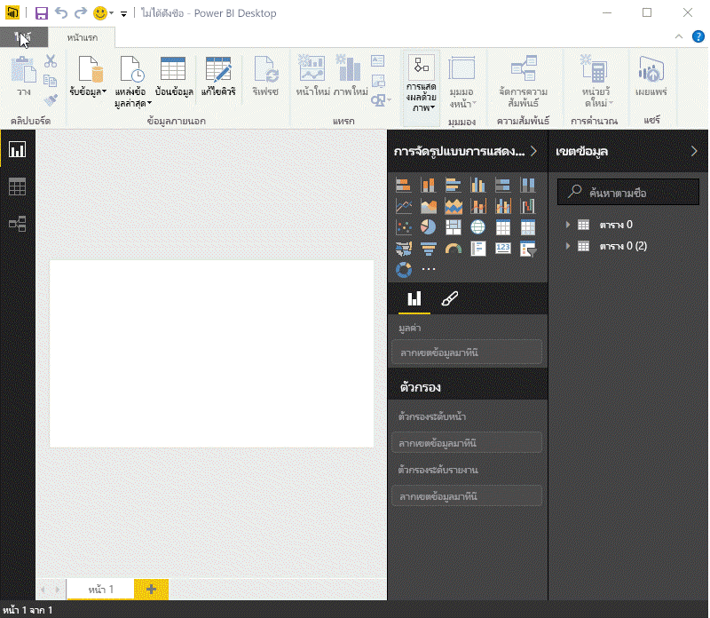

ไม่ว่าคุณจะเลือกแหล่งข้อมูลใด Power BI จะเชื่อมต่อกับแหล่งข้อมูลนั้นและแสดงข้อมูลที่พร้อมใช้งานจากแหล่งข้อมูลดังกล่าวRegardless of which data source you choose, Power BI connects to that data source, and shows you the data available from that source. รูปภาพต่อไปนี้เป็นอีกตัวอย่างหนึ่ง แหล่งข้อมูลนี้มาจากหน้าเว็บที่วิเคราะห์รัฐต่างๆ และสถิติการเกษียณที่น่าสนใจบางอย่างThe following image is another example, this one is from a Web page that analyzes different states and some interesting retirement statistics.

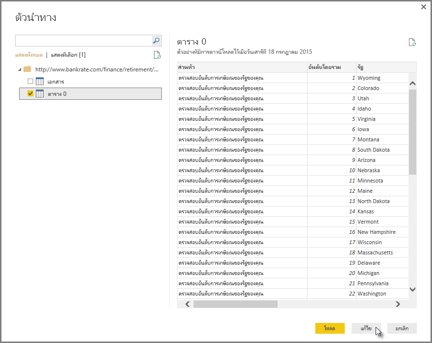

ในมุมมอง **รายงาน** ของ Power BI Desktop คุณสามารถเริ่มสร้างรายงานได้In Power BI Desktop **Report** view, you can begin to build reports.

มุมมอง **รายงาน** มีพื้นที่หลักห้าพื้นที่:The **Report** view has five main areas:

1. Ribbon ที่แสดงงานทั่วไปที่เชื่อมโยงกับรายงานและการแสดงภาพThe ribbon, which displays common tasks associated with reports and visualizations
2. มุมมอง **รายงาน** หรือพื้นที่รายงาน คือพื้นที่สำหรับสร้างและจัดเรียงการแสดงภาพThe **Report** view, or canvas, where visualizations are created and arranged
3. พื้นที่แท็บ **หน้า** ตลอดแนวด้านล่างมีไว้เพื่อให้คุณเลือกหรือเพิ่มหน้ารายงานThe **Pages** tab area along the bottom, which lets you select or add a report page
4. ช่อง **การแสดงภาพ** คือที่ที่คุณสามารถเปลี่ยนการแสดงภาพ กำหนดค่าสีหรือแกน นำตัวกรองไปใช้ ลากเขตข้อมูล และอื่น ๆ ได้The **Visualizations** pane, where you can change visualizations, customize colors or axes, apply filters, drag fields, and more
5. ช่อง **เขตข้อมูล** คือที่ที่สามารถลากองค์ประกอบคิวรี่และตัวกรองไปยังมุมมอง **รายงาน** หรือลากไปยังพื้นที่ **ตัวกรอง** ของช่อง **การแสดงภาพ** ได้The **Fields** pane, where query elements and filters can be dragged onto the **Report** view, or dragged to the **Filters** area of the **Visualizations** pane

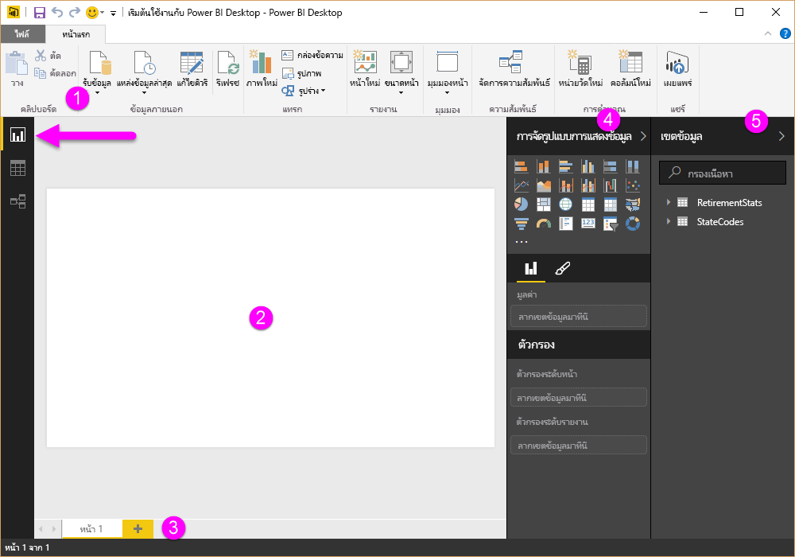

สามารถย่อช่อง **การแสดงภาพ** และ **เขตข้อมูล** ได้โดยการเลือกลูกศรขนาดเล็กที่ขอบ เพื่อให้มีพื้นที่มากขึ้นในมุมมอง **รายงาน** เพื่อสร้างการแสดงภาพที่ยอดเยี่ยมThe **Visualizations** and **Fields** pane can be collapsed by selecting the small arrow along the edge, providing more space in the **Report** view to build cool visualizations. เมื่อปรับเปลี่ยนการแสดงภาพ คุณจะยังเห็นลูกศรเหล่านี้ชี้ขึ้นหรือลง ซึ่งหมายความว่าคุณสามารถขยายหรือย่อส่วนนั้นได้When modifying visualizations, you'll also see these arrows pointing up or down, which means you can expand or collapse that section, accordingly.

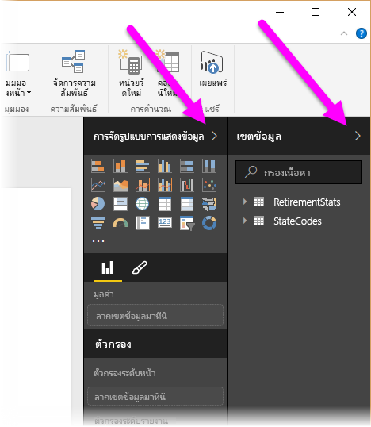

เมื่อต้องการสร้างการจัดรูปแบบการแสดงข้อมูล ให้ลากเขตข้อมูลจากรายการ **เขตข้อมูล** ไปยังมุมมอง **รายงาน**To create a visualization, just drag a field from the **Fields** list onto the **Report** view. ในกรณีนี้ เราจะลากเขตข้อมูล รัฐ จาก *RetirementStats* แล้วดูว่าจะเกิดอะไรขึ้นIn this case, let’s drag the State field from *RetirementStats*, and see what happens.

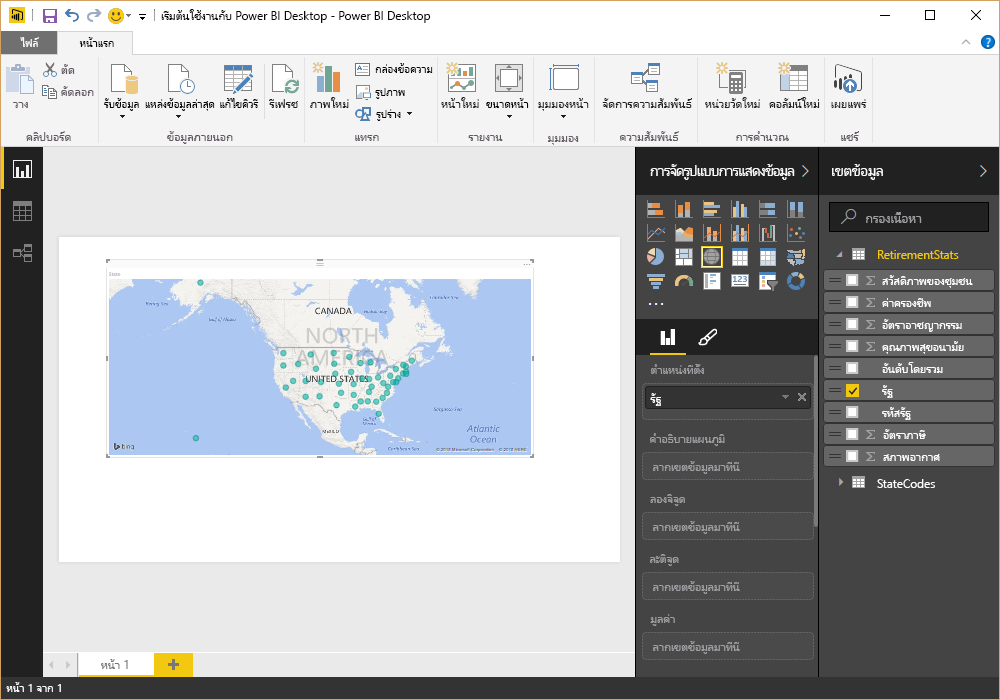

ดูนั่นสิ... Power BI Desktop สร้างการจัดรูปแบบการแสดงข้อมูลที่ยึดตามแผนที่ขึ้นโดยอัตโนมัติ เนื่องจากระบุได้ว่าเขตข้อมูล รัฐ นั้นเป็นข้อมูลทางภูมิศาสตร์Look at that... Power BI Desktop automatically created a map-based visualization, because it recognized that the State field contained geolocation data.

ในตอนนี้ เราจะเร่งความเร็วเล็กน้อย และหลังจากที่สร้างรายงานด้วยการจัดรูปแบบการแสดงข้อมูลแล้ว เราก็พร้อมที่จะเผยแพร่ไปยังบริการของ Power BINow let’s fast-forward a bit, and after creating a report with a few visualizations, we’re ready to publish this to the Power BI service. บน Ribbon **หน้าแรก** ใน Power BI Desktop ให้เลือก **เผยแพร่**On the **Home** ribbon in Power BI Desktop, select **Publish**.

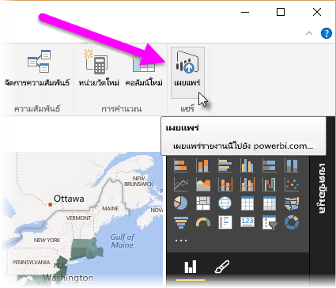

คุณจะได้รับพร้อมท์ให้ลงชื่อเข้าใช้ Power BIYou’ll be prompted to sign in to Power BI.

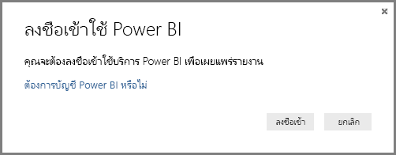

เมื่อคุณลงชื่อเข้าใช้และเผยแพร่เรียบร้อยแล้ว คุณจะเห็นกล่องโต้ตอบต่อไปนี้When you've signed in and the publish process is complete, you see the following dialog. คุณสามารถเลือกลิงก์ (ทางด้านล่างของ**สำเร็จแล้ว!** ) เพื่อไปยังบริการของ Power BI ที่คุณสามารถดูรายงานที่คุณเผยแพร่ได้You can select the link (below **Success!**) to be taken to the Power BI service, where you can see the report you just published.

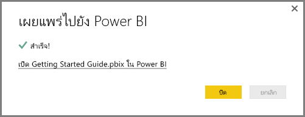

เมื่อคุณลงชื่อเข้าใช้ Power BI คุณจะเห็นไฟล์ Power BI Desktop ที่คุณเพิ่งเผยแพร่ในบริการWhen you sign in to Power BI, you'll see Power BI Desktop file you just published in the service. ในรูปภาพทางด้านล่าง รายงานที่สร้างขึ้นใน Power BI Desktop จะแสดงในส่วน **รายงาน**In the image below, the report created in Power BI Desktop is shown in the **Reports** section.

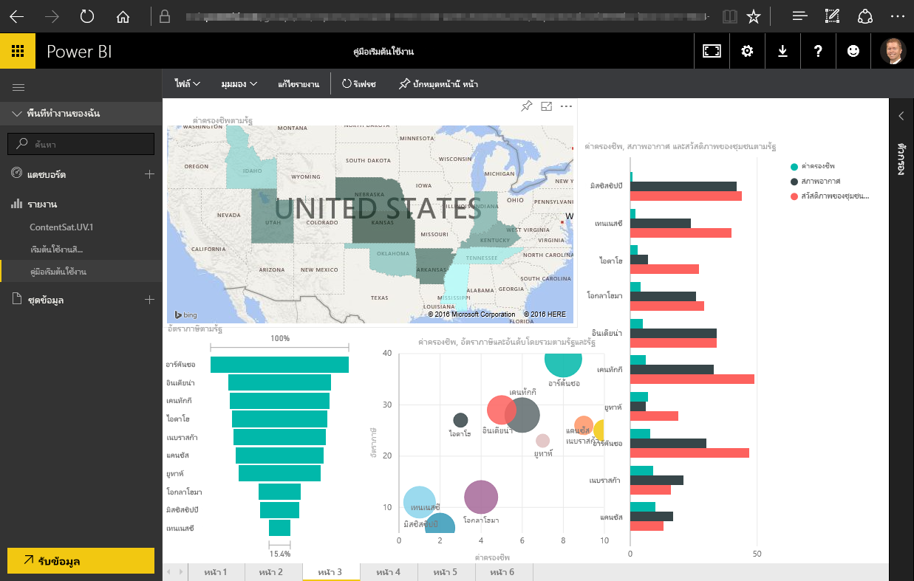

ในรายงานนั้น ผมสามารถเลือกไอคอน **ปักหมุด** เพื่อปักหมุดการแสดงผลด้วยภาพนั้นในแดชบอร์ดได้In that report, I can choose the **Pin** icon to pin that visual to a dashboard. รูปภาพต่อไปนี้แสดงไอคอนปักหมุดที่มีการไฮไลต์ไว้ด้วยกล่องสว่างและลูกศรThe following image shows the pin icon highlighted with a bright box and arrow.

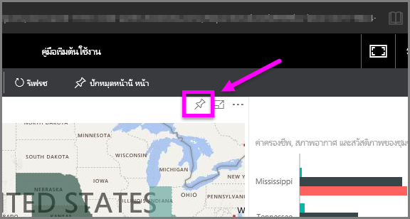

เมื่อผมเลือกแล้ว กล่องโต้ตอบต่อไปนี้จะปรากฏขึ้น ทำให้ผมสามารถปักหมุดการแสดงผลด้วยภาพในแดชบอร์ดที่มีอยู่แล้วได้ หรือสร้างแดชบอร์ดใหม่When I select that, the following dialog appears, letting me pin the visual to an existing dashboard, or to create a new dashboard.

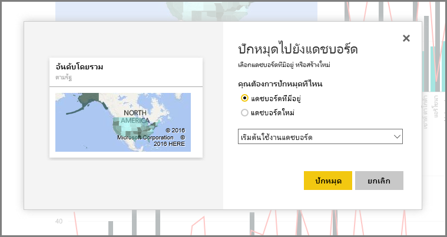

เมื่อเราปักหมุดการแสดงผลด้วยภาพบางส่วนจากรายงานของเราแล้ว เราจะสามารถดูได้ในแดชบอร์ดWhen we pin a couple of visuals from our report, we can see them in the dashboard.

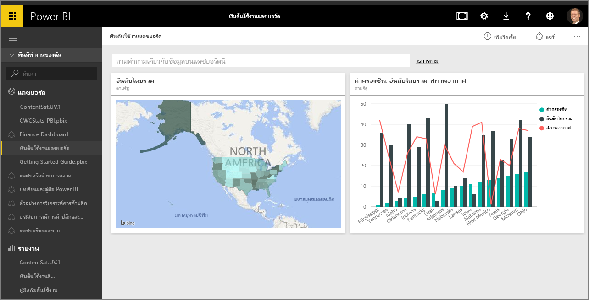

แน่นอนว่ายังมีอีกหลายอย่างที่คุณสามารถทำได้ด้วย Power BI เช่น การแชร์แดชบอร์ดที่คุณสร้างขึ้นThere’s a lot more you can do with Power BI, of course, such as sharing the dashboards you create. เราจะอธิบายการแชร์ในภายหลังในหลักสูตรนี้We'll discuss sharing later on in this course.

ถัดจากนี้ เราจะแนะนำฟีเจอร์ที่สามารถสร้างแดชบอร์ดให้คุณได้โดยอัตโนมัติ เพียงเชื่อมต่อกับบริการระบบคลาวด์ เช่น Facebook, Salesforce และอื่นๆ อีกมากมายNext, we look at a feature that can automatically create dashboards for you, just by connecting to a cloud service like Facebook, Salesforce, and many others.

