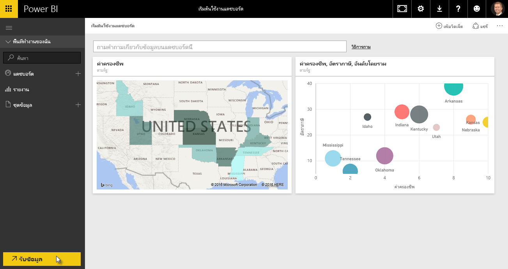
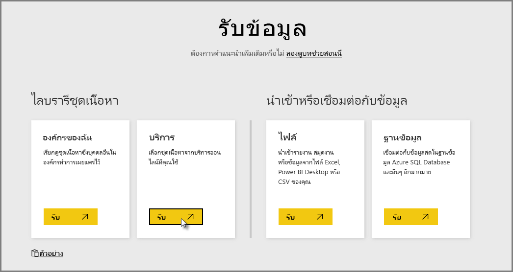
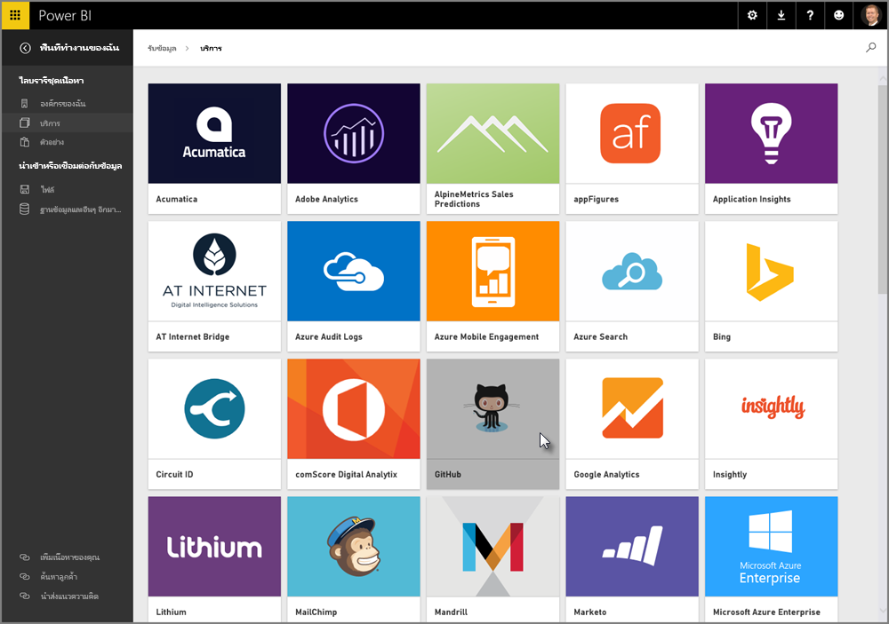
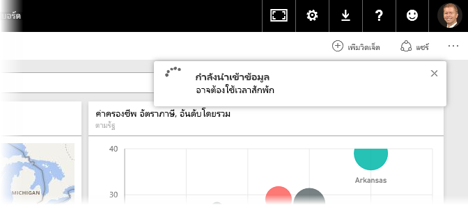
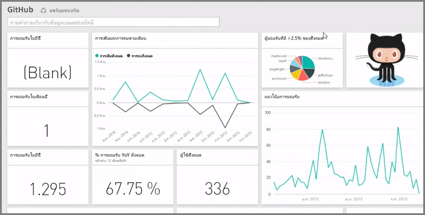
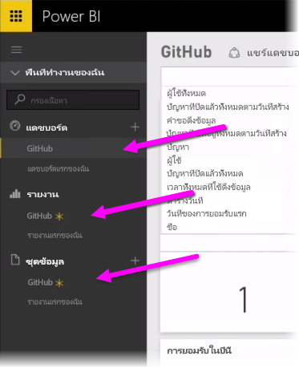
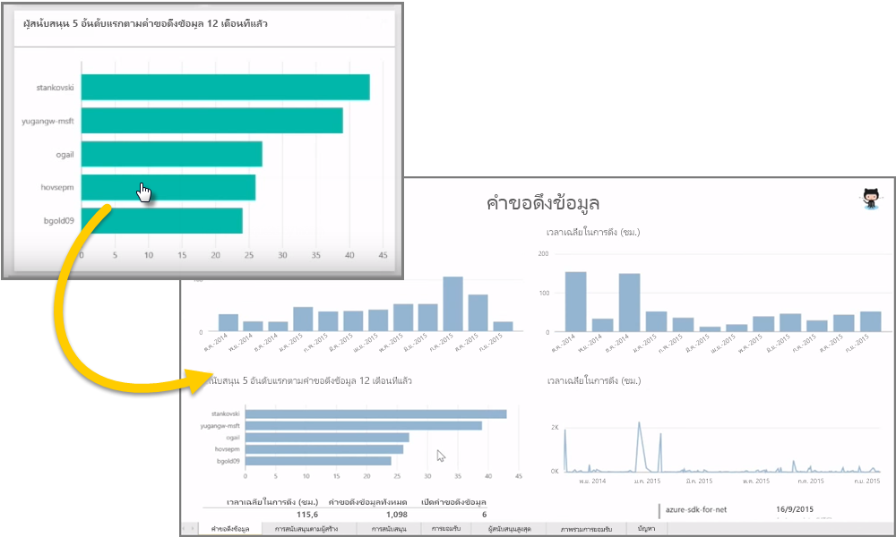
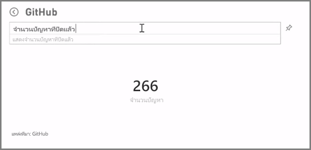
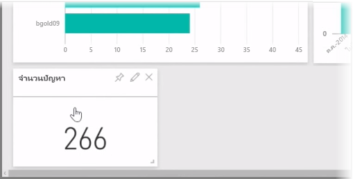
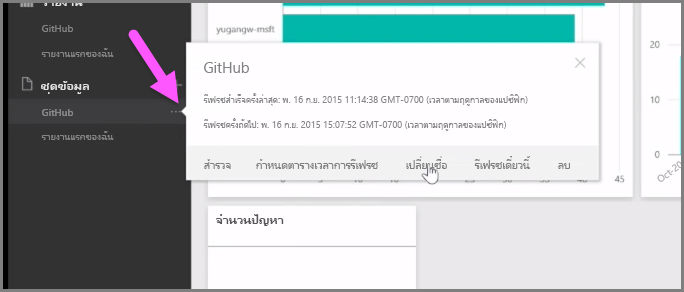

เท่าที่เราได้เรียนรู้มา ลำดับทั่วไปของการทำงานใน Power BI คือสร้างรายงานใน Power BI Desktop เผยแพร่ไปยังบริการของ Power BI แล้วแชร์กับผู้อื่นเพื่อให้พวกเขาสามารถดูได้ในบริการหรือบนแอปสำหรับอุปกรณ์เคลื่อนที่As we learned, the common flow of work in Power BI is to create a report in Power BI Desktop, publish it to the Power BI service, then share it with others so they can view it in the service or on a mobile app.

ผู้ใช้บางรายอาจเริ่มต้นในบริการของ Power BI ดังนั้น เราจะแนะนำข้อมูลคร่าวๆ ของบริการ และเรียนรู้เกี่ยวกับวิธีง่ายๆ ที่เป็นที่นิยมในการสร้างการแสดงผลด้วยภาพอย่างรวดเร็วใน Power BI: *ชุดเนื้อหา*Some people begin in the Power BI service, though, so let's take a quick look at the service, and learn about an easy and popular way to quickly create visuals in Power BI: *content packs*.

**ชุดเนื้อหา**คือคอลเลกชันของการแสดงผลด้วยภาพและรายงานที่กำหนดค่าไว้ล่วงหน้าและพร้อมใช้งานตามแหล่งข้อมูลเฉพาะ เช่น SalesforceA **content pack** is a collection of pre-configured, ready-made visuals and reports based on specific data sources, such as Salesforce. การใช้ชุดเนื้อหาคล้ายกับการไมโครเวฟอาหารค่ำหน้าทีวีหรือการสั่งมื้ออาหารจานด่วน: ด้วยการคลิกเพียงไม่กี่ครั้งและข้อคิดเห็น คุณจะได้รับคอลเลกชันของข้อมูลที่ออกแบบให้เข้ากันอย่างรวดเร็ว ในรูปแบบของชุดข้อมูลที่ดูเรียบร้อยและพร้อมสำหรับนำไปใช้งานUsing a content pack is like microwaving a TV dinner or ordering a fast-food value meal: with just a few clicks and comments, you're quickly served up a collection of entrees designed to go well together, all presented in a tidy, ready-to-consume package.

ดังนั้น มาดูข้อมูลคร่าวๆ เกี่ยวกับชุดเนื้อหา บริการ และวิธีการทำงานกันเถอะSo let's take a quick look at content packs, the service, and how it works. เราจะเจาะลึกรายละเอียดเกี่ยวกับชุดเนื้อหา (และบริการ) ในส่วนถัดจากนี้ คิดว่าเป็นการทดลองชิมอาหารของคุณWe go into more detail about content packs (and the service) in upcoming sections; think of this as a bit of taste-testing to whet your appetite.

## สร้างแดชบอร์ดที่ไม่ซ้ำใครด้วยบริการระบบคลาวด์Create out-of-the-box dashboards with cloud services
เมื่อใช้ Power BI การเชื่อมต่อกับข้อมูลก็เป็นเรื่องง่ายWith Power BI, connecting to data is easy. จากบริการของ Power BI คุณสามารถเลือกปุ่ม **รับข้อมูล** ที่มุมซ้ายล่างของหน้าจอหลักได้From the Power BI service, you can simply select the **Get Data** button in the bottom left corner of the home screen.

*พื้นที่วาดรูป* (พื้นที่ตรงกลางของบริการของ Power BI) จะแสดงแหล่งข้อมูลที่พร้อมใช้งานในบริการของ Power BIThe *canvas* (the area in the center of the Power BI service) shows you the available sources of data in the Power BI service. นอกจากแหล่งข้อมูลทั่วไป เช่น ไฟล์ Excel, ฐานข้อมูล หรือข้อมูล Azure แล้ว Power BI สามารถเชื่อมต่อกับ**บริการซอฟต์แวร์** (หรือที่เรียกว่าผู้ให้บริการ SaaS หรือบริการระบบคลาวด์) เช่น Salesforce, Facebook, Google Analytics และประเภทอื่นทั้งหมดของบริการ SaaS ได้อย่างง่ายดายอีกด้วยIn addition to common data sources such as Excel files, databases, or Azure data, Power BI can connect to **software services** (also called SaaS providers, or cloud services) such as Salesforce, Facebook, Google Analytics, and a whole assortment of other SaaS services just as easily.

จากบริการซอฟต์แวร์เหล่านี้ **บริการของ Power BI** มีคอลเลกชันของการแสดงผลด้วยภาพที่พร้อมใช้งานและจัดเรียงไว้ล่วงหน้าในแดชบอร์ดและรายงาน ซึ่งเรียกว่า **ชุดเนื้อหา**For these software services, the **Power BI service** provides a collection of ready-made visuals, pre-arranged in dashboards and reports called **Content Packs**. ชุดเนื้อหาจะช่วยให้คุณเริ่มต้นและทำงานใน Power BI ได้อย่างรวดเร็วด้วยข้อมูลจากบริการที่คุณเลือกContent packs get you up and running in Power BI quickly with data from the service that you select. ตัวอย่างเช่น เมื่อคุณใช้ชุดเนื้อหา Salesforce, Power BI จะเชื่อมต่อกับบัญชี Salesforce ของคุณ (เมื่อคุณใส่ข้อมูลประจำตัวของคุณ) แล้วใส่คอลเลกชันของการแสดงผลและแดชบอร์ดใน Power BIFor example, when you use the Salesforce content pack, Power BI connects to your Salesforce account (once you provide your credentials) and then populates a pre-defined collection of visuals and dashboards in Power BI.

Power BI มีชุดเนื้อหาสำหรับบริการทุกประเภทPower BI provides content packs for all sorts of services. รูปภาพต่อไปนี้แสดงหน้าจอแรกของบริการ ตามลำดับตัวอักษร ที่แสดงขึ้นเมื่อคุณเลือก **รับ** จากกล่อง **บริการ** (แสดงในรูปภาพก่อนหน้านี้)The following image shows the first screen of services, in alphabetical order, that is displayed when you select **Get** from the **Services** box (shown in the previous image). ตามที่คุณเห็นจากรูปภาพทางด้านล่าง ยังมีสิ่งที่คุณเลือกได้อีกมากมายAs you can see from the image below, there are many to choose from.

เพื่อวัตถุประสงค์ของเรา เราจะเลือก **GitHub**For our purposes, we’ll choose **GitHub**. GitHub คือแอปพลิเคชันสำหรับตัวควบคุมแหล่งข้อมูลออนไลน์GitHub is an application for online source control. เมื่อผมใส่ข้อมูลและข้อมูลประจำตัวสำหรับชุดเนื้อหา GitHub แล้ว ก็จะเริ่มนำเข้าข้อมูลของผมOnce I enter the information and credentials for the GitHub content pack, it begins importing my data.

เมื่อโหลดข้อมูลเรียบร้อยแล้ว แดชบอร์ดของชุดเนื้อหา GitHub ที่กำหนดไว้ล่วงหน้าจะปรากฏขึ้นOnce the data is loaded, the pre-defined GitHub content pack dashboard appears.

นอกเหนือจาก**แดชบอร์ด** แล้ว **รายงาน** ที่ถูกสร้างขึ้น (เป็นส่วนหนึ่งของชุดเนื้อหา GitHub) สำหรับสร้างแดชบอร์ดจะพร้อมใช้งานเช่นกัน ตาม**ชุดข้อมูล** (คอลเลกชันของข้อมูลที่ดึงจาก GitHub) ที่สร้างขึ้นระหว่างการนำเข้าข้อมูล และใช้ในการสร้างรายงาน GitHubIn addition to the **Dashboard**, the **Report** that was generated (as part of the GitHub content pack) to create the dashboard is available too, as is the **Dataset** (the collection of data pulled from GitHub) that was created during the data import, and used to create the GitHub Report.

บนแดชบอร์ด คุณสามารถคลิกการแสดงผลด้วยภาพใดก็ได้ แล้วไปที่หน้า**รายงาน** ที่สร้างการแสดงผลด้วยภาพโดยอัตโนมัติOn the Dashboard, you can click on any of the visuals, and automatically be taken to the **Report** page from which that visual was created. ดังนั้น เมื่อคลิกการแสดงผลด้วยภาพ **5 ผู้ใช้สูงสุดตามการดึงคำขอ** Power BI จะเปิดหน้า **ดึงคำขอ** ในรายงาน (หน้า รายงาน ที่สร้างการแสดงผลด้วยภาพ)So when the **Top 5 users by pull requests** visual is clicked, Power BI opens the **Pull Requests** page in the Report (the Report page from which that visual was created).

## การถามคำถามเกี่ยวกับข้อมูลของคุณAsking questions of your data
คุณยังสามารถถามคำถามเกี่ยวกับข้อมูลของคุณได้ และบริการของ Power BI จะสร้างการแสดงผลด้วยภาพตามคำถามของคุณ แบบเรียลไทม์You can also ask questions of your data, and the Power BI service will create visuals based on your question, in real time. ในรูปภาพต่อไปนี้ คุณจะเห็นว่า Power BI สร้างการแสดงผลด้วยภาพจำนวนหนึ่งที่แสดง จำนวนปัญหาที่แก้ไขแล้ว ตามสิ่งที่พิมพ์ในแถบ **คิวรีภาษาธรรมชาติ**In the following image, you can see Power BI creates a number visual showing the Count of Issues closed, based on what is typed in the **Natural Language Query** bar.

เมื่อคุณมีการแสดงผลด้วยภาพที่คุณพอใจแล้ว คุณสามารถเลือกไอคอน **ปักหมุด** ทางด้านขวาของแถบ คิวรีภาษาธรรมชาติ เพื่อปักหมุดการแสดงผลด้วยภาพนั้นในแดชบอร์ดWhen you have a visual that you like, you can select the **Pin** icon, to the right of the Natural Language Query bar, to pin that visual to the dashboard. ในกรณีนี้ การแสดงผลด้วยภาพจะถูกปัดหมุดในแดชบอร์ด GitHub เนื่องจากแดชบอร์ดนั้นได้ถูกเลือกไว้In this case, the visual is pinned to the GitHub dashboard, since that’s the dashboard currently selected.

## การรีเฟรชข้อมูลในบริการของ Power BIRefreshing data in the Power BI service
คุณยังสามารถเลือก**รีเฟรช**ชุดข้อมูลสำหรับชุดเนื้อหา หรือข้อมูลอื่นๆ ที่คุณใช้ใน Power BIYou can also choose to **refresh** the dataset for a content pack, or other data you use in Power BI. เมื่อต้องการตั้งค่าการรีเฟรช ให้เลือกจุดไข่ปลา (สามจุด) ที่อยู่ถัดจากชุดข้อมูล แล้วเมนูจะปรากฏขึ้นTo set refresh settings, select the ellipses (the three dots) next to a data set, and a menu appears.

เลือกตัวเลือก **จัดกำหนดการรีเฟรช** จากทางด้านล่างของเมนูนั้นSelect the **Schedule Refresh** option from the bottom of that menu. กล่องโต้ตอบ ตั้งค่า จะปรากฏขึ้นบนพื้นที่ทำงาน เพื่อให้คุณสามารถตั้งค่าการรีเฟรชที่ตรงกับความต้องการของคุณได้The Settings dialog appears on the canvas, letting you set the refresh settings that meet your needs.

ซึ่งทั้งหมดนี้เพียงพอสำหรับข้อมูลคร่าวๆ เกี่ยวกับบริการของ Power BI ของเราแล้วThat's enough for our quick look at the Power BI service. ยังมีสิ่งต่างๆ อีกมากมายที่คุณสามารถทำได้ด้วยบริการ ซึ่งเราจะอธิบายเพิ่มเติมในภายหลังในหลักสูตรนี้There are many more things you can do with the service, which we'll cover later in this course. โปรดจำไว้ว่ายังมีข้อมูลอีกหลายชนิดที่คุณสามารถเชื่อมต่อด้วย และชุดเนื้อหาทุกประเภทที่มีมาเพิ่มตลอดเวลาRemember, too, that there are many different types of data you can connect to, and all sorts of content packs, with more of each coming all the time.

เอาล่ะ เราจะไปต่อที่หัวข้อถัดไป ที่เราจะสรุปส่วน **เริ่มต้นใช้งาน** นี้ แล้วเตรียมพร้อมสำหรับส่วนถัดไปOkay, let's move to the next topic, where we summarize this **Getting Started** section, and get you ready for what's next.

