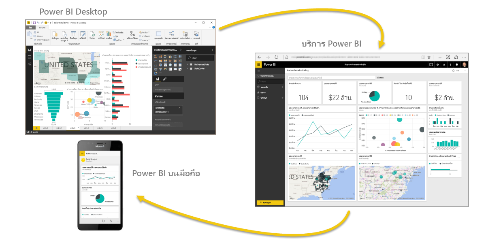

มาดูข้อมูลคร่าวๆ เกี่ยวกับสิ่งที่เราได้อธิบายไปในส่วนแรกนี้กันเถอะLet’s do a quick review of what we covered in this first section.

**Power BI** คือคอลเลกชันของบริการซอฟต์แวร์ แอป และตัวเชื่อมต่อที่ทำงานร่วมกันเพื่อเปลี่ยนข้อมูลของคุณให้เป็นข้อมูลเชิงลึกที่โต้ตอบได้**Power BI** is a collection of software services, apps, and connectors that work together to turn your data into interactive insights. คุณสามารถใช้ข้อมูลจากแหล่งข้อมูลพื้นฐานเดียว เช่น เวิร์กบุ๊ก Excel หรือดึงข้อมูลจากหลายฐานข้อมูลและแหล่งข้อมูลบนระบบคลาวด์ เพื่อสร้างชุดข้อมูลและรายงานที่ซับซ้อนได้You can use data from single basic sources, such as an Excel workbook, or pull data in from multiple databases and cloud sources to create complex datasets and reports. Power BI อาจเป็นแบบตรงไปตรงมาตามที่คุณต้องการ หรืออาจพร้อมใช้งานระดับองค์กรตามความต้องการทางธุรกิจสากลที่ซับซ้อนของคุณPower BI can be as straightforward as you want, or as enterprise-ready as your complex global business requires.

Power BI มีองค์ประกอบหลักสามอย่าง – **Power BI Desktop** **บริการของ Power BI** และ **Power BI บนมือถือ** – ซึ่งทั้งหมดจะทำงานร่วมกันเพื่อช่วยให้คุณสามารถสร้าง โต้ตอบ แชร์ และใช้ข้อมูลของคุณได้ตามที่คุณต้องการPower BI consists of three main elements – the **Power BI Desktop**, the **Power BI service**, and **Power BI Mobile** – which all work collectively to let you create, interact with, share, and consume your data how you want it.

เราได้อธิบายโครงสร้างพื้นฐานใน Power BI เช่นกัน ซึ่งได้แก่:We discussed the basic building blocks in Power BI too, which are:

* **การจัดรูปแบบการแสดงข้อมูล** – การแสดงข้อมูลด้วยภาพ ในบางครั้งเรียกว่าการแสดงผลด้วยภาพ**Visualizations** – a visual representation of data, sometimes just called visuals
* **ชุดข้อมูล** – คือคอลเลกชันของข้อมูลที่ Power BI ใช้ในการสร้างการจัดรูปแบบการแสดงข้อมูล**Datasets** – a collection of data that Power BI uses to create visualizations
* **รายงาน** – คอลเลกชันของการแสดงผลด้วยภาพจากชุดข้อมูล ที่อยู่บนหนึ่งหน้าหรือมากกว่า**Reports** – a collection of visuals from a dataset, spanning one or more pages
* **แดชบอร์ด** – คอลเลกชันหนึ่งหน้าของการแสดงผลด้วยภาพ สร้างจากรายงาน**Dashboards** – a single page collection of visuals, built from a report
* **ไทล์** – การจัดรูปแบบการแสดงข้อมูลเดียวที่อยู่ในรายงานหรือแดชบอร์ด**Tiles** – a single visualization found in a report or dashboard

จากจุดนั้น เราได้อธิบาย Power BI ในการแนะนำทางวิดีโอกับผู้แนะนำของเรา **Will Thompson**From there, we took a look at Power BI in a video tour with our Tour Guide, **Will Thompson**. Will แนะนำภาพรวมของวิธีการวิเคราะห์และการแสดงข้อมูลด้วยภาพที่คุณสามารถทำได้ด้วย Power BIWill gave us a quick overview of how you can analyze and visualize data with Power BI.

<!---
In **Power BI Desktop**, we connected to a basic Excel file, created visualizations, then published those visualizations to the service. Even if you use Power BI only with your Excel workbooks, you can gain amazing visual insights with those Excel workbooks, and both interact and share it in ways never before possible.
-->
ใน**บริการของ Power BI** เราได้สร้างแดชบอร์ดด้วยการคลิกเพียงไม่กี่ครั้งIn the **Power BI service**, we created a dashboard with just a few clicks. เรายังใช้บริการของ Power BI และใช้**ชุดเนื้อหา** ซึ่งเป็นคอลเลกชันของการแสดงผลด้วยภาพและรายงานที่พร้อมใช้งาน และเชื่อมต่อกับ**บริการซอฟต์แวร์**เพื่อสร้างชุดเนื้อหาและนำข้อมูลมาใช้งานจริงWe continued with our glimpse into the Power BI service and used a **Content Pack** – a ready-made collection of visuals and reports – and connected to a **software service** to populate the content pack and bring that data to life.

เรายังใช้คิวรีภาษาธรรมชาติ หรือที่เรียกว่า **Q & A** เพื่อถามคำถามเกี่ยวกับคำตอบของเรา และให้ Power BI สร้างการแสดงผลด้วยภาพโดยยึดตามคำถามเหล่านั้นWe also used natural language queries, called **Q & A**, to ask questions of our answers, and let Power BI create visuals based on those questions. สุดท้าย เราตั้งค่า**กำหนดการรีเฟรช**สำหรับข้อมูลของเรา เพื่อให้เรามั่นใจได้ว่าข้อมูลจะเป็นข้อมูลล่าสุดเสมอ เมื่อเรากลับไปยังบริการของ Power BILastly, we set up a **refresh schedule** for our data, so we know when we go back to the Power BI service, that data will be fresh.

## ขั้นตอนถัดไปNext steps
**ยินดีด้วย!****Congratulations!** คุณได้สำเร็จส่วนแรกของหลักสูตร **การเรียนรู้พร้อมคำแนะนำ** สำหรับ Power BI แล้วYou've completed the first section of the **Guided Learning** course for Power BI. ในตอนนี้ เรามีฐานความรู้ที่มั่นคงเพื่อย้ายไปยังส่วนถัดไป **การรับข้อมูล** ซึ่งเป็นขั้นตอนถัดไปตามลำดับการทำงานเชิงตรรกะสำหรับ Power BIYou now have a firm foundation of knowledge to move on to the next section, **Getting Data**, which is the next step in the logical flow of work for Power BI.

เราเคยกล่าวถึงเรื่องนี้มาก่อน แต่ก็คุ้มค่าที่จะเรียนรู้ใหม่อีกครั้ง: หลักสูตรนี้จะสร้างความรู้โดยการทำตามขั้นตอนการทำงานทั่วไปใน Power BI:We mentioned this before, but it's worth restating: this course builds your knowledge by following the common flow of work in Power BI:

* นำข้อมูลเข้าสู่ **Power BI Desktop** แล้วสร้างรายงานBring data into **Power BI Desktop**, and create a report.
* **เผยแพร่**ไปยังบริการของ Power BI ที่คุณสามารถสร้างการจัดรูปแบบการแสดงข้อมูลใหม่หรือสร้างแดชบอร์ด**Publish** to the Power BI service, where you create new visualizations or build dashboards
* **แชร์**แดชบอร์ดของคุณกับผู้อื่น โดยเฉพาะผู้ที่กำลังเดินทาง**Share** your dashboards with others, especially people who are on the go
* ดูและโต้ตอบกับแดชบอร์ดและรายงานที่แชร์ในแอป **Power BI บนมือถือ**View and interact with shared dashboards and reports in **Power BI Mobile** apps

คุณอาจไม่ต้องทำงานทั้งหมดนั้นด้วยตนเอง เนื่องจากบางคนอาจดูเฉพาะแดชบอร์ดในบริการที่สร้างขึ้นโดยผู้อื่นYou might not do all that work yourself - some people will only view dashboards in the service that were created by someone else. ซึ่งสามารถทำได้ แต่เนื่องจาก*คุณจะ*เรียนรู้ทุกส่วนในหลักสูตรนี้ คุณจะต้อง*ทำความเข้าใจ*วิธีการสร้างแดชบอร์ดเหล่านั้น และวิธีการเชื่อมต่อกับข้อมูล...และแม้แต่ คุณอาจตัดสินใจสร้างแดชบอร์ดของคุณเองThat's fine, but because *you'll* go through all the sections in this course, you'll *understand* how those dashboards were created, and how they connected to the data... and you might even decide to create one of your own.

เจอกันในส่วนถัดไป!See you in the next section!

