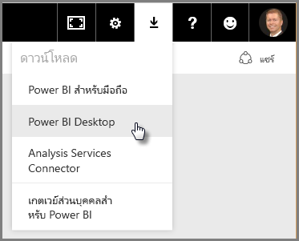
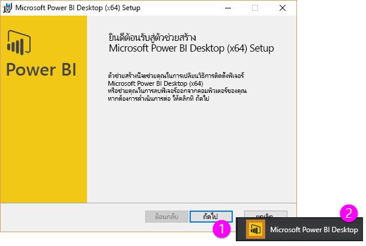
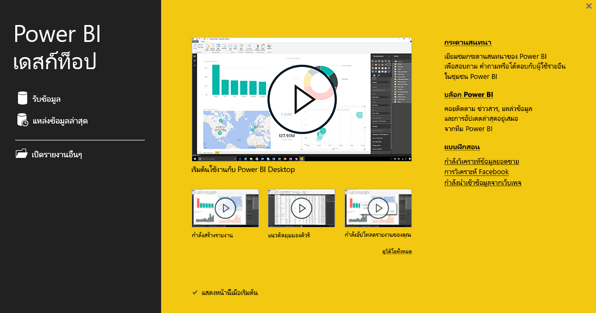

ยินดีต้อนรับสู่ส่วนที่สองในหลักสูตร **การเรียนรู้พร้อมคำแนะนำ** สำหรับ Power BI นี้ ซึ่งมีชื่อว่า **การรับข้อมูล**Welcome to the second section in this **Guided Learning** course for Power BI, called **Getting Data**. ส่วนนี้จะอธิบายฟีเจอร์และเครื่องมือจำนวนมากที่ทำงานกับข้อมูลของ Power BI โดยจะเน้นไปที่ Power BI DesktopThis section looks at the many data-centric features and tools of Power BI, focusing on Power BI Desktop. บางส่วนของเครื่องมือเหล่านี้ยังถูกนำไปใช้กับบริการของ Power BI ดังนั้น คุณจึงได้เรียนรู้หน้าที่สองอย่างด้วยการเรียนรู้ในส่วนนี้Many of these tools also apply to the Power BI service, so you're doing double duty with your learning in this section.

ในบางครั้ง เมื่อคุณรับข้อมูล ข้อมูลที่คุณได้รับอาจไม่ได้มีสภาพดี หรือ*สะอาด*ตามที่คุณต้องการWhen you get data, sometimes it's not quite as well-formed, or *clean*, as you want it to be. ดังนั้น ในส่วนนี้ คุณจะได้เรียนรู้วิธีการรับข้อมูล วิธีการทำความสะอาด (บางครั้งเรียกว่า*การทำความสะอาด*หรือ*การแปลง*ข้อมูล) และยังจะได้เรียนรู้เคล็ดลับขั้นสูงบางอย่างที่สามารถทำให้นำข้อมูลมาใช้งานจริงได้ง่ายยิ่งขึ้นSo in this section you learn how to get data, how to clean it up (sometimes called *cleaning* or *transforming* data), and also learn some advanced tricks that can make your data-getting life easier.

เช่นเดียวกับส่วนอื่นๆ ในหลักสูตรนี้ การเรียนรู้ของคุณจะตามเส้นทางเดียวกับลำดับการทำงานใน Power BIAs always in this course, your learning journey follows the same path as the flow of work in Power BI. ดังนั้น มาดูที่ **Power BI Desktop** ที่มักจะเป็นจุดเริ่มต้นAs such, let's check out **Power BI Desktop**, where it often begins.

## ภาพรวมของ Power BI DesktopAn overview of Power BI Desktop
Power BI Desktop คือเครื่องมือในการเชื่อมต่อ ทำความสะอาด และแสดงข้อมูลของคุณPower BI Desktop is a tool to connect to, clean, and visualize your data. เมื่อใช้ Power BI Desktop คุณจะสามารถเชื่อมต่อกับข้อมูล แล้วจำลองและแสดงข้อมูลด้วยวิธีต่างๆ ได้With Power BI Desktop, you can connect to data and then model and visualize it in different ways. ผู้ใช้ส่วนใหญ่ที่ทำงานกับโครงการ Business Intelligence จะใช้เวลาส่วนใหญ่ไปกับการใช้ Power BI DesktopMost users who are working on Business Intelligence projects will spend the majority of their time using Power BI Desktop.

คุณสามารถดาวน์โหลด Power BI Desktop ได้ [จากเว็บ](http://go.microsoft.com/fwlink/?LinkID=521662) คุณยังสามารถติดตั้ง **Power BI Desktop** เป็นแอปจาก [**Windows Store**](http://aka.ms/pbidesktopstore) หรือคุณสามารถดาวน์โหลดได้จากบริการของ Power BIYou can download Power BI Desktop [from the web](http://go.microsoft.com/fwlink/?LinkID=521662), you can also install **Power BI Desktop** as an app from the [**Windows Store**](http://aka.ms/pbidesktopstore), or you can download it from the Power BI service. ในบริการ เมื่อต้องการรับ **Power BI Desktop** ให้คุณเลือกปุ่มลูกศรชี้ลงที่ด้านขวาบนของ Power BI แล้วเลือก Power BI DesktopIn the service, to get **Power BI Desktop** you just select the down arrow button in the upper right side of Power BI, then select Power BI Desktop.

Power BI Desktop จะถูกติดตั้งเป็นแอปพลิเคชันบนคอมพิวเตอร์ Windows ของคุณPower BI Desktop installs as an application on your Windows computer.

ดังนั้น เมื่อคุณดาวน์โหลดแล้ว คุณจะสามารถติดตั้ง Power BI Desktop และเรียกใช้ได้เหมือนกับแอปพลิเคชันอื่นๆ บน WindowsSo once you download it, you'll install Power BI Desktop and run it like other applications on Windows. รูปภาพต่อไปนี้แสดง หน้าจอเริ่มต้น ของ Power BI Desktop ที่จะปรากฏขึ้นเมื่อคุณเริ่มต้นแอปพลิเคชันThe following image shows the Start Screen of Power BI Desktop, which appears when you start the application.

Power BI Desktop เชื่อมต่อกับแหล่งข้อมูลหลายประเภท ตั้งแต่ฐานข้อมูลภายในองค์กรไปจนถึงเวิร์กชีต Excel และบริการบนระบบคลาวด์Power BI Desktop connects to a wide variety of data sources, from local on-premises databases to Excel worksheets to cloud services. ซึ่งจะช่วยให้คุณสามารถทำความสะอาดและจัดรูปแบบข้อมูลของคุณเพื่อให้ใช้งานได้ง่ายขึ้น รวมถึงการแบ่งและการเปลี่ยนชื่อคอลัมน์ การเปลี่ยนชนิดข้อมูล และการทำงานกับวันที่It helps you clean and format your data to make it more usable, including splitting and renaming columns, changing data types, and working with dates. คุณยังสามารถสร้างความสัมพันธ์ระหว่างคอลัมน์ได้ เพื่อให้ง่ายต่อการจำลองและวิเคราะห์ข้อมูลของคุณYou can also create relationships between columns so that it's easier to model and analyze your data.

