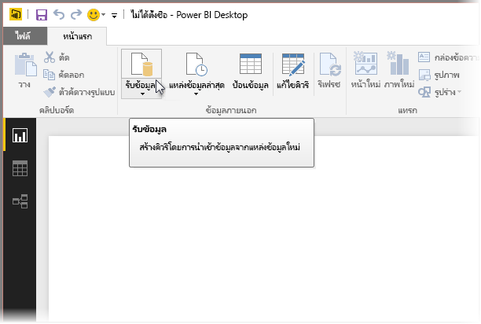
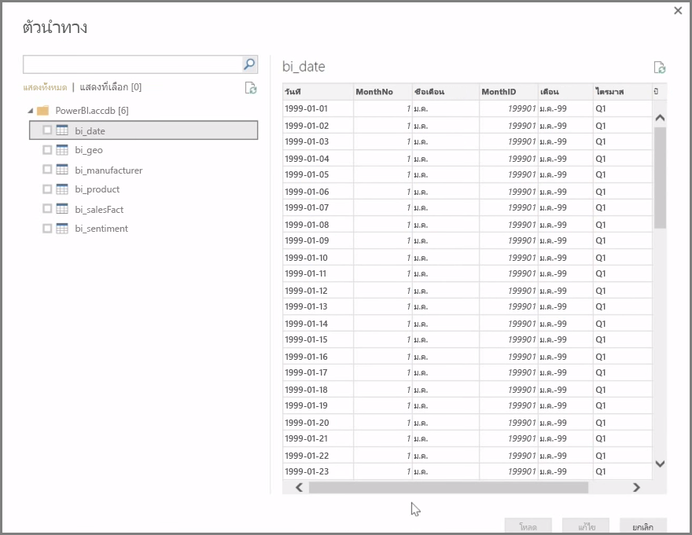
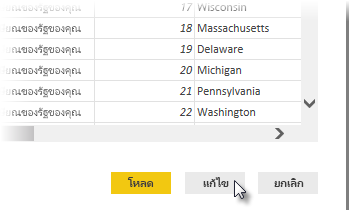

**Power BI Desktop** สามารถเชื่อมต่อกับแหล่งข้อมูลได้อย่างกว้างขวาง รวมถึง ฐานข้อมูลภายในองค์กร เวิร์กบุ๊ก Excel และบริการบนระบบคลาวด์**Power BI Desktop** can connect to a whole range of data sources, including on-premises databases, Excel workbooks, and cloud services. ขณะนี้ บริการบนระบบคลาวด์มากกว่า 59 บริการ เช่น GitHub และ Marketo มีตัวเชื่อมต่อเฉพาะแล้ว และคุณสามารถเชื่อมต่อกับแหล่งข้อมูลทั่วไปผ่านทาง XML, CSV, ข้อความ และ ODBC ได้Currently, over 59 different cloud services such as GitHub and Marketo have specific connectors, and you can connect to generic sources through XML, CSV, text, and ODBC. Power BI ยังสามารถดึงข้อมูลตารางจาก URL ของเว็บไซต์ได้โดยตรงอีกด้วย!Power BI will even scrape tabular data directly from a website URL! แต่เราจะเริ่มจากจุดเริ่มต้น ด้วยการเปิด Power BI Desktop และเชื่อมต่อกับข้อมูลBut let's start from the beginning, with opening Power BI Desktop and connecting to data.

เมื่อคุณเริ่มต้น **Power BI Desktop** และเลื่อนผ่าน หน้าจอเริ่มต้น คุณสามารถเลือก รับข้อมูล จาก Ribbon บนแท็บ **หน้าแรก**When you start **Power BI Desktop** and move past the Start Screen, you can choose Get Data from the ribbon on the **Home** tab.

ยังมีการอัปเดตรายเดือนของ Power BI Desktop และในการอัปเดตแต่ละครั้ง หน้า**มีอะไรใหม่ใน Power BI Desktop** จะมีข้อมูลใหม่ๆ เกี่ยวกับการอัปเดต ลิงก์ไปยังบล็อก และลิงก์ดาวน์โหลดThere are monthly updates to Power BI Desktop, and with each update, the **Power BI Desktop What's New** page gets updated with information about the updates, links to the blog, and a download link.

ใน Power BI Desktop จะมีแหล่งข้อมูลต่างๆ ทุกประเภทที่พร้อมใช้งานIn Power BI Desktop, there are all sorts of different data sources available. เลือกแหล่งข้อมูลเพื่อสร้างการเชื่อมต่อSelect a source to establish a connection. ระบบจะขอให้คุณค้นหาแหล่งข้อมูลบนคอมพิวเตอร์หรือเครือข่ายของคุณ หรือได้รับพร้อมท์ให้เข้าใช้บริการเพื่อรับรองความถูกต้องของคำขอของคุณ โดยขึ้นอยู่กับการเลือกของคุณDepending on your selection, you will be asked to find the source on your computer or network, or be prompted to sign in to a service to authenticate your request.

หลังจากการเชื่อมต่อ หน้าต่างแรกที่คุณจะเห็นคือ **ตัวนำทาง**After connecting, the first window you'll see is the **Navigator**. ตัวนำทางจะแสดงตารางหรือรายการของแหล่งข้อมูล และการคลิกรายการจะแสดงตัวอย่างของเนื้อหาThe Navigator displays the tables or entities of your data source, and clicking on one gives you a preview of its contents. จากนั้น คุณจะสามารถนำเข้าตารางหรือรายการที่เลือกได้ทันที หรือเลือก **แก้ไข** เพื่อแปลงและล้างข้อมูลของคุณก่อนที่จะนำเข้าYou can then import your selected tables or entities immediately, or select **Edit** to transform and clean your data before importing.

เมื่อคุณเลือกตารางที่คุณต้องการนำเข้าสู่ Power BI Desktop แล้ว คุณสามารถเลือกโหลดลงใน Power BI Desktop ได้โดยการเลือกปุ่ม **โหลด** ที่มุมขวาล่างของ **ตัวนำทาง**Once you've selected the tables you'd like to bring into Power BI Desktop, you can choose to load them into Power BI Desktop by selecting the **Load** button in the bottom right corner of **Navigator**. อย่างไรก็ตาม มีหลายครั้งที่คุณอาจต้องการเปลี่ยนแปลงตารางเหล่านั้นก่อนที่จะโหลดลงใน Power BI DesktopThere are times, however, where you might want to make changes to those tables before you load them into Power BI Desktop. คุณอาจต้องการเพียงชุดย่อยของลูกค้า หรือกรองข้อมูลนั้นให้มีเฉพาะยอดขายที่เกิดขึ้นในประเทศที่ระบุYou might want only a subset of customers, or filter that data for sales that occurred only in a specific country. ในกรณีเหล่านั้น คุณสามารถเลือกปุ่ม แก้ไข และกรองหรือแปลงข้อมูลนั้นก่อนที่จะนำเข้าสู่ Power BI DesktopIn those cases, you can select the Edit button and filter or transform that data before bringing it all into Power BI Desktop.

เราจะทำงานต่อและแก้ไขข้อมูลของเราในส่วนถัดไปWe'll pick up there, and edit our data, in the next section.

