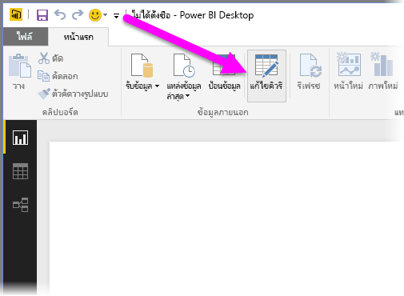
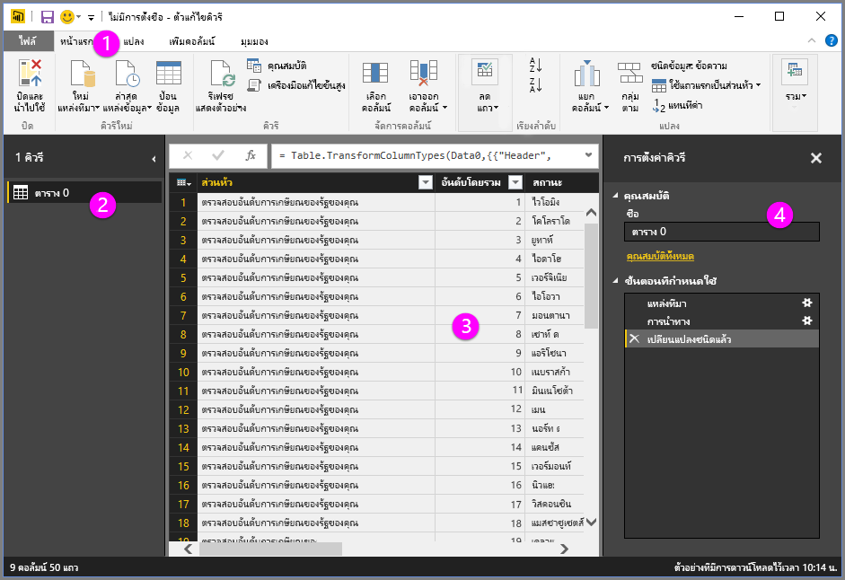
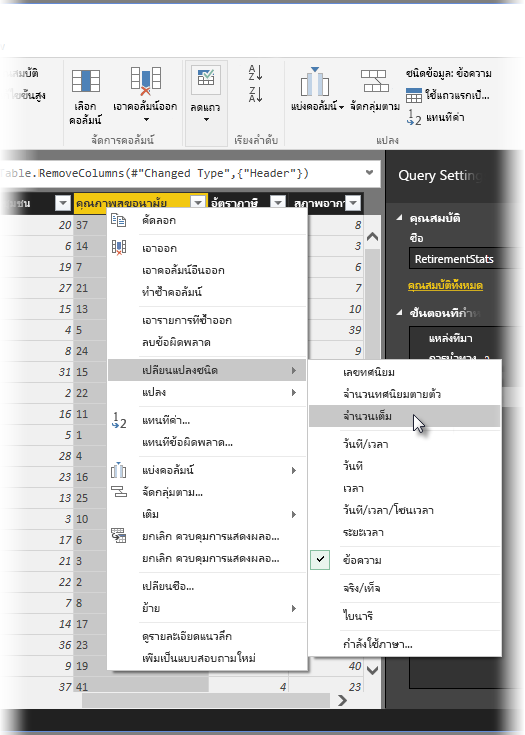
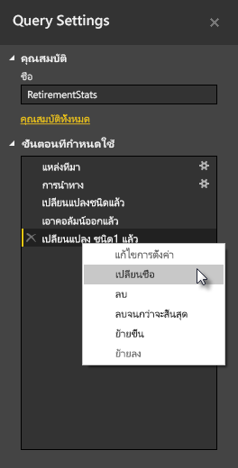
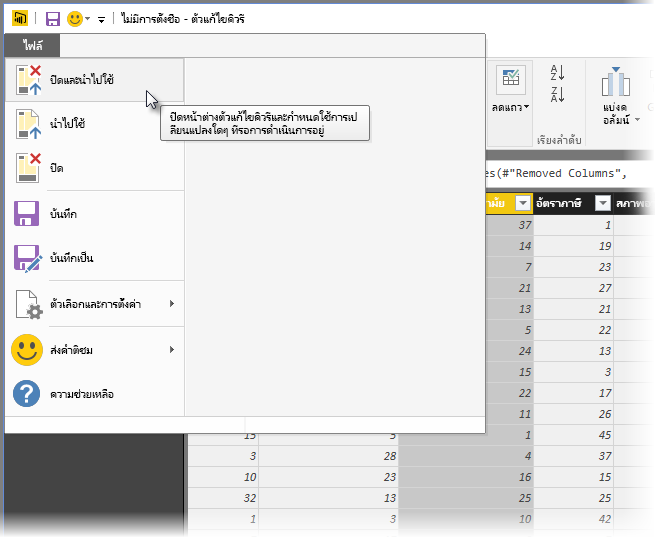
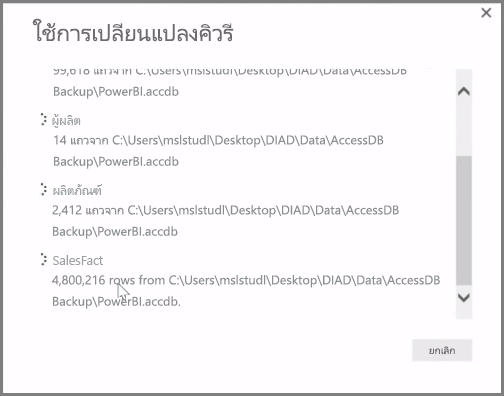

**Power BI Desktop** มี**ตัวแก้ไขคิวรี** ซึ่งเป็นเครื่องมือที่มีประสิทธิภาพสำหรับการจัดรูปร่างและการแปลงข้อมูล เพื่อให้พร้อมสำหรับแบบจำลองและการจัดรูปแบบการแสดงข้อมูลของคุณ**Power BI Desktop** includes **Query Editor**, a powerful tool for shaping and transforming data so it's ready for your models and visualizations. เมื่อคุณเลือกตัวแก้ไขจากตัวนำทาง ตัวแก้ไขคิวรีจะเปิดขึ้นพร้อมกับตารางหรือรายการอื่นๆ ที่คุณเลือกจากแหล่งข้อมูลของคุณWhen you select Edit from Navigator, Query Editor launches and is populated with the tables or other entities you selected from your data source.

คุณยังสามารถเรียกใช้**ตัวแก้ไขคิวรี**ได้โดยตรงจาก **Power BI Desktop** โดยใช้ปุ่ม **แก้ไขคิวรี** บน Ribbon **หน้าแรก**You can also launch **Query Editor** directly from **Power BI Desktop**, using the **Edit Queries** button on the **Home** ribbon.

เมื่อตัวแก้ไขคิวรีมีข้อมูลที่พร้อมให้คุณจัดรูปร่างแล้ว คุณจะเห็นส่วนต่างๆ:Once Query Editor is loaded with data that's ready for you to shape, you see a handful of sections:

1. ใน Ribbon มีปุ่มจำนวนมากพร้อมใช้งานเพื่อโต้ตอบกับข้อมูลในคิวรีIn the ribbon, many buttons are now active to interact with the data in the query
2. ในบานหน้าต่างด้านซ้าย คิวรี (สำหรับแต่ละตารางหรือรายการ) จะแสดงอยู่และพร้อมใช้งานสำหรับการเลือก การดู และการจัดรูปร่างIn the left pane, queries (one for each table, or entity) are listed and available for selection, viewing, and shaping
3. ในบานหน้าต่างตรงกลาง ข้อมูลจากคิวรีที่เลือกจะแสดงและพร้อมใช้งานสำหรับการจัดรูปร่างIn the center pane, data from the selected query is displayed and available for shaping
4. หน้าต่างการตั้งค่าคิวรีจะปรากฏขึ้น พร้อมกับคุณสมบัติของคิวรีและขั้นตอนที่ถูกนำไปใช้The Query Settings window appears, listing the query’s properties and applied steps

ในบานหน้าต่างตรงกลาง การคลิกขวาบนคอลัมน์จะแสดงการแปลงต่างๆ จำนวนหนึ่งที่พร้อมใช้งาน เช่น การนำคอลัมน์ออกจากตาราง การทำซ้ำคอลัมน์โดยใช้ชื่อใหม่ และการแทนที่ค่าIn the center pane, right-clicking on a column displays a number of different available transformations, such as removing the column from the table, duplicating the column under a new name, and replacing values. จากเมนูนี้ คุณยังสามารถแยกคอลัมน์ข้อความเป็นหลายคอลัมน์ได้โดยใช้ตัวคั่นทั่วไปFrom this menu you can also split text columns into multiples by common delimiters.

Ribbon ของ**ตัวแก้ไขคิวรี**มีเครื่องมือเพิ่มเติม เช่น การเปลี่ยนชนิดข้อมูลของข้อมูล การเพิ่มสัญลักษณ์ทางวิทยาศาสตร์ หรือการแยกองค์ประกอบจากวันที่ เช่น วันในสัปดาห์The **Query Editor** ribbon contains additional tools, such as changing the data type of columns, adding scientific notation, or extracting elements from dates, such as day of the week.

เมื่อคุณนำการแปลงไปใช้ แต่ละขั้นตอนจะปรากฏในรายการ **ขั้นตอนที่ถูกนำไปใช้** ในบานหน้าต่าง **การตั้งค่าคิวรี** ทางด้านขวาของ **ตัวแก้ไขคิวรี**As you apply transformations, each step appears in the **Applied Steps** list in the **Query Settings** pane on the right side of **Query Editor**. คุณสามารถใช้รายการเพื่อเลิกทำหรือตรวจทานการเปลี่ยนแปลงต่างๆ หรือแม้แต่เปลี่ยนชื่อของขั้นตอนYou can use this list to undo or review specific changes, or even change the name of a step. เมื่อต้องการบันทึกการเปลี่ยนของคุณ ให้เลือก **ปิดและนำไปใช้** บนแท็บ **หน้าแรก**To save your transformations, select **Close & Apply** on the **Home** tab.

เมื่อคุณเลือก **ปิดและนำไปใช้** ตัวแก้ไขคิวรีจะนำการเปลี่ยนแปลงที่คุณทำไปใช้ และนำไปใช้กับ Power BI DesktopOnce you select **Close & Apply**, Query Editor applies the query changes you made, and applies them to Power BI Desktop.

ยังมีสิ่งต่างๆ อีกมากมายที่คุณสามารถทำได้เมื่อแปลข้อมูลใน**ตัวแก้ไขคิวรี** รวมถึง การแปลงขั้นสูงThere are all sorts of things you can do when transforming data in **Query Editor**, including advanced transformations. ในส่วนถัดไป เราจะอธิบายบางส่วนของการแปลงขั้นสูงเหล่านั้น เพื่อให้คุณเข้าใจวิธีที่คุณสามารถแปลงข้อมูลของคุณด้วย**ตัวแก้ไขคิวรี**ได้อย่างไม่จำกัดIn the next section, we take a look at a few of those advanced transformations, to give you a sense of the almost immeasurable ways you can transform your data with **Query Editor**.

