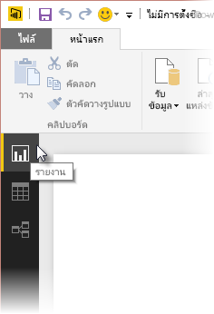
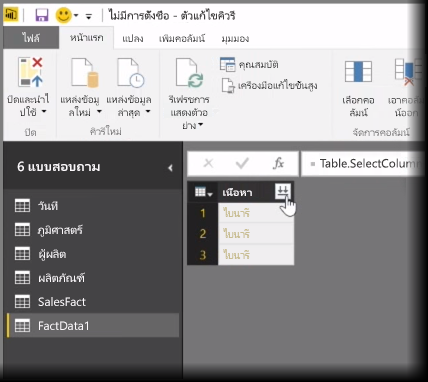
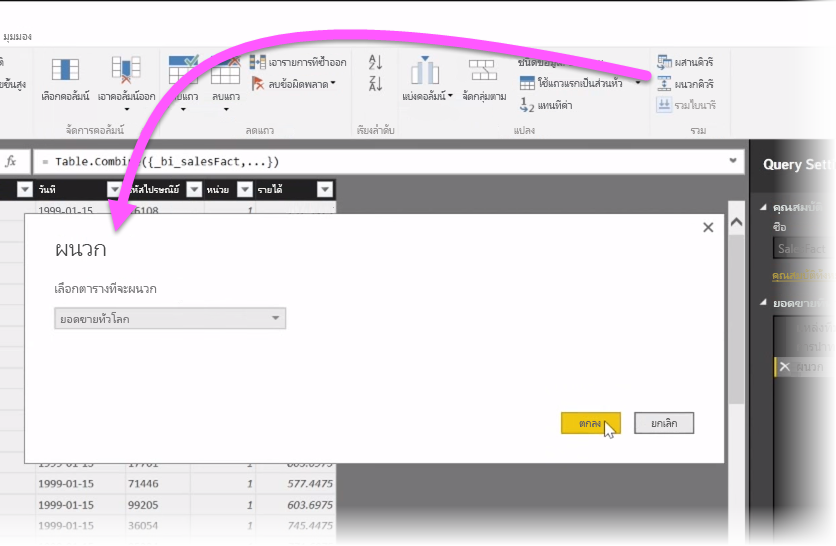
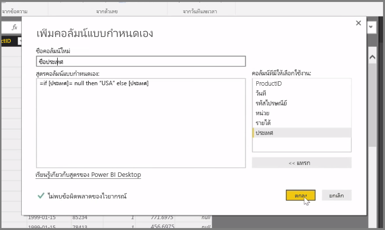

ในบทความนี้ เราจะอธิบายเทคนิคการนำเข้าและการล้างข้อมูลขั้นสูงบางอย่างสำหรับ **Power BI Desktop**In this article, we investigate some advanced data import and cleaning techniques for **Power BI Desktop**. เมื่อคุณจัดรูปทรงข้อมูลของคุณใน**ตัวแก้ไขคิวรี**และนำเข้าสู่ **Power BI Desktop** แล้ว คุณจะสามารถดูข้อมูลนั้นได้ด้วยหลายวิธีOnce you've shaped your data in **Query Editor** and brought it into **Power BI Desktop**, you can look at it in a few different ways. มีสามมุมมองใน Power BI Desktop: **รายงาน**มุมมอง**ข้อมูล**มุมมอง และ**ความสัมพันธ์**มุมมองThere are three views in Power BI Desktop: **Report** view, **Data** view, and **Relationships** view. คุณสามารถดูแต่ละมุมมองได้โดยการเลือกไอคอนทางด้านซ้ายบนของพื้นที่วาดรูปYou see each view by selecting its icon in the upper left side of the canvas. ในรูปภาพต่อไปนี้ จะมีการเลือกมุมมอง**รายงาน**ไว้แล้วIn the following image, **Report** view is selected. แถบสีเหลืองที่อยู่ถัดจากไอคอนจะระบุมุมมองที่ทำงานอยู่The yellow bar beside the icon indicates which view is active.

เมื่อต้องการเปลี่ยนมุมมอง เพียงเลือกหนึ่งในสองไอคอนที่เหลือTo change the view, just select either of other two icons. แถบสีเหลืองที่อยู่ถัดจากไอคอนจะระบุมุมมองที่ทำงานอยู่The yellow bar beside the icon indicates which view is active.

Power BI Desktop สามารถรวมข้อมูลจากหลายแหล่งข้อมูลให้เป็นรายงานเดียวได้ ไม่ว่าจะอยู่ในขั้นตอนใดก็ตามระหว่างกระบวนการการวางรูปแบบPower BI Desktop can combine data from multiple sources into a single report, at any time during the modelling process. เมื่อต้องการเพิ่มแหล่งข้อมูลเพิ่มเติมไปยังรายงานที่มีอยู่ ให้เลือก **แก้ไขคิวรี** ใน Ribbon **หน้าแรก** แล้วเลือก **แหล่งข้อมูลใหม่** ใน **ตัวแก้ไขคิวรี**To add additional sources to an existing report, select **Edit Queries** in the **Home** ribbon and then select **New Source** in **Query Editor**.

ยังมีแหล่งข้อมูลที่คุณสามารถใช้งานได้ใน **Power BI Desktop** อีกมากมายรวมถึงโฟลเดอร์There are many different possible data sources you can use in **Power BI Desktop**, including Folders. เมื่อเชื่อมต่อกับโฟลเดอร์ คุณจะสามารถนำเข้าข้อมูลจากหลายไฟล์พร้อมกัน เช่น ชุดข้อมูลของไฟล์ Excel ของไฟล์ CSVBy connecting to a folder, you can import data from multiple files at once, such as a series of Excel files or CSV files. ไฟล์ที่อยู่ภายในโฟลเดอร์ที่คุณเลือกจะปรากฏขึ้นใน **ตัวแก้ไขคิวรี** เป็นเนื้อหาแบบไบนารี และการคลิกที่ไอคอนลูกศรคู่ทางด้านบนของคอลัมน์ **เนื้อหา** จะโหลดค่าของไฟล์เหล่านั้นThe files contained within your selected folder appear in **Query Editor** as binary content, and clicking the double-arrow icon at the top of the **Content** column loads their values.

หนึ่งในเครื่องมือที่มีประโยชน์ที่สุดของ Power BI คือ *ตัวกรอง*One of Power BI's most useful tools is its *Filters*. ตัวอย่างเช่น การเลือกลูกศรดรอปดาวน์ที่อยู่ถัดจากคอลัมน์ จะเป็นการเปิดรายการตรวจสอบของตัวกรองข้อความที่คุณสามารถใช้เพื่อนำค่าออกจากแบบจำลองของคุณFor example, selecting the drop-down arrow next to a column opens a checklist of text filters that you can use to remove values from your model.

คุณยังสามารถผสานและผนวกคิวรี และเปลี่ยนหลายตาราง (หรือข้อมูลจากไฟล์ต่างๆ ในโฟลเดอร์) ให้เป็นตารางเดียวที่มีเฉพาะข้อมูลที่คุณต้องการYou can also merge and append queries, and turn multiple tables (or data from various files, in folders) into a single table that contains just the data you want. คุณสามารถใช้เครื่องมือ **ผนวกคิวรี** เพื่อเพิ่มข้อมูลจากตารางใหม่ไปยังคิวรีที่มีอยู่You can use the **Append Queries** tool to add the data from a new table to an existing query. Power BI Desktop จะพยายามจับคู่คอลัมน์ในคิวรีของคุณ ซึ่งคุณสามารถปรับใน**ตัวแก้ไขคิวรี**ได้ตามความจำเป็นในภายหลังPower BI Desktop attempt to match up the columns in your queries, which you can then adjust as necessary in **Query Editor**.

สุดท้ายนี้ เครื่องมือ **เพิ่มคอลัมน์แบบกำหนดเอง** จะทำให้ผู้ใช้ขั้นสูงมีตัวเลือกในการเขียนนิพจน์ของคิวรีตั้งแต่เริ่มต้นโดยใช้ภาษา M ที่มีประสิทธิภาพFinally, the **Add Custom Column** tool gives advanced users the option of writing query expressions from scratch using the powerful M language. คุณสามารถเพิ่มคอลัมน์แบบกำหนดเองโดยยึดตามคำสั่งในภาษาคิวรี M และได้รับข้อมูลของคุณตามที่คุณต้องการYou can add a custom column based on M query language statements, and get your data just the way you want it.

