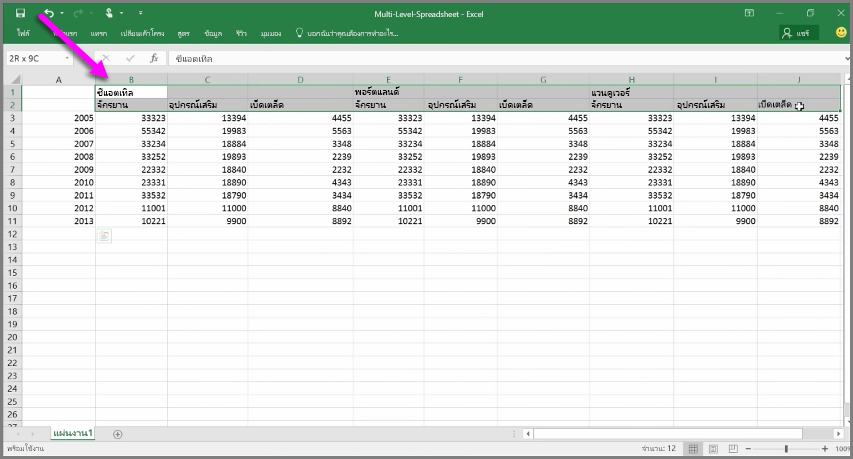
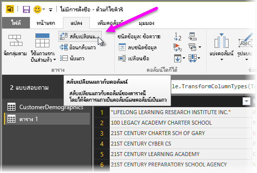
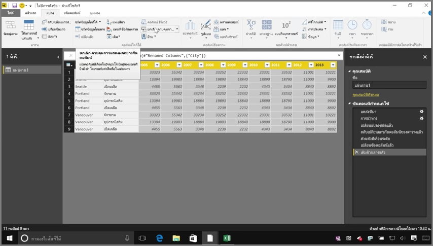
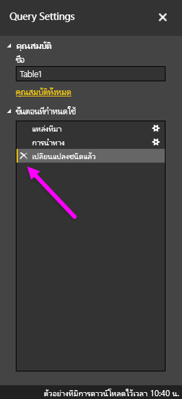
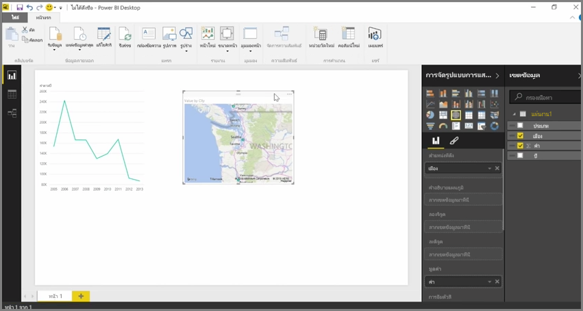

ขณะที่ Power BI สามารถนำเข้าข้อมูลของคุณได้จากเกือบทุกแหล่งข้อมูล เครื่องมือการจัดรูปแบบการแสดงข้อมูลและการวางรูปแบบก็สามารถทำงานได้อย่างดีเยี่ยมกับข้อมูลที่เป็นคอลัมน์While Power BI can import your data from almost any source, its visualization and modeling tools work best with columnar data. ในบางครั้ง ข้อมูลของคุณจะถูกจัดรูปแบบให้เป็นคอลัมน์ง่ายๆ ซึ่งมักจะเกิดขึ้นเมื่อคุณใช้สเปรดชีต Excel ซึ่งมีเค้าโครงตารางลักษณะสวยงามที่ไม่จำเป็นต้องปรับสำหรับคิวรีอัตโนมัติSometimes your data will not be formatted in simple columns, which is often the case with Excel spreadsheets, where a table layout that looks good to the human eye is not necessarily optimal for automated queries. ตัวอย่างเช่น สเปรดชีตต่อไปนี้มีส่วนที่ขยายเป็นหลายคอลัมน์For example, the following spreadsheet has headers that span multiple columns.

โชคดีที่ Power BI มีเครื่องมือในการแปลงตารางหลายคอลัมน์ให้เป็นชุดข้อมูลที่คุณสามารถใช้งานได้อย่างรวดเร็วFortunately, Power BI has tools to quickly transform multi-column tables into datasets that you can use.

## สลับเปลี่ยนแถวข้อมูลกับคอลัมน์Transpose data
ตัวอย่างเช่น เมื่อใช้ **สลับเปลี่ยนแถวกับคอลัมน์** ใน **ตัวแก้ไขคิวรี** คุณจะสามารถพลิกข้อมูล (เปลี่ยนคอลัมน์ให้เป็นแถว และเปลี่ยนแถวให้เป็นคอลัมน์) เพื่อให้คุณสามารถแบ่งข้อมูลเป็นรูปแบบที่คุณสามารถจัดการได้For example, using **Transpose** in **Query Editor**, you can flip data (turn columns to rows, and rows into columns) so you can break data down into formats that you can manipulate.

เมื่อคุณทำเช่นนี้เพียงไม่กี่ครั้ง ตามที่ได้อธิบายไว้ในวิดีโอ ตารางของคุณจะเริ่มมีลักษณะที่ Power BI สามารถนำไปใช้งานได้ง่ายยิ่งขึ้นOnce you do that a few times, as described in the video, your table begins to shape into something that Power BI can more easily work with.

## จัดรูปแบบข้อมูลFormat data
คุณยังอาจต้องจัดรูปแบบข้อมูล เพื่อให้ Power BI สามารถจัดประเภทและระบุข้อมูลได้อย่างถูกต้องเมื่อนำเข้าYou also may need to format data, so Power BI can properly categorize and identify that data once it's imported.

ด้วยการแปลงต่างๆ รวมถึง *การเพิ่มระดับแถวให้เป็นส่วนหัว* เพื่อแบ่งส่วนหัว การใช้ **เติม** เพื่อเปลี่ยนค่า *Null* ให้เป็นค่าที่อยู่ทางด้านบนหรือด้านล่างของคอลัมน์ที่ระบุ และ **ยกเลิกคอลัมน์** คุณสามารถล้างข้อมูลนั้นไปเป็นชุดข้อมูลที่คุณสามารถใช้ใน Power BI ได้With a handful of transformations, including *promoting rows into headers* into to break headers, using **Fill** to turn *null* values into the values found above or below in a given column, and **Unpivot Columns**, you can cleanse that data into a dataset that you can use in Power BI.

เมื่อใช้ Power BI คุณสามารถทดลองใช้การแปลงเหล่านี้กับข้อมูลของคุณ และกำหนดชนิดข้อมูลที่จะทำเป็นรูปแบบตารางที่ทำงานกับ Power BI ได้With Power BI, you can experiment with these transformations on your data, and determine which types get your data into the columnar format that lets Power BI work with it. และจำไว้ว่า การกระทำทุกอย่างที่คุณทำจะถูกบันทึกไว้ในส่วนขั้นตอนที่ถูกนำไปใช้ของตัวแก้ไขคิวรี ดังนั้น ถ้าการแปลงไม่ทำงานตามที่คุณคาดไว้ คุณสามารถคลิก **x** ที่อยู่ถัดจากขั้นตอน แล้วเลิกทำได้And remember, all actions you take are recorded in the Applied Steps section of Query Editor, so if a transformation doesn't work the way you intended, you can simply click the **x** next to the step, and undo it.

## สร้างการแสดงผลด้วยภาพCreate visuals
เมื่อข้อมูลของคุณอยู่ในรูปแบบที่ Power BI สามารถใช้ได้ ไม่ว่าจะด้วยการแปลงและการล้างข้อมูล คุณสามารถเริ่มสร้างการแสดงข้อมูลได้Once your data is in a format that Power BI can use, by transforming and cleansing the data, you can begin to create visuals.

## ขั้นตอนถัดไปNext steps
**ยินดีด้วย!****Congratulations!** คุณได้สำเร็จส่วนนี้ของหลักสูตร **การเรียนรู้พร้อมคำแนะนำ** สำหรับ Power BI แล้วYou've completed this section of the **Guided Learning** course for Power BI. ในตอนนี้ คุณทราบวิธีการ**รับข้อมูล**เข้าสู่ Power BI Desktop และวิธีการ*จัดรูปทรง*หรือ*แปลง*ข้อมูลนั้น เพื่อให้คุณสามารถสร้างการแสดงข้อมูลที่ดูน่าสนใจได้แล้วYou now know how to **get data** into Power BI Desktop, and how to *shape* or *transform* that data, so you can create compelling visuals.

ขั้นตอนถัดไปในการเรียนรู้การทำงานของ Power BI และการทำงานที่เหมาะ*สำหรับคุณ*คือการทำความเข้าใจสิ่งที่ใช้ใน**การวางรูปแบบ**The next step in learning how Power BI works, and how to make it work *for you*, is to understand what goes into **modeling**. ตามที่คุณได้เรียนรู้ **ชุดข้อมูล**คือโครงสร้างพื้นฐานของ Power BI แต่บางชุดข้อมูลอาจซับซ้อนและยึดตามแหล่งข้อมูลจำนวนมากAs you learned, a **dataset** is a basic building block of Power BI, but some datasets can be complex and based on many different sources of data. และในบางครั้ง คุณต้องเพิ่มสัมผัสพิเศษของคุณเอง (หรือ*เขตข้อมูล*) ให้กับชุดข้อมูลที่คุณสร้างAnd sometimes, you need to add your own special touch (or *field*) to the dataset you create.

คุณจะได้เรียนรู้เกี่ยวกับ**การวางรูปแบบ** และสิ่งอื่นๆ อีกมากมายในส่วนถัดไปYou'll learn about **modeling**, and a whole lot more, in the next section. เจอกันที่นั่น!See you there!

